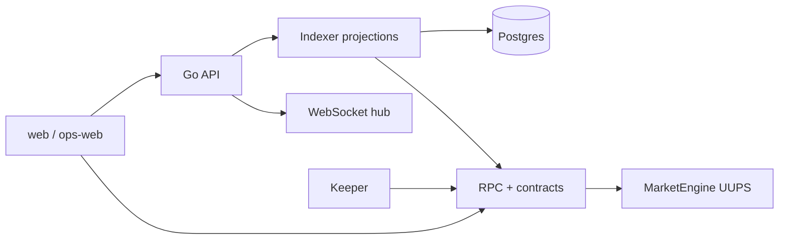

# AGENTS.md — RetroPick Agent Contract

## Mission

Build and maintain **RetroPick Markets V1** (Polymarket-native web + Go BFF + Android) and **PRISM** (future). Legacy epoch MarketEngine is archived under `archive/` — do not extend it for new work.

**Primary docs:** [`.dev/markets-v1/agent-harness/AGENT_OPERATING_CONTRACT.md`](.dev/markets-v1/agent-harness/AGENT_OPERATING_CONTRACT.md)

## Architecture summary

## Markets V1 (Polymarket product)

When working on **RetroPick Markets** (not legacy epoch):

1. Read [.dev/markets-v1/agent-harness/AGENT_OPERATING_CONTRACT.md](.dev/markets-v1/agent-harness/AGENT_OPERATING_CONTRACT.md) first.
2. Check `current_phase` in [.dev/markets-v1/agent-harness/implementation-manifest.yaml](.dev/markets-v1/agent-harness/implementation-manifest.yaml).
3. Use shared OpenAPI: [schemas/openapi/markets-v1.yaml](schemas/openapi/markets-v1.yaml).
4. Greenfield backend: `apps/backend/internal/markets/` — do not extend legacy epoch routes.
5. PRISM and legacy epoch v1 are out of scope unless explicitly tasked.

## Twenty harness agents (orchestrator-managed)

| Agent slug | Focus |
|------------|--------|
| `orchestrator` | Sequencing, scope, Kanban, `DECISIONS.md` |
| `sc-market-engine` | Dispatcher, modules, `MarketEngineState`, epoch math |
| `sc-oracles` | Chainlink adapters, trusted reporter, feed IDs, staleness |
| `sc-deploy-upgrades` | Foundry deploy/upgrade scripts, proxy wiring |
| `sc-testing` | Solidity tests, gas snapshots, invariant fuzz where used |
| `be-api` | HTTP routers, auth, CORS, rate limits, public API shapes |
| `be-indexer` | Log sync, reorg, `chain_events`, projections |
| `be-keeper` | Job model, executor, incidents, preflight |
| `be-funding` | Funding abstraction, workers, provider adapters |
| `be-realtime` | Durable envelopes, `pg_notify`, websocket hub |
| `be-data` | Migrations, sqlc, pool tuning |
| `fe-markets (web Markets routes)` | Markets UI, charts, epoch UX, trading flows |
| `fe-wallet` | wagmi/viem/AppKit, chain config, errors |
| `fe-ops` | Operator dashboard surfaces |
| `pkg-abi-registry` | Workspace packages, ABI generation, contract registry scripts |
| `security` | Trust boundaries, keys, admin surfaces |
| `qa-integration` | Cross-stack verification, CI alignment |
| `docs-curator` | README, technical docs consistency |
| `devops-sre` | Docker Compose, desktop hairpin env, release paths |
| `harness-librarian` | Manifest, tasks, RAG, MCP, skills sync |

Full personas: `.harness/agents/<slug>.agent.md`.

## Coding rules

- Match existing **Go** and **TypeScript** conventions per subtree.
- Run **Foundry** tests for any contract change.
- Never commit secrets, deploy keys, or operator mnemonics.

## Read order

1. `.harness/project.manifest.json`
2. `.harness/project-context.md`
3. `contracts/legacy-pool-v1/currentSmartContract.md`
4. `README.md` → `docs/README.md` (doc map)
5. `ORCHESTRATOR.md` and `DECISIONS.md`
6. `.dev/backend/architecture.md` (backend map)

Harness playbooks: `$AGENT_HARNESS_HOME/docs/kit/`

## opensrc / Graphify references

When using external opensrc repositories for architecture or refactor guidance,
read `.ai/AGENTS-opensrc.md` first. Treat external repositories as references
only; do not replace RetroPick's Go backend, Postgres projection model, Next
frontends, or pool-based `MarketEngine` architecture.

## Learned User Preferences

- Markets V1 markdown under `.dev/markets-v1/` should keep a short `## Description` then `## 0. Developer intent (5W+1H)` (Who/What/When/Where/Why/How plus a worked example) after title/metadata and before normative body; do not rewrite existing body when adding those sections.
- Avoid gambling UX copy in Markets docs and product language (no bet-slip / wager / casino / jackpot framing).
- Do not invent APIs, addresses, or ADRs when editing Markets V1 docs; preserve Never V1 / ADR-009 language (no auto-copy, no signal→order path).
- Treat local `ECC/` as read-only engineering methodology reference; RetroPick code and contracts remain authoritative—do not install ECC, commit ECC changes, or copy the framework into the repo.
- Prefer plan → verify → implement loops for Markets V1 doc/architecture work; keep documentation accurate and agent-usable rather than merely longer.
- Money amounts in Markets backend docs/code guidance are fixed-point, never floating point.

## Learned Workspace Facts

- Markets V1 product goal and phase framing live in `.dev/MARKETS.md`; the engineering doc system is `.dev/markets-v1/**` (including `phases/`, `architecture/` with C4/ADRs, and domain folders).
- Smart Money / trader intelligence specs live under `.dev/markets-v1/intelligence/`; compute belongs in `apps/backend/internal/markets/intelligence/` with params such as `intelligence_params_v1.yaml`.
- Polymarket is the venue authority for Markets V1; RetroPick does not define a custom Markets exchange.
- Intelligence follow lists are private by default; paper copy and backtests are simulated only and must not be presented as venue/Polymarket fills.
- Markets V1 Android surfaces are Kotlin + Jetpack Compose.
- Backend Markets data is projection/read models, not ownership authority, unless a doc explicitly says otherwise.

<claude-mem-context>
# Memory Context

# [retropick] recent context, 2026-06-09 3:33pm GMT+7

Legend: 🎯session 🔴bugfix 🟣feature 🔄refactor ✅change 🔵discovery ⚖️decision 🚨security_alert 🔐security_note
Format: ID TIME TYPE TITLE
Fetch details: get_observations([IDs]) | Search: mem-search skill

Stats: 32 obs (15,208t read) | 740,608t work | 98% savings

### Jun 2, 2026
21 7:37p ⚖️ RetroPick Production Hardening Implementation Plan Adopted
22 " 🔵 RetroPick Repository Structure and Architecture Baseline
23 " 🔵 Large Volume of Uncommitted Changes Across All Layers
24 7:39p 🔵 WebSocket Hub Security: Default-Broadcast Behavior Violates Default-Deny Requirement
25 " 🔵 Rate Limiter Uses Unbounded Global Map — Memory Leak on Unique IPs
26 " 🔵 CORS Default-Open in Non-Strict Mode; Operator Auth Shares User JWT Secret
27 " 🔵 Production Infra Already Partially Built: docker-compose, nginx Template, 6 Backend Services
28 " 🔵 Backend Internal Module Inventory: metrics, launchboard, marketdata, keeper, feedregistry All Present
29 7:40p 🔵 RETRODEPLOYER Missing Helper Scripts in package/smart-contract/scripts/
30 " 🔵 Production Config Validation Tests and Production Startup Guards Already Implemented
31 " 🔴 WebSocket Hub Default-Deny Implemented and nginx API Route Widened
32 " 🔴 Rate Limiter Hardened: Bounded Map, TTL Eviction, and CIDR-Gated Proxy Trust
33 " 🔵 Monorepo market/scripts Are Thin Wrappers That Delegate to Missing package/contract Scripts
34 7:41p 🔵 Cost Estimator Script Is Self-Contained Python with --rpc-url Flag — No Missing Dependencies
35 7:42p 🟣 Root-Aware `retro` CLI Implemented with doctor, stack, db, contracts, costs Commands
36 " ✅ CLI Shell Tests Added for Cross-Directory Invocation of retro
37 " 🔵 chmod Failure: Scripts Unreachable from apps/backend Working Directory
38 7:43p 🟣 retro CLI Tests and doctor Verified — All Checks Pass Except Known Missing Legacy Helpers
39 " 🔴 Webhook Secret Hardened to Constant-Time Comparison; Production Startup Validates Settlement Addresses
40 " ✅ Git Diff Confirms Complete Working Tree State: 167 Files, 3219 Insertions, 14564 Deletions
41 " 🟣 All Go Tests and RETRODEPLOYER Shell Tests Pass
42 " 🔵 Chart Data Plane Gap: price_candles Table Exists but No Worker Polls Chainlink
43 7:44p 🔴 IngestTick Consolidated to Single Transaction; probability_points Race Fixed with Postgres Sequence
44 " 🔵 ChartHandler Default Feed Fallback Uses templateId Instead of Feed Address
45 " 🔵 Git Status Confirms All New Files Are Untracked — No Commits Yet in This Session
46 7:45p 🔵 ChainMarketDetail Does Not Subscribe to chart: WebSocket Channel and Uses No feedId
47 " 🟣 primaryFeedId Wired End-to-End: Backend Resolves Feed, API Returns It, Frontend Subscribes to chart Channel
48 7:46p 🟣 Full Go Test Suite Passes After All Stage 2 and 3 Data Plane Changes
49 " 🔴 Postgres Listener Hardened with Auto-Reconnect and Catch-Up on Reconnect
50 " 🔴 pglisten Inner Notification Loop Added — One Connection Serves Multiple Events Without Unnecessary Reconnects
51 7:47p 🔵 PRODUCTION.md Patch Failed — Context Mismatch on funding-worker Line
52 " ✅ Docs and .gitignore Hygiene Applied: Python Caches Ignored, retro CLI Documented in README and PRODUCTION

Access 741k tokens of past work via get_observations([IDs]) or mem-search skill.
</claude-mem-context>
