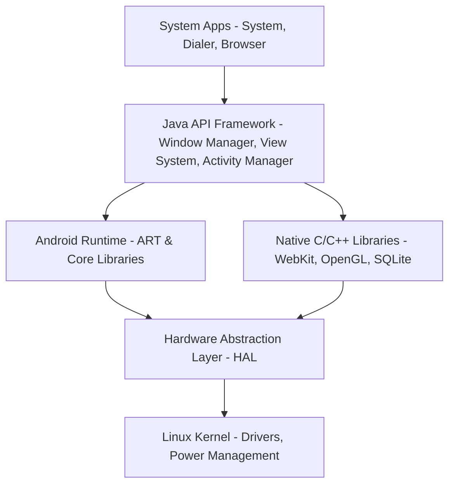

# Panduan Dasar Pengembangan Android

Selamat datang di folder informasi Android! Dokumen ini berisi rangkuman fundamental mengenai pengembangan aplikasi Android untuk membantu Anda memahami ekosistemnya.

---

## 📱 1. Apa itu Android?
Android adalah sistem operasi berbasis open-source (menggunakan kernel Linux) yang dirancang khusus untuk perangkat layar sentuh seperti smartphone dan tablet. Awalnya dikembangkan oleh Android Inc. dan kemudian diakuisisi oleh Google pada tahun 2005.

---

## 🏗️ 2. Arsitektur Android
Sistem operasi Android dibagi menjadi beberapa lapisan (layer) utama:



1. **System Apps:** Aplikasi bawaan (Telepon, Kontak, Browser) serta aplikasi pihak ketiga yang Anda instal.
2. **Java API Framework:** API tertulis dalam bahasa Java yang digunakan oleh pengembang untuk membangun aplikasi (misalnya: View System, Notification Manager, Activity Manager).
3. **Android Runtime (ART) & Core Libraries:** Setiap aplikasi berjalan di prosesnya sendiri dengan instance ART-nya sendiri. Mengubah kode bytecode menjadi instruksi native.
4. **Native C/C++ Libraries:** Library tingkat rendah yang digunakan oleh sistem (misalnya: WebKit untuk browser, OpenGL untuk grafis, SQLite untuk database).
5. **Hardware Abstraction Layer (HAL):** Menyediakan antarmuka standar yang menghubungkan framework Java tingkat atas ke perangkat keras fisik (seperti kamera, bluetooth, audio).
6. **Linux Kernel:** Fondasi dasar yang mengatur driver perangkat keras, memori, proses, dan keamanan tingkat rendah.

---

## 🧩 3. 4 Komponen Utama Aplikasi Android
Setiap aplikasi Android dibangun menggunakan satu atau beberapa komponen berikut:

| Komponen | Deskripsi |
| :--- | :--- |
| **Activity** | Antarmuka pengguna (UI) satu layar tunggal (seperti halaman Login, halaman Home). |
| **Service** | Komponen yang berjalan di latar belakang (background) tanpa UI (misalnya: memutar musik atau mendownload file). |
| **Broadcast Receiver** | Menerima pesan/pengumuman dari sistem atau aplikasi lain (misalnya: notifikasi baterai lemah, mode pesawat aktif). |
| **Content Provider** | Mengelola dan berbagi data aplikasi dengan aplikasi lain (misalnya: membaca data Kontak telepon). |

---

## 🛠️ 4. Setup Pengembangan Android Modern

Untuk mulai ngoding Android sekarang, standar industri yang direkomendasikan adalah:

### **Bahasa Pemrograman**
* **Kotlin (Direkomendasikan oleh Google):** Bahasa modern, ringkas, aman (*null-safety*), dan 100% interoperable dengan Java.
* **Java:** Bahasa tradisional Android. Masih banyak digunakan untuk project lama (*legacy*).

### **Alat Pengembangan (IDE)**
* **Android Studio:** IDE resmi berbasis IntelliJ IDEA dari JetBrains. Dilengkapi dengan emulator, profiler kinerja, dan editor layout visual.

### **Framework UI Modern**
* **Jetpack Compose:** Toolkit modern untuk membuat UI secara deklaratif (menulis UI langsung dengan kode Kotlin, mirip Flutter/React). Ini adalah standar baru menggantikan XML Layout tradisional.

---

## 📁 5. Contoh Struktur Folder Project Android (Gradle)
Berikut adalah struktur folder standar proyek Android di Android Studio:

```text
NamaProject/
├── app/                  # Modul utama aplikasi Anda
│   ├── build.gradle      # Konfigurasi build (dependencies, SDK version) untuk modul app
│   └── src/
│       ├── main/
│       │   ├── java/     # Kode sumber Kotlin/Java Anda
│       │   ├── res/      # Resource non-code (Gambar, Layout XML, String, Warna)
│       │   └── AndroidManifest.xml # File konfigurasi utama aplikasi (izin, komponen, dll)
├── gradle/               # Wrapper Gradle untuk build system
├── build.gradle          # Konfigurasi build tingkat proyek
└── settings.gradle       # Daftar modul yang disertakan dalam proyek
```

---

## 🚀 Langkah Pertama untuk Mulai:
1. Unduh dan instal [Android Studio](https://developer.android.com/studio).
2. Buat proyek baru pilih template **"Empty Modern Activity"** (menggunakan Jetpack Compose & Kotlin).
3. Jalankan aplikasi pertama Anda ("Hello World") di Emulator bawaan atau langsung menggunakan HP Android asli dengan mengaktifkan *USB Debugging*.
