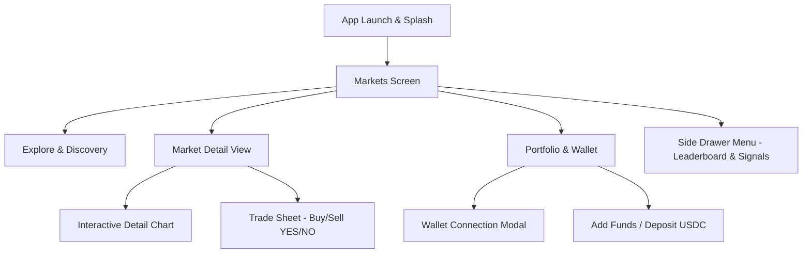

# 📱 RetroPick Android - Mobile Application Demo & Architecture Guide

> **RetroPick Android**: The premier native mobile prediction market client powered by Capacitor, Next.js 16, and Polymarket live liquidity feeds.

---

## 🌟 Executive Summary

**RetroPick Android** brings real-time, decentralized prediction market trading directly to mobile devices. Designed with a high-performance Cyber-Neon aesthetic and optimized for mobile touch interaction, RetroPick allows users to forecast real-world outcomes across Crypto, Finance, Sports, Politics, Tech & AI, and Global Events with instantaneous order execution.

---

## 🚀 Key Application Features & Navigation Flow



---

## 📱 Interactive Screen Walkthrough

### 1. 🏠 Markets Screen (`MarketsScreen`)
- **Category Filter Bar**: Quickly switch between *All, Crypto, Finance, Sports, Tech & AI, Politics, Pop Culture, Science*.
- **Search & Sort**: Filter by 24h Volume, Highest Liquidity, % Change, or Ending Soon.
- **Market Cards**: Displays current YES probability, 24h volume, interactive price mini-sparkline, and 1-tap outcome buttons.
- **Watchlist Toggle**: Bookmark favorite markets for quick tracking.

### 2. 🔍 Explore & Discovery (`ExploreScreen`)
- **Featured Banners**: Highlights high-volatility & trending prediction events (e.g., Bitcoin milestones, Fed Rate decisions, Tech earnings).
- **Category Grid**: Visual tile cards leading directly to specialized event pools.
- **High Conviction Picks**: Live feeds sorted by smart money volume and social momentum.

### 3. 📊 Market Detail Screen (`MarketDetail`)
- **Interactive Price Chart**: Toggle timeframes (`24H`, `7D`, `30D`, `ALL`) to analyze probability trends over time.
- **Order Book & Market Stats**: View live bid/ask spread, total liquidity, resolution date, and verified resolution source.
- **Rules & Oracle Details**: Transparent breakdown of resolution criteria powered by UMA / Polymarket oracle rules.

### 4. ⚡ Trade Sheet Drawer (`TradeSheet`)
- **Outcome Selection**: Seamlessly toggle between **YES** and **NO** contracts.
- **Amount & Leverage Inputs**: Presets ($10, $50, $100, Max) with automatic share calculation and potential return on investment (ROI %).
- **Instant Execution**: 1-tap trade authorization with optimistic UX updates and visual feedback.

### 5. 💼 Portfolio & Asset Management (`PortfolioScreen`)
- **Net Worth Overview**: Displays total balance, active position value, and lifetime PnL.
- **Active Positions**: Real-time position tracking with current contract value, average buy price, and unrealized profit/loss.
- **Open Orders & History**: Manage active limit orders and view past executed trades.
- **Claim Winnings**: Instant 1-tap payout redemption for resolved markets.

### 6. 💳 Web3 Wallet & Fund Onboarding (`ConnectModal` & `AddFundsModal`)
- **Multi-Wallet Support**: Seamless connection via Coinbase Wallet, MetaMask, WalletConnect, or embedded Social Logins.
- **USDC Deposit**: Deposit USDC on Base or Polygon network with built-in QR code address scanner.

---

## 🛠️ Technical Stack & Build Setup

| Component | Technology | Description |
| :--- | :--- | :--- |
| **Framework** | Next.js 16 (App Router) | Static export (`output: 'export'`) optimized for mobile webview. |
| **Mobile Runtime** | Capacitor 8 | Native iOS/Android bridge and status bar/splash integration. |
| **Styling & UI** | Tailwind CSS v4 + Radix/Base-UI | Modern dark theme, glassmorphism, and responsive touch controls. |
| **Data Engine** | Polymarket API + WebSocket | Live market discovery, order books, and price feed updates. |
| **Android Toolchain** | Android SDK & Gradle 8.14 | Generates production `.apk` and `.aab` release binaries. |

---

## 💻 Running & Testing retroPick-Android

### 1. Web Local Preview
```bash
npm run dev
# Opens at http://localhost:3000
```

### 2. Export & Sync to Android
```bash
npm run build
npx cap sync android
```

### 3. Build Android Debug APK
```bash
cd android
.\gradlew assembleDebug
# Generated APK: android/app/build/outputs/apk/debug/app-debug.apk
```

---

## 📷 UI Preview Screenshots & Layout Summary

- **Markets Home View**: Clean grid layout with probability meters & quick trade triggers.
- **Market Detail & Chart**: Smooth vector chart rendering probability changes over time.
- **Trade Sheet Modal**: Bottom sheet design engineered for single-thumb mobile usage.
- **Portfolio Summary**: PnL cards with green/red status metrics and claimable rewards.

---
*Documentation generated for RetroPick Android v0.1.0*
