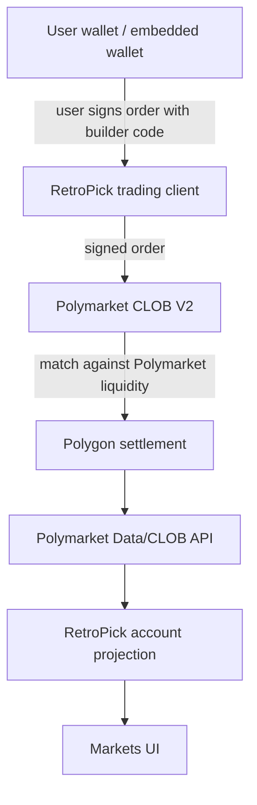
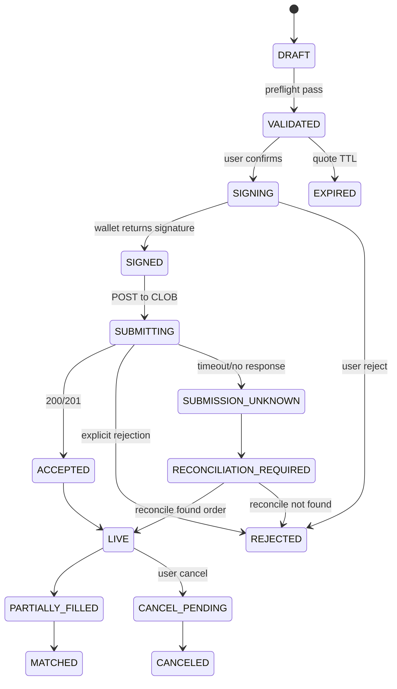
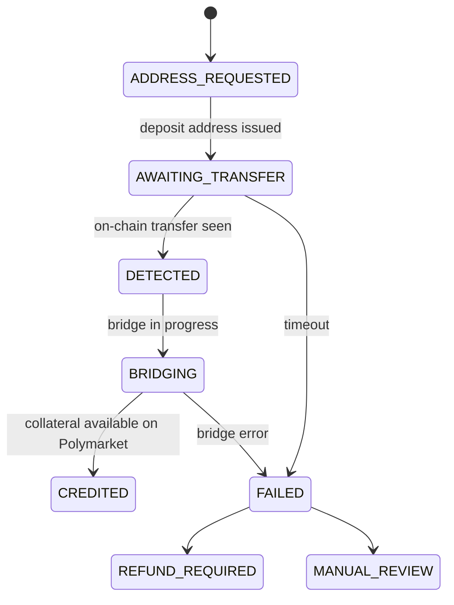

# Polymarket CLOB V2 Builder Integration — Architecture Freeze

**Status:** design freeze (not implementation authorization)  
**Phase:** documents future trading plane for Phase 2–3  
**Access date:** 2026-07-30  
**References:** [Polymarket Builders](https://docs.polymarket.com/programs/builders/overview), [V2 migration](https://docs.polymarket.com/v2-migration), [@polymarket/client](https://github.com/Polymarket/ts-sdk) (compatibility spike required before adoption)

## 1. Execution plane overview

## 2. Invariants

1. **Polymarket CLOB V2** is the sole execution venue.
2. **Polymarket liquidity** is consumed directly; RetroPick is never counterparty.
3. **No custody:** RetroPick does not hold user private keys or seed phrases.
4. **Builder code** is attached to the order payload **before** user signing.
5. **Builder attribution** is distinct from relayer authorization.
6. **Builder credentials** remain server-side; never in `NEXT_PUBLIC_*` or client bundles.
7. **User signatures** are explicitly user-authorized; no server-side user signer.
8. **Preferred SDK:** unified `@polymarket/client` after compatibility spike on Node 22 / Next 14.
9. **Geoblock/eligibility** must fail closed before any trade command (see `getMarketsEligibility`).
10. **Builder fees** (if enabled) shown transparently before signing.
11. **Idempotency** required on every trade command.
12. **Polymarket order ID** and **transaction hash** are authoritative external identifiers.
13. **RetroPick Postgres** is an operational mirror, not the settlement ledger.
14. **No success receipt** in UI before authoritative confirmation.

## 3. Order intent state machine

### Failure paths

- `REJECTED` — explicit CLOB or validation failure
- `EXPIRED` — quote or order TTL exceeded
- `SUBMISSION_UNKNOWN` — network/timeout after sign; **no automatic resubmit**
- `RECONCILIATION_REQUIRED` — worker must query CLOB by client order id / idempotency key

## 4. Funding state machine

Deposit, withdrawal, redeem, merge, and split are **separate command classes** with distinct idempotency keys and audit records.

## 5. API patterns (future)

| Pattern | Requirement |
|---------|-------------|
| `Idempotency-Key` | Required on all trade/funding commands |
| Command ID | RetroPick UUID separate from upstream order ID |
| Replay protection | Server nonce + signer identity binding |
| Quote expiration | Server timestamp validation; reject stale quotes |
| Tick/min size | Validated against market metadata from BFF |
| Allowance/balance | Preflight before `VALIDATED → SIGNING` |
| Ambiguous submit | **No** automatic retry; enter `RECONCILIATION_REQUIRED` |
| Reconciliation worker | Poll CLOB by idempotency key + signer |
| Transactional outbox | Durable local events before side effects |
| Rate limits | Per-user and per-signer |
| Audit | Immutable records; secret redaction in logs |

## 6. Security boundaries

| Asset | Location |
|-------|----------|
| Builder API key / secret | Server vault only |
| User private key | User wallet only |
| CLOB API credentials (L2) | User-authorized; never logged |
| Order payload | Signed client-side; builder code injected pre-sign |

## 7. RetroPick integration seams

| Component | Role |
|-----------|------|
| `packages/polymarket` | Read client today; future `TradingClient` interface stub only in Phase 1.2 |
| `apps/backend/internal/markets/` | Eligibility, capabilities; future command API under new OpenAPI tag |
| `apps/web` | Disabled trade CTA in Phase 1.2; future signing flows behind capability gate |
| WebSocket hub | Phase 1.3+ for fill updates; not a substitute for reconciliation |

## 8. Rejected alternatives

- **Internal liquidity pool / AMM** — violates venue authority invariant
- **Server-side signing** — custody risk
- **Legacy builder-signing packages** — superseded by CLOB V2 unified client
- **Optimistic UI on submit** — rejected; wait for authoritative confirmation

## 9. Phase 1.2 boundary

Phase 1.2 **does not** install `@polymarket/client`, implement trade endpoints, or enable signing. This document establishes the freeze for human review before Phase 2–3 implementation.
