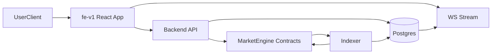

# 00 System Overview

> **Primer only.** Backend as-implemented detail: [`.dev/backend/README.md`](../../../.dev/backend/README.md). Contract detail: [`contracts/legacy-pool-v1/currentSmartContract.md`](../../../contracts/legacy-pool-v1/currentSmartContract.md).

## Purpose
This document describes the current RetroPick system as implemented today across:
- `contracts/legacy-pool-v1` (on-chain market engine and settlement model),
- `apps/backend` (API, indexer, realtime, funding services),
- `apps/web` (user-facing web app and wallet interactions).

It is implementation-first and intended as the entry point for all deeper technical docs in this folder.

## High-Level Architecture
RetroPick is a chain-connected prediction-market platform with a split between:
- on-chain canonical market lifecycle (`MarketEngineDispatcher` and modules),
- off-chain indexing/projection for query performance and UX,
- frontend market/trade UX that combines backend APIs, realtime updates, and direct wallet transactions.

## Runtime Components
- **Smart contract package**: core market logic, epoch lifecycle, oracle checkpoints, claims, fee accounting, and rolling execution model.
- **Backend API process**: serves HTTP + WS routes, mounts market/user/ops/funding routers, and runs background workers.
- **Indexer process**: ingests chain logs from MarketEngine proxy and updates relational projections.
- **Postgres**: stores indexed chain events, market snapshots, user projections, funding intent/execution records, and realtime envelopes.
- **Frontend app**: Next-hosted client app using React Router, React Query, wallet/AppKit integration, and websocket invalidation.

## End-to-End Data Path
1. Contract events are emitted from MarketEngine lifecycle/user operations.
2. Indexer reads logs, persists into `chain_events`, and updates projections.
3. Indexer/backend inserts realtime envelopes and issues `pg_notify`.
4. API websocket handler replays/fans out events to connected clients.
5. Frontend patches/invalidate React Query caches and refetches targeted resources.
6. User trade actions go through wallet transactions (with backend prepare/submit endpoints used for orchestration and observability).

## Product/Technical Intent (Inferred)
- Keep **on-chain state authoritative** for settlement and claims.
- Use **indexed projections** for low-latency reads and scalable portfolio/discover views.
- Prefer **event-driven UI freshness** (WS + replay) over hard polling only.
- Maintain **gradual migration paths** (legacy + newer APIs) to avoid hard cutovers.
- Support **guest-first behavior** (watchlist and browsing before wallet connect), then reconcile into wallet-scoped server state.

## Known Boundaries
- Some backend binaries exist as stubs (`keeper`, `alert`, `reporter`) and are not complete automation surfaces yet.
- Funding APIs currently expose both v1 (`/api/v1/funding`) and newer abstraction paths (`/api/funding`).
- Frontend is intentionally client-rendered app runtime inside a Next shell, not a full SSR page-by-page architecture.

## Doc Map
- `01_SmartContractReference.md`: canonical settlement/lifecycle model.
- `02_BackendArchitecture.md`: backend process/module architecture.
- `03_BackendFlowsAndData.md`: lifecycle, indexing, websocket, and funding flows.
- `04_FrontendArchitecture.md`: runtime composition and frontend technical structure.
- `05_FrontendUserAndTradeFlows.md`: user journeys and state sync behavior.
- `06_IntegrationContracts.md`: API/WS/contract boundary contracts.
- `07_OperationalModelAndRisks.md`: run model, assumptions, and major risks.
