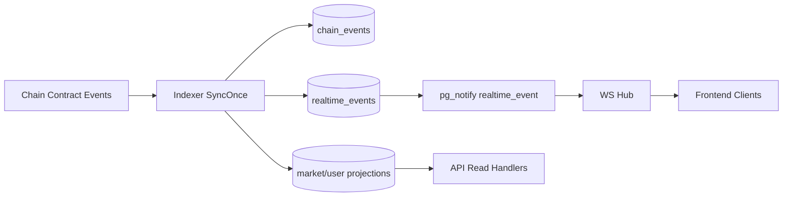

# 03 Backend Flows And Data

> **As-implemented:** [`.dev/backend/`](../../../.dev/backend/README.md) (indexer, realtime, funding).

## Core Data Flow

## Indexer Flow (On-Chain to DB)
Implemented in `internal/indexer/indexer.go`:
1. Read `indexer_state` and current chain head.
2. Apply finality depth (`INDEXER_FINALITY_DEPTH`) and compute stable range.
3. Verify continuity with `last_block_hash`; on mismatch, rewind and truncate projections.
4. Fetch logs for MarketEngine proxy in `[from, to]`.
5. Decode known events and insert into `chain_events` (idempotent by tx hash + log index).
6. Update templates/ledgers/epochs and projection tables based on event type.
7. Persist realtime envelope rows and notify listeners after transaction commit.
8. Update `indexer_state` with latest block/hash.

## Reorg Handling
- Continuity check compares stored hash with chain header.
- On mismatch, current implementation rewinds block cursor and truncates projection tables before rebuilding from chain events.
- This prioritizes deterministic recovery and consistency over serving partially stale projections.

## API Read/Write Flow
In `cmd/api/main.go` and `internal/api/*`:
- Market endpoints mostly read from projection tables.
- Certain endpoints allow live RPC source paths (`source=live`) for direct contract reads.
- User/portfolio endpoints combine indexed user projections and ledger/event data.
- Tx prepare endpoints build contract call payloads; user wallet still signs/sends chain transactions.

## WebSocket Flow
Endpoint: `/ws` in `cmd/api/main.go`.
- Client connects, receives hello, subscribes to channels.
- Channels are validated against principal/channel rules (public, user-owned, deposit-owned, ops-only).
- Replay is supported with `lastSeq` by loading missing rows from `realtime_events`.
- Ping/pong and channel limits/rate limits protect server.

## Funding Intent Flow (Abstraction V2)
1. Create intent (`/api/funding/intents`).
2. Scan balances/routes for options (`scan-balances`).
3. Select route option and create execution.
4. Track execution progression via route updates/source tx/webhook.
5. Background workers detect destination transfers, match intent/execution, and credit internal balance ledger.

## Important Data Surfaces
- **Canonical history**: `chain_events`.
- **Market projections**: `market_snapshots`, `market_epoch_outcomes`.
- **User projections**: `user_position_outcomes`.
- **Realtime stream durability**: `realtime_events`.
- **Funding state**: intent/execution and balance ledger tables.

## Implementation Intent
- Treat chain events as source-of-truth event log.
- Serve frontend from projection tables for speed and stable query shape.
- Keep websocket replayable so clients can recover from disconnects without full resync every time.
