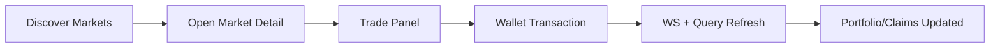

# 05 Frontend User And Trade Flows

> **App docs:** [`apps/web/README.md`](../../../apps/web/README.md).

## Primary User Journey

## Discover Flow
1. User lands on `/app/markets/all`.
2. Frontend fetches `GET /api/v1/markets`.
3. Card models are derived from market rows and outcomes/projections.
4. Vertical/category filters update visible subsets without changing backend contract shape.
5. Realtime updates patch or invalidate market lists for freshness.

## Market Detail Flow
1. Navigate to `/app/market/:templateId`.
2. Frontend fetches:
   - market detail (`/api/v1/markets/{templateId}`),
   - epochs,
   - probability history,
   - chart candles.
3. UI composes active epoch status, outcomes, and chart state into trading-ready model.
4. Websocket events refresh probability/outcome and status changes.

## Trade Flow (Buy / Switch / Claim)
### Buy/Enter
1. User sets amount/outcome.
2. Frontend obtains prepared transaction payload from backend (`/api/v1/tx/prepare/enter`).
3. Wallet signs/sends transaction to chain.
4. Frontend may submit tx metadata (`/api/v1/tx/submit`) for backend observability.
5. Indexer + WS propagate resulting projection updates.

### Switch Side
- Similar pattern using `/api/v1/tx/prepare/switch` and wallet submission.
- UI refreshes pools/probabilities and user position stakes after event indexing.

### Claim
- Prepared via `/api/v1/tx/prepare/claim`, then wallet execute.
- Claim results appear in user claims/events and portfolio aggregates.

## Portfolio Flow
1. Portfolio route loads user balance, positions, claims, portfolio summary, and watchlist.
2. Per-position market metadata and outcomes are used for enrichment/display.
3. URL params control section/vertical state for user navigation persistence.
4. Realtime user/deposit channels trigger targeted invalidation for positions/claims/events/watchlist.

## Watchlist Guest-to-Connected Flow
- Guest bookmarks can be stored client-side.
- On connect, frontend imports/merges to backend watchlist endpoint.
- Backend remains authoritative once wallet is connected.

## Funding UX Flow
- Funding dialogs may invoke faucet relay and/or funding intent APIs.
- New abstraction endpoints support intent -> options -> selection -> execution tracking.
- UI is designed to surface progress while backend workers finalize crediting.

## UX Intent
- Minimize stale UI after chain writes with replayable WS + targeted cache updates.
- Keep transactional actions explicit and recoverable.
- Support non-connected exploratory usage while preserving a clean path to connected state.
