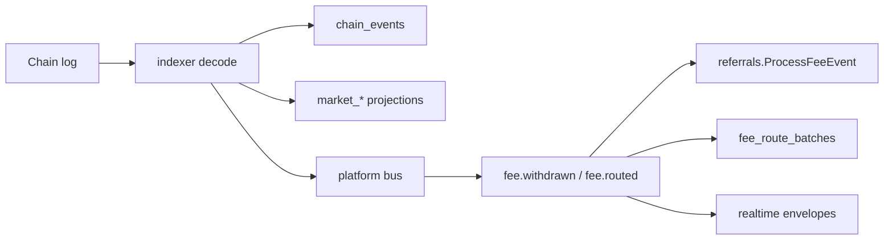

# Indexer projection map (V3 hardening)

This document maps on-chain events to Postgres projections and documents idempotency / reorg behavior for Sprint 1 hardening.

## Core tables

| Table | Writer | Idempotency key | Reorg behavior |
|-------|--------|-----------------|----------------|
| `chain_events` | `indexer.Service.recordChainEvent` | `UNIQUE (tx_hash, log_index)` + `ON CONFLICT DO NOTHING` | Rows with `block_number > rewindTo` deleted on reorg |
| `indexer_blocks` | `recordIndexerBlock` | `block_number` upsert | Updated each indexed block |
| `indexer_state` | sync loop | singleton row | `last_block` rewound on reorg |
| `market_snapshots` | inline handlers | template/epoch upserts | `TRUNCATE` on reorg (with related projection tables) |
| `market_epoch_outcomes` | inline handlers | `(template_id, epoch_id, outcome_index)` upsert | `TRUNCATE` on reorg |
| `probability_points` | inline handlers | sequence per template | `TRUNCATE` on reorg |
| `user_position_outcomes` | inline handlers | composite upsert | `TRUNCATE` on reorg |
| `fee_events` | referrals subscriber / sqlc | `(tx_hash, log_index)` | derived from `FeesWithdrawn` bus events |
| `fee_route_batches` | `handleFeesRoutedBus` → `persistFeeRouteBatch` | `UNIQUE (tx_hash, log_index)` + `ON CONFLICT DO NOTHING` | not auto-deleted on reorg (audit trail) |
| `realtime_events` (fee_routed) | `handleFeesRoutedBus` → `publishFeeRoutedRealtime` | dedupe_key `fee_routed:<tx>:<log>` | bus-owned (Sprint 2 strangler) |

## Event → projection flow

## Reorg handling

When `indexer_state.last_block_hash` disagrees with the RPC header at `last_block`:

1. `rewindTo = max(0, last_block - 64)` (fixed depth; see `indexer.go`).
2. `DELETE FROM chain_events WHERE block_number > rewindTo`.
3. `TRUNCATE` live projection tables (`market_epoch_outcomes`, `market_snapshots`, `market_read_models`, `probability_points`, `user_position_outcomes`).
4. Cancel in-flight keeper jobs; open ops incident.
5. Reset `indexer_state.last_block` to `rewindTo`.

Re-indexing replays logs; `ON CONFLICT DO NOTHING` on `chain_events` prevents duplicate rows for the same `(tx_hash, log_index)`.

## Tests

| Test | Scope |
|------|-------|
| `TestReorgRewindToNeverNegative` | Pure math for rewind window |
| `TestChainEventsUniqueConstraintPresent` | Schema gate (`DATABASE_URL`) |
| `TestFeeRouteBatchesUniqueConstraintPresent` | Schema gate (`DATABASE_URL`) |
| `TestMigrationV3` | Required V3 tables exist after migrations |

## Follow-ups (Sprint 2+)

- Bus-extract remaining inline projection handlers for uniform reorg replay.
- Alfajores E2E: `FeesRouted` → `fee_route_batches` → ops API (see `alfajores-staging-deploy-log.md`).

### FeesRouted ownership (Sprint 2)

| Stage | `chain_events` | `fee_route_batches` | realtime `fee_routed` |
|-------|----------------|---------------------|------------------------|
| Inline indexer (`handleFeeRouterLog`) | write + bus publish | — | moved to bus |
| Bus subscriber (`handleFeesRoutedBus`) | — | write | write |
