TITLE: Analisis pasar DeFi
MODEL: 
REPLIES: 406
---MARKDOWN---
# Analisis pasar DeFi
_2026-07-25 08:19:25_

### User
Analyze deeply https://defillama.com/ , based on how many protocol exceed TVL, demand, revenue, difficulties to build and cheap to publish, and many aspect. Analyze deeply as data analyst and future opportunity

### Assistant
Saya akan membedah pasar DeFi sebagai keputusan bisnis—bukan sekadar ranking TVL. Saya akan ukur distribusi protokol menurut ambang TVL, konsentrasi per kategori/chain, fee dan revenue, lalu menilai peluang berdasarkan demand, moat, risiko, biaya MVP, serta kesulitan memperoleh likuiditas. Semua angka akan saya tandai dengan tanggal snapshot karena data DeFi berubah cepat.

### Assistant
Search tool invoked with queries:
- https://defillama.com/

### Assistant
Search tool invoked with queries:
- site:defillama.com protocols TVL fees revenue categories 2026
- DefiLlama API protocols TVL endpoint documentation fees revenue
- DefiLlama top protocols TVL fees revenue July 2026
- site:defillama.com/fees DeFi fees revenue protocols

### Assistant
_Searched 35 websites_

### Assistant
```
bash -lc /bin/bash -lc "python - <<'PY'
import urllib.request
for u in ['https://api.llama.fi/protocols','https://api.llama.fi/overview/fees?excludeTotalDataChart=true&excludeTotalDataChartBreakdown=true&dataType=dailyFees']:
    try:
        with urllib.request.urlopen(u, timeout=20) as x:
            data=x.read()
            print(u, x.status, len(data), data[:80])
    except Exception as e:
        print(type(e).__name__, e)
PY"
```

### Tool
The output of this plugin was redacted.

### Assistant
_Mengambil data dari API Llama_

### Assistant
Data mentah DefiLlama mencakup lebih dari sekadar aplikasi DeFi murni—ada CEX, child protocols, liquid staking, bridge TVL, dan aset yang berpotensi dihitung ganda. Karena itu saya akan pisahkan “directory count” dari “investable/buildable protocol set”; menjumlahkan semua baris TVL secara polos akan memberi kesimpulan yang menyesatkan.

### Assistant
```
bash -lc /bin/bash -lc "python - <<'PY'
import json, urllib.request
urls={
'protocols':'https://api.llama.fi/protocols',
'fees':'https://api.llama.fi/overview/fees?excludeTotalDataChart=true&excludeTotalDataChartBreakdown=true&dataType=dailyFees',
'revenue':'https://api.llama.fi/overview/fees?excludeTotalDataChart=true&excludeTotalDataChartBreakdown=true&dataType=dailyRevenue',
'dexs':'https://api.llama.fi/overview/dexs?excludeTotalDataChart=true&excludeTotalDataChartBreakdown=true&dataType=dailyVolume'
}
for k,u in urls.items():
    with urllib.request.urlopen(u, timeout=60) as x: d=json.load(x)
    print('\\n',k, type(d), len(d) if isinstance(d,list) else list(d)[:20])
    if isinstance(d,list):
        print(d[0])
    else:
        ps=d.get('protocols')
        print('protocols',len(ps) if ps else None)
        print(ps[0] if ps else d)
PY"
```

### Tool
The output of this plugin was redacted.

### Assistant
_Mengambil dan menganalisis data protokol serta biaya dan pendapatan_

### Assistant
Temuan awalnya cukup tegas: peluang terbaik untuk builder bermodal kecil bukan kategori dengan TVL terbesar. RWA, restaking, dan lending memang unggul dalam penyerapan modal, tetapi membutuhkan kepercayaan, audit, risk management, likuiditas, dan sering kali legal/custody. Sebaliknya, interface, router, wallet, dan trading app hampir tidak “terlihat” lewat TVL tetapi tetap dapat menghasilkan revenue nyata—jadi TVL harus diperlakukan sebagai metrik yang berbeda dari product demand.

### Assistant
```
{
  "search_query": []
}
```

### Assistant
_Searched 9 websites_

### Tool
The output of this plugin was redacted.

### Assistant
```
{
  "search_query": []
}
```

### Assistant
_Searched 6 websites_

### Tool
The output of this plugin was redacted.

### Assistant
Search tool invoked with queries:
- site:defillama.com/hacks DefiLlama hacks total 2025 2026 protocols
- site:defillama.com "Hacks" "2026" DeFiLlama
- site:api-docs.defillama.com hacks API DefiLlama

### Assistant
_Searched 11 websites_

### Assistant
```
bash -lc /bin/bash -lc "python - <<'PY'
import json,urllib.request
cs=json.load(urllib.request.urlopen('https://api.llama.fi/v2/chains',timeout=90))
for q in ['Ethereum','Solana','BSC','Base','Polygon','Arbitrum','Celo','Hyperliquid L1','Monad']:
 p=next((x for x in cs if x['name']==q),None); print(q,p and p.get('tvl'))
PY"
```

### Tool
The output of this plugin was redacted.

### Assistant
_Mengambil TVL dari berbagai blockchain_

### Assistant
Search tool invoked with queries:
- https://docs.llama.fi/list-your-project/submit-a-project

### Assistant
Search tool invoked with queries:
- https://defillama.com/chain/Base

### Assistant
```
{
  "search_query": []
}
```

### Assistant
Search tool invoked with queries:
- https://defillama.com/chain/polygon

### Assistant
_Searched 10 websites_

### Assistant
_Memproses selama 11m 52s_

### Assistant
# Analisis pasar DeFi berdasarkan DefiLlama

Snapshot: **22 Juli 2026**. Saya menghitung ulang data mentah DefiLlama, bukan hanya membaca leaderboard.

## Kesimpulan utama

Pasar DeFi sudah besar, tetapi sangat terkonsentrasi:

- Total DeFi TVL sekitar **$76,9 miliar**.
- Total fees 30 hari sekitar **$1,62 miliar**.
- Protocol revenue 30 hari sekitar **$974,5 juta**.
- Namun sekitar **69% revenue berasal dari Tether dan Circle**.
- Dari 7.818 protokol non-CEX, hanya:
  - **1.255 atau 16,1%** memiliki TVL ≥$1 juta.
  - **214 atau 2,7%** memiliki TVL ≥$100 juta.
  - **52 atau 0,67%** memiliki TVL ≥$1 miliar.
- Dari 1.981 protokol yang revenue-nya dilacak, hanya:
  - **217 atau 11%** menghasilkan ≥$100 ribu/bulan.
  - **53 atau 2,7%** menghasilkan ≥$1 juta/bulan.
  - **9 atau 0,45%** menghasilkan ≥$10 juta/bulan.

Kesimpulan bisnisnya: **deploy smart contract murah, tetapi membangun bisnis DeFi yang hidup sangat mahal**. Biaya terbesar biasanya bukan gas, melainkan audit, likuiditas, market maker, distribusi, oracle, legal, dan membangun kepercayaan.

Untuk builder kecil seperti Anda, peluang terbaik bukan membuat DEX/lending/perpetual baru. Peluang terbaik adalah **application layer yang mengambil revenue dari infrastruktur dan likuiditas yang sudah ada**: interface, router, trading workflow, data/risk layer, atau structured prediction layer seperti arah RetroPick.

DefiLlama mendefinisikan TVL sebagai aset di smart contract, fees sebagai seluruh biaya yang dibayar pengguna, dan revenue hanya bagian yang benar-benar dipertahankan protokol. Revenue belum sama dengan laba karena belum dikurangi salaries, incentives, audit, hosting, legal, dan acquisition cost. [DefiLlama Data Definitions](https://defillama.com/data-definitions)

---

## 1. Distribusi TVL: berapa protokol yang benar-benar besar?

Saya mengecualikan 78 CEX agar analisis lebih relevan terhadap protokol yang bisa dibangun secara on-chain.

| Ambang TVL | Jumlah protokol | Persentase dari 7.818 |
|---:|---:|---:|
| TVL positif | 5.627 | 72,0% |
| ≥$100 ribu | 2.298 | 29,4% |
| ≥$1 juta | 1.255 | 16,1% |
| ≥$10 juta | 616 | 7,9% |
| ≥$50 juta | 309 | 4,0% |
| ≥$100 juta | 214 | 2,7% |
| ≥$500 juta | 79 | 1,0% |
| ≥$1 miliar | 52 | 0,67% |
| ≥$10 miliar | 2 | 0,03% |

Median TVL dari protokol yang masih memiliki TVL hanya sekitar **$36 ribu**.

Artinya, protokol bernilai ratusan juta dolar adalah pengecualian, bukan kondisi normal. Dataset juga menghitung sejumlah versi produk secara terpisah—misalnya Aave V2, V3, dan V4—sehingga jumlah perusahaan unik sebenarnya lebih kecil daripada jumlah baris protokol.

Perhitungan berasal dari [dataset protokol resmi DefiLlama](https://api.llama.fi/protocols) dan dokumentasi [DefiLlama API](https://api-docs.defillama.com/).

### Kategori yang paling sering mencapai TVL ≥$1 juta

- Basis trading: **69,2%**, tetapi banyak yang bergantung pada custody, exchange, dan counterparty.
- Restaking: **60,0%**.
- Risk curators: **57,6%**.
- RWA: **53,6%**.
- Canonical bridges: **52,3%**.
- Liquid restaking: **46,7%**.
- Liquid staking: **40,6%**.
- Lending: **22,0%**.
- DEX: **11,8%**.
- Prediction market: **8,0%**.
- Launchpad: **5,8%**.

Kategori yang cepat menarik modal hampir selalu kategori yang membutuhkan kepercayaan tinggi atau mempunyai underlying yield. Ini bukan berarti kategori tersebut mudah dimasuki.

---

## 2. Revenue: pasar besar, tetapi winner-take-most

DefiLlama saat ini menunjukkan sekitar **$1,621 miliar fees** dan **$974,51 juta revenue dalam 30 hari**. Tether sendiri menghasilkan sekitar $480,8 juta dan Circle sekitar $192,7 juta. [Fees leaderboard](https://defillama.com/fees), [Revenue leaderboard](https://defillama.com/revenue)

Dalam 1.981 protocol records yang memiliki revenue tracking:

| Revenue 30 hari | Jumlah | Persentase |
|---:|---:|---:|
| Revenue positif | 1.209 | 61,0% |
| ≥$10 ribu | 535 | 27,0% |
| ≥$100 ribu | 217 | 11,0% |
| ≥$1 juta | 53 | 2,7% |
| ≥$10 juta | 9 | 0,45% |

Median protokol yang menghasilkan revenue positif hanya sekitar **$6.400 per bulan**.

Konsentrasinya ekstrem:

- Protokol terbesar menyumbang sekitar **48%** revenue.
- Top 5 menyumbang sekitar **76%**.
- Top 10 menyumbang sekitar **82%**.
- Setelah stablecoin issuers dikeluarkan, top 10 masih menguasai sekitar **51%** revenue.

Implikasinya: membuat protokol yang “berfungsi” jauh lebih mudah daripada membuat protokol yang digunakan dan menghasilkan uang.

---

## 3. Perbandingan kategori utama

Fees → revenue menunjukkan berapa banyak biaya pengguna yang akhirnya ditahan protokol. Ini bukan profit margin.

| Kategori | Protokol | ≥$1 juta TVL | ≥$10 juta | Fees → revenue 30d | Kesulitan produksi |
|---|---:|---:|---:|---:|---|
| Interface | 168 | 1 | 0 | $17,1M → $10,7M | Rendah–menengah |
| DEX aggregator | 157 | 1 | 0 | $6,27M → $5,38M | Menengah |
| Prediction market | 112 | 9 | 3 | $52,6M → $24,6M | Tinggi sebagai exchange |
| Risk curators | 59 | 34 | 27 | $20,9M → $1,75M | Menengah–tinggi |
| RWA | 151 | 81 | 53 | $54,6M → $18,2M | Sangat tinggi |
| Lending | 628 | 138 | 62 | $110,7M → $20,0M | Sangat tinggi |
| Derivatives | 431 | 52 | 24 | $91,0M → $54,1M | Ekstrem |
| DEX | 2.038 | 241 | 69 | $184,6M → $28,3M | Tinggi |
| Launchpad | 207 | 12 | 3 | $50,9M → $25,4M | Menengah, distribution-heavy |
| Yield aggregator | 223 | 40 | 21 | $1,49M → $384K | Tinggi relatif terhadap revenue |

Data kategori dapat dibandingkan melalui [DefiLlama Categories](https://defillama.com/categories).

### Insight paling menarik: interface tanpa TVL

Kategori interface hanya memiliki sekitar **$2,47 juta TVL**, tetapi menghasilkan sekitar **$2,23 juta revenue dalam tujuh hari** dan memfasilitasi sekitar **$26,3 miliar perp volume**.

Ini membuktikan bahwa produk tidak harus menahan dana pengguna untuk menghasilkan revenue. Interface dapat memperoleh front-end fee, builder code fee, referral fee, spread, atau subscription. [DefiLlama Interface Rankings](https://defillama.com/protocols/interface)

Untuk tim kecil, ini jauh lebih menarik daripada menjadi liquidity venue baru.

---

## 4. Opportunity ranking untuk tim kecil

Skor berikut merupakan heuristic berdasarkan paying demand, kebutuhan modal, kesulitan engineering/security, kompetisi, dan legal/operational risk.

| Opportunity | Skor | Penilaian |
|---|---:|---|
| Vertical interface/trading workflow | **8,7/10** | Peluang terbaik untuk bootstrap |
| Prediction intelligence + routing layer | **8,3/10** | Sangat cocok untuk RetroPick |
| Stablecoin/RWA tooling | **7,9/10** | Besar, tetapi jangan menjadi issuer |
| Niche DEX/intents aggregator | **7,7/10** | Bagus jika mempunyai distribution |
| Risk curation/managed strategy | **7,2/10** | TVL kuat, monetisasi lebih lambat |
| Generic yield aggregator | **5,3/10** | Security risk lebih besar daripada revenue |
| Launchpad | **5,1/10** | Siklus pendek dan winner-take-most |
| New generic AMM/DEX | **4,4/10** | Terlalu padat dan butuh liquidity |
| Full prediction exchange | **4,1/10** | Oracle, liquidity dan legal sangat berat |
| Lending protocol | **3,7/10** | Audit, bad debt dan oracle risk |
| Perpetual exchange/bridge | **3,3/10** | Tidak rasional untuk tim kecil |

### 1. Vertical interface atau trading workflow

Ini peluang paling realistis.

Contohnya:

- Interface khusus satu komunitas atau aset.
- Trading terminal dengan analytics lebih baik.
- Cross-venue routing.
- Wallet workflow.
- Telegram/WhatsApp trading assistant.
- Localized interface untuk Indonesia/SEA.
- AI-assisted risk explanation.
- Portfolio, alerts, and execution in one product.

Moat-nya bukan kontrak pintar. Moat-nya adalah distribusi, data historis, workflow, brand, referral network, dan memahami customer lebih baik.

### 2. Stablecoin dan RWA tooling

Stablecoin issuers menghasilkan revenue paling besar, tetapi menerbitkan stablecoin sendiri bukan peluang bootstrap. Legal, reserve management, banking, redemption, audit, dan trust terlalu berat.

Peluang realistis berada di sekelilingnya:

- Stablecoin treasury router.
- Proof-of-reserves dan risk monitoring.
- Cross-chain corporate settlement.
- Yield and counterparty risk comparison.
- Compliance/KYC workflow untuk RWA.
- Tokenized asset distribution interface.
- APIs untuk redemption, attestations, dan reporting.

DefiLlama mencatat sekitar **$30,1 miliar RWA on-chain market cap**, 183 issuers, tetapi DeFi-active TVL baru sekitar $3,54 miliar. Gap tersebut menunjukkan pasar masih berkembang, tetapi infrastructure dan integration lebih menarik daripada menerbitkan aset sendiri. [DefiLlama RWA](https://defillama.com/rwa)

### 3. Risk curator

Risk curator memiliki sekitar **$7,87 miliar TVL**. Sebanyak 34 dari 59 entitas sudah melewati $1 juta TVL dan 27 melewati $10 juta. [Risk Curators Rankings](https://defillama.com/protocols/risk-curators)

Ini menarik karena builder dapat memakai lending primitives seperti Morpho atau Aave, lalu berkompetisi melalui:

- Risk model.
- Asset selection.
- Allocation strategy.
- Monitoring.
- Institutional reporting.
- Track record.

Kelemahannya: revenue capture hanya sekitar 8% dari fees. Produk bisa mengelola TVL besar tetapi menghasilkan revenue relatif kecil.

### 4. Hindari generic DEX dan yield aggregator

Ada 2.038 DEX, tetapi hanya 69 yang melewati $10 juta TVL. Median revenue positif kategori DEX sangat rendah, sementara audit, LP acquisition, routing, MEV, dan liquidity incentives mahal.

Yield aggregator lebih buruk: hanya sekitar $384 ribu revenue bulanan di seluruh tracked category, padahal integrasi protokol lain meningkatkan attack surface.

---

## 5. Prediction market dan implikasinya untuk RetroPick

Ini bagian paling relevan untuk Anda.

Prediction market saat ini menunjukkan:

- TVL kategori sekitar **$401,8 juta**.
- Prediction volume 7 hari sekitar **$4,06 miliar**.
- Fees 7 hari sekitar **$11,76 juta**.
- Revenue 7 hari sekitar **$5,85 juta**.
- Tetapi Polymarket menguasai sekitar **84% TVL** dan sekitar **88% revenue 30 hari** kategori.

[DefiLlama Prediction Markets](https://defillama.com/protocols/prediction-market)

Jadi datanya memberikan dua kesimpulan sekaligus:

1. **Demand sudah terbukti kuat.**
2. **Membangun exchange baru dengan liquidity sendiri sangat sulit.**

Kesalahan strategis RetroPick akan terjadi jika menganggap lebih banyak market structures otomatis menghasilkan lebih banyak demand. Threshold, corridor, ladder, cascade, dan composite memang menarik, tetapi pengguna pertama-tama membutuhkan:

- Market yang memang ingin mereka trade.
- Likuiditas dan harga yang masuk akal.
- Resolusi yang dipercaya.
- Proses deposit dan execution sederhana.
- Alasan untuk kembali setiap minggu.

### Model RetroPick yang lebih kuat

RetroPick sebaiknya menjadi **structured forecast intelligence and execution layer**, bukan langsung menjadi liquidity venue baru.

V1 yang saya rekomendasikan:

1. Mengumpulkan event dan harga probabilitas dari venue yang diizinkan.
2. Menormalisasikan data menjadi structured forecast.
3. Menampilkan historical probability, scenario, range, cascade, dan payoff preview.
4. Merutekan execution ke partner/existing venue bila integrasi dan ketentuannya memungkinkan.
5. Menghasilkan revenue dari routing/front-end fee, affiliate, API, atau B2B subscription.
6. Mempertahankan kontrak RetroPick sendiri untuk testnet, B2B sandbox, atau long-tail markets setelah demand terbukti.

Dengan model ini, Anda memiliki customer relationship dan intelligence layer tanpa harus membiayai liquidity pool sejak awal.

---

## 6. Chain terbaik untuk launch

Untuk EVM builder kecil, pilihan pragmatisnya adalah **Base**. Solana memiliki aktivitas terbesar, tetapi memerlukan stack berbeda dan kompetisinya jauh lebih berat.

| Chain | TVL | DEX volume 24h | App revenue 24h | Penilaian |
|---|---:|---:|---:|---|
| Solana | $4,98B | $1,44B | $2,51M | Demand terbesar, stack lebih sulit |
| Base | $4,68B | $702,6M | $367,8K | EVM terbaik untuk bootstrap |
| Polygon | $867M | $98,5M | $717,2K | Kuat untuk prediction-market adjacency |
| Celo | $16,7M | $719K | sangat kecil/tidak material | Testnet/grant ecosystem, bukan primary market |

Sumber: [Solana](https://defillama.com/chain/solana), [Base](https://defillama.com/chain/base), [Polygon](https://defillama.com/chain/polygon), [Celo](https://defillama.com/chain/celo).

Untuk RetroPick:

- **Base**: paling masuk akal jika Anda mempertahankan Solidity/EVM dan ingin consumer distribution.
- **Polygon**: relevan jika dapat membangun integrasi yang sah dengan prediction-market liquidity.
- **Celo**: pertahankan sebagai environment demo, testnet, atau grant; jangan jadikan satu-satunya jalur distribusi.
- **Solana**: menarik hanya jika data menunjukkan user RetroPick memang berada di Solana; jangan rewrite hanya karena chain sedang ramai.

Base memiliki sekitar **281× TVL** dan hampir **1.000× DEX volume harian Celo** pada snapshot ini. Memilih chain murah tetapi tanpa liquidity dan active economic demand dapat menjadi false economy.

---

## 7. Berapa biaya realistis?

Listing di DefiLlama sendiri dilakukan melalui adapter dan GitHub pull request; tidak ada listing fee yang disebutkan. Biaya utamanya adalah engineering adapter. [DefiLlama listing guide](https://docs.llama.fi/list-your-project/submit-a-project)

Estimasi berikut adalah planning envelope, bukan quotation, dan belum memasukkan salary founder serta marketing:

| Jenis produk | Cash MVP | Waktu full-time | Hambatan utama |
|---|---:|---:|---|
| Data/interface non-custodial | <$5K | 3–8 minggu | Distribution |
| Router memakai existing protocol | $5K–$25K | 6–12 minggu | Integration dan dependency |
| Curated vault | $25K–$150K | 3–6 bulan | Audit, trust, seed assets |
| Full prediction/DEX protocol | $100K–$500K+ | 6–12 bulan | Liquidity, audit, oracle, legal |
| Lending/perps/bridge/stablecoin | $250K–$2M+ | 9–18 bulan | Security, market maker, legal, operations |

“Forking contract” dapat dilakukan dalam beberapa minggu, tetapi production-grade protocol berbeda. DefiLlama mencatat total sekitar **$16,7 miliar nilai yang pernah diretas**, termasuk sekitar $3,26 miliar pada bridge, sehingga audit dan monitoring bukan tambahan opsional. [DefiLlama Hacks](https://defillama.com/hacks)

## Rekomendasi final untuk Anda

Jangan pivot RetroPick menjadi DEX, lending protocol, atau yield aggregator baru.

Strategi yang paling rasional:

> **RetroPick = structured prediction intelligence, discovery, and execution layer built on existing liquidity.**

Fokus 90 hari:

- Pilih satu wedge: crypto + AI/technology events.
- Pertahankan maksimal 1–2 struktur market utama.
- Integrasikan data dan execution venue sebelum membangun liquidity sendiri.
- Kejar 100 weekly active users, minimal 25 repeat users, dan $100 ribu monthly routed notional.
- Validasi satu revenue stream: B2B subscription, partner routing, atau front-end fee.
- Baru deploy proprietary market liquidity setelah ada repeat demand dan satu liquidity partner.

Data DefiLlama mengonfirmasi bahwa prediction market adalah pasar nyata. Tetapi data yang sama juga menunjukkan bahwa **winning opportunity untuk RetroPick bukan membuat “Polymarket lain”; melainkan menjadi layer yang membuat prediction markets lebih structured, understandable, discoverable, dan useful.**

### User
Kalau dari Retropick cash MVP kita dibawah 100 dollar karena stack vps, dan pool based untuk v1 seperti pancakeswap prediction

### Assistant
Betul—untuk RetroPick, estimasi saya sebelumnya terlalu tinggi karena mencampur biaya membuat protokol production-grade dengan biaya cash untuk membuktikan V1. Kalau kontrak dan engineering dikerjakan sendiri, memakai VPS/RPC murah, serta model pooled/pari-mutuel tanpa market maker, cash MVP memang realistis di bawah $100. Saya akan luruskan titik biaya dan risiko sebenarnya.

### Assistant
Search tool invoked with queries:
- site:docs.pancakeswap.finance prediction market how it works pool bull bear rounds oracle
- site:developer.pancakeswap.finance prediction contract oracle rounds

### Assistant
Search tool invoked with queries:
- PancakeSwap Prediction market official documentation Bull Bear pool oracle
- PancakeSwap prediction contract GitHub PredictionV2

### Assistant
_Searched 18 websites_

### Assistant
_Memproses selama 40s_

### Assistant
Betul. Untuk arsitektur RetroPick yang sebenarnya, **cash MVP di bawah $100 masuk akal**. Estimasi saya sebelumnya terlalu tinggi karena menganggap RetroPick harus menyediakan likuiditas, market maker, audit formal, serta oracle production-grade sejak V1.

## Model RetroPick V1: pooled/pari-mutuel

Ini berbeda dari AMM seperti Uniswap atau order book seperti Polymarket.

Misalnya:

- Total posisi YES: $30
- Total posisi NO: $70
- Total pool: $100
- Protocol fee: 3%
- Outcome: YES menang

Dana distributable:

\[
\$100 \times (1-3\%)=\$97
\]

Payout per $1 di posisi YES:

\[
\$97/\$30 = \$3{,}23
\]

Pemenang dibayar dari pool peserta yang kalah. RetroPick tidak perlu:

- Menyediakan LP.
- Menjaga bid/ask spread.
- Mempekerjakan market maker.
- Menjamin redemption pada harga tertentu.
- Mengeluarkan modal untuk setiap market.

Ini memang dekat dengan PancakeSwap Prediction: pengguna memilih UP/DOWN dalam satu ronde, harga dikunci dan ditutup melalui oracle, lalu pool didistribusikan kepada pihak yang menang. PancakeSwap saat ini menjalankan ronde lima menit dan menggunakan oracle untuk menentukan locked/closed price. [PancakeSwap Prediction](https://docs.pancakeswap.finance/play/prediction), [official contracts](https://github.com/pancakeswap/pancake-smart-contracts)

## Koreksi estimasi biaya

| Komponen | Cash MVP RetroPick |
|---|---:|
| VPS/backend | $5–15/bulan atau sudah tersedia |
| Database | $0 melalui free tier/self-hosted |
| RPC | $0 free tier |
| Frontend hosting | $0 |
| Deployment low-cost EVM | Sekitar $1–20 |
| Domain | Sudah dimiliki |
| Oracle transaction/operator | Beberapa dolar |
| Monitoring dasar | $0 |
| Smart-contract testing | $0, dikerjakan sendiri |
| Initial campaign/seed | Opsional $20–50 |
| Total | **$10–$90** |

Ini mengecualikan nilai waktu founder dan audit eksternal. Jadi:

- **Technical MVP:** <$100.
- **Controlled mainnet beta:** tetap bisa <$100 apabila pool dibatasi.
- **Production-grade public protocol:** baru menjadi mahal ketika exposure dan user funds membesar.

Dengan model ini, biaya membuat satu market sebesar sekitar $0,01 juga rasional jika market hanya berupa state/data dalam contract yang sudah di-deploy, bukan deployment kontrak baru untuk setiap market.

## Tetapi hambatan berpindah dari modal ke distribusi

Pool-based menghapus masalah market maker, tetapi tidak menghapus liquidity problem sepenuhnya. Masalahnya berubah menjadi:

### 1. Cold-start pool

Market dengan pool YES $2 dan NO $0 bukan market yang menarik. Pengguna tidak melihat payout yang kredibel dan pihak pertama menanggung ketidakpastian tinggi.

Solusi V1:

- Tampilkan estimated payout secara real-time.
- Minimum total pool sebelum market aktif.
- Minimum dua sisi terisi.
- Batalkan dan refund jika threshold tidak tercapai.
- Gabungkan banyak pengguna pada sedikit market berkualitas.

Jangan meluncurkan 40–50 market bersamaan jika hanya ada puluhan pengguna. Itu akan memecah liquidity.

### 2. Last-minute whale manipulation

Dalam model pooled, seorang whale dapat memasukkan dana besar menjelang penutupan dan mengubah payout seluruh peserta.

Mitigasi:

- Tutup entry beberapa menit sebelum resolution window.
- Tampilkan payout sebagai estimasi sampai market dikunci.
- Batasi maximum position relatif terhadap pool.
- Gunakan commitment window untuk market besar.
- Jangan mengizinkan perubahan posisi setelah lock.

### 3. Tidak ada early exit

Berbeda dari order book, pengguna biasanya tidak dapat menjual posisi sebelum resolusi. Ini membuat produk lebih sederhana, tetapi mengurangi capital efficiency.

Untuk V1 ini boleh. Jangan membangun secondary market dulu. Gunakan expiry pendek–menengah agar uang tidak terkunci terlalu lama.

### 4. Pool tipis bukan probabilitas berkualitas

Jika pool YES $20 dan NO $80, implied probability kasarnya dapat dibaca sebagai 20% vs 80%. Namun pada pool kecil, angka itu lebih mencerminkan komposisi beberapa pengguna daripada collective intelligence.

Karena RetroPick ingin menjadi produk forecast intelligence, tampilkan:

- “Pool-implied probability”.
- Jumlah participants.
- Total capital.
- Concentration score.
- Persentase pool yang dikendalikan top participant.
- Label low/medium/high confidence.

Jangan menyebut angka tersebut sebagai market probability yang kuat jika hanya ada tiga peserta.

## Aturan pool yang saya rekomendasikan

Untuk binary market:

\[
Payout_i =
\frac{Stake_i}{WinningPool}
\times
TotalPool
\times (1-f)
\]

Untuk range atau multi-outcome market:

\[
Payout_i =
\frac{Stake_i}{WinningOutcomePool}
\times
TotalAllPools
\times (1-f)
\]

Gunakan aturan berikut:

- Fee 2–3% dari total distributable pool.
- Refund 100% jika market dibatalkan.
- Refund jika winning outcome tidak memiliki participant.
- Refund jika total pool tidak mencapai minimum.
- Jangan mengambil seluruh unopposed pool sebagai treasury pada fase awal.
- Semua resolution source dan timestamp ditetapkan sebelum market dibuka.
- Emergency pause hanya untuk oracle failure atau technical incident.
- Setelah result final, klaim tidak boleh bergantung pada backend RetroPick.

PancakeSwap memiliki skenario “house win” untuk kondisi tertentu, termasuk locked price sama dengan closed price. Untuk RetroPick yang masih membangun kepercayaan, **refund lebih aman secara reputasi** daripada treasury mengambil seluruh pool. [PancakeSwap Prediction FAQ](https://docs.pancakeswap.finance/play/prediction/prediction-faq)

## Oracle murah untuk V1

Untuk crypto price market, gunakan existing price feed. Biaya utamanya hanya transaksi operator yang mengunci dan menutup ronde.

Untuk event dunia nyata, tantangannya lebih sulit. V1 bisa memakai:

- Resolver multisig RetroPick.
- Source URL yang ditentukan sejak awal.
- Evidence hash/IPFS.
- Resolution delay 12–24 jam.
- Dispute window.
- Emergency refund jika sumber ambigu.

Ini memang belum fully decentralized, tetapi cukup untuk controlled beta selama transparan. Decentralization dapat ditingkatkan setelah volume membenarkan biaya oracle/dispute system.

## Apa yang sebaiknya diluncurkan?

Jangan langsung meluncurkan sembilan struktur market. Mulai dengan dua:

1. **Binary threshold**

   Contoh: “Apakah BTC ditutup di atas $X pada tanggal Y?”

2. **Range close**

   Contoh: “Di range berapa harga NVIDIA setelah earnings?”

Keduanya mudah dijelaskan, di-resolve, dan dihitung menggunakan pooled settlement. Ladder, corridor, cascade, composite, dan convergence dapat menyusul setelah ada repeat usage.

## Kesimpulan untuk RetroPick

Jadi positioning yang lebih tepat bukan:

> RetroPick membutuhkan ratusan ribu dolar untuk meluncurkan prediction protocol.

Melainkan:

> RetroPick dapat meluncurkan pooled prediction-market MVP dengan cash di bawah $100, tetapi harus membuktikan bahwa market selection, distribution, resolution trust, dan pool concentration cukup kuat untuk menghasilkan repeat participation.

Technical launch bukan lagi bottleneck terbesar Anda. Bottleneck sebenarnya:

1. Mengumpulkan pengguna pada sedikit market.
2. Mendapatkan dua sisi pool.
3. Membuat resolution dipercaya.
4. Mendapatkan repeat participation.
5. Menghasilkan fee tanpa mengandalkan subsidi.

Dengan kondisi RetroPick sekarang, saya akan mempertahankan pool-based V1 dan **tidak mengubahnya menjadi interface-only**. Namun saya akan membatasi launch ke 3–5 market aktif, pool cap kecil, manual transparent resolver, serta menjadikan structured forecast UI sebagai pembeda utama.

### User
Menurut mu dengan market pool structured dengan banyak tipe apakah bisa memakai liquidity dari prediction market lain lalu bikin market sendiri structured prediction market? Jadi mengirim JSON payload antar informasi dan dana lewat address smart contract?

### Assistant
Secara teknis bisa, tetapi RetroPick tidak bisa “memindahkan liquidity pool” milik prediction market lain hanya dengan JSON. Yang mungkin adalah menjadikan RetroPick sebagai structured-liquidity layer: dana pengguna dipakai membeli kombinasi outcome positions pada venue lain, lalu RetroPick menerbitkan structured claim yang 1:1 dibackup oleh posisi tersebut. Saya akan pisahkan mana struktur yang benar-benar bisa disintesis dan mana yang tetap membutuhkan pool/oracle RetroPick sendiri.

### Assistant
Search tool invoked with queries:
- site:docs.polymarket.com developers CTF exchange outcome tokens API official
- site:docs.polymarket.com conditional token framework split merge redeem positions official
- site:docs.gnosis.io conditional tokens framework split position merge redeem official
- site:docs.limitless.exchange developer API smart contracts official

### Assistant
```
{
  "search_query": []
}
```

### Assistant
```
{
  "search_query": []
}
```

### Assistant
```
{
  "search_query": []
}
```

### Assistant
_Searched 25 websites_

### Assistant
_Memproses selama 1m 47s_

### Assistant
**Bisa**, dan justru ini bisa menjadi arsitektur paling kuat untuk RetroPick. Tetapi konsepnya bukan “memindahkan liquidity pool” dari prediction market lain. RetroPick akan **mengakses liquidity mereka dengan membeli outcome tokens**, lalu menggabungkan beberapa posisi menjadi structured position.

JSON hanya berfungsi sebagai instruksi dan metadata. Dana tetap berpindah melalui transaksi token dan smart contract.

## Tiga model integrasi

| Model | Cara kerja | Kesulitan | Cocok untuk V1 |
|---|---|---:|---:|
| Synthetic UI/router | RetroPick mengirim beberapa order langsung dari wallet pengguna | Rendah | **Paling cocok** |
| Structured vault | Vault membeli outcome tokens dan menerbitkan RetroPick structured token | Menengah–tinggi | V2 |
| Internal pool + external hedge | Pool RetroPick dilindungi dengan posisi pada venue lain | Tinggi | V3 |

## Model terbaik: synthetic structured position

Misalnya prediction market eksternal memiliki tiga market:

- NVIDIA revenue >$35B
- NVIDIA revenue >$40B
- NVIDIA revenue >$45B

RetroPick dapat menampilkannya sebagai satu **Revenue Ladder**:

- Di bawah $35B
- $35–40B
- $40–45B
- Di atas $45B

Pengguna melihat satu market structured di RetroPick, tetapi di belakang layar RetroPick membentuknya dari beberapa posisi eksternal.

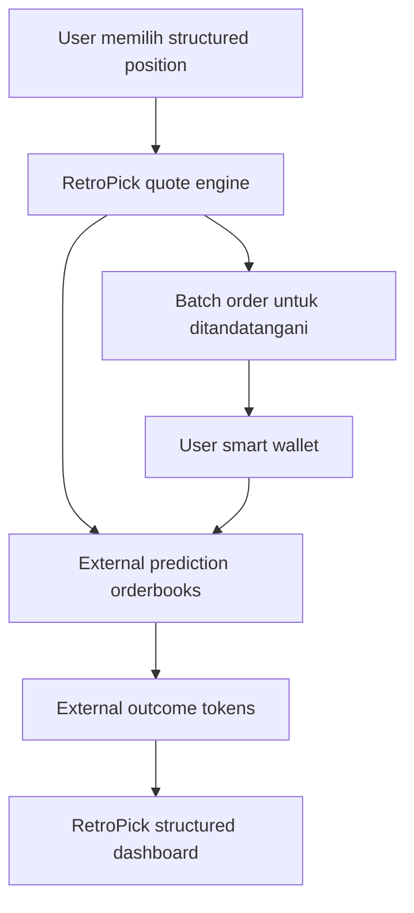

Dalam versi termurah, RetroPick bahkan belum perlu menerbitkan token baru. Outcome tokens tetap berada di smart wallet pengguna, sementara RetroPick mengelompokkannya sebagai satu structured position di UI.

## Polymarket memang mendukung pola builder seperti ini

Polymarket menyediakan:

- Public orderbook API.
- SDK TypeScript, Python, dan Rust.
- Smart/deposit wallets.
- Outcome tokens ERC-1155.
- Split, merge, trade, dan redeem.
- Gasless relayer.
- Builder code untuk attribution dan fees.

Builder Program mereka secara eksplisit ditujukan untuk aplikasi yang merutekan order pengguna ke Polymarket. [Polymarket Builder Program](https://docs.polymarket.com/builders/overview)

Outcome YES/NO merupakan ERC-1155 yang fully backed; $1 collateral dapat membentuk satu YES dan satu NO, dan token pemenang dapat ditebus menjadi $1 setelah resolusi. [Positions & Tokens](https://docs.polymarket.com/concepts/positions-tokens)

Builder juga dapat memasang fee pada routed order—saat ini dokumentasinya menyebut maksimum 1% untuk taker dan 0,5% untuk maker. [Polymarket Builder Fees](https://docs.polymarket.com/builders/fees)

Artinya, secara teknis dan bisnis, model ini nyata:

> RetroPick memiliki UI, struktur produk, analytics, dan customer relationship; Polymarket atau venue lain menyediakan underlying liquidity dan settlement.

Tetap perlu memeriksa terms, availability, dan batasan yurisdiksi sebelum production.

---

## JSON tidak langsung masuk ke smart contract

Smart contract tidak dapat mengambil atau membaca JSON internet sendiri.

Alur yang benar:

1. RetroPick backend membaca API/orderbook eksternal.
2. Backend membangun structured quote dalam JSON.
3. JSON diubah menjadi canonical payload.
4. Payload di-hash dengan `keccak256`.
5. Pengguna menandatangani EIP-712 order.
6. Dana bergerak melalui ERC-20 approval/transfer.
7. Outcome tokens bergerak melalui ERC-1155 transfer.
8. Smart contract hanya menerima ABI-encoded calldata, bukan raw JSON.

Contoh JSON off-chain:

```json
{
  "structure": "ladder",
  "underlying": "NVIDIA FY2026 revenue",
  "legs": [
    {
      "venue": "polymarket",
      "conditionId": "0xabc",
      "tokenId": "123",
      "side": "YES",
      "weight": "1.0"
    },
    {
      "venue": "polymarket",
      "conditionId": "0xdef",
      "tokenId": "456",
      "side": "NO",
      "weight": "1.0"
    }
  ],
  "maxSpend": "10000000",
  "maxSlippageBps": 100,
  "expiry": 1785000000
}
```

On-chain cukup simpan:

- `structureId`
- `specHash`
- external `conditionIds`
- external `tokenIds`
- weights
- expiry
- collateral token
- maximum slippage
- settlement rules

Deskripsi panjang, source URL, dan market explanation tetap disimpan di database/IPFS; hanya hash-nya yang dicatat on-chain.

## Mana structured market yang dapat memakai liquidity eksternal?

| RetroPick structure | Dapat disintesis? | Penjelasan |
|---|---:|---|
| Threshold | **Ya, langsung** | Cocok dengan market YES/NO |
| Ladder | **Ya** | Gabungan beberapa threshold yang nested |
| Range close | **Ya, dengan syarat** | Membutuhkan threshold/bucket dengan settlement identik |
| Convergence | Sebagian | Bagus sebagai analytics; executable version lebih sulit |
| Composite | Terbatas | Membutuhkan joint market untuk A AND B |
| Cascade | Sulit | Outcome saling bersyarat dan berurutan |
| Corridor | Umumnya tidak | Path-dependent, bukan hanya final outcome |
| Velocity | Umumnya tidak | Membutuhkan start price, end price, dan aturan sendiri |
| All-market summary | Analytics | Bukan tradable payoff |

### Syarat penting

Semua leg harus mempunyai:

- Underlying event sama.
- Timestamp sama.
- Source/resolution authority sama.
- Definisi “close”, “official result”, dan timezone sama.
- Collateral compatible.
- Maturity yang sama atau dapat dikelola.

Jika satu market memakai “harga pukul 16:00 ET” dan lainnya memakai “official daily close”, itu dapat menciptakan **basis risk**. RetroPick mungkin menjanjikan satu payoff sementara underlying positions menyelesaikan hasil berbeda.

## Structured vault untuk V2

Setelah synthetic router terbukti, RetroPick dapat membuat `StructuredVault`.

Alurnya:

1. Pengguna deposit pUSD/USDC.
2. RetroPick quote engine mencari external legs termurah.
3. Executor membeli outcome tokens.
4. Outcome tokens masuk ke vault.
5. Vault menerbitkan `RetroPickPosition` ERC-1155.
6. Setelah external markets resolve, vault redeem outcome tokens.
7. Collateral dibagikan kepada pemegang RetroPickPosition.

Secara konsep:

\[
\text{RetroPick Structured Token}
=
w_1T_1+w_2T_2+\dots+w_nT_n
\]

Dengan:

- \(T_i\) = external outcome token.
- \(w_i\) = bobot exposure.
- Seluruh structured token harus dibackup oleh underlying positions.

Keuntungannya:

- Pengguna hanya memegang satu posisi.
- RetroPick dapat membuat produk range, ladder, atau basket.
- Liquidity berasal dari orderbook eksternal.
- RetroPick tidak harus menyediakan market maker sendiri.
- Settlement dapat memakai oracle eksternal jika payoff sepenuhnya merupakan fungsi dari external outcomes.

Kekurangannya:

- Contract menjadi custodial vault bagi pooled assets.
- Dibutuhkan audit lebih serius.
- Executor/operator mempunyai tanggung jawab besar.
- Smart contract tidak dapat langsung mengakses CLOB off-chain tanpa relayer/executor.
- Partial fill dapat membuat vault under-hedged.
- Perlu perlindungan terhadap slippage dan stale quotes.

## Menggunakan external liquidity untuk pool RetroPick

Pool internal RetroPick juga bisa tetap digunakan.

Contohnya:

- YES pool RetroPick: $30
- NO pool RetroPick: $70

Pool sudah fully funded karena pihak kalah membayar pihak menang. Jadi sebenarnya external liquidity tidak diperlukan untuk solvency.

External liquidity dapat dipakai untuk:

- Menentukan reference probability.
- Mengurangi imbalance.
- Menyediakan early exit.
- Melindungi treasury exposure.
- Memberikan minimum payout.
- Menambah liquidity ketika salah satu sisi terlalu kecil.

Pada waktu lock, RetroPick dapat menghitung net exposure dan membeli hedge di venue eksternal.

Namun ini lebih kompleks karena hedge dapat:

- Tidak terisi seluruhnya.
- Mengalami slippage.
- Resolve berbeda.
- Menimbulkan kerugian bila operator terlambat.
- Menambahkan dependency kepada external venue.

Jadi untuk V1, saya tidak menyarankan auto-hedging. Biarkan pool RetroPick berdiri sendiri dan gunakan external markets sebagai **price/reference signal** terlebih dahulu.

## Jangan cross-chain dahulu

Jika memakai Polymarket, seluruh kontrak dan outcome tokens-nya saat ini berada di Polygon. [Polymarket Contracts](https://docs.polymarket.com/resources/contracts)

Karena RetroPick sebelumnya menggunakan Celo, jangan mencoba:

- Mengirim JSON dari Polygon ke Celo.
- Bridge ERC-1155 outcome tokens.
- Memisahkan collateral dan settlement pada dua chain.
- Membuat klaim RetroPick di Celo yang dibackup aset Polygon.

Itu menambah bridge risk, asynchronous settlement, dan failure states.

Arsitektur V1 yang lebih aman:

- RetroPick UI tetap chain-agnostic.
- User execution wallet berada di Polygon untuk Polymarket.
- Pool asli RetroPick dapat tetap berada pada chain yang Anda pilih.
- Setiap venue mempunyai adapter dan wallet terpisah.
- Jangan menggabungkan dana lintas chain sampai volume sudah membenarkan kompleksitasnya.

## Roadmap yang saya rekomendasikan

### V1 — Structured discovery

- Baca external orderbooks.
- Normalisasikan event dan probability.
- Buat ladder/range secara visual.
- Belum ada fund routing.
- Pool RetroPick berjalan mandiri.

### V1.5 — Non-custodial routing

- User memilih structured position.
- RetroPick membangun beberapa external orders.
- User menandatangani batch.
- Tokens tetap di user smart wallet.
- RetroPick mendapat builder fee.
- UI menggabungkan legs menjadi satu portfolio position.

### V2 — Structured vault

- Vault memegang external outcome tokens.
- Menerbitkan satu RetroPick structured token.
- Mendukung atomic deposit dan mint.
- Audit dan exposure cap diperlukan.

### V3 — Liquidity meta-layer

- Router membandingkan Polymarket, Limitless, dan venue lain.
- Internal orders di-netting terlebih dahulu.
- Residual exposure dikirim ke venue termurah.
- Pool RetroPick berfungsi sebagai liquidity aggregator dan structured settlement layer.

## Kesimpulan

**Ya, ide tersebut sangat feasible**, tetapi bentuk paling tepat bukan memindahkan liquidity dengan JSON.

Arsitektur terbaik adalah:

> RetroPick membentuk market structured dari kombinasi external outcome tokens, merutekan order ke liquidity venue lain, dan menampilkan beberapa posisi sebagai satu structured forecast.

Untuk V1, gunakan **non-custodial synthetic router** tanpa vault baru. Itu tetap bisa dipertahankan di bawah $100, mengurangi audit risk, dan memungkinkan RetroPick menguji apakah pengguna memang menginginkan ladder/range/composite sebelum membangun structured vault sendiri.

### User
Sebagai system engineer, analisislah mendalam bukan se simpel itu jadi engine sebenarnya di settlement outcome bahkan pakai machine learning. Jadi misalnya market convergence, pertanyaanya apakah jika bitcoin berdampak pada GDP. Dari situ pakai 2 market dari will GDP go up ow down? Dan Bitcoin up or down? Dari polymarket. Analisis, cari solusinya, architectf design all system

### Assistant
Masalah intinya memang lebih dalam: dua market marginal—“BTC naik/turun” dan “GDP naik/turun”—cukup untuk menentukan apakah hasil akhirnya searah, tetapi tidak cukup untuk membuktikan “BTC berdampak pada GDP”, dan likuiditas keduanya juga tidak bisa secara sempurna mereplikasi payoff convergence. Engine harus memisahkan signal, joint-state pricing, causal/predictive inference, hedging, dan final settlement sebagai subsistem berbeda.

### Assistant
Search tool invoked with queries:
- site:docs.polymarket.com resolution UMA Optimistic Oracle market API outcome official 2026
- site:conditional-tokens.readthedocs.io split position multiple conditions collection ID conditional tokens
- site:docs.uma.xyz optimistic oracle assertion dispute official
- site:bea.gov API GDP data revisions advance estimate official

### Assistant
Search tool invoked with queries:
- Gnosis Conditional Tokens Framework multiple conditions collections intersection official docs
- site:conditional-tokens.readthedocs.io "multiple conditions"
- site:github.com/gnosis/conditional-tokens-contracts collections intersection conditions

### Assistant
Search tool invoked with queries:
- site:docs.chain.link data feeds price feeds latestRoundData official BTC USD
- site:docs.chain.link data feeds historical prices official

### Assistant
Search tool invoked with queries:
- site:apps.bea.gov API GDP NIPA official data documentation
- site:bea.gov API user guide NIPA GDP official

### Assistant
_Searched 78 websites_

### Assistant
_Memproses selama 3m 6s_

### Assistant
# Arsitektur RetroPick Structured Convergence Engine

Anda benar: ini bukan sekadar menggabungkan dua JSON order lalu menyebutnya structured market. Sistem sebenarnya membutuhkan:

- Semantic/event compiler.
- Joint-outcome engine.
- Probability and ML engine.
- External liquidity adapters.
- Risk and hedging engine.
- Deterministic settlement.
- Oracle and dispute system.
- Immutable model/data provenance.
- On-chain collateral and payout contracts.

Namun kita harus memperbaiki satu konsep terlebih dahulu:

> “BTC dan GDP bergerak searah” adalah convergence/co-movement. Itu tidak otomatis membuktikan “Bitcoin menyebabkan atau berdampak pada GDP.”

Satu kejadian BTC naik dan GDP naik hanya menunjukkan dua outcome yang bertepatan. Untuk memperdagangkan “impact”, RetroPick harus mendefinisikannya sebagai predictive impact yang terukur, bukan klaim kausal yang abstrak.

---

## 1. Tiga produk berbeda

### A. Outcome convergence

Pertanyaan:

> “Apakah BTC dan real GDP AS bergerak ke arah yang sama selama Q3 2026?”

Settlement menggunakan outcome aktual:

- BTC naik + GDP naik → Convergence.
- BTC turun + GDP turun → Convergence.
- BTC naik + GDP turun → Divergence.
- BTC turun + GDP naik → Divergence.

Tidak memerlukan ML untuk final settlement.

### B. Predictive-impact market

Pertanyaan:

> “Apakah penambahan data Bitcoin meningkatkan akurasi model prediksi arah real GDP AS setidaknya 5% selama empat rilis berikutnya dibanding baseline model?”

Ini benar-benar dapat menggunakan ML dalam settlement karena objek yang dipertaruhkan adalah **performance model**, bukan klaim sebab-akibat.

### C. Causal-impact market

Pertanyaan:

> “Apakah Bitcoin menyebabkan peningkatan GDP?”

Ini hampir tidak layak menjadi consumer prediction market karena causality membutuhkan identification strategy, bukan sekadar korelasi atau ML. Bahkan Granger causality hanya membuktikan predictive precedence, bukan true causality.

Rekomendasi:

- Jadikan **convergence** sebagai tradable consumer market.
- Jadikan **impact score** sebagai analytics.
- Jika ingin tradable impact, bentuk sebagai **model-performance market**.

---

# 2. Mengapa dua probabilitas Polymarket tidak cukup?

Misalkan:

\[
B =
\begin{cases}
1 & \text{BTC naik}\\
0 & \text{BTC turun}
\end{cases}
\]

\[
G =
\begin{cases}
1 & \text{GDP naik}\\
0 & \text{GDP turun}
\end{cases}
\]

Convergence:

\[
C=1[B=G]
\]

Payoff convergence dapat ditulis sebagai:

\[
C=1-B-G+2BG
\]

Posisi dari market BTC hanya memberi exposure terhadap \(B\). Market GDP hanya memberi exposure terhadap \(G\). Tetapi payoff convergence membutuhkan interaction term:

\[
BG
\]

Inilah correlation/joint-outcome risk yang tidak dapat di-hedge secara sempurna hanya dengan membeli posisi BTC dan GDP secara terpisah.

## Empat atomic states

| State | BTC | GDP | Structured outcome |
|---|---|---|---|
| \(S_{00}\) | Down | Down | Convergence |
| \(S_{01}\) | Down | Up | Divergence |
| \(S_{10}\) | Up | Down | Divergence |
| \(S_{11}\) | Up | Up | Convergence |

Outcome engine harus membangun empat state tersebut. UI boleh menampilkan hanya dua tombol—Convergence dan Divergence—tetapi accounting internal harus mempertahankan empat atomic states.

## Joint probability tidak diketahui dari marginal

Polymarket mungkin memberikan:

\[
P(B=1)=p_B
\]

\[
P(G=1)=p_G
\]

Tetapi kita masih membutuhkan:

\[
P(B=1,G=1)=p_{11}
\]

Joint-state probabilities:

\[
\begin{aligned}
q_{11} &= p_{11}\\
q_{10} &= p_B-p_{11}\\
q_{01} &= p_G-p_{11}\\
q_{00} &= 1-p_B-p_G+p_{11}
\end{aligned}
\]

Probabilitas convergence:

\[
P(C)=q_{00}+q_{11}
=1-p_B-p_G+2p_{11}
\]

Dengan batas Fréchet:

\[
\max(0,p_B+p_G-1)\leq p_{11}\leq \min(p_B,p_G)
\]

Contoh:

- \(p_B=0.60\)
- \(p_G=0.70\)

Maka \(p_{11}\) bisa berada antara 0,30 sampai 0,60.

Akibatnya:

\[
P(C)\in[0.30,0.90]
\]

Artinya dua market marginal dapat menghasilkan range fair probability sebesar 30%–90%. **ML/joint model dibutuhkan untuk memperkirakan dependence**, tetapi perkiraan itu bukan liquidity yang dapat ditebus.

---

# 3. Arsitektur sistem keseluruhan

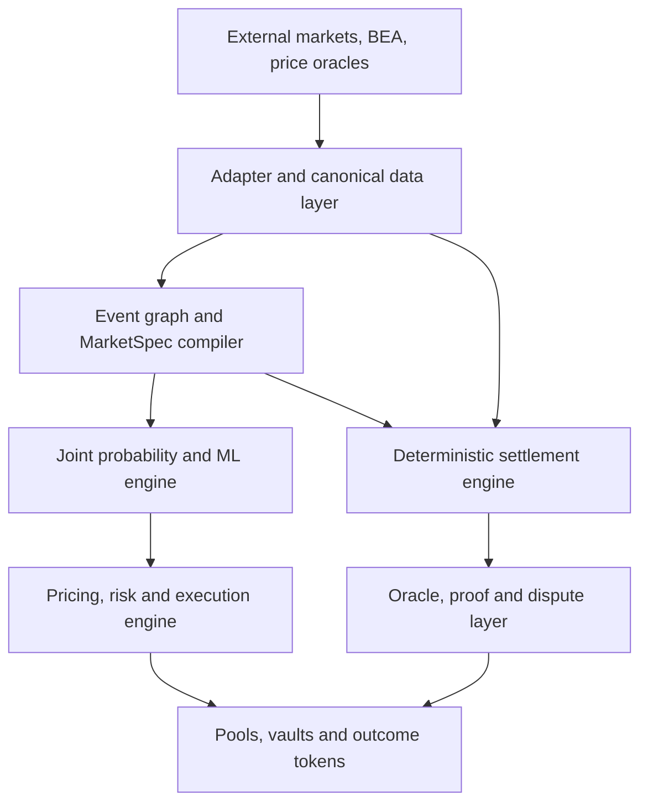

Sistem terbagi menjadi dua jalur:

- **Pricing path:** terus berubah selama market masih terbuka.
- **Truth/settlement path:** immutable, deterministik, dan dapat diaudit.

ML boleh memengaruhi pricing, quote, risk score, dan hedge. ML tidak boleh diam-diam mengubah definisi outcome setelah pengguna memasang posisi.

---

# 4. Semantic MarketSpec Engine

RetroPick membutuhkan domain-specific language/DSL untuk mendefinisikan market secara formal.

Contoh:

```json
{
  "schemaVersion": "1.0",
  "marketType": "CONVERGENCE",
  "question": "Will BTC and US real GDP move in the same direction in Q3 2026?",
  "variables": [
    {
      "id": "BTC_Q3_DIRECTION",
      "source": "CHAINLINK_BTC_USD",
      "startTime": "2026-07-01T00:00:00Z",
      "endTime": "2026-10-01T00:00:00Z",
      "transformation": "TWAP_RETURN",
      "upRule": "return > 0",
      "downRule": "return <= 0"
    },
    {
      "id": "US_REAL_GDP_Q3_DIRECTION",
      "source": "BEA_NIPA",
      "series": "REAL_GDP_QOQ_SAAR",
      "releaseVersion": "ADVANCE_ESTIMATE",
      "upRule": "value > 0",
      "downRule": "value <= 0"
    }
  ],
  "externalSignals": [
    {
      "venue": "POLYMARKET",
      "role": "PRICING_SIGNAL",
      "conditionId": "0x..."
    }
  ],
  "outcomes": [
    "BTC_DOWN_GDP_DOWN",
    "BTC_DOWN_GDP_UP",
    "BTC_UP_GDP_DOWN",
    "BTC_UP_GDP_UP"
  ],
  "displayGroups": {
    "CONVERGENCE": [
      "BTC_DOWN_GDP_DOWN",
      "BTC_UP_GDP_UP"
    ],
    "DIVERGENCE": [
      "BTC_DOWN_GDP_UP",
      "BTC_UP_GDP_DOWN"
    ]
  },
  "invalidPolicy": "REFUND",
  "settlementDelaySeconds": 86400,
  "disputeWindowSeconds": 172800
}
```

## Validasi oleh compiler

Sebelum market dapat dibuka, compiler harus memeriksa:

- Negara GDP sudah jelas.
- Real atau nominal GDP.
- QoQ, YoY, atau annualized rate.
- Advance, second, atau third estimate.
- Timezone dan timestamp BTC.
- Market window sama.
- Source memiliki historical audit trail.
- External market wording kompatibel.
- Semua atomic states mutually exclusive.
- Semua atomic states collectively exhaustive.
- Payout setiap state tidak melebihi collateral.
- Invalid/cancel/refund path tersedia.

Jika satu validasi gagal, market tidak boleh dibuat.

---

# 5. Event Graph

Structured markets sebaiknya direpresentasikan sebagai directed acyclic graph.

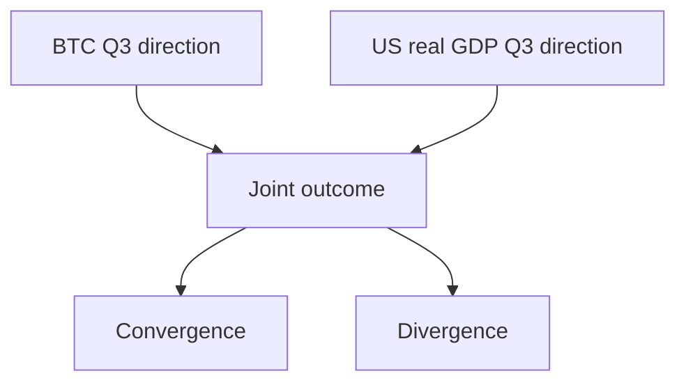

Setiap node mempunyai:

- `variableId`
- source
- observation period
- transformation
- resolution authority
- confidence/finality
- dependency list
- outcome state

Dengan graph ini, engine yang sama dapat membangun:

- Convergence.
- Composite.
- Cascade.
- Corridor.
- Range.
- Ladder.
- Conditional outcomes.

## Contoh cascade

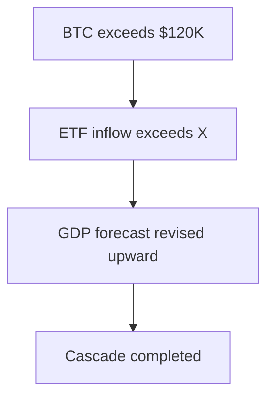

Cascade berbeda karena setiap node dapat mempunyai window dan resolution berbeda. Settlement baru final setelah semua required nodes selesai atau salah satu condition membuat cascade mustahil.

---

# 6. External market adapter

Polymarket menyediakan public orderbook, token positions, historical prices, WebSocket, CLOB, dan builder routing. Outcome shares-nya berupa ERC-1155 dan diselesaikan melalui conditional-token contracts. [Polymarket Orderbook](https://docs.polymarket.com/trading/orderbook), [Positions and Tokens](https://docs.polymarket.com/concepts/positions-tokens)

Adapter interface:

```typescript
interface PredictionVenueAdapter {
  discoverMarkets(query: SemanticQuery): Promise<ExternalMarket[]>;
  getMarket(marketId: string): Promise<ExternalMarket>;
  getOrderBook(tokenId: string): Promise<OrderBook>;
  getPriceHistory(tokenId: string): Promise<PricePoint[]>;
  estimateFill(order: OrderIntent): Promise<FillEstimate>;
  submitSignedOrder(order: SignedOrder): Promise<ExecutionReceipt>;
  getResolution(conditionId: string): Promise<ResolutionState>;
  redeem(position: ExternalPosition): Promise<RedemptionReceipt>;
}
```

## Peran liquidity eksternal

External market digunakan untuk:

1. Marginal probability signal.
2. External execution untuk underlying legs.
3. Hedge first-order exposure.
4. Price history dan market sentiment.
5. Optional builder fee revenue.

External market tidak memberikan correlation liquidity secara otomatis.

Polymarket saat ini juga mencantumkan `PositionManager`, `BinaryModule`, `NegRiskModule`, dan `CombinatorialModule`. Conditional Token Framework secara umum mendukung positions yang bergantung pada beberapa conditions. Namun jangan berasumsi setiap arbitrary combination tersedia di CLOB mereka; perlu menguji contract, relayer, collateral, dan Combo SDK yang benar-benar didukung. [Polymarket contracts](https://docs.polymarket.com/resources/contracts), [Gnosis Conditional Tokens developer guide](https://conditional-tokens.readthedocs.io/en/latest/developer-guide.html)

---

# 7. Joint Outcome Engine

Untuk RetroPick, solusi yang lebih terkendali adalah membuat satu condition dengan empat outcome:

```solidity
enum JointOutcome {
    BTC_DOWN_GDP_DOWN,
    BTC_DOWN_GDP_UP,
    BTC_UP_GDP_DOWN,
    BTC_UP_GDP_UP
}
```

Setiap $1 collateral dapat dibagi menjadi empat fully-backed atomic tokens:

\[
\$1 \rightarrow S_{00}+S_{01}+S_{10}+S_{11}
\]

Kemudian:

- Convergence wrapper memegang \(S_{00}+S_{11}\).
- Divergence wrapper memegang \(S_{01}+S_{10}\).

Atau UI dapat mengelompokkan dua atomic positions tanpa wrapper tambahan.

## Mengapa empat outcome lebih baik?

- Tidak ada correlation insolvency.
- Setiap kondisi dunia nyata memiliki representasi eksplisit.
- Payout deterministik.
- Dapat membangun derivative lain dari atomic states.
- Risk engine dapat menghitung exposure dengan tepat.
- Semua collateral tetap fully backed.

Untuk pool-based V1, pengguna cukup menyetor pada salah satu empat pool. UI dapat menawarkan one-click Convergence dengan membagi dana ke dua pool convergence berdasarkan model probability atau bobot yang dipilih pengguna.

---

# 8. Machine Learning Engine

ML engine tidak hanya satu model. Pisahkan menjadi empat fungsi.

## A. Semantic matching model

Mencocokkan market eksternal dengan variable RetroPick:

- Apakah “GDP up” berarti real atau nominal?
- Negara mana?
- Periode mana?
- Rilis mana?
- Source resolusinya apa?
- Apakah event benar-benar compatible?

LLM boleh menghasilkan kandidat mapping, tetapi hasilnya harus melalui deterministic validation dan human approval untuk market bernilai uang.

## B. Joint probability model

Tujuannya memperkirakan \(p_{11}\), bukan hanya \(p_B\) dan \(p_G\).

Input:

- Polymarket BTC probability history.
- Polymarket GDP probability history.
- BTC returns.
- BTC realized volatility.
- Interest rates.
- Yield curve.
- CPI.
- Unemployment.
- Financial conditions.
- GDP nowcast signals.
- Internal RetroPick pool distribution.
- Market depth dan spread.

Output:

```json
{
  "p00": 0.18,
  "p01": 0.22,
  "p10": 0.12,
  "p11": 0.48,
  "convergenceProbability": 0.66,
  "confidenceInterval": [0.51, 0.77],
  "modelVersion": "joint-btc-gdp-v3",
  "calibrationScore": 0.083
}
```

Model yang masuk akal:

- Bayesian VAR.
- Regularized logistic regression.
- Dynamic Bayesian network.
- Gaussian copula.
- Gradient boosting dengan calibration.
- Regime-switching model.
- Ensemble dari market probability dan macro nowcasting.

Deep neural network kemungkinan bukan pilihan terbaik. Bitcoin baru memiliki sekitar puluhan quarterly observations yang relevan dengan GDP; jumlah sampel terlalu kecil untuk high-dimensional deep learning. Gunakan model sederhana, regularization, dan uncertainty intervals.

## C. Predictive-impact model

Bangun dua model:

\[
M_0 = \text{GDP baseline model}
\]

Fitur baseline:

- Lag GDP.
- CPI.
- Unemployment.
- Interest rate.
- Yield curve.
- Industrial production.
- Financial conditions.

Kemudian:

\[
M_1=M_0+\text{Bitcoin features}
\]

Bitcoin features:

- Returns.
- Volatility.
- Drawdown.
- Trading volume.
- Stablecoin growth.
- BTC prediction-market probability.
- ETF flow bila source tersedia dan formal.

Impact score:

\[
ImpactScore =
1-\frac{Loss(M_1)}{Loss(M_0)}
\]

Jika loss baseline 0,20 dan loss BTC-enhanced 0,18:

\[
ImpactScore=1-\frac{0.18}{0.20}=10\%
\]

Pertanyaan market dapat menjadi:

> Apakah `ImpactScore ≥ 5%` pada empat GDP advance releases berikutnya?

Metric yang dapat dipakai:

- Brier score untuk direction probability.
- Log loss.
- RMSE untuk numeric GDP growth.
- Directional accuracy sebagai secondary metric.

Gunakan rolling-origin evaluation, bukan random train/test split, untuk mencegah future leakage.

## D. Model calibration and monitoring

Monitor:

- Brier score.
- Expected calibration error.
- Prediction interval coverage.
- Feature drift.
- Data freshness.
- External-market divergence.
- Regime changes.
- Correlation stability.

Model baru boleh dipakai untuk market baru. Model market yang sudah dibuka tidak boleh diganti.

---

# 9. Machine learning dalam settlement

ML settlement hanya diperbolehkan jika market secara eksplisit bertaruh pada hasil model.

Market harus menyimpan `ModelManifest`:

```json
{
  "modelId": "gdp-impact-v1",
  "artifactHash": "sha256:...",
  "containerDigest": "sha256:...",
  "codeCommit": "abc123",
  "datasetManifestHash": "sha256:...",
  "trainingCutoff": "2026-06-30T23:59:59Z",
  "randomSeed": 421337,
  "runtime": "onnxruntime-1.x-cpu",
  "metric": "BRIER_SCORE_IMPROVEMENT",
  "threshold": 0.05,
  "evaluationWindows": [
    "2026Q3",
    "2026Q4",
    "2027Q1",
    "2027Q2"
  ]
}
```

Persyaratan:

- Model artifact immutable.
- Container image immutable.
- Dataset version immutable.
- Seed tetap.
- Tidak ada online retraining.
- Floating-point/runtime ditentukan.
- Semua transformations versioned.
- Output dapat direproduksi beberapa validator.
- Full inference trace disimpan.
- Hash hasil dikirim on-chain.

LLM tidak boleh menjadi final resolver karena hasilnya tidak deterministik dan provider dapat mengganti model.

## Model execution quorum

Gunakan minimal tiga independent settlement workers:

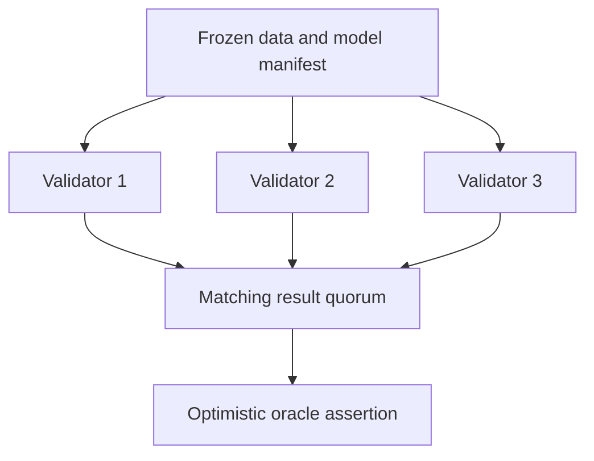

Jika minimal 2/3 hasil dan trace hash identik:

- Settlement proposal dibuat.
- Proof bundle dipublikasikan.
- Challenge window dimulai.
- Jika tidak disputed, settlement final.
- Jika disputed, escalated ke oracle/arbitrator.

UMA OOV3 dapat menerima assertion mengenai hasil proses off-chain dan memberikan challenge/dispute period. [UMA Data Asserter](https://docs.uma.xyz/developers/optimistic-oracle-v3/data-asserter), [UMA Oracle lifecycle](https://docs.uma.xyz/protocol-overview/how-does-umas-oracle-work)

Untuk V1, optimistic verification lebih realistis daripada zkML.

---

# 10. Deterministic Settlement Engine

Untuk standard convergence, settlement tidak memerlukan ML.

## Base outcome calculation

BTC direction:

\[
r_{BTC}
=
\frac{TWAP_{end}-TWAP_{start}}{TWAP_{start}}
\]

\[
B =
\begin{cases}
UP & r_{BTC}>0\\
DOWN & r_{BTC}\leq0
\end{cases}
\]

Gunakan TWAP beberapa oracle rounds di sekitar timestamp, bukan satu tick, untuk mengurangi timestamp/manipulation anomaly. Chainlink menyediakan historical rounds melalui `getRoundData`, tetapi engine tetap harus memeriksa heartbeat, timestamp, decimals, staleness, dan feed migration. [Chainlink historical data](https://docs.chain.link/data-feeds/historical-data)

GDP direction:

\[
G =
\begin{cases}
UP & GDP_{QoQ,SAAR}>0\\
DOWN & GDP_{QoQ,SAAR}\leq0
\end{cases}
\]

Gunakan:

- U.S. real GDP.
- Quarter-over-quarter.
- Seasonally adjusted annual rate.
- BEA advance estimate.
- Rilis pertama saja.

Ini penting karena GDP direvisi. BEA menjelaskan advance estimate dirilis sekitar 25–30 hari setelah quarter selesai, menggunakan data yang belum lengkap, dan subject to revision. [BEA advance estimate](https://www.bea.gov/help/glossary/advance-estimate), [GDP revision information](https://www.bea.gov/gdp-revision-information)

Setelah advance estimate digunakan untuk settlement, second/third estimate tidak boleh mengubah payout.

## Settlement state machine

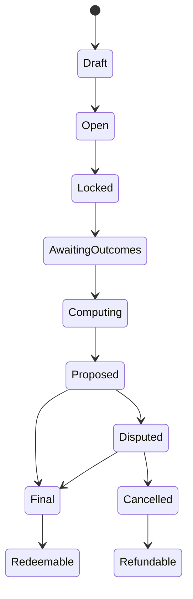

Setiap transition harus:

- Idempotent.
- Menghasilkan event.
- Mempunyai actor authorization.
- Menyimpan block number dan timestamp.
- Dapat direkonstruksi dari event log.
- Tidak dapat bergerak mundur kecuali melalui defined dispute flow.

---

# 11. On-chain contracts

## `MarketRegistry`

Menyimpan:

- `marketId`
- `specHash`
- market type
- atomic outcomes
- collateral
- open/lock/settlement timestamps
- model manifest hash
- oracle policy
- adapter versions

## `ConditionalPositionManager`

Mengelola:

- Split collateral.
- Mint joint-outcome ERC-1155.
- Merge complete sets.
- Redeem final positions.
- Convergence/divergence wrappers.

## `CollateralVault`

Menjamin:

\[
TotalLiabilities \leq TotalCollateral
\]

Vault tidak boleh menggunakan collateral pengguna untuk membayar operational expenses atau hedging tanpa batas formal.

## `SettlementCoordinator`

- Menerima base-outcome observations.
- Memverifikasi validator signatures.
- Mengirim assertion ke oracle.
- Finalisasi payout vector.
- Menangani invalid/refund.

## `AdapterRegistry`

Whitelist:

- Polymarket adapter.
- Chainlink adapter.
- BEA data attestor.
- UMA adapter.
- Future prediction venues.

Setiap upgrade memakai delay/timelock.

## `RiskController`

- Market exposure cap.
- Per-wallet cap.
- Max unresolved collateral.
- Max external venue exposure.
- Circuit breaker.
- Pause only new deposits, jangan memblokir valid withdrawal tanpa alasan kritis.

## `FeeRouter`

Memisahkan:

- Protocol fee.
- Builder fee.
- Resolver reward.
- Disputer reward.
- Referral revenue.
- Treasury.

---

# 12. Liquidity and hedging engine

Untuk pool-based V1, semua posisi fully funded oleh peserta. External hedging tidak diperlukan untuk solvency.

Tampilkan dua probability:

- **Pool-implied probability**
- **Model/external fair probability**

Contoh:

```json
{
  "poolProbability": {
    "convergence": 0.72,
    "divergence": 0.28
  },
  "modelProbability": {
    "convergence": 0.61,
    "divergence": 0.39
  },
  "externalInputs": {
    "btcUp": 0.63,
    "gdpUp": 0.54
  },
  "confidence": "MEDIUM"
}
```

## External hedge limitations

External BTC/GDP marginal positions dapat mengurangi delta terhadap masing-masing event, tetapi tidak menghilangkan \(BG\) interaction risk.

Untuk V2/V3, gunakan solver/RFQ:

1. RetroPick mengirim signed structured `MarketSpec`.
2. Solver menghitung joint quote.
3. Solver menawarkan collateralized price.
4. User menerima quote.
5. Solver mengunci collateral.
6. Solver bebas melakukan hedge pada Polymarket.
7. RetroPick settlement contract membayar berdasarkan joint outcome.

Solver menerima correlation risk yang tidak dapat di-hedge sempurna. Ini lebih benar secara financial engineering daripada mengklaim dua token marginal sudah membentuk full structured liquidity.

---

# 13. Data architecture

Minimum tables:

- `canonical_variables`
- `external_markets`
- `semantic_mappings`
- `market_specs`
- `market_dependencies`
- `outcome_states`
- `signal_snapshots`
- `orderbook_snapshots`
- `model_manifests`
- `model_runs`
- `quotes`
- `positions`
- `ledger_entries`
- `settlement_observations`
- `settlement_proofs`
- `disputes`
- `audit_events`

Gunakan append-only ledger untuk dana:

```text
DEPOSIT
POSITION_MINT
EXTERNAL_BUY
EXTERNAL_SELL
FEE_ACCRUAL
REDEMPTION
REFUND
WITHDRAWAL
```

Saldo tidak boleh hanya dihitung dari satu kolom mutable. Gunakan double-entry accounting atau setidaknya immutable ledger plus reconciliation.

---

# 14. Arsitektur murah untuk VPS

Jangan langsung memakai Kubernetes, Kafka, dan puluhan microservices.

Gunakan modular monolith:

```text
Next.js frontend
        │
TypeScript API / Market Engine
        │
PostgreSQL + outbox/job queue
        │
Python ML worker
        │
EVM indexer / adapter workers
        │
Solidity contracts
```

Docker Compose:

- `web`
- `api`
- `ml-worker`
- `settlement-worker`
- `postgres`
- `reverse-proxy`

PostgreSQL outbox cukup untuk event berikut:

- `market.created`
- `market.opened`
- `market.locked`
- `signal.updated`
- `outcome.observed`
- `settlement.computed`
- `settlement.proposed`
- `settlement.disputed`
- `settlement.finalized`
- `position.redeemed`

Kafka/NATS baru diperlukan setelah throughput dan team size membenarkan operational complexity.

---

# 15. Failure handling

| Failure | Respons |
|---|---|
| External orderbook down | Pause new external routing; internal pool tetap berjalan |
| Polymarket market cancelled | Jangan otomatis cancel RetroPick jika canonical source tetap valid |
| BEA release tertunda | Extend awaiting state sesuai predefined rule |
| GDP direvisi | Abaikan jika spec memakai advance estimate |
| Chainlink stale | Gunakan specified fallback window atau dispute |
| Validators berbeda hasil | Jangan propose; masuk manual review |
| Model artifact hilang | Retrieve by immutable content hash; jika tidak tersedia, refund |
| External semantics berubah | Adapter version pinned; market lama tidak ikut berubah |
| Chain reorg | Tunggu confirmation/finality threshold |
| Oracle disputed | Freeze redemption hingga final arbitration |
| ML drift | Berlaku untuk market baru; model market lama tetap frozen |
| Insufficient pool | Refund |
| Impossible/ambiguous outcome | Invalid/refund |

---

# 16. Rekomendasi implementasi RetroPick

## Phase 1 — Real convergence engine

Bangun:

- MarketSpec DSL.
- Dua canonical variables.
- Empat atomic joint outcomes.
- Pooled pari-mutuel settlement.
- Manual multisig resolution.
- External probabilities hanya sebagai signal.
- No external fund routing.

## Phase 2 — Polymarket signal adapter

- Fetch relevant external markets.
- WebSocket price history.
- Semantic compatibility score.
- Orderbook depth.
- Marginal probability normalization.
- No auto-trading dulu.

## Phase 3 — ML joint-pricing engine

- Bayesian/logistic/copula baseline.
- Rolling backtest.
- Confidence interval.
- Model vs pool probability.
- Calibration dashboard.

## Phase 4 — Deterministic oracle pipeline

- Chainlink BTC observations.
- BEA API ingestion.
- Immutable proof bundle.
- 3-validator computation.
- Optimistic dispute window.

BEA menyediakan API resmi untuk published economic data dan metadata. [BEA API](https://apps.bea.gov/api/signup/)

## Phase 5 — Non-custodial external execution

- User smart wallet.
- Polymarket builder code.
- Batch external positions.
- Positions tetap dimiliki user.
- External execution tidak mengontrol RetroPick settlement.

## Phase 6 — RFQ/solver liquidity

- Solvers quote structured joint risk.
- Fully collateralized quotes.
- Internal netting.
- External marginal hedging.
- Exposure and solver reputation limits.

---

## Final system decision

Market awal jangan diberi nama:

> “Does Bitcoin impact GDP?”

Gunakan:

> **“Will Bitcoin and U.S. real GDP move in the same direction during Q3 2026?”**

Itu adalah market yang objektif dan dapat diselesaikan.

Kemudian tampilkan analytics terpisah:

> **RetroPick Impact Evidence: seberapa besar BTC features meningkatkan kemampuan model memprediksi GDP?**

Arsitektur yang benar adalah:

> External prediction markets menyediakan marginal signals dan sebagian hedge; RetroPick Event Graph membentuk empat joint states; ML memperkirakan dependence dan fair probability; pool atau solver menyediakan correlation liquidity; settlement engine menentukan outcome secara deterministik dari data resmi; optimistic oracle menangani dispute.

Itulah structured event-market engine yang benar-benar berbeda dari Polymarket biasa—bukan hanya frontend yang menggabungkan dua market.

### User
As senior engineer and core engineer and senior smart contract engoneer analyze deeply for all types of markets so that we can innovativevate existing prediction market (Kalshi, polymarket, hip 4, etc (router contract? )) to be structured market, make the math model an doptimize it for smart contract model engine they can be deployed with templates. Analyze deeply, architect, research deeply, make math model, innovate, make a smart contract v2 (give it a name for its innovatikn), design smart contract framework in solidity, architect the flowchart details, reanalyze and explain in detail each components from math to smart contract

### Assistant
Saya akan memperlakukannya sebagai desain protokol baru—bukan sekadar aggregator UI. Saya mulai dari tiga lampiran Anda, lalu verifikasi arsitektur dan batas integrasi Kalshi, Polymarket, serta HIP-4 dari sumber primer; setelah itu saya turunkan model payoff → compiler template → router/adapter → settlement → kerangka Solidity dan threat model.

### Assistant
```json
{
  "plan": [
    {
      "step": "Baca lampiran dan petakan requirement/ide sebelumnya",
      "status": "in_progress"
    },
    {
      "step": "Riset sumber primer Kalshi, Polymarket, HIP-4 dan primitive settlement/token",
      "status": "pending"
    },
    {
      "step": "Rancang taksonomi market, matematika payoff, pricing, collateral, dan hedging",
      "status": "pending"
    },
    {
      "step": "Rancang arsitektur protocol/router/adapter/settlement dan flow lengkap",
      "status": "pending"
    },
    {
      "step": "Turunkan framework Solidity V2, template deployment, keamanan, dan roadmap murah",
      "status": "pending"
    }
  ]
}
```

### Assistant
```
bash -lc /bin/bash -lc "wc -l -w upload/*.md && sed -n '1,260p' 'upload/Markdown yang ditempelkan (1)(38).md' && sed -n '1,280p' 'upload/Markdown yang ditempelkan (2)(2).md' && sed -n '1,320p' 'upload/Markdown yang ditempelkan (3).md'"
```

### Tool
The output of this plugin was redacted.

### Assistant
_Menghitung baris, kata, dan membaca markdown_

### Assistant
Tiga lampiran menunjukkan fondasi yang sudah cukup matang: ada 9 tipe market, dispatcher UUPS modular, rolling epochs, multi-oracle, dan rancangan convergence/joint-state. Temuan penting awal: V2 sebaiknya tidak menambah `if/else` per tipe ke engine lama; ia perlu “payoff bytecode/IR” terbatas yang dikompilasi dari template, sehingga tipe baru adalah kombinasi primitive yang diaudit, bukan kontrak baru setiap kali.

### Assistant
```
bash -lc /bin/bash -lc "rg -n '"'^#{1,4} '"' upload/*.md"
```

### Tool
The output of this plugin was redacted.

### Assistant
_Mencari judul pada file markdown_

### Assistant
Search tool invoked with queries:
- site:docs.polymarket.com developers CTF conditional tokens combinatorial markets neg risk CLOB API official
- site:docs.kalshi.com API orderbook orders market settlement official
- site:hyperliquid.gitbook.io HIP-4 outcome trading official
- site:hyperfoundation.org HIP-4 outcome trading official

### Assistant
Search tool invoked with queries:
- HIP-4 Hyperliquid proposal outcome contracts prediction markets official docs
- Hyperliquid HIP-4 outcome trading documentation testnet
- site:github.com/hyperliquid-dex HIP-4
- site:hyperliquid.gitbook.io "HIP-4"

### Assistant
Search tool invoked with queries:
- site:hyperliquid.gitbook.io/hyperliquid-docs outcomeMeta outcome trading
- site:hyperliquid.gitbook.io/hyperliquid-docs "Outcome tokens"
- site:hyperliquid.gitbook.io/hyperliquid-docs "settledOutcome"
- site:hyperliquid.gitbook.io/hyperliquid-docs trading API exchange endpoint signature

### Assistant
Search tool invoked with queries:
- site:docs.polymarket.com/developers CTF split merge redeem positions official
- site:docs.polymarket.com developers neg risk multi outcome convert split official
- site:docs.polymarket.com developers builder fees relayer orders CLOB v2 official
- site:docs.polymarket.com concepts resolution UMA official

### Assistant
Search tool invoked with queries:
- site:docs.polymarket.com/trading/ctf "Negative Risk Markets"
- site:docs.polymarket.com "No token" "all other" outcomes neg risk
- site:docs.polymarket.com "convert" "Neg Risk"

### Assistant
Search tool invoked with queries:
- site:docs.kalshi.com multivariate event combo markets official API
- site:docs.kalshi.com getting started authentication orders official API
- site:docs.kalshi.com market settlement source rules official API
- site:kalshi.com regulatory designated contract market CFTC official

### Assistant
Search tool invoked with queries:
- site:docs.kalshi.com/getting_started authentication API keys RSA PSS official
- site:docs.kalshi.com/api-reference portfolio create order official
- site:docs.kalshi.com/api-reference events multivariate collections create market combo

### Assistant
_Searched 80 websites_

### Assistant
```
bash -lc /bin/bash -lc "sed -n '270,545p' 'upload/Markdown yang ditempelkan (2)(2).md'; sed -n '694,1035p' 'upload/Markdown yang ditempelkan (2)(2).md'; sed -n '203,376p' 'upload/Markdown yang ditempelkan (1)(38).md'; sed -n '325,995p' 'upload/Markdown yang ditempelkan (3).md'"
```

### Tool
The output of this plugin was redacted.

### Assistant
_Membaca bagian-bagian dan potongan file Markdown_

### Assistant
Audit konseptual terhadap V1 menemukan empat masalah yang harus diperbaiki sebelum menjadi “structured engine”: raw `abs(priceA-priceB)` tidak sah untuk aset beda unit; Composite memakai satu threshold global untuk semua feed; Ladder “weight = 4x” tidak otomatis benar pada pool pari-mutuel; dan OHLC reporter tidak membuktikan harga tidak pernah menyentuh corridor di antara sampel. Saya akan jadikan hal-hal ini invariant compiler, bukan sekadar peringatan UI.

### Assistant
Search tool invoked with queries:
- site:hyperliquid.gitbook.io/hyperliquid-docs HyperCore HyperEVM read precompile write system contract official
- site:hyperliquid.gitbook.io/hyperliquid-docs CoreWriter contract official
- site:hyperliquid.gitbook.io/hyperliquid-docs HyperCore EVM transfers latency official
- site:hyperliquid.gitbook.io/hyperliquid-docs sendToEvmWithData coreReceiveWithData official

### Assistant
Search tool invoked with queries:
- site:docs.chain.link data feeds historical data getRoundData limitations official
- site:docs.chain.link data streams report verification official
- site:docs.chain.link data-feeds l2 sequencer uptime feeds official
- site:docs.uma.xyz optimistic oracle v3 data asserter official

### Assistant
Search tool invoked with queries:
- site:docs.chain.link/data-feeds/historical-data historical data getRoundData
- site:docs.chain.link/data-streams/reference/report-schema report verification
- site:docs.chain.link/data-feeds/l2-sequencer-feeds sequencer uptime

### Assistant
Search tool invoked with queries:
- site:conditional-tokens.readthedocs.io developer guide split position multiple conditions collection ID official
- site:conditional-tokens.readthedocs.io conditional tokens combinatorial positions payoff official
- site:github.com/gnosis/conditional-tokens-contracts ConditionalTokens.sol official

### Assistant
Search tool invoked with queries:
- site:docs.kalshi.com broker API integration official
- site:kalshi.com broker program API event contracts official
- site:cftc.gov KalshiEX designated contract market official

### Assistant
Search tool invoked with queries:
- site:hyperliquid.gitbook.io/hyperliquid-docs "Outcome" "fully collateralized"
- site:hyperliquid.gitbook.io/hyperliquid-docs "Outcome fees"
- site:hyperliquid.gitbook.io/hyperliquid-docs "outcomeMeta"

### Assistant
Tool parameters:
- explanation: Lampiran dan sumber primer sudah dipetakan. Desain inti diputuskan: RetroPick Prism V2 memakai typed payoff compiler + bounded on-chain kernel, dengan pemisahan tegas antara data, eksekusi venue, collateral, dan settlement.

### Assistant
Search tool invoked with queries:
- site:eips.ethereum.org EIP-712 typed structured data hashing signing
- site:eips.ethereum.org EIP-1271 contract signature validation
- site:eips.ethereum.org EIP-1155 multi token standard

### Assistant
_Searched 75 websites_

### Assistant
Desain final saya beri nama **RetroPick PRISM V2 — Programmable Risk & Information Settlement Machine**. Primitive utamanya bukan `MarketType enum`, melainkan tiga artefak immutable: `ResolverProgram` (menentukan state dunia), `PayoffMatrix` (berapa tiap claim dibayar pada setiap state), dan `OraclePolicy` (bagaimana observation dibuktikan). Ini membuat template bisa ditambah tanpa mengubah accounting core, sambil tetap membatasi program agar aman dan murah.

### Assistant
Tool parameters:
- explanation: Model matematika, arsitektur lintas-venue, payoff compiler, kernel Solidity, settlement, serta roadmap implementasi telah disatukan dalam desain PRISM V2.

### Assistant
_Memproses selama 7m 47s_

### Assistant
# RetroPick PRISM V2

Kesimpulan utamanya: RetroPick tidak seharusnya dibangun sebagai “router contract yang mengirim dana ke berbagai prediction market”. Itu hanya berfungsi untuk sebagian kecil venue dan tidak menghasilkan structured liquidity secara otomatis.

Arsitektur yang benar adalah:

> **RetroPick PRISM V2 — Programmable Risk & Information Settlement Machine**

PRISM memisahkan tiga hal yang selama ini tercampur:

1. **Resolver Program** — menentukan state dunia yang terjadi.
2. **Payoff Matrix** — menentukan pembayaran setiap structured claim pada setiap state.
3. **Oracle Policy** — menentukan data, waktu observasi, finality, revision, dan mekanisme dispute.

External venue seperti Polymarket, Kalshi, dan HIP-4 kemudian menjadi sumber sinyal, sumber posisi hedge, atau execution venue—bukan sumber kebenaran universal dan bukan collateral bersama.

---

## 1. Koreksi mendasar atas engine sekarang

Berdasarkan tiga dokumen RetroPick, engine sekarang sudah memiliki fondasi bagus: rolling epochs, UUPS dispatcher, multi-oracle, pool accounting, claim reserve, dan sembilan tipe market.

Namun ada beberapa masalah desain yang akan menjadi berbahaya jika langsung diperluas.

| Area | Masalah sekarang | Perbaikan PRISM |
|---|---|---|
| Convergence | Membandingkan `abs(priceA-priceB)` untuk aset berbeda | Gunakan normalized return, ratio, target spread, atau joint direction |
| Composite | Satu `absoluteThresholdValueE8` digunakan untuk semua feed | Setiap leg harus punya threshold, scale, unit, comparator, dan waktu sendiri |
| Ladder | “Weight 4x” dianggap otomatis memberikan payout 4x | Pari-mutuel tidak dapat menjamin multiplier tanpa collateral tambahan |
| Corridor | OHLC reporter dianggap membuktikan harga tidak pernah melewati batas | Harus mendefinisikan sample cadence, maximum gap, dan sumber path report |
| Settlement | Manual dan rolling memiliki implementasi settlement terpisah | Keduanya harus memanggil satu pure settlement kernel |
| Oracle timing | Keeper membaca `latestRoundData()` saat transaksi masuk | Observasi harus mengacu pada target timestamp dan admissible window |
| User history | `_userEpochs` disimpan on-chain | Gunakan events/indexer; first-deposit gas sekarang jauh lebih mahal |
| Upgrade | Dispatcher, selector modules, dan storage bersama makin kompleks | V2 sebaiknya deployment terpisah dengan accounting core minimal |
| Yield | Collateral market dapat masuk yield router | Untuk V2 awal, collateral prediction market jangan direhypothecate |

Saya tidak merekomendasikan memasukkan seluruh PRISM melalui upgrade storage engine V1. Biarkan V1 menjadi rolling pari-mutuel engine, lalu deploy PRISM sebagai protokol V2 terpisah.

---

# 2. Realitas integrasi tiap venue

## Polymarket

Polymarket adalah venue paling composable:

- Outcome positions berupa ERC-1155.
- Setiap pasangan Yes/No dijamin oleh collateral.
- Collateral dapat di-split menjadi Yes + No, di-merge kembali, lalu diredeem setelah resolution.
- CLOB digunakan untuk trading, tetapi order dibuat dan ditandatangani di luar chain sebelum settlement on-chain.
- Negative Risk menghubungkan market one-of-N: satu No dapat dikonversi menjadi Yes pada outcome lainnya.

Primitive ini terdokumentasi pada [Polymarket CTF](https://docs.polymarket.com/trading/ctf/overview), [positions and tokens](https://docs.polymarket.com/concepts/positions-tokens), dan [negative-risk markets](https://docs.polymarket.com/advanced/neg-risk).

Tetapi batasannya penting:

- Negative Risk hanya cocok jika outcome mutually exclusive dan exactly-one-wins.
- Ia tidak menciptakan payoff arbitrary seperti “BTC naik dan GDP turun”.
- CLOB liquidity tidak otomatis dapat dipindahkan ke market RetroPick.
- Router contract tidak dapat menggantikan signed CLOB order dan off-chain matcher.
- CLOB V2 menggunakan konfigurasi fee dan order semantics baru, jadi adapter harus versioned. [Polymarket CLOB V2](https://docs.polymarket.com/v2-migration)

Kesimpulan: Polymarket bisa menjadi on-chain position adapter dan hedge venue, terutama jika PRISM berada di Polygon, tetapi bukan universal structured engine.

## Kalshi

Kalshi sudah memiliki:

- Binary orderbooks.
- Multivariate Event/Combo markets.
- Endpoint untuk membuat kombinasi dari collection yang sudah diizinkan.
- RFQ untuk market biasa dan combo.
- REST, FIX, dan WebSocket.

Kalshi bahkan menyediakan endpoint untuk membuat market dari selected legs dalam sebuah Multivariate Event Collection. Namun pengguna hanya boleh mengombinasikan collection dan legs yang sudah disediakan Kalshi—bukan membuat arbitrary structured payoff. [Kalshi multivariate market API](https://docs.kalshi.com/api-reference/multivariate/create-market-in-multivariate-event-collection), [Kalshi RFQ](https://docs.kalshi.com/getting_started/rfqs)

Integrasinya bukan smart-contract integration:

- Tidak ada ERC-1155 Kalshi yang dapat diterima contract RetroPick.
- Dana berada dalam account Kalshi.
- Trading API menggunakan RSA-PSS API keys milik account. [Kalshi API authentication](https://docs.kalshi.com/getting_started/api_keys)
- Solidity tidak dapat memanggil Kalshi secara atomic.
- Jika RetroPick mengeksekusi order atas nama pengguna, muncul persoalan custody, brokerage, jurisdiction, KYC, dan API-key security.

Kalshi adalah CFTC Designated Contract Market dan clearing affiliate-nya adalah DCO. Karena itu integrasi execution sebaiknya melalui hubungan resmi broker/institutional, bukan smart contract yang menyamarkan centralized account. [CFTC designation](https://www.cftc.gov/PressRoom/PressReleases/8302-20)

Rekomendasi:

- V1: Kalshi sebagai market-data signal.
- V2: user menghubungkan account sendiri atau diarahkan ke Kalshi.
- V3: execution hanya setelah partnership/compliance review.
- Jangan menyimpan API private key pengguna di VPS biasa.

## Hyperliquid HIP-4

Official Hyperliquid documentation sudah mendefinisikan outcome assets:

\[
encoding=10\times outcomeId+side
\]

dan:

\[
assetId=100{,}000{,}000+encoding
\]

Outcome side berperilaku mirip spot asset, tetapi representasinya khusus. [Hyperliquid outcome asset IDs](https://hyperliquid.gitbook.io/hyperliquid-docs/for-developers/api/asset-ids)

Namun dokumentasi resmi `outcomeMeta` masih menandainya sebagai **testnet-only**, sehingga production support belum boleh diasumsikan stabil. [Hyperliquid outcome metadata](https://hyperliquid.gitbook.io/hyperliquid-docs/for-developers/api/info-endpoint/spot)

HyperEVM memiliki:

- HyperCore read precompiles.
- `CoreWriter` system contract untuk mengirim action dari EVM ke HyperCore.
- Limit-order action dan asset IDs.
- Beberapa detik delay untuk CoreWriter order actions. [HyperCore interaction](https://hyperliquid.gitbook.io/hyperliquid-docs/for-developers/hyperevm/interacting-with-hypercore)

Tetapi sebelum menggunakan HIP-4 dari Solidity, RetroPick harus membuktikan melalui testnet bahwa:

- Outcome asset ID diterima CoreWriter.
- Balance/outcome state dapat dibaca melalui precompile.
- Settlement record tersedia secara deterministik.
- Withdrawal/transfer outcome token ke HyperEVM benar-benar didukung.
- Mainnet API dan permissionless deployment sudah stabil.

Jadi adapter HIP-4 harus berada di belakang feature flag dan pada awalnya read-only.

## Capability model

Jangan membuat satu interface `PredictionMarketAdapter` yang berasumsi semua venue sama. Gunakan capability bitmap:

```text
READ_MARKETS
READ_ORDERBOOK
READ_HISTORY
EXECUTE_USER_SIGNED
EXECUTE_CUSTODIAL
TRANSFER_POSITION_ONCHAIN
SPLIT_COMPLETE_SET
MERGE_COMPLETE_SET
VERIFY_RESOLUTION_ONCHAIN
ATOMIC_SAME_CHAIN
SUPPORTS_COMBO
SUPPORTS_RFQ
```

Polymarket, Kalshi, dan HIP-4 akan memiliki kombinasi capability berbeda.

---

# 3. Model matematika universal PRISM

## 3.1 State dunia dan payoff matrix

Misalkan semua kemungkinan final state adalah:

\[
\Omega=\{\omega_0,\omega_1,\ldots,\omega_{S-1}\}
\]

Dan terdapat \(M\) tradable claims. PRISM menyimpan payoff matrix:

\[
H\in[0,1]^{M\times S}
\]

Elemen:

\[
H_{m,s}
\]

adalah payout claim \(m\) jika state \(s\) terjadi.

Contoh BTC/GDP:

| State | BTC | GDP |
|---|---:|---:|
| \(S_{00}\) | Down | Down |
| \(S_{01}\) | Down | Up |
| \(S_{10}\) | Up | Down |
| \(S_{11}\) | Up | Up |

Dua structured claims:

\[
H_{\text{conv}}=[1,0,0,1]
\]

\[
H_{\text{div}}=[0,1,1,0]
\]

Dalam setiap state:

\[
H_{\text{conv},s}+H_{\text{div},s}=1
\]

Karena itu satu unit Convergence + satu unit Divergence dapat diterbitkan menggunakan collateral satu unit.

## 3.2 Solvency invariant

Jika jumlah claim \(m\) yang beredar adalah \(q_m\), liability pada state \(s\):

\[
L_s=\sum_m q_mH_{m,s}
\]

Collateral minimum:

\[
C_{\min}=\max_s L_s
\]

Invariant contract:

\[
\boxed{VaultCollateral\geq\max_s L_s}
\]

Untuk complete set dengan jumlah yang sama dan setiap kolom payoff menjumlah satu:

\[
\sum_m H_{m,s}=1
\]

maka collateral satu dolar dapat mencetak satu unit setiap claim.

Itulah fondasi structured token yang benar. “Ada banyak dana di market eksternal” tidak sama dengan “PRISM solvent”.

## 3.3 Pembuktian external positions tidak selalu dapat mereplikasi target

Misalkan external positions hanya menyediakan:

- Cash.
- BTC Up, \(B\).
- GDP Up, \(G\).

Payoff vectors:

\[
1=[1,1,1,1]
\]

\[
B=[0,0,1,1]
\]

\[
G=[0,1,0,1]
\]

Kita ingin:

\[
C=[1,0,0,1]
\]

Misalkan:

\[
C=a+bB+cG
\]

Dari state \(S_{00}\):

\[
a=1
\]

Dari \(S_{01}\):

\[
a+c=0 \Rightarrow c=-1
\]

Dari \(S_{10}\):

\[
a+b=0 \Rightarrow b=-1
\]

Tetapi pada \(S_{11}\):

\[
a+b+c=1-1-1=-1
\]

Padahal convergence harus membayar \(1\). Jadi tidak ada solusi.

Payoff convergence sebenarnya:

\[
C=1-B-G+2BG
\]

Term \(BG\) adalah joint/correlation exposure yang tidak tersedia dari dua marginal market.

Secara umum, jika \(A\) adalah matrix payoff instruments eksternal dan \(h\) adalah payoff target, exact replication hanya ada bila:

\[
Aw=h
\]

Jika tidak ada \(w\), solver hanya dapat membuat imperfect hedge dan harus mengunci collateral untuk residual risk.

## 3.4 Robust superhedging

Optimizer solver dapat mencari:

\[
\min_{w,k} \; Cost(w)+\lambda k
\]

dengan constraint:

\[
Aw+k\mathbf{1}\geq h
\]

Di sini:

- \(w\): positions pada external venues.
- \(k\): collateral tambahan.
- \(Aw\): payoff hedge.
- \(h\): liability structured claim.

Jika venue memiliki cancellation, bridge, atau settlement risk, state space harus ditambah:

```text
TARGET_YES + VENUE_VALID
TARGET_YES + VENUE_INVALID
TARGET_NO  + VENUE_VALID
TARGET_NO  + VENUE_INVALID
VENUE_INSOLVENT
BRIDGE_DELAYED
```

External hedge tidak boleh dihitung 100% sebagai collateral kecuali custody dan semantic equivalence dapat dibuktikan.

---

# 4. Math untuk pool-based RetroPick

Untuk pool pari-mutuel:

- \(P_i\): total stake outcome \(i\).
- \(T=\sum_iP_i\).
- \(w\): winning outcome.
- \(L=T-P_w\): losing pool.
- \(f\): settlement fee.
- \(u\): stake user pada winner.

Net distributable losing pool:

\[
D=(1-f)L
\]

Payout user:

\[
Payout(u)=\frac{u}{P_w}(P_w+D)
\]

atau:

\[
Payout(u)=u\left(1+\frac{(1-f)L}{P_w}\right)
\]

Effective multiplier:

\[
Multiplier=1+\frac{(1-f)L}{P_w}
\]

Multiplier muncul dari rasio pool, bukan dari admin-defined `ladderWeight`.

## Kesalahan konsep Ladder

Jika hanya satu tier menang dan seluruh winning pool berbagi total collateral, mengalikan semua winner dengan weight yang sama akan hilang setelah normalisasi.

Jika contract membayar:

\[
D_w=\alpha_w(1-f)L
\]

maka:

- \(\alpha_w<1\): sebagian losing pool ditahan.
- \(\alpha_w=1\): pari-mutuel biasa.
- \(\alpha_w>1\): contract insolvent kecuali ada collateral tambahan.

Karena itu PRISM harus memisahkan:

1. **PariMutuel Ladder**
   Multiplier sepenuhnya ditentukan pool.

2. **Fixed-Payout Ladder**
   Payout ditentukan sebelumnya dan issuer mengunci worst-case collateral.

3. **Tranche Ladder**
   Setiap state memiliki payout matrix eksplisit dan column-sum dibatasi collateral.

Jangan menampilkan “4x” jika 4x belum sepenuhnya dijamin.

---

# 5. Taksonomi market berdasarkan payoff primitive

PRISM tidak memerlukan enum baru untuk setiap ide. Tipe market merupakan komposisi observation, transformation, predicate, dan payoff.

Gunakan:

- \(x_0,x_1\): nilai awal/akhir.
- \(H,L\): observed high/low.
- \(r=(x_1-x_0)/|x_0|\): return.
- \(\tau_A\): waktu pertama kondisi A terpenuhi.

| Family | Formula inti | Contoh |
|---|---|---|
| Direction | \(x_1>x_0+\epsilon\) | BTC up/down |
| Threshold | \(x_1\geq K\) | CPI ≥ 3% |
| Range | \(b_i\leq x_1<b_{i+1}\) | BTC close bucket |
| Velocity | \(|x_1-x_0|/|x_0|\) | move 0–2%, 2–5% |
| Scalar | \(\mathrm{clamp}((x-L)/(U-L),0,1)\) | fractional payout |
| Relative performance | \(A_1B_0>A_0B_1\) | ETH outperforms BTC |
| Target convergence | \(D(A_1/B_1,k)<D(A_0/B_0,k)\) | ratio moves toward target |
| Co-movement | \(\operatorname{sign}(r_A)=\operatorname{sign}(r_B)\) | BTC/GDP same direction |
| Joint state | Cartesian product outcomes | BTC up + GDP down |
| Composite | AND/OR/K-of-N | 3 of 5 macro conditions |
| Conditional | A activates B; otherwise refund | If Fed cuts, will BTC rise? |
| Implication | \(\neg A\lor B\) | Logical “if A then B” |
| Corridor | \(L_{band}<\min x(t)\land\max x(t)<U_{band}\) | stayed inside |
| Touch/barrier | \(\tau_K\leq T\) | touched $100k |
| Cascade | \(\sum_j1[H\geq K_j]\) | number of levels breached |
| Sequence | \(\tau_A<\tau_B\) | CPI target before rate cut |
| Duration | \(\int1[x(t)>K]dt\) | hours above price |
| Realized volatility | \(\sum r_t^2\) | weekly volatility bucket |
| Correlation | sample covariance/correlation | BTC–ETH realized correlation |
| External resolution | venue outcome/state | Polymarket condition resolves Yes |
| Model performance | \(Loss(M_1)<Loss(M_0)(1-\delta)\) | BTC improves GDP forecast |

## Convergence harus dipecah menjadi empat template

Nama “Convergence” sekarang terlalu ambigu.

### Relative outperformance

\[
A\text{ outperforms }B
\iff
\frac{A_1}{A_0}>\frac{B_1}{B_0}
\]

Untuk menghindari division:

\[
A_1B_0>B_1A_0
\]

### Target-ratio convergence

Jika target ratio \(k\):

\[
R_t=\frac{A_t}{B_t}
\]

Gunakan multiplicative distance:

\[
D(R,k)=\max\left(\frac{R}{k},\frac{k}{R}\right)-1
\]

Converge jika:

\[
D(R_1,k)+\epsilon<D(R_0,k)
\]

### Co-direction

\[
C=1[\operatorname{sign}(r_A)=\operatorname{sign}(r_B)]
\]

Ini cocok untuk BTC/GDP example.

### Statistical convergence/correlation

Memerlukan serangkaian observation, bukan dua endpoint. Untuk VPS murah, hasil covariance/correlation sebaiknya dihitung off-chain lalu dibuktikan dengan signed/optimistic report. Jangan menjalankan full statistical estimator dalam Solidity.

---

# 6. Arsitektur PRISM V2

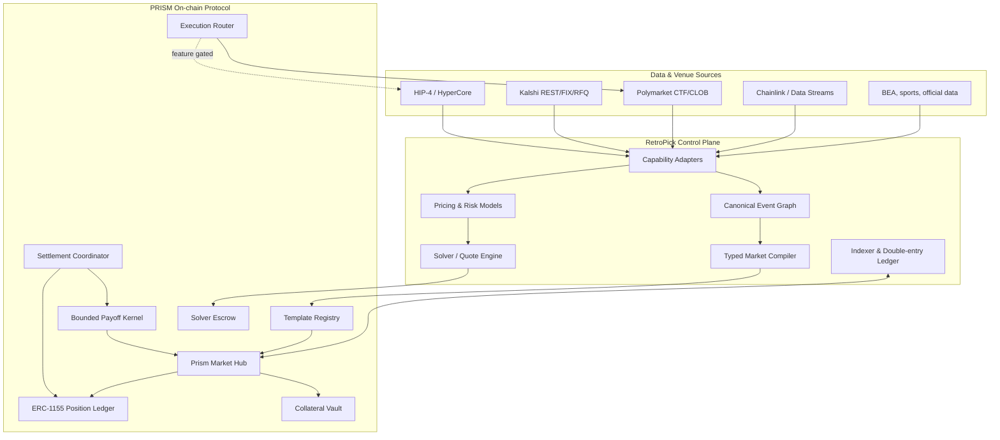

Ada tiga data path yang tidak boleh dicampur:

### Pricing path

```text
External books → normalized probabilities → joint model → quote/risk
```

Boleh menggunakan ML dan berubah setiap detik.

### Execution path

```text
User intent → route/solver → external fills → internal position
```

Harus memiliki slippage, deadline, nonce, dan partial-fill policy.

### Settlement path

```text
Immutable spec → verified observations → bounded kernel → dispute → payout
```

Tidak boleh dipengaruhi model pricing setelah market dibuka.

---

# 7. Resolver Program dan Payoff Matrix

## Resolver Program

Resolver mengubah observation menjadi `stateIndex`.

Contoh:

```text
LOAD BTC_START
LOAD BTC_END
DIRECTION BTC
LOAD GDP_RELEASE
COMPARE GDP > 0
JOINT_STATE BTC_DIRECTION GDP_DIRECTION
RETURN STATE_00..STATE_11
```

Program bukan arbitrary EVM bytecode. Gunakan bounded typed register machine.

Contoh opcode:

```solidity
enum Op {
    LOAD_OBSERVATION,
    LOAD_CONSTANT,
    ADD,
    SUB,
    ABS,
    MUL_DIV,
    RETURN_BPS,
    COMPARE_GT,
    COMPARE_GTE,
    AND,
    OR,
    K_OF_N,
    BUCKET,
    COUNT_TRUE,
    SELECT_STATE
}
```

Batas awal yang aman:

```text
MAX_OBSERVATIONS = 8
MAX_INSTRUCTIONS = 32
MAX_REGISTERS = 16
MAX_ATOMIC_STATES = 16
MAX_PUBLIC_CLAIMS = 8
MAX_PATH_AGGREGATES = 4
```

Jangan materialize \(2^n\) state untuk semua Composite.

- AND dari 8 legs hanya membutuhkan state Yes/No.
- Joint basis yang ingin recomposable boleh materialize atomic states.
- Batasi joint basis pada maksimal empat binary conditions: \(2^4=16\).

## Type and unit checking

Setiap observation membawa:

```text
value
scale
unitHash
sourceId
targetTimestamp
observedTimestamp
revisionPolicy
finalityPolicy
```

Compiler harus melarang:

- Menambah BTC/USD dengan CPI%.
- Membandingkan GDP% dengan BTC price.
- Menggunakan satu threshold untuk feed yang unitnya berbeda.
- Membagi dengan nol.
- Menggunakan stale observation.
- Menggunakan point-in-time value untuk path-dependent market.
- Menggunakan revised data jika spec meminta advance release.

## Payoff Matrix

Resolver hanya mengembalikan state. Payout ditentukan matrix terpisah.

Contoh convergence:

```text
                S00  S01  S10  S11
CONVERGENCE      1    0    0    1
DIVERGENCE       0    1    1    0
```

Contoh binary scalar invalid policy:

```text
                YES   NO
YES_STATE        1     0
NO_STATE         0     1
INVALID          0.5   0.5
```

Untuk categorical \(K\)-outcome, invalid policy dapat berupa:

- `REFUND_POOL`: pool stake dikembalikan.
- `UNIFORM_SPLIT`: setiap complete-set token membayar \(1/K\).
- `EXPLICIT_INVALID_CLAIM`: ada token Invalid.
- `ARBITRATION_REQUIRED`: belum final sampai dispute selesai.

Policy harus ditentukan sebelum market menerima dana.

---

# 8. Market compiler

JSON tetap berguna, tetapi hanya sebagai off-chain authoring format. Contract tidak “membaca JSON”.

Pipeline:

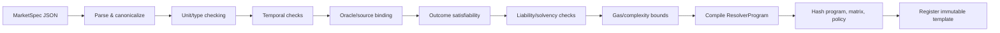

Compiler wajib memeriksa:

1. Semua state mutually exclusive.
2. Semua state collectively exhaustive atau mempunyai Invalid state.
3. Setiap boundary memiliki aturan inclusive/exclusive.
4. Payoff matrix tidak melampaui collateral.
5. Observation unit kompatibel.
6. Source memiliki finality dan timestamp semantics.
7. Tidak ada unbounded loop.
8. Tidak ada model mutable.
9. Tidak ada external market yang wording-nya hanya “mirip”.
10. Semua templates memiliki refund/dispute path.

Identifier:

\[
templateId=keccak256(
resolverProgramHash,
payoffMatrixHash,
oraclePolicyHash,
templateVersion
)
\]

Market:

\[
marketId=keccak256(
chainId,
templateId,
parameterHash,
collateral,
openAt,
lockAt,
resolveAt,
salt
)
\]

Slug tidak boleh menjadi identity keamanan.

---

# 9. Liquidity modes

PRISM harus mendukung beberapa mode, tetapi tidak semuanya dibangun sekaligus.

## Mode A — Pari-mutuel pool

- Paling murah.
- Fully funded oleh peserta.
- Tidak membutuhkan market maker.
- Cocok dengan cash MVP di bawah $100.
- Probability hanya pool-implied.
- Tidak memiliki exit liquidity kecuali side switching.

## Mode B — Complete-set outcome tokens

\[
1\ collateral\rightarrow Claim_0+\cdots+Claim_{M-1}
\]

- ERC-1155.
- Bisa diperdagangkan.
- Bisa split/merge/redeem.
- Cocok untuk CLOB/AMM kemudian.

ERC-1155 memungkinkan banyak fungible outcome IDs dalam satu contract dan batch transfer, sehingga tidak perlu deploy token contract per outcome. [ERC-1155](https://eips.ethereum.org/EIPS/eip-1155)

## Mode C — Fully collateralized solver RFQ

1. User meminta structured claim.
2. Solver memberikan harga.
3. User premium dan solver margin masuk escrow.
4. User menerima PRISM claim.
5. Solver boleh hedge di venue eksternal.
6. Settlement PRISM menentukan payout.

Jika maximum payout claim adalah \(Q\), premium \(P\) tetap berada di escrow:

\[
SolverMargin=Q-P
\]

Sehingga:

\[
Premium+SolverMargin=Q
\]

External hedge adalah milik solver dan bukan syarat solvency user.

## Mode D — Basket router

Router membeli beberapa external positions untuk user. Hasilnya bukan PRISM structured token; user hanya memiliki basket.

Ini boleh disebut “structured execution”, tetapi tidak boleh disebut satu fully backed structured claim jika tidak ada issuer/escrow yang menjamin combined payoff.

## Mode E — AMM

LMSR:

\[
C(q)=b\log\sum_i e^{q_i/b}
\]

Harga:

\[
p_i=\frac{e^{q_i/b}}{\sum_je^{q_j/b}}
\]

Maximum market-maker loss:

\[
b\log K
\]

Tetapi exponent/logarithm mahal dan sulit diaudit dalam fixed-point Solidity. Untuk RetroPick awal:

- Hitung quote off-chain.
- Gunakan signed RFQ.
- Atau tetap dengan pari-mutuel.
- Jangan implement LMSR sebelum volume membuktikan kebutuhannya.

Gnosis memiliki implementasi Conditional Token AMMs, tetapi repositori tersebut juga menunjukkan state space menjadi product dari seluruh condition outcome counts—alasan kuat untuk membatasi atomic-state explosion. [Gnosis conditional-token AMMs](https://github.com/gnosis/conditional-tokens-market-makers)

---

# 10. Joint pricing dan ML

## Marginal probabilities

Dari external venue:

\[
p_B=P(B=1), \qquad p_G=P(G=1)
\]

Joint probability membutuhkan:

\[
p_{11}=P(B=1,G=1)
\]

Dengan:

\[
\begin{aligned}
p_{10}&=p_B-p_{11}\\
p_{01}&=p_G-p_{11}\\
p_{00}&=1-p_B-p_G+p_{11}
\end{aligned}
\]

Batas Fréchet:

\[
\max(0,p_B+p_G-1)
\leq p_{11}\leq
\min(p_B,p_G)
\]

Convergence probability:

\[
P(C)=p_{00}+p_{11}
=1-p_B-p_G+2p_{11}
\]

Model dapat menggunakan parameter correlation:

\[
p_{11}
=
p_Bp_G+
\rho\sqrt{p_B(1-p_B)p_G(1-p_G)}
\]

tetapi hasil harus dipotong ke Fréchet bounds.

## Model yang realistis

Gunakan ensemble:

- Market-implied marginals.
- Bayesian/logistic model.
- Gaussian or t-copula.
- Regime-switching dependence.
- Orderbook imbalance.
- Macro nowcast.
- Calibration layer: isotonic atau Platt scaling.

Output:

```json
{
  "states": {
    "p00": 0.20,
    "p01": 0.15,
    "p10": 0.25,
    "p11": 0.40
  },
  "convergence": 0.60,
  "interval": [0.47, 0.72],
  "modelVersion": "joint-v2.3",
  "externalSnapshotHash": "0x...",
  "calibrationScore": 0.071
}
```

UI harus menampilkan tiga probabilitas berbeda:

- Pool-implied probability.
- External/model fair probability.
- Executable probability setelah spread, fee, dan slippage.

ML tidak boleh menjadi hidden settlement oracle.

---

# 11. Execution router yang benar

## Signed user intent

Gunakan EIP-712:

```solidity
struct TradeIntent {
    address user;
    bytes32 marketId;
    uint8 claimId;
    uint128 maxSpend;
    uint128 minUnits;
    uint16 maxSlippageBps;
    uint64 deadline;
    uint64 nonce;
    bytes32 routeHash;
    uint8 partialFillPolicy;
}
```

Domain harus memasukkan:

```text
name
version
chainId
verifyingContract
```

EIP-712 memberikan typed signing, tetapi tidak memberikan replay protection secara otomatis; nonce dan deadline tetap wajib. [EIP-712](https://eips.ethereum.org/EIPS/eip-712)

Smart wallets diverifikasi menggunakan ERC-1271. [ERC-1271](https://eips.ethereum.org/EIPS/eip-1271)

## Jangan gunakan arbitrary-call router

Hindari:

```solidity
target.call(userSuppliedData);
```

Gunakan:

```text
whitelisted adapter
whitelisted contract target
whitelisted function selector
token allowlist
per-adapter spending cap
deadline
minimum output
post-execution balance check
```

## Same-chain versus cross-venue

### Same-chain Polymarket route

Bisa relatif atomic untuk:

- ERC-20 collateral transfer.
- CTF split/merge/redeem.
- ERC-1155 transfers.
- Contract-approved inventory operations.

Tetapi CLOB fill masih bergantung signed order dan matcher.

### Kalshi route

Selalu asynchronous:

```text
Intent signed
→ backend validates account authority
→ API order submitted
→ order partially/fully filled
→ reconciliation
→ PRISM receipt
```

Tidak ada atomicity dengan EVM transaction.

### HIP-4 route

Kemungkinan flow:

```text
HyperEVM intent
→ CoreWriter order
→ delayed HyperCore processing
→ read settlement/fill state
→ finalize route
```

Tetapi hanya setelah capability ini dibuktikan untuk outcome assets.

## Partial fill policy

Intent harus memilih salah satu:

- `FILL_OR_KILL`
- `SCALE_POSITION`
- `ACCEPT_PARTIAL_AND_REFUND`
- `MULTI_VENUE_CONTINUE`
- `CANCEL_REMAINDER`

Tidak boleh ditentukan backend setelah pengguna menandatangani.

---

# 12. Settlement architecture

## Point-in-time oracle

Observation harus mengacu ke:

```text
targetTimestamp
minTimestamp
maxTimestamp
maxStaleness
requiredFinality
feedDecimals
feed/unit identity
```

Keeper tidak boleh bebas memilih price hanya karena transaksi mereka masuk beberapa menit terlambat.

Untuk Chainlink:

- Verify positive answer bila feed memang harus positif.
- Verify `answeredInRound`.
- Verify `updatedAt`.
- Normalize decimals.
- Verify target-window.
- Check L2 sequencer state.
- Pin feed proxy/policy version.

## Path-dependent oracle

Untuk Corridor, Touch, Cascade, Duration, dan volatility:

> Merkle proof dari satu nilai high atau low tidak membuktikan bahwa tidak ada nilai lain yang lebih tinggi/rendah.

Pilihan yang benar:

1. Oracle menerbitkan signed OHLC/path aggregate.
2. Multiple independent reporters menandatangani aggregate yang sama.
3. Optimistic assertion dengan challenge window.
4. ZK proof terhadap committed price series, nanti.
5. Simpan seluruh samples on-chain—terlalu mahal untuk MVP.

Spec harus menyebutkan:

```text
sample cadence
maximum allowed gap
price source
interpolation policy
inclusive/exclusive boundary
outlier policy
market-hours policy
```

Jika gap melebihi batas, outcome harus `INVALID`, bukan diam-diam menganggap corridor tidak ditembus.

## Subjective/off-chain data

UMA OOV3 dapat digunakan untuk arbitrary off-chain assertion dan dispute. Namun dokumentasi terbaru menyatakan identifier lama `ASSERT_TRUTH` telah didepresiasi; integrasi baru harus menggunakan `ASSERT_TRUTH2` dan tidak memakai helper yang hard-code default lama. [UMA OOV3 deprecation](https://docs.uma.xyz/developers/optimistic-oracle-v3/assert_truth-deprecation), [UMA Data Asserter](https://docs.uma.xyz/developers/optimistic-oracle-v3/data-asserter)

## Settlement state machine

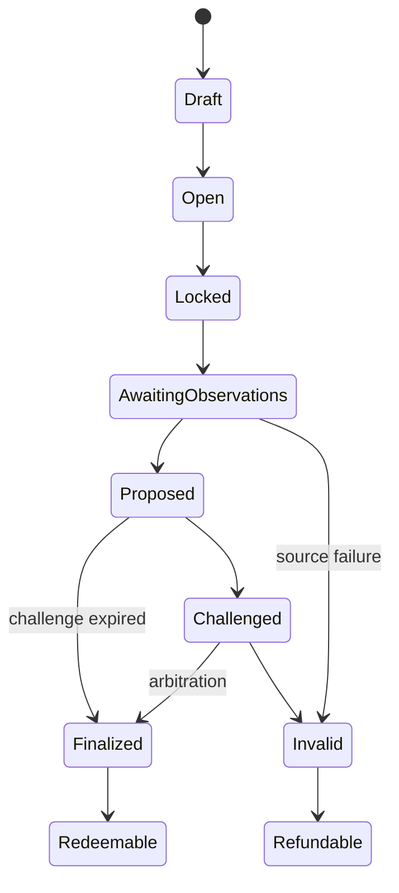

Setiap transition harus:

- Idempotent.
- Emit event.
- Memiliki actor authorization.
- Menyimpan proposal/proof hash.
- Tidak dapat bergerak mundur.
- Tidak memblokir valid redemption karena global pause.

## ML settlement

ML hanya boleh ikut settlement jika market secara eksplisit memperdagangkan model performance.

Yang harus di-freeze:

```text
model artifact hash
code commit
container digest
dataset manifest
training cutoff
random seed
runtime/version
feature definitions
metric
evaluation window
threshold
```

Untuk market biasa, ML hanya pricing/risk engine.

---

# 13. Solidity framework

Berikut interface-level skeleton. Ini desain implementasi, bukan contract production-ready atau audited.

```solidity
// SPDX-License-Identifier: MIT
pragma solidity ^0.8.28;

library PrismTypes {
    uint32 internal constant PAYOUT_SCALE = 1_000_000;

    enum Mode {
        PariMutuel,
        CompleteSet,
        SolverRFQ
    }

    enum Status {
        Draft,
        Open,
        Locked,
        AwaitingObservations,
        Proposed,
        Challenged,
        Finalized,
        Invalid
    }

    enum Op {
        LoadObservation,
        LoadConstant,
        Add,
        Sub,
        Abs,
        MulDiv,
        ReturnBps,
        CompareGT,
        CompareGTE,
        And,
        Or,
        KOfN,
        Bucket,
        CountTrue,
        SelectState
    }

    struct Instruction {
        Op op;
        uint8 dst;
        uint8 a;
        uint8 b;
        int128 immediate;
    }

    struct Template {
        bytes32 resolverHash;
        bytes32 payoffMatrixHash;
        bytes32 oraclePolicyHash;
        uint16 version;
        uint8 observationCount;
        uint8 stateCount;
        uint8 claimCount;
        uint8 maxInstructions;
        bool active;
    }

    struct Market {
        bytes32 templateId;
        address collateral;
        uint128 collateralLocked;
        uint48 openAt;
        uint48 lockAt;
        uint48 resolveAfter;
        uint16 feeBps;
        uint8 claimCount;
        Mode mode;
        Status status;
    }

    struct Observation {
        bytes32 sourceId;
        bytes32 unitHash;
        int192 value;
        uint64 targetTimestamp;
        uint64 observedTimestamp;
        bytes32 proofHash;
    }

    struct SettlementProposal {
        bytes32 marketId;
        bytes32 observationBundleHash;
        bytes32 resolverHash;
        uint64 proposedAt;
        uint8 stateIndex;
        address proposer;
    }

    struct TradeIntent {
        address user;
        bytes32 marketId;
        uint8 claimId;
        uint128 maxSpend;
        uint128 minUnits;
        uint16 maxSlippageBps;
        uint64 deadline;
        uint64 nonce;
        bytes32 routeHash;
        uint8 partialFillPolicy;
    }
}

interface IObservationVerifier {
    function verify(
        bytes32 policyId,
        PrismTypes.Observation calldata observation,
        bytes calldata proof
    )
        external
        view
        returns (
            int256 normalizedValue,
            bytes32 normalizedUnit,
            uint64 observedAt
        );
}

interface IPayoffKernel {
    function resolve(
        bytes calldata resolverProgram,
        int256[] calldata observations
    ) external pure returns (uint8 stateIndex);

    function payout(
        bytes calldata packedPayoffMatrix,
        uint8 claimId,
        uint8 stateIndex
    ) external pure returns (uint32 payoutPpm);
}

interface IPrismPosition1155 {
    function mint(
        address to,
        bytes32 marketId,
        uint8 claimId,
        uint256 amount
    ) external;

    function burn(
        address from,
        bytes32 marketId,
        uint8 claimId,
        uint256 amount
    ) external;
}

interface IPrismHub {
    function createMarket(
        bytes32 templateId,
        bytes32 parameterHash,
        address collateral,
        PrismTypes.Mode mode,
        uint48 openAt,
        uint48 lockAt,
        uint48 resolveAfter
    ) external returns (bytes32 marketId);

    function depositPool(
        bytes32 marketId,
        uint8 claimId,
        uint128 amount,
        address beneficiary
    ) external;

    function splitCompleteSet(
        bytes32 marketId,
        uint128 amount,
        address beneficiary
    ) external;

    function mergeCompleteSet(
        bytes32 marketId,
        uint128 amount
    ) external;

    function proposeSettlement(
        bytes32 marketId,
        PrismTypes.Observation[] calldata observations,
        bytes[] calldata proofs
    ) external;

    function finalizeSettlement(bytes32 marketId) external;

    function redeem(
        bytes32 marketId,
        uint8 claimId,
        uint128 amount
    ) external returns (uint256 collateralOut);
}
```

## Logical contracts

### `PrismTemplateRegistry`

- Stores template hashes and bounds.
- Template immutable setelah digunakan.
- New version memperoleh template ID baru.
- Governance hanya dapat menonaktifkan pembuatan market baru.

### `PrismMarketHub`

- Lifecycle.
- Pool deposits.
- Complete-set mint/merge.
- Claims.
- Per-market reserve accounting.

### `PrismPosition1155`

Token ID:

\[
tokenId=uint256(keccak256(marketId,claimId))
\]

Satu contract menangani seluruh outcome tokens.

### `PrismCollateralVault`

Invariant global:

\[
balance
\geq
activeCollateral+
claimReserve+
refundReserve+
feeReserve
\]

Transfer collateral menggunakan before/after balance check. Tolak:

- Fee-on-transfer collateral.
- Rebasing collateral.
- ERC-777-like callback risk.
- Token dengan decimals/blacklist behavior yang belum dianalisis.

### `PrismSettlementCoordinator`

- Verifies observation bundle.
- Executes kernel.
- Creates optimistic assertion bila diperlukan.
- Stores only proof/hash/state needed.
- Does not transfer user funds during callback.

### `PrismExecutionRouter`

- Same-chain operations only.
- Adapter and selector allowlist.
- Per-route allowance.
- Balance-delta verification.
- No generalized arbitrary call.

### `PrismSolverEscrow`

- Signed quotes.
- Solver bond.
- Premium + margin escrow.
- Per-market isolated margin initially.
- No cross-market portfolio margin in first release.

### `PrismRiskController`

- Maximum unresolved collateral.
- Market cap.
- User cap.
- Solver cap.
- Oracle concentration cap.
- Venue exposure cap.
- Emergency pause for new deposits.
- Redemption remains available whenever mathematically safe.

---

# 14. Gas and deployment optimization

Engine sekarang menunjukkan first deposit sekitar 254k gas sementara deposit berikutnya jauh lebih murah. Penyebab pentingnya adalah cold storage initialization dan user-history indexing.

PRISM dapat mengurangi ini:

- Jangan simpan `_userEpochs`; emit event.
- Pack timestamps menjadi `uint48`.
- Pack fee menjadi `uint16`.
- Pack status/mode/count ke satu slot.
- Gunakan `uint128` untuk collateral/pool jika cap memungkinkan.
- Store `specHash` dan metadata URI, bukan strings.
- Store compiled program sekali per template, bukan per market.
- Store proof bundle off-chain; on-chain hanya hash dan verified result.
- Singleton ERC-1155, bukan token deployment per market.
- Settlement kernel yang sama untuk manual dan rolling.
- Batch observations dan claims.
- Gunakan custom errors.
- Jangan deploy minimal proxy untuk setiap pool kecuali isolation benar-benar dibutuhkan.

Deployment model:

```text
1 TemplateRegistry
1 MarketHub
1 ERC1155 Position contract
1 SettlementCoordinator
1 CollateralVault
N small oracle adapters
Optional Router/SolverEscrow
```

Market baru cukup membuat storage record dan event; tidak perlu contract baru.

---

# 15. Security invariants dan threat model

## Accounting

- `total liabilities <= collateral`.
- Fee tidak dapat ditarik dari claim reserve.
- External hedge tidak dianggap user collateral.
- Invalid settlement tidak menghasilkan protocol fee.
- Last claimer hanya menerima dust market tersebut.
- Position tidak bisa claimed dua kali.
- Complete set hanya dapat di-merge dalam jumlah claim yang benar.

## Oracle

- Unit dan decimals diverifikasi.
- Timestamp window diverifikasi.
- Staleness dan sequencer state diperiksa.
- Feed migration menghasilkan policy version baru.
- GDP revision policy immutable.
- Path gaps menghasilkan invalid state.
- Reporter quorum menggunakan distinct signers.
- Observation proof tidak bisa direplay ke market lain.

## Router

- Signed intent berisi chain ID, hub, market, route, nonce, deadline.
- Target dan selector allowlisted.
- Allowance dibatasi.
- Reentrancy guard.
- State update sebelum external call.
- Post-call balance invariant.
- Partial fills mengikuti signed policy.
- Solver tidak dapat mengubah destination address.

## Upgrade

- Accounting core sebaiknya non-upgradeable setelah audit atau sangat terbatas.
- Adapter/template addition melalui timelock.
- Market terbuka selalu pin template dan adapter version.
- Upgrade tidak boleh mengubah payout market aktif.
- Emergency governance tidak boleh menyita collateral.

## Operational

- Multisig untuk governance.
- Separate worker/keeper key.
- Separate settlement proposer.
- HSM/secure enclave untuk custodial API keys bila kelak diperlukan.
- Double-entry off-chain ledger.
- Reconciliation terhadap on-chain events.
- Reorg/finality handling.
- Dead-man switch untuk outstanding external orders.

## Testing

Minimum test suite:

- Fuzz setiap opcode.
- Differential test Solidity kernel vs reference implementation.
- Exhaustive truth table untuk seluruh state.
- Property test column-sum payoff.
- Solvency invariant di setiap state.
- Oracle timestamp boundary tests.
- Unit mismatch tests.
- Division/overflow tests.
- Replay and frontrun tests.
- Partial fill simulations.
- Fork tests Polymarket.
- HyperEVM/CoreWriter testnet tests.
- Malicious token and ERC-1155 receiver tests.
- Upgrade/storage collision tests.

---

# 16. Roadmap realistis untuk RetroPick

## Phase 0 — Perbaiki V1

Sebelum PRISM:

1. Satu settlement library untuk manual dan rolling.
2. Per-leg threshold pada Composite.
3. Pecah Convergence menjadi explicit variants.
4. Hapus misleading Ladder multiplier.
5. Tambahkan oracle target-time policy.
6. Formalisasi path sampling untuk Corridor/Cascade.
7. Disable yield routing untuk active prediction collateral.
8. Hilangkan on-chain user epoch array pada deployment baru.

## Phase 1 — PRISM Pool Kernel

Bangun hanya:

- Typed MarketSpec compiler.
- Template Registry.
- Resolver Kernel.
- Payoff Matrix validator.
- Pari-mutuel MarketHub.
- Chainlink point-in-time adapter.
- Manual multisig/optimistic settlement.
- Delapan public claims maksimum.
- No external fund routing.

Ini masih realistis pada satu VPS murah.

## Phase 2 — External intelligence

- Polymarket orderbooks/history.
- Kalshi books and MVE discovery.
- HIP-4 testnet discovery.
- Semantic compatibility scoring.
- Joint probability model.
- Pool vs model probability dashboard.
- Tidak ada auto-trading.

## Phase 3 — Complete-set positions

- ERC-1155 outcome tokens.
- Split/merge/redeem.
- Secondary peer-to-peer transfer.
- Optional small RFQ.
- No generalized AMM.

## Phase 4 — Polymarket direct routing

- User-signed CLOB orders.
- CTF inventory adapter.
- Builder attribution.
- Same-chain transaction batching.
- External position tetap dimiliki user atau dedicated smart wallet.

## Phase 5 — Solver structured liquidity

- Signed quotes.
- Full collateral escrow.
- Scenario-based margin.
- External hedging.
- Solver performance/reputation.
- Market-specific netting.

## Phase 6 — Regulated/native-L1 integrations

- Kalshi hanya setelah commercial/compliance path jelas.
- HIP-4 setelah official production capability stabil.
- Cross-chain routing melalui asynchronous intent, bukan atomic Solidity fiction.

---

# Keputusan akhir

Inovasi RetroPick seharusnya bukan “lebih banyak market types”. Inovasinya adalah:

> **Satu bounded payoff kernel yang dapat mengompilasi event graph menjadi fully collateralized structured claims, lalu menggunakan external prediction markets sebagai signals, execution legs, dan hedges tanpa menyerahkan settlement RetroPick kepada venue tersebut.**

Pembagian produknya:

```text
RetroPick V1
└── Cheap rolling pari-mutuel prediction pools

RetroPick PRISM V2
├── Typed structured market compiler
├── Payoff matrix and joint-state engine
├── Complete-set ERC-1155 positions
├── Deterministic/optimistic settlement
├── Venue capability adapters
├── Solver RFQ and residual-risk collateral
└── ML pricing and risk intelligence
```

Prioritas engineering pertama bukan router. Prioritasnya:

1. Formal payoff matrix.
2. Unit-safe resolver compiler.
3. Single settlement kernel.
4. Explicit collateral invariant.
5. Pool mode.
6. External data adapters.
7. Baru kemudian execution router dan solver.

Cash MVP di bawah $100 tetap mungkin untuk VPS, compiler, indexer, dan pool-based testnet/mainnet kecil. Tetapi production external routing, audit smart contract, legal work, key custody, dan economic security tidak realistis dimasukkan ke budget $100. PRISM harus diluncurkan bertahap dengan market cap rendah—bukan dengan asumsi bahwa banyak liquidity eksternal otomatis membuat sistem aman.

### User
apaka ity memakai ekstrernal liqudiity jua untuk market derivatives retropick?

### Assistant
_Memproses selama 1m 52s_

### Assistant
Ya—**PRISM V2 memang dirancang memakai external liquidity sebagai sumber utama eksekusi dan hedging market derivative RetroPick**, bukan hanya sebagai data probabilitas.

Tetapi besar liquidity eksternal yang bisa dipakai bergantung pada apakah payoff RetroPick dapat direplikasi secara tepat.

## Tiga tingkat penggunaan external liquidity

### 1. Exact External Liquidity — bisa 100%

Jika market RetroPick identik dengan market eksternal:

> RetroPick: “BTC di atas $120.000 pada 31 Desember?”

dan Polymarket memiliki market dengan:

- Threshold sama.
- Tanggal sama.
- Oracle/resolution rule sama.
- Boundary sama.
- Collateral dan outcome yang dapat ditransfer.

Maka flow-nya:

```text
User membeli RetroPick YES
        ↓
Router mengambil liquidity YES Polymarket
        ↓
External position masuk user smart wallet/escrow
        ↓
RetroPick menampilkan structured wrapper
```

Dalam kasus ini, RetroPick hampir tidak membutuhkan liquidity pool sendiri. RetroPick berfungsi sebagai:

- Liquidity router.
- Better UI.
- Structured wrapper.
- Best-price aggregator.
- Builder-fee layer.

Polymarket outcome tokens memang berupa ERC-1155 yang fully collateralized sehingga dapat digunakan untuk posisi on-chain. [Polymarket positions](https://docs.polymarket.com/concepts/positions-tokens)

---

### 2. Native Combo Liquidity — bisa mendekati 100%

Misalnya RetroPick menawarkan:

> “Fed memotong suku bunga DAN inflasi turun.”

Jika Kalshi sudah memiliki exact Multivariate Event/Combo tersebut, RetroPick bisa mengirim execution ke combo Kalshi, bukan membeli kedua legs terpisah.

```text
RetroPick structured market
        ↓
Semantic matcher menemukan exact Kalshi Combo
        ↓
User/solver meminta RFQ
        ↓
Order dieksekusi pada Kalshi
```

Kalshi memang menyediakan Multivariate Event Collection dan RFQ untuk combo market. [Kalshi multivariate API](https://docs.kalshi.com/api-reference/multivariate/create-market-in-multivariate-event-collection), [Kalshi RFQ](https://docs.kalshi.com/getting_started/rfqs)

Namun ini dilakukan melalui off-chain API/account Kalshi, bukan Solidity contract.

---

### 3. Partial External Liquidity — kasus derivative baru

Contoh:

> “Apakah BTC dan GDP bergerak searah?”

External market hanya tersedia:

- BTC Up/Down.
- GDP Up/Down.

RetroPick dapat memakai liquidity tersebut untuk hedge sebagian risiko:

```text
User membeli CONVERGENCE
        ↓
Solver menjual structured claim
        ↓
Solver membeli BTC/GDP positions eksternal
        ↓
External legs mengurangi marginal exposure
        ↓
Solver collateral menanggung residual correlation risk
```

Masalahnya, payoff Convergence adalah:

\[
C=1-B-G+2BG
\]

Liquidity BTC menyediakan \(B\), sedangkan liquidity GDP menyediakan \(G\). Keduanya tidak menyediakan interaction term:

\[
BG
\]

Jadi arsitekturnya:

\[
\boxed{
Structured\ Claim
=
External\ Hedge
+
Residual\ Collateral
}
\]

External liquidity tetap digunakan, tetapi tidak boleh diklaim sebagai hedge sempurna.

---

# Dua produk execution RetroPick

## A. External Basket Mode

Dana user langsung membeli posisi dari venue eksternal.

```text
User wallet
  ├── Polymarket BTC YES
  ├── Polymarket GDP YES
  └── Optional Kalshi/HIP-4 position
```

Karakteristik:

- External liquidity digunakan langsung.
- RetroPick tidak menjamin combined payout.
- User memegang basket, bukan satu derivative.
- Risiko settlement berada pada masing-masing venue.
- Paling capital-efficient.

Ini cocok untuk market yang hampir dapat direplikasi.

## B. PRISM Structured Claim Mode

User mendapatkan satu token derivative RetroPick:

```text
User → premium → Solver Escrow
                    ├── external hedges
                    └── residual collateral
                              ↓
                  PRISM structured ERC-1155
                              ↓
                            User
```

Contohnya user menerima:

```text
RP-BTC-GDP-CONVERGENCE-Q3
```

Maximum payout per token adalah $1.

Misalkan:

- User premium: $0,58.
- External hedge coverage setelah haircut: $0,27.
- Residual collateral yang diperlukan: $0,73.

Solvency tetap dihitung dari worst-case payout:

\[
Collateral+VerifiedHedgeValue\geq \$1
\]

Tetapi untuk versi pertama saya menyarankan external hedge **tidak mengurangi collateral user**. Solver tetap mengunci payout penuh, sedangkan external position menjadi hedge milik solver. Setelah sistem terbukti aman, baru gunakan haircut-adjusted margin.

---

# External Liquidity Coverage Ratio

PRISM dapat menghitung seberapa besar payoff derivative benar-benar terlindungi external positions.

Untuk target payoff \(h_s\) dan external hedge payoff \(g_s\):

\[
ResidualRisk=
\max_s(h_s-g_s)_+
\]

Kemudian:

\[
HedgeCoverage=
1-\frac{ResidualRisk}{MaximumPayout}
\]

Contoh:

```text
Maximum structured payout = $1
Worst-case residual risk   = $0.35

External hedge coverage    = 65%
Required residual capital  = 35%
```

UI sebaiknya menampilkan:

```text
Liquidity source

Polymarket BTC market       38%
Polymarket GDP market       27%
Solver collateral           35%

External hedge coverage     65%
Maximum payout              $1.00
```

Namun persentase tersebut harus diberi haircut berdasarkan:

- Perbedaan wording.
- Cancellation risk.
- Settlement authority.
- Custody risk.
- Bridge risk.
- Slippage.
- Orderbook depth.
- Partial fills.

---

# Kapan external liquidity bisa dipakai penuh?

| Structured market | External liquidity usage |
|---|---:|
| Exact binary wrapper | 90–100% |
| Exact threshold/Range bucket | 90–100% |
| Exact Kalshi Combo | 90–100% |
| Polymarket one-of-N/Neg Risk | Tinggi |
| AND/OR dari market terpisah | Parsial |
| Convergence dua marginal | Parsial |
| Conditional “jika A maka B” | Parsial |
| Sequence “A terjadi sebelum B” | Rendah |
| Corridor sepanjang periode | Rendah |
| Cascade/barrier path | Rendah–menengah |
| ML performance market | Hampir nol |
| Arbitrary correlation derivative | Parsial + collateral |

---

# Router contract tetap diperlukan, tetapi terbatas

`PrismExecutionRouter` menangani:

- Polymarket CTF positions.
- ERC-20 collateral.
- ERC-1155 transfers.
- Split/merge/redeem.
- User-signed orders.
- Same-chain atomic operations.

Tetapi router tidak dapat secara langsung memindahkan liquidity Kalshi karena Kalshi menggunakan authenticated off-chain accounts.

Arsitektur lengkapnya:

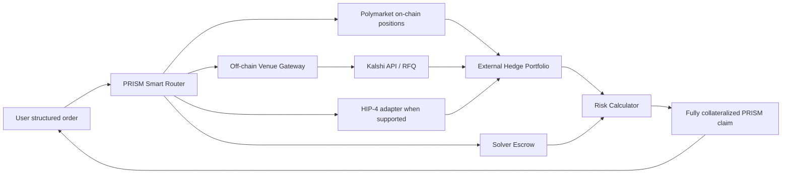

# Jadi posisi finalnya

Bukan:

> RetroPick membuat semua liquidity sendiri.

Dan bukan juga:

> Semua dana eksternal langsung dikirim ke satu smart contract.

Melainkan:

> **RetroPick mencari exact external liquidity terlebih dahulu; jika exact replication tersedia, RetroPick merouting hampir seluruh execution ke venue tersebut. Jika tidak tersedia, solver menggunakan external positions untuk hedge sebanyak mungkin dan mengunci collateral untuk residual structured risk.**

Untuk fokus bisnis yang Anda inginkan, urutan produknya sebaiknya:

1. External liquidity discovery.
2. Semantic matching.
3. Exact-replication router.
4. External basket execution.
5. Solver RFQ.
6. Residual-risk collateral.
7. PRISM structured derivative token.

Dengan begitu RetroPick benar-benar menjadi **structured liquidity layer di atas Polymarket, Kalshi, HIP-4, dan venue lain**, bukan prediction market yang harus membangun seluruh liquidity dari nol.

### User
*Image 'be53a2d8-0.bin' not included in export (source: sediment://file_00000000231881fdb776e269027489fe?shared_conversation_id=6a64718b-ed9c-83ec-818c-50770f0a0c6c).*

buatkan dalam b in

### Assistant
_Memproses selama 16s_

### Assistant
Berikut versi bahasa Inggris yang bisa langsung ditempel:

**Goal / Milestone**

Refine RetroPick’s product and technical direction after the Mid Demo by validating how external liquidity from Polymarket, Kalshi, HIP-4, and other venues can support structured prediction markets while keeping the V1 pool-based MVP affordable.

**Progress Summary**

This week, we refined RetroPick’s positioning as a structured event-market and external liquidity layer. We analyzed how the nine existing market types can be represented using standardized outcomes and payoff logic. We also designed the initial PRISM V2 architecture, covering market templates, external venue adapters, payoff matrices, liquidity routing, solver-based hedging, collateral management, and deterministic settlement. The V1 direction remains a low-cost pari-mutuel pool model, while external liquidity integration will be introduced incrementally.

**Blockers / Challenges**

External liquidity cannot simply be transferred between prediction markets through a smart contract. Polymarket offers composable on-chain positions, but Kalshi relies on authenticated off-chain accounts, while HIP-4 integration is still evolving. Complex derivatives such as convergence and composite markets also cannot always be perfectly hedged using separate external Yes/No markets, leaving residual correlation risk that requires additional collateral. Limited development capacity and the absence of real trading volume remain additional challenges.

**Next Week Focus**

Narrow the architecture into an executable MVP scope. Begin with external market discovery, semantic market matching, probability and order-book data adapters, and a proof of concept for routing exactly matched markets through Polymarket liquidity. At the same time, improve the existing V1 settlement semantics and prepare a technical specification for the PRISM template compiler and external-liquidity solver.

### User
more tecnical example:

Code Alchemist · 7/13 – 7/19

Goal / Milestone

Shipped Phase 2: AI Advisor deterministic recommendation engine integrated with the Atomic Exit executor, extending multi-protocol support (Aave V3, Moonwell, Compound V3, Morpho Blue) on Base Sepolia.

Progress Summary

Built the Advisor engine in packages/scoring/src/advisor/ (types, repayMath, rules, fallback templates) following the same deterministic-first pattern as computeScore.ts, with the LLM narrator (OpenRouter/Gemini) only phrasing decisions, never classifying or inventing numbers. Implemented the 4-section report format (position, market, recommendation, execution) referenced in SYSTEM_ARCHITECTURE §6. Shipped the /api/advisor endpoint with 5-minute caching and advisor_events logging, and wired useAdvisor into AppDemo.tsx, replacing the Coming Soon placeholder with live per-leg recommendation cards. On the contracts side, rewrote PanikExecutor.sol around the new ExitLeg struct to support all four protocols in a single atomicExit entrypoint, added MoonwellAdapter, CompoundV3Adapter, and MorphoAdapter with health-check assertions, and moved to exact-amount approvals with a 2% buffer instead of infinite approvals. Ran fork tests against Base mainnet to validate health-factor improvement and USDC output, then deployed and verified contracts on both networks. Mainnet is live for production use; Sepolia stays active as our staging environment for testing new adapters, approval flows, and edge cases before they get promoted to mainnet. Completed the main-app integration: ExitFlow modal with the full connect to receipt flow, wagmi provider setup, and approvals hook with revoke guidance for boolean Comet/Morpho grants, with EXIT_ENV toggling cleanly between the two networks.

Blockers / Challenges

Confirming Moonwell, Compound V3, and Morpho market availability and liquidity depth on mainnet required careful pre-flight checks via LockChecker before go-live. The executor ABI break also affected the old Desktop repo's frontend, which we've now fully deprecated in favor of panik-core. Wallet-funded repay (no flash loan) means users need to hold the debt asset directly, which we surfaced clearly in the review step. Running both networks in parallel adds some config overhead, mainly keeping onchain-config.json in sync across deploys.

Next Week Focus

Continue testing new features and edge cases on Sepolia before rolling them to mainnet, monitor mainnet gas costs and usage patterns, and begin scoping the flash-loan self-funding deleverager for Phase 3.

### Assistant
_Memproses selama 13s_

### Assistant
**RetroPick · 7/13–7/19**

### Goal / Milestone

Complete the contract-level design review of the pool-based V1 market engine and define the V2 external-liquidity architecture for structured markets, covering Polymarket, Kalshi, HIP-4, joint-outcome derivatives, collateralization, and deterministic settlement.

### Progress Summary

Reviewed the modular `MarketEngineDispatcher` architecture across `src/engine/modules/`, `src/logic/Resolvers.sol`, and `src/math/MarketMath.sol`, including template storage, manual and rolling epoch lifecycles, oracle checkpoints, reserve accounting, claim liabilities, fee separation, and last-claimer dust handling. Consolidated the product taxonomy into nine canonical market families: Direction, Threshold, Range Close, Velocity, Ladder, Convergence, Composite, Corridor, and Cascade, with specialized products represented through template parameters and oracle classes instead of additional enum variants.

Specified the V2 architecture as **RetroPick PRISM — Programmable Risk & Information Settlement Machine**. The design separates each market into an immutable `ResolverProgram`, `PayoffMatrix`, and `OraclePolicy`, allowing structured products to be compiled from bounded settlement primitives rather than adding custom Solidity branches for every market type. Formalized the state-based collateral model where claim liabilities are evaluated across every possible outcome and the vault must satisfy `collateral >= max(state liabilities)`.

Designed the external-liquidity layer around capability-based venue adapters. Polymarket can provide CLOB liquidity and fully collateralized ERC-1155 outcome positions; Kalshi can provide orderbook, RFQ, and Multivariate Event liquidity through authenticated off-chain APIs; HIP-4 is treated as an experimental HyperCore adapter pending stable outcome-market support. Defined three execution paths: exact external replication for semantically identical markets, external basket execution for user-owned positions, and solver-backed structured claims where external positions hedge the replicable exposure while escrowed collateral covers the residual risk.

For the BTC/GDP Convergence example, modeled four atomic states—Down/Down, Down/Up, Up/Down, and Up/Up—and proved that separate BTC and GDP Yes/No positions cannot exactly reproduce the Convergence payoff because the external legs provide only the marginal terms `B` and `G`, while the target payoff also requires the joint interaction term `BG`. Defined the solver requirement as `structured claim = external hedge + residual collateral`, with scenario-based coverage calculated from the worst-case difference between the target payoff and external hedge payoff.

Also identified several V1 settlement issues that must be corrected before implementation: raw price-spread comparison is invalid for assets with different units; Composite markets require per-leg thresholds instead of one global threshold; Ladder weights cannot guarantee fixed multipliers in a pari-mutuel pool; and Corridor/Cascade markets require explicit path-sampling cadence and gap policies because a single OHLC report cannot independently prove continuous price behavior.

### Blockers / Challenges

External liquidity cannot be treated as one atomic cross-venue pool. Polymarket positions are composable on Polygon, but CLOB orders still require signed off-chain matching. Kalshi execution depends on custodial accounts and RSA-PSS authenticated APIs, so it cannot be called directly from Solidity. HIP-4 outcome assets and HyperEVM/CoreWriter integration still require testnet validation before being considered production-ready.

Complex structured claims also introduce residual basis and correlation risk when their payoff is outside the linear span of available external positions. This means external liquidity can reduce solver exposure but cannot replace PRISM collateral for arbitrary Convergence, Conditional, Sequence, Corridor, or Composite markets.

At the V1 contract level, manual and rolling settlement currently maintain parallel computation paths that must remain logically synchronized, increasing implementation and audit risk. The current first-position deposit path is also storage-heavy because user epoch history is maintained on-chain. Celo Alfajores deployment remains operationally blocked by unreliable RPC connectivity and incomplete staging verification.

### Next Week Focus

Convert the PRISM design into an implementation-ready technical specification. Define the Solidity interfaces and packed storage layouts for `PrismTemplateRegistry`, `PrismMarketHub`, `PrismCollateralVault`, `PrismPosition1155`, `PrismSettlementCoordinator`, and `PrismSolverEscrow`. Implement the first bounded resolver templates for Direction, Threshold, Range, Relative Performance, and four-state Convergence, together with payoff-matrix solvency validation and exhaustive truth-table tests.

Refactor V1 settlement so manual and rolling lifecycles call the same pure resolver and liability libraries. Replace the single Composite threshold with per-leg typed parameters, formalize target-timestamp oracle windows, and separate pari-mutuel Ladder pricing from fixed-payout products.

Begin the external-liquidity proof of concept with a read-only Polymarket adapter for market discovery, semantic matching, orderbook depth, executable-price estimation, and exact-replication detection. External trading will remain disabled until signed-intent handling, slippage controls, partial-fill policies, and fork-test coverage are complete.

### User
kalau pari mutuel pool itu berarti misalnya saya fokus ke polymarket dulu sebagai liqudiity, itu pakai liquidity external?

### Assistant
_Memproses selama 14s_

### Assistant
Tidak otomatis. **Pure pari-mutuel pool memakai liquidity internal dari deposit pengguna RetroPick**, bukan liquidity Polymarket.

Rumusnya:

\[
PayoutUser=
\frac{StakeUser}{TotalStakePemenang}
\times
(TotalPool-Fee)
\]

Jadi kalau:

- Pool YES RetroPick: $700
- Pool NO RetroPick: $300
- NO menang

Maka pengguna NO membagi seluruh pool $1.000 setelah fee. Orderbook Polymarket tidak terlibat.

## Kalau ingin fokus liquidity Polymarket

Model utamanya sebaiknya bukan pure pari-mutuel, tetapi salah satu dari tiga mode ini:

| Mode | Sumber liquidity | Payout |
|---|---|---|
| `NATIVE_POOL` | Deposit pengguna RetroPick | Pari-mutuel |
| `POLYMARKET_ROUTED` | Orderbook Polymarket | Berdasarkan jumlah external shares |
| `HYBRID_SOLVER` | Polymarket + collateral solver | Berdasarkan structured payoff RetroPick |

### 1. Polymarket Routed

Untuk market yang sama persis:

```text
User deposit $100 di RetroPick
        ↓
RetroPick mendapatkan executable quote Polymarket
        ↓
Router membeli Polymarket outcome tokens
        ↓
Token disimpan user smart wallet atau vault
        ↓
Jika menang, Polymarket token diredeem $1 per share
```

Misalnya average fill YES adalah $0,40:

\[
Shares=\frac{100}{0.40}=250
\]

Jika YES menang:

\[
Payout=250\times \$1=\$250
\]

Ini memakai liquidity Polymarket sepenuhnya, tetapi **bukan pari-mutuel**. Ini adalah routed orderbook execution.

### 2. Polymarket-Backed Batch Vault

UI masih dapat terasa seperti pool:

```text
User A deposit $50
User B deposit $150
User C deposit $100
        ↓
Vault mengumpulkan $300
        ↓
Vault membeli Polymarket position dalam satu batch
        ↓
Setiap user mendapat vault shares secara proporsional
```

Namun payout tetap berdasarkan external fills:

\[
UserPayout=
\frac{UserVaultShares}{TotalVaultShares}
\times ExternalRedemption
\]

Namanya lebih tepat:

> **External Liquidity Batch Vault**

Bukan pari-mutuel pool, karena user tidak mengambil dana dari pengguna RetroPick yang memilih sisi berlawanan.

### 3. Hybrid Solver untuk structured derivatives

Untuk market seperti:

> “BTC dan GDP akan bergerak searah.”

Polymarket mungkin hanya menyediakan:

- BTC Up/Down.
- GDP Up/Down.

Flow:

```text
User membeli RetroPick Convergence
        ↓
Solver menerima premium
        ↓
Solver membeli BTC/GDP legs di Polymarket
        ↓
Polymarket liquidity meng-hedge sebagian risiko
        ↓
Solver collateral menutup residual correlation risk
        ↓
User menerima structured PRISM claim
```

Modelnya:

\[
StructuredClaim
=
PolymarketHedge
+
ResidualSolverCollateral
\]

Ini benar-benar menggunakan external liquidity, tetapi Polymarket tidak dapat menutup seluruh risiko joint derivative.

## Rekomendasi arsitektur RetroPick

Karena Anda ingin fokus external liquidity, jadikan execution priority:

```text
1. Exact market ditemukan di Polymarket
   → POLYMARKET_ROUTED

2. Payoff dapat direplikasi dengan beberapa market Polymarket
   → STRUCTURED_VAULT

3. Payoff hanya dapat di-hedge sebagian
   → HYBRID_SOLVER

4. Tidak ada external market yang kompatibel
   → NATIVE_PARIMUTUEL_POOL
```

Jadi pari-mutuel menjadi fallback untuk market original RetroPick, bukan liquidity engine utama.

Kesimpulan paling tepat:

> **Kalau RetroPick menggunakan pari-mutuel murni, liquidity berasal dari pengguna RetroPick. Kalau ingin fokus memakai liquidity Polymarket, RetroPick harus memakai routed execution, external-liquidity vault, atau hybrid solver—bukan menyebut semuanya pari-mutuel pool.**

### User
jadi untuk budget dibawah 100 dollar sblm funding, dll. Baiknya agar retreopick jadi derivatives structured market dari polymarket gimana? analisis mendalam

### Assistant
Saya akan menurunkannya ke rancangan yang benar-benar bisa dibangun solo dengan biaya kas <US$100: apa yang harus menjadi produk sekarang, bagian mana cukup off-chain, bagaimana memakai posisi Polymarket tanpa menanggung liquidity sendiri, dan fitur apa yang harus ditunda agar tidak berubah menjadi proyek protokol mahal.

### Assistant
Search tool invoked with queries:
- site:docs.polymarket.com/builders overview builder program official CLOB V2
- site:docs.polymarket.com trading quickstart CLOB V2 orders pUSD official
- site:docs.polymarket.com trading gasless relayer official
- site:docs.polymarket.com advanced neg-risk official

### Assistant
Search tool invoked with queries:
- site:docs.polymarket.com geographic restrictions builders official
- site:docs.polymarket.com api-reference markets Gamma market discovery official
- site:docs.polymarket.com api-reference positions official
- site:docs.polymarket.com trading orders FOK FAK batch orders official

### Assistant
_Menelusuri 1 situs web_

### Assistant
_Memproses selama 1m 53s_

### Assistant
Dengan budget tunai di bawah $100, desain terbaik bukan membuat bursa derivatif atau liquidity pool baru. RetroPick sebaiknya menjadi:

> Structured outcome strategy layer non-custodial di atas likuiditas Polymarket.

RetroPick menemukan market yang berkaitan, mengubahnya menjadi strategi terstruktur, menghitung payoff dan risiko, lalu mengirim order bertanda tangan pengguna langsung ke CLOB Polymarket. Dana dan posisi tetap berada di wallet pengguna—RetroPick tidak memegang custody dan tidak perlu membiayai likuiditas.

## 1. Posisi produk yang realistis

Arsitektur awal:

```text
RetroPick
 ├── Market discovery
 ├── Semantic compatibility engine
 ├── Structured strategy compiler
 ├── Payoff & risk simulator
 ├── Multi-leg execution router
 └── Portfolio strategy tracker
          │
          ▼
Polymarket CLOB + existing liquidity
          │
          ▼
User-owned outcome positions
```

Jadi ya, likuiditasnya external dari Polymarket. Namun RetroPick tidak “meminjam liquidity pool” secara langsung. RetroPick mengarahkan order pengguna ke order book Polymarket dan mengelompokkan posisi yang dihasilkan sebagai satu strategi.

Deskripsi produk yang cukup akurat:

> RetroPick transforms related Polymarket markets into structured outcome strategies with transparent payoff simulation, user-signed execution, and portfolio-level tracking.

Hindari menyebutnya “independent derivatives exchange” pada fase ini karena RetroPick belum menerbitkan instrumen derivatif baru.

---

## 2. Perbedaan basket dengan derivatif baru

Ini adalah batas matematis dan produk paling penting.

Misalkan:

- \(B\): Bitcoin naik
- \(G\): GDP naik

Pengguna ingin kontrak:

\[
Y_{AND}=1_{\{B=1 \land G=1\}}
\]

Payoff yang benar:

| BTC | GDP | AND payoff |
|---:|---:|---:|
| 0 | 0 | 0 |
| 0 | 1 | 0 |
| 1 | 0 | 0 |
| 1 | 1 | 1 |

Tetapi jika RetroPick hanya membeli:

- 1 token BTC YES
- 1 token GDP YES

maka payoff-nya:

\[
Y_{basket}=1_{\{B=1\}}+1_{\{G=1\}}
\]

| BTC | GDP | Basket payoff |
|---:|---:|---:|
| 0 | 0 | 0 |
| 0 | 1 | 1 |
| 1 | 0 | 1 |
| 1 | 1 | 2 |

Itu bukan kontrak AND. Karena itu, V1 harus membedakan empat kelas struktur:

| Kelas | Definisi | Boleh diperdagangkan? |
|---|---|---:|
| `EXACT` | Payoff yang diminta tersedia langsung di Polymarket | Ya |
| `COMPOSABLE_BASKET` | Dibentuk dari beberapa posisi, dengan payoff basket yang transparan | Ya |
| `APPROXIMATE` | Hanya dapat didekati dari marginal market | Analytics saja |
| `UNSUPPORTED` | Semantik/resolusi tidak kompatibel | Tidak |

Engine tidak boleh menyebut suatu strategi `EXACT` hanya karena probabilitas atau judul market terlihat berkaitan.

---

## 3. Produk V1 yang layak dibangun

### A. Market discovery

Gunakan:

- Gamma API untuk market discovery dan metadata.
- CLOB API untuk order book, harga, dan eksekusi.
- Data API untuk posisi, trade, serta rekonsiliasi portofolio.

Gamma dan Data API dapat digunakan untuk data publik, sedangkan operasi trading CLOB memerlukan autentikasi pengguna. Dokumentasi resminya tersedia pada [Polymarket API introduction](https://docs.polymarket.com/api-reference/introduction).

### B. Semantic compatibility engine

Market yang terlihat sama belum tentu bisa dikombinasikan. Engine harus memvalidasi:

```typescript
type CanonicalMarket = {
  externalMarketId: string;
  subject: string;           // BTC, US GDP, election
  predicate: string;         // above, below, wins, increases
  comparator?: "GT" | "GTE" | "LT" | "LTE" | "EQ";
  threshold?: string;
  observationStart: number;
  observationEnd: number;
  resolutionTime: number;
  resolutionSource: string;
  unit?: string;
  timezone?: string;
  mutuallyExclusiveGroup?: string;
  restricted: boolean;
};
```

Compatibility score sebaiknya deterministik:

\[
C=w_sS+w_tT+w_rR+w_uU+w_eE
\]

dengan:

- \(S\): kesamaan subject dan predicate.
- \(T\): kesamaan waktu observasi.
- \(R\): kompatibilitas aturan resolusi.
- \(U\): kesamaan unit dan threshold.
- \(E\): mutually exclusive/exhaustive status.

Machine learning atau LLM boleh membantu mencari kandidat market, tetapi keputusan kompatibel/tidak harus dilakukan oleh rule engine.

### C. Strategy compiler

Input:

```json
{
  "template": "WEIGHTED_BASKET",
  "legs": [
    {"marketId": "btc-up", "outcome": "YES", "weightBps": 6000},
    {"marketId": "gdp-up", "outcome": "YES", "weightBps": 4000}
  ],
  "budget": "10000000",
  "maxSlippageBps": 100
}
```

Output:

```json
{
  "classification": "COMPOSABLE_BASKET",
  "estimatedCost": "9980000",
  "worstCasePayoff": "0",
  "bestCasePayoff": "16200000",
  "warnings": [
    "This basket is not equivalent to BTC_UP_AND_GDP_UP",
    "Legs may fill independently"
  ],
  "orders": []
}
```

Template V1 yang aman:

1. Weighted basket.
2. Barbell.
3. Ladder/range, jika market bucket benar-benar mutually exclusive.
4. Hedge bundle.
5. Distribution view atas beberapa outcome yang kompatibel.

Tunda:

- True AND/OR claims dari marginal market.
- Convergence derivative.
- Conditional claims.
- Leveraged structured products.
- Principal-protected vault.
- Produk yang diterbitkan dan dijamin RetroPick.

Produk-produk itu membutuhkan collateral, market maker/solver, atau kontrak penerbit baru.

---

## 4. Quote dan execution engine

Untuk setiap leg, quote engine membaca order book dan menghitung VWAP:

\[
VWAP(q)=\frac{\sum_i p_i q_i}{\sum_iq_i}
\]

Total estimated entry:

\[
C=\sum_{j=1}^{n}q_j\cdot VWAP_j(q_j)+fees_j
\]

Tambahkan:

- Expected slippage.
- Book depth.
- Minimum received.
- Maximum total cost.
- Quote expiration.
- Liquidity warning per leg.

Untuk order:

- FOK: seluruh kuantitas leg harus terisi atau batal.
- FAK: bagian yang tersedia terisi, sisanya batal.
- Limit order untuk perlindungan harga.

Polymarket mendukung order FOK/FAK dan batch hingga 15 order per request. Tetapi batch request tidak berarti semua leg memiliki atomic guarantee sebagai satu transaksi derivatif. RetroPick tetap membutuhkan state machine untuk partial fills. Lihat [order creation documentation](https://docs.polymarket.com/trading/orders/create).

State machine:

```text
DRAFT
  ↓
VALIDATED
  ↓
QUOTED
  ↓
AWAITING_SIGNATURES
  ↓
SUBMITTED
  ├── FILLED
  ├── PARTIALLY_FILLED
  ├── REJECTED
  └── CANCELLED
          ↓
       RESOLVED
          ↓
      REDEEMABLE
          ↓
       REDEEMED
```

Jika leg pertama filled tetapi leg kedua gagal:

1. Tawarkan retry pada leg yang gagal.
2. Tawarkan keep partial basket.
3. Tawarkan unwind, dengan estimasi kerugian.
4. Jangan melakukan auto-unwind tanpa persetujuan eksplisit pengguna.

---

## 5. Integrasi Builder Program

Untuk MVP, masuk melalui Polymarket Builder Program. Program ini memang ditujukan untuk aplikasi yang mengarahkan order pengguna ke Polymarket. Builder dapat menggunakan:

- Order attribution.
- Builder code di signed order.
- Relayer untuk transaksi gasless.
- Builder fee.
- Builder analytics/leaderboard.

Polymarket mencocokkan order dan menanggung gas untuk operasi relayer yang didukung. Detailnya ada di [Builder Program overview](https://docs.polymarket.com/builders/overview).

CLOB V2 mendukung builder attribution pada signed order. Fee dapat ditetapkan hingga batas yang ditentukan Polymarket—maksimum yang didokumentasikan adalah 100 bps untuk taker dan 50 bps untuk maker. Default-nya 0, dan fee terlihat secara publik. Lihat [builder fee documentation](https://docs.polymarket.com/builders/fees).

Rekomendasi:

- Closed beta: `0 bps`.
- Setelah menemukan retention: `20–30 bps` taker.
- Strategy kompleks: subscription atau fixed interface fee, jika secara legal dan teknis sesuai.
- Jangan langsung memasang fee maksimum.

Anda dapat mulai sebagai builder unverified dan mengajukan verification setelah produk menghasilkan volume. Lihat [builder tiers](https://docs.polymarket.com/builders/tiers).

Gunakan SDK V2 resmi seperti `@polymarket/clob-client-v2`; Polymarket menyatakan CLOB V2 sudah live dan V1 tidak lagi didukung. Referensi: [CLOB V2 migration](https://docs.polymarket.com/v2-migration) dan [client SDKs](https://docs.polymarket.com/api-reference/clients-sdks).

---

## 6. Arsitektur murah

```text
Browser / Next.js
 ├── Strategy Builder
 ├── Payoff Matrix
 ├── Quote Preview
 ├── Wallet Signing
 └── Portfolio View
          │
          ▼
RetroPick API – TypeScript modular monolith
 ├── polymarket-adapter
 ├── semantic-engine
 ├── strategy-compiler
 ├── payoff-engine
 ├── quote-engine
 ├── execution-orchestrator
 └── reconciliation-worker
          │
          ├── Gamma API
          ├── CLOB V2
          ├── Data API
          └── Postgres
```

Tidak perlu:

- Kubernetes.
- Kafka.
- Dedicated blockchain node.
- Redis pada tahap awal.
- Microservices terpisah.
- Custom smart contract.
- Custom oracle.
- Internal indexer blockchain penuh.
- Machine-learning settlement.

Gunakan Postgres sebagai database sekaligus lightweight job queue/outbox.

Tabel minimum:

```text
external_markets
market_mappings
strategy_templates
strategy_instances
strategy_legs
quote_snapshots
execution_intents
external_orders
fills
portfolio_groups
audit_events
```

Kunci idempotensi:

```text
execution_intent_id + leg_index + order_revision
```

Private key pengguna tidak boleh masuk backend. Pengguna menandatangani order dari wallet; backend hanya mengirim signed payload dan merekonsiliasi hasilnya.

---

## 7. Contoh produk yang bagus untuk launch

### RetroPick Probability Ladder

Misalnya tersedia market kompatibel:

- BTC di bawah $90k.
- BTC $90k–$100k.
- BTC $100k–$110k.
- BTC di atas $110k.

RetroPick:

1. Memastikan tanggal, sumber harga, timezone, dan aturan resolusinya sama.
2. Menampilkan implied probability distribution.
3. Memungkinkan pengguna mengalokasikan modal ke beberapa bucket.
4. Mensimulasikan payoff setiap skenario.
5. Mengirim order ke masing-masing outcome Polymarket.
6. Mengelompokkan hasilnya sebagai satu “BTC Monthly Ladder”.

Ini sangat cocok untuk MVP karena nilai tambahnya berasal dari UX, analisis, dan composition—bukan kebutuhan liquidity baru.

Namun label `EXACT_DISTRIBUTION` hanya boleh diberikan jika semua bucket benar-benar mutually exclusive dan collectively exhaustive. Jika ada gap atau overlap, beri label `PARTIAL_DISTRIBUTION`.

---

## 8. Budget realistis

| Komponen | Estimasi |
|---|---:|
| Existing domain | $0 incremental |
| Vercel/free frontend | $0 |
| Supabase/Postgres free | $0 |
| VPS kecil 1–3 bulan | $6–30 |
| Polymarket public APIs/SDK | $0 |
| Sentry/Better Stack free tier | $0 |
| Test transaction/user incentives | $20–40 |
| Cadangan | $30–50 |
| Total | sekitar $50–100 |

Jika relayer Builder mendukung operasi yang diperlukan, beberapa transaksi dapat dibuat gasless. Dokumentasi penggunaan gasless tersedia melalui [Builder Program](https://docs.polymarket.com/builders/overview).

Biaya terbesar sebenarnya bukan server, tetapi:

- Waktu engineering.
- Penanganan partial fills.
- Validasi semantic/resolution.
- Legal/compliance review sebelum peluncuran publik.
- User acquisition.

---

## 9. Roadmap 6 minggu

Dengan kapasitas sekitar 10 jam per minggu:

### Minggu 1 — Market normalization

- Gamma ingestion.
- Canonical market schema.
- Compatibility rules.
- Restricted-market filtering.

### Minggu 2 — Strategy compiler

- Weighted basket.
- Barbell.
- Ladder.
- Payoff matrix.
- `EXACT/COMPOSABLE/APPROXIMATE/UNSUPPORTED`.

### Minggu 3 — Quote engine

- CLOB order book.
- Depth/VWAP.
- Slippage.
- Quote expiry.
- Liquidity warnings.

### Minggu 4 — Trading

- Wallet connection.
- CLOB V2 signing.
- Builder code.
- FOK/FAK execution.
- Idempotency.

### Minggu 5 — Reconciliation

- Fill tracking.
- Partial-fill recovery.
- Data API positions.
- Strategy-level portfolio.

### Minggu 6 — Closed pilot

- Gasless redemption where supported.
- Audit logging.
- Five controlled testers.
- Track attributed volume and failed executions.

Target awal yang masuk akal:

- Tiga template berfungsi.
- Tidak ada custody.
- Lebih dari 95% order/fill berhasil direkonsiliasi.
- Payoff dapat dipahami pengguna tanpa bantuan founder.
- Ada volume yang teratribusi ke RetroPick.
- Tidak ada strategi yang diberi label derivatif exact secara keliru.

---

## 10. Kapan baru membangun smart contract RetroPick?

Custom contract PRISM atau structured vault baru masuk akal ketika:

- Sudah ada volume berulang.
- Pengguna benar-benar meminta payoff atomic, bukan sekadar basket.
- Ada capital provider/solver.
- Ada budget audit.
- Masalah partial fills terbukti menghambat pertumbuhan.
- Revenue cukup untuk mendukung oracle, monitoring, dan incident response.

Pada fase tersebut, kontrak RetroPick dapat menerbitkan structured claim dan melakukan hedge ke Polymarket. Tetapi kontrak harus menyediakan collateral untuk residual risk:

\[
R(\omega)=Y_{\text{structured}}(\omega)-H_{\text{external}}(\omega)
\]

Collateral minimum secara konservatif:

\[
K\geq\max_{\omega}\max(0,R(\omega))
\]

Tanpa collateral atau solver yang menjamin residual tersebut, posisi eksternal Polymarket tidak otomatis membuat kontrak structured RetroPick solvent.

## Kesimpulan

Untuk budget di bawah $100, moat RetroPick bukan smart contract dan bukan liquidity pool. Moat awalnya adalah:

1. Semantic market graph.
2. Deterministic structured-strategy compiler.
3. Payoff visualization.
4. Safe multi-leg execution.
5. Strategy-level portfolio tracking.
6. Builder-attributed Polymarket volume.

Dengan desain ini, RetroPick bisa diluncurkan tanpa menyimpan dana pengguna, tanpa menyediakan likuiditas, tanpa oracle sendiri, dan tanpa audit kontrak mahal. Setelah ada volume serta funding, engine yang sama dapat berkembang menjadi PRISM issuance layer dengan collateralized structured claims.

### User
lah kalau kayak gitu gak bisa di inovasikan jadi structured market retropick dong?

### Assistant
_Memproses selama 17s_

### Assistant
Benar. Kalau RetroPick hanya menjadi UI yang membeli beberapa posisi Polymarket lalu mengelompokkannya sebagai basket, inovasinya belum mencapai visi “structured market”. Itu baru structured trading interface.

Agar RetroPick benar-benar menciptakan structured market dengan modal di bawah $100, modelnya harus diubah menjadi:

> RetroPick menerbitkan payoff terstruktur sendiri melalui fully collateralized matched market, sementara Polymarket dipakai sebagai sumber harga, probabilitas, likuiditas hedge, dan referensi outcome.

Saya menyebut model ini:

# RetroPick PRISM Match

**Programmable Risk Issuance & Settlement Market**

PRISM bukan AMM yang membutuhkan LP besar. Structured position hanya diterbitkan setelah dua sisi—LONG dan SHORT—terisi dan collateral lengkap.

---

## 1. Peran RetroPick dan Polymarket

| Fungsi | RetroPick | Polymarket |
|---|---:|---:|
| Membuat payoff baru | Ya | Tidak |
| Menerbitkan structured position | Ya | Tidak |
| Menyimpan collateral market | Ya, smart contract | Tidak |
| Price discovery | Mengolah | Sumber utama |
| External liquidity | Router/hedging | Menyediakan order book |
| Outcome dasar | Menggabungkan beberapa outcome | Menyelesaikan market dasar |
| Structured settlement | Ya | Tidak |
| User exit | Internal matching atau external hedge | External liquidity |

Jadi RetroPick bukan sekadar “frontend Polymarket”. RetroPick adalah **issuance and settlement layer** di atas primitive market lain.

---

# 2. Contoh: Bitcoin–GDP Convergence Market

RetroPick mengambil dua market dasar:

- \(B=1\): Bitcoin naik.
- \(G=1\): GDP naik.

Terdapat empat keadaan:

\[
\Omega=\{00,01,10,11\}
\]

RetroPick membuat produk baru:

> “Apakah Bitcoin dan GDP bergerak ke arah yang sama?”

Payoff LONG Convergence:

\[
f_C(B,G)=
\begin{cases}
1, & B=G\\
0, & B\neq G
\end{cases}
\]

| BTC | GDP | LONG Convergence | SHORT/Divergence |
|---:|---:|---:|---:|
| Turun | Turun | $1 | $0 |
| Turun | Naik | $0 | $1 |
| Naik | Turun | $0 | $1 |
| Naik | Naik | $1 | $0 |

Karena:

\[
f_C(\omega)+[1-f_C(\omega)]=1
\]

maka setiap satu pasang posisi LONG dan SHORT hanya memerlukan collateral $1.

Ini adalah structured derivative nyata karena RetroPick menciptakan payoff baru yang tidak tersedia hanya dengan membeli BTC YES dan GDP YES.

---

# 3. Cara membuatnya tanpa menyediakan liquidity sendiri

## Fully collateralized matched issuance

Misalkan harga LONG Convergence adalah \(p\).

- Pembeli LONG membayar \(p\).
- Pembeli SHORT membayar \(1-p\).
- Total collateral:

\[
p+(1-p)=1
\]

Contoh:

- LONG membayar $0.58.
- SHORT membayar $0.42.
- Smart contract menerima $1.
- Contract menerbitkan 1 LONG dan 1 SHORT.
- Setelah outcome diketahui, pemenang menerima $1.

```text
LONG order:  $0.58 ─┐
                    ├── $1 collateral
SHORT order: $0.42 ─┘
                         │
                         ▼
              Mint LONG + SHORT
                         │
                         ▼
                    Resolution
                         │
              ┌──────────┴──────────┐
              │                     │
         Convergence           Divergence
        LONG gets $1          SHORT gets $1
```

RetroPick tidak perlu memberikan $1 tersebut. Dana berasal dari kedua trader.

Konsekuensinya:

- Tidak ada posisi yang diterbitkan tanpa collateral.
- RetroPick tidak memiliki directional exposure.
- Tidak memerlukan liquidity mining.
- Tidak memerlukan treasury besar.
- Risiko insolvency jauh lebih kecil.
- Kekurangannya: pengguna harus menunggu counterparty.

Ini serupa prinsip order matching, tetapi produknya adalah programmable structured payoff.

---

# 4. Bagaimana Polymarket menjadi external liquidity?

External liquidity bekerja dalam tiga tingkat.

## Level 1 — Price reference

Harga Polymarket dipakai untuk menentukan probabilitas awal.

Misalnya:

\[
P(B=1)=0.60,\qquad P(G=1)=0.55
\]

Namun probabilitas convergence tidak dapat langsung dihitung hanya dengan mengalikan marginal karena BTC dan GDP dapat berkorelasi.

\[
P(C)=P(B=1,G=1)+P(B=0,G=0)
\]

RetroPick menghasilkan rentang harga yang valid menggunakan batas Fréchet.

Jika:

\[
x=P(B=1,G=1)
\]

maka:

\[
\max(0,p_B+p_G-1)\le x\le\min(p_B,p_G)
\]

Dengan \(p_B=0.60\) dan \(p_G=0.55\):

\[
0.15\le x\le0.55
\]

Probability convergence:

\[
P(C)=x+(1-p_B-p_G+x)
\]

\[
P(C)=1-p_B-p_G+2x
\]

Sehingga:

\[
0.15\le P(C)\le0.95
\]

Rentangnya sangat lebar. Artinya market convergence membutuhkan estimasi dependensi tambahan, bukan sekadar dua harga marginal.

RetroPick dapat memakai:

- Historical correlation.
- Volatility regime.
- Macro-event embeddings.
- Time-to-resolution.
- Trader order flow.
- Implied dependence dari market lain.

ML menghasilkan **reference quote**, bukan menentukan settlement.

---

## Level 2 — External hedge

Misalnya user ingin membeli LONG Convergence tetapi belum ada pembeli SHORT. Solver dapat menerima sisi SHORT dan melakukan hedge menggunakan posisi Polymarket.

Target payoff LONG Convergence:

\[
[1,0,0,1]
\]

Solver memerlukan payoff complement:

\[
[0,1,1,0]
\]

Masalahnya, posisi marginal BTC/GDP saja umumnya tidak dapat mereplikasi empat keadaan tersebut secara sempurna.

Hedge eksternal:

\[
H(\omega)=
a+bX_B+cX_G+dX_{BG}
\]

Keterangan:

- \(a\): cash.
- \(X_B\): posisi market BTC.
- \(X_G\): posisi market GDP.
- \(X_{BG}\): joint market apabila tersedia.

Tanpa joint instrument \(X_{BG}\), hedge hanya approximate. Residual risk:

\[
R(\omega)=Y(\omega)-H(\omega)
\]

Solver harus menyediakan collateral:

\[
K\ge\max_{\omega}|R(\omega)|
\]

Karena itu, Polymarket dapat membantu liquidity, tetapi tidak selalu bisa mereplikasi structured payoff secara sempurna.

---

## Level 3 — External execution and unwind

Ketika pengguna ingin keluar:

1. RetroPick mencari pembeli internal untuk structured position.
2. Jika tidak ada, mencari solver.
3. Solver menghitung nilai mark-to-market dari semua underlying Polymarket.
4. Solver mengambil posisi user dan melakukan hedge/unwind eksternal.
5. Jika tidak ada quote yang aman, posisi tetap ditahan sampai resolution.

Jadi Polymarket memperbaiki harga dan exit liquidity, tetapi collateral structured claim tetap dijaga oleh RetroPick.

---

# 5. Smart contract minimum yang benar-benar inovatif

Untuk budget rendah, jangan langsung membangun universal router besar. Buat satu contract factory minimal:

```solidity
interface IOutcomeAdapter {
    function isResolved(bytes32 conditionId)
        external
        view
        returns (bool);

    function outcome(bytes32 conditionId)
        external
        view
        returns (uint256);
}

interface IPayoffModule {
    function evaluate(uint256[] calldata outcomes)
        external
        pure
        returns (uint256 longPayout);
}
```

Core market:

```solidity
struct StructuredMarket {
    address collateral;
    address outcomeAdapter;
    address payoffModule;
    bytes32[] conditions;
    uint64 tradingDeadline;
    uint64 resolutionDeadline;
    uint256 collateralPerPair;
    MarketState state;
}
```

Core operation:

```solidity
function matchOrders(
    LongOrder calldata longOrder,
    ShortOrder calldata shortOrder,
    bytes calldata longSignature,
    bytes calldata shortSignature
) external;
```

Validasi utama:

```solidity
require(longOrder.marketId == shortOrder.marketId);
require(longOrder.quantity == shortOrder.quantity);
require(longOrder.price + shortOrder.price == PRICE_SCALE);
require(longOrder.expiry >= block.timestamp);
require(shortOrder.expiry >= block.timestamp);
```

Setelah matched:

```solidity
collateral.safeTransferFrom(
    longOrder.trader,
    address(this),
    longContribution
);

collateral.safeTransferFrom(
    shortOrder.trader,
    address(this),
    shortContribution
);

_longToken.mint(longOrder.trader, quantity);
_shortToken.mint(shortOrder.trader, quantity);
```

Settlement:

```solidity
function settle(bytes32 marketId) external {
    StructuredMarket storage market = markets[marketId];

    uint256[] memory outcomes =
        outcomeRegistry.readFinalOutcomes(market.conditions);

    uint256 longPayout =
        IPayoffModule(market.payoffModule).evaluate(outcomes);

    market.finalLongPayout = longPayout;
    market.finalShortPayout = PAYOUT_SCALE - longPayout;
    market.state = MarketState.RESOLVED;
}
```

Claim:

```solidity
function redeem(
    bytes32 marketId,
    uint256 longAmount,
    uint256 shortAmount
) external {
    uint256 payout =
        longAmount * markets[marketId].finalLongPayout +
        shortAmount * markets[marketId].finalShortPayout;

    _burnPositions(msg.sender, marketId, longAmount, shortAmount);
    collateral.safeTransfer(msg.sender, payout / PAYOUT_SCALE);
}
```

---

# 6. Payoff modules sebagai inovasi utama

Setiap tipe market adalah template deterministik:

```text
ThresholdModule
RangeModule
LadderModule
ConvergenceModule
CompositeModule
CorridorModule
CascadeModule
ConditionalModule
```

Contoh convergence:

```solidity
contract ConvergencePayoff is IPayoffModule {
    uint256 internal constant ONE = 1e18;

    function evaluate(
        uint256[] calldata outcomes
    ) external pure returns (uint256) {
        require(outcomes.length == 2);

        return outcomes[0] == outcomes[1] ? ONE : 0;
    }
}
```

Composite AND:

```solidity
function evaluate(
    uint256[] calldata outcomes
) external pure returns (uint256) {
    for (uint256 i; i < outcomes.length; ++i) {
        if (outcomes[i] == 0) return 0;
    }

    return 1e18;
}
```

Cascade:

\[
Y_{\text{cascade}}
=
w_1X_1+
w_2X_1X_2+
w_3X_1X_2X_3
\]

Dengan syarat:

\[
\sum_i w_i\le1
\]

Dengan pola module ini, RetroPick memang menciptakan market baru. Polymarket hanya menyediakan underlying information dan hedging venue.

---

# 7. Architecture yang sesuai budget

```text
                    RETROPICK PRISM
┌───────────────────────────────────────────────────────────┐
│ Frontend                                                  │
│ Strategy Builder · Payoff Matrix · Orders · Portfolio     │
└───────────────────────────┬───────────────────────────────┘
                            │
┌───────────────────────────▼───────────────────────────────┐
│ Off-chain Engine                                          │
│                                                           │
│ Market Graph ──► Payoff Compiler ──► Pricing Engine       │
│       │                 │                    │             │
│       │                 ▼                    ▼             │
│       │          Validity Proof       Order Matcher       │
│       │                                      │             │
│       └──── Polymarket Adapter ───── Hedge/Quote Router    │
└───────────────────────────┬───────────────────────────────┘
                            │ matched signatures
┌───────────────────────────▼───────────────────────────────┐
│ PRISM Smart Contracts                                     │
│ Factory · Vault · Position Tokens · Settlement Registry   │
│ Payoff Modules                                            │
└───────────────────────────┬───────────────────────────────┘
                            │
           ┌────────────────┴────────────────┐
           ▼                                 ▼
 Polymarket outcome/reference       Fully-backed collateral
```

Backend melakukan computation berat. Smart contract hanya melakukan:

- Validasi signature.
- Mengunci collateral.
- Menerbitkan posisi.
- Membaca outcome final.
- Menghitung payoff deterministik.
- Membayar redemption.

ML tidak masuk smart contract dan tidak boleh menjadi sumber settlement.

---

# 8. Scope MVP di bawah $100

Bangun hanya:

- Satu collateral token.
- Satu binary structured market.
- LONG/SHORT matched issuance.
- Dua payoff modules:
  - Convergence.
  - Composite AND.
- Polymarket market discovery.
- Polymarket price reference.
- Off-chain order matcher.
- Payoff matrix.
- Manual allowlist market.
- Testnet terlebih dahulu.

Jangan dahulu:

- Cross-chain routing.
- Automated solver.
- AMM.
- Leverage.
- ML settlement.
- Permissionless market creation.
- Lebih dari dua underlying conditions.
- Fractional payoff rumit.
- Production real-money mainnet tanpa audit dan legal review.

Estimasi tunai tetap bisa sangat kecil karena matcher berjalan di VPS yang sudah ada dan deployment testnet hampir gratis. Tetapi **mainnet production yang aman tidak realistis hanya dengan $100**, terutama karena audit dan aspek legal.

---

# 9. Strategi peluncuran yang menjaga visi

## Phase 1 — Structured market testnet

Pengguna memperdagangkan LONG/SHORT convergence dengan test collateral. Polymarket digunakan untuk data dan probability reference.

Ini sudah cukup untuk membuktikan:

- Orang memahami produknya.
- Ada permintaan structured payoff.
- Matching engine bekerja.
- Settlement deterministik.
- Payoff berbeda dari ordinary prediction market.

## Phase 2 — Non-custodial matched mainnet

- Stablecoin collateral.
- Limit orders.
- Fully backed pair minting.
- External outcome adapters.
- Market allowlist.
- Contract audit.

## Phase 3 — Solver liquidity

Solver dapat langsung mengisi order pengguna dan hedge ke:

- Polymarket.
- Kalshi, jika akses dan struktur legal memungkinkan.
- Venue lain.
- Internal matched order.

## Phase 4 — Universal structured outcome exchange

Pricing engine memilih:

```text
Internal counterparty
        vs
Polymarket hedge
        vs
Other external venue
        vs
Hybrid collateralized solver
```

---

## Kesimpulan

Kekhawatiran Anda benar: **sekadar router basket akan mengurangi RetroPick menjadi aggregator**.

Model yang mempertahankan inovasi adalah:

> RetroPick menerbitkan structured LONG/SHORT claims yang fully collateralized melalui matched orders. Polymarket menjadi external price discovery, outcome primitive, dan hedge/exit liquidity—tetapi payoff baru, collateral logic, position issuance, dan settlement engine tetap milik RetroPick.

Dengan ini RetroPick tetap merupakan structured market, bukan hanya UI Polymarket. Budget di bawah $100 digunakan untuk membuktikan engine di testnet; likuiditas awal tidak berasal dari treasury RetroPick, tetapi dari matched collateral kedua sisi.

### User
jadi nama modelnya PRISM Match, kalau dari flowchart seperti apa flow dana user dan contoh nya sampai masuk ke polymarket clob-v2 contract address dan payout

### Assistant
Saya akan pisahkan dua jalur dana—collateral structured claim dan dana hedging ke Polymarket—karena keduanya tidak boleh tercampur. Saya juga akan verifikasi alamat kontrak CLOB V2 dari dokumentasi resmi agar flowchart tidak memakai alamat lama atau asumsi.

### Assistant
Search tool invoked with queries:
- site:docs.polymarket.com CLOB V2 contract addresses Exchange pUSD Polygon
- site:docs.polymarket.com/developers CLOB V2 contracts address
- site:docs.polymarket.com v2 exchange contract address pUSD collateral
- site:docs.polymarket.com deployments contract addresses CLOB

### Assistant
Search tool invoked with queries:
- site:docs.polymarket.com "Contract Addresses" "Collateral Onramp" pUSD
- site:docs.polymarket.com "0xC011a7E12a19f7B1f670d46F03B03f3342E82DFB"
- site:docs.polymarket.com redeem positions CTF V2 pUSD resolution
- site:docs.polymarket.com positions tokens redeem winning positions CTF

### Assistant
```
{
  "search_query": []
}
```

### Assistant
```
{
  "search_query": []
}
```

### Assistant
_Menelusuri 1 situs web_

### Assistant
Temuan penting: Polymarket V2 sekarang juga memiliki kontrak “Combos” sendiri—termasuk `CombinatorialModule`, `PositionManager`, dan Combo Exchange. Jadi PRISM Match perlu dirancang sebagai layer payoff/compiler dan router yang bisa memilih antara native Combo Polymarket atau vault RetroPick, bukan selalu mengirim dana ke CTF Exchange biasa. Saya sedang memetakan jalur yang tepat supaya tidak terjadi double-collateral.

### Assistant
Search tool invoked with queries:
- site:docs.polymarket.com/trading/combos Polymarket Combos combinatorial module position manager
- site:docs.polymarket.com "CombinatorialModule" Polymarket Combo
- site:docs.polymarket.com "PositionManager" "Combos" Polymarket
- site:docs.polymarket.com trading combos create combo order

### Assistant
Search tool invoked with queries:
- https://docs.polymarket.com/llms.txt

### Assistant
Search tool invoked with queries:
- https://docs.polymarket.com/api-reference/combo-markets/get-combo-markets

### Assistant
```
{
  "search_query": []
}
```

### Assistant
Search tool invoked with queries:
- site:github.com/Polymarket combinatorial module PositionManager combo exchange polymarket
- site:github.com/Polymarket "0xe3333700cA9d93003F00f0F71f8515005F6c00Aa"
- site:github.com/Polymarket "CombinatorialModule"
- site:github.com/Polymarket "Combo" "PositionManager"

### Assistant
_Menelusuri 2 situs web_

### Assistant
_Memproses selama 1m 27s_

### Assistant
Ya, tetapi ada koreksi arsitektur penting:

> Dana PRISM Match tidak selalu masuk ke Polymarket CLOB.

Jika LONG dan SHORT sudah matched dan fully collateralized, collateral sebaiknya tetap di PRISM Vault sampai payout. Dana hanya masuk ke Polymarket ketika RetroPick memilih jalur `NATIVE_COMBO` atau solver melakukan external hedge.

Arsitektur finalnya lebih tepat disebut **PRISM Engine**, dengan tiga execution rails:

1. `PRISM_NATIVE_COMBO` — structured position diterbitkan melalui Polymarket Combo.
2. `PRISM_MATCH` — LONG/SHORT matched dan collateral tersimpan di RetroPick Vault.
3. `PRISM_HEDGE` — solver mengisi order lalu melakukan hedge melalui CLOB V2.

# 1. Smart contract Polymarket yang relevan

Semua alamat berikut berada di Polygon mainnet, chain ID `137`, berdasarkan registry resmi Polymarket per 23 Juli 2026:

| Kontrak | Alamat | Fungsi |
|---|---|---|
| pUSD | `0xC011a7E12a19f7B1f670d46F03B03f3342E82DFB` | Collateral ERC-20, 6 decimals |
| CTF Exchange V2 | `0xE111180000d2663C0091e4f400237545B87B996B` | Trading market binary biasa |
| Neg Risk Exchange V2 | `0xe2222d279d744050d28e00520010520000310F59` | Trading multi-outcome neg-risk |
| Conditional Tokens | `0x4D97DCd97eC945f40cF65F87097ACe5EA0476045` | ERC-1155 outcome tokens |
| CTF Collateral Adapter | `0xAdA100Db00Ca00073811820692005400218FcE1f` | Split/merge/redeem dengan pUSD |
| Neg Risk CTF Adapter | `0xadA2005600Dec949baf300f4C6120000bDB6eAab` | Adapter neg-risk V2 |
| Combo PositionManager | `0x006F54F7f9A22e0000CC2AB60031000000ae9fEF` | Manajemen combo position |
| CombinatorialModule | `0x30000034706C7d8e12009DAB006Be20000c031A8` | Kombinasi beberapa market |
| Combo Exchange | `0xe3333700cA9d93003F00f0F71f8515005F6c00Aa` | Exchange untuk combo position |
| Combo AutoRedeemer | `0xa1200000d0002264C9a1698e001292D00E1b00af` | Redemption combo |
| UMA Adapter | `0x6A9D222616C90FcA5754cd1333cFD9b7fb6a4F74` | Menulis hasil ke CTF |

Sumber alamat tunggal yang harus dijadikan acuan adalah [Polymarket Contracts Registry](https://docs.polymarket.com/resources/contracts). Jangan hardcode tanpa registry/config versioning.

Adapter neg-risk lama `0xd91E...` adalah CLOB V1 dan menurut dokumentasi sudah dihentikan pada 17 Juli 2026; jangan dipakai.

---

# 2. Master flowchart PRISM Engine

```text
User memilih structured market
BTC–GDP Convergence / AND / Ladder / Cascade
                     │
                     ▼
┌──────────────────────────────────────────┐
│ PRISM Payoff Compiler                    │
│                                          │
│ 1. Validasi underlying market            │
│ 2. Bentuk truth table                    │
│ 3. Hitung payoff LONG/SHORT              │
│ 4. Periksa resolusi & waktu              │
│ 5. Cari execution rail termurah          │
└────────────────────┬─────────────────────┘
                     │
                     ▼
             Route Classification
                     │
       ┌─────────────┼─────────────┐
       │             │             │
       ▼             ▼             ▼
 NATIVE_COMBO    PRISM_MATCH    PRISM_HEDGE
       │             │             │
 Polymarket       RetroPick      Solver +
 Combo RFQ        Vault          CLOB V2
       │             │             │
       └─────────────┼─────────────┘
                     ▼
              Structured Position
                     │
                     ▼
          Underlying markets resolve
                     │
                     ▼
              Payoff evaluation
                     │
                     ▼
               User receives pUSD
```

Router memilih berdasarkan:

```solidity
enum ExecutionRail {
    POLYMARKET_NATIVE_COMBO,
    PRISM_MATCHED_ISSUANCE,
    SOLVER_HEDGED_ISSUANCE,
    UNSUPPORTED
}
```

---

# 3. Jalur pertama: Polymarket Native Combo

Ini jalur termurah untuk RetroPick karena:

- Likuiditas berasal dari Polymarket combo quoters.
- Polymarket menangani posisi dan collateral.
- RetroPick tidak memerlukan vault production sendiri.
- RetroPick menjadi compiler, pricing UI, risk engine, dan Builder router.

Polymarket sekarang memiliki Combo RFQ dan API untuk posisi combinatorial dengan rincian per leg. Dokumentasi menunjukkan lifecycle seperti `split`, `merge`, `convert`, `compress`, `wrap`, `unwrap`, dan `redeem`. Lihat [Combo markets](https://docs.polymarket.com/api-reference/combo-markets/get-combo-markets) dan [Combo positions](https://docs.polymarket.com/api-reference/core/get-user-combo-positions).

## Flow dana Native Combo

```text
USER WALLET
USDC / USDC.e
     │
     │ wrap/deposit
     ▼
pUSD
0xC011...2DFB
     │
     │ disimpan dalam Polymarket Proxy/Safe user
     ▼
PRISM COMPILER
     │
     ├── BTC UP positionId
     ├── GDP UP positionId
     └── Payoff specification
             │
             ▼
Polymarket Combo RFQ
combos-rfq-api.polymarket.com
             │
             ▼
Quoter memberikan harga
contoh: 0.58 pUSD/share
             │
             ▼
User menyetujui dan menandatangani order
             │
             ▼
Combo Exchange
0xe333...c00Aa
             │
             ├── PositionManager
             │   0x006F...e9fEF
             │
             └── CombinatorialModule
                 0x3000...031A8
                         │
                         ▼
User menerima comboPositionId
                         │
                         ▼
BTC dan GDP resolved di CTF
                         │
                         ▼
AutoRedeemer / combo redemption
0xa120...b00af
                         │
                         ▼
pUSD payout ke wallet user
```

## Contoh angka

Market:

> BTC UP AND GDP UP

User membeli 10 shares pada quote `0.58`.

### Saat entry

\[
EntryCost=10\times0.58=5.80\text{ pUSD}
\]

```text
User proxy wallet:
10.00 pUSD
      │
      ├── 5.80 pUSD dibayarkan saat trade
      └── menerima 10 Combo YES positions
```

### Jika BTC UP dan GDP UP

\[
Payout=10\times1=10\text{ pUSD}
\]

\[
GrossProfit=10-5.80=4.20\text{ pUSD}
\]

### Jika salah satu outcome gagal

\[
Payout=10\times0=0
\]

Kerugian maksimum:

\[
Loss_{\max}=5.80\text{ pUSD}+\text{fees}
\]

Perlu diverifikasi terlebih dahulu apakah struktur spesifik—misalnya convergence—diterima oleh native Combo. Keberadaan `CombinatorialModule` tidak otomatis berarti semua fungsi arbitrer dapat diterbitkan. PRISM harus memiliki compatibility check.

---

# 4. Jalur kedua: PRISM Match

Ini digunakan ketika payoff RetroPick tidak didukung native Combo, misalnya:

> BTC dan GDP bergerak ke arah yang sama.

Payoff:

\[
C(B,G)=1[B=G]
\]

| BTC | GDP | LONG Convergence | SHORT Divergence |
|---:|---:|---:|---:|
| Down | Down | 1 | 0 |
| Down | Up | 0 | 1 |
| Up | Down | 0 | 1 |
| Up | Up | 1 | 0 |

Misalkan:

- Alice memasang LONG 10 shares pada harga `0.58`.
- Bob memasang SHORT 10 shares pada harga `0.42`.

## Flow dana PRISM Match

```text
Alice Wallet                    Bob Wallet
5.80 pUSD                       4.20 pUSD
     │                               │
     └──────────────┬────────────────┘
                    ▼
             PRISM Order Matcher
                    │
                    │ harga LONG + SHORT = 1
                    │ kuantitas sama
                    ▼
             PRISM Match Vault
              receives 10 pUSD
                    │
        ┌───────────┴───────────┐
        ▼                       ▼
Mint 10 LONG-C              Mint 10 SHORT-C
to Alice                    to Bob
        │                       │
        └───────────┬───────────┘
                    ▼
        Wait for BTC + GDP resolution
                    │
                    ▼
       Read payout vectors from CTF
       0x4D97...76045
                    │
                    ▼
     ConvergencePayoffModule.evaluate()
                    │
       ┌────────────┴────────────┐
       ▼                         ▼
BTC=GDP                      BTC≠GDP
Alice gets 10 pUSD           Bob gets 10 pUSD
```

Poin penting:

> Pada `PRISM_MATCH`, 10 pUSD tersebut tidak perlu masuk ke Polymarket CLOB Exchange.

Dana tetap berada di PRISM Vault agar payout dijamin penuh. RetroPick hanya membaca hasil akhir dari underlying Polymarket conditions.

Kalau collateral dikirim ke CLOB tanpa mendapatkan hedge asset yang tepat, PRISM dapat menjadi insolvent.

---

# 5. Jalur ketiga: PRISM Hedge melalui CLOB V2

Jalur ini dipakai ketika tidak ada Bob yang mengambil SHORT, tetapi solver bersedia menjadi counterparty.

```text
Alice
LONG 10 @ 0.58
pays 5.80 pUSD
       │
       ▼
PRISM Match Engine
       │
       ├── mencari user SHORT
       │        └── tidak tersedia
       │
       ▼
Solver quotes SHORT @ 0.42
Solver posts 4.20 pUSD collateral
       │
       ▼
PRISM Vault now holds 10 pUSD
       │
       ▼
Solver independently hedges exposure
through Polymarket CLOB V2
```

## Flow hedging solver

```text
Solver pUSD Wallet
       │
       │ approve
       ▼
CTF Exchange V2
0xE111...996B
       ▲
       │ matched transaction
       │
Polymarket CLOB Backend
https://clob.polymarket.com
       ▲
       │ signed EIP-712 order
       │ builderCode = RETROPICK_CODE
       │
PRISM Hedge Router / Solver
       │
       ├── BUY BTC YES
       ├── BUY GDP YES/NO
       └── manage residual exposure
```

Penting: `https://clob.polymarket.com` adalah off-chain matching API, bukan contract address.

Alur sebenarnya:

1. RetroPick/solver membaca order book.
2. Solver membuat EIP-712 signed order.
3. Signed order dikirim ke CLOB API.
4. CLOB mencocokkan maker dan taker.
5. Operator mengeksekusi settlement pada CTF Exchange V2.
6. pUSD dan ERC-1155 outcome tokens berpindah secara on-chain.

Untuk market binary biasa, signed order memakai domain:

```typescript
const domain = {
  name: "Polymarket CTF Exchange",
  version: "2",
  chainId: 137,
  verifyingContract:
    "0xE111180000d2663C0091e4f400237545B87B996B",
};
```

Untuk neg-risk:

```typescript
verifyingContract:
  "0xe2222d279d744050d28e00520010520000310F59";
```

CLOB V2 sudah live sejak 28 April 2026, menggunakan pUSD dan EIP-712 domain version `2`. Lihat [CLOB V2 migration guide](https://docs.polymarket.com/v2-migration).

---

# 6. Contoh flow CLOB V2 dari entry sampai payout

Misalkan solver membeli 10 BTC YES pada harga `0.60`.

## Entry

\[
Cost=10\times0.60=6\text{ pUSD}
\]

```text
Solver pUSD
0xC011...2DFB
      │
      │ signed BUY order
      ▼
CLOB API – offchain order matching
      │
      │ matched with seller
      ▼
CTF Exchange V2
0xE111...996B
      │
      ├── debit 6 pUSD dari solver
      ├── transfer 6 pUSD/value ke counterparty
      └── transfer 10 BTC YES ERC-1155 ke solver
                            │
                            ▼
                    Conditional Tokens
                    0x4D97...76045
```

Exchange bukan vault tempat semua uang menetap. Ia melakukan settlement antara pUSD dan outcome token. Backing full-set terhubung dengan mekanisme CTF dan collateral adapter.

## Resolution

```text
BTC market ends
      │
      ▼
UMA resolution process
      │
      ▼
UMA Adapter
0x6A9D...4F74
      │
      ▼
CTF records payout vector
BTC YES wins = [1, 0]
      │
      ▼
Redeem through
CtfCollateralAdapter
0xAdA1...FcE1f
      │
      ├── burn BTC YES tokens
      ├── release underlying collateral
      ├── return pUSD
      ▼
Solver receives 10 pUSD
```

Polymarket menyatakan setiap binary YES/NO full set didukung oleh $1 collateral; setelah resolution winning token dapat diredeem menjadi $1. Detailnya ada di [CTF overview](https://docs.polymarket.com/trading/ctf/overview) dan [redeem flow](https://docs.polymarket.com/trading/ctf/redeem).

---

# 7. Hubungan payout solver dengan payout user

Dua settlement harus dipisahkan.

## A. Settlement Polymarket

```text
Polymarket winning positions
        │
        ▼
Redeem pUSD ke wallet solver
```

## B. Settlement PRISM

```text
PRISM underlying outcomes
        │
        ▼
PayoffModule.evaluate()
        │
        ▼
PRISM Vault pays user
```

PRISM tidak boleh menunggu “keuntungan hedge” untuk membayar user jika market diklaim fully collateralized.

Aturannya:

\[
\text{PRISM Vault Balance}
\ge
\text{Maximum Outstanding Liability}
\]

Hedge profit/loss adalah milik solver:

\[
PnL_{\text{solver}}
=
\text{Hedge payout}
-
\text{Hedge cost}
+
\text{PRISM premium}
-
\text{PRISM liability}
\]

Karena itu, untuk MVP:

- Solver wajib menyetor seluruh collateral complement.
- Hedge Polymarket tetap berada di wallet solver.
- User payout dijamin PRISM Vault.
- RetroPick tidak menanggung insolvency solver.

---

# 8. Flow router yang saya rekomendasikan

```solidity
function selectRail(
    StructuredIntent calldata intent
) external view returns (ExecutionRail rail) {
    if (comboRegistry.supports(intent.payoffHash)) {
        return ExecutionRail.POLYMARKET_NATIVE_COMBO;
    }

    if (matcher.hasComplementaryOrder(intent)) {
        return ExecutionRail.PRISM_MATCHED_ISSUANCE;
    }

    if (solverRegistry.hasCollateralizedQuote(intent)) {
        return ExecutionRail.SOLVER_HEDGED_ISSUANCE;
    }

    return ExecutionRail.UNSUPPORTED;
}
```

Urutan prioritas:

```text
1. Native Combo Polymarket
   → external liquidity, paling murah

2. Matched LONG + SHORT
   → true RetroPick market, zero treasury risk

3. Collateralized solver
   → instant execution + external hedge

4. Unsupported
   → jangan menerbitkan posisi
```

# Kesimpulan

Untuk `PRISM Match`, flow paling aman adalah:

- Dana LONG dan SHORT masuk ke PRISM Vault.
- Total kontribusi harus sama dengan maksimum payout.
- Dana tidak perlu masuk CLOB.
- Polymarket digunakan sebagai underlying outcome source.

Kalau struktur didukung Polymarket Combo:

- User menyimpan pUSD di Polymarket proxy wallet.
- Order masuk ke Combo RFQ.
- Settlement melalui Combo Exchange `0xe333...c00Aa`.
- User menerima native combo position.
- Payout diredeem kembali menjadi pUSD.

Kalau solver melakukan hedge:

- Solver mengirim signed order ke off-chain CLOB API.
- Settlement terjadi pada CTF Exchange V2 `0xE111...996B`.
- Solver menerima outcome tokens.
- Setelah resolution, solver redeem melalui CTF adapter.
- Payout user tetap berasal dari collateral PRISM Vault, bukan bergantung pada keberhasilan hedge.

### User
jadi yang derivatives yang mana? karena retropick mau menggunakan polymarket dan market2 di gabung untuk memvasilitasi market types. Contohnya will BTC convergeUS GDP?

### Assistant
Intinya, derivatifnya bukan market BTC dan GDP milik Polymarket, melainkan token/claim baru RetroPick yang payoff-nya diturunkan dari hasil kedua market tersebut. Saya akan luruskan persis instrumen, collateral, dan settlement untuk contoh `BTC–US GDP Convergence` agar tidak tercampur dengan basket maupun hedge.

### Assistant
```
bash -lc /bin/bash -lc "sed -n '1,240p' 'upload/Markdown yang ditempelkan (1)(39).md'"
```

### Tool
The output of this plugin was redacted.

### Assistant
_Membaca konten file markdown_

### Assistant
_Memproses selama 45s_

### Assistant
Yang menjadi derivatif adalah **claim baru RetroPick bernama `CONVERGE`/`DIVERGE`**, bukan market BTC atau GDP milik Polymarket.

Polymarket menyediakan underlying markets dan external liquidity. RetroPick menggabungkan outcome-nya menjadi payoff baru.

Namun ada koreksi penting dari dokumen market type Anda:

> “Will BTC converge with US GDP?” tidak boleh didefinisikan sebagai jarak nominal antara harga BTC dan GDP karena unitnya berbeda. Untuk market berbasis Polymarket, definisi yang benar adalah directional convergence atau co-movement.

Nama market yang lebih tepat:

> **Will Bitcoin and US GDP move in the same direction?**

Atau:

> **BTC × US GDP Directional Convergence**

# 1. Mana underlying dan mana derivative?

## Underlying Polymarket

Misalnya tersedia dua market:

### Market B — Bitcoin

> Will Bitcoin close above $120,000 on December 31, 2026?

- \(B=1\): BTC YES
- \(B=0\): BTC NO

### Market G — US GDP

> Will US real GDP growth exceed 2% in Q4 2026 based on the initial BEA release?

- \(G=1\): GDP YES
- \(G=0\): GDP NO

Kedua market tersebut adalah **underlying prediction markets**.

## Derivative RetroPick

RetroPick membuat:

> CONVERGE: BTC dan GDP menghasilkan arah yang sama.

\[
C(B,G)=1[B=G]
\]

Serta:

> DIVERGE: BTC dan GDP menghasilkan arah berbeda.

\[
D(B,G)=1[B\neq G]
\]

Truth table-nya:

| State | BTC | GDP | CONVERGE | DIVERGE |
|---|---:|---:|---:|---:|
| \(S_{00}\) | NO | NO | $1 | $0 |
| \(S_{01}\) | NO | YES | $0 | $1 |
| \(S_{10}\) | YES | NO | $0 | $1 |
| \(S_{11}\) | YES | YES | $1 | $0 |

Jadi derivatifnya adalah:

\[
\boxed{CONVERGE=S_{00}+S_{11}}
\]

\[
\boxed{DIVERGE=S_{01}+S_{10}}
\]

Karena empat state tersebut mutually exclusive, hanya satu state yang mungkin membayar $1.

---

# 2. Cara memakai likuiditas Polymarket

Ada dua kemungkinan.

## Model A — Exact replication melalui Polymarket Combo

RetroPick membuat empat joint-state positions:

```text
S11 = BTC YES AND GDP YES
S10 = BTC YES AND GDP NO
S01 = BTC NO  AND GDP YES
S00 = BTC NO  AND GDP NO
```

Kemudian:

```text
RETROPICK CONVERGE
  ├── S11: BTC YES + GDP YES
  └── S00: BTC NO  + GDP NO

RETROPICK DIVERGE
  ├── S10: BTC YES + GDP NO
  └── S01: BTC NO  + GDP YES
```

Ini bisa menjadi exact economic replication, dengan syarat:

- Kedua underlying eligible untuk Polymarket Combo.
- Semantik dan tanggal resolusinya kompatibel.
- Kedua combo legs berhasil dibeli.
- Tidak ada perbedaan aturan resolution yang membuat state ambigu.

Polymarket sekarang menyediakan combinatorial positions, Combo RFQ, PositionManager dan Combo Exchange. RetroPick dapat mengambil eligible market dari [Combo Markets API](https://docs.polymarket.com/api-reference/combo-markets/get-combo-markets) dan membaca hasil posisi dari [Combo Positions API](https://docs.polymarket.com/api-reference/core/get-user-combo-positions).

## Model B — PRISM Match issuance

Kalau convergence tersebut tidak didukung Polymarket Combo:

- RetroPick menerima order LONG CONVERGE.
- RetroPick mencari order SHORT/DIVERGE.
- LONG + SHORT menyediakan collateral $1.
- RetroPick menerbitkan claim `rpCONV` dan `rpDIV`.
- Polymarket hanya menjadi sumber underlying outcome dan reference pricing.

Ini derivatif RetroPick sepenuhnya, tetapi liquidity-nya berasal dari matched users atau solver, bukan langsung dari order book Polymarket.

Karena tujuan Anda adalah menggunakan external liquidity, urutan utama sebaiknya:

```text
1. Polymarket Native Combo
2. Exact replicated position
3. PRISM Match sebagai fallback
```

---

# 3. Flow lengkap exact replicated derivative

```text
User memilih:
“BTC × US GDP Directional Convergence”
                    │
                    ▼
┌───────────────────────────────────────────────┐
│ PRISM Structured Market Compiler              │
│                                               │
│ Underlying B: BTC YES/NO                      │
│ Underlying G: GDP YES/NO                      │
│ Payoff: 1 jika B = G                          │
└──────────────────────┬────────────────────────┘
                       │
                       ▼
              Semantic Validation
                       │
       ┌───────────────┼─────────────────┐
       │               │                 │
   Same dates?     Same resolution?   Combo eligible?
       │               │                 │
       └───────────────┼─────────────────┘
                       ▼
              Generate joint states
                       │
          ┌────────────┴────────────┐
          ▼                         ▼
S11 = BTC YES ∧ GDP YES    S00 = BTC NO ∧ GDP NO
          │                         │
          └────────────┬────────────┘
                       ▼
           Request Polymarket Combo quotes
                       │
                       ▼
                 PRISM Quote Engine
                       │
             q11 + q00 + fees
                       │
                       ▼
            User signs execution intent
                       │
                       ▼
Polymarket Combo Exchange
0xe3333700cA9d93003F00f0F71f8515005F6c00Aa
                       │
          ┌────────────┴────────────┐
          ▼                         ▼
  User receives S11          User receives S00
                       │
                       ▼
       RetroPick groups both positions as
              “CONVERGE position”
                       │
                       ▼
       Underlying BTC and GDP resolve
                       │
          ┌────────────┴────────────┐
          ▼                         ▼
      Same outcome              Different outcome
      S11 or S00 pays          both positions pay $0
          │                         │
          ▼                         ▼
     User gets $1/share         User gets $0
```

Alamat combo dan core contracts tersedia dalam [Polymarket contract registry](https://docs.polymarket.com/resources/contracts).

---

# 4. Contoh dana

Misalnya Polymarket Combo quoters memberikan harga:

| Joint state | Quote |
|---|---:|
| \(S_{11}\): BTC YES, GDP YES | $0.35 |
| \(S_{00}\): BTC NO, GDP NO | $0.20 |
| \(S_{10}\): BTC YES, GDP NO | $0.25 |
| \(S_{01}\): BTC NO, GDP YES | $0.20 |

Maka harga derivatif:

\[
P(CONVERGE)=q_{11}+q_{00}
\]

\[
P(CONVERGE)=0.35+0.20=0.55
\]

Sedangkan:

\[
P(DIVERGE)=q_{10}+q_{01}
\]

\[
P(DIVERGE)=0.25+0.20=0.45
\]

Secara no-arbitrage:

\[
P(CONVERGE)+P(DIVERGE)\approx1
\]

Selisih kecil dapat muncul akibat:

- Bid-ask spread.
- Builder fee.
- Platform fee.
- Slippage.
- Quote latency.

## User membeli 10 CONVERGE

User membayar:

\[
10\times0.55=5.50\text{ pUSD}
\]

RetroPick mengeksekusi:

```text
10 × S11
10 × S00
```

Karena \(S_{11}\) dan \(S_{00}\) tidak mungkin menang bersamaan, maksimum payout tetap:

\[
10\text{ pUSD}
\]

### Skenario 1: BTC YES dan GDP YES

```text
S11 pays 10 pUSD
S00 pays 0
Total payout = 10 pUSD
```

Profit sebelum fee:

\[
10-5.50=4.50\text{ pUSD}
\]

### Skenario 2: BTC NO dan GDP NO

```text
S11 pays 0
S00 pays 10 pUSD
Total payout = 10 pUSD
```

Profit tetap:

\[
10-5.50=4.50\text{ pUSD}
\]

### Skenario 3: BTC YES dan GDP NO

```text
S11 pays 0
S00 pays 0
Total payout = 0
```

Kerugian:

\[
-5.50\text{ pUSD}
\]

---

# 5. Apakah user menerima satu token RetroPick?

Ada dua versi produk.

## V1 murah: virtual structured position

User sebenarnya memegang:

- 10 token Combo \(S_{11}\).
- 10 token Combo \(S_{00}\).

RetroPick UI menampilkannya sebagai:

```text
BTC × GDP Convergence

Position: CONVERGE
Shares: 10
Average entry: $0.55
Maximum payout: $10
Current value: $6.20
Underlying:
  BTC YES + GDP YES
  BTC NO  + GDP NO
```

Tidak ada token `rpCONV` baru. Tetapi payoff ekonominya sudah merupakan exact convergence derivative.

Ini pilihan terbaik untuk budget di bawah $100 karena:

- Tidak perlu custom vault.
- Tidak perlu audit kontrak.
- Tidak perlu menyediakan collateral.
- Payout berasal dari Polymarket.
- External liquidity berasal dari Combo RFQ quoters.

Kelemahannya: di blockchain posisi user masih terdiri dari dua combo positions.

## V2: single wrapped derivative

RetroPick menerbitkan token:

```text
rpCONV-BTC-GDP-2026
```

Flow:

```text
User pUSD
    │
    ▼
PRISM Wrapper Vault
    │
    ├── membeli S11
    └── membeli S00
             │
             ▼
Vault holds both positions
             │
             ▼
Mint rpCONV to user
             │
             ▼
Underlying resolution
             │
             ▼
Vault redeems winning combo
             │
             ▼
Burn rpCONV
             │
             ▼
Send pUSD payout to user
```

Di sinilah RetroPick benar-benar menjadi issuer derivatif on-chain.

Vault harus memastikan:

\[
\text{rpCONV supply}
\le
\min(\text{S11 balance},\text{S00 balance})
\]

Untuk 10 `rpCONV`, vault harus memiliki:

- 10 \(S_{11}\)
- 10 \(S_{00}\)

Dengan begitu setiap `rpCONV` selalu didukung payoff maksimum $1.

---

# 6. Bagaimana harga derivative ditemukan?

Ini bukan:

\[
P(CONVERGE)=P(BTC\ YES)+P(GDP\ YES)
\]

Formula tersebut salah.

Harga yang benar:

\[
P(CONVERGE)
=
P(B=1,G=1)+P(B=0,G=0)
\]

Marginal price Polymarket hanya memberikan:

\[
P(B=1)
\]

dan:

\[
P(G=1)
\]

Marginal tersebut tidak memberikan korelasi atau joint distribution. Karena itu, PRISM membutuhkan salah satu dari:

1. Harga native Combo untuk \(S_{11}\) dan \(S_{00}\).
2. RFQ dari solver.
3. PRISM Match order book.
4. Model joint probability hanya sebagai indicative fair value, bukan harga eksekusi.

ML boleh memperkirakan:

\[
\hat{P}(B,G)
\]

tetapi harga final tetap berasal dari counterparty, Combo RFQ, atau matched order.

---

# 7. Perbedaan dengan basket biasa

## Basket biasa

```text
Buy BTC YES
Buy GDP YES
```

Payoff:

| BTC | GDP | Payoff |
|---:|---:|---:|
| NO | NO | 0 |
| NO | YES | 1 |
| YES | NO | 1 |
| YES | YES | 2 |

Ini bukan convergence.

## Derivative RetroPick

```text
Buy S11
Buy S00
```

Payoff:

| BTC | GDP | Payoff |
|---:|---:|---:|
| NO | NO | 1 |
| NO | YES | 0 |
| YES | NO | 0 |
| YES | YES | 1 |

Inilah exact convergence derivative.

---

# 8. Masalah definisi pada dokumen RetroPick sekarang

Dokumen Anda saat ini mendefinisikan convergence sebagai:

> Apakah spread antara dua feed menyempit atau melebar?

Definisi tersebut cocok untuk dua scalar asset yang sebanding, misalnya:

- BTC vs ETH return.
- ETH vs SOL normalized return.
- US 2Y vs US 10Y yield spread.

Tetapi tidak cocok langsung untuk:

- Harga BTC dalam USD.
- US GDP dalam persen.

Untuk BTC dan GDP, ada tiga produk berbeda:

| Produk | Pertanyaan | Data yang diperlukan |
|---|---|---|
| Directional Convergence | Apakah outcome arahnya sama? | Binary Polymarket markets |
| Normalized Spread Convergence | Apakah standardized return gap menyempit? | Scalar oracle/time series |
| Probability Convergence | Apakah implied probabilities semakin dekat? | CLOB price snapshots |

Untuk MVP berbasis external liquidity Polymarket, gunakan:

> **Directional Convergence**

Karena dapat dibentuk secara deterministik dari joint outcome positions.

# Jawaban akhirnya

Derivatif RetroPick untuk contoh tersebut adalah:

\[
\boxed{\text{rpCONV}=S_{11}+S_{00}}
\]

dengan:

\[
S_{11}=\text{BTC YES}\land\text{GDP YES}
\]

\[
S_{00}=\text{BTC NO}\land\text{GDP NO}
\]

Polymarket menyediakan underlying market, Combo RFQ liquidity, outcome resolution, serta pUSD payout. RetroPick menyediakan semantic validation, joint-state compiler, structure pricing, atomic execution orchestration, payoff visualization, dan—pada V2—single wrapped derivative token.

Jadi RetroPick tetap merupakan **structured event-derivatives layer**, bukan sekadar membeli BTC YES dan GDP YES.

### User
jadi butuh smart contract sendiri retropick?

### Assistant
_Memproses selama 4s_

### Assistant
Tidak wajib untuk V1. Tergantung seberapa jauh RetroPick ingin menjadi “derivative issuer”.

## Tiga level implementasi

| Model | Smart contract RetroPick? | Hasil |
|---|---:|---|
| Virtual structured position | Tidak | RetroPick membeli/mengelompokkan beberapa native Polymarket Combo positions |
| PRISM Match | Ya | RetroPick menerbitkan LONG/SHORT structured claim sendiri |
| PRISM Wrapper | Ya | RetroPick membungkus beberapa posisi Polymarket menjadi satu token `rpCONV` |

### Rekomendasi untuk budget <$100

Mulai tanpa smart contract baru:

```text
User
  ↓
RetroPick Payoff Compiler
  ↓
Buy Polymarket Combo S11 + S00
  ↓
User holds both positions
  ↓
RetroPick displays them as one CONVERGE strategy
  ↓
Payout directly from Polymarket
```

Secara ekonomi sudah exact:

\[
CONVERGE=S_{11}+S_{00}
\]

Tetapi secara on-chain belum ada satu token bernama `rpCONV`; user memegang dua combo positions yang dikelompokkan oleh UI RetroPick.

Keunggulan:

- External liquidity Polymarket.
- Tidak perlu collateral RetroPick.
- Tidak perlu audit contract.
- Tidak ada custody.
- Payout langsung dari Polymarket.
- Cocok untuk validasi demand.

## Kapan perlu kontrak sendiri?

Kontrak diperlukan jika Anda ingin user menerima satu instrumen:

```text
rpCONV-BTC-GDP-2026
```

Flow-nya:

```text
User pUSD
    ↓
PRISM Wrapper Vault
    ↓
Buy/lock S11 + S00 from Polymarket
    ↓
Mint rpCONV to user
    ↓
Underlying markets resolve
    ↓
Vault redeems winning Polymarket position
    ↓
Burn rpCONV
    ↓
Send pUSD payout
```

Kontrak minimum:

1. `PrismFactory` — membuat structured product.
2. `PrismVault` — menyimpan underlying combo positions.
3. `PrismPositionToken` — token `rpCONV`.
4. `PayoffModule` — mendefinisikan convergence/composite/cascade.
5. `PolymarketAdapter` — membaca dan redeem posisi Polymarket.
6. `SettlementGuard` — memastikan semua underlying selesai sebelum payout.

Invariant utamanya:

\[
\text{rpCONV supply}
\le
\min(\text{S11 balance},\text{S00 balance})
\]

Artinya 10 `rpCONV` hanya boleh dicetak jika vault memegang 10 unit \(S_{11}\) dan 10 unit \(S_{00}\).

## Keputusan terbaik untuk RetroPick

```text
Sekarang:
No custom contract
→ PRISM Compiler + Polymarket Combo Router
→ validasi apakah pengguna menginginkan structured payoff

Setelah ada volume:
Deploy PRISM Wrapper
→ satu transferable RetroPick derivative

Jika payoff tidak dapat direplikasi:
Deploy PRISM Match
→ matched LONG/SHORT collateralized issuance
```

Jadi jawabannya:

> **V1 tidak perlu smart contract RetroPick sendiri.** Derivatif dapat direplikasi dari native Polymarket Combo positions dan ditampilkan sebagai satu structured position. **Smart contract diperlukan pada V2** ketika RetroPick ingin menerbitkan satu token derivatif sendiri, menyediakan atomic settlement, atau mendukung payoff yang tidak tersedia di Polymarket.

### User
kalau yang saya lihat combos itu hanya menggabungkan transaksi yes or no dari market apapun, tujuanya itu agar user bisa deposit sekaligus dengan sistem rfq. Dan itu sama sekali tidak bisa memfasilitasi structured market and outcome dari retorpick

### Assistant
Anda benar pada poin utamanya: Polymarket Combos bukan programmable payoff engine. Saya akan verifikasi batas tepatnya—apakah ia hanya membuat conjunction/parlay dari leg YES/NO atau sekadar batch RFQ—lalu pisahkan apa yang bisa direplikasi dan apa yang tetap wajib diterbitkan oleh kontrak RetroPick.

### Assistant
```
bash -lc /bin/bash -lc "sed -n '1,280p' 'upload/Markdown yang ditempelkan (1)(40).md'"
```

### Tool
The output of this plugin was redacted.

### Assistant
_Membaca konten markdown_

### Assistant
Search tool invoked with queries:
- site:polymarket.com "Combos" prediction markets how it works
- site:docs.polymarket.com Combos parlay multi market position payout all legs
- site:docs.polymarket.com combos split merge convert compress wrap unwrap redeem
- site:docs.polymarket.com "combo position" "all" legs payout

### Assistant
_Menelusuri 3 situs web_

### Assistant
_Memproses selama 48s_

### Assistant
Anda benar. Saya perlu mengoreksi analisis sebelumnya:

> Polymarket Combos tidak dapat menjadi settlement engine untuk sembilan market type RetroPick.

Combos hanya menyediakan satu bentuk payoff sempit: **conjunction/parlay**.

\[
Y_{\text{combo}}=X_1\land X_2\land\cdots\land X_n
\]

Semua leg harus benar. Jika satu leg salah, seluruh Combo kalah. Saat ini Combos juga masih terbatas pada market olahraga tertentu, bukan bebas menggabungkan BTC, GDP, makro, dan market lain. Ini dikonfirmasi oleh [Polymarket: What are Combos?](https://help.polymarket.com/en/articles/15458600-what-are-combos).

Jadi Combos memang structured product sederhana, tetapi bukan programmable structured-market infrastructure.

# Kesimpulan utamanya

Untuk menciptakan:

- Convergence.
- Velocity.
- Corridor.
- Weighted Ladder.
- Cascade.
- Majority composite.
- Custom range.
- Conditional payoff.
- Hubungan BTC dengan US GDP.

RetroPick membutuhkan smart contract dan settlement engine sendiri.

Polymarket tetap digunakan untuk:

1. Underlying outcome.
2. Probability dan reference pricing.
3. External hedge liquidity.
4. Market discovery.
5. Sebagian leg execution.

Tetapi **structured derivative-nya diterbitkan dan diselesaikan oleh RetroPick**.

---

# Mengapa market biasa tidak cukup?

Misalkan:

- \(B=1\): market BTC YES.
- \(G=1\): market GDP YES.

Payoff biasa yang bisa dibuat dari membeli atau menjual kedua posisi hanya berbentuk:

\[
H(B,G)=a+bB+cG
\]

Tetapi directional convergence membutuhkan:

\[
C(B,G)=1[B=G]
\]

Secara aljabar:

\[
\boxed{C(B,G)=1-B-G+2BG}
\]

Term pentingnya adalah:

\[
BG
\]

Itu adalah interaction term: BTC YES **dan** GDP YES secara bersamaan.

Posisi BTC dan GDP individual hanya memberi \(B\) dan \(G\). Mereka tidak otomatis memberikan \(BG\). Combos dapat membuat \(BG\) untuk market yang didukung, tetapi:

- Hanya conjunction.
- Eligibility dibatasi Polymarket.
- Saat ini fokus sports.
- Tidak mendukung arbitrary payoff function.
- Tidak bisa menjalankan formula convergence/corridor/cascade milik RetroPick.

Inilah alasan matematis mengapa liquidity underlying tidak dapat “diubah” begitu saja menjadi liquidity arbitrary derivative.

---

# Arsitektur yang benar: PRISM Match

```text
POLYMARKET
Underlying markets + CLOB liquidity
         │
         ├── BTC condition ID
         ├── GDP condition ID
         ├── prices/order books
         └── resolved payout vectors
                     │
                     ▼
┌───────────────────────────────────────────┐
│          RETROPICK PRISM ENGINE           │
│                                           │
│  Market Adapter                           │
│       ↓                                   │
│  Structured Payoff Compiler               │
│       ↓                                   │
│  PRISM Match Orderbook                    │
│       ↓                                   │
│  Collateral Vault                         │
│       ↓                                   │
│  LONG/SHORT Position Tokens               │
│       ↓                                   │
│  Settlement Engine                        │
└───────────────────────────────────────────┘
                     │
                     ▼
     rpCONVERGE / rpDIVERGE payout
```

Dengan kata lain:

- Polymarket menentukan hasil underlying.
- RetroPick menentukan bagaimana kombinasi hasil itu dibayar.
- Trader RetroPick menyediakan collateral.
- Smart contract RetroPick menjamin payout.

---

# Contoh konkret: BTC × US GDP Convergence

Pertanyaannya harus dirumuskan lebih presisi:

> Will Bitcoin and US real GDP move in the same direction during the specified observation period?

Underlying:

```text
B = 1 jika BTC condition Polymarket resolves YES
B = 0 jika BTC condition Polymarket resolves NO

G = 1 jika GDP condition Polymarket resolves YES
G = 0 jika GDP condition Polymarket resolves NO
```

RetroPick membuat dua position classes:

```text
rpCONV = LONG directional convergence
rpDIV  = LONG directional divergence
```

Truth table:

| BTC | GDP | `rpCONV` | `rpDIV` |
|---:|---:|---:|---:|
| NO | NO | $1 | $0 |
| NO | YES | $0 | $1 |
| YES | NO | $0 | $1 |
| YES | YES | $1 | $0 |

Payoff module:

```solidity
function evaluate(
    uint256 btcOutcome,
    uint256 gdpOutcome
) external pure returns (uint256 convergePayout) {
    return btcOutcome == gdpOutcome ? 1e18 : 0;
}
```

---

# Flow dana yang sebenarnya

Misalkan:

- Alice ingin membeli 10 `rpCONV`.
- Harga CONVERGE = $0.57.
- Bob ingin membeli 10 `rpDIV`.
- Harga DIVERGE = $0.43.

Karena:

\[
0.57+0.43=1
\]

maka collateral lengkap:

\[
10(0.57)+10(0.43)=10
\]

Flow:

```text
Alice
5.70 pUSD
    │
    ├────────────────────┐
    │                    │
Bob                      │
4.30 pUSD                │
    │                    │
    └──────────┬─────────┘
               ▼
       PRISM Match Contract
       locks 10.00 pUSD
               │
       ┌───────┴────────┐
       ▼                ▼
Mint 10 rpCONV     Mint 10 rpDIV
to Alice           to Bob
       │                │
       └───────┬────────┘
               ▼
Wait for BTC and GDP Polymarket resolution
               │
               ▼
Read both CTF payout vectors
               │
               ▼
ConvergencePayoff.evaluate(B,G)
               │
       ┌───────┴────────┐
       ▼                ▼
B = G                B ≠ G
Alice gets $10       Bob gets $10
```

Dana tersebut tidak masuk ke CLOB karena harus tetap menjadi collateral payout RetroPick.

---

# Lalu di mana external liquidity Polymarket digunakan?

Ini perbedaan yang sangat penting.

## 1. Price discovery

PRISM membaca:

- BTC YES/NO order book.
- GDP YES/NO order book.
- Spread.
- Depth.
- Historical prices.
- Time to resolution.

Data itu menjadi input fair-value engine:

\[
\hat p_{\text{CONV}}
=
\hat P(B=1,G=1)+\hat P(B=0,G=0)
\]

Tetapi dua harga marginal tidak cukup untuk menemukan joint probability. PRISM juga membutuhkan dependence estimate:

\[
\rho_{BG}
\]

atau joint-distribution model.

ML dapat membantu mengestimasi harga indikatif, tetapi tidak menentukan settlement.

## 2. Solver hedge

Jika Bob tidak ada, solver bisa mengambil sisi `rpDIV`.

```text
Alice buys rpCONV
        │
        ▼
Solver sells/takes rpDIV side
        │
        ├── deposits full collateral complement
        └── hedges exposure through Polymarket CLOB
```

Solver dapat membeli atau menjual:

- BTC YES/NO.
- GDP YES/NO.
- Combo, apabila tersedia.
- Posisi lain yang berkorelasi.

Namun hedge bisa tidak sempurna. Solver tetap harus menyetor collateral kepada PRISM.

## 3. Outcome settlement

Setelah Polymarket selesai:

```text
Polymarket BTC condition → [YES or NO]
Polymarket GDP condition → [YES or NO]
                         │
                         ▼
              PRISM Outcome Adapter
                         │
                         ▼
              PRISM Payoff Module
                         │
                         ▼
              RetroPick payout
```

RetroPick membaca payout vector dari Conditional Tokens contract:

`0x4D97DCd97eC945f40cF65F87097ACe5EA0476045`

Tetapi uang kemenangan user dibayar dari PRISM Vault, bukan dari Polymarket.

---

# Kontrak minimum yang dibutuhkan

Untuk MVP jangan langsung membuat sembilan kontrak terpisah. Buat satu engine dengan modular payoff.

## 1. `PrismMarketFactory`

Membuat market berdasarkan template.

```solidity
struct MarketConfig {
    bytes32 payoffModuleId;
    bytes32[] externalConditionIds;
    uint8[] selectedOutcomeIndexes;
    address collateralToken;
    uint64 tradingDeadline;
    uint64 settlementDeadline;
}
```

## 2. `PrismMatchedVault`

Menahan collateral LONG dan SHORT.

Invariant utama:

\[
\text{vault collateral}
\ge
\text{maximum outstanding payout}
\]

## 3. `PrismPositionToken`

ERC-1155 untuk:

```text
LONG_CONVERGE
SHORT_CONVERGE
LONG_COMPOSITE
SHORT_COMPOSITE
```

ERC-1155 lebih murah daripada membuat ERC-20 baru untuk setiap market.

## 4. `PolymarketOutcomeAdapter`

Membaca apakah condition sudah resolved serta outcome akhirnya.

```solidity
interface IOutcomeAdapter {
    function readOutcome(
        bytes32 conditionId
    ) external view returns (
        bool resolved,
        uint256 outcomeIndex
    );
}
```

## 5. `PayoffModuleRegistry`

Mendaftarkan template deterministik:

```text
CONVERGENCE_V1
COMPOSITE_AND_V1
COMPOSITE_OR_V1
MAJORITY_V1
CASCADE_V1
CORRIDOR_V1
```

## 6. `PrismSettlement`

Mengambil outcome dan menghitung payout.

```solidity
function settle(bytes32 marketId) external {
    Market storage market = markets[marketId];

    uint256[] memory outcomes =
        adapter.readOutcomes(market.conditionIds);

    uint256 longPayout =
        payoffRegistry.evaluate(
            market.payoffModuleId,
            market.parameters,
            outcomes
        );

    market.longPayout = longPayout;
    market.shortPayout = WAD - longPayout;
    market.resolved = true;
}
```

## 7. Off-chain matcher

Order tidak perlu semuanya disimpan on-chain.

```text
User signs EIP-712 order
        ↓
RetroPick matcher finds complementary order
        ↓
Both orders submitted to PrismMatchedVault
        ↓
Contract verifies signatures
        ↓
Collateral transferred atomically
        ↓
LONG and SHORT positions minted
```

Ini menghemat gas dan sesuai budget.

---

# Apa yang dapat/tidak dapat memakai Polymarket

| Market type RetroPick | Polymarket liquidity | Perlu PRISM contract? |
|---|---|---:|
| Direction | Bisa route langsung | Tidak wajib |
| Threshold | Bisa route jika exact market tersedia | Tidak wajib |
| Range Close | Bisa jika bucket identik tersedia | Tergantung |
| Velocity | Underlying hanya membantu hedge | Ya |
| Weighted Ladder | Bucket dapat menjadi hedge | Ya |
| Convergence | Marginal markets hanya hedge | Ya |
| Composite AND | Combo hanya jika eligible | Ya sebagai fallback |
| Corridor | Underlying hanya hedge | Ya |
| Cascade | Underlying hanya hedge | Ya |

Jadi dari sembilan market type, hanya beberapa yang bisa diteruskan langsung. Market yang benar-benar menjadi moat RetroPick membutuhkan PRISM.

---

# Realitas mengenai “100% external liquidity”

Untuk arbitrary structured derivatives, tiga hal ini tidak bisa sekaligus diperoleh secara gratis:

1. Payoff baru.
2. Instant liquidity.
3. Tidak ada pihak yang mengambil residual risk.

Seseorang harus menjadi counterparty:

- Trader lain.
- Solver.
- Market maker.
- Treasury RetroPick.
- Fully collateralized pool.

Kalau tidak ada external venue yang memperdagangkan payoff yang persis sama, liquidity underlying tidak otomatis menjadi liquidity derivative.

Jadi model realistisnya:

```text
Polymarket = external underlying liquidity
PRISM Match = structured counterparty matching
Solver = liquidity transformation
RetroPick Vault = payout guarantee
```

# Koreksi keputusan produk

Untuk mempertahankan visi RetroPick:

> Jangan menjadikan Polymarket Combos sebagai core settlement.

Gunakan Combos hanya sebagai optional adapter ketika suatu conjunction memang didukung.

Core RetroPick seharusnya:

> **PRISM Match — a fully collateralized structured outcome issuance and settlement engine using external prediction markets as underlying primitives.**

Dengan budget sekarang:

1. Bangun satu `PrismMatchedMarket.sol`.
2. Hanya dua underlying binary conditions.
3. Hanya `ConvergencePayoff`.
4. Off-chain EIP-712 matcher.
5. Mock Polymarket adapter di testnet.
6. Polygon mainnet fork untuk menguji pembacaan condition asli.
7. Jangan real-money production sebelum audit.

Dengan desain ini, RetroPick benar-benar memiliki structured derivative. Polymarket menjadi underlying venue, bukan produk RetroPick itu sendiri.

### User
as core engineer analisis mendalam lalu buatkan prompt untuk analisis, system design, architect full monorepo dari ini dan tentukan apakah bisa pakai existing monorepo (.AllTechstack.md docsnya) analisis mendalam sebelum bikin promptnya

### Assistant
Saya akan audit empat lampiran sebagai satu paket: kondisi monorepo sekarang, `.AllTechstack.md`, desain market lama, dan target PRISM Match. Setelah itu saya akan memutuskan secara tegas apakah harus extend, carve-out, atau rewrite—baru menyusun satu prompt Plan Mode yang memaksa Codex memeriksa bukti repo sebelum mengubah apa pun.

### Assistant
```json
{
  "plan": [
    {
      "step": "Inventarisasi dan baca seluruh lampiran serta struktur yang dirujuk",
      "status": "in_progress"
    },
    {
      "step": "Petakan arsitektur existing terhadap kebutuhan PRISM Match dan integrasi Polymarket",
      "status": "pending"
    },
    {
      "step": "Tentukan strategi reuse monorepo, target architecture, risiko, dan migration gates",
      "status": "pending"
    },
    {
      "step": "Susun prompt Plan Mode lengkap yang evidence-first dan siap ditempel",
      "status": "pending"
    }
  ]
}
```

### Assistant
```
bash -lc /bin/bash -lc "wc -l upload/* && rg -n \"AllTechstack|monorepo|workspace|apps/|packages/|contracts|MarketEngine|Polymarket|PRISM|Convergence|Celo|Polygon|Foundry|pnpm|Turborepo|architecture\" upload --glob '*.md' --glob '*.txt'"
```

### Tool
The output of this plugin was redacted.

### Assistant
_Menghitung baris, mencari kata kunci, dan menganalisis berkas Markdown_

### Assistant
Audit sementara menunjukkan monorepo existing layak dipakai, tetapi kontrak V1 tidak layak “di-upgrade menjadi PRISM”. Economic model, state machine, chain, dan source of truth-nya berbeda. Arah yang paling aman adalah menambah PRISM sebagai vertical slice V2 terisolasi di monorepo yang sama, sambil memakai ulang CI, Go/Postgres/indexer patterns, wallet/auth, ops, docs, dan frontend shell.

### Assistant
```
bash -lc /bin/bash -lc "sed -n '1,230p' 'upload/Teks yang ditempel (1)(42).txt'; sed -n '226,575p' 'upload/Teks yang ditempel (1)(42).txt'; sed -n '575,850p' 'upload/Teks yang ditempel (1)(42).txt'; sed -n '850,1204p' 'upload/Teks yang ditempel (1)(42).txt'"
```

### Tool
The output of this plugin was redacted.

### Assistant
Tool parameters:
- explanation: Empat lampiran sudah dipetakan. Keputusan arsitektur: gunakan monorepo yang sama, tetapi deploy PRISM sebagai protokol/contract package terpisah; jangan memasukkan accounting PRISM ke storage/proxy MarketEngine V1.

### Assistant
_Membaca teks dari file_

### Assistant
Saya sudah menetapkan batas desain: PRISM harus coexist dengan V1, bukan menggantikan atau menambah storage ke proxy lama. Prompt yang saya susun akan mengarahkan Codex mengaudit code-as-built, menguji hipotesis ini, lalu menghasilkan target tree, contract boundaries, schema, flows, threat model, dan phased implementation plan—tanpa langsung mengedit repo.

### Assistant
```
bash -lc /bin/bash -lc "wc -l -w RETROPICK_PRISM_MONOREPO_PLAN_MODE_PROMPT.md && sed -n '1,45p' RETROPICK_PRISM_MONOREPO_PLAN_MODE_PROMPT.md && tail -35 RETROPICK_PRISM_MONOREPO_PLAN_MODE_PROMPT.md"
```

### Tool
The output of this plugin was redacted.

### Assistant
```json
{
  "plan": [
    {
      "step": "Inventarisasi dan baca seluruh lampiran serta struktur yang dirujuk",
      "status": "completed"
    },
    {
      "step": "Petakan arsitektur existing terhadap kebutuhan PRISM Match dan integrasi Polymarket",
      "status": "completed"
    },
    {
      "step": "Tentukan strategi reuse monorepo, target architecture, risiko, dan migration gates",
      "status": "completed"
    },
    {
      "step": "Susun prompt Plan Mode lengkap yang evidence-first dan siap ditempel",
      "status": "completed"
    }
  ]
}
```

### Assistant
_Membaca dan menghitung file markdown_

### Assistant
_Memproses selama 4m 2s_

### Assistant
## Keputusan arsitektur

Existing monorepo **bisa dan sebaiknya tetap digunakan**. Tidak perlu membuat repository baru atau rewrite seluruh sistem.

Namun:

> PRISM tidak boleh dimasukkan sebagai upgrade storage atau module baru ke `MarketEngineDispatcher` V1.

Strategi yang tepat:

```text
RetroPick Monorepo
├── V1: existing pari-mutuel/rolling engine
└── PRISM: isolated V2 structured-derivative protocol
```

Keyakinan keputusan ini cukup tinggi berdasarkan `.AllTechstack.md` dan dokumentasi kontrak, tetapi Codex tetap harus memverifikasi code-as-built sebelum implementasi.

## Mengapa monorepo bisa dipakai?

Monorepo existing sudah memiliki mayoritas platform plumbing yang dibutuhkan:

| Komponen | Keputusan |
|---|---|
| pnpm/Turborepo workspace | Reuse |
| Foundry, CI, deployment scripts | Reuse dengan job PRISM terpisah |
| Go API dan Postgres | Reuse |
| Indexer dan reorg handling | Extend menjadi multi-chain/multi-contract |
| Durable WebSocket/outbox | Reuse |
| SIWE/authentication | Reuse |
| Keeper/job processing | Extend atau tambah job type PRISM |
| Frontend wallet/provider shell | Reuse |
| Portfolio/activity/claim UX | Extend |
| Ops dashboard | Extend |
| Address registry | Ubah menjadi chain/version-aware |
| Chainlink/trusted reporter patterns | Reuse selektif |
| V1 UUPS proxy dan shared storage | Jangan digunakan untuk PRISM |
| Pool/epoch accounting V1 | Jangan digunakan untuk matched derivative |
| Yield router | Jangan digunakan untuk collateral PRISM M0 |

Estimasi berdasarkan dokumentasi:

- Platform/infra yang bisa digunakan ulang: sekitar 65–80%.
- Smart-contract business logic langsung: sekitar 15–30%.
- V1 proxy storage yang aman digunakan untuk PRISM: 0%.

## Mengapa kontrak V1 tidak cocok?

V1 menggunakan model:

```text
Template
→ Epoch
→ Deposit ke outcome pool
→ Lock
→ Oracle resolution
→ Winning pool
→ Pari-mutuel claim
```

PRISM membutuhkan:

```text
Structured specification
→ Signed LONG/SHORT orders
→ Complementary order matching
→ Atomic collateral lock
→ ERC-1155 structured positions
→ External-condition finalization
→ Payoff-matrix evaluation
→ Redemption
```

Perbedaannya fundamental:

- Pool probability vs limit-order price.
- Outcome pool vs complete-set collateral.
- Epoch position vs transferable claim.
- Satu winning pool vs state-contingent payoff matrix.
- Chainlink checkpoint vs Polymarket condition binding.
- Base Sepolia V1 vs kemungkinan Polygon deployment PRISM.
- V1 reserve accounting vs maximum-state-liability accounting.

Memaksa PRISM masuk ke UUPS V1 akan memperbesar risiko:

- Storage collision.
- Selector complexity.
- Accounting contamination.
- Sulit diaudit.
- Sulit memisahkan collateral V1 dan PRISM.
- Upgrade berpotensi memengaruhi market lama.

## Struktur target yang disarankan

Path akhirnya tetap harus disesuaikan dengan konvensi repo aktual, tetapi bentuk logisnya:

```text
package/
├── prediction-v2/                 # V1, tetap terisolasi
└── prism-v2/                      # kontrak baru
    ├── src/
    │   ├── PrismEngine.sol
    │   ├── PrismPosition1155.sol
    │   ├── PrismCollateralVault.sol
    │   ├── adapters/
    │   │   └── PolymarketCtfOutcomeAdapter.sol
    │   ├── payoff/
    │   │   └── DirectionalConvergence.sol
    │   └── types/
    ├── test/
    └── script/

apps/backend/
├── cmd/
│   ├── prism-matcher/
│   └── prism-indexer/             # hanya jika indexer lama terlalu coupled
└── internal/
    ├── prism/
    ├── externalmarkets/
    └── polymarket/

apps/fe-v1/src/
└── features/prism/
    ├── market-builder/
    ├── order-entry/
    ├── payoff-matrix/
    ├── positions/
    └── settlement/

packages/
├── prism-types/
├── payoff-core/
├── market-spec/
└── polymarket-v2/
```

Tidak perlu:

- Kafka.
- Kubernetes.
- Redis.
- Database baru.
- Generalized router.
- Sembilan payoff modules sekaligus.
- ML settlement.
- Cross-chain execution pada M0.

## Vertical slice pertama

M0 hanya perlu membuktikan:

> BTC × US GDP Directional Convergence.

```text
Alice signs:
BUY 10 CONVERGENCE @ 0.57

Bob signs:
BUY 10 DIVERGENCE @ 0.43
          │
          ▼
Off-chain PRISM matcher
          │
          ▼
PrismEngine.matchOrders()
          │
          ├── Validate EIP-712 signatures
          ├── Validate nonce/deadline
          ├── Pull 5.70 collateral from Alice
          ├── Pull 4.30 collateral from Bob
          ├── Lock 10.00 collateral
          ├── Mint 10 rpCONV
          └── Mint 10 rpDIV
```

Setelah BTC dan GDP selesai:

```text
Polymarket conditions
       ↓
PolymarketCtfOutcomeAdapter
       ↓
DirectionalConvergence.evaluate(B, G)
       ↓
B = G  → rpCONV pays $1
B ≠ G  → rpDIV pays $1
```

Pada tahap ini Polymarket digunakan untuk:

- Market discovery.
- Order-book reference.
- Probability history.
- Condition ID.
- Final resolved outcome.

External CLOB trading dan solver hedging belum diperlukan pada M0.

## Batas peran Combos

Anda benar bahwa Combos tidak dapat menjadi core RetroPick. Secara teknis ia menghasilkan narrow parlay/conjunction—semua leg harus benar—dan saat ini eligibility-nya terbatas. Itu bukan arbitrary payoff engine untuk Convergence, Corridor, Velocity, Cascade, atau conditional market. [Polymarket menjelaskannya sebagai bundle yang hanya menang ketika seluruh leg benar](https://help.polymarket.com/en/articles/15458600-what-are-combos).

Combos nantinya hanya menjadi optional adapter untuk payoff `AND` yang memang eligible.

## Pertimbangan chain

Karena Polymarket CTF berada di Polygon, PRISM idealnya juga diuji sebagai deployment terpisah di Polygon:

```text
Base Sepolia
└── RetroPick V1

Polygon / Polygon fork
└── RetroPick PRISM
    └── direct read Polymarket CTF outcome
```

Menaruh PRISM di Base lalu membaca Polymarket dari Polygon membutuhkan bridge/oracle reporter tambahan. Itu meningkatkan trust dan kompleksitas—tidak cocok untuk M0.

## Realitas budget

Di bawah $100 masih realistis untuk:

- Contract implementation.
- Local Foundry tests.
- Polygon fixed-block fork tests.
- Mock collateral.
- Mock dan read-only Polymarket adapter.
- Off-chain matcher.
- Frontend prototype.
- VPS/Postgres existing.
- Capped testnet demonstration.

Belum realistis untuk:

- Unaudited real-money production.
- Professional audit.
- Solver capital.
- Market-making.
- Legal/compliance work.
- Custodial CLOB integration.
- Permissionless arbitrary structured markets.

## Prompt Plan Mode

Saya sudah membuat prompt lengkap sepanjang 776 baris yang memaksa Codex:

- Mengaudit repo aktual sebelum menyimpulkan.
- Membandingkan code dengan `.AllTechstack.md`.
- Menentukan reuse versus isolation per komponen.
- Mendesain target monorepo tree.
- Memformalkan payoff dan solvency.
- Mendesain kontrak, backend, database, frontend, indexer, dan ops.
- Membuat funds flow, sequence diagram, state machine, dan threat model.
- Memverifikasi keterbatasan Polymarket dari sumber resmi.
- Menyusun phased implementation plan tanpa langsung mengubah repo.

[Download/copy prompt Plan Mode](sandbox:/workspace/scratch/5b40b91b0074/RETROPICK_PRISM_MONOREPO_PLAN_MODE_PROMPT.md)

### User
buat prompt disini dulu saja, intinya untuk riset dan bikin system design serta arsitekturnya mendalam (smart contract, backend)

### Assistant
_Memproses selama 13s_

### Assistant
Berikut prompt yang bisa langsung ditempel ke Codex Plan Mode dari root monorepo RetroPick:

```text
You are acting as RetroPick’s principal/core engineer, protocol architect, senior Solidity engineer, backend architect, data engineer, and security researcher.

Your task is to conduct an evidence-first technical research and architecture study for:

RETROPICK PRISM MATCH
A fully collateralized structured-outcome derivatives protocol that uses external prediction markets—starting with Polymarket—as underlying outcome primitives, market-data sources, and optional hedge venues.

MODE: RESEARCH, SYSTEM DESIGN, AND ARCHITECTURE ONLY.

Do not implement code yet. Do not edit source files, install dependencies, change lockfiles, run deployments, create migrations, send transactions, or modify external systems. Read-only repository inspection and safe local diagnostic commands are allowed.

The output must be detailed enough that another implementation agent can build the system without inventing economic, smart-contract, or backend assumptions.

# 1. Core product problem

RetroPick wants to create structured outcome derivatives such as:

- Direction
- Threshold
- Range Close
- Velocity
- Ladder
- Convergence
- Composite
- Corridor
- Cascade

RetroPick initially considered combining existing Polymarket YES/NO markets and using Polymarket liquidity.

However, do not make these incorrect assumptions:

1. Polymarket CLOB liquidity automatically becomes liquidity for a RetroPick derivative.
2. Polymarket Combos are a universal structured-market engine.
3. Buying multiple ordinary YES/NO positions automatically creates an arbitrary structured payoff.
4. JSON payloads can atomically move funds between an off-chain CLOB and smart contracts.
5. External hedge positions can automatically be counted as RetroPick collateral.
6. ML-generated probabilities can determine settlement.
7. Similar market titles imply equivalent resolution semantics.

Polymarket Combos appear to support a narrow parlay/conjunction model:

    leg_1 AND leg_2 AND ... AND leg_n

All legs must resolve correctly. Research and verify its current eligibility, supported market categories, RFQ flow, position structure, contracts, and limitations using current official Polymarket primary documentation.

Treat Combos as an optional venue capability, not the core of RetroPick.

# 2. Existing repository and architecture audit

First inspect the actual RetroPick monorepo.

Read all relevant repository instructions and canonical architecture sources, including:

- AGENTS.md
- CLAUDE.md
- README files
- package.json
- pnpm-workspace.yaml
- turbo.json
- Foundry configuration
- Go module/workspace files
- Docker Compose files
- CI workflows
- environment examples
- contract registries
- deployment scripts
- database schemas and migrations
- .AllTechstack.md or the canonical unified architecture document
- .AllArchitecture.json
- knowledge-graph.json
- DECISIONS.md and ADRs
- currentSmartContract.md
- backend architecture documentation
- indexer/pipeline documentation
- the nine market-type specification
- all PRISM, Convergence, Polymarket, liquidity, structured-market, or external-venue documents

Use `rg --files` and `rg` for repository discovery.

Before analysis:

1. Report repository root and current branch.
2. Run `git status --short`.
3. Preserve all pre-existing user changes.
4. Do not assume documentation is current.
5. Compare architecture documentation with executable code and configuration.
6. If documentation conflicts with code, record the drift and treat code/configuration as the as-built truth.

Verify claims such as:

- Whether the monorepo really uses pnpm and Turborepo.
- Whether smart contracts live under `package/prediction-v2` or another path.
- Whether V1 uses `MarketEngineDispatcher`, shared UUPS storage, and delegatecall modules.
- Whether the backend is Go with chi, pgx, sqlc, go-ethereum, and Postgres.
- Whether the indexer is coupled to one contract and one chain.
- Whether the frontend is reusable for PRISM.
- Whether current deployments are Base Sepolia, Celo, Polygon, or multiple chains.
- Whether current address registries are chain-aware.
- Whether V1 market types and settlement semantics match the documents.

# 3. Main architectural decision to evaluate

Evaluate this hypothesis rather than accepting it blindly:

RetroPick should keep the existing monorepo, but PRISM should be a separately deployed V2 protocol and isolated vertical slice.

Expected high-level topology:

    RetroPick Monorepo
    ├── RetroPick V1
    │   └── Existing pool/epoch/rolling prediction engine
    └── RetroPick PRISM
        └── New structured derivative issuance and settlement protocol

PRISM should not be inserted into the existing V1 shared storage merely to reuse the UUPS proxy.

Analyze whether the following should remain isolated:

- Contract storage.
- Collateral accounting.
- Position tokens.
- Settlement state.
- ABIs.
- deployment registry.
- indexer projections.
- API version.
- frontend feature domain.
- chain configuration.

Determine which existing components can be:

- reused unchanged;
- reused with extensions;
- wrapped behind a new interface;
- deprecated later;
- not reused.

Produce a reuse matrix covering:

- pnpm/Turborepo;
- Foundry and CI;
- V1 contract libraries;
- UUPS dispatcher;
- oracle adapters;
- Go API;
- Postgres;
- indexer and reorg handling;
- keeper;
- realtime outbox/WebSocket;
- SIWE authentication;
- frontend wallet/provider shell;
- portfolio and claim UX;
- ops dashboard;
- contract registries;
- Docker/deployment tooling;
- shared TypeScript packages.

For every conclusion, cite actual repository paths.

# 4. Canonical derivative example

Use one narrow market as the primary reference vertical slice:

BTC × US GDP Directional Convergence

Define:

    B = 1 if the selected BTC underlying condition resolves YES
    B = 0 otherwise

    G = 1 if the selected US GDP condition resolves YES
    G = 0 otherwise

Atomic states:

    S00 = BTC NO,  GDP NO
    S01 = BTC NO,  GDP YES
    S10 = BTC YES, GDP NO
    S11 = BTC YES, GDP YES

Structured claims:

    CONVERGENCE = [1, 0, 0, 1]
    DIVERGENCE  = [0, 1, 1, 0]

Therefore:

    CONVERGENCE + DIVERGENCE = 1

One equal-sized CONVERGENCE/DIVERGENCE pair can be collateralized by one unit of collateral.

Formal identity:

    C(B,G) = 1 - B - G + 2BG

Explain why the interaction term `BG` cannot generally be constructed from only cash, BTC YES, and GDP YES marginal positions.

Prove this using payoff vectors or linear algebra.

Explicitly separate these concepts:

- Directional co-movement.
- Relative outperformance.
- Target-ratio convergence.
- Normalized spread convergence.
- Statistical correlation/convergence.

Do not compare nominal BTC price with GDP percentage. The first MVP only needs directional co-movement.

# 5. Formal economic model

Define:

    Ω = {ω0, ω1, ..., ωS-1}

as the final state space.

For M claims, define payoff matrix:

    H ∈ [0,1]^(M×S)

where:

    H[m,s]

is the payout of claim m in state s.

For outstanding quantity q_m:

    L_s = Σ_m q_m H[m,s]

Minimum collateral:

    C_min = max_s L_s

Required invariant:

    VaultCollateral >= C_min

Analyze:

- Complete-set issuance.
- Matched LONG/SHORT issuance.
- Pari-mutuel pools.
- Fixed-payout claims.
- Solver RFQ.
- External hedging.
- Residual-risk collateral.
- Partial fills.
- Fees.
- Rounding and dust.
- Invalid/cancelled outcomes.
- External venue failure.
- Oracle and settlement delays.

Distinguish three probability concepts:

1. Pool-implied probability.
2. Model/external fair probability.
3. Executable probability after spread, fees, depth, and slippage.

ML may estimate joint probability and dependence, but must not determine ordinary market settlement.

For BTC/GDP, analyze:

    p_B = P(B=1)
    p_G = P(G=1)
    p_11 = P(B=1,G=1)

with:

    p_10 = p_B - p_11
    p_01 = p_G - p_11
    p_00 = 1 - p_B - p_G + p_11

Apply Fréchet bounds:

    max(0, p_B + p_G - 1)
    <= p_11 <=
    min(p_B, p_G)

Then:

    P(CONVERGENCE)
    = p_00 + p_11
    = 1 - p_B - p_G + 2p_11

Explain why two marginal Polymarket prices do not uniquely determine the derivative price.

# 6. Smart-contract architecture research

Design the smallest safe PRISM M0 contract architecture.

Evaluate contract boundaries similar to:

- PrismMarketHub or PrismEngine
- PrismCollateralVault
- PrismPosition1155
- PrismTemplateRegistry
- PrismOrderVerifier
- PolymarketCtfOutcomeAdapter
- ConvergencePayoffModule
- PrismSettlementCoordinator
- PrismRiskController

Do not accept these names without analysis. Adjust them to existing repository conventions.

Decide whether PRISM should use:

- a non-upgradeable versioned engine;
- a limited proxy;
- singleton contracts;
- isolated market clones;
- a factory/hub architecture.

Default preference:

- separate from V1;
- minimal accounting core;
- immutable market specification after collateral is accepted;
- versioned deployments;
- no yield routing;
- no arbitrary-call router;
- no generalized payoff VM in M0;
- no permissionless template creation;
- no cross-market margin.

Specify:

1. Contract call graph.
2. Storage ownership.
3. Position token ID derivation.
4. Market ID derivation.
5. EIP-712 order format.
6. Nonce/replay protection.
7. EOA and ERC-1271 support.
8. Role and governance model.
9. Market lifecycle.
10. Order lifecycle.
11. Settlement lifecycle.
12. Events and custom errors.
13. Cancellation and invalid policies.
14. Collateral reserve accounting.
15. Fee accounting.
16. Rounding and dust policy.
17. Redemption.
18. Emergency pause behavior.
19. Upgrade/version strategy.
20. Contract deployment topology.

Evaluate ERC-1155 for structured positions.

Example IDs may follow:

    tokenId = uint256(
        keccak256(
            abi.encode(
                marketId,
                claimId
            )
        )
    )

But verify whether another representation is safer or cheaper.

Required contract invariants:

- Vault collateral must cover maximum liability in every valid state.
- Fees cannot be withdrawn from claim or refund reserves.
- LONG price plus complementary SHORT price must equal collateral per complete set.
- Matched quantities must be equal.
- An order cannot be filled beyond its signed quantity.
- A nonce cannot be replayed.
- Market specification cannot change after collateral acceptance.
- External hedge assets are not automatically PRISM collateral.
- Settlement cannot finalize before all required conditions are final.
- A claim cannot be redeemed twice.
- Pause cannot confiscate collateral.
- Safe redemption must remain possible during deposit/matching pause.
- Outcome index and external condition binding cannot be changed.
- Invalid settlement must not generate protocol settlement fees.

# 7. Matched-order flow

Design the complete flow for:

    Alice:
    BUY 10 CONVERGENCE at 0.57

    Bob:
    BUY 10 DIVERGENCE at 0.43

Expected result:

    Alice contribution = 5.70
    Bob contribution   = 4.30
    Total collateral   = 10.00

    Alice receives 10 CONVERGENCE positions
    Bob receives 10 DIVERGENCE positions

The flow must include:

1. User creates order.
2. Frontend constructs EIP-712 typed data.
3. User signs locally.
4. Backend receives signed order.
5. Backend validates static order fields.
6. Matcher finds a complementary order.
7. Backend submits both orders atomically to PRISM.
8. Contract validates signatures, nonce, deadline, prices, quantities, allowances, and market status.
9. Contract transfers collateral from both users.
10. Contract mints both position classes.
11. Contract emits match and collateral events.
12. Indexer updates projections.
13. Frontend receives realtime update.
14. External BTC and GDP conditions resolve.
15. Settlement coordinator reads/verifies final outcomes.
16. Payoff module evaluates the state.
17. Market becomes redeemable.
18. Winner burns position and receives collateral.

Produce:

- Mermaid funds-flow diagram.
- Mermaid sequence diagram.
- Settlement state machine.
- Order state machine.
- Failure and recovery branches.

Include failures such as:

- expired order;
- reused nonce;
- revoked approval;
- insufficient balance;
- one invalid signature;
- quantity already partially filled;
- price sum not equal to complete-set collateral;
- external market unresolved;
- external market cancelled;
- ambiguous or fractional payout;
- chain reorg;
- duplicate settlement submission;
- settlement proposer failure;
- database state differing from on-chain state.

# 8. Polymarket integration research

Use only current official Polymarket primary documentation for technical claims.

Research and verify:

- Gamma API.
- Data API.
- CLOB V2.
- Order format and signing.
- Builder attribution.
- pUSD.
- CTF positions.
- CTF split/merge/redeem.
- Negative Risk.
- Combos.
- Combo RFQ.
- Contract addresses.
- Resolution process.
- Geographical restrictions.
- Current SDKs.
- Current rate limits.
- Supported networks.
- Test environment limitations.

Record access date and version assumptions.

Do not hardcode addresses throughout the codebase. Design a chain-aware, versioned contract registry.

Create a capability model such as:

    READ_MARKETS
    READ_ORDERBOOK
    READ_HISTORY
    READ_RESOLUTION
    VERIFY_RESOLUTION_ONCHAIN
    EXECUTE_USER_SIGNED
    TRANSFER_POSITION_ONCHAIN
    SPLIT_COMPLETE_SET
    MERGE_COMPLETE_SET
    SUPPORTS_NEG_RISK
    SUPPORTS_COMBO
    SUPPORTS_RFQ
    ATOMIC_SAME_CHAIN

For M0, prioritize:

    READ_MARKETS
    READ_ORDERBOOK
    READ_HISTORY
    VERIFY_RESOLUTION_ONCHAIN

External trading and solver hedging are later milestones.

Design deterministic semantic compatibility checks. A market binding should pin at least:

- venue;
- chain;
- condition ID;
- outcome/token ID;
- selected outcome index;
- rules hash;
- canonical subject;
- comparator;
- threshold;
- unit;
- observation window;
- resolution time;
- resolution source;
- finality policy;
- revision policy;
- invalid/cancel policy;
- adapter version.

Do not match external markets using only titles or LLM similarity.

# 9. Backend system design

Analyze how to extend the existing Go/Postgres backend.

Determine whether to:

- extend the existing indexer for multiple chains and contracts;
- add a dedicated `prism-indexer`;
- extend the existing keeper;
- add `prism-matcher`;
- add an external-market worker;
- keep these as commands inside the existing Go backend;
- use existing Postgres and realtime infrastructure.

Prefer a modular monolith with separately runnable commands over unnecessary microservices.

Do not add Redis, Kafka, Kubernetes, or another database for M0.

Design backend modules for:

- external market discovery;
- Polymarket normalization;
- condition binding;
- semantic validation;
- indicative joint pricing;
- order intake;
- signature pre-validation;
- complementary order matching;
- match submission;
- chain event indexing;
- settlement scheduling;
- reconciliation;
- portfolio projections;
- risk limits;
- monitoring and incidents.

Design APIs for:

- structured market discovery;
- market detail;
- payoff matrix;
- external market bindings;
- indicative probability;
- executable order book;
- create signed order;
- cancel order;
- order status;
- positions;
- settlement status;
- claim eligibility;
- ops/risk views.

The backend must never store user private keys.

Design database entities similar to:

- external_venues
- external_markets
- external_conditions
- external_market_bindings
- prism_templates
- prism_markets
- prism_orders
- prism_order_fills
- prism_matches
- prism_positions
- prism_settlement_proposals
- prism_settlements
- prism_chain_events
- prism_quote_snapshots
- prism_reconciliation_runs
- prism_risk_limits
- prism_incidents

For each entity define:

- purpose;
- canonical or derived status;
- primary key;
- idempotency key;
- chain/block/transaction/log identity;
- indexes;
- status transitions;
- reorg handling;
- retention;
- sensitive fields;
- reconciliation source.

Create a source-of-truth matrix for:

- unsigned draft intent;
- signed unmatched order;
- matched position;
- collateral;
- external market metadata;
- order-book snapshot;
- final external outcome;
- PRISM settlement;
- claim eligibility;
- user portfolio.

# 10. Indexing and consistency

Analyze whether the current indexer assumes one chain and one MarketEngine address.

Design one of:

1. A generic multi-chain/multi-contract indexer.
2. A separate PRISM indexer sharing common libraries.
3. A staged migration from V1-specific indexing.

Include:

- finality depth;
- block cursors;
- chain identity;
- contract version;
- ABI version;
- duplicate event protection;
- reorg rewind;
- event projection transactions;
- realtime outbox;
- replay;
- settlement reconciliation;
- on-chain versus database discrepancies.

On-chain PRISM state is canonical after matching.

Off-chain signed orders are canonical only until they are matched, cancelled, expired, or invalidated.

# 11. Frontend and shared packages

Determine whether the existing user frontend can be extended.

Default preference:

- reuse the existing wallet provider;
- reuse SIWE/auth;
- reuse React Query;
- reuse WebSocket updates;
- add an isolated PRISM feature domain;
- keep V1 pools and PRISM derivatives visibly distinct.

The first structured-market UI must show:

- market definition;
- external underlying bindings;
- truth table;
- payoff matrix;
- current indicative probability;
- executable matched price;
- spread and fees;
- maximum loss;
- maximum payout;
- order expiry;
- signed/unmatched/matched state;
- collateral status;
- external resolution status;
- PRISM settlement status;
- invalid/cancel policy;
- claim action.

Evaluate shared packages such as:

- @retropick/prism-types
- @retropick/market-spec
- @retropick/payoff-core
- @retropick/polymarket-v2
- chain/version-aware @retropick/contracts

Prevent Solidity and TypeScript payoff logic from silently diverging. Require differential test vectors shared across implementations.

# 12. Security architecture

Produce a threat model covering:

- external market semantic mismatch;
- wrong condition ID;
- wrong outcome index;
- external rules changes or clarification;
- Polymarket market cancellation;
- fractional or invalid external payout;
- stale resolution;
- chain reorg;
- RPC disagreement;
- replayed order;
- duplicate fill;
- signature malleability;
- ERC-1271 edge cases;
- front-running;
- matcher censorship;
- revoked allowance;
- malicious collateral;
- fee-on-transfer or rebasing token;
- reentrancy;
- rounding/dust extraction;
- fee reserve theft;
- settlement proposer compromise;
- database compromise;
- address-registry drift;
- global pause abuse;
- blocked redemption;
- ML price manipulation;
- solver default in later phases;
- unsupported cross-chain assumptions.

For every threat provide:

- trust boundary;
- likelihood;
- impact;
- prevention;
- detection;
- recovery.

# 13. Testing architecture

Design:

Solidity:

- unit tests;
- exhaustive BTC/GDP truth-table tests;
- fuzz tests;
- solvency invariants;
- EIP-712 tests;
- ERC-1271 tests;
- replay tests;
- partial-fill tests;
- rounding/dust tests;
- malicious-token tests;
- invalid/cancel tests;
- pause/redemption tests;
- differential payoff tests;
- fixed-block Polygon fork tests against official CTF contracts.

Backend:

- matcher concurrency;
- database transactional locking;
- idempotent match submission;
- conflicting orders;
- partial fill accounting;
- order cancellation;
- duplicate event ingestion;
- reorg rewind;
- settlement retries;
- reconciliation;
- rate limits;
- API authorization;
- sqlc/schema drift.

Frontend/shared:

- typed signing;
- chain mismatch;
- address mismatch;
- wallet rejection;
- quote expiry;
- truth-table rendering;
- unmatched-to-matched transition;
- settlement and claim states.

CI:

- preserve V1 jobs;
- isolate PRISM jobs;
- separate deterministic tests from optional RPC/fork tests;
- do not silently skip critical tests.

# 14. Phased roadmap and budget

Design a realistic roadmap:

Phase 0 — Repository and architecture audit

- Verify code-as-built.
- Write ADRs.
- Define canonical terminology.
- Define the BTC/GDP truth table.
- Define collateral invariants.
- No code changes.

Phase 1 — Local PRISM M0

- Minimal contracts.
- Mock collateral.
- Mock external conditions.
- CONVERGENCE/DIVERGENCE only.
- EIP-712 matcher.
- ERC-1155 positions.
- Local frontend flow.
- Exhaustive tests.

Phase 2 — Read-only Polymarket integration

- Market discovery.
- CLOB order-book data.
- Historical pricing.
- On-chain condition reads.
- Polygon fixed-block fork tests.
- No external trading.

Phase 3 — Capped pilot

- Allowlisted templates.
- Strict market and user caps.
- Monitoring.
- Reconciliation.
- No yield.
- No permissionless markets.
- No cross-market margin.
- No generalized router.

Phase 4 — Funding/audit gate

- Independent smart-contract audit.
- Legal/compliance review.
- Production collateral decision.
- Multisig/timelock.
- Incident response.
- Only then real-money production.

Later:

- additional payoff templates;
- split/merge complete sets;
- solver RFQ;
- Polymarket hedge execution;
- Builder attribution;
- additional venues.

Explicitly identify what can be built with less than USD 100 cash and what cannot.

# 15. Required output

Return a single cohesive architecture report containing:

1. Executive verdict.
2. Existing monorepo reuse decision.
3. Evidence-backed as-built architecture.
4. Documentation-versus-code drift.
5. Reuse matrix.
6. Target monorepo tree.
7. System context diagram.
8. Smart-contract call graph.
9. Funds-flow diagram.
10. Order sequence diagram.
11. Settlement state machine.
12. Formal payoff and solvency model.
13. Contract interfaces and storage ownership.
14. Backend process topology.
15. API design.
16. Database schema design.
17. Indexer/reorg architecture.
18. Polymarket integration boundary.
19. Security threat model.
20. Testing strategy.
21. Observability and operator design.
22. ADR recommendations.
23. Phased implementation plan.
24. Acceptance criteria per phase.
25. Explicit non-goals.
26. Open questions and blockers.
27. Final go/no-go recommendation.

The final implementation plan must:

- be ordered by dependency;
- mention actual repository paths;
- identify files or directories likely to change;
- preserve V1 behavior;
- include rollback boundaries;
- avoid vague steps such as “integrate Polymarket”;
- provide measurable acceptance criteria;
- be executable by another engineering agent without reinterpretation.

# 16. Final engineering rules

- Lead with evidence.
- Challenge incorrect assumptions.
- Separate pricing, execution, and settlement.
- Separate hedge assets from payout collateral.
- Do not treat Polymarket Combos as a programmable payoff engine.
- Do not treat CLOB API as an on-chain contract call.
- Do not claim external liquidity guarantees solvency.
- Do not use ML as an ordinary settlement oracle.
- Do not build all nine market types in M0.
- Do not build a generalized router first.
- Do not rewrite a usable monorepo.
- Do not upgrade V1 storage solely to fit PRISM.
- Label unverifiable external claims as UNVERIFIED.
- Cite repository paths for internal claims.
- Cite current primary official documentation for external protocols.
- Ask questions only when a missing answer would materially change the architecture and cannot be derived from the repository.

Start with the repository audit. Do not produce an implementation plan until the as-built architecture, economic model, and Polymarket capability boundaries have been established.
```

### User
Research, analyze deeply, architect Design systems and math model for all Market Types and even more, research and make it composable with smart contarct engine model is template based for all market types and even more. The rest of the prompt is in docs

### Assistant
Saya akan gabungkan tiga dokumen terbaru sebagai sumber prompt, lalu memperluas fokusnya dari satu Convergence MVP menjadi riset formal seluruh family payoff: observation → transformation → predicate → state → payoff → collateral. Tujuannya tetap bukan membuat enum baru per ide, tetapi merancang bounded template/compiler engine yang composable dan aman untuk Solidity.

### Assistant
```
bash -lc /bin/bash -lc "wc -l 'upload/Teks yang ditempel (1)(43).txt' 'upload/Markdown yang ditempelkan (2)(4).md' 'upload/Markdown yang ditempelkan (3)(2).md'; for f in 'upload/Teks yang ditempel (1)(43).txt' 'upload/Markdown yang ditempelkan (2)(4).md' 'upload/Markdown yang ditempelkan (3)(2).md'; do echo \""'$f"; sed -n '"'1,90p' \""'$f"; rg -n '"'"'^(#|[0-9]+'"\\.|Phase |##|###)' \""'$f" | head -120; done'
```

### Tool
The output of this plugin was redacted.

### Assistant
_Menghitung baris dan menampilkan konten file_

### Assistant
_Memproses selama 46s_

### Assistant
Tambahkan blok berikut sebagai instruksi utama di awal prompt yang sudah ada dalam dokumen. Ini memperluas scope dari satu Convergence MVP menjadi universal composable structured-market engine.

```text
# PRIMARY EXPANDED OBJECTIVE — UNIVERSAL COMPOSABLE MARKET ENGINE

Research, analyze, and architect RetroPick PRISM as a universal, template-based structured outcome derivatives engine.

Do not limit the research to the nine existing RetroPick market types. Treat them as initial product examples that must be decomposed into reusable mathematical and settlement primitives.

The objective is not to add a new Solidity enum for every new market idea.

The objective is to design:

> A bounded, typed, unit-safe, template-based market compiler and payoff engine capable of composing many structured event derivatives from reusable observations, transformations, predicates, state encoders, payoff functions, oracle policies, and liquidity modes.

The final architecture must explain how RetroPick can support current and future market types without repeatedly rewriting or upgrading the accounting core.

Continue to follow every repository-audit, security, backend, Polymarket, testing, and planning requirement contained in the existing prompt and repository documents.

MODE: RESEARCH, FORMAL MODELING, SYSTEM DESIGN, AND ARCHITECTURE ONLY.

Do not implement yet.

# 1. Foundational design principle

A RetroPick market must not be represented primarily by:

    enum MarketType {
        Direction,
        Threshold,
        RangeClose,
        Velocity,
        Ladder,
        Convergence,
        Composite,
        Corridor,
        Cascade
    }

That approach does not scale because every new idea requires:

- new storage fields;
- new settlement branches;
- new deployment logic;
- new frontend enums;
- new indexer logic;
- new contract upgrades;
- duplicated manual and rolling settlement paths.

Instead, research and design a compositional market algebra:

    Market
    =
    Observations
    + Transformations
    + Predicates
    + State Encoder
    + Payoff Function
    + Oracle Policy
    + Liquidity Mode
    + Risk Policy

A market type is therefore a reusable template assembled from these primitives.

Examples:

    Direction
    =
    [START_VALUE, END_VALUE]
    + RETURN
    + SIGN
    + BINARY_STATE
    + DIGITAL_PAYOFF

    Range Close
    =
    [END_VALUE]
    + IDENTITY
    + BUCKET(boundaries)
    + CATEGORICAL_STATE
    + ONE_HOT_PAYOFF

    Directional Convergence
    =
    [A_START, A_END, B_START, B_END]
    + [RETURN_A, RETURN_B]
    + SAME_SIGN
    + BINARY_STATE
    + [CONVERGENCE, DIVERGENCE]

    Corridor
    =
    [INTERVAL_HIGH, INTERVAL_LOW]
    + PATH_BOUNDARY_CHECK
    + INSIDE_OR_OUTSIDE
    + BINARY_STATE
    + DIGITAL_PAYOFF

Research whether this algebra should be implemented through:

1. Hardcoded enum branches.
2. Whitelisted payoff modules.
3. A bounded typed instruction machine.
4. A compiler-generated payoff matrix.
5. A hybrid architecture.

Compare security, gas, extensibility, auditability, upgrade risk, and developer experience.

The likely solution is a hybrid:

- Off-chain typed MarketSpec authoring and compiler.
- Static validation and state-space analysis off-chain.
- Immutable template hash on-chain.
- Bounded on-chain resolver operations.
- Explicit payoff matrix or whitelisted payoff module.
- Shared collateral and settlement kernel.
- No arbitrary EVM bytecode.
- No unbounded loops.
- No user-supplied arbitrary external calls.

Do not accept this hypothesis without analyzing alternatives.

# 2. Universal MarketSpec

Research and design a canonical MarketSpec.

The authoring format may be JSON, but JSON is only an off-chain representation. Solidity must not parse arbitrary JSON.

A conceptual MarketSpec should include:

    MarketSpec {
        specificationVersion
        observations[]
        transformations[]
        predicates[]
        stateEncoder
        claims[]
        payoffMatrix
        oraclePolicy
        invalidPolicy
        liquidityMode
        collateralPolicy
        riskPolicy
        lifecyclePolicy
        metadataHash
    }

Determine the exact schema.

Every specification must be canonicalized before hashing.

Design:

    templateId = keccak256(
        canonicalResolverProgram,
        canonicalPayoffDefinition,
        oraclePolicyHash,
        invalidPolicyHash,
        templateVersion
    )

And:

    marketId = keccak256(
        chainId,
        templateId,
        parameterHash,
        collateral,
        openAt,
        lockAt,
        resolveAt,
        salt
    )

Do not use a slug as a security identity.

# 3. Observation type system

Design observations as typed values, not unstructured numbers.

Every observation should carry fields such as:

    sourceId
    sourceType
    valueType
    scale
    decimals
    unit
    temporalShape
    targetTimestamp
    observationWindow
    observedTimestamp
    maximumStaleness
    finalityPolicy
    revisionPolicy
    proofType
    adapterVersion

Research observation source families:

- Chainlink price feed.
- Chainlink rate feed.
- Chainlink SmartData.
- Chainlink macroeconomic feed.
- Data Streams.
- Trusted signed reporter.
- Optimistic oracle.
- Polymarket CTF resolved outcome.
- External official publication.
- BEA macroeconomic release.
- Sports official record.
- Time-series aggregate.
- Model-performance result.
- Manual governance fallback only for explicit invalid/dispute handling.

Research temporal shapes:

- POINT_IN_TIME.
- START_END.
- INTERVAL_HIGH_LOW.
- PATH_SERIES.
- FIRST_TOUCH_TIME.
- DURATION_ABOVE_OR_BELOW.
- CUMULATIVE_VALUE.
- EXTERNAL_FINAL_OUTCOME.
- REVISIONABLE_RELEASE.
- EVENT_SEQUENCE.

The type checker must prevent invalid operations such as:

- adding BTC/USD to GDP%;
- comparing a timestamp with a price;
- comparing values with incompatible scales;
- dividing by zero;
- using point-in-time data for a path-dependent market;
- using revised GDP data when the market specifies the advance release;
- using an observation outside its admissible time window;
- using a stale external-market outcome;
- treating two semantically different questions as equivalent.

# 4. Transformation primitives

Research a minimal but expressive set of transformations.

Candidates include:

- IDENTITY
- DELTA
- ABS_DELTA
- RETURN
- LOG_RETURN
- ABS_RETURN
- RATIO
- SPREAD
- NORMALIZED_SPREAD
- BASIS_POINTS_CHANGE
- PERCENT_CHANGE
- MUL_DIV
- MIN
- MAX
- MEAN
- WEIGHTED_MEAN
- COUNT
- COUNT_TRUE
- DURATION
- FIRST_TOUCH
- DRAWDOWN
- REALIZED_VARIANCE
- REALIZED_VOLATILITY
- COVARIANCE
- CORRELATION
- Z_SCORE
- DISTANCE_TO_TARGET
- RELATIVE_PERFORMANCE
- EXTERNAL_OUTCOME_TO_BOOLEAN

For each candidate determine:

- required observation type;
- unit behavior;
- overflow bounds;
- fixed-point representation;
- whether safe on-chain;
- whether it requires off-chain aggregation;
- proof or oracle requirements;
- maximum gas complexity;
- invalid conditions.

Do not implement expensive statistical estimators on-chain merely because they are mathematically possible.

For correlation, volatility, duration, and other path-dependent calculations, research:

- signed aggregate report;
- reporter quorum;
- optimistic assertion;
- Merkle commitment;
- zero-knowledge proof as a later option;
- full on-chain sampling feasibility.

# 5. Predicate primitives

Research composable deterministic predicates:

- GT
- GTE
- LT
- LTE
- EQ
- EQ_WITH_TOLERANCE
- BETWEEN_INCLUSIVE
- BETWEEN_EXCLUSIVE
- INSIDE_RANGE
- OUTSIDE_RANGE
- SAME_SIGN
- OPPOSITE_SIGN
- MOVED_TOWARD_TARGET
- OUTPERFORMS
- TOUCH
- NO_TOUCH
- KNOCK_IN
- KNOCK_OUT
- AND
- OR
- XOR
- NOT
- IMPLIES
- K_OF_N
- MAJORITY
- ALL
- ANY
- BEFORE
- AFTER
- SEQUENCE
- BUCKET
- COUNT_LEVELS
- DURATION_AT_LEAST
- MAX_DRAWDOWN_EXCEEDS
- VOLATILITY_IN_RANGE
- CORRELATION_ABOVE_OR_BELOW

Define boundary semantics explicitly.

Every comparison must state:

- inclusive or exclusive;
- tolerance;
- scale;
- unit;
- observation time;
- invalid behavior.

# 6. State encoders

Research how resolver outputs are converted into a finite state index.

Support models such as:

- binary state;
- one-of-N categorical state;
- numeric bucket;
- count state;
- joint Cartesian state;
- K-of-N result;
- ordered progression state;
- explicit INVALID state;
- arbitration-pending state.

The compiler must prove that states are:

- mutually exclusive;
- collectively exhaustive, or have an explicit INVALID state;
- bounded in number;
- deterministically ordered;
- stable across compiler versions.

Research practical bounds such as:

    MAX_OBSERVATIONS
    MAX_TRANSFORMATIONS
    MAX_PREDICATES
    MAX_INSTRUCTIONS
    MAX_REGISTERS
    MAX_ATOMIC_STATES
    MAX_PUBLIC_CLAIMS
    MAX_PATH_AGGREGATES

Do not choose these limits arbitrarily. Recommend bounds based on gas, contract size, auditability, and actual product use cases.

Prevent uncontrolled state explosion.

For N independent binary conditions:

    stateCount = 2^N

Explain why fully materialized joint states should be limited, while AND, OR, or K-of-N can often resolve without enumerating every state.

# 7. Payoff primitives

Research multiple payoff families:

- DIGITAL_BINARY
- ONE_HOT_CATEGORICAL
- COMPLETE_SET
- PARI_MUTUEL
- FIXED_PAYOUT
- CAPPED_LINEAR
- SCALAR
- BUCKETED_SCALAR
- LADDER
- TRANCHE
- CONDITIONAL
- KNOCK_IN
- KNOCK_OUT
- PRINCIPAL_PROTECTED
- WEIGHTED_STATE
- BEST_OF
- WORST_OF
- SEQUENCE_DEPENDENT
- DURATION_DEPENDENT
- INVALID_REFUND
- UNIFORM_INVALID_SPLIT
- EXPLICIT_INVALID_CLAIM

Separate state resolution from payout.

The resolver returns:

    stateIndex

The payoff kernel returns:

    payout(claimId, stateIndex)

Represent the payout matrix:

    H ∈ [0,1]^(M×S)

where:

    H[m,s]

is the payout of claim m in state s.

For outstanding quantities q_m:

    L_s = Σ_m q_m H[m,s]

Minimum required collateral:

    C_min = max_s L_s

Required invariant:

    VaultCollateral >= max_s L_s

Research whether payouts should use:

- basis points;
- parts per million;
- WAD;
- another fixed-point scale.

Analyze rounding direction and dust handling.

No template may be registered if its payout definition permits liability above its collateral/risk limits.

# 8. Analyze every existing RetroPick market type

For every existing market type, produce:

- precise mathematical definition;
- required observations;
- temporal shape;
- transformations;
- predicates;
- state encoder;
- payoff structure;
- collateral requirement;
- oracle/proof requirement;
- invalid/refund policy;
- external hedge feasibility;
- Polymarket composability;
- on-chain versus off-chain computation boundary;
- gas complexity;
- known flaws in the existing V1 design;
- migration path to the new template engine.

Analyze at minimum:

## Direction

Possible formulation:

    r = (x_end - x_start) / |x_start|

States:

    DOWN, FLAT/INVALID, UP

Research whether exact equality should void, become a FLAT claim, or use tolerance epsilon.

## Threshold

Possible formulation:

    YES = 1[x_end >= K]

Support per-observation:

- comparator;
- threshold;
- unit;
- scale;
- time policy.

## Range Close

For ordered boundaries:

    b_0 < b_1 < ... < b_n

State i:

    b_i <= x_end < b_(i+1)

Define underflow/overflow buckets and all boundary semantics.

## Velocity

Do not confuse velocity with direction.

Possible magnitude:

    v = |x_end - x_start| / |x_start|

Map magnitude to buckets or scalar payout.

Research whether “velocity” is the correct product name.

## Ladder

Separate:

1. Pari-mutuel ladder.
2. Fixed-payout ladder.
3. Tranche ladder.
4. Progressive/cumulative ladder.

Do not advertise fixed multipliers unless worst-case payout is collateralized.

Explain why multiplying all winners by the same weight often cancels under pari-mutuel normalization.

## Convergence

The existing name is ambiguous. Split it into explicit templates:

1. Directional co-movement:

       sign(r_A) == sign(r_B)

2. Relative outperformance:

       A_end * B_start > B_end * A_start

3. Target-ratio convergence:

       distance(A_end / B_end, target)
       <
       distance(A_start / B_start, target)

4. Statistical convergence/correlation:

       correlation(returns_A, returns_B)
       compared with a threshold

Never compare nominal BTC price directly with GDP percentage.

Use BTC × US GDP Directional Convergence as the canonical joint-state example:

    CONVERGENCE = [1,0,0,1]
    DIVERGENCE  = [0,1,1,0]

## Composite

Support:

- AND;
- OR;
- XOR;
- NOT;
- K-of-N;
- Majority;
- Implication;
- nested but bounded expressions.

Every leg must have its own:

- source;
- unit;
- scale;
- comparator;
- threshold;
- timestamp;
- finality policy.

Do not reuse one threshold for heterogeneous legs.

## Corridor

Define whether the product means:

- close remains inside;
- every observed sample remains inside;
- official high/low remains inside;
- no-touch barrier.

Specify:

- sampling cadence;
- maximum data gap;
- market-hours policy;
- inclusive/exclusive boundaries;
- price source;
- outlier policy;
- invalid handling.

OHLC alone may not prove continuous no-touch unless the data source defines the aggregate appropriately.

## Cascade

Research variants:

- maximum level reached;
- number of levels touched;
- ordered levels touched;
- all levels reached in sequence;
- weighted milestone payout;
- categorical final tier.

Define whether touching a higher level implies all lower levels and whether order matters.

# 9. Research additional market families

Do not stop at the existing nine.

Research and determine which additional families are useful, composable, and feasible:

- Touch/barrier.
- Knock-in.
- Knock-out.
- Double barrier.
- Relative performance.
- Spread.
- Basis.
- Target-ratio convergence.
- Joint-state market.
- Conditional market.
- Implication market.
- K-of-N.
- Majority.
- Sequence/order-of-events.
- Duration above/below threshold.
- Realized volatility.
- Maximum drawdown.
- Average/Asian-style outcome.
- Best-of.
- Worst-of.
- Correlation.
- Tournament progression.
- Milestone progression.
- Distribution/range forecast.
- Scalar payout.
- Principal-protected structured claim.
- External-resolution claim.
- Model-performance claim.
- Forecast-improvement claim.
- Revision-sensitive macro claim.
- First-to-happen.
- Time-to-event bucket.
- Cumulative count.
- Rolling-window statistic.

For each family, decide:

- whether it is genuinely distinct;
- whether it is only a composition of existing primitives;
- oracle feasibility;
- state-space size;
- collateral model;
- smart-contract feasibility;
- whether it should be supported in M0, later, or rejected.

Avoid adding market types merely for marketing variety.

# 10. Template compiler architecture

Design this compiler pipeline:

    MarketSpec JSON
        ↓
    Parse
        ↓
    Canonicalize
        ↓
    Schema validation
        ↓
    Type and unit checking
        ↓
    Temporal validation
        ↓
    Oracle/source binding
        ↓
    Semantic compatibility validation
        ↓
    Predicate satisfiability analysis
        ↓
    State enumeration or compact resolver construction
        ↓
    Payoff matrix validation
        ↓
    Solvency analysis
        ↓
    Complexity/gas bounds
        ↓
    Compile resolver representation
        ↓
    Generate test vectors
        ↓
    Hash immutable specification
        ↓
    Register template on-chain

The compiler must reject:

- unit mismatch;
- invalid scales;
- division by zero;
- overlapping states;
- missing states without INVALID;
- incompatible timestamps;
- unsupported external source;
- stale data policy;
- ambiguous boundary;
- unbounded loops;
- state explosion;
- payout above collateral;
- mutable model dependency;
- path-dependent market using point observation;
- semantically incompatible external markets;
- missing dispute/refund path.

Research how to make the compiler deterministic across TypeScript, Go, and Solidity.

Require golden test vectors and differential testing.

# 11. On-chain resolver architecture

Compare:

## Option A — Hardcoded modules

Each payoff/resolver is an audited Solidity module.

Advantages:

- straightforward;
- easier auditing;
- predictable gas.

Disadvantages:

- new contracts for new primitives;
- governance/module additions;
- reduced generality.

## Option B — Bounded instruction machine

A typed instruction set such as:

    LOAD_OBSERVATION
    LOAD_CONSTANT
    ADD
    SUB
    ABS
    MUL_DIV
    MIN
    MAX
    RETURN
    RATIO
    COMPARE_GT
    COMPARE_GTE
    BETWEEN
    SAME_SIGN
    AND
    OR
    NOT
    K_OF_N
    BUCKET
    COUNT_TRUE
    SELECT_STATE

Advantages:

- composable;
- templates can be added without accounting-core upgrades.

Risks:

- interpreter bugs;
- gas;
- type confusion;
- program-validation complexity.

## Option C — Payoff matrix only

Resolver logic remains external/adapter-specific; on-chain stores only verified state and payout matrix.

Advantages:

- small accounting core.

Risks:

- more trust in settlement verifier;
- harder permissionless composition.

## Option D — Hybrid

- Whitelisted observation verifiers.
- Bounded typed resolver program.
- Explicit payoff matrix.
- Immutable template hashes.
- Common collateral kernel.

Research and recommend the best architecture.

Specify:

- instruction encoding;
- register model;
- type metadata;
- complexity bounds;
- program validation;
- template versioning;
- gas model;
- error semantics;
- invalid-state behavior.

No JUMP, recursion, dynamic external call, unbounded memory, or arbitrary storage write.

# 12. Liquidity model must be separate from market semantics

A Convergence payoff should not care whether it is funded through:

- pari-mutuel pool;
- complete-set split;
- matched LONG/SHORT order;
- solver RFQ;
- future CLOB/AMM.

Research a shared claim/payoff specification with pluggable liquidity modes:

## Pari-mutuel

Participants fund outcome pools.

Price is pool-implied.

No guaranteed fixed multiplier.

## Complete set

    1 collateral
    →
    Claim_0 + Claim_1 + ... + Claim_M

Supports split, merge, transfer, and redemption.

## Matched issuance

Complementary signed orders are atomically matched.

Their combined premium supplies complete-set collateral.

## Solver RFQ

User pays premium.

Solver supplies collateral/margin and may hedge externally.

External hedge profit cannot be required for user payout.

## AMM/CLOB later

Analyze LMSR, FPMM, order-book, and RFQ alternatives, but do not implement them in M0 without demonstrated demand.

For each mode define:

- source of liquidity;
- collateral invariant;
- price formation;
- exit liquidity;
- maximum protocol loss;
- market-maker risk;
- operational requirements.

# 13. Oracle and settlement architecture by market family

Create an oracle requirement matrix.

At minimum distinguish:

## Point-in-time markets

- Direction.
- Threshold.
- Range Close.
- Relative performance.

Require target timestamp and admissible observation window.

## Multi-point endpoint markets

- Velocity.
- Target convergence.
- Directional co-movement.

Require start and end observations.

## Path-dependent markets

- Corridor.
- Touch.
- Cascade.
- Duration.
- Volatility.
- Drawdown.

Require a path aggregate, committed series, or verified report.

## External-resolution markets

- Polymarket condition.
- Sports result.
- Official election outcome.

Require semantic binding and finality.

## Revision-sensitive markets

- GDP.
- CPI.
- Employment.

Require immutable revision policy:

- advance release;
- second estimate;
- final revision;
- value as known at a defined timestamp.

## Subjective/disputable markets

Require an optimistic oracle or explicit arbitration.

Settlement must never depend on the latest mutable ML model.

# 14. Backend architecture for the universal compiler

Design backend boundaries for:

- MarketSpec authoring.
- Template catalog.
- Compiler.
- Static analyzer.
- Unit registry.
- Source/adaptor registry.
- Canonical event graph.
- External market binding.
- Complexity estimator.
- Payoff simulator.
- Solvency analyzer.
- Test-vector generator.
- Template publication.
- Market instantiation.
- Pricing/risk engine.
- Matcher.
- Settlement scheduler.
- Indexer.
- Reconciliation.
- Version management.

Determine which parts belong in:

- TypeScript shared packages;
- Go backend;
- Solidity;
- Postgres;
- frontend;
- operator tooling.

Avoid implementing the same canonicalization or hashing rules differently across multiple languages without shared fixtures.

# 15. Required market-type research output

Produce a Market Type Design Matrix with columns:

- Family.
- User-facing question.
- Mathematical formula.
- Observation count.
- Observation temporal type.
- Transformations.
- Predicates.
- State count.
- Claims.
- Payoff vector/matrix.
- Collateral requirement.
- Invalid policy.
- Oracle/proof type.
- External market compatibility.
- Exact external replication possible?
- Hedge only?
- On-chain gas class.
- M0/later/reject.
- Security risks.

Also produce at least one complete compiled MarketSpec example for:

1. Direction.
2. Threshold.
3. Range Close.
4. Velocity.
5. Ladder.
6. Directional Convergence.
7. Composite K-of-N.
8. Corridor.
9. Cascade.
10. Touch/barrier.
11. Conditional market.
12. Sequence market.
13. Realized volatility.
14. Scalar payout.

Each example must include:

- human-readable question;
- canonical observations;
- typed units;
- temporal policy;
- resolver representation;
- state definition;
- payoff matrix;
- invalid handling;
- collateral calculation;
- expected contract storage;
- generated template ID inputs;
- test vectors.

# 16. Required diagrams

Produce Mermaid diagrams for:

1. Universal market composition model.
2. MarketSpec compiler pipeline.
3. Smart-contract call graph.
4. Template registration flow.
5. Market instantiation flow.
6. Observation and settlement flow.
7. Matched issuance funds flow.
8. Complete-set split/merge/redeem.
9. Backend compiler and indexer topology.
10. Pricing versus execution versus settlement separation.
11. Template and market version lifecycle.
12. Trust boundaries.

# 17. Security and formal verification

Research and define properties for:

- deterministic compilation;
- template hash stability;
- unit safety;
- temporal safety;
- bounded execution;
- mutually exclusive states;
- collectively exhaustive states;
- payout boundedness;
- collateral solvency;
- complete-set conservation;
- no double redemption;
- no template mutation after use;
- no observation replay;
- no cross-market proof replay;
- no stale-source settlement;
- no invalid fee extraction;
- redemption availability during pause.

Testing must include:

- exhaustive truth tables;
- property-based compiler tests;
- fuzz tests for every opcode;
- malformed-program tests;
- unit mismatch tests;
- boundary tests;
- differential Solidity/TypeScript tests;
- state-space explosion tests;
- solvency invariant tests;
- oracle timestamp tests;
- path-gap tests;
- invalid-policy tests;
- rounding/dust tests;
- gas benchmarks.

# 18. Scope discipline

Research broadly, but recommend a narrow build sequence.

Do not propose implementing all researched market types immediately.

The architecture should support future composition, while M0 implements only enough primitives to prove the design.

Recommend a minimal primitive set for M0, likely supporting:

- Direction.
- Threshold.
- Range.
- Directional Convergence.
- Composite AND/OR/K-of-N.
- Explicit invalid/refund.
- Matched complementary issuance.
- One point-in-time adapter.
- One Polymarket CTF outcome adapter.

Evaluate this scope rather than accepting it blindly.

Classify every feature as:

- M0_REQUIRED.
- M0_OPTIONAL.
- POST_M0.
- RESEARCH_ONLY.
- REJECTED.

# 19. Final required conclusion

The architecture report must answer:

1. Can all market families be represented using one composable primitive model?
2. Which families require special oracle/proof systems?
3. Which families cannot safely share the same settlement path?
4. Should RetroPick use a bounded interpreter, modules, payoff matrices, or a hybrid?
5. What belongs on-chain versus off-chain?
6. How can templates be added without upgrading collateral accounting?
7. How are template versions made immutable?
8. How is maximum liability calculated for arbitrary payoff matrices?
9. How are state explosion and gas bounded?
10. How does the engine remain solvent under every valid state?
11. How can external Polymarket outcomes be safely bound?
12. Which external positions provide exact replication and which provide only hedging?
13. Which parts of the existing V1 engine can be reused?
14. What is the smallest safe M0?
15. What should not be built before audit and funding?

Continue with all remaining smart-contract, backend, indexer, database, security, testing, monorepo, Polymarket, roadmap, and deliverable requirements already contained in the existing prompt and repository documents.

Do not implement until the research report, mathematical specification, template algebra, and target architecture have been reviewed and approved.
```

### User
You are acting as RetroPick’s principal/core engineer, protocol architect, senior Solidity engineer, backend architect, data engineer, and security researcher.

Your task is to conduct an evidence-first technical research and architecture study for:

RETROPICK PRISM MATCH
A fully collateralized structured-outcome derivatives protocol that uses external prediction markets—starting with Polymarket—as underlying outcome primitives, market-data sources, and optional hedge venues.

MODE: RESEARCH, SYSTEM DESIGN, AND ARCHITECTURE ONLY.

Do not implement code yet. Do not edit source files, install dependencies, change lockfiles, run deployments, create migrations, send transactions, or modify external systems. Read-only repository inspection and safe local diagnostic commands are allowed.

The output must be detailed enough that another implementation agent can build the system without inventing economic, smart-contract, or backend assumptions.

### Assistant
Saya akan mulai dari audit evidence: membaca prompt lengkap dan dokumen arsitektur yang dilampirkan, memetakan kondisi workspace/monorepo yang benar-benar tersedia, lalu memverifikasi asumsi Polymarket dan model settlement melalui sumber primer terbaru. Hasilnya akan berupa specification-grade design—termasuk matematika payoff/collateral, kontrak, backend, threat model, dan keputusan build-vs-reuse—tanpa melakukan perubahan apa pun.

### Assistant
```json
{
  "plan": [
    {
      "step": "Inspect attached requirements and available repository evidence",
      "status": "in_progress"
    },
    {
      "step": "Research current Polymarket contracts, APIs, settlement, and related primary sources",
      "status": "pending"
    },
    {
      "step": "Formalize PRISM market algebra, collateral, matching, pricing, and risk invariants",
      "status": "pending"
    },
    {
      "step": "Design smart-contract, backend, data, and infrastructure architecture",
      "status": "pending"
    },
    {
      "step": "Produce security analysis, delivery roadmap, ADRs, and implementation-ready specification",
      "status": "pending"
    }
  ]
}
```

### Assistant
```
bash -lc /bin/bash -lc "wc -l upload/'Teks yang ditempel (1)(44).txt' upload/'Markdown yang ditempelkan (2)(5).md' upload/'Markdown yang ditempelkan (3)(3).md' upload/'Markdown yang ditempelkan (4)(1).md' upload/'Pasted code (5).json' && sed -n '1,240p' upload/'Teks yang ditempel (1)(44).txt'"
```

### Tool
The output of this plugin was redacted.

### Assistant
_Menghitung baris, membaca, dan menampilkan file Markdown dan JSON_

### Assistant
Temuan awal yang penting: workspace ini bukan checkout Git dan tidak berisi monorepo sumber—hanya dokumen lampiran. Jadi saya tidak akan mengarang hasil audit kode. Saya akan membedakan tegas antara “documented architecture” dan “code-verified as-built”; semua klaim path/branch/status yang tidak dapat diverifikasi akan ditandai sebagai blocker atau UNVERIFIED. Riset eksternal dan desain protokol tetap dapat diselesaikan secara penuh.

### Assistant
```
bash -lc /bin/bash -lc "sed -n '1,230p' upload/'Markdown yang ditempelkan (3)(3).md'; sed -n '231,545p' upload/'Markdown yang ditempelkan (3)(3).md'; sed -n '546,860p' upload/'Markdown yang ditempelkan (3)(3).md'; sed -n '861,1042p' upload/'Markdown yang ditempelkan (3)(3).md'"
```

### Tool
The output of this plugin was redacted.

### Assistant
_Membaca dan memproses file markdown serta menampilkan data JSON_

### Assistant
Search tool invoked with queries:
- site:docs.polymarket.com CLOB V2 contracts Polygon pUSD official
- site:docs.polymarket.com Gamma API Data API rate limits official
- site:docs.polymarket.com CTF split merge redeem negative risk official
- site:help.polymarket.com Combos RFQ eligibility sports official

### Assistant
Search tool invoked with queries:
- https://docs.polymarket.com/llms.txt

### Assistant
Search tool invoked with queries:
- site:docs.polymarket.com/resources/contracts "CTF Exchange V2"
- site:docs.polymarket.com concepts positions tokens split merge redeem CTF
- site:docs.polymarket.com concepts resolution UMA CTF official
- site:docs.polymarket.com advanced neg-risk official

### Assistant
Search tool invoked with queries:
- https://docs.polymarket.com/advanced/neg-risk

### Assistant
```
{
  "search_query": []
}
```

### Assistant
```
{
  "search_query": []
}
```

### Assistant
Search tool invoked with queries:
- site:docs.polymarket.com/trading/combos Polymarket Combos how it works
- site:help.polymarket.com/en/articles "What are Combos" Polymarket
- site:docs.polymarket.com "CombinatorialModule" combos legs AND
- site:docs.polymarket.com combos lifecycle split merge convert compress wrap unwrap redeem

### Assistant
Search tool invoked with queries:
- 'legs'

### Assistant
```
{
  "search_query": []
}
```

### Assistant
Search tool invoked with queries:
- site:docs.polymarket.com testnet test environment CLOB V2 Polygon test markets limitations
- site:docs.polymarket.com "Test markets" "small production orders"
- site:docs.polymarket.com supported networks Polygon mainnet Chain ID 137 testnet
- site:docs.polymarket.com Gamma API Data API overview official

### Assistant
_Menelusuri 2 situs web_

### Assistant
```
bash -lc /bin/bash -lc "sed -n '1,376p' upload/'Markdown yang ditempelkan (2)(5).md'; sed -n '1,180p' upload/'Markdown yang ditempelkan (4)(1).md' | rg -n 'pnpm|Turbo|Go|Postgres|Base|Polygon|Celo|UUPS|indexer|registry'"
```

### Tool
The output of this plugin was redacted.

### Assistant
_Mencari referensi teknologi dalam markdown_

### Assistant
Riset Polymarket terbaru mengubah beberapa asumsi lama: CLOB V2 sudah live sejak 28 April 2026, collateral sekarang pUSD di Polygon, dan kontrak Combo resmi memang sudah ada. Namun Help Center terbaru masih membatasi Combo ke market olahraga dan payoff-nya tetap “semua leg benar”; jalurnya RFQ/last-look, bukan VM payoff universal. Ini memperkuat keputusan bahwa PRISM harus menjadi issuer/settlement layer sendiri, sementara Polymarket hanya underlying, data source, dan hedge venue opsional.

### Assistant
Search tool invoked with queries:
- EIP-712 official typed structured data hashing signing
- EIP-1271 official standard signature validation smart contracts
- EIP-1155 official multi token standard
- Gnosis Conditional Tokens developer guide payoutNumerators payoutDenominator official

### Assistant
Tool parameters:
- explanation: Dokumen lampiran sudah diaudit; checkout monorepo tidak tersedia sehingga audit kode/branch tidak dapat diverifikasi. Riset sumber primer Polymarket CLOB V2, CTF, pUSD, Combos/RFQ, resolusi, batas geografis, SDK, dan rate limits telah selesai.

### Assistant
```
{
  "search_query": []
}
```

### Assistant
_Menelusuri 7 situs web_

### Assistant
_Memproses selama 8m 12s_

### Assistant
# RetroPick PRISM Match — Architecture Study

Access date untuk riset eksternal: **23 Juli 2026**.

## 1. Executive verdict

**Keputusan: GO untuk riset, local M0, dan integrasi Polymarket read-only. CONDITIONAL GO untuk capped pilot. NO-GO untuk produksi real-money sekarang.**

PRISM Match layak dibangun sebagai protokol derivatives terpisah dengan model:

> **State-Complete Issuance:** posisi baru hanya dapat dicetak jika transaksi yang sama mengunci collateral yang cukup untuk membayar liability maksimum pada semua kemungkinan state.

Polymarket berperan sebagai:

- sumber primitive outcome;
- sumber metadata dan aturan resolusi;
- sumber probability/order-book;
- sumber hasil final yang dapat diverifikasi melalui CTF;
- venue hedge opsional pada fase berikutnya.

Polymarket **bukan**:

- vault PRISM;
- matcher PRISM;
- penjamin solvency PRISM;
- universal payoff engine;
- sumber joint probability yang lengkap;
- kontrak yang bisa “dipanggil lewat JSON” dari backend.

M0 sebaiknya bernama:

> **PRISM Match — State-Complete Issuance Engine**

Implementasi kontraknya: `PrismMatchEngineV1`.

M0 hanya mendukung template:

> `BOOLEAN_DIRECTIONAL_AGREEMENT_V1`

dengan dua claim:

- `CONVERGENCE`: BTC dan GDP memiliki hasil arah yang sama.
- `DIVERGENCE`: hasil arahnya berbeda.

Jangan memasukkan sembilan market type, generalized router, arbitrary payoff VM, external hedging, cross-chain settlement, yield, atau permissionless template creation ke M0.

---

# 2. Evidence boundary dan repository audit

## 2.1 Kondisi workspace

Repository root yang tersedia:

```text
/workspace/scratch/5b40b91b0074
```

Hasil pemeriksaan:

```text
git branch --show-current
fatal: not a git repository

git status --short
fatal: not a git repository
```

Jadi:

- current branch: **N/A**;
- Git status: **N/A**;
- checkout monorepo aktual: **tidak tersedia**;
- source code, lockfile, CI, migration, deployment registry aktual: **tidak dapat diverifikasi**;
- tidak ada file yang diubah dalam studi ini.

Kesimpulan internal di bawah dibagi menjadi:

- **Documented:** dinyatakan oleh dokumen lampiran.
- **Code-verified:** tidak tersedia pada studi ini.
- **Proposed:** target arsitektur PRISM.

Dokumen internal yang dianalisis:

- [Unified System Architecture](sandbox:/workspace/scratch/5b40b91b0074/upload/Markdown yang ditempelkan (4)(1).md)
- [Current MarketEngine technical reference](sandbox:/workspace/scratch/5b40b91b0074/upload/Markdown yang ditempelkan (3)(3).md)
- [Nine market types](sandbox:/workspace/scratch/5b40b91b0074/upload/Markdown yang ditempelkan (2)(5).md)
- [Machine-readable architecture registry](sandbox:/workspace/scratch/5b40b91b0074/upload/Pasted code (5).json)

## 2.2 Documented V1 architecture

Dokumen menggambarkan V1 sebagai:

- pnpm 10 dan Turborepo;
- Foundry contract package di `package/prediction-v2`;
- satu UUPS `MarketEngineDispatcher`;
- shared `MarketEngineState`;
- selector routing melalui delegatecall modules;
- deployment utama Base Sepolia, chain ID `84532`;
- backend Go 1.24, chi, pgx, sqlc, go-ethereum;
- Postgres sebagai database tunggal;
- indexer, keeper, price worker, funding worker;
- durable `realtime_events` + `LISTEN/NOTIFY` + WebSocket;
- Next/React frontend dengan wagmi/viem dan SIWE.

Semua itu masih berstatus **documented, not code-verified**.

## 2.3 Documentation drift yang sudah terlihat

| Drift | Bukti | Dampak |
|---|---|---|
| Enum disebut telah dipangkas menjadi 9 type, tetapi reference masih memiliki bagian `Anchor`, `VolatilityBand`, `StakingAPR`, `BitcoinIRC`, `NAVThreshold`, dan `MacroEvent` | `currentSmartContract.md` breaking notice vs §4.4 dan §4.11–4.15 | Enum, ABI, resolver, dan database mirror harus diverifikasi dari kode |
| Product docs mengatakan settlement selalu Chainlink dan tidak ada intervensi manual | Market-type docs vs TrustedReporter paths pada contract docs | Klaim keamanan produk terlalu luas |
| Corridor dan Cascade diklaim memakai “TrustedReporter yang membaca Chainlink history” | Hanya reporter signature/OHLC yang terdokumentasi | Reporter adalah trust boundary, bukan Chainlink trustless read |
| Composite product docs menyebut threshold per condition | Contract docs menyatakan satu `absoluteThresholdValueE8` dipakai semua leg | Product semantics tidak sesuai implementation |
| Convergence product example memakai rasio BTC/ETH | Contract docs menyatakan absolute spread dengan tolerance | “Ratio convergence” dan “absolute spread convergence” tercampur |
| JSON registry menyebut 9 market type tetapi contract reference memuat type historis tambahan | `.AllArchitecture.json` vs contract reference | Generated registry mungkin tidak sinkron |
| `MarketEngineUserOpsClaimsModule` didokumentasikan sebagai root-owned path tetapi juga tetap menjadi deployed component | Unified docs dan deploy fragment | Selector matrix aktual perlu diaudit |
| Base Sepolia addresses dicantumkan, tetapi registry dan bytecode tidak tersedia | Unified docs/JSON saja | Deployment identity belum dapat dipercaya untuk produksi |

Sebelum implementation, source checkout wajib diberikan dan Phase 0 harus diulang terhadap kode aktual.

---

# 3. Existing monorepo reuse decision

Hipotesis “reuse monorepo, isolate PRISM” adalah keputusan yang benar.

```text
RetroPick monorepo
├── RetroPick V1
│   └── pool / epoch / rolling pari-mutuel engine
└── RetroPick PRISM
    └── fixed-payoff structured outcome derivatives
```

PRISM tidak boleh ditempel ke shared UUPS storage V1 karena kedua protokol memiliki accounting primitive berbeda:

| V1 pool engine | PRISM |
|---|---|
| Depositor masuk outcome pool | Order mencetak fixed-payoff claim |
| Harga/probability berasal dari rasio pool | Harga berasal dari signed order book/RFQ |
| Winner mendapat pro-rata losing pool | Claim memiliki payout matrix tetap |
| Liability ditentukan setelah pool terbentuk | Maximum liability harus diketahui sebelum mint |
| Epoch/template shared proxy storage | Immutable structured market specification |
| Position berupa stake ledger | Position berupa transferable claim token |
| V1 settlement reserve | Per-market fully collateralized reserve |

## 3.1 Reuse matrix

| Komponen | Keputusan | Alasan |
|---|---|---|
| pnpm/Turborepo root | Reuse unchanged, setelah kode diverifikasi | Workspace dan task orchestration dapat dibagi |
| Foundry conventions/CI | Reuse with extension | PRISM tetap package terpisah |
| `package/prediction-v2` | Do not reuse as PRISM core | Storage dan economics V1 tidak kompatibel |
| V1 UUPS dispatcher | Do not reuse | Upgrade blast radius dan storage coupling terlalu besar |
| Pure Solidity utilities | Review individually | Hanya library tanpa storage/semantic coupling |
| Existing oracle adapters | Wrap or do not reuse | M0 membutuhkan CTF binary-resolution adapter |
| Go API | Extend | Cocok untuk modular monolith |
| Postgres | Reuse | Tidak perlu database baru |
| Existing indexer | Share primitives, separate projection | Event/ABI/chain model PRISM berbeda |
| Keeper | Reuse operational pattern only | PRISM tidak memiliki epoch tick V1 |
| Realtime outbox/WebSocket | Reuse with channels baru | Polanya tepat |
| SIWE/session/CSRF | Reuse | Tidak terkait economics |
| Wallet/provider shell | Reuse | Tambahkan Polygon dan PRISM domain |
| V1 portfolio | Extend through isolated feature | Jangan campur pool stake dan derivative claim |
| Ops dashboard | Extend | Tambahkan solvency, matching, settlement, reconciliation |
| Address registry | Redesign as chain/version-aware | Current registry terdokumentasi Base-Sepolia-specific |
| Docker/CI/CLI | Extend | Tambahkan command tanpa mengubah V1 default |
| `@retropick/pricing` | Do not reuse as canonical payoff | V1 pool math berbeda |
| `@retropick/market-types` | Extend with distinct PRISM namespace | Hindari enum collision |
| Yield router | Explicit non-goal | Collateral M0 tidak boleh diinvestasikan |

---

# 4. What Polymarket can and cannot provide

## 4.1 Current external facts

CLOB V2 live sejak **28 April 2026**. V2 memakai contract baru, signed-order schema baru, EIP-712 domain version `"2"`, dan pUSD menggantikan USDC.e sebagai trading collateral. Production CLOB tetap `https://clob.polymarket.com`; dokumentasi menyarankan live integration test menggunakan wallet kecil di production, bukan testnet CLOB yang setara. [CLOB V2 migration](https://docs.polymarket.com/v2-migration)

Trading Polymarket adalah hybrid:

1. order dibuat dan dicocokkan off-chain;
2. order EIP-712 yang cocok diselesaikan on-chain oleh Exchange;
3. outcome tokens adalah ERC-1155 CTF tokens di Polygon. [Trading overview](https://docs.polymarket.com/trading/overview), [Positions and tokens](https://docs.polymarket.com/concepts/positions-tokens)

Semua contract prediction-market resmi berada di Polygon mainnet, chain ID `137`. [Official contracts registry](https://docs.polymarket.com/resources/contracts)

## 4.2 Current key contracts

Jangan menyebarkan address ini sebagai constant di banyak package. Simpan dalam versioned chain registry.

| Capability | Current official address |
|---|---|
| CTF Exchange V2 | `0xE111180000d2663C0091e4f400237545B87B996B` |
| Neg Risk CTF Exchange V2 | `0xe2222d279d744050d28e00520010520000310F59` |
| Conditional Tokens | `0x4D97DCd97eC945f40cF65F87097ACe5EA0476045` |
| pUSD | `0xC011a7E12a19f7B1f670d46F03B03f3342E82DFB` |
| CTF collateral adapter | `0xAdA100Db00Ca00073811820692005400218FcE1f` |
| Neg-risk collateral adapter | `0xadA2005600Dec949baf300f4C6120000bDB6eAab` |
| UMA Adapter | `0x6A9D222616C90FcA5754cd1333cFD9b7fb6a4F74` |
| UMA Optimistic Oracle | `0xCB1822859cEF82Cd2Eb4E6276C7916e692995130` |

Combo contracts saat ini mencakup `PositionManager`, `BinaryModule`, `NegRiskModule`, `CombinatorialModule`, Combo Exchange, dan `AutoRedeemer`. Address proxy/implementation lengkap harus diambil dari registry resmi pada runtime/build release. [Official contracts registry](https://docs.polymarket.com/resources/contracts)

pUSD adalah ERC-20 transferable, 6 decimals, backed by USDC melalui mekanisme on-chain wrap/unwrap. [pUSD documentation](https://docs.polymarket.com/concepts/pusd)

## 4.3 Combos verdict

Help Center terbaru menjelaskan Combo sebagai conjunction:

\[
\text{Combo}=L_1\land L_2\land\ldots\land L_n
\]

Satu leg salah menyebabkan Combo kalah. Pada tanggal akses, Combo masih disebut hanya tersedia untuk sports moneyline, spread, dan total. Likuiditasnya RFQ-based; tombol dapat tidak aktif ketika tidak ada market maker. [What are Combos?](https://help.polymarket.com/en/articles/15458600-what-are-combos)

RFQ infrastructure memiliki:

- combo-eligible market endpoint;
- authenticated quoter WebSocket;
- signed quote;
- last-look confirmation;
- execution updates. [Combo markets API](https://docs.polymarket.com/api-reference/combo-markets/get-combo-markets), [Quoter Gateway](https://docs.polymarket.com/api-reference/wss/rfq)

Kesimpulan:

- Combo dapat menjadi hedge/price signal untuk conjunction yang kompatibel.
- Combo bukan arbitrary truth table.
- Combo tidak langsung menghasilkan `CONVERGENCE = (B∧G)∨(¬B∧¬G)`.
- Combo bukan sumber collateral PRISM.
- BTC × GDP tidak dapat memakai Combo sekarang bila eligibility tetap sports-only.
- Bahkan bila eligibility meluas, PRISM tetap membutuhkan contract sendiri untuk claim, collateral, invalid policy, dan payout.

## 4.4 Capability matrix

| Capability | Polymarket current | PRISM M0 use |
|---|---:|---|
| `READ_MARKETS` | Yes, Gamma | Yes |
| `READ_ORDERBOOK` | Yes, public CLOB | Yes |
| `READ_HISTORY` | Yes | Yes |
| `READ_RESOLUTION` | Yes, Gamma/Data | Informational |
| `VERIFY_RESOLUTION_ONCHAIN` | Yes, CTF | **Canonical** |
| `EXECUTE_USER_SIGNED` | Yes, authenticated CLOB | Later |
| `TRANSFER_POSITION_ONCHAIN` | Yes, ERC-1155 | Later hedge operations |
| `SPLIT_COMPLETE_SET` | Yes | Later |
| `MERGE_COMPLETE_SET` | Yes | Later |
| `SUPPORTS_NEG_RISK` | Yes | Metadata only M0 |
| `SUPPORTS_COMBO` | Yes, limited eligibility | No M0 dependency |
| `SUPPORTS_RFQ` | Yes | Later |
| `ATOMIC_SAME_CHAIN` | Only within a submitted Polygon transaction | Does not bridge off-chain CLOB and PRISM atomically |

Gamma, Data, dan CLOB adalah API yang berbeda: Gamma untuk discovery, Data untuk positions/activity, dan CLOB untuk order-book/trading. [API introduction](https://docs.polymarket.com/api-reference/introduction)

Rate limits harus dianggap configuration, bukan constant. Current headline limits termasuk Gamma `/markets` 300/10s, Data general 1,000/10s, CLOB `/book` 1,500/10s, dan Relayer `/submit` 25/minute. [Rate limits](https://docs.polymarket.com/api-reference/rate-limits)

Trading integration juga wajib mematuhi geoblock. Official API menyatakan order dari blocked region ditolak dan menyediakan `GET https://polymarket.com/api/geoblock`. [Geographic restrictions](https://docs.polymarket.com/api-reference/geoblock)

---

# 5. Canonical BTC × GDP derivative

## 5.1 Exact product definition

M0 tidak membandingkan nominal BTC price dengan GDP percentage.

Definisi:

\[
B=
\begin{cases}
1,&\text{BTC condition resolves YES}\\
0,&\text{BTC condition resolves NO}
\end{cases}
\]

\[
G=
\begin{cases}
1,&\text{GDP condition resolves YES}\\
0,&\text{GDP condition resolves NO}
\end{cases}
\]

Atomic states:

| State | BTC | GDP |
|---|---:|---:|
| \(S_{00}\) | 0 | 0 |
| \(S_{01}\) | 0 | 1 |
| \(S_{10}\) | 1 | 0 |
| \(S_{11}\) | 1 | 1 |

Payoff matrix:

\[
H=
\begin{bmatrix}
1&0&0&1\\
0&1&1&0
\end{bmatrix}
\]

Baris pertama adalah CONVERGENCE, baris kedua DIVERGENCE.

Untuk setiap state:

\[
H_{\text{CONV},s}+H_{\text{DIV},s}=1
\]

Maka satu complete set membutuhkan satu unit collateral.

## 5.2 Linear-algebra proof

Basis yang tersedia dari cash dan dua marginal positions:

\[
\mathbf{1}=[1,1,1,1]
\]

\[
B=[0,0,1,1]
\]

\[
G=[0,1,0,1]
\]

Anggap:

\[
C=a\mathbf{1}+bB+cG=[1,0,0,1]
\]

Dari state:

- \(S_{00}: a=1\)
- \(S_{01}: a+c=0\Rightarrow c=-1\)
- \(S_{10}: a+b=0\Rightarrow b=-1\)
- \(S_{11}: a+b+c=-1\), tetapi payoff yang dibutuhkan adalah \(1\)

Kontradiksi. Jadi cash, BTC YES, dan GDP YES tidak cukup.

Tambahkan interaction claim:

\[
BG=[0,0,0,1]
\]

Maka:

\[
C(B,G)=1-B-G+2BG
\]

Interaction term \(BG\) adalah risiko joint state yang tidak terdapat dalam marginal prices.

Secara alternatif:

\[
C=(B\land G)+(\neg B\land \neg G)
\]

Untuk hedge eksternal yang benar-benar exact, solver membutuhkan kedua conjunction tersebut dengan resolution semantics yang identik—bukan sekadar BTC YES dan GDP YES.

## 5.3 Probability model

Definisikan:

\[
p_B=P(B=1),\quad p_G=P(G=1),\quad p_{11}=P(B=1,G=1)
\]

Kemudian:

\[
p_{10}=p_B-p_{11}
\]

\[
p_{01}=p_G-p_{11}
\]

\[
p_{00}=1-p_B-p_G+p_{11}
\]

Fréchet bounds:

\[
\max(0,p_B+p_G-1)\leq p_{11}\leq\min(p_B,p_G)
\]

Probability convergence:

\[
P(C)=p_{00}+p_{11}=1-p_B-p_G+2p_{11}
\]

Contoh jika \(p_B=0.60\), \(p_G=0.55\):

\[
0.15\le p_{11}\le0.55
\]

sehingga:

\[
0.15\le P(C)\le0.95
\]

Dua harga marginal saja bahkan dapat menghasilkan convergence probability antara 15% dan 95%.

Asumsi independence memberi:

\[
p_{11}=p_Bp_G=0.33
\]

\[
P(C)=0.51
\]

Tetapi 51% adalah **model assumption**, bukan harga yang dapat disimpulkan dari dua market.

## 5.4 Tiga probability yang tidak boleh dicampur

1. **External/model fair probability**
   Estimasi dari marginal markets, dependence model, data historis, atau Combo yang kompatibel.

2. **PRISM indicative probability**
   Mark yang ditampilkan UI, bersama model version, confidence interval, dan timestamp.

3. **Executable probability**
   Harga bid/ask order PRISM setelah spread, fee, depth, dan slippage.

ML hanya boleh membantu nomor 1. ML tidak boleh:

- memilih condition ID;
- menentukan market semantics;
- memutuskan final outcome;
- mengubah payout matrix;
- menggantikan CTF resolution.

---

# 6. Universal market algebra

Semua structured market sebaiknya dikompilasi dari enam primitive:

```text
Observation
→ Transform
→ Predicate
→ State encoder
→ Payoff matrix
→ Collateral requirement
```

Canonical specification:

\[
\mathcal{M}=(O,T,P,E,H,R,L)
\]

dengan:

- \(O\): observations;
- \(T\): deterministic transformations;
- \(P\): predicates;
- \(E\): state encoder;
- \(H\): payoff matrix;
- \(R\): resolution/invalid policy;
- \(L\): liquidity and issuance mode.

## 6.1 Observation adapter types

| Adapter | Output | Use |
|---|---|---|
| `BinaryConditionAdapter` | YES, NO, INVALID, UNRESOLVED | Polymarket M0 |
| `MultiOutcomeConditionAdapter` | outcome index | Neg-risk/multi-outcome |
| `ScalarSnapshotAdapter` | value, decimals, observedAt | Direction, Threshold, Range |
| `PathSummaryAdapter` | high, low, open, close | Corridor, Cascade |
| `SequenceAdapter` | event order/timestamps | “A before B” |
| `DurationAdapter` | time-in-state | Duration/range occupancy |

M0 hanya mengaktifkan `BinaryConditionAdapter`.

## 6.2 Market-type design matrix

| Template | State encoder | Payout model | External primitives required | M0 |
|---|---|---|---|---:|
| Direction | sign \(X_T-X_0\) | Up/Down complement | Scalar pair atau exact direction condition | No |
| Threshold | \(X_T\ge K\) | Yes/No | Scalar atau exact threshold condition | No |
| Range Close | disjoint bucket of \(X_T\) | one-hot digitals | Scalar atau mutually exclusive event | No |
| Velocity | bucket of \(|X_T/X_0-1|\) | one-hot | Two scalar observations | No |
| Ladder | close bucket | Prefer one-hot fixed face | Scalar | No |
| Boolean Convergence | \(B=G\) | CONV/DIV | Two exact binary conditions | **Yes** |
| Normalized-spread convergence | \(d_T<d_0-\epsilon\) | Converge/Diverge/Void | Four scalar observations | No |
| Composite | Boolean function of bits | \(f\), \(1-f\) | 2–N binary conditions | Later |
| Corridor | all path values inside bounds | Inside/Outside | Trustworthy path summary | Later |
| Cascade | count breached barriers | one-hot tier | High/low/path data | Later |
| Relative outperformance | \(r_A-r_B>K\) | Yes/No | Normalized returns | Later |
| Exact-k | \(\sum b_i=k\) | Yes/No or bucket | N binary conditions | Later |
| XOR/parity | XOR of condition bits | Yes/No | N binary conditions | Later |
| Temporal sequence | event A occurs before B | A-first/B-first/invalid | Event timestamps | Later |
| Double digital | \(L\le X_T<U\) | In/Out | Scalar | Later |
| Knock-in/out | barrier touched and terminal condition | structured binary | Path + terminal scalar | Later |
| Drawdown | max drawdown bucket | one-hot | Path history | Later |
| Duration-in-range | time fraction bucket | one-hot | Duration/path oracle | Later |

### Important correction: Ladder

V1 “higher bucket gets 4× payout” adalah pari-mutuel weighting, bukan fixed claim sederhana.

Jika claim \(k\) membayar \(w_k>1\), maka:

\[
C_{\min}=\max_k w_k
\]

Satu unit collateral tidak cukup. Untuk PRISM:

- gunakan fixed `$1` digital per winning bucket dan biarkan harga mencerminkan rarity; atau
- normalisasi payout dengan \(W_{\max}\); atau
- tambahkan residual claim sehingga complete-set payout tetap konstan.

Jangan menyalin V1 ladder pool weighting ke fixed-claim engine.

---

# 7. General collateral and solvency model

State space:

\[
\Omega=\{\omega_0,\ldots,\omega_{S-1}\}
\]

Untuk \(M\) claims:

\[
H\in[0,1]^{M\times S}
\]

Outstanding quantity \(q_m\):

\[
L_s=\sum_mq_mH_{m,s}
\]

Minimum collateral:

\[
C_{\min}=\max_sL_s
\]

Protocol invariant:

\[
\text{reservedCollateral}\ge C_{\min}
\]

Global invariant:

\[
\text{vaultBalance}
\ge
\sum_i\text{marketReserve}_i+\text{withdrawableFees}
\]

External hedge assets dihitung:

\[
V_{\text{hedge-for-solvency}}=0
\]

pada M0.

## 7.1 Complete-set issuance

Jika:

\[
\sum_mH_{m,s}=1\quad\forall s
\]

dan seluruh claim dicetak dalam quantity yang sama \(Q\), maka:

\[
C_{\min}=Q
\]

Itulah model M0.

## 7.2 Arbitrary portfolio extension

Untuk future fill vector \(\Delta q\):

\[
\Delta C=
\max_s
\left(
L_s+\sum_m\Delta q_mH_{m,s}
\right)
-
\max_sL_s
\]

Backend boleh menemukan match menggunakan optimizer, tetapi contract harus menghitung ulang \(\Delta C\) untuk bounded state space.

## 7.3 Liquidity modes

| Mode | Capital source | Pricing | Solvency |
|---|---|---|---|
| Complete-set matching | Complementary users | Signed prices sum to face value | Exact collateral |
| Pari-mutuel | User pool | Pool ratio | Self-contained pool |
| Fixed-payout underwriter | Maker/solver | Quote | Underwriter collateral |
| Solver RFQ | One/more solver | RFQ | Recomputed on-chain |
| External hedge | Separate venue | External execution | Not collateral M0 |
| Cross-margin | Shared collateral | Portfolio risk engine | Explicit non-goal |

---

# 8. M0 smart-contract architecture

## 8.1 Recommended topology

Smallest safe M0:

```text
PrismMatchEngineV1
├── collateral custody and reserves
├── ERC-1155 structured positions
├── EIP-712 order validation
├── nonce/fill accounting
├── match execution
├── settlement proposal/finalization
└── redemption

PolymarketCtfBinaryAdapterV1
└── reads final CTF payout vector

PrismTemplateRegistryV1
└── allowlisted template/version/spec limits
```

Do not create separate Vault dan Position contracts in M0. Keeping collateral, liability, mint, burn, and redemption inside one non-upgradeable engine removes duplicated accounting and cross-contract authorization.

## 8.2 Deployment choice

Recommended:

- non-upgradeable `PrismMatchEngineV1`;
- one singleton per chain/version;
- only Polygon for any live Polymarket-bound market;
- immutable market specs;
- replacement deployment for V2;
- old engine remains available indefinitely for settlement/redemption.

Do not use:

- V1 UUPS proxy;
- delegatecall payoff modules;
- arbitrary-call router;
- market clones in M0;
- cross-chain message bridge;
- yield router.

## 8.3 Call graph

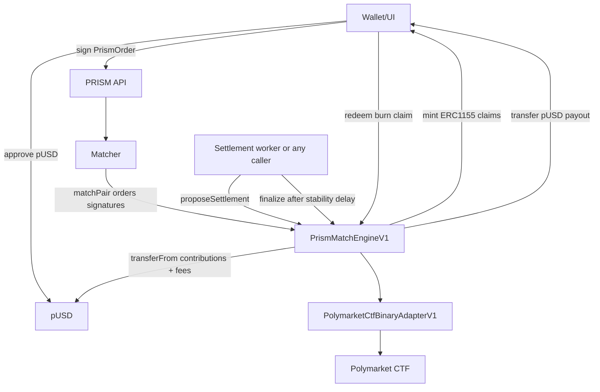

## 8.4 Storage ownership

`PrismMatchEngineV1` is canonical owner of:

- market specification hash;
- underlying bindings;
- status;
- per-market reserve;
- per-token total supply;
- order fill quantity;
- nonce-to-order binding;
- cancelled nonce bitmap;
- settlement proposal;
- final state/payout vector;
- accrued fees;
- ERC-1155 balances.

External adapter stores no market accounting.

## 8.5 IDs

Use ABI encoding, never string concatenation.

\[
\text{specHash}=\operatorname{keccak256}(\operatorname{abi.encode}(\text{MarketSpec}))
\]

\[
\text{marketId}=
\operatorname{keccak256}
(\operatorname{abi.encode}(
\text{PRISM\_DOMAIN},
\text{chainId},
\text{engine},
\text{specHash}
))
\]

\[
\text{tokenId}=
\operatorname{uint256}
(\operatorname{keccak256}(
\operatorname{abi.encode}(
\text{marketId},
\text{claimIndex}
)))
\]

ERC-1155 cocok karena satu contract dapat menerbitkan banyak fungible token class dan mendukung batch balances/transfers. [ERC-1155 specification](https://eips.ethereum.org/EIPS/eip-1155)

## 8.6 Market specification

Conceptual structure:

```text
MarketSpec
- schemaVersion
- templateId
- templateVersion
- collateralToken
- priceScale = 1_000_000
- claimCount
- stateCount
- payoffHash
- invalidPayoffHash
- tradingClosesAt
- invalidAfter
- finalityDelayBlocks
- issuanceFeeBps
- marketCollateralCap
- bindingA
- bindingB
```

Each binding pins:

```text
venueId
chainId
resolverAdapter
sourceContract
conditionId
selectedOutcomeIndex
outcomeSlotCount
rulesHash
semanticDescriptorHash
resolutionSourceHash
observationWindowHash
revisionPolicy
invalidPolicy
adapterVersion
```

The user-facing JSON is not canonical. JSON is compiled into canonical ABI fields; on-chain stores hashes and critical settlement fields.

## 8.7 Order format

EIP-712 domain:

```text
name              = RetroPick PRISM Match
version           = 1
chainId           = current chain
verifyingContract = PrismMatchEngineV1
```

Order:

```text
PrismOrder
- maker
- receiver
- marketId
- claimIndex
- quantityShares
- priceE6
- maxFeeBps
- expiry
- nonce
- allowedMatcher       // zero means permissionless
- optionalCounterparty
```

M0 only supports `ISSUE_BUY`, so no ambiguous BUY/SELL field is needed.

EIP-712 itself does not provide replay protection; application nonce/fill logic tetap wajib. [EIP-712](https://eips.ethereum.org/EIPS/eip-712)

Signature validation:

- EOA: strict ECDSA, low-`s`;
- contract wallet: ERC-1271 `isValidSignature`;
- failure or revert from ERC-1271 means invalid signature. [ERC-1271](https://eips.ethereum.org/EIPS/eip-1271)

## 8.8 Nonce and partial-fill model

Required mappings:

```text
filledQuantity[orderHash]
boundOrderByNonce[maker][nonce]
cancelledNonceBitmap[maker][word]
```

Rules:

1. First fill binds `(maker, nonce)` to `orderHash`.
2. Another order using the same nonce is rejected.
3. Partial fills increase `filledQuantity`.
4. Fill cannot exceed signed quantity.
5. Fully filled order invalidates nonce.
6. User can cancel nonce on-chain.
7. API cancellation without an on-chain invalidation is only a soft cancellation.

## 8.9 Exact payment arithmetic

Use integer shares, not fractional ERC-1155 share units:

- one position token pays at most `1_000_000` pUSD base units;
- price is `priceE6`;
- contribution:

\[
\text{payment}=\text{quantityShares}\times\text{priceE6}
\]

Alice:

```text
quantity = 10
price    = 570,000
payment  = 5,700,000 = 5.70 pUSD
```

Bob:

```text
quantity = 10
price    = 430,000
payment  = 4,300,000 = 4.30 pUSD
```

Exact invariant:

```text
priceConvE6 + priceDivE6 == 1_000_000
quantityConv == quantityDiv == fillQuantity
reserveIncrease == fillQuantity × 1_000_000
```

Fees dibayar **di atas** contribution dan dicatat terpisah. M0 sebaiknya tidak memiliki settlement fee; issuance fee dapat dimulai dari 0.

## 8.10 Invalid policy

Setelah claim transferable, “refund setiap original buyer sesuai entry price” tidak dapat dipertahankan secara fungible.

M0 policy yang konsisten:

```text
CONVERGENCE invalid payout = 0.50 pUSD
DIVERGENCE  invalid payout = 0.50 pUSD
```

Dengan demikian:

- collateral tetap lengkap;
- holder saat settlement menerima payout;
- tidak ada settlement fee;
- invalid bukan disebut “refund”, tetapi **invalid-state payout**.

Satu underlying 50/50, fractional, cancelled, atau malformed menyebabkan PRISM global state `INVALID`.

## 8.11 Settlement adapter

Adapter membaca CTF:

```text
payoutDenominator(conditionId)
payoutNumerators(conditionId, outcomeIndex)
```

Mapping:

- denominator `0`: `UNRESOLVED`;
- selected numerator = denominator dan semua lain `0`: `YES`;
- selected numerator `0` dan complementary numerator = denominator: `NO`;
- fractional, 50/50, malformed: `INVALID`.

Polymarket menggunakan UMA Optimistic Oracle, dan rare `Unknown/50-50` dapat menghasilkan payout `$0.50` per side. [Resolution process](https://docs.polymarket.com/concepts/resolution)

Gunakan two-step settlement:

1. `proposeSettlement()` membaca kedua conditions dan menyimpan result hash serta block number.
2. Tunggu `finalityDelayBlocks`.
3. `finalizeSettlement()` membaca ulang.
4. Finalize hanya jika hasil identik.
5. Jika berubah, proposal di-reset.
6. Setelah `invalidAfter`, siapa pun dapat mengusulkan timeout-invalid; finalize hanya jika conditions tetap unresolved/invalid.

Ini membuat proposer permissionless dan tidak memberinya kekuasaan memilih outcome.

## 8.12 Roles

| Role | Capability |
|---|---|
| Governance multisig | Set protocol caps, role administration |
| Template curator | Register template version |
| Market curator | Create market dari compiled spec |
| Pauser | Pause create/match |
| Treasury | Withdraw accrued fees only |
| Anyone | Submit compatible match jika order mengizinkan |
| Anyone | Propose/finalize deterministic settlement |
| Holder | Redeem |

Redemption tidak boleh dapat dipause.

## 8.13 Required invariants

- `balance >= totalReserves + fees`.
- Fees tidak pernah diambil dari reserves.
- `priceA + priceB == 1e6`.
- Matched quantities sama.
- Mint hanya setelah collateral diterima.
- External hedge balance tidak memengaruhi reserve.
- Market spec tidak dapat diedit.
- Underlying condition/outcome index tidak dapat diubah.
- Order tidak overfill.
- Nonce tidak replay.
- Finalization membutuhkan semua legs resolved atau invalid policy.
- Position dibakar sebelum payout transfer.
- Burn/redeem kedua kali tidak mungkin.
- Pause tidak memblokir redeem.
- Invalid settlement tidak membebankan settlement fee.
- Fee-on-transfer/rebasing collateral ditolak.
- Market cap enforced on-chain.

---

# 9. End-to-end funds and order flow

## 9.1 Funds-flow

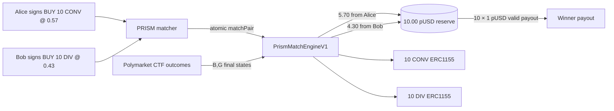

Tidak ada dana Alice/Bob yang dikirim ke Polymarket.

## 9.2 Sequence

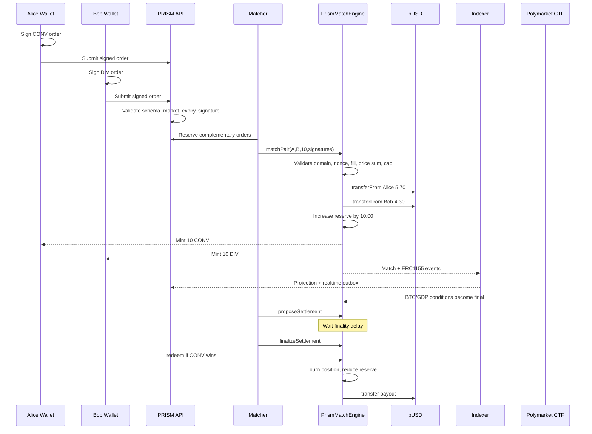

## 9.3 Order state machine

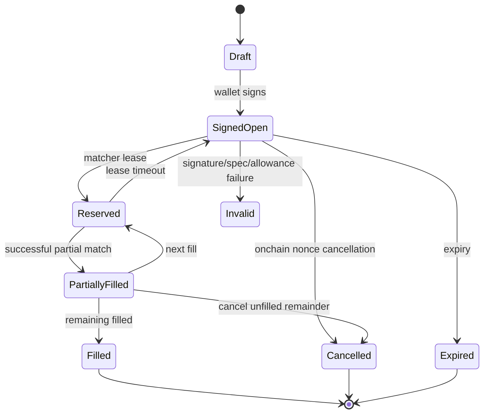

## 9.4 Settlement state machine

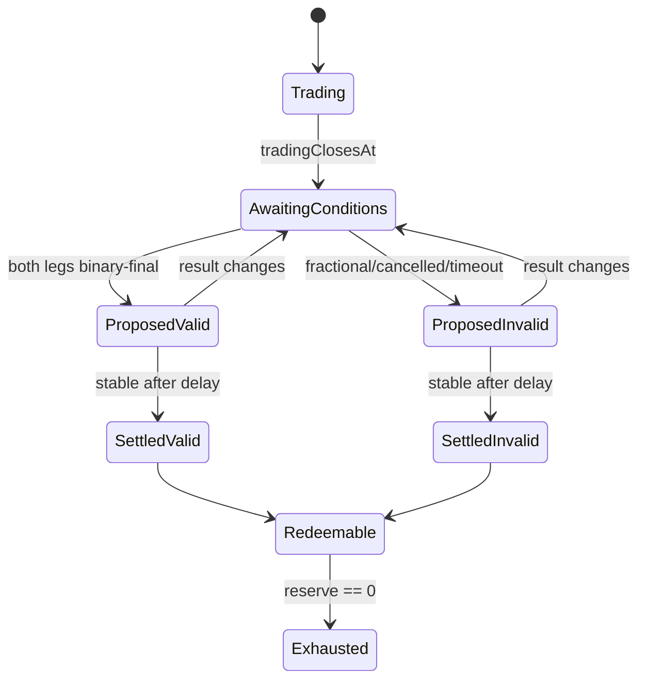

## 9.5 Failure and recovery

| Failure | Contract result | Recovery |
|---|---|---|
| Expired order | Atomic revert | Matcher releases lease |
| Reused/cancelled nonce | Revert | Mark invalid from chain |
| Revoked approval | Transfer revert | Return order to blocked status |
| Insufficient pUSD | Revert | User funds wallet |
| Invalid signature | Revert | Reject permanently |
| One order already partially filled | Fill only remaining quantity | Recompute complementary quantity |
| Prices do not sum to 1 | Revert | No mint |
| One underlying unresolved | No settlement | Retry later |
| 50/50/fractional condition | Proposed invalid | Invalid payout after delay |
| Settlement proposer disappears | No effect | Anyone can resubmit/finalize |
| Duplicate settlement | Idempotent/revert without state corruption | Indexer records canonical event |
| Chain reorg | Final UI rolls back projection | Rewind and replay |
| DB says matched but chain reverted | Reconciliation marks failed | Release orders if still valid |
| Chain matched but DB missed event | Indexer replay | On-chain remains canonical |

---

# 10. Polymarket semantic binding

Market title similarity tidak cukup.

Compiler harus menghasilkan structured semantic descriptor seperti:

```text
subject            BTC
metric             directional-condition
comparator         exact selected Polymarket outcome
unit               binary
observationStart   pinned
observationEnd     pinned
resolutionTime     pinned
resolutionSource   pinned
revisionVintage    pinned
timezone           pinned
fallbackRule       pinned
```

GDP membutuhkan perhatian ekstra:

- annualized vs non-annualized;
- real vs nominal GDP;
- quarter-over-quarter vs year-over-year;
- advance, second, atau final estimate;
- revision handling;
- release date vs observation quarter;
- “increase” dibanding quarter mana;
- source resmi BEA atau secondary source.

BTC leg juga harus memiliki:

- exchange/index source;
- exact timestamp/timezone;
- comparator;
- threshold/baseline;
- treatment jika harga tepat sama;
- observation window.

Jika BTC dan GDP windows tidak membuat definisi “co-movement” yang masuk akal, market tidak boleh diluncurkan.

Semantic compatibility pipeline:

```text
Fetch raw market
→ store raw immutable snapshot
→ canonicalize exact rules
→ hash rules
→ parse deterministic descriptor
→ human curator approval
→ bind condition ID + outcome index
→ compile truth table/payoff
→ create immutable PRISM market
```

LLM hanya boleh memberi candidate mapping. Human review dan deterministic constraints wajib.

---

# 11. Target monorepo tree

Semua path di bawah adalah proposal berdasarkan documented monorepo:

```text
package/
├── prediction-v2/                   # existing V1, untouched
└── prism-match/
    ├── src/
    │   ├── PrismMatchEngineV1.sol
    │   ├── PrismTemplateRegistryV1.sol
    │   ├── adapters/
    │   │   └── PolymarketCtfBinaryAdapterV1.sol
    │   ├── interfaces/
    │   ├── libraries/
    │   │   ├── PrismIds.sol
    │   │   ├── PrismOrderHash.sol
    │   │   └── PrismSolvency.sol
    │   └── types/
    ├── test/
    ├── script/
    └── prismArchitecture.md

apps/backend/
├── cmd/
│   ├── prism-indexer/
│   ├── prism-matcher/
│   └── prism-worker/
└── internal/prism/
    ├── api/
    ├── external/
    ├── semantics/
    ├── pricing/
    ├── orders/
    ├── matcher/
    ├── indexer/
    ├── settlement/
    ├── reconcile/
    └── risk/

packages/
├── prism-types/
├── market-spec/
├── payoff-core/
├── polymarket-v2/
└── contracts/
    └── registries/
        ├── base-sepolia/
        └── polygon/

apps/fe-v1/src/features/prism/
apps/ops/src/app/prism/
docs/technical/prism/
```

Rollback boundary:

- PRISM API berada di `/api/v2/prism`.
- PRISM DB tables memiliki prefix `prism_`.
- PRISM contracts tidak berbagi V1 storage.
- PRISM UI berada di feature flag terpisah.
- Menonaktifkan PRISM tidak mengubah V1.
- Redemption contract tetap aktif walaupun frontend/matcher dimatikan.

---

# 12. Backend process architecture

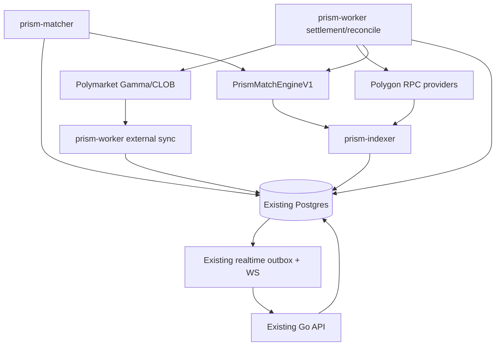

Gunakan modular monolith dan separately runnable commands. Jangan tambahkan Kafka, Redis, Kubernetes, atau database kedua.

## 12.1 Matcher concurrency

1. Select candidate orders dengan `FOR UPDATE SKIP LOCKED`.
2. Validate complementary claim, market, price sum, remaining quantity.
3. Buat short-lived reservation lease.
4. Commit DB transaction.
5. Revalidate on-chain fill/nonce/allowance.
6. Submit transaction.
7. Jangan menahan DB lock sambil menunggu receipt.
8. Correlate receipt menggunakan deterministic `matchId`.
9. Lease expiry worker memeriksa chain sebelum melepaskan order.
10. Duplicate submission aman karena on-chain fill accounting.

---

# 13. API design

Prefix:

```text
/api/v2/prism
```

Public/read:

```text
GET /templates
GET /markets
GET /markets/{marketId}
GET /markets/{marketId}/payoff
GET /markets/{marketId}/bindings
GET /markets/{marketId}/indicative-price
GET /markets/{marketId}/book
GET /markets/{marketId}/settlement
GET /positions?owner=
GET /claims?owner=
```

Authenticated/order:

```text
POST /orders/validate
POST /orders
GET  /orders/{orderHash}
GET  /orders?owner=
POST /orders/{orderHash}/cancel/prepare
POST /orders/{orderHash}/cancel/observe
```

Operations:

```text
GET /ops/prism/solvency
GET /ops/prism/reconciliation
GET /ops/prism/external-bindings
GET /ops/prism/settlement-queue
GET /ops/prism/incidents
GET /ops/prism/risk-limits
```

Every response yang bergantung pada chain harus menyertakan:

```text
chainId
contractAddress
contractVersion
asOfBlock
asOfBlockHash
confirmationCount
finalityStatus
indexedAt
```

Backend tidak menyimpan private key user. Matcher hanya memiliki service key untuk gas submission, bukan custody authority.

---

# 14. Database architecture

| Entity | Role dan primary key | Important constraints/status | Reorg/retention |
|---|---|---|---|
| `external_venues` | Config; `venue_id` | Versioned capabilities/endpoints | Permanent |
| `external_markets` | External metadata; `(venue_id, external_market_id)` | Latest metadata plus raw snapshot hash | Keep history |
| `external_conditions` | Condition identity; `(venue_id, chain_id, condition_id)` | CTF address, slots, current payout | Resolution re-indexable |
| `external_market_bindings` | Immutable curated binding; `binding_id` | rules/semantic hash, outcome index, adapter version | Permanent |
| `prism_templates` | Curated template; `(template_id, version)` | payoff hash, state/claim limits | Never mutate active version |
| `prism_markets` | Chain projection; `(chain_id, engine, market_id)` | spec hash, status, reserve | Rebuild from events |
| `prism_orders` | Signed intent; `order_hash` | signature, nonce, quantity, filled, expiry | Off-chain canonical pre-match |
| `prism_order_fills` | Fill record; `(order_hash, fill_index)` | match ID, quantity, tx/log identity | Reorg-aware |
| `prism_matches` | Submission lifecycle; `match_id` | reserved/submitted/mined/final/reverted | Reconcile to chain |
| `prism_positions` | Derived balance; `(chain_id, owner, token_id)` | balance, redeemed | Rebuild from ERC-1155 events |
| `prism_settlement_proposals` | Proposal projection; `(market_id, proposal_seq)` | result hash, proposed block | Reorg-aware |
| `prism_settlements` | Final settlement projection; `market_id` | final state, payout hash, tx/log | Chain canonical |
| `prism_chain_events` | Raw event journal; `(chain_id, tx_hash, log_index)` | block hash, ABI version, canonical flag | Retain permanently |
| `prism_quote_snapshots` | Indicative/executable market data | model version, book timestamp | Raw 30–90d, aggregate long-term |
| `prism_reconciliation_runs` | Reconcile audit; `run_id` | reserve/balance/supply differences | Permanent audit |
| `prism_risk_limits` | Versioned policy | market/user/condition caps | History retained |
| `prism_incidents` | Operator record; `incident_id` | severity, state, evidence | Permanent |

Indexes minimum:

- open orders: `(market_id, claim_index, price_e6, created_at)` filtered by status;
- nonce: `(maker, nonce)`;
- market events: `(chain_id, contract_address, block_number, log_index)`;
- external condition: `(chain_id, condition_id)`;
- settlement queue: `(status, earliest_finalize_at)`;
- positions: `(owner, balance)` filtered `balance > 0`;
- quote snapshots: `(market_id, observed_at desc)`.

## 14.1 Source-of-truth matrix

| Data | Canonical source |
|---|---|
| Unsigned draft | Client |
| Signed unmatched order | Signed message + PRISM order DB |
| Cancellation | On-chain nonce invalidation; DB cancel is soft |
| Matched position | PRISM contract/ERC-1155 |
| Collateral/reserve | PRISM contract + pUSD balance |
| External metadata | Versioned raw Gamma snapshots |
| Executable external book | CLOB snapshot at timestamp |
| External final outcome | Polymarket CTF state |
| PRISM settlement | PRISM contract |
| Claim eligibility | PRISM ERC-1155 balance + final payout |
| Portfolio | Indexed projection; chain is canonical |

---

# 15. Indexing and reorg model

Recommendation: dedicated `prism-indexer` yang menggunakan shared Ethereum primitives, bukan langsung memperbesar V1 event switch.

Cursor identity:

```text
chainId
contractAddress
contractVersion
abiVersion
consumerName
nextBlock
lastCanonicalBlockHash
```

Processing:

1. Query only through configured safe head.
2. Insert raw logs idempotently.
3. Apply all block projections in one DB transaction.
4. Insert realtime outbox in transaction yang sama.
5. Record block hash chain.
6. Jika parent hash mismatch, cari common ancestor.
7. Mark orphan events and delete/rebuild affected projections.
8. Replay forward.
9. UI tidak menampilkan `FINAL` sebelum configured confirmation policy.
10. Settlement worker selalu membaca ulang chain sebelum submit/finalize.

Jangan hardcode satu finality depth untuk semua chain. Registry harus menyimpan chain-specific:

```text
readConfirmationDepth
writeFinalityDepth
maxReorgRewind
rpcQuorumPolicy
```

---

# 16. Pricing/data model

Indicative joint model harus mengeluarkan:

```text
pB
pG
p11Estimate
p11FrechetLower
p11FrechetUpper
pConvergenceEstimate
pConvergenceLower
pConvergenceUpper
modelVersion
assumptions
featuresAsOf
externalBooksAsOf
confidenceInterval
```

Dependence model yang dapat digunakan:

\[
p_{11}
=
p_Bp_G+
\rho\sqrt{
p_B(1-p_B)p_G(1-p_G)
}
\]

Tetapi hasil harus di-clip ke Fréchet bounds.

Priority hierarchy untuk \(p_{11}\):

1. executable price dari exact semantic-compatible conjunction;
2. direct PRISM order-book price;
3. historical dependence/correlation model;
4. independence sebagai explicitly labeled fallback;
5. jika data lemah, tampilkan bounds, bukan false precision.

Displayed Polymarket midpoint bukan executable price. User harus melihat best bid, best ask, depth, fee, dan observation timestamp. Polymarket sendiri menjelaskan midpoint bisa berbeda dari harga trade aktual. [Prices and orderbook](https://docs.polymarket.com/concepts/prices-orderbook)

---

# 17. Security threat model

L = likelihood, I = impact.

| Threat | L/I | Prevention | Detection | Recovery |
|---|---|---|---|---|
| Semantic mismatch | M/H | Structured descriptor + human approval | Rules diff alerts | Stop new matching; existing market follows disclosed condition |
| Wrong condition ID | L/H | Dual review, checksum, on-chain binding | Reconcile Gamma ↔ CTF | Cancel only before OI; post-OI immutable |
| Wrong outcome index | M/H | Verify token/outcome array order and CTF slot | Truth-table test | Same as above |
| Rules changed/clarified | M/H | Pin rules hash and revision policy | Snapshot diff | Incident disclosure; no silent mutation |
| External cancellation | M/M | Explicit invalid policy | CTF fractional state | Invalid payout |
| 50/50/fractional payout | L/M | Adapter rejects as binary | Settlement alert | Invalid payout |
| Stale/unresolved condition | M/M | No finalize while unresolved | Settlement-lag metric | Timeout-invalid after grace period |
| Chain reorg | L/H | Confirmation delay + two-step settlement | Block-hash mismatch | Rewind/replay |
| RPC disagreement | M/H | Multiple RPC providers/read quorum | Divergence metric | Halt proposals, preserve redeem |
| Order replay | M/H | Domain, nonce binding, fill accounting | Revert metrics | Cancel nonce |
| Duplicate fill | L/H | On-chain remaining quantity | Reconciliation | Idempotent failure |
| Signature malleability | L/H | Standard strict ECDSA library | Invalid-signature metric | Reject |
| ERC-1271 edge case | M/H | Static validation, gas bounds, magic value | Wallet-specific errors | Reject/retry |
| Front-running match | M/L | Result independent of caller; receiver pinned | Unexpected executor metric | No economic change |
| Matcher censorship | M/M | Orders may allow permissionless match | Old-order latency | Alternate matcher |
| Revoked allowance/balance | H/L | Preflight plus atomic transfer | Revert classification | User re-approves/funds |
| Malicious collateral | L/H | pUSD-only M0; exact balance delta | Reserve mismatch | Pause matching |
| Reentrancy | L/H | CEI, nonReentrant, trusted token only | Invariant tests | Pause matching, redeem path preserved |
| Rounding/dust extraction | L/M | Whole ERC-1155 shares, E6 exact math | Zero expected dust | No protocol sweep of reserves |
| Fee reserve theft | L/H | Separate accounting, treasury cap | Solvency alert | Pause fee withdrawal/matching |
| Settlement proposer compromise | M/L | Proposer has no outcome discretion | Proposal mismatch | Anyone re-proposes |
| Database compromise | M/H | Chain revalidation before fill | Reconciliation | Rebuild projections |
| Registry drift | M/H | Version/hash pinning | Startup registry checksum | Reject process startup |
| Pause abuse | L/H | Multisig/timelock; pause scopes | Governance alerts | Redemption always callable |
| Blocked redemption | L/Critical | No pause on redeem | Synthetic redeem checks | Direct contract access |
| ML manipulation | M/M | ML cannot settle or bind condition | Model drift monitoring | Disable indicative model |
| Solver default | Later/H | Solver prepays full PRISM collateral | Hedge/solver health | PRISM payout unaffected |
| Cross-chain assumption | M/Critical | Polygon-only M0 | Chain-ID checks | Reject market creation |
| Generalized module exploit | Later/Critical | No arbitrary VM/delegatecall M0 | Code-hash monitoring | Versioned engine migration |

---

# 18. Testing architecture

## 18.1 Solidity

Required M0 suites:

- exhaustive 4-state BTC/GDP truth table;
- complete-set collateral invariant;
- global reserve versus pUSD balance invariant;
- price-sum and equal-quantity tests;
- full and partial fill;
- nonce collision, cancellation, replay;
- EIP-712 chain/domain mismatch;
- ERC-1271 valid, invalid, revert, malformed return;
- expired order;
- revoked allowance/insufficient balance;
- fee separation;
- market cap;
- invalid/fractional CTF payout;
- two-step settlement stability;
- timeout-invalid;
- duplicate proposal/finalization;
- redemption and double redemption;
- transfer then redemption;
- pause matching while redeem remains live;
- malicious ERC-20 harness despite pUSD-only production;
- fuzz `quantity × price`;
- differential payoff test vectors;
- fixed-block Polygon fork against official CTF and pUSD contracts.

Critical invariant CI must never silently skip.

## 18.2 Backend

- concurrent matcher workers;
- `SKIP LOCKED` reservation leases;
- same order selected by two workers;
- partial fill and cancellation race;
- submit succeeded but HTTP response lost;
- duplicate transaction submission;
- receipt reorg;
- duplicate log;
- cursor rewind;
- event replay from genesis;
- external metadata rule changes;
- CLOB timeout/rate limiting;
- settlement retry;
- DB ↔ on-chain reconciliation;
- authorization and SIWE wallet binding;
- schema/sqlc drift.

## 18.3 Frontend/shared

- EIP-712 typed payload snapshot;
- wrong chain/address warning;
- wallet rejection;
- approval revoked between review and execution;
- quote/order expiry;
- truth table rendering;
- fair vs executable price labels;
- signed → partial → matched transition;
- invalid payout disclosure;
- settlement proposal/finality state;
- claim after position transfer;
- shared Solidity/TypeScript test vectors.

---

# 19. Observability and operations

P0 alerts:

```text
vault_balance < reserves + fees
negative reserve delta
position supply × max payout > market reserve
unexpected market spec hash
finalized settlement differs from adapter reread
redemption failure on funded finalized market
```

P1 alerts:

```text
external rules hash changed
RPC providers disagree
indexer lag above threshold
reorg exceeds normal rewind
settlement unresolved beyond grace
matcher transaction revert spike
DB-chain fill mismatch
```

Core metrics:

```text
prism_vault_balance
prism_total_reserves
prism_withdrawable_fees
prism_solvency_gap
prism_market_open_interest
prism_order_match_latency
prism_order_revert_total{reason}
prism_external_snapshot_age
prism_settlement_lag
prism_indexer_lag_blocks
prism_reorg_depth
prism_reconciliation_diff
```

Every log should include:

```text
chainId
engine
marketId
orderHash
matchId
txHash
blockNumber
requestId
workerInstance
```

---

# 20. ADR recommendations

1. **ADR-PRISM-001:** PRISM is isolated from V1 storage and deployment.
2. **ADR-PRISM-002:** Polygon is the only Polymarket-bound settlement chain for M0.
3. **ADR-PRISM-003:** Non-upgradeable versioned singleton engine.
4. **ADR-PRISM-004:** pUSD-only collateral for any Polygon pilot.
5. **ADR-PRISM-005:** Complete-set matched issuance only in M0.
6. **ADR-PRISM-006:** `BOOLEAN_DIRECTIONAL_AGREEMENT_V1` is the only M0 template.
7. **ADR-PRISM-007:** CTF on-chain state is settlement truth; Gamma is metadata.
8. **ADR-PRISM-008:** Two-step permissionless settlement.
9. **ADR-PRISM-009:** Invalid payout is 50/50, not entry-price refund.
10. **ADR-PRISM-010:** External positions receive zero solvency credit.
11. **ADR-PRISM-011:** No arbitrary payoff VM/delegatecall in M0.
12. **ADR-PRISM-012:** Existing Postgres/realtime/SIWE reused.
13. **ADR-PRISM-013:** Dedicated PRISM indexer projection.
14. **ADR-PRISM-014:** ML is pricing advisory only.
15. **ADR-PRISM-015:** No real-money launch without audit and legal gate.

---

# 21. Dependency-ordered implementation roadmap

## Phase 0 — Repository verification

Likely inspected paths:

```text
AGENTS.md
CLAUDE.md
package.json
pnpm-workspace.yaml
turbo.json
package/prediction-v2/
apps/backend/
apps/fe-v1/
apps/ops/
packages/contracts/
.github/workflows/
docker-compose*.yml
```

Acceptance:

- real branch/status recorded;
- all documented paths checked;
- actual V1 ABI/storage/event map established;
- documentation drift report finalized;
- no code change.

## Phase 1 — Specification freeze

Deliver:

- ADRs;
- canonical terminology;
- MarketSpec schema;
- BTC/GDP semantic descriptor;
- truth table;
- invalid policy;
- EIP-712 order schema;
- shared test-vector JSON;
- contract invariants.

Acceptance:

- spec hash identical across Solidity/Go/TypeScript reference encoders;
- all four outcomes and invalid state have expected payout;
- no unresolved economic decision.

## Phase 2 — Local PRISM M0

Likely changed paths:

```text
package/prism-match/
packages/prism-types/
packages/market-spec/
packages/payoff-core/
apps/backend/internal/prism/
apps/fe-v1/src/features/prism/
```

Acceptance:

- mock collateral and mock binary adapters;
- Alice 5.70 + Bob 4.30 atomically mint 10/10 claims;
- invariant fuzz suite passes;
- V1 CI unchanged;
- local signed-order-to-redemption flow works.

Rollback: disable PRISM feature and commands; V1 untouched.

## Phase 3 — Read-only Polymarket

Deliver:

- Gamma discovery;
- CLOB book/history;
- raw metadata snapshots;
- CTF adapter;
- Polygon fixed-block fork tests;
- chain/version registry.

Acceptance:

- no external trade submission;
- condition outcome verified from CTF;
- rules hash changes detected;
- rate-limit/backoff tested;
- BTC/GDP bindings rejected unless semantics pass.

## Phase 4 — Capped pilot

Limits:

- allowlisted template;
- allowlisted markets;
- per-market collateral cap;
- per-user size cap;
- one collateral token;
- no yield;
- no external hedge;
- no permissionless market creation;
- no cross-margin.

Acceptance:

- independent contract audit complete;
- reconciliation shows zero difference;
- incident runbook rehearsed;
- multisig/timelock configured;
- legal/compliance approval;
- redemption tested without frontend.

## Later

- multi-leg Boolean composite;
- K-outcome complete sets;
- normalized scalar templates;
- direct split/merge;
- solver RFQ;
- external hedge execution;
- Builder attribution;
- additional venues.

---

# 22. Budget below USD 100

Dapat dilakukan:

- architecture/specification;
- Foundry/Anvil local development;
- Polygon mainnet fork;
- mock M0;
- public Gamma/Data/CLOB reads;
- existing VPS + Postgres modular-monolith processes;
- free/low-tier RPC during development;
- small production CLOB integration test jika secara geografis/legal diizinkan;
- testnet deployment untuk PRISM mock contracts.

Tidak realistis di bawah USD 100:

- independent smart-contract audit;
- legal opinion/licensing analysis;
- professional market making;
- production RPC redundancy;
- monitoring/on-call professional;
- insurance;
- UMA proposal/dispute bond;
- meaningful liquidity capital;
- secure multisig operational process;
- safe real-money production launch.

Budget murah dapat menghasilkan **validated prototype**, bukan audited financial protocol.

---

# 23. Explicit non-goals

M0 tidak mencakup:

- semua sembilan market type;
- generalized payoff VM;
- arbitrary external calls;
- Polymarket order execution;
- Combo dependency;
- external hedge accounting;
- cross-chain settlement;
- yield;
- undercollateralized minting;
- leverage;
- cross-market margin;
- entry-price refund after invalid;
- permissionless templates;
- permissionless external market binding;
- ML settlement;
- upgrade of V1 storage.

---

# 24. Open blockers

1. Monorepo source checkout belum tersedia.
2. BTC/GDP Polymarket conditions yang benar-benar kompatibel belum diidentifikasi.
3. GDP semantic definition dan revision policy belum dipilih.
4. Transferability vs regulatory treatment perlu legal review.
5. pUSD sebagai direct third-party protocol collateral perlu risk/legal approval.
6. Polygon RPC/finality policy belum ditentukan.
7. Protocol issuance fee belum diputuskan; rekomendasi M0 adalah 0.
8. Market collateral cap dan user cap belum dipilih.
9. Governance multisig/timelock signers belum ditentukan.
10. Geographical eligibility dan product availability harus diverifikasi per user/request.

---

# 25. Final go/no-go

**GO:**

- preserve existing monorepo;
- create isolated `package/prism-match`;
- implement only after actual repository Phase 0;
- start with local complete-set matching;
- use Polymarket read-only and CTF resolution verification;
- deploy Polymarket-bound PRISM only on Polygon;
- use pUSD as M0 live-pilot collateral only after audit/risk approval.

**NO-GO:**

- adding PRISM to V1 UUPS storage;
- claiming Polymarket liquidity collateralizes PRISM;
- sending user PRISM deposits into CLOB;
- calling BTC × GDP “convergence” without exact semantic alignment;
- pricing convergence only from BTC/GDP marginal prices;
- relying on Combo as the structured engine;
- real-money launch under the current sub-$100 budget.

The core innovation is valid: **PRISM is not a router of existing YES/NO trades. It is an independent, fully collateralized issuer of claims over a deterministic joint state space.** Polymarket supplies evidence and optional hedge liquidity; PRISM supplies the derivative itself.

### User
now research for math model based on all retropick market type, currently what clear is convergence but not for all market type

### Assistant
Saya akan memisahkan setiap market type menjadi empat lapisan matematis: **observable → state partition → payoff matrix → collateral/pricing**. Fokus utamanya bukan sekadar formula settlement V1, tetapi menentukan mana yang benar-benar bisa menjadi fixed-payout structured derivative, mana yang masih pari-mutuel, serta primitive eksternal apa yang dibutuhkan dari Polymarket/Kalshi/oracle scalar.

### Assistant
```json
{
  "plan": [
    {
      "step": "Inspect the two attached market-design documents and identify unresolved semantics",
      "status": "in_progress"
    },
    {
      "step": "Research formal models relevant to binary, categorical, path-dependent, and composite claims",
      "status": "pending"
    },
    {
      "step": "Define canonical mathematics and payoff matrices for all nine RetroPick market types",
      "status": "pending"
    },
    {
      "step": "Analyze pricing, collateral, external-liquidity replication, and oracle requirements per type",
      "status": "pending"
    },
    {
      "step": "Deliver a unified template taxonomy, M0/M1 roadmap, and unresolved design decisions",
      "status": "pending"
    }
  ]
}
```

### Assistant
```
bash -lc /bin/bash -lc "wc -l upload/'Markdown yang ditempelkan (1)(42).md' upload/'Markdown yang ditempelkan (2)(6).md'; for f in upload/'Markdown yang ditempelkan (1)(42).md' upload/'Markdown yang ditempelkan (2)(6).md'; do echo \"FILE: "'$f"; rg -n '"'"'^#{1,6} '"' \""'$f"; done'
```

### Tool
The output of this plugin was redacted.

### Assistant
_Menghitung baris dan mencari judul Markdown_

### Assistant
Search tool invoked with queries:
- site:faculty.haas.berkeley.edu Hanson logarithmic market scoring rule combinatorial information markets pdf
- site:arxiv.org combinatorial prediction markets conditional probabilities payoff matrix complete markets
- site:docs.gnosis.io conditional tokens condition collections position payout vectors
- site:cmegroup.com binary options digital option payoff barrier option education

### Assistant
_Menelusuri 3 situs web_

### Assistant
Dokumen Anda menunjukkan masalah intinya: sembilan nama market saat ini masih mencampur tiga hal—cara observasi, partisi outcome, dan bentuk payout. Saya sedang menormalkannya menjadi satu aljabar payoff yang sama, lalu menguji mana yang dapat direplikasi dari market eksternal dan mana yang memerlukan joint/path oracle sendiri.

### Assistant
```json
{
  "plan": [
    {
      "step": "Inspect attached RetroPick market definitions and prior architecture",
      "status": "completed"
    },
    {
      "step": "Research primary sources for conditional-token, cost-function, and barrier/path-dependent models",
      "status": "in_progress"
    },
    {
      "step": "Define canonical observables, state partitions, payoff matrices, pricing, and collateral for all nine market types",
      "status": "pending"
    },
    {
      "step": "Classify external-liquidity replicability, oracle requirements, and template constraints",
      "status": "pending"
    },
    {
      "step": "Deliver unified mathematical specification, recommendations, and open decisions",
      "status": "pending"
    }
  ]
}
```

### Assistant
Search tool invoked with queries:
- Gnosis Conditional Tokens payout vector partition official documentation
- Robin Hanson logarithmic market scoring rule original paper pdf
- combinatorial prediction markets cost function Chen Pennock paper pdf
- CME barrier options double no touch official education

### Assistant
Search tool invoked with queries:
- site:docs.polymarket.com conditional token framework outcome tokens resolution official
- site:docs.polymarket.com developers CLOB orders exchange contract official
- site:docs.polymarket.com sports combos official
- site:docs.polymarket.com market resolution UMA official

### Assistant
_Menelusuri 15 situs web_

### Assistant
```
bash -lc /bin/bash -lc "rg -n '"'^#{1,4} |''^## |''^### '"' 'upload/Markdown yang ditempelkan (2)(6).md' && sed -n '1,420p' 'upload/Markdown yang ditempelkan (2)(6).md'"
```

### Tool
The output of this plugin was redacted.

### Assistant
_Membaca file Markdown_

### Assistant
Search tool invoked with queries:
- site:docs.chain.link data streams OHLC official high low close
- site:docs.chain.link data feeds historical round data latestRoundData official
- site:docs.chain.link data streams report schema OHLC official
- site:docs.chain.link data feeds api reference AggregatorV3Interface official

### Assistant
Search tool invoked with queries:
- site:docs.chain.link/data-streams "marketStatus" "bid" "ask" "price" report schema
- site:docs.chain.link/data-streams "High" "Low" "Open" "Close"
- site:docs.chain.link/data-feeds/api-reference AggregatorV3Interface getRoundData
- site:docs.chain.link/data-feeds "historical" "getRoundData"

### Assistant
Search tool invoked with queries:
- https://docs.chain.link/data-feeds/api-reference

### Assistant
```
{
  "search_query": []
}
```

### Assistant
```
{
  "search_query": []
}
```

### Assistant
_Menelusuri 1 situs web_

### Assistant
```
bash -lc /bin/bash -lc 'rg -n "''^## 8|''^## 9|''^### 8|Direction|Threshold|Range Close|Velocity|Ladder|Convergence|Composite|Corridor|Cascade|pricing|Pricing|collateral|LMSR|RFQ" '"'upload/Markdown yang ditempelkan (1)(42).md' | head -n 220"
```

### Tool
The output of this plugin was redacted.

### Assistant
_Mencari dan membaca file Markdown_

### Assistant
```
{
  "search_query": []
}
```

### Assistant
_Menelusuri 1 situs web_

### Assistant
Temuan terpentingnya: `Direction`, `Threshold`, `Range Close`, dan `Velocity` sebenarnya satu keluarga “terminal partition”; `Convergence` dan `Composite` satu keluarga “joint Boolean”; sedangkan `Corridor` dan `Cascade` adalah path-dependent. `Ladder` saat ini belum konsisten sebagai fixed-payout derivative—saya akan spesifikasikan dua versi yang solvent, termasuk versi progresif yang dapat di-hedge sebagai basket market threshold eksternal.

### Assistant
Tool parameters:
- explanation: Primary-source research and mathematical normalization are complete. The final specification separates settlement payoffs, pricing, collateral, external replication, and oracle feasibility for each market type.

### Assistant
_Memproses selama 5m 19s_

### Assistant
# RetroPick PRISM Match — Mathematical Model Research

## Kesimpulan utama

Sembilan market type RetroPick tidak memerlukan sembilan mesin matematika atau sembilan smart contract berbeda. Mereka dapat direduksi menjadi lima template matematis:

| Mathematical family | RetroPick market |
|---|---|
| Terminal categorical partition | Direction, Threshold, Range Close, Velocity |
| Terminal structured scalar payoff | Ladder |
| Joint Boolean payoff | Boolean Convergence, Composite |
| Relative-value terminal payoff | Numeric Convergence |
| Path-dependent barrier payoff | Corridor, Cascade |

Ada tiga koreksi penting terhadap spesifikasi produk sekarang:

1. **Ladder saat ini belum valid sebagai fixed-payout derivative.** Bobot 4× dalam pool pari-mutuel tidak otomatis menciptakan payout 4×. Dalam structured market, bobot harus direpresentasikan melalui harga token, face value yang dicollateralize, atau progressive payoff.

2. **Convergence harus dipisahkan menjadi Boolean Agreement dan Numeric Convergence.** BTC/ETH ratio turun bukan otomatis berarti “converge” kecuali ada target ratio yang jelas.

3. **“Refund deposit saat void” tidak kompatibel dengan token structured market yang transferable.** PRISM membutuhkan invalid payout vector yang ditentukan sejak market creation.

Polymarket dapat menyediakan binary outcome primitives dan hedge liquidity, tetapi tidak otomatis menyediakan collateral bagi klaim PRISM. Polymarket menghasilkan fully backed YES/NO tokens melalui CTF, sedangkan CLOB-nya melakukan offchain matching dan onchain settlement. [Polymarket CTF](https://docs.polymarket.com/trading/ctf/overview), [Polymarket trading architecture](https://docs.polymarket.com/trading/overview).

---

# 1. Universal mathematical kernel

Setiap market PRISM harus dikompilasi ke bentuk:

\[
\mathcal M=(O,T,\phi,\Omega,H,R)
\]

dengan:

- \(O\): raw observations;
- \(T\): deterministic transforms;
- \(\phi\): state encoder;
- \(\Omega\): daftar mutually exclusive atomic states;
- \(H\): payoff matrix;
- \(R\): resolution dan invalid policy.

Jika terdapat \(M\) token outcome dan \(S\) atomic states:

\[
H\in[0,1]^{M\times S}
\]

Token \(m\) membayar:

\[
\operatorname{Payout}_m(s)=F H_{m,s}
\]

dengan \(F\) sebagai face value, misalnya 1 pUSD.

Jika outstanding quantity token \(m\) adalah \(q_m\), total liability pada state \(s\):

\[
L_s=F\sum_{m=1}^{M}q_mH_{m,s}
\]

Collateral minimum:

\[
C_{\min}=\max_{s\in\Omega}L_s
\]

Invariant smart contract:

\[
\text{reservedCollateral}\ge C_{\min}
\]

## Complete-set condition

Jika:

\[
\sum_{m=1}^{M}H_{m,s}=1 \qquad \forall s
\]

dan semua outcome dicetak dengan quantity sama \(Q\), maka:

\[
C_{\min}=QF
\]

Ini adalah model paling aman untuk PRISM: setiap complete set senilai satu pUSD selalu membayar tepat satu pUSD, terlepas dari outcome.

Konsep ini konsisten dengan Conditional Tokens: payout vector harus menjumlah ke satu dan collateral hanya dapat dipecah ke outcome partitions yang disjoint. CTF juga secara teoritis dapat membentuk deeper positions dari beberapa conditions. [Gnosis Conditional Tokens developer guide](https://gnosis-mercury.readthedocs.io/en/latest/developer-guide.html).

---

# 2. Invalid dan void policy

Tambahkan state khusus:

\[
\Omega'=\Omega\cup\{\bot\}
\]

dengan \(\bot\) berarti INVALID.

Setiap market harus memiliki invalid payout vector:

\[
r=(r_1,\ldots,r_M),\qquad \sum_mr_m=1
\]

Rekomendasi:

- Binary outcome: \(r=(0.5,0.5)\)
- \(K\)-outcome categorical: \(r_m=1/K\)
- Custom payout hanya jika ditampilkan dan di-hash pada market creation.

“Refund original deposit” tidak aman untuk transferable tokens karena token dapat berpindah tangan setelah issuance. Melacak harga beli awal akan menghilangkan fungibility dan membuat settlement bergantung pada trade history.

---

# 3. Ringkasan semua market types

| Market | Canonical observable | Payoff family | External replication |
|---|---|---|---|
| Direction | Return \(R\) | One-hot categorical | Satu exact direction/threshold market |
| Threshold | \(X_T\) terhadap \(K\) | Binary digital | Satu exact threshold market |
| Range Close | Terminal bucket | One-hot categorical | Synthetic threshold strip |
| Velocity | \(|R|\) bucket | One-hot transformed range | Multiple threshold digitals |
| Ladder | Terminal threshold progression | Normalized scalar/complement | Basket threshold markets |
| Convergence | Joint bits atau relative distance | Boolean/relative-value | Joint products required |
| Composite | Boolean function \(f(z)\) | Truth-table complement | Joint products, kecuali additive |
| Corridor | Full path extrema | Double-barrier binary | Exact path market only |
| Cascade | Number of barriers touched | Barrier-count categorical | Exact touch/barrier markets |

---

# 4. Direction

## Canonical observation

Gunakan return, bukan langsung subtraction:

\[
R=\frac{X_T-X_0}{X_0}
\]

Tambahkan tolerance \(\epsilon\):

\[
s(R)=
\begin{cases}
\text{DOWN},&R<-\epsilon\\
\text{FLAT},&-\epsilon\le R\le\epsilon\\
\text{UP},&R>\epsilon
\end{cases}
\]

## Recommended payoff matrix

Lebih aman menjadikan FLAT outcome ketiga:

\[
H_{\text{Direction}}=
\begin{bmatrix}
1&0&0\\
0&1&0\\
0&0&1
\end{bmatrix}
\]

dengan urutan state DOWN, FLAT, UP.

Jika tetap hanya UP/DOWN, maka “DOWN” sebaiknya didefinisikan sebagai `NOT_UP`, bukan mengabaikan flat:

\[
h_{\text{UP}}=\mathbf1[R>\epsilon]
\]

\[
h_{\text{NOT-UP}}=1-h_{\text{UP}}
\]

Alternatifnya, FLAT menjadi invalid dengan payout \(0.5/0.5\).

## Pricing

Dengan CDF return \(F_R\):

\[
P(\text{UP})=1-F_R(\epsilon)
\]

\[
P(\text{DOWN})=F_R(-\epsilon)
\]

\[
P(\text{FLAT})=F_R(\epsilon)-F_R(-\epsilon)
\]

## External liquidity

Direction dapat direplikasi oleh market threshold:

\[
X_T>X_0
\]

tetapi hanya jika:

- \(X_0\) sudah fixed;
- timestamp sama;
- oracle/source sama atau dianggap equivalent;
- comparator `>` versus `>=` sama;
- invalid dan delayed-resolution policy sama.

---

# 5. Threshold

## Canonical predicate

\[
A=\mathbf1[X_T\ge K]
\]

Atomic states:

\[
\Omega=\{\text{BELOW},\text{AT\_OR\_ABOVE}\}
\]

Payoff matrix:

\[
H_{\text{Threshold}}=
\begin{bmatrix}
1&0\\
0&1
\end{bmatrix}
\]

## Pricing

\[
P(X_T\ge K)=1-F_X(K^-)
\]

\(K^-\) diperlukan untuk memperhitungkan probability mass tepat di threshold.

## Mandatory parameters

- data source;
- units dan decimals;
- observation time/window;
- threshold \(K\);
- comparator: `GT`, `GTE`, `LT`, atau `LTE`;
- stale-data limit;
- revision/vintage policy untuk GDP, CPI, dan data makro;
- invalid policy.

Threshold adalah primitive paling penting karena Direction, Range, Velocity, dan Ladder dapat diturunkan darinya.

---

# 6. Range Close

Tentukan ordered boundaries:

\[
-\infty=b_0<b_1<\cdots<b_K=+\infty
\]

State \(j\):

\[
s=j\iff b_j\le X_T<b_{j+1}
\]

Semua interval harus half-open agar boundary tidak masuk ke dua bucket.

## Payoff matrix

\[
H_{\text{Range}}=I_K
\]

Karena tepat satu bucket menang:

\[
\sum_{j=0}^{K-1}h_j(X_T)=1
\]

Satu complete set membutuhkan satu unit collateral.

## Pricing

\[
P_j=P(b_j\le X_T<b_{j+1})
\]

\[
P_j=F_X(b_{j+1}^{-})-F_X(b_j^{-})
\]

## External replication

Definisikan threshold digital:

\[
D_K=\mathbf1[X_T\ge K]
\]

Maka range claim:

\[
\mathbf1[a\le X_T<b]=D_a-D_b
\]

Secara matematis range dapat direplikasi dari dua threshold claims. Secara eksekusi, PRISM tetap membutuhkan:

- kemampuan membeli/menjual complementary positions;
- collateral untuk short leg;
- kedua market menggunakan settlement semantics identik;
- cukup depth pada kedua orderbook.

Jika kondisi eksternal tidak identik, posisi tersebut hanya hedge dengan basis risk.

---

# 7. Velocity

Dokumen sekarang mendefinisikan Velocity sebagai absolute percentage move. Maka canonical V1 seharusnya mempertahankan:

\[
R=\frac{X_T-X_0}{X_0}
\]

\[
V=|R|
\]

Bukan realized volatility. Realized volatility merupakan produk berbeda:

\[
\sigma_{\text{realized}}
=
\sqrt{\sum_{i=1}^{n}r_i^2}
\]

## Velocity buckets

Tentukan:

\[
0=v_0<v_1<\cdots<v_K=+\infty
\]

State:

\[
s=j\iff v_j\le V<v_{j+1}
\]

Payoff matrix:

\[
H_{\text{Velocity}}=I_K
\]

## Pricing

Jika \(F_R\) adalah return CDF:

\[
P(v_j\le |R|<v_{j+1})
\]

\[
=
F_R(v_{j+1})-F_R(v_j)
+
F_R(-v_j)-F_R(-v_{j+1})
\]

## External replication

Bucket \([a,b)\) sama dengan dua terminal price regions:

\[
X_T\in[X_0(1-b),X_0(1-a)]
\]

atau:

\[
X_T\in[X_0(1+a),X_0(1+b))
\]

Jadi Velocity dapat disintesis dari beberapa terminal threshold/range markets. Ia tidak memerlukan joint distribution karena semua predicates berasal dari scalar \(X_T\) yang sama.

## Boundary correction

Contoh dokumentasi menyebut bucket `1–3%`, kemudian move tepat `3%` dimasukkan ke bucket tersebut. Ini ambigu.

Gunakan salah satu secara eksplisit:

```text
[0%, 1%)
[1%, 3%)
[3%, 5%)
[5%, infinity)
```

atau gunakan integer basis points dan comparator yang telah ditentukan.

---

# 8. Ladder

## Masalah dengan model sekarang

Current specification:

> Winning tier collects losing pool, scaled by tier weight.

Jika hanya satu tier menang, semua user di tier tersebut memiliki weight yang sama. Weight itu akan hilang ketika payout dibagi pro rata:

\[
\frac{u_kw_k}{S_kw_k}P
=
\frac{u_k}{S_k}P
\]

Jadi constant tier weight tidak menciptakan payout 4× dalam pari-mutuel pool.

Jika token tier \(k\) benar-benar membayar \(w_k\) pUSD:

\[
h_k(s)=w_k\mathbf1[s=k]
\]

maka untuk equal issuance:

\[
C_{\min}=\max_kw_k
\]

Satu pUSD collateral tidak cukup.

## Model A — Exclusive Digital Ladder

Ini sama dengan Range Close:

\[
h_k(s)=\mathbf1[s=k]
\]

Semua tier membayar 1 pUSD jika menang. Tier ekstrem memiliki probability lebih rendah, sehingga harga belinya juga lebih rendah.

Rarity direpresentasikan oleh **harga**, bukan multiplier payout.

Ini solvent, tetapi tidak cukup berbeda dari Range Close.

## Model B — PRISM Progressive Ladder

Ini rekomendasi saya untuk menjadi structured derivative yang benar-benar berbeda.

Untuk upward ladder dengan thresholds:

\[
K_1<K_2<\cdots<K_n
\]

dan weights \(\alpha_i>0\), definisikan:

\[
A=\sum_{i=1}^n\alpha_i
\]

\[
Y(X_T)
=
\frac{1}{A}
\sum_{i=1}^{n}
\alpha_i\mathbf1[X_T\ge K_i]
\]

Outcome LONG LADDER membayar:

\[
h_L=Y(X_T)
\]

Outcome SHORT LADDER membayar:

\[
h_S=1-Y(X_T)
\]

Karena:

\[
h_L+h_S=1
\]

maka satu LONG/SHORT complete set selalu membutuhkan tepat satu unit collateral.

### Example

Thresholds:

\[
80k,\ 82k,\ 84k
\]

Equal weights:

\[
\alpha=(1,1,1)
\]

Jika BTC close pada 83k, dua threshold terlampaui:

\[
Y=\frac{2}{3}
\]

Payout:

- LONG LADDER: 0.666667 pUSD
- SHORT LADDER: 0.333333 pUSD

Ini adalah structured payout, bukan winner-takes-all bet.

## Pricing dan external hedge

\[
E[Y]
=
\frac{1}{A}
\sum_i\alpha_iP(X_T\ge K_i)
\]

Ini sangat menarik untuk PRISM: Progressive Ladder dapat di-hedge secara linear dengan basket YES tokens dari beberapa exact Polymarket threshold markets:

\[
\text{Hedge}
=
\sum_i\frac{\alpha_i}{A}\operatorname{YES}(X_T\ge K_i)
\]

Tidak diperlukan joint probability karena payoff bersifat additive.

---

# 9. Convergence

Convergence harus dipisahkan menjadi beberapa template.

## 9.1 Boolean Agreement Convergence

Untuk dua external conditions:

\[
B,G\in\{0,1\}
\]

Atomic states:

\[
\Omega=\{00,01,10,11\}
\]

CONVERGENCE berarti keduanya sama:

\[
h_C(B,G)=\mathbf1[B=G]
\]

DIVERGENCE:

\[
h_D(B,G)=1-h_C(B,G)
\]

Payoff matrix:

\[
H=
\begin{bmatrix}
1&0&0&1\\
0&1&1&0
\end{bmatrix}
\]

Urutan state: \(00,01,10,11\).

Equivalent polynomial:

\[
h_C=1-B-G+2BG
\]

Interaction term \(BG\) membuktikan bahwa BTC YES dan GDP YES secara individual tidak cukup untuk mereplikasi Convergence.

### Probability

\[
p_B=P(B=1),\quad p_G=P(G=1),\quad p_{11}=P(B=1,G=1)
\]

\[
P(C)=1-p_B-p_G+2p_{11}
\]

Fréchet bounds:

\[
\max(0,p_B+p_G-1)\le p_{11}\le\min(p_B,p_G)
\]

Jika:

\[
p_B=0.60,\qquad p_G=0.55
\]

maka:

\[
0.15\le P(C)\le0.95
\]

Independence menghasilkan:

\[
P(C)=p_Bp_G+(1-p_B)(1-p_G)=0.51
\]

Tetapi 51% adalah model assumption, bukan angka yang dapat diturunkan dari dua harga marginal.

## 9.2 Directional co-movement

Untuk dua scalar returns:

\[
R_X=\frac{X_T-X_0}{X_0}
\]

\[
R_Y=\frac{Y_T-Y_0}{Y_0}
\]

Definisikan:

\[
B=\mathbf1[R_X>0],\qquad G=\mathbf1[R_Y>0]
\]

Lalu gunakan Boolean Agreement yang sama.

Ini cocok untuk “apakah BTC dan GDP bergerak dalam arah yang sama?”, tetapi tidak membuktikan bahwa BTC menyebabkan perubahan GDP.

**Co-movement bukan causality.** Klaim “BTC impacts GDP” membutuhkan resolution criterion causal yang independen, misalnya hasil studi atau metric yang sudah dipraregistrasikan.

## 9.3 Numeric target convergence

Untuk BTC/ETH atau dua scalar lain, harus ada target ratio \(R^\*\):

\[
Z_t=\ln\left(\frac{X_t}{Y_t}\right)-\ln R^\*
\]

Distance:

\[
d_t=|Z_t|
\]

Converge jika:

\[
d_T<d_0-\epsilon
\]

Diverge jika:

\[
d_T>d_0+\epsilon
\]

Stable jika:

\[
|d_T-d_0|\le\epsilon
\]

Recommended outcome set:

\[
\{\text{CONVERGE},\text{STABLE},\text{DIVERGE}\}
\]

dengan payoff matrix \(I_3\).

Perubahan BTC/ETH dari 31.2 menjadi 29.8 hanya dapat disebut convergence jika target \(R^\*\) telah ditentukan dan 29.8 memang lebih dekat ke target tersebut. Tanpa target, itu hanya `RATIO_DOWN`, yaitu relative outperformance ETH terhadap BTC.

---

# 10. Composite

Definisikan \(n\) binary conditions:

\[
z=(z_1,\ldots,z_n)\in\{0,1\}^n
\]

State space:

\[
|\Omega|=2^n
\]

Market creator memilih deterministic Boolean function:

\[
f:\{0,1\}^n\rightarrow\{0,1\}
\]

Payoff:

\[
h_{\text{YES}}(z)=f(z)
\]

\[
h_{\text{NO}}(z)=1-f(z)
\]

## Supported functions

AND:

\[
f_{\text{AND}}(z)=\prod_{i=1}^{n}z_i
\]

OR:

\[
f_{\text{OR}}(z)=1-\prod_{i=1}^{n}(1-z_i)
\]

Majority:

\[
f_{\text{MAJ}}(z)
=
\mathbf1\left[
\sum_i z_i>\frac n2
\right]
\]

At-least-\(k\):

\[
f_{k+}(z)
=
\mathbf1\left[
\sum_i z_i\ge k
\right]
\]

Exact-\(k\):

\[
f_{=k}(z)
=
\mathbf1\left[
\sum_i z_i=k
\right]
\]

XOR/parity:

\[
f_{\text{XOR}}(z)
=
\left(\sum_i z_i\right)\bmod2
\]

## Pricing

Dengan joint state probability \(\pi_z\):

\[
P(\text{YES})=\sum_{z\in\{0,1\}^n}f(z)\pi_z
\]

Marginal prices \(P(z_i=1)\) tidak cukup untuk AND, OR, Majority, atau Exact-\(k\). Diperlukan joint distribution.

Karena jumlah state berkembang eksponensial, rekomendasi:

\[
n\le4
\]

untuk first general-purpose engine, sehingga maksimum 16 atomic states. Kompleksitas pricing combinatorial markets merupakan masalah yang terdokumentasi bahkan untuk LMSR. [Complexity of Combinatorial Market Makers](https://arxiv.org/abs/0802.1362).

## Additive Composite Index

Buat template kedua yang lebih mudah dicompose:

\[
Y(z)=\frac{\sum_iw_iz_i}{\sum_iw_i}
\]

LONG INDEX membayar \(Y\), SHORT INDEX membayar \(1-Y\).

Harga:

\[
E[Y]
=
\frac{\sum_iw_iP(z_i=1)}{\sum_iw_i}
\]

Tidak memerlukan joint distribution. Ia juga dapat direplikasi secara linear dari external YES tokens.

Jadi harus ada dua product berbeda:

- `BOOLEAN_COMPOSITE`: AND/OR/Majority, membutuhkan joint pricing;
- `WEIGHTED_COMPOSITE_INDEX`: fractional payoff, dapat memakai marginal liquidity.

---

# 11. Corridor

Corridor adalah path-dependent double-barrier claim.

Tentukan observation window:

\[
[t_0,T]
\]

dan boundaries:

\[
L<U
\]

Path extrema:

\[
m_T=\min_{t\in[t_0,T]}X_t
\]

\[
M_T=\max_{t\in[t_0,T]}X_t
\]

Karena dokumentasi menyatakan touch berarti OUTSIDE:

\[
h_{\text{INSIDE}}
=
\mathbf1[m_T>L\land M_T<U]
\]

\[
h_{\text{OUTSIDE}}=1-h_{\text{INSIDE}}
\]

Payoff matrix tetap binary complete set.

## Critical distinction

\[
P(m_T>L,M_T<U)
\neq
P(L<X_T<U)
\]

Bahkan:

\[
P(m_T>L,M_T<U)
\le
P(L<X_T<U)
\]

BTC dapat menyentuh 90k lalu close 80k. Terminal range token akan menang, Corridor Inside akan kalah.

## Monitoring definition

“Stayed inside at all times” tidak dapat digunakan tanpa menentukan:

- continuous atau discrete monitoring;
- sample frequency;
- missing candles;
- data-source downtime;
- boundary touch policy;
- market-hours policy;
- price type: index, mid, bid, ask, atau trade;
- timestamp alignment.

Recommended first implementation:

\[
h_{\text{INSIDE}}^{\text{discrete}}
=
\prod_{i=0}^{N}
\mathbf1[L<X_{t_i}<U]
\]

atau gunakan authenticated high/low summary untuk window tersebut.

Chainlink Data Feeds memang menyediakan historical rounds, tetapi updates dipicu heartbeat/deviation, round IDs harus diketahui, dan dokumentasinya memperingatkan bahwa looping historical rounds onchain dapat sangat mahal. [Chainlink historical data](https://docs.chain.link/data-feeds/historical-data).

Chainlink Data Streams Candlestick API menyediakan OHLC historical dan live data, tetapi itu tetap perlu dimasukkan ke settlement melalui signed reporter, verified report, commitment, atau dispute mechanism—smart contract tidak boleh sekadar mempercayai response backend. [Chainlink Candlestick API](https://docs.chain.link/data-streams/reference/candlestick-api).

---

# 12. Cascade

Cascade adalah path-dependent barrier-count market.

Untuk upward cascade:

\[
K_1<K_2<\cdots<K_n
\]

Gunakan path maximum:

\[
M_T=\max_{t\in[t_0,T]}X_t
\]

Jumlah level yang disentuh:

\[
N=\sum_{j=1}^{n}\mathbf1[M_T\ge K_j]
\]

Karena barriers ordered, \(N\in\{0,\ldots,n\}\).

## Exclusive tier claims

\[
h_k=\mathbf1[N=k]
\]

Payoff matrix:

\[
H_{\text{Cascade}}=I_{n+1}
\]

Probability:

\[
P(N=k)
=
P(M_T\ge K_k)-P(M_T\ge K_{k+1})
\]

dengan boundary definitions untuk \(k=0,n\).

## Progressive Cascade

Definisikan:

\[
Y_{\text{cascade}}
=
\frac{1}{A}
\sum_{j=1}^{n}
\alpha_j\mathbf1[M_T\ge K_j]
\]

LONG CASCADE membayar \(Y_{\text{cascade}}\), SHORT membayar complement.

Ini mirip Progressive Ladder, tetapi:

- Ladder menggunakan terminal \(X_T\);
- Cascade menggunakan path maximum/minimum.

Sebuah aset yang sempat menyentuh 84k lalu close 78k:

- Terminal Ladder hanya melihat 78k;
- Cascade menghitung semua upward levels yang pernah disentuh.

Polymarket terminal threshold market tidak dapat meng-hedge Cascade secara exact. Diperlukan market yang secara eksplisit bertanya “will BTC touch \(K\) before \(T\)?”

---

# 13. External-liquidity replication engine

Untuk menyatakan secara formal apakah Polymarket dapat menjadi liquidity source, definisikan:

- \(h\in\mathbb R^S\): payoff structured claim PRISM;
- \(E\in\mathbb R^{J\times S}\): payoff matrix \(J\) external positions;
- \(a\in\mathbb R^J\): portfolio external.

## Exact replication

External positions mereplikasi PRISM claim jika:

\[
E^\top a=h
\]

Jika tidak ada \(a\) yang memenuhi equality, klaim tidak dapat di-hedge secara exact.

## Superhedging

Dengan biaya external positions \(c\):

\[
C_{\text{super}}
=
\min_a c^\top a
\]

subject to:

\[
E^\top a\ge h
\]

Ini memberikan harga maksimum economically defensible untuk maker yang ingin fully hedge.

Dengan bid/ask dan short constraints, gunakan dua variables:

\[
a=a^+-a^-,\qquad a^+,a^-\ge0
\]

dan objective berdasarkan ask untuk long serta bid untuk short.

## Classification

### Exact atau hampir exact

- Direction jika ada exact external direction market.
- Threshold jika ada exact threshold condition.
- Range jika tersedia compatible threshold strip.
- Velocity jika tersedia cukup terminal threshold strikes.
- Progressive Ladder sebagai weighted threshold basket.
- Additive Composite sebagai weighted binary basket.

### Membutuhkan joint external positions

- Boolean Convergence.
- AND/OR/Majority Composite.
- Exact-\(k\), XOR dan arbitrary truth table.

### Tidak dapat direplikasi oleh terminal market

- Corridor.
- Cascade.
- Knock-in/knock-out.
- Duration-in-range.
- Drawdown.

Gnosis CTF secara teknis mendukung positions yang bergantung pada beberapa conditions, tetapi ini tidak berarti Polymarket CLOB menyediakan orderbook liquid untuk setiap deeper position. Itu harus dianggap sebagai theoretical composability, bukan available liquidity.

---

# 14. Pricing model per family

| Family | Indicative fair value |
|---|---|
| Binary | \(E[h]=P(A)\) |
| Categorical | \(p_j=P(s=j)\), \(\sum p_j=1\) |
| Progressive Ladder | \(\sum_i\alpha_iP(X_T\ge K_i)/A\) |
| Boolean joint | \(\sum_zf(z)\pi_z\) |
| Corridor | First-passage/survival probability |
| Cascade | Barrier-touch probabilities |
| Weighted Composite | Weighted marginal probabilities |

Harus ada tiga price concepts terpisah:

1. `modelProbability`: statistical estimate;
2. `indicativeMark`: RetroPick reference mark;
3. `executablePrice`: bid/ask berdasarkan real depth.

External price 0.60 tidak berarti user dapat mengeksekusi quantity besar pada 0.60. Untuk hedging, gunakan volume-weighted fill cost dari orderbook, bukan midpoint. Polymarket menyediakan full public orderbook termasuk bids, asks, size, spread, dan tick size. [Polymarket orderbook documentation](https://docs.polymarket.com/trading/orderbook).

## ML role

ML boleh menghasilkan:

- marginal probability forecasts;
- joint distribution/copula;
- regime-dependent volatility;
- first-passage Monte Carlo parameters;
- confidence intervals;
- anomaly detection.

ML tidak boleh:

- menentukan settlement outcome;
- mengubah payoff matrix;
- memilih condition ID secara otomatis;
- mengubah boundary/comparator setelah market lock;
- menggantikan oracle resolution.

---

# 15. Recommended template engine

RetroPick tidak perlu membuat resolver terpisah untuk setiap market. Gunakan lima versioned templates.

## `TERMINAL_PARTITION_V1`

Menangani:

- Direction;
- Threshold;
- Range Close;
- Velocity;
- exclusive Ladder.

Parameters:

```text
observation specs
start/end timestamps
transform type
ordered boundaries
boundary convention
outcome count
invalid payout vector
```

## `NORMALIZED_LADDER_V1`

Menangani:

- Progressive terminal Ladder;
- weighted Composite Index;
- future scalar structured payoffs.

Parameters:

```text
ordered thresholds
direction
weights
normalization denominator
terminal observation
complement claim
```

Invariant:

\[
0\le Y\le1,\qquad Y+(1-Y)=1
\]

## `BOOLEAN_TRUTH_TABLE_V1`

Menangani:

- Boolean Convergence;
- AND/OR/Majority;
- Exact-\(k\);
- XOR;
- arbitrary composite up to four conditions.

Parameters:

```text
condition IDs
outcome polarity mappings
truth-table bitmap
state ordering
invalid handling
```

## `RELATIVE_VALUE_V1`

Menangani:

- target-ratio convergence;
- normalized spread;
- relative outperformance.

Parameters:

```text
two observation specs
normalization method
target/anchor
distance function
tolerance
three-state partition
```

## `PATH_BARRIER_V1`

Menangani:

- Corridor;
- Cascade;
- knock-in/out;
- future drawdown and duration markets.

Parameters:

```text
window
path source
sampling resolution
coverage proof/commitment
lower/upper boundaries
touch convention
barrier levels
missing-data policy
```

Smart contract menyimpan `templateId`, `templateVersion`, parameter hash, state ordering, payoff matrix hash, dan oracle specification hash. Backend dapat menghitung, tetapi contract harus dapat memverifikasi hasil deterministik terhadap template yang di-lock.

---

# 16. Recommended development order

Untuk budget pre-funding yang sangat kecil:

1. **Boolean Convergence**
   - dua resolved Polymarket conditions;
   - empat atomic states;
   - dua complementary PRISM claims.

2. **Threshold dan Direction**
   - scalar snapshot;
   - binary/three-state settlement.

3. **Range Close dan Velocity**
   - reuse `TERMINAL_PARTITION_V1`.

4. **Progressive Ladder**
   - structured payout pertama yang benar-benar bisa direplikasi sebagai basket external threshold markets.

5. **Composite \(n\le4\)**
   - explicit truth-table;
   - joint-pricing service.

6. **Corridor dan Cascade terakhir**
   - baru setelah path data, signed reports, missing-data policy, challenge mechanism, dan monitoring coverage diselesaikan.

Corridor dan Cascade bukan MVP murah: contract matematikanya sederhana, tetapi oracle integrity dan path completeness adalah bagian yang sulit dan mahal.

## Final recommendation

Canonical RetroPick product set sebaiknya menjadi:

```text
Direction         = terminal return partition
Threshold         = terminal digital
Range Close       = terminal categorical digitals
Velocity          = absolute-return categorical digitals
Ladder            = normalized progressive terminal payoff
Convergence       = Boolean Agreement atau anchored relative-value
Composite         = Boolean truth table atau additive index
Corridor          = discrete/path-certified double barrier
Cascade           = path-certified barrier count
```

Inovasi PRISM bukan sekadar menggabungkan order YES/NO. Inovasinya adalah:

\[
\text{external primitives}
\rightarrow
\text{deterministic state compiler}
\rightarrow
\text{structured payoff matrix}
\rightarrow
\text{state-complete collateral}
\]

Polymarket menyediakan evidence, market-implied prices, dan optional hedges. RetroPick menerbitkan derivative baru, menentukan payoff matrix, menahan collateral, dan membayar klaimnya sendiri.

### User
analyze deeply and research = tentukan mana yang perlu smart contract dan tidak langsung ke polymarket clob/combos

### Assistant
Saya akan membedakan tiga hal yang sering tercampur: routing order ke token Polymarket yang sudah ada, membuat basket/Combo tanpa outcome baru, dan menerbitkan satu klaim structured RetroPick dengan payout baru. Kebutuhan smart contract berubah total di setiap lapisan itu.

### Assistant
Search tool invoked with queries:
- site:help.polymarket.com Combos how it works RFQ eligible markets sports official
- site:docs.polymarket.com CLOB V2 exchange supported assets conditional tokens orders official
- site:docs.polymarket.com negative risk markets multi outcome official
- site:docs.polymarket.com conditional token framework split merge redeem binary official

### Assistant
Search tool invoked with queries:
- site:docs.polymarket.com CLOB V2 order struct tokenID makerAmount takerAmount official
- site:docs.polymarket.com contracts CTF Exchange V2 Polygon official
- site:docs.polymarket.com builders overview order attribution relayer official
- site:github.com/Polymarket clob v2 exchange contract order struct

### Assistant
_Menelusuri 3 situs web_

### Assistant
Hasil risetnya tegas: CLOB hanya bisa mengeksekusi order atas `tokenID` outcome yang sudah terdaftar; `metadata/builder` dalam signed order bukan tempat mendefinisikan rumus payout baru. Combos memang menciptakan pengalaman satu posisi, tetapi saat ini hanya sports dan logikanya semua leg harus benar—jadi tidak mencakup Convergence BTC–GDP, OR, Majority, Ladder progresif, Corridor, atau Cascade.

### Assistant
_Memproses selama 1m 34s_

### Assistant
# Kesimpulan utama

Untuk RetroPick PRISM Match, jawabannya bukan sekadar “pakai smart contract” atau “langsung Polymarket.” Ada tiga model berbeda:

1. **Direct CLOB router**
   User membeli token Polymarket yang sudah ada. Tidak perlu smart contract RetroPick.

2. **Virtual basket/Combo interface**
   RetroPick menggabungkan beberapa transaksi eksternal dalam UI, tetapi user tetap memiliki external positions. Tidak perlu smart contract RetroPick, tetapi RetroPick belum menerbitkan derivative baru.

3. **PRISM structured derivative**
   RetroPick menciptakan satu claim baru dengan payoff yang tidak tersedia di Polymarket. Ini membutuhkan smart contract RetroPick sendiri.

Secara default:

- Direction dan Threshold bisa langsung ke CLOB jika exact market sudah tersedia.
- Range Close kadang bisa langsung melalui Polymarket Neg Risk event.
- Composite AND tertentu bisa melalui Combos, tetapi saat ini Combos hanya sports.
- Velocity, Progressive Ladder, Convergence, general Composite, Corridor, dan Cascade pada umumnya memerlukan smart contract RetroPick.
- Semua tipe bisa ditampilkan sebagai “simulasi strategy” tanpa contract, tetapi belum menjadi tradeable structured market.

---

# 1. Batas kemampuan Polymarket CLOB

Polymarket CLOB V2 melakukan trading terhadap Conditional Token Framework token yang sudah ada. Setiap order menyebut `tokenID`, amount, side, signature, timestamp, metadata, dan builder attribution. Exchange kemudian memindahkan pUSD atau ERC-1155 outcome tokens, atau melakukan CTF mint/merge. [Official CTF Exchange V2 repository](https://github.com/Polymarket/ctf-exchange-v2), [Polymarket CLOB order documentation](https://docs.polymarket.com/trading/orders/create).

Artinya, CLOB tidak menerima payload seperti:

```json
{
  "formula": "BTC_CONVERGENCE_GDP",
  "payoff": "(BTC && GDP) || (!BTC && !GDP)"
}
```

lalu otomatis membuat derivative baru.

`metadata` dan `builderCode` tidak mengubah payout. Builder code hanya mengatribusikan volume kepada aplikasi yang mengirim order. [Polymarket Builder Program](https://docs.polymarket.com/builders/overview).

CLOB hanya memahami:

```text
existing token ID
BUY atau SELL
price
quantity
signature
```

Jadi:

\[
\text{JSON payload}\neq\text{new payoff definition}
\]

JSON hanya komunikasi antara frontend/backend dan CLOB API. Perpindahan dana dilakukan melalui token approvals, EIP-712 signed orders, dan onchain Exchange settlement.

---

# 2. Apa yang dapat dilakukan tanpa smart contract RetroPick?

## A. Direct CLOB routing

Alur dana:

```text
User wallet
   │
   │ approve pUSD / outcome token
   ▼
Signed Polymarket order + RetroPick builderCode
   │
   ▼
Polymarket CLOB matcher
   │
   ▼
CTF Exchange V2
   │
   ├── pUSD berpindah ke seller/maker
   └── Polymarket ERC-1155 token masuk ke wallet user
             │
             ▼
     Polymarket resolution
             │
             ▼
       CTF redeem → pUSD
```

RetroPick pada model ini hanya menyediakan:

- market discovery;
- structured search;
- risk explanation;
- orderbook aggregation;
- quote comparison;
- wallet integration;
- builder attribution;
- portfolio analytics.

RetroPick tidak:

- menerima collateral;
- menerbitkan token;
- menentukan settlement;
- menjamin payout;
- menciptakan market baru.

Ini cocok untuk MVP <$100, tetapi secara protokol RetroPick masih merupakan prediction-market frontend/router.

## B. Virtual basket

RetroPick dapat menjalankan beberapa order sekaligus dan menyajikannya sebagai satu strategy:

```text
“BTC–GDP Agreement Strategy”
├── Buy BTC YES
├── Buy GDP YES
├── Buy BTC NO
└── Buy GDP NO
```

Namun user menerima beberapa token terpisah. Risiko yang muncul:

- sebagian order filled, sebagian tidak;
- harga berubah antar-leg;
- user harus menjual/redeem beberapa positions;
- tidak ada satu PRISM token;
- tidak ada satu secondary market untuk strategy tersebut;
- kombinasi token marginal belum tentu menghasilkan payoff structured yang diinginkan.

`postOrders` dapat mengirim batch, tetapi batch submission tidak otomatis berarti seluruh order harus filled atomically.

---

# 3. Kemampuan Combos

Polymarket Combos menggabungkan beberapa legs menjadi satu trade. Semua legs harus benar; satu leg salah membuat seluruh Combo kalah. Combos juga bisa dijual sebelum resolution melalui RFQ liquidity.

Namun per dokumentasi terbaru:

- Combos hanya tersedia untuk sports;
- market yang didukung adalah moneyline, spread, dan total;
- liquidity berasal dari willing market maker melalui RFQ;
- jika tidak ada maker, Combo tidak dapat dibeli atau dicairkan;
- logikanya adalah AND: semua legs harus benar. [Polymarket Combos](https://help.polymarket.com/en/articles/15458600-what-are-combos).

Secara matematis:

\[
h_{\text{Combo}}(z_1,\ldots,z_n)
=
\prod_{i=1}^{n}z_i
\]

Combos tidak langsung mendukung:

- OR;
- XOR;
- Majority;
- Exact-\(k\);
- agreement/convergence;
- weighted fractional payout;
- range transformation;
- path-dependent conditions;
- barrier count.

Jadi Combos bukan universal PRISM engine.

---

# 4. Decision tree

Gunakan aturan berikut untuk setiap market RetroPick:

```text
Apakah ada exact external token dengan payoff dan resolution identik?
│
├── Ya
│   └── Langsung route ke CLOB; tidak perlu contract RetroPick
│
└── Tidak
    │
    ├── Apakah exact AND dan eligible untuk Polymarket Combo?
    │   ├── Ya → route ke Combo; tidak perlu contract
    │   └── Tidak
    │
    ├── Apakah payoff dapat dibentuk sebagai beberapa external tokens
    │   dan user menerima separate positions/partial-fill risk?
    │   ├── Ya → virtual basket; contract tidak diperlukan
    │   └── Tidak
    │
    └── Apakah harus menjadi satu claim/token dengan payout baru?
        └── Ya → wajib smart contract RetroPick
```

Jika contract diperlukan, pertanyaan berikutnya:

```text
Apakah outcome dapat diturunkan dari resolved Polymarket condition IDs?
│
├── Ya → PRISM contract + Polymarket condition adapter
│        Tidak perlu oracle scalar baru
│
└── Tidak → PRISM contract + Chainlink/reporter/path oracle
```

---

# 5. Klasifikasi sembilan market types

| Market type | Direct CLOB | Combos | Smart contract RetroPick |
|---|---|---|---|
| Direction | Ya, jika exact market tersedia | Tidak diperlukan | Hanya jika RetroPick membuat condition baru |
| Threshold | Ya, jika exact threshold tersedia | Tidak diperlukan | Hanya jika threshold tidak tersedia |
| Range Close | Ya jika exact Neg Risk/range event tersedia | Tidak | Diperlukan untuk synthetic single range token |
| Velocity | Hanya jika exact absolute-move market tersedia | Tidak | Biasanya diperlukan |
| Ladder | Exclusive tier bisa memakai exact range event | Tidak | Progressive/weighted Ladder wajib contract |
| Convergence | Tidak sebagai satu external token | Tidak untuk BTC/GDP | Wajib untuk satu Convergence claim |
| Composite | Exact external market bisa direct | Hanya sports AND | Wajib untuk OR/Majority/XOR/general logic |
| Corridor | Hanya jika exact corridor market tersedia | Tidak | Biasanya wajib + path oracle |
| Cascade | Hanya jika exact barrier-count market tersedia | Tidak | Biasanya wajib + path oracle |

---

# 6. Analisis setiap market

## 6.1 Direction

Contoh:

> Will BTC be higher on 31 July than on 24 July?

Jika Polymarket sudah memiliki market dengan:

- start reference identik;
- end timestamp identik;
- oracle source identik;
- comparator identik;
- invalid policy identik;

maka RetroPick cukup membeli token YES/NO tersebut melalui CLOB.

### Tidak perlu contract

```text
RetroPick Direction UI
→ Polymarket token ID
→ CLOB order
→ user owns Polymarket outcome token
```

### Contract diperlukan ketika

RetroPick ingin menentukan sendiri:

- start price saat user masuk;
- rolling 1-hour/24-hour epochs;
- custom tolerance;
- three-state UP/FLAT/DOWN;
- Chainlink settlement yang tidak ada di Polymarket.

Kalau contract dibuat hanya untuk membungkus exact Polymarket Direction token tanpa mengubah payout, wrapper tersebut hampir tidak memberi value selain UX.

**Rekomendasi:** direct CLOB untuk exact markets. Jangan deploy Direction contract terlebih dahulu.

---

## 6.2 Threshold

Contoh:

> Will BTC be at or above $100,000 on 31 December?

Ini tipe yang paling cocok langsung ke Polymarket karena payoff-nya sudah binary:

\[
h=\mathbf1[X_T\ge K]
\]

Jika exact threshold market ada, RetroPick tidak membutuhkan contract.

### Contract diperlukan ketika

- strike \(K\) tidak tersedia;
- waktu observasi berbeda;
- data source berbeda;
- market memakai staking APR/NAV/GDP scalar yang tidak tersedia;
- RetroPick menawarkan custom user-generated strikes;
- settlement menggunakan Chainlink feed sendiri.

**Rekomendasi:** direct CLOB untuk listed strikes; PRISM native contract hanya untuk unsupported strikes/data.

---

## 6.3 Range Close

Contoh:

```text
Below $80k
$80k–$90k
$90k–$100k
Above $100k
```

Polymarket Neg Risk mendukung multi-outcome event yang mutually exclusive. Dalam Neg Risk event, NO pada satu outcome dapat dikonversi menjadi YES pada semua outcome lain. [Polymarket Negative Risk](https://docs.polymarket.com/advanced/neg-risk).

### Tidak perlu contract jika

Polymarket sudah menyediakan exact event:

```text
Where will BTC close?
├── Below $80k
├── $80k–$90k
├── $90k–$100k
└── Above $100k
```

RetroPick bisa route user langsung ke YES token dari bucket yang dipilih.

### Virtual synthetic range tanpa contract

Jika tersedia threshold markets:

\[
D_{80}=\mathbf1[X_T\ge80k]
\]

\[
D_{90}=\mathbf1[X_T\ge90k]
\]

maka:

\[
\mathbf1[80k\le X_T<90k]
=
D_{80}-D_{90}
\]

Tetapi implementasi eksternal membutuhkan long/short legs dan margin. User tetap menerima beberapa tokens.

### Contract diperlukan jika

RetroPick ingin:

- menerbitkan satu `BTC_80_90_RANGE` token;
- menjamin atomic fill;
- menyediakan satu redemption;
- membuat arbitrary ranges;
- menggunakan external threshold markets hanya sebagai hedge.

**Kesimpulan:** exact Neg Risk event → direct. Custom structured range → own contract.

---

## 6.4 Velocity

Velocity:

\[
V=\left|\frac{X_T-X_0}{X_0}\right|
\]

Contoh outcomes:

```text
0–1%
1–3%
3–5%
5%+
```

Polymarket CLOB tidak menghitung transformasi `absolute percentage change`. CLOB hanya memperdagangkan listed tokens.

### Tanpa contract

Bisa dilakukan hanya jika:

- Polymarket telah membuat exact Velocity market; atau
- RetroPick membuat virtual basket dari beberapa threshold/range positions.

Contoh bucket 3–5% memerlukan dua separated regions:

```text
BTC turun 3–5%
OR
BTC naik 3–5%
```

Ini bukan satu CLOB order biasa.

### Contract diperlukan

Untuk menghasilkan satu token:

\[
h_{3-5\%}
=
\mathbf1[0.03\le |R|<0.05]
\]

PRISM contract membaca \(X_0\), \(X_T\), menghitung absolute return, lalu menentukan bucket.

External Polymarket markets dapat digunakan solver sebagai hedge, tetapi bukan sebagai direct claim.

**Kesimpulan:** biasanya wajib smart contract.

---

## 6.5 Ladder

Ada dua tipe Ladder yang harus dibedakan.

### Exclusive Ladder

```text
Tier 0: close below $80k
Tier 1: close $80k–$82k
Tier 2: close $82k–$84k
Tier 3: close above $84k
```

Ini secara matematis sama dengan Range Close. Jika exact Neg Risk event tersedia, langsung CLOB.

### Progressive PRISM Ladder

\[
Y=
\frac{
\mathbf1[X_T\ge80k]
+
\mathbf1[X_T\ge82k]
+
\mathbf1[X_T\ge84k]
}{3}
\]

BTC close 83k menghasilkan payout:

\[
Y=\frac23
\]

Tidak ada standard Polymarket binary token yang membayar fractional \(2/3\).

External hedge dapat menggunakan tiga threshold tokens:

\[
\frac13D_{80}
+
\frac13D_{82}
+
\frac13D_{84}
\]

Tetapi jika RetroPick ingin user menerima satu LONG LADDER token, RetroPick membutuhkan contract.

### Kesimpulan

- Exclusive bucket Ladder: direct hanya jika exact event tersedia.
- Progressive/weighted Ladder: wajib smart contract.
- External CLOB digunakan sebagai hedge basket.

Progressive Ladder justru merupakan salah satu structured derivatives RetroPick yang paling mudah memakai external liquidity secara linear.

---

## 6.6 Convergence

Untuk BTC dan GDP binary conditions:

\[
B,G\in\{0,1\}
\]

Convergence:

\[
C=(B\land G)\lor(\neg B\land\neg G)
\]

atau:

\[
C=1-B-G+2BG
\]

### Kenapa tidak bisa langsung satu CLOB order?

External BTC YES dan GDP YES hanya mewakili marginal claims:

```text
BTC YES
GDP YES
```

Convergence membutuhkan dua joint states:

```text
BTC YES AND GDP YES
OR
BTC NO AND GDP NO
```

### Apakah Combos bisa?

Secara teori Combo AND dapat membentuk:

\[
B\land G
\]

dan Combo lain:

\[
\neg B\land\neg G
\]

Kemudian dua positions tersebut bersama-sama mereplikasi Convergence.

Tetapi:

1. Combos saat ini sports-only;
2. BTC dan GDP tidak eligible;
3. user memiliki dua Combo positions, bukan satu Convergence token;
4. tidak ada jaminan kedua RFQ tersedia pada quantity dan harga yang sama;
5. tidak tersedia satu secondary orderbook untuk Convergence.

### Smart contract yang diperlukan

RetroPick perlu menerbitkan:

```text
CONVERGENCE
DIVERGENCE
```

dengan payoff:

| Joint state | CONV | DIV |
|---|---:|---:|
| BTC NO, GDP NO | 1 | 0 |
| BTC NO, GDP YES | 0 | 1 |
| BTC YES, GDP NO | 0 | 1 |
| BTC YES, GDP YES | 1 | 0 |

Contract dapat menggunakan Polymarket condition resolutions sebagai input. Jadi:

- perlu contract RetroPick;
- tidak perlu membuat oracle GDP/BTC sendiri jika exact Polymarket conditions dipakai;
- solver dapat memakai external markets untuk partial hedge;
- PRISM collateral tetap harus disimpan sendiri.

**Kesimpulan:** Convergence adalah use case paling jelas yang membutuhkan contract RetroPick.

---

## 6.7 Composite

Composite mendukung:

- AND;
- OR;
- Majority;
- Exact-\(k\);
- XOR;
- arbitrary Boolean logic.

### Composite AND

\[
h=z_1z_2\cdots z_n
\]

Jika semua legs adalah eligible sports markets, Polymarket Combo sudah dapat melakukannya.

Dalam kondisi ini:

- tidak perlu contract;
- RetroPick bisa menjadi Combo discovery/strategy interface;
- liquidity tergantung Combo RFQ makers.

Namun ini bukan core structured innovation RetroPick karena payout-nya identik dengan Polymarket Combo.

### OR

\[
h_{\text{OR}}
=
1-\prod_i(1-z_i)
\]

Tidak dapat dibentuk dengan satu Combo long biasa.

### Majority

\[
h_{\text{MAJ}}
=
\mathbf1\left[\sum_i z_i>\frac n2\right]
\]

Membutuhkan beberapa winning joint states.

### Weighted Composite

\[
Y=\frac{\sum_iw_iz_i}{\sum_iw_i}
\]

Ini dapat di-hedge dari external tokens, tetapi memerlukan contract untuk menghasilkan satu fractional structured claim.

### Kesimpulan

- Sports AND: direct Combo.
- Non-sports AND: contract, sampai Combos mendukungnya.
- OR/Majority/XOR/Exact-\(k\): contract.
- Weighted Composite Index: contract jika ingin satu token; virtual basket jika tidak.

---

## 6.8 Corridor

Corridor:

\[
h_{\text{IN}}
=
\mathbf1[
\min_tX_t>L
\land
\max_tX_t<U
]
\]

Ini bukan terminal binary position. Ia membutuhkan seluruh price path.

Market:

> Will BTC stay between $75k and $85k for the entire week?

tidak sama dengan:

> Will BTC close between $75k and $85k?

### Direct CLOB hanya jika

Polymarket sendiri sudah memiliki exact corridor question dengan:

- boundaries sama;
- observation period sama;
- touch policy sama;
- data source sama;
- continuous/discrete monitoring sama.

Jika exact market itu ada, RetroPick cukup route order.

### Tidak bisa disintesis dari terminal CLOB markets

BTC dapat menyentuh 90k dan close 80k. Semua terminal range positions akan melihat 80k, tetapi Corridor harus kalah.

### Contract diperlukan

RetroPick membutuhkan:

- collateral vault;
- IN/OUT claims;
- path summary adapter;
- high/low commitment;
- timestamp coverage;
- missing-data policy;
- signed reporter atau dispute system.

**Kesimpulan:** hampir selalu own contract dan own path-resolution infrastructure.

---

## 6.9 Cascade

Cascade:

\[
N=\sum_{j=1}^{n}\mathbf1[M_T\ge K_j]
\]

dengan:

\[
M_T=\max_{t\in[t_0,T]}X_t
\]

Contoh:

```text
0 barriers
1 barrier
2 barriers
3+ barriers
```

Ini juga path-dependent. Terminal close market tidak cukup.

### Direct hanya jika

Polymarket menyediakan exact questions seperti:

```text
Will BTC touch $80k before T?
Will BTC touch $82k before T?
Will BTC touch $84k before T?
```

Virtual basket dari barrier-touch markets dapat menghitung jumlah barriers, tetapi user tetap memiliki beberapa tokens.

### Contract diperlukan untuk

- satu exclusive Cascade tier;
- progressive payout berdasarkan jumlah barriers;
- atomic issuance;
- unified redemption;
- custom levels;
- own high/low settlement.

**Kesimpulan:** biasanya own contract + path oracle.

---

# 7. Tiga tingkat penggunaan external liquidity

## Level 1 — Direct liquidity

User membeli external outcome token secara langsung.

Digunakan untuk:

- exact Direction;
- exact Threshold;
- exact Range/Neg Risk;
- eligible sports Combo.

Liquidity benar-benar berasal dari Polymarket orderbook/RFQ.

## Level 2 — Hedge liquidity

User membeli PRISM claim. Maker atau solver RetroPick membeli external positions untuk mengurangi risiko.

Digunakan untuk:

- Velocity;
- Progressive Ladder;
- Convergence;
- Composite;
- custom Range.

Alur:

```text
User
 │ pUSD
 ▼
PRISM contract
 │
 ├── mints structured claim to user
 └── locks sufficient PRISM collateral

Solver/maker
 │ separate capital
 ▼
Polymarket CLOB
 │
 └── external hedge positions
```

External positions jangan dihitung sebagai collateral PRISM pada MVP. Mereka adalah hedge maker, bukan jaminan payout user.

## Level 3 — Price/reference liquidity only

External markets hanya digunakan untuk:

- estimating probabilities;
- calculating fair value;
- determining maker spread;
- measuring demand;
- ML/joint-distribution calibration.

Digunakan terutama untuk:

- Convergence ketika joint claims tidak tersedia;
- Corridor;
- Cascade;
- complex Composite.

---

# 8. Smart contract architecture yang benar

Tidak perlu satu contract berbeda untuk setiap market type. Gunakan satu core engine:

```text
PRISMOutcomeEngine
├── collateral reserve
├── complete-set minting
├── payoff-matrix validation
├── position balances
├── settlement state
├── redemption
└── template dispatch
```

Dengan adapters:

```text
SettlementAdapterRegistry
├── PolymarketConditionAdapter
├── ScalarSnapshotAdapter
├── PathSummaryAdapter
└── CompositeConditionAdapter
```

Templates:

```text
TERMINAL_PARTITION
BOOLEAN_TRUTH_TABLE
NORMALIZED_LADDER
RELATIVE_VALUE
PATH_BARRIER
```

## Contract ringan berbasis external resolutions

Untuk Convergence dan Composite:

```text
Polymarket BTC condition ─┐
                         ├─ PolymarketConditionAdapter
Polymarket GDP condition ─┘
                                  │
                                  ▼
                        PRISM payoff evaluation
                                  │
                    ┌─────────────┴─────────────┐
                    ▼                           ▼
                  CONV                         DIV
```

RetroPick tidak menentukan apakah BTC/GDP YES atau NO. RetroPick hanya menghitung structured payoff dari resolved external states.

## Contract native scalar/path

Untuk Velocity, Corridor, dan Cascade:

```text
Chainlink/reporter observation
              │
              ▼
Deterministic transform
              │
              ▼
State encoder
              │
              ▼
PRISM payout
```

---

# 9. Rekomendasi MVP dengan budget <$100

## Phase A — No-contract External Router

Implementasikan:

- Polymarket market discovery;
- public orderbook reading;
- exact-market matching;
- CLOB V2 order routing;
- builder code;
- portfolio grouping;
- simulated Convergence/Ladder cards;
- clear label: `External Strategy`, bukan `PRISM Derivative`.

Market yang diaktifkan:

- Direction;
- Threshold;
- exact Range;
- sports AND Combo.

Tujuan: membuktikan demand dan mendapatkan builder volume.

## Phase B — First actual PRISM contract

Bangun hanya:

```text
BOOLEAN_TRUTH_TABLE_V1
```

Dukung:

- two-condition Convergence;
- AND;
- OR;
- XOR;
- possibly Majority up to four conditions.

Gunakan resolved Polymarket condition IDs. Ini menghindari pembangunan scalar/path oracle pada tahap awal.

Market pertama:

```text
BTC condition × GDP condition
→ CONVERGENCE / DIVERGENCE
```

Di sini RetroPick benar-benar menjadi structured market protocol.

## Phase C — Linear structured products

Tambahkan:

- Progressive Ladder;
- Weighted Composite Index;
- custom Range;
- Velocity.

Solver memakai external threshold markets sebagai optional hedges.

## Phase D — Path derivatives

Terakhir:

- Corridor;
- Cascade;
- knock-in/out;
- drawdown;
- duration-in-range.

Ini menunggu path oracle dan dispute architecture yang benar.

---

# Verdict final

## Tidak perlu smart contract RetroPick

Jika RetroPick hanya:

- membeli existing YES/NO token;
- route ke exact Polymarket market;
- memakai exact Neg Risk outcome;
- memakai eligible sports Combo;
- menampilkan beberapa external positions sebagai virtual strategy.

Pada skenario ini RetroPick adalah builder/router.

## Wajib smart contract RetroPick

Jika RetroPick ingin:

- membuat satu token dengan payoff baru;
- menggabungkan beberapa conditions menjadi satu claim;
- menyediakan CONV/DIV;
- mendukung OR/Majority/XOR;
- memberikan fractional Ladder payout;
- membuat custom Velocity;
- membuat Corridor/Cascade;
- menjamin atomic structured settlement;
- memiliki secondary market untuk PRISM claim;
- menyimpan dan menjamin collateral derivative.

Jadi core product boundary-nya:

\[
\boxed{
\text{Existing payoff}
\Rightarrow
\text{direct Polymarket}
}
\]

\[
\boxed{
\text{New payoff but separate legs accepted}
\Rightarrow
\text{virtual basket/Combo}
}
\]

\[
\boxed{
\text{New payoff as one tradeable claim}
\Rightarrow
\text{RetroPick smart contract}
}
\]

Untuk visi RetroPick sebagai **structured-outcome derivatives protocol**, minimal satu PRISM smart contract tetap wajib. Tanpa itu, RetroPick dapat menjadi frontend Polymarket yang bagus, tetapi bukan issuer structured derivatives.

### User
kalau gitu bikin 2 saja, 1. full on polymarket (tidak perlu structured outcome) lalu 2. prism (retropick 9 types of market and more in future) jadi smart contract harus upgradable jika ada penambahan tipe market

### Assistant
_Memproses selama 32s_

### Assistant
Ya, pembagian menjadi dua produk ini jauh lebih bersih:

1. **RetroPick Markets** — sepenuhnya menggunakan Polymarket.
2. **RetroPick PRISM** — structured-outcome protocol milik RetroPick.

Tetapi ada satu koreksi penting: PRISM harus **extensible**, bukan seluruh contract bebas di-upgrade setiap kali menambah market type. Penambahan tipe market sebaiknya dilakukan melalui module/template baru, tanpa mengubah core collateral contract atau market yang sedang berjalan.

# 1. RetroPick Markets

Ini merupakan Polymarket-powered prediction interface, tanpa structured outcome buatan RetroPick.

## Fungsi produk

- menampilkan seluruh market Polymarket;
- search, filter, dan recommendation;
- direct CLOB trading;
- Polymarket Neg Risk markets;
- Polymarket Combos;
- builder-code attribution;
- portfolio dan PnL;
- AI market discovery;
- probability analytics;
- wallet dan redemption.

## Alur dana

```text
User wallet
    │
    │ Signed Polymarket order
    ▼
RetroPick Markets frontend/backend
    │
    │ builderCode + tokenID + price + quantity
    ▼
Polymarket CLOB
    │
    ▼
Polymarket CTF Exchange
    │
    ├── pUSD keluar dari wallet
    └── Polymarket outcome token masuk ke wallet
```

RetroPick tidak menyimpan collateral dan tidak menentukan settlement.

## Smart contract

Tidak perlu contract RetroPick sendiri.

Hanya berinteraksi dengan:

- Polymarket CTF Exchange;
- Neg Risk Exchange;
- CTF contracts;
- pUSD;
- wallet/proxy contracts;
- Polymarket Combo/RFQ infrastructure.

Produk ini bisa diluncurkan lebih cepat dan digunakan untuk memperoleh:

- users;
- trading volume;
- Builder Program revenue;
- demand data;
- market-type validation.

---

# 2. RetroPick PRISM

PRISM adalah protocol terpisah untuk sembilan structured market types dan tipe baru pada masa depan.

## Market types

```text
Direction
Threshold
Range Close
Velocity
Ladder
Convergence
Composite
Corridor
Cascade
+ future market types
```

PRISM menerbitkan claim sendiri, menyimpan collateral sendiri, dan menghitung payoff sendiri.

## Alur dana

```text
User / Maker / Solver
          │
          │ pUSD
          ▼
   PRISMOutcomeEngine
          │
          ├── lock collateral
          ├── mint PRISM ERC-1155 positions
          └── record maximum liability
                    │
                    ▼
           PRISM secondary trading
                    │
                    ▼
       Settlement adapter resolves state
                    │
             ┌──────┴──────┐
             ▼             ▼
       winning claim   losing claim
         redeems          = 0
```

Optional external hedge:

```text
PRISM maker/solver
       │
       ├── Polymarket CLOB
       ├── Polymarket Combos
       ├── Kalshi or other venue
       └── external scalar markets
```

External liquidity membantu pricing dan hedging, tetapi tidak menggantikan PRISM collateral.

---

# 3. Extensible bukan sekadar upgradeable

Ada dua jenis perubahan:

## A. Menambahkan market type

Contoh menambahkan:

- Drawdown;
- Exact-\(k\);
- Knock-out;
- Duration in range;
- Relative outperformance.

Ini tidak seharusnya meng-upgrade core engine.

Prosesnya:

```text
Deploy new template module
        │
        ▼
Security review
        │
        ▼
Register template version
        │
        ▼
New markets may use it
```

Existing markets tetap menggunakan template lama.

## B. Mengubah core accounting

Contoh:

- mengubah collateral model;
- memperbaiki vulnerability;
- mengubah position accounting;
- menambahkan cross-margin;
- mengubah redemption logic.

Perubahan seperti ini baru membutuhkan core upgrade atau deployment `PRISM Core V2`.

---

# 4. Recommended PRISM contract architecture

```text
PRISM Protocol
│
├── PrismEngine
│   ├── collateral custody
│   ├── reserve accounting
│   ├── market lifecycle
│   ├── complete-set issuance
│   ├── settlement state
│   └── redemption
│
├── PrismPositions
│   └── ERC-1155 outcome positions
│
├── MarketFactory
│   └── creates markets from approved templates
│
├── TemplateRegistry
│   ├── template ID
│   ├── version
│   ├── module address
│   ├── module code hash
│   └── active/deprecated status
│
├── SettlementAdapterRegistry
│   ├── PolymarketConditionAdapter
│   ├── ScalarSnapshotAdapter
│   ├── PathSummaryAdapter
│   └── CompositeConditionAdapter
│
├── FeeRouter
│
└── Governance
    ├── multisig
    ├── timelock
    ├── upgrade controller
    └── emergency pause guardian
```

---

# 5. Tidak perlu sembilan contract market

Sembilan market types dapat dikompilasi ke lima mathematical template modules.

| Template module | Product types |
|---|---|
| `TerminalPartitionTemplate` | Direction, Threshold, Range Close, Velocity |
| `NormalizedLadderTemplate` | Progressive Ladder |
| `BooleanTruthTableTemplate` | Boolean Convergence, Composite |
| `RelativeValueTemplate` | Numeric Convergence, outperformance |
| `PathBarrierTemplate` | Corridor, Cascade |

Contoh:

```text
Direction
└── TerminalPartitionTemplate
    ├── transform: RETURN
    ├── boundaries: [-epsilon, +epsilon]
    └── outcomes: DOWN / FLAT / UP
```

```text
Velocity
└── TerminalPartitionTemplate
    ├── transform: ABSOLUTE_RETURN
    ├── boundaries: [0%, 1%, 3%, 5%, infinity]
    └── outcomes: bucket 0–4
```

Direction dan Velocity berbeda pada parameter transform dan boundaries, bukan memerlukan core contract berbeda.

---

# 6. Template interface

Secara konseptual setiap module menjalankan interface seperti:

```solidity
interface IPrismTemplate {
    function validateMarketSpec(
        bytes calldata specification
    ) external view returns (bool);

    function outcomeCount(
        bytes calldata specification
    ) external view returns (uint256);

    function stateCount(
        bytes calldata specification
    ) external view returns (uint256);

    function resolveState(
        bytes calldata specification,
        bytes calldata observations
    ) external view returns (uint256 state);

    function payoutVector(
        bytes calldata specification,
        uint256 state
    ) external view returns (uint256[] memory payouts);
}
```

Ini baru interface design, belum implementation.

Template module tidak boleh:

- memegang collateral;
- mentransfer dana user;
- mint token secara langsung;
- memodifikasi market;
- menentukan oracle source setelah lock.

Template hanya memvalidasi specification dan menghitung state/payout.

---

# 7. Market harus pinned ke template version

Ketika market dibuat:

```text
marketId
templateId
templateVersion
templateAddress
templateCodeHash
oracleAdapter
oracleSpecificationHash
payoffMatrixHash
invalidPayoutVector
collateralToken
lockTime
resolutionTime
```

Contoh:

```text
templateId      = BOOLEAN_TRUTH_TABLE
templateVersion = 1
templateAddress = 0xABC...
templateCodeHash = 0x123...
```

Jika nanti `BOOLEAN_TRUTH_TABLE_V2` diterbitkan:

- market lama tetap menggunakan V1;
- market baru boleh menggunakan V2;
- governance tidak boleh diam-diam mengubah market lama;
- open-market resolution tidak berubah setelah user deposit.

Ini mencegah upgrade governance mengubah aturan taruhan setelah dana masuk.

---

# 8. Hybrid upgrade model

Rekomendasi saya:

## Core contract

Gunakan UUPS proxy hanya untuk:

- vulnerability fixes;
- critical accounting corrections;
- emergency compatibility changes.

```text
PrismEngineProxy
      │
      └── PrismEngineImplementationV1
```

Tetapi upgrade wajib melalui:

```text
Multisig
   │
   ▼
48–72 hour timelock
   │
   ▼
Upgrade validation
   │
   ▼
PrismEngineProxy upgrade
```

## Market templates

Tidak perlu proxy.

Gunakan immutable versioned modules:

```text
TerminalPartitionV1
TerminalPartitionV2
BooleanTruthTableV1
PathBarrierV1
```

Jika ada perubahan, deploy versi baru. Jangan mutate versi lama.

## Settlement adapters

Juga versioned:

```text
PolymarketConditionAdapterV1
PolymarketConditionAdapterV2
PathSummaryAdapterV1
```

Market harus menyimpan adapter version yang digunakan.

---

# 9. Kenapa jangan semuanya dibuat proxy-upgradeable?

Jika semua market resolver bisa di-upgrade:

```text
User membeli outcome
        │
        ▼
Admin mengganti implementation
        │
        ▼
Formula settlement berubah
```

Ini menciptakan risiko:

- admin dapat mengubah pemenang;
- storage collision;
- upgrade key compromise;
- malicious implementation;
- market rules berubah setelah lock;
- audit versi lama tidak lagi menjamin versi baru.

Jadi prinsipnya:

\[
\boxed{\text{New market type}=\text{new module version}}
\]

bukan:

\[
\boxed{\text{New market type}=\text{upgrade core vault}}
\]

Core upgrade adalah jalan terakhir.

---

# 10. Governance minimum

PRISM sebaiknya mempunyai tiga role:

## Governance multisig

Boleh:

- mengusulkan core upgrade;
- register template baru;
- register adapter baru;
- mengubah fee dengan batas tertentu.

## Timelock

Semua perubahan berisiko tinggi menunggu 48–72 jam.

## Emergency guardian

Boleh:

- pause new market creation;
- pause new matching;
- menghentikan settlement adapter bermasalah.

Tidak boleh:

- mengambil collateral;
- mengubah payout;
- menyelesaikan market secara sepihak;
- mengganti market template yang sudah locked.

---

# 11. Clean monorepo structure

```text
retropick/
├── apps/
│   ├── markets-web/                 # Full Polymarket product
│   ├── prism-web/                   # Structured outcome product
│   ├── markets-api/
│   └── prism-api/
│
├── services/
│   ├── polymarket-indexer/
│   ├── polymarket-order-router/
│   ├── prism-quote-engine/
│   ├── prism-settlement-worker/
│   └── prism-risk-engine/
│
├── packages/
│   ├── ui/
│   ├── wallet/
│   ├── polymarket-client/
│   ├── polymarket-market-model/
│   ├── prism-sdk/
│   ├── prism-math/
│   ├── prism-market-spec/
│   ├── prism-abis/
│   ├── database/
│   ├── observability/
│   └── config/
│
├── contracts/
│   └── prism/
│       ├── core/
│       ├── factory/
│       ├── registries/
│       ├── positions/
│       ├── templates/
│       ├── adapters/
│       ├── governance/
│       ├── test/
│       └── script/
│
├── deploy/
│   ├── markets/
│   └── prism/
│
└── docs/
    ├── markets/
    ├── prism/
    ├── mathematics/
    ├── security/
    └── adr/
```

Dependency boundary:

```text
markets-web
└── polymarket-client
    └── tidak bergantung pada PRISM contracts
```

```text
prism-web
├── prism-sdk
├── prism-abis
├── prism-math
└── polymarket-client  # optional external hedge/data
```

---

# 12. Independent deployment

## Deploy hanya RetroPick Markets

```bash
pnpm turbo run build --filter=@retropick/markets-web...
```

Deployment hanya memerlukan:

- Markets frontend;
- Polymarket indexer;
- order router;
- database/cache.

Tidak deploy PRISM contracts.

## Deploy hanya PRISM

```bash
pnpm turbo run build --filter=@retropick/prism-web...
```

Lalu:

```text
Deploy PRISM contracts
Deploy PRISM API
Deploy quote engine
Deploy settlement worker
Deploy PRISM frontend
```

Kedua aplikasi dapat memiliki domain berbeda:

```text
markets.retropick.xyz
prism.retropick.xyz
```

atau:

```text
retropick.xyz/markets
retropick.xyz/prism
```

Untuk deployment dan isolation, subdomain terpisah lebih bersih.

---

# Rekomendasi final

Gunakan dua product boundary berikut:

## RetroPick Markets

```text
Polymarket-native
No RetroPick collateral
No RetroPick outcome contract
Direct CLOB/Neg Risk/Combos
Builder volume and revenue
```

## RetroPick PRISM

```text
RetroPick-native structured claims
Fully collateralized
Template-based market engine
External markets as conditions, pricing, and hedges
Versioned extensibility
Optional UUPS core upgrade
Immutable market rules after creation
```

Jadi PRISM memang harus future-proof, tetapi desain yang benar adalah:

\[
\boxed{
\text{Upgradeable core}
+
\text{immutable versioned templates}
+
\text{pinned market specifications}
}
\]

Bukan satu monolithic contract yang terus ditambah `if marketType == ...` setiap kali ada produk baru.

### User
here is my current retropi9ck v1 that build its own liqudiity, analyze deeply and determine should it be monorepo for complete polymarket with features and PRISM retropick or what?

### Assistant
Saya akan memetakan V1 Anda berdasarkan domain, coupling, deployability, dan bagian yang masih reusable. Setelah itu saya tentukan apakah tepat menjadi satu monorepo dengan dua product surfaces, atau sebaiknya dipisah menjadi repository berbeda—termasuk migration boundary agar liquidity engine V1 tidak mencemari Polymarket/PRISM.

### Assistant
```json
{
  "plan": [
    {
      "step": "Inspect the attached RetroPick V1 architecture and repository inventory",
      "status": "in_progress"
    },
    {
      "step": "Classify reusable, legacy, Polymarket-specific, and PRISM-specific components",
      "status": "pending"
    },
    {
      "step": "Evaluate monorepo versus multi-repo using deployment, security, and team constraints",
      "status": "pending"
    },
    {
      "step": "Design the recommended target monorepo and dependency boundaries",
      "status": "pending"
    },
    {
      "step": "Provide migration phases, independent deployment strategy, and final decision",
      "status": "pending"
    }
  ]
}
```

### Assistant
```
bash -lc /bin/bash -lc "wc -l 'upload/Markdown yang ditempelkan (1)(43).md' && rg -n '"'^#{1,6} '"' 'upload/Markdown yang ditempelkan (1)(43).md'"
```

### Tool
The output of this plugin was redacted.

### Assistant
_Menghitung baris, membaca, dan menampilkan file Markdown_

### Assistant
Dari inventory V1, fondasi repositorinya layak dipertahankan: Go multi-command backend, Postgres projections, event indexer, operator app, Turbo/pnpm, Foundry, ABI pipeline, dan deployment tooling semuanya bernilai. Yang tidak boleh dilakukan adalah menjadikan `fe-v1`, `MarketEngine`, serta tipe `Market/Position/Pricing` lama sebagai basis bersama untuk Polymarket dan PRISM—semantik ekonominya berbeda.

### Assistant
Tool parameters:
- explanation: The V1 inventory has been mapped against the two target products. The recommended direction is a modular monorepo with separate deployable bounded contexts, while freezing the pool-based V1 as legacy rather than extending it.

### Assistant
_Memproses selama 2m 1s_

### Assistant
# Verdict

**Pertahankan satu repository dan ubah menjadi modular multi-product monorepo.** Jangan membuat repository baru sekarang, tetapi jangan pula memasukkan Polymarket dan PRISM ke `apps/fe-v1`, `MarketEngine`, atau domain model V1 yang sama.

Target akhirnya:

```text
RetroPick Monorepo
├── RetroPick Markets       # full Polymarket product
├── RetroPick PRISM         # structured-outcome protocol
└── RetroPick Legacy Pool   # V1 lama, frozen/claim-only
```

Secara bisnis hanya ada dua produk aktif:

1. **RetroPick Markets**
2. **RetroPick PRISM**

V1 own-liquidity tidak lagi dikembangkan sebagai produk ketiga. Ia dipertahankan sementara sebagai legacy karena sudah mempunyai contract, indexer, keeper, dan tooling.

---

# 1. Diagnosis current V1

Arsitektur V1 Anda sebenarnya sudah cukup production-oriented:

- Go modular backend dengan banyak command binaries;
- onchain indexer;
- Postgres projection;
- websocket/realtime;
- keeper dan funding workers;
- operator dashboard;
- Foundry smart-contract package;
- ABI publication;
- pnpm/Turbo orchestration;
- Docker dan deployment tooling.

Masalahnya bukan kualitas struktur repository. Masalahnya adalah **seluruh struktur bisnisnya dibangun di sekitar satu model ekonomi: pool-based prediction market**.

## Asumsi domain V1

```text
User deposits into side
→ funds enter RetroPick pool
→ pool determines payout
→ RetroPick MarketEngine resolves
→ winners claim from pool
```

Sementara RetroPick Markets:

```text
User signs Polymarket order
→ funds settle through Polymarket Exchange
→ user receives Polymarket ERC-1155 token
→ Polymarket resolves and pays
```

PRISM berbeda lagi:

```text
User/maker funds complete set
→ PRISM locks maximum liability
→ PRISM issues structured claims
→ deterministic payoff matrix resolves
→ PRISM vault pays holders
```

Ketiganya memiliki arti `Market`, `Position`, `Price`, `Liquidity`, dan `Settlement` yang berbeda.

| Domain concept | V1 Pool | Polymarket | PRISM |
|---|---|---|---|
| Position | Stake pada pool side | External ERC-1155 token | PRISM structured claim |
| Price | Pool ratio/payout expectation | CLOB bid/ask | RFQ/orderbook/model price |
| Liquidity | User deposits | External CLOB/RFQ | Complete-set makers/solvers |
| Collateral | Pool deposits | Polymarket pUSD/CTF | PRISM vault collateral |
| Resolution | V1 resolver/oracle | Polymarket/UMA condition | PRISM template + adapter |
| Execution | Contract deposit | EIP-712 signed order | PRISM match/mint |
| Claim | Pool winnings | CTF redemption | Matrix-based redemption |

Karena itu, **jangan menambahkan `POLYMARKET` dan `PRISM` sebagai enum baru ke `MarketTypes.sol` V1.**

---

# 2. Mengapa tetap satu monorepo?

Untuk kondisi RetroPick saat ini—solo/founding engineer dengan tim kecil—monorepo lebih tepat daripada multi-repo.

## Keuntungan nyata

### Shared engineering foundation

Kedua produk dapat menggunakan:

- UI design system;
- wallet connection;
- auth dan wallet binding;
- config;
- validators;
- observability;
- database tooling;
- legal pages;
- analytics;
- notification infrastructure;
- deployment scripts;
- CI primitives.

### Atomic cross-stack changes

Misalnya PRISM menambah field:

```text
templateVersion
invalidPayoutVector
oracleSpecHash
```

Dalam satu pull request, Anda bisa memperbarui:

- Solidity event;
- ABI;
- generated schema;
- Go indexer;
- API;
- TypeScript SDK;
- frontend.

### Independent deployment tetap bisa

Monorepo bukan berarti semua harus deploy bersamaan. Turbo filters, independent Go binaries, Docker profiles, dan per-app Vercel configuration dapat menjaga deployment terpisah.

### Mengurangi overhead

Jika dipisah menjadi tiga repository sekarang, Anda akan menduplikasi:

- CI;
- dependency upgrades;
- wallet/auth;
- config;
- UI components;
- API schemas;
- observability;
- deployment documentation;
- security policies.

Untuk ukuran tim Anda, overhead tersebut lebih besar daripada manfaatnya.

## Kapan baru dipisah?

Multi-repo masuk akal nanti jika:

- Polymarket product dan PRISM memiliki tim berbeda;
- salah satunya open-source dan lainnya proprietary;
- akses source perlu dipisah secara organisasi;
- release cadence benar-benar independen;
- legal entity/compliance boundary berbeda;
- PRISM mempunyai audit dan governance process terpisah.

Saat ini belum ada alasan cukup kuat.

---

# 3. Apa yang harus dilakukan terhadap V1?

## Jangan hapus sekarang

Current V1 mengandung banyak infrastructure yang berguna:

- indexer;
- event ingestion;
- RPC handling;
- metrics;
- auth;
- realtime;
- operator tooling;
- deployment scripts;
- Foundry configuration;
- storage-layout tests;
- CI gates.

## Jangan jadikan V1 sebagai PRISM Core

V1 contract melakukan:

- pool deposits;
- side switching;
- epoch progression;
- rolling lifecycle;
- yield routing;
- pool claims;
- treasury accounting.

PRISM membutuhkan:

- state-complete issuance;
- payoff matrices;
- arbitrary outcome quantities;
- maximum-liability collateral;
- versioned templates;
- external condition composition;
- order/RFQ matching.

Economic invariant keduanya berbeda. Mengubah V1 sedikit demi sedikit akan menghasilkan contract kompleks dengan dua accounting systems.

## Recommended V1 status

```text
LEGACY_POOL_V1_STATUS=frozen
```

Artinya:

- tidak menambah market types;
- tidak menambah new liquidity mechanism;
- tidak menjadikannya dependency PRISM;
- tetap mempertahankan claim/indexer jika masih ada positions;
- menyimpan tests dan deployment history;
- boleh digunakan sebagai testnet reference.

Karena RetroPick belum mempunyai real-volume production positions yang material, sekarang adalah waktu yang relatif murah untuk memisahkan domain tersebut.

---

# 4. Target monorepo

```text
retropick/
├── apps/
│   ├── markets-web/                 # Full Polymarket product
│   ├── prism-web/                   # Structured PRISM product
│   ├── ops-web/                     # Unified operator app
│   ├── landing-web/
│   └── backend/                     # Go modular backend
│
├── contracts/
│   ├── prism/
│   │   ├── core/
│   │   ├── positions/
│   │   ├── factory/
│   │   ├── registries/
│   │   ├── templates/
│   │   ├── adapters/
│   │   ├── governance/
│   │   ├── test/
│   │   └── script/
│   │
│   └── legacy-pool-v1/
│       └── current package/prediction-v2
│
├── packages/
│   ├── platform/
│   │   ├── config/
│   │   ├── ui/
│   │   ├── wallet/
│   │   ├── auth/
│   │   ├── observability/
│   │   ├── schemas/
│   │   └── validators/
│   │
│   ├── polymarket/
│   │   ├── domain/
│   │   ├── client/
│   │   ├── order-signing/
│   │   ├── market-mapper/
│   │   └── portfolio/
│   │
│   ├── prism/
│   │   ├── sdk/
│   │   ├── math/
│   │   ├── market-spec/
│   │   ├── pricing/
│   │   ├── resolution/
│   │   └── abis/
│   │
│   └── legacy/
│       ├── pool-market-types/
│       ├── pool-pricing/
│       └── pool-abis/
│
├── schemas/
│   ├── events/
│   ├── openapi/
│   ├── prism-market-spec/
│   └── polymarket-projections/
│
├── deploy/
│   ├── markets/
│   ├── prism/
│   ├── ops/
│   └── legacy/
│
└── docs/
    ├── architecture/
    ├── markets/
    ├── prism/
    ├── legacy/
    ├── security/
    └── adr/
```

Tidak perlu memindahkan semuanya sekaligus. Ini adalah target state. Physical migration dilakukan bertahap agar build tidak rusak.

---

# 5. Product 1: RetroPick Markets

RetroPick Markets harus menjadi bounded context khusus untuk Polymarket.

## Frontend

```text
apps/markets-web/
├── discover/
├── event/
├── market/
├── order-ticket/
├── combos/
├── portfolio/
├── activity/
├── redeem/
└── settings/
```

## Backend commands

Existing Go multi-command architecture cocok dipertahankan:

```text
apps/backend/cmd/
├── markets-api/
├── polymarket-catalog-sync/
├── polymarket-marketdata/
├── polymarket-position-sync/
├── polymarket-notification-worker/
└── polymarket-healthcheck/
```

## Internal Go boundaries

```text
apps/backend/internal/markets/
├── catalog/
├── clob/
├── builders/
├── portfolio/
├── positions/
├── marketdata/
├── combos/
└── notifications/
```

## Polymarket anti-corruption layer

Jangan biarkan seluruh frontend/backend mengimpor Polymarket SDK secara langsung. Buat satu internal interface:

```text
PolymarketVenue
├── ListEvents
├── ListMarkets
├── GetOrderBook
├── GetPrice
├── BuildOrder
├── SubmitOrder
├── CancelOrder
├── GetTrades
├── GetPositions
├── Split
├── Merge
└── Redeem
```

Tujuannya agar perubahan Polymarket CLOB tidak menyebar ke seluruh repository. Ini relevan karena Polymarket telah melakukan breaking upgrade ke CLOB V2 pada April 2026, termasuk contract, SDK, collateral, dan signed-order schema baru. [Polymarket CLOB V2 migration](https://docs.polymarket.com/v2-migration).

## Complete Polymarket features

Target feature scope:

- market/event catalog;
- search/filter/category;
- orderbook and depth;
- limit/market orders;
- cancellation;
- user positions;
- trades and activity;
- CTF split/merge/redeem;
- Neg Risk events;
- builder attribution;
- relayer/deposit wallet integration;
- notifications;
- portfolio PnL;
- Combo integration when officially accessible.

Combos harus menjadi feature-flagged adapter. Dokumentasi publik saat ini menyatakan Combos bersifat sports-only dan RFQ-dependent, tetapi tidak berarti semua Combo internals tersedia melalui public builder API. [Polymarket Combos](https://help.polymarket.com/en/articles/15458600-what-are-combos).

```text
POLYMARKET_COMBOS_ENABLED=false/true
```

Jangan membuat core Markets app bergantung pada availability Combos.

## Tidak ada RetroPick contract

`markets-web` hanya boleh berinteraksi dengan Polymarket contracts dan SDK. Ia tidak boleh bergantung pada PRISM ABI.

---

# 6. Product 2: RetroPick PRISM

PRISM harus dimulai sebagai contract package baru:

```text
contracts/prism/
```

Jangan rename `package/prediction-v2` menjadi PRISM.

## Recommended PRISM contract boundary

```text
PrismEngine
├── collateral accounting
├── maximum-liability checks
├── market lifecycle
├── claim mint/burn
├── settlement state
└── redemption

PrismTemplateRegistry
├── template ID
├── version
├── implementation
├── code hash
└── active/deprecated state

PrismAdapterRegistry
├── PolymarketConditionAdapter
├── ScalarSnapshotAdapter
├── PathSummaryAdapter
└── future venue/oracle adapters
```

## Market templates

Sembilan product types tidak memerlukan sembilan core contracts:

```text
TerminalPartitionTemplate
├── Direction
├── Threshold
├── Range Close
└── Velocity

NormalizedLadderTemplate
└── Ladder

BooleanTruthTableTemplate
├── Boolean Convergence
└── Composite

RelativeValueTemplate
└── Numeric Convergence

PathBarrierTemplate
├── Corridor
└── Cascade
```

Penambahan tipe baru dilakukan melalui immutable versioned module, bukan menambah kondisi ke monolithic dispatcher.

## Hubungan dengan Polymarket

PRISM boleh bergantung pada:

```text
packages/polymarket/client
packages/polymarket/domain
```

untuk:

- condition discovery;
- external prices;
- hedge simulation;
- order routing oleh solver;
- resolution state reading.

Tetapi PRISM tidak boleh bergantung pada:

```text
apps/markets-web
apps/backend/internal/markets/ui-specific-code
```

Reusable Polymarket connectivity harus berada di package/port terpisah.

---

# 7. Backend: jangan pecah menjadi banyak microservices

Current Go backend sudah memakai pola yang tepat: satu Go codebase dengan banyak `cmd/` entrypoints.

Pertahankan sebagai **modular monolith with independently deployable binaries**.

Target internal structure:

```text
apps/backend/internal/
├── platform/
│   ├── auth/
│   ├── config/
│   ├── db/
│   ├── metrics/
│   ├── realtime/
│   └── rpc/
│
├── markets/
│   ├── catalog/
│   ├── clob/
│   ├── portfolio/
│   └── positions/
│
├── prism/
│   ├── marketcatalog/
│   ├── quoting/
│   ├── orders/
│   ├── indexer/
│   ├── settlement/
│   └── risk/
│
└── legacy/
    ├── indexer/
    ├── keeper/
    ├── funding/
    └── claims/
```

Ini memberikan code separation tanpa overhead Kubernetes/microservices yang belum diperlukan.

---

# 8. Database boundaries

Jangan memasukkan tiga market models ke satu generic `markets` dan `positions` table.

Gunakan PostgreSQL schemas terpisah:

```text
platform.*
markets.*
prism.*
legacy.*
```

Contoh:

```text
markets.external_events
markets.external_markets
markets.external_tokens
markets.orderbook_snapshots
markets.user_external_positions
markets.trades
```

```text
prism.market_specs
prism.market_templates
prism.outcome_claims
prism.orders
prism.fills
prism.collateral_reserves
prism.settlement_observations
prism.redemptions
```

```text
legacy.pool_markets
legacy.pool_epochs
legacy.pool_positions
legacy.pool_claims
```

## Unified frontend view

Jika UI membutuhkan satu discovery page, buat read model:

```text
platform.market_discovery_view
```

Tetapi jangan menyatukan source-of-truth tables.

---

# 9. Domain types yang tidak boleh disatukan

Hindari generic type seperti:

```typescript
interface Market {
  id: string;
  price: number;
  liquidity: number;
  outcomes: Outcome[];
}
```

Ini terlalu lemah untuk tiga economic systems.

Gunakan:

```typescript
type ExternalMarket = {
  conditionId: string;
  tokenIds: string[];
  negRisk: boolean;
  bestBid: Decimal;
  bestAsk: Decimal;
};
```

```typescript
type PrismMarketSpec = {
  marketId: Hex;
  templateId: Hex;
  templateVersion: number;
  payoffMatrixHash: Hex;
  collateralToken: Address;
  adapterId: Hex;
};
```

```typescript
type LegacyPoolMarket = {
  marketId: bigint;
  epochId: bigint;
  poolUp: bigint;
  poolDown: bigint;
};
```

Untuk UI bersama, baru konversikan ke:

```typescript
type MarketCardViewModel = {
  title: string;
  source: "POLYMARKET" | "PRISM" | "LEGACY";
  displayProbability?: number;
  displayLiquidity?: string;
};
```

`MarketCardViewModel` bukan source of truth.

---

# 10. Apa yang dapat digunakan kembali?

Berdasarkan inventory—belum source-level audit—perkiraan reuse-nya:

| Current component | Reuse level | Recommended action |
|---|---:|---|
| pnpm/Turbo root | Tinggi | Pertahankan |
| Docker/deployment tooling | Tinggi | Namespace per product |
| Go config/metrics/RPC | Tinggi | Pindahkan ke `platform` |
| Auth/wallet binding | Tinggi | Reuse |
| Postgres/sqlc/migrator | Tinggi | Separate schema/migrations |
| Realtime/pglisten/wshub | Tinggi | Reuse infrastructure |
| Indexer framework | Menengah–tinggi | Generalize event source |
| Operator dashboard | Menengah–tinggi | Tambah product modules |
| Frontend UI components | Menengah | Extract shared UI |
| `packages/event-core` | Menengah–tinggi | Version schemas |
| `packages/validators` | Tinggi | Reuse |
| `packages/chain` | Menengah | Make network/venue neutral |
| `packages/contracts` | Rendah as-is | Split legacy/prism |
| `packages/market-types` | Rendah as-is | Split by domain |
| `packages/pricing` | Rendah for PRISM | Keep legacy, create prism math |
| `resolution-core` | Menengah | Extract deterministic primitives |
| `equivalence-engine` | Menengah | Redesign for condition matching |
| V1 Chainlink adapters | Menengah | Audit, adapt to new interfaces |
| V1 MarketEngine modules | Rendah for PRISM | Legacy only |
| Yield routers | Rendah for PRISM M0 | Legacy; exclude from PRISM |
| GoodDollar package | Integration-specific | Keep isolated |
| Hyperliquid package | Integration-specific | Keep isolated |

Roughly:

- tooling/operations: 60–80% potentially reusable;
- backend foundations: 40–60%;
- UI foundations: 30–50%;
- onchain business logic: likely below 25%.

Yang paling bernilai dari V1 bukan economic engine-nya, melainkan engineering infrastructure di sekelilingnya.

---

# 11. Independent deployment

## Markets only

```text
Build:
- markets-web
- markets-api
- polymarket sync workers

Do not build:
- prism-web
- prism contracts
- prism settlement workers
- legacy keeper
```

Contoh orchestration:

```bash
pnpm turbo run build --filter=@retropick/markets-web...
go build ./cmd/markets-api
go build ./cmd/polymarket-catalog-sync
```

## PRISM only

```text
Build:
- prism contracts
- prism-web
- prism-api
- prism-indexer
- prism-quote-engine
- prism-settlement-worker
```

```bash
pnpm turbo run build --filter=@retropick/prism-web...
go build ./cmd/prism-api
go build ./cmd/prism-indexer
```

## Docker profiles

```yaml
profiles:
  - markets
  - prism
  - ops
  - legacy
```

Run:

```bash
docker compose --profile markets up
```

atau:

```bash
docker compose --profile prism up
```

## Environment namespace

```text
POLYMARKET_*
MARKETS_*
PRISM_*
LEGACY_POOL_*
PLATFORM_*
```

Jangan memakai generic `MARKET_ENGINE_ADDRESS` untuk semua produk.

---

# 12. CI boundaries

```text
Changes in apps/markets-web
→ Markets frontend tests only

Changes in packages/polymarket/*
→ Markets tests + affected PRISM hedge tests

Changes in contracts/prism/*
→ Foundry tests
→ invariant tests
→ storage-layout checks
→ ABI generation
→ PRISM SDK/API/frontend compatibility

Changes in legacy/*
→ legacy tests only
```

PRISM security pipeline harus terpisah dari frontend Polymarket pipeline karena risk level-nya berbeda.

---

# 13. Migration plan

## Phase 0 — Freeze V1 semantics

- stop adding market types to V1;
- document its economic invariants;
- mark packages as legacy;
- preserve claim paths;
- inventory active deployments and positions.

## Phase 1 — Establish boundaries

- create `apps/markets-web`;
- create `apps/prism-web`;
- create `packages/polymarket/*`;
- create `packages/prism/*`;
- namespace environment variables;
- separate database schemas;
- leave existing file moves minimal.

## Phase 2 — Build RetroPick Markets

- Polymarket catalog;
- orderbook;
- order signing;
- builder attribution;
- positions;
- trading;
- redemption;
- Neg Risk;
- optional Combo adapter.

Use direct external liquidity and launch this first.

## Phase 3 — Build PRISM M0

- new `contracts/prism`;
- Boolean Truth Table template;
- Convergence/Divergence;
- Polymarket condition adapter;
- fully collateralized claims;
- solver/RFQ quote service;
- separate PRISM frontend flow.

## Phase 4 — Expand PRISM templates

- Threshold/Direction custom;
- Range/Velocity;
- Progressive Ladder;
- general Composite;
- Corridor/Cascade only after path-oracle design.

## Phase 5 — Retire legacy runtime

Jika tidak ada production obligations:

- stop keeper;
- stop new markets;
- retain read-only indexer;
- retain claims;
- archive frontend;
- preserve contract addresses and deployment records.

---

# Final architecture decision

Gunakan **satu modular monorepo dengan independent deployable products**:

```text
                 Shared Platform
        auth / wallet / UI / config / ops
                  /             \
                 /               \
     RetroPick Markets       RetroPick PRISM
     Polymarket-native       RetroPick-native
     no own collateral       own structured claims
              \                 /
               \ optional data /
                Polymarket venue
```

Current V1 ditempatkan di sampingnya sebagai bounded legacy system:

```text
Legacy Pool V1
└── frozen, isolated, claim-compatible
```

Jadi keputusan yang saya rekomendasikan adalah:

\[
\boxed{
\text{One repository}
+
\text{two active products}
+
\text{one isolated legacy context}
+
\text{independent deployments}
}
\]

Bukan satu aplikasi raksasa, bukan satu `MarketEngine` untuk semua, dan belum perlu tiga repository.

### User
kalau dibikin versi android kotlin juga? jadinya gimana di monorepo? di aplikasi juga akan di tambahkan versi markets dan prism

### Assistant
_Memproses selama 34s_

### Assistant
Tetap gunakan **satu monorepo dan satu aplikasi Android**, tetapi Android dibuat sebagai Gradle multi-module app dengan dua bounded feature:

1. `Markets` — seluruh pengalaman Polymarket.
2. `PRISM` — sembilan structured market types RetroPick.

Jangan membuat dua codebase Android terpisah sekarang. Satu aplikasi memberi user satu wallet, satu profile, dan satu portfolio, sementara logic Markets dan PRISM tetap terisolasi.

# Target monorepo

```text
retropick/
├── apps/
│   ├── markets-web/
│   ├── prism-web/
│   ├── android/
│   ├── ops-web/
│   ├── landing-web/
│   └── backend/
│
├── contracts/
│   ├── prism/
│   └── legacy-pool-v1/
│
├── packages/
│   ├── platform/
│   ├── polymarket/
│   ├── prism/
│   └── legacy/
│
├── schemas/
│   ├── openapi/
│   ├── events/
│   ├── prism-market-spec/
│   └── fixtures/
│
├── deploy/
│   ├── web-markets/
│   ├── web-prism/
│   ├── android/
│   ├── backend/
│   └── contracts/
│
└── docs/
```

Android berada di `apps/android`, tetapi tetap memakai Gradle sendiri. Jangan mencoba mengelola semua dependency Kotlin melalui pnpm.

---

# Android Gradle structure

```text
apps/android/
├── app/                              # Application composition root
├── build-logic/                      # Gradle convention plugins
│
├── core/
│   ├── common/
│   ├── model/
│   ├── designsystem/
│   ├── navigation/
│   ├── network/
│   ├── database/
│   ├── security/
│   ├── wallet/
│   ├── analytics/
│   ├── logging/
│   └── testing/
│
├── domain/
│   ├── markets/
│   ├── prism/
│   ├── portfolio/
│   └── identity/
│
├── data/
│   ├── polymarket/
│   │   ├── api/
│   │   ├── clob/
│   │   ├── marketdata/
│   │   ├── positions/
│   │   └── repository/
│   │
│   ├── prism/
│   │   ├── api/
│   │   ├── contracts/
│   │   ├── marketdata/
│   │   ├── positions/
│   │   └── repository/
│   │
│   └── platform/
│       ├── auth/
│       ├── profile/
│       └── notifications/
│
├── feature/
│   ├── markets/
│   │   ├── discover/
│   │   ├── event/
│   │   ├── marketdetail/
│   │   ├── orderticket/
│   │   ├── combos/
│   │   └── redeem/
│   │
│   ├── prism/
│   │   ├── discover/
│   │   ├── marketbuilder/
│   │   ├── marketdetail/
│   │   ├── quote/
│   │   ├── execution/
│   │   └── redeem/
│   │
│   ├── portfolio/
│   ├── activity/
│   ├── notifications/
│   ├── learn/
│   └── profile/
│
├── protocol/
│   ├── polymarket/
│   │   ├── signing/
│   │   ├── order/
│   │   └── ctf/
│   │
│   └── prism/
│       ├── abi/
│       ├── marketspec/
│       ├── signing/
│       └── transaction/
│
├── benchmark/
├── settings.gradle.kts
├── build.gradle.kts
└── gradle.properties
```

---

# Dependency rules

```text
:app
├── :feature:markets:*
├── :feature:prism:*
├── :feature:portfolio
├── :feature:activity
└── :feature:profile
```

Markets:

```text
:feature:markets:*
├── :domain:markets
├── :data:polymarket
└── :core:*
```

PRISM:

```text
:feature:prism:*
├── :domain:prism
├── :data:prism
├── :protocol:prism
└── :core:*
```

Aturan penting:

- `feature:markets` tidak boleh bergantung pada `feature:prism`.
- `feature:prism` tidak boleh bergantung pada UI Markets.
- Keduanya boleh memakai `core:wallet`, `core:designsystem`, dan `core:network`.
- PRISM boleh mengakses data Polymarket melalui domain port khusus untuk reference price/hedging, bukan melalui Markets UI.
- `app` hanya menjadi composition root dan navigation host.

---

# Tampilan aplikasi

Satu Android app bisa menggunakan bottom navigation:

```text
┌──────────────────────────────────┐
│ RetroPick                        │
├──────────────────────────────────┤
│                                  │
│ Current page                     │
│                                  │
├──────────────────────────────────┤
│ Markets │ PRISM │ Portfolio │ Me │
└──────────────────────────────────┘
```

## Markets tab

```text
Markets
├── Explore
├── Trending
├── Categories
├── Events
├── Orderbook
├── Trade
├── Combos
└── Polymarket positions
```

Badge yang jelas:

```text
Powered by Polymarket
```

## PRISM tab

```text
PRISM
├── Structured Markets
├── Direction
├── Threshold
├── Range Close
├── Velocity
├── Ladder
├── Convergence
├── Composite
├── Corridor
├── Cascade
└── future templates
```

Badge:

```text
Issued by RetroPick PRISM
```

User harus dapat membedakan siapa issuer dan siapa yang menjamin payout.

---

# Unified Portfolio

Satu halaman portfolio boleh menampilkan kedua produk, tetapi datanya jangan disatukan menjadi satu domain position.

```text
Portfolio
├── Polymarket Positions
│   ├── BTC YES
│   └── Election Candidate A
│
└── PRISM Positions
    ├── BTC–GDP Convergence
    └── BTC Progressive Ladder
```

Domain models tetap terpisah:

```kotlin
sealed interface PortfolioItem

data class ExternalPosition(
    val conditionId: String,
    val tokenId: String,
    val outcome: String,
    val quantity: BigDecimal
) : PortfolioItem

data class PrismClaim(
    val marketId: String,
    val outcomeIndex: Int,
    val templateId: String,
    val quantity: BigInteger
) : PortfolioItem
```

`PortfolioItem` hanya UI/read model, bukan settlement model.

---

# Shared schemas lintas TypeScript, Go, Solidity, dan Kotlin

Kotlin tidak bisa langsung memakai `packages/types` TypeScript. Karena itu, sumber kebenaran lintas bahasa harus berada di `schemas/`.

```text
schemas/
├── openapi/
│   ├── markets-api.yaml
│   └── prism-api.yaml
│
├── prism-market-spec/
│   ├── market-spec.schema.json
│   ├── template.schema.json
│   └── settlement.schema.json
│
└── fixtures/
    ├── direction/
    ├── convergence/
    ├── ladder/
    └── composite/
```

Dari schemas tersebut, generate:

```text
OpenAPI
├── Kotlin API client
├── TypeScript API client
└── Go server/client models
```

Contract artifacts:

```text
Solidity compilation
        │
        ▼
Canonical ABI artifacts
        │
        ├── TypeScript PRISM SDK
        ├── Go indexer bindings
        └── Kotlin contract models
```

Jangan menulis manual tiga definisi `PrismMarketSpec` yang berbeda karena akan mengalami schema drift.

---

# PRISM math di Android

Jangan menjadikan Android sebagai source of truth settlement. Android hanya menghitung preview:

```text
Indicative payout
Estimated probability
Maximum loss
Expected redemption
Quote breakdown
```

Settlement tetap di smart contract.

Untuk memastikan hasil Android sama dengan Solidity/Go/TypeScript, gunakan canonical test vectors:

```json
{
  "template": "BOOLEAN_CONVERGENCE_V1",
  "state": [1, 0],
  "expectedOutcome": "DIVERGENCE",
  "expectedPayouts": ["0", "1000000"]
}
```

Fixture yang sama dijalankan oleh:

- Foundry tests;
- Go tests;
- TypeScript tests;
- Kotlin unit tests.

Ini lebih aman daripada mencoba membagikan satu implementation language ke semua platform.

---

# Wallet dan signing

## Markets

```text
Android
→ build Polymarket order request
→ user wallet signs EIP-712 message
→ submit signed order to CLOB
→ Polymarket settles
```

## PRISM

```text
Android
→ fetch verified market specification
→ show collateral and payout
→ request wallet transaction signature
→ PRISM Engine receives transaction
→ PRISM claim minted
```

Security requirement:

- jangan menyimpan raw private key;
- jangan mengirim seed phrase ke backend;
- signing dilakukan melalui user wallet;
- tampilkan chain, contract, token, price, quantity, dan max loss;
- contract addresses harus berasal dari versioned signed registry;
- remote config tidak boleh bisa mengganti contract address secara diam-diam.

---

# Android build variants

Gunakan dua dimensions.

## Environment

```text
dev
staging
production
```

## Product

```text
full
marketsOnly
prismOnly
```

Hasilnya:

```text
fullDev
fullStaging
fullProduction

marketsOnlyDev
marketsOnlyStaging
marketsOnlyProduction

prismOnlyDev
prismOnlyStaging
prismOnlyProduction
```

Public Play Store build:

```text
fullProduction
```

Internal testing dapat menggunakan:

```text
marketsOnlyStaging
prismOnlyStaging
```

Ini memungkinkan Anda menguji PRISM tanpa membawa seluruh Polymarket flow, tetapi tetap hanya memiliki satu Android codebase.

Jika kombinasi variants terlalu banyak, public release cukup mempertahankan `full`, sedangkan `marketsOnly` dan `prismOnly` hanya internal.

---

# Haruskah memakai Dynamic Feature Module?

Belum perlu.

Gunakan regular Gradle library modules terlebih dahulu:

```text
:feature:markets:discover
:feature:prism:convergence
```

Dynamic Feature Module baru berguna jika:

- ukuran APK terlalu besar;
- PRISM perlu di-download on demand;
- ada geographical restrictions;
- Markets dan PRISM mempunyai compliance availability berbeda.

Untuk MVP, dynamic delivery menambah kompleksitas Play Store dan testing.

---

# Root build orchestration

pnpm/Turbo tetap mengurus TypeScript/web. Gradle mengurus Android.

```text
Turbo
├── web builds
├── TypeScript packages
└── schema generation

Gradle
├── Android compilation
├── Kotlin tests
├── lint
└── Android packaging

Foundry
└── PRISM contracts

Go
└── Backend binaries
```

Root CLI Anda dapat menyediakan:

```bash
scripts/retro build markets-web
scripts/retro build prism-web
scripts/retro build android
scripts/retro test android
scripts/retro deploy android-staging
```

Contoh Android command internal:

```bash
cd apps/android
./gradlew assembleFullStaging
```

Turbo boleh memanggil Gradle sebagai root task, tetapi jangan menggantikan Gradle caching dan dependency management.

---

# CI impact boundaries

```text
Changes in apps/android/feature/markets
→ Markets Android tests

Changes in apps/android/feature/prism
→ PRISM Android tests

Changes in packages/polymarket or Polymarket API schema
→ Markets web + backend + Android Markets tests

Changes in contracts/prism
→ Foundry
→ ABI generation
→ Go bindings
→ TypeScript SDK
→ Android PRISM contract tests

Changes in schemas/
→ all generated-client drift checks
```

Android pipeline:

```text
compile
→ unit tests
→ static analysis
→ Compose/UI tests
→ debug APK
→ staging signed bundle
```

---

# Deployment topology

```text
                    RetroPick Platform
                           │
       ┌───────────────────┼───────────────────┐
       │                   │                   │
 markets.retropick   prism.retropick     Android app
       │                   │                   │
       └──────────────┬────┴─────┬─────────────┘
                      │          │
                Markets API   PRISM API
                      │          │
               Polymarket     PRISM Engine
                  CLOB        + adapters
```

Android tidak membutuhkan backend khusus baru. Ia menggunakan Markets API dan PRISM API yang sama dengan web, melalui versioned mobile-compatible endpoints.

---

# Rekomendasi final

Gunakan:

```text
One monorepo
├── two web apps
├── one modular Android app
├── one modular Go backend
├── one new PRISM contract system
└── one isolated legacy V1 system
```

Pada web, Markets dan PRISM boleh menjadi deployment terpisah.

Pada Android, gunakan satu aplikasi:

```text
RetroPick
├── Markets
└── PRISM
```

Dengan prinsip:

\[
\boxed{
\text{Satu aplikasi pengguna}
\neq
\text{satu domain model}
}
\]

User melihat satu RetroPick app, tetapi secara engineering Markets dan PRISM tetap dua bounded contexts yang berbeda, dengan settlement, position, pricing, dan security boundary masing-masing.

### User
buatkan docs nya untuk 3 produk ini:

1. PRISM
2. Markets
3. Android app (Markets only)

analyze deeply, and make comprehensive docs in detail, from business model side to technical explanation

### Assistant
Saya akan menyusun dokumentasi sebagai paket arsitektur, bukan satu halaman campuran: satu portfolio overview untuk boundary dan monorepo, lalu dokumen terpisah untuk PRISM, Markets, dan Android Markets-only. Saya juga akan mengunci perbedaan issuer, aliran dana, model pendapatan, dependency, deployment, dan security agar implementasi agent berikutnya tidak menggabungkan domain yang berbeda.

### Assistant
```json
{
  "plan": [
    {
      "step": "Research current authoritative Polymarket and Android platform constraints",
      "status": "in_progress"
    },
    {
      "step": "Define the three-product portfolio boundaries and shared monorepo architecture",
      "status": "pending"
    },
    {
      "step": "Write comprehensive PRISM business and technical documentation",
      "status": "pending"
    },
    {
      "step": "Write comprehensive Markets business and technical documentation",
      "status": "pending"
    },
    {
      "step": "Write comprehensive Android Markets-only business and technical documentation",
      "status": "pending"
    },
    {
      "step": "Cross-check consistency, links, terminology, and deliver the documentation set",
      "status": "pending"
    }
  ]
}
```

### Assistant
Search tool invoked with queries:
- site:docs.polymarket.com builders overview builder fees CLOB V2 official
- site:docs.polymarket.com trading CTF negative risk orderbook WebSocket official
- site:developer.android.com guide app architecture modularization Compose official
- site:developer.android.com privacy-and-security keystore network security official

### Assistant
Search tool invoked with queries:
- https://docs.polymarket.com/builders/overview

### Assistant
Search tool invoked with queries:
- https://docs.polymarket.com/concepts/positions-tokens

### Assistant
Search tool invoked with queries:
- site:support.google.com/googleplay/android-developer gambling real money games contests policy prediction markets
- site:docs.polymarket.com availability restricted countries official
- site:polymarket.com terms restricted persons availability official
- site:support.google.com/googleplay/android-developer financial services policy cryptocurrency wallet trading

### Assistant
_Menelusuri 28 situs web_

### Assistant
Riset batas produknya sudah cukup jelas. Saya akan menetapkan Android sebagai kanal native untuk Markets saja—bukan PRISM—lalu menulis satu overview arsitektur monorepo dan tiga dokumen produk yang bisa langsung dipakai sebagai spesifikasi bisnis serta technical blueprint.

### Assistant
Tool parameters:
- explanation: Riset sumber resmi Polymarket dan Android serta inspeksi arsitektur V1 sudah cukup untuk mengunci batas produk. Berikutnya saya menulis paket dokumentasi dan melakukan cross-check konsistensi ekonomi, dana, dan deployment.

### Assistant
Dokumen utama sudah terbentuk. Saya sedang melakukan consistency pass khusus pada empat hal yang paling mudah menyebabkan implementasi salah: siapa yang menerbitkan posisi, di mana collateral berada, siapa yang menentukan outcome, dan batas dependency Android terhadap PRISM.

### Assistant
Tool parameters:
- explanation: Batas produk dan struktur monorepo sudah dikunci, lalu draft lengkap untuk ketiga produk telah ditulis. Tahap terakhir adalah memeriksa konsistensi lintas dokumen dan memastikan tidak ada asumsi ekonomi/settlement yang saling bertentangan.

### Assistant
```
bash -lc /bin/bash -lc 'wc -l docs/retropick-product-suite/*.md && rg -n "Android.*PRISM|PRISM.*Android|collateral|structured|Combos|builder fee|UUPS|upgrade|Polymarket" docs/retropick-product-suite/*.md | head -n 160'
```

### Tool
The output of this plugin was redacted.

### Assistant
_Menghitung baris dan mencari topik tertentu_

### Assistant
Saya juga akan menyimpan paket dokumen ini sebagai artefak yang persisten setelah validation pass, supaya tidak hanya tinggal di workspace sementara. Sebelum itu saya memperbaiki satu wording pada Markets agar tidak memberi kesan bahwa order ticket Markets bisa menerbitkan PRISM.

### Assistant
```
bash -lc /bin/bash -lc "sed -n '1,260p' /root/.codex/plugins/cache/openai-curated-remote/openai-library/0.1.41/skills/library/SKILL.md"
```

### Tool
The output of this plugin was redacted.

### Assistant
Tool parameters:
- explanation: Semua dokumen telah diperiksa silang: Markets selalu menghasilkan posisi Polymarket, PRISM memiliki collateral dan settlement sendiri, Android hanya bergantung pada Markets, dan V1 dipisahkan sebagai legacy. Paket dokumentasi juga sudah disimpan sebagai artefak persisten.

### Assistant
_Membaca dan memeriksa file dari perpustakaan dan dokumen_

### Assistant
_Memproses selama 8m 3s_

### Assistant
Dokumentasi komprehensif untuk tiga produk sudah selesai—sekitar 1.500 baris mencakup business model, product boundaries, matematika, smart contract, backend, Android, security, compliance, deployment, dan roadmap.

Dokumen:

- [Product Suite & Monorepo Architecture](sandbox:/workspace/scratch/5b40b91b0074/docs/retropick-product-suite/README.md)
- [PRISM — Product & Protocol Architecture](sandbox:/workspace/scratch/5b40b91b0074/docs/retropick-product-suite/PRISM.md)
- [Markets — Polymarket Integration Architecture](sandbox:/workspace/scratch/5b40b91b0074/docs/retropick-product-suite/MARKETS.md)
- [Android — Markets-Only Architecture](sandbox:/workspace/scratch/5b40b91b0074/docs/retropick-product-suite/ANDROID_MARKETS.md)

Keputusan arsitektur utamanya:

- Tetap memakai satu monorepo, tetapi bukan satu aplikasi monolitik.
- Markets dan Android menggunakan Polymarket sebagai venue, liquidity, token issuer, dan settlement system.
- Markets tidak membutuhkan smart contract RetroPick sendiri.
- PRISM adalah economic engine terpisah dengan smart contract, collateral vault, position tokens, payoff engine, dan settlement sendiri.
- Likuiditas Polymarket dapat digunakan PRISM sebagai pricing reference atau optional hedge, tetapi tidak dihitung sebagai collateral PRISM.
- Sembilan market types PRISM dikompilasi menjadi lima mathematical kernels yang dapat diaudit.
- Penambahan market type dilakukan melalui immutable versioned template modules, bukan mengubah kontrak market yang sudah berjalan.
- Android hanya mengimplementasikan Markets; tidak memiliki PRISM ABI, PRISM order flow, atau PRISM settlement.
- V1 pool dipertahankan sebagai `legacy-pool-v1` untuk settlement/redemption kewajiban lama. Infrastructure generik seperti Go workers, PostgreSQL/sqlc, indexer, Docker, CI, dan ops console tetap bisa digunakan.
- Kotlin berbagi OpenAPI, JSON Schema, event schema, dan test fixtures dengan Go/TypeScript—bukan mengimpor package TypeScript secara langsung.

Belum ada source code, dependency, deployment, atau smart-contract implementation yang diubah.

### User
now make prompt to make docs for agent harnessing all spec needed phase to phase phase1_name from architecture to phase implementation which has detailed docs from dev, ci/cd, production fullstack (smart contract, backend, frontend) for this 2 product:

1. mark

### Assistant
_Berpikir dihentikan_

### User
as senior prompt engineer and production engineer now make prompt for markets product first to make docs for agent harnessing all spec needed phase to phase phase1_name from architecture to phase implementation which has detailed docs from dev, ci/cd, production fullstack (smart contract, backend, frontend)

the goal is to clone polymarkets and use their api, deposit, withdraw, everything for markets and android (use jetpack compose stack not kotlin) which is also markets polymarket for v1

### Assistant
Saya akan membuat satu master prompt yang memaksa agent menghasilkan documentation harness secara bertahap—bukan langsung coding—mulai dari repository discovery, Polymarket capability matrix, architecture decisions, phase plan, sampai runbook production untuk web dan Android. Saya juga akan mengunci satu koreksi teknis: Jetpack Compose tetap menggunakan Kotlin; maksud stack-nya akan ditulis sebagai “native Android Jetpack Compose, bukan XML Views dan bukan Kotlin Multiplatform.”

### Assistant
Karena prompt ini akan menjadi artefak reusable untuk agent berikutnya, saya menggunakan alur penyimpanan dokumen agar versi finalnya bisa dipakai kembali setelah review. Saya hanya membaca dua attachment lokal yang Anda berikan; tidak mengubah keduanya.

### Assistant
```json
{
  "plan": [
    {
      "step": "Inspect supplied Markets and Android architecture documents",
      "status": "in_progress"
    },
    {
      "step": "Verify current official Polymarket and Android integration constraints",
      "status": "pending"
    },
    {
      "step": "Design documentation harness, phases, and acceptance gates",
      "status": "pending"
    },
    {
      "step": "Write reusable master prompt artifact",
      "status": "pending"
    },
    {
      "step": "Validate prompt completeness and deliver",
      "status": "pending"
    }
  ]
}
```

### Assistant
```
bash -lc /bin/bash -lc "sed -n '1,240p' SKILL.md"
```

### Assistant
_Membaca file SKILL.md dan MARKETS.md_

### Assistant
Search tool invoked with queries:
- site:docs.polymarket.com developers CLOB V2 authentication wallets proxy deposit withdraw bridge builder relayer official
- site:docs.polymarket.com api-reference markets Gamma API WebSocket data official Polymarket
- site:docs.polymarket.com developers CTF split merge redeem negative risk official
- site:developer.android.com Jetpack Compose architecture modularization security official

### Assistant
```
{
  "search_query": []
}
```

### Assistant
Search tool invoked with queries:
- site:docs.polymarket.com "Deposit" "withdraw" "Bridge" pUSD
- site:docs.polymarket.com/trading/bridge Polymarket bridge deposit withdraw
- site:docs.polymarket.com "Fund Your Account" pUSD prediction markets
- site:docs.polymarket.com "Contracts" "CTF Exchange" pUSD 2026

### Assistant
Tool parameters:
- explanation: Dua baseline document sudah diperiksa. Riset resmi juga mengonfirmasi perubahan penting CLOB V2: pUSD, Exchange V2, builder field native, Deposit Wallet/relayer, dan requirement untuk memisahkan standard CTF, Negative Risk, serta feature-gated Combos.

### Assistant
_Menelusuri 20 situs web_

### Assistant
Prompt ini akan memperlakukan “clone Polymarket” sebagai functional capability parity melalui API/SDK/contract resmi—bukan menyalin source code, trademark, atau tampilan proprietary. Smart-contract work pada Markets V1 juga akan diarahkan sebagai contract integration engineering; default-nya tidak membuat exchange contract RetroPick baru.

### Assistant
```
bash -lc /bin/bash -lc 'wc -l RETROPICK_MARKETS_AGENT_DOCS_MASTER_PROMPT.md
rg -n "PROMPT START|PROMPT END|phase1_name|Deposit|withdraw|Jetpack Compose|custom.*contract|CI/CD|production|Android" RETROPICK_MARKETS_AGENT_DOCS_MASTER_PROMPT.md | head -n 120
rg -n "TODO|TBD|PLACEHOLDER|Kotlin Multiplatform|Markets V1 creates PRISM|RetroPick exchange" RETROPICK_MARKETS_AGENT_DOCS_MASTER_PROMPT.md || true'
```

### Tool
The output of this plugin was redacted.

### Assistant
Tool parameters:
- explanation: Documentation harness, exact phase names, phase gates, task graph schema, traceability model, production constraints, and product boundaries have been encoded into the master prompt. Remaining work is final integrity validation and persistence.

### Assistant
_Menganalisis dokumen dan mencari kata kunci_

### Assistant
Master prompt sudah lengkap. Saya sedang melakukan final integrity check lalu menyimpan versi finalnya; dokumen input Markets dan Android tetap tidak diubah.

### Assistant
```
bash -lc /bin/bash -lc "sed -n '1,70p' RETROPICK_MARKETS_AGENT_DOCS_MASTER_PROMPT.md
tail -n 70 RETROPICK_MARKETS_AGENT_DOCS_MASTER_PROMPT.md
sha256sum RETROPICK_MARKETS_AGENT_DOCS_MASTER_PROMPT.md
stat -c '%s bytes' RETROPICK_MARKETS_AGENT_DOCS_MASTER_PROMPT.md"
```

### Tool
The output of this plugin was redacted.

### Assistant
_Membaca dan memeriksa file markdown_

### Assistant
The output of this plugin was redacted.

### Tool
The output of this plugin was redacted.

### Assistant
_Membuat file pustaka baru_

### Assistant
```
bash -lc /bin/bash -lc "python3 /root/.codex/plugins/cache/openai-curated-remote/openai-library/0.1.41/skills/library/scripts/library_file_transfer.py apply-xattrs /workspace/scratch/5b40b91b0074/RETROPICK_MARKETS_AGENT_DOCS_MASTER_PROMPT.md libfile_336baa212c1481918866624c0b65517e <<'JSON'
[{\"name\":\"user.library-file-version\",\"value\":\"0\"}]
JSON"
```

### Tool
The output of this plugin was redacted.

### Assistant
Tool parameters:
- explanation: The master prompt passed structural and keyword validation, includes authoritative seed sources and all requested web/backend/smart-contract-integration/Android/CI-CD/production phases, and has been saved for reuse.

### Assistant
_Menerapkan atribut file pada dokumen_

### Assistant
_Memproses selama 6m 10s_

### Assistant
Master prompt production-grade sudah selesai:

[Download RETROPICK_MARKETS_AGENT_DOCS_MASTER_PROMPT.md](sandbox:/workspace/scratch/5b40b91b0074/RETROPICK_MARKETS_AGENT_DOCS_MASTER_PROMPT.md)

Prompt sepanjang ±1.800 baris ini dirancang untuk menghasilkan documentation harness lengkap sebelum implementation dimulai.

Isi utamanya meliputi:

- Repository discovery dan audit `.AllTechstack.md`.
- Functional parity dengan Polymarket tanpa menyalin proprietary UI/source code.
- CLOB V2, pUSD, account wallet, Deposit Wallet, Builder attribution, relayer, dan gasless transactions berdasarkan dokumentasi resmi terkini. [Polymarket CLOB V2](https://docs.polymarket.com/v2-migration), [Builder Program](https://docs.polymarket.com/programs/builders/overview)
- Deposit, wrap, bridge, approval, withdraw, transfer, split, merge, Negative Risk conversion, resolution, dan redemption.
- Smart-contract integration melalui kontrak Polymarket; tidak membuat exchange contract RetroPick untuk Markets V1.
- Backend architecture, database, indexer, reconciliation, API, realtime, authentication, eligibility, dan notifications.
- Web architecture dan seluruh critical user journeys.
- Native Android dengan Kotlin + Jetpack Compose, bukan XML Views, Flutter, React Native, atau Kotlin Multiplatform. Jetpack Compose memang menggunakan Kotlin sebagai bahasanya. [Compose Architecture](https://developer.android.com/develop/ui/compose/architecture)
- Security threat model, signing integrity, secrets, relayer controls, supply chain, dan incident response.
- CI/CD, environments, migration strategy, deployment, rollback, observability, SLO, disaster recovery, dan production runbook.
- Target biaya pre-funding di bawah USD 100/bulan.
- Agent operating contract, task graph YAML, implementation manifest, traceability, task templates, phase gates, dan human-approval gates.

Phase yang dikunci:

1. `PHASE-0 — Discovery and Spec Freeze`
2. `PHASE-1 — Foundation and Read Markets`
3. `PHASE-2 — Account Wallet and Funding`
4. `PHASE-3 — Web Trading Core`
5. `PHASE-4 — Portfolio, Redemption, and Withdrawal`
6. `PHASE-5 — Android Compose Markets`
7. `PHASE-6 — Hardening, CI/CD, and SRE`
8. `PHASE-7 — Production Launch`
9. `PHASE-8 — Post-V1 Advanced Capabilities`

`phase1_name` ditetapkan sebagai **Foundation and Read Markets**: membangun fondasi monorepo, canonical schemas, public market ingestion, database, caching, realtime recovery, web read experience, Android read foundation, CI, dan observability—belum ada signing atau perpindahan dana.

Dokumen baseline `MARKETS(1).md` dan `ANDROID_MARKETS(1).md` hanya dianalisis dan tidak diubah.

### User
improve and add feature side (find feature that will helkp prediction market traders like whales notification/alert, and MORE (analyze deeply))

for example like this giuthub taht we will clone: (find more based on feature that will be locked)

[23/7, 15.30] ~: https://github.com/Streamatico/PolymarketViewer (we will clone this for andoid app)
[23/7, 15.31] ~: https://github.com/Syavaman/PolymarketAlerts (feature)

find more and add it to prompt as reference and craft path to retropick own architecture from their github because we will clone it all.

### Assistant
Saya akan memperluas prompt menjadi feature-intelligence blueprint, bukan sekadar core trading clone. Saya akan audit repository yang Anda kirim—fitur, arsitektur, dependency, activity, dan lisensinya—lalu mencari proyek open-source tambahan untuk whale tracking, smart-money alerts, arbitrage/spread monitoring, portfolio analytics, resolution alerts, dan trader tooling. Kode hanya boleh di-port jika lisensinya mengizinkan; sisanya akan direimplementasi dari perilaku publik ke arsitektur RetroPick.

### Assistant
Saya menggunakan GitHub workflow untuk membaca repository dan history secara langsung, serta alur dokumen persisten untuk memperbarui master prompt yang Anda lampirkan tanpa mengubah identitas file aslinya.

### Assistant
```
bash -lc /bin/bash -lc "sed -n '1,240p' SKILL.md"
```

### Tool
The output of this plugin was redacted.

### Assistant
_Membaca dokumen SKILL.md dan spreadsheet skill_

### Assistant
The output of this plugin was redacted.

### Tool
The output of this plugin was redacted.

### Tool
The output of this plugin was redacted.

### Tool
The output of this plugin was redacted.

### Tool
The output of this plugin was redacted.

### Tool
The output of this plugin was redacted.

### Tool
The output of this plugin was redacted.

### Tool
The output of this plugin was redacted.

### Tool
The output of this plugin was redacted.

### Tool
The output of this plugin was redacted.

### Tool
The output of this plugin was redacted.

### Tool
The output of this plugin was redacted.

### Tool
The output of this plugin was redacted.

### Tool
The output of this plugin was redacted.

### Tool
The output of this plugin was redacted.

### Tool
The output of this plugin was redacted.

### Tool
The output of this plugin was redacted.

### Tool
The output of this plugin was redacted.

### Tool
The output of this plugin was redacted.

### Tool
The output of this plugin was redacted.

### Tool
The output of this plugin was redacted.

### Tool
The output of this plugin was redacted.

### Tool
The output of this plugin was redacted.

### Tool
The output of this plugin was redacted.

### Tool
The output of this plugin was redacted.

### Tool
The output of this plugin was redacted.

### Assistant
_Mengambil informasi dan file dari repositori GitHub_

### Assistant
Dua repository awal memberi pola berguna, tetapi keduanya tidak memiliki file LICENSE pada root. Artinya status “public GitHub” tidak otomatis memberi hak untuk menyalin kode. Saya akan memasukkan keduanya sebagai behavioral/architectural reference yang harus di-clean-room reimplement kecuali pemilik memberikan lisensi tertulis. Saya juga menemukan kandidat MIT yang lebih aman untuk analytics, tetapi tetap harus dipetakan per komponen sebelum reuse.

### Assistant
The output of this plugin was redacted.

### Assistant
_Mencari repositori pemantauan whale Polymarket_

### Assistant
The output of this plugin was redacted.

### Tool
The output of this plugin was redacted.

### Tool
The output of this plugin was redacted.

### Tool
The output of this plugin was redacted.

### Tool
The output of this plugin was redacted.

### Tool
The output of this plugin was redacted.

### Tool
The output of this plugin was redacted.

### Tool
The output of this plugin was redacted.

### Tool
The output of this plugin was redacted.

### Tool
The output of this plugin was redacted.

### Tool
The output of this plugin was redacted.

### Tool
The output of this plugin was redacted.

### Tool
The output of this plugin was redacted.

### Tool
The output of this plugin was redacted.

### Tool
The output of this plugin was redacted.

### Tool
The output of this plugin was redacted.

### Tool
The output of this plugin was redacted.

### Tool
The output of this plugin was redacted.

### Tool
The output of this plugin was redacted.

### Tool
The output of this plugin was redacted.

### Tool
The output of this plugin was redacted.

### Tool
The output of this plugin was redacted.

### Tool
The output of this plugin was redacted.

### Tool
The output of this plugin was redacted.

### Tool
The output of this plugin was redacted.

### Tool
The output of this plugin was redacted.

### Tool
The output of this plugin was redacted.

### Tool
The output of this plugin was redacted.

### Tool
The output of this plugin was redacted.

### Tool
The output of this plugin was redacted.

### Tool
The output of this plugin was redacted.

### Tool
The output of this plugin was redacted.

### Assistant
_Mencari dan mengambil file dari repositori GitHub terkait Polymarket_

### Assistant
```
bash -lc /bin/bash -lc "wc -l upload/RETROPICK_MARKETS_AGENT_DOCS_MASTER_PROMPT\\(1\\).md
sha256sum upload/RETROPICK_MARKETS_AGENT_DOCS_MASTER_PROMPT\\(1\\).md RETROPICK_MARKETS_AGENT_DOCS_MASTER_PROMPT.md
rg -n \"Github|GitHub|whale|alert|analytics|copy|license|feature\" upload/RETROPICK_MARKETS_AGENT_DOCS_MASTER_PROMPT\\(1\\).md | head -n 100"
```

### Tool
The output of this plugin was redacted.

### Assistant
_Menghitung baris, memeriksa, dan membaca file Markdown_

### Assistant
Saya sudah menyelesaikan audit awal repo dan lisensinya. Temuan terpenting: dua repo contoh Anda tidak memiliki berkas LICENSE yang dapat diverifikasi, jadi prompt akan mengarahkan agent untuk meniru perilaku/arsitekturnya secara clean-room—bukan menyalin source—serta memisahkan fitur trader intelligence dari jalur eksekusi order.

### Assistant
```json
{
  "plan": [
    {
      "step": "Audit repo referensi, fitur, lisensi, dan pola berisiko",
      "status": "completed"
    },
    {
      "step": "Rancang feature tiers, model sinyal, dan pemetaan arsitektur RetroPick",
      "status": "completed"
    },
    {
      "step": "Perbarui master prompt dengan referensi dan spesifikasi implementasi",
      "status": "in_progress"
    },
    {
      "step": "Validasi konsistensi prompt dan simpan pengganti file terlampir",
      "status": "pending"
    }
  ]
}
```

### Assistant
```
bash -lc /bin/bash -lc 'rg -n "''^#|''^##|''^###|capability|Phase 0|Phase 1|Cross-document|Final response|official|source" '"'upload/RETROPICK_MARKETS_AGENT_DOCS_MASTER_PROMPT(1).md' | head -n 260"
```

### Tool
The output of this plugin was redacted.

### Assistant
_Membaca dokumen markup dan agen pasar_

### Assistant
Arsitektur targetnya sekarang tidak lagi “menempelkan beberapa clone.” Saya memetakan fitur viewer, whale tracker, alert engine, dashboard likuiditas, dan riset arbitrase ke bounded context RetroPick sendiri—satu pipeline data, satu signal engine, API bersama untuk web/Android, serta jalur order yang tetap terisolasi. Berikutnya saya memeriksa konsistensi fase, istilah kuantitatif, dan format prompt sebelum mengganti file Anda.

### Assistant
````
bash -lc /bin/bash -lc "python3 - <<'PY'
from pathlib import Path
p=Path('upload/RETROPICK_MARKETS_AGENT_DOCS_MASTER_PROMPT(1).md')
s=p.read_text()
print('lines', len(s.splitlines()))
print('fences', s.count('"'```'"'), 'balanced', s.count('"'```'"') % 2 == 0)
for term in ['OPEN_SOURCE_REFERENCE_AUDIT.md','TRADER_INTELLIGENCE_PRODUCT_SPEC.md','WhaleScore','signal-engine','feature/widgets','ADR-009-NO-AUTO-COPY-TRADING-V1','Polymarket/ts-sdk']:
 print(term, s.count(term))
PY
rg -n \""'^## 2'"\\.|"'^# 6A|''^## 6A|''^## PHASE|''^# 23|public source availability|auto.*copy|insider|geoblock-bypass" '"'upload/RETROPICK_MARKETS_AGENT_DOCS_MASTER_PROMPT(1).md'
git diff --stat -- 'upload/RETROPICK_MARKETS_AGENT_DOCS_MASTER_PROMPT(1).md' 2>/dev/null || true"
````

### Tool
The output of this plugin was redacted.

### Assistant
_Menganalisis dan membaca dokumen master, prompt, serta RETROPICK MARKETS_

### Assistant
The output of this plugin was redacted.

### Tool
The output of this plugin was redacted.

### Assistant
_Mengganti file pustaka dengan pembaruan terbaru_

### Assistant
```
bash -lc /bin/bash -lc "python3 /root/.codex/plugins/cache/openai-curated-remote/openai-library/0.1.41/skills/library/scripts/library_file_transfer.py apply-xattrs '/workspace/scratch/5b40b91b0074/upload/RETROPICK_MARKETS_AGENT_DOCS_MASTER_PROMPT(1).md' 'libfile_2b4d1367b9a481919a17e604492c7a2f' <<'JSON'
[{\"name\":\"user.library-file-version\",\"value\":\"1\"}]
JSON
sha256sum 'upload/RETROPICK_MARKETS_AGENT_DOCS_MASTER_PROMPT(1).md'
wc -l -c 'upload/RETROPICK_MARKETS_AGENT_DOCS_MASTER_PROMPT(1).md'"
```

### Tool
The output of this plugin was redacted.

### Assistant
Tool parameters:
- explanation: Master prompt telah diperluas, divalidasi, dan menggantikan file terlampir yang sama.

### Assistant
_Menerapkan dan memverifikasi atribut file_

### Assistant
_Memproses selama 9m 7s_

### Assistant
Master prompt telah diperbarui dan diperluas menjadi 2.174 baris:

[RETROPICK_MARKETS_AGENT_DOCS_MASTER_PROMPT.md](sandbox:/workspace/scratch/5b40b91b0074/upload/RETROPICK_MARKETS_AGENT_DOCS_MASTER_PROMPT(1).md)

Peningkatan utama:

- Whale/large-trade detection memakai absolute notional, market percentile, executable depth, wallet-relative size, concentration, dan proximity to resolution.
- Smart-money scoring dengan Bayesian shrinkage dan confidence interval—bukan raw win rate.
- Price, liquidity, spread, volume, order-book imbalance, rule-change, resolution, claimable, wallet, order, dan funding alerts.
- Wallet profiling, market-health score, liquidity heatmap, execution-quality analytics, portfolio exposure, trade journal, dan pre-trade payoff simulator.
- Signal provenance lengkap: evidence, algorithm version, reason code, freshness, expiry, correction, dan retraction.
- Android alert inbox, push notification, deep link, quiet hours, deduplication, dan privacy-aware Glance widgets.
- Phase 8 untuk cross-market relationship, theoretical-discrepancy scanner, dan future multi-venue adapter.
- Fitur free/pro/API beserta unit economics dan batasan agar MVP tetap sekitar USD 100/bulan.

Keputusan arsitektur clone:

- [PolymarketViewer](https://github.com/Streamatico/PolymarketViewer) dipakai sebagai referensi behavior Android. Karena lisensinya belum dapat diverifikasi, implementasinya harus clean-room ke modul RetroPick sendiri.
- [PolymarketAlerts](https://github.com/Syavaman/PolymarketAlerts) menjadi referensi alert behavior, tetapi Python service dan source-nya tidak langsung diimpor.
- [polymarket-whales](https://github.com/al1enjesus/polymarket-whales) berlisensi MIT dan dapat dipertimbangkan untuk selective port setelah security/dependency audit. Fitur bypass geoblocking ditolak.
- [Oracle3](https://github.com/YichengYang-Ethan/oracle3) menjadi referensi Apache-2.0 untuk relationship/discrepancy research, bukan autonomous trading.
- Integrasi baru diarahkan untuk memverifikasi dan memprioritaskan [official Polymarket unified TypeScript SDK](https://github.com/Polymarket/ts-sdk).

Jadi bukan menggabungkan semua clone menjadi beberapa aplikasi terpisah. Fitur mereka dipetakan ke arsitektur RetroPick:

- Satu normalized Polymarket ingest pipeline.
- Satu deterministic signal engine.
- Satu indexed alert-rule engine.
- Backend API bersama untuk web dan Android.
- Trading, intelligence, dan notification memiliki failure domain terpisah.
- Tidak ada raw private-key custody, auto-copy trading, klaim “insider”, atau AI yang mengarang sinyal.
- Android tetap native Jetpack Compose—secara teknis Compose memang menggunakan Kotlin.

### User
make teh agent harness docs for development

