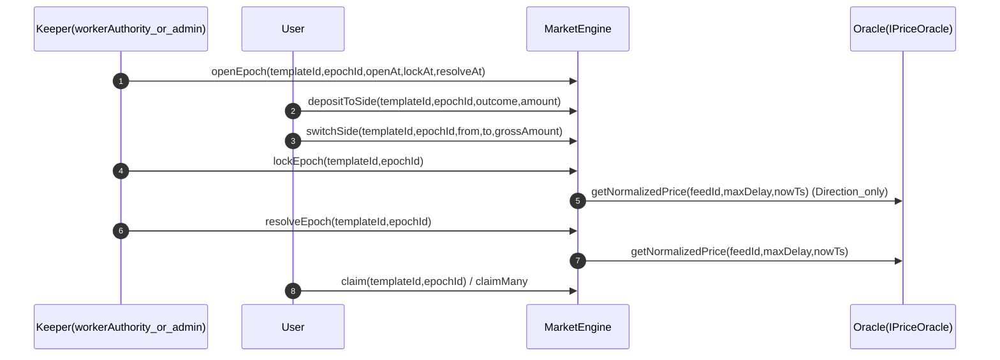
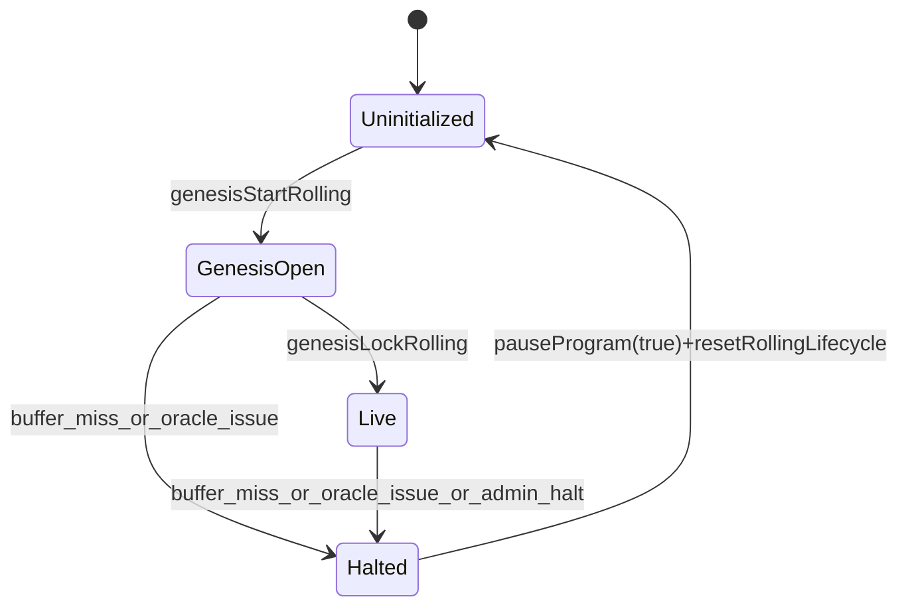
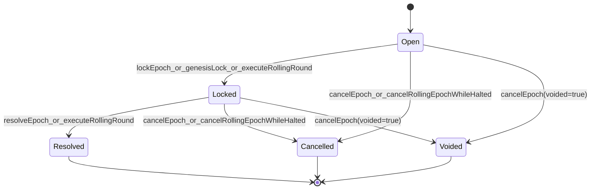
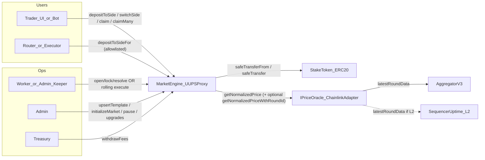

# RetroPick `MarketEngine` (rolling rounds prediction markets) — technical reference

This is the deep, code-accurate documentation for the current Solidity implementation under [`src/MarketEngine.sol`](../src/MarketEngine.sol). It focuses on: storage model, epoch/round lifecycle, rolling execution, oracle checkpoints, keeper behavior, deployment topology, and measured gas from [`.gas-snapshot`](../.gas-snapshot).

## Glossary

- **Template**: A market definition keyed by `templateId`.
- **Epoch**: One full market cycle (open → lock → resolve → claim). In product language this is often called a “round.”
- **Ledger**: Per-template cursor + reserve accounting + rolling lifecycle state.
- **Checkpoint A**: Oracle sample at **lock** for Direction markets (open price).
- **Checkpoint B**: Oracle sample at **resolve** for all markets (close / settlement price).
- **Manual**: Keeper runs discrete `openEpoch` / `lockEpoch` / `resolveEpoch`.
- **Rolling**: Pancake-style pipeline: one keeper call advances resolve + lock + open per interval.

## 1) What is deployed

### 1.1 One engine, many markets

RetroPick deploys **one** upgradeable `MarketEngine` (behind a UUPS proxy). This single contract stores all templates, ledgers, epochs, and user positions.

The engine computes:

- `templateId = keccak256(bytes(slug))`
- `positionKey = keccak256(abi.encodePacked(templateId, epochId))`

```1259:1265:/home/asyam/dev/Project/RetroPick/V1/contracts/retropick_engine_solidity/src/MarketEngine.sol
function templateIdFromSlug(string memory slug) public pure returns (bytes32) {
    return keccak256(bytes(slug));
}

function positionKey(bytes32 templateId, uint64 epochId) public pure returns (bytes32) {
    return keccak256(abi.encodePacked(templateId, epochId));
}
```

### 1.2 Oracle adapter

[`ChainlinkAdapter`](../src/adapters/ChainlinkAdapter.sol) implements [`IPriceOracle`](../src/interfaces/IPriceOracle.sol) over Chainlink [`AggregatorV3Interface`](../lib/chainlink-brownie-contracts/contracts/src/v0.8/shared/interfaces/AggregatorV3Interface.sol). It:

- Decodes `feedId` as a Chainlink **proxy address**: `address(uint160(uint256(feedId)))`.
- Reads `latestRoundData()`, enforces round completeness, positive `answer`, and staleness against `maxAgeSeconds` using `updatedAt`.
- Normalizes `answer` with `decimals()` to **e8** (same scale as the rest of the engine).
- Returns `confidenceE8 = 0` (no Chainlink confidence band).
- On **L2**, checks the Chainlink **sequencer uptime feed** passed in the adapter constructor; on **L1** pass `sequencerFeed = address(0)` to skip. Grace-period behavior follows [Chainlink L2 sequencer feeds](https://docs.chain.link/data-feeds/l2-sequencer-feeds) (`timeSinceUp <= 3600` reverts until strictly after the grace window).
- **Optional round ID surface**: the adapter also implements [`IPriceOracleWithRoundId`](../src/interfaces/IPriceOracleWithRoundId.sol) with `getNormalizedPriceWithRoundId(...)`, returning the Chainlink `roundId` from `latestRoundData()` alongside the normalized price. The engine uses this (when the cast succeeds) for **strictly increasing** `roundId` checks per template and for `EpochLockedV2` / `EpochResolvedV2` events. If the oracle does not implement the extension, the engine falls back to `getNormalizedPrice` only (no round-id enforcement or V2 round id in events for that read path).

```32:60:/home/asyam/dev/Project/RetroPick/V1/contracts/retropick_engine_solidity/src/adapters/ChainlinkAdapter.sol
    function getNormalizedPrice(bytes32 feedId, uint64 maxAgeSeconds, uint64)
        external
        view
        override
        returns (int256 priceE8, uint64 publishTime, uint256 confidenceE8)
    {
        _checkSequencer();

        address feedAddr = address(uint160(uint256(feedId)));
        if (feedAddr == address(0)) revert InvalidFeedAddress();

        AggregatorV3Interface feed = AggregatorV3Interface(feedAddr);

        (uint80 roundId, int256 answer,, uint256 updatedAt, uint80 answeredInRound) = feed.latestRoundData();

        if (answeredInRound < roundId) revert RoundNotComplete(roundId, answeredInRound);
        if (answer <= 0) revert InvalidPrice();
        if (updatedAt == 0) revert InvalidPrice();

        if (block.timestamp - updatedAt > uint256(maxAgeSeconds)) {
            revert StalePriceFeed(updatedAt, uint256(maxAgeSeconds), block.timestamp);
        }

        uint8 d = feed.decimals();
        priceE8 = _normalizeToE8(answer, d);
        publishTime = uint64(updatedAt);
        confidenceE8 = 0;
    }
```

### 1.3 Deployment topology (UUPS proxy)

Deployment script:

- [`script/Deploy.s.sol`](../script/Deploy.s.sol) deploys `ChainlinkAdapter(SEQUENCER_FEED)` and then deploys a **UUPS proxy** for `MarketEngine` with `initialize(...)` calldata (`OracleKind.Chainlink`). Use `SEQUENCER_FEED = address(0)` on L1.

```20:61:/home/asyam/dev/Project/RetroPick/V1/contracts/retropick_engine_solidity/script/Deploy.s.sol
contract Deploy is Script {
    function run() external {
        uint256 pk = vm.envUint("PRIVATE_KEY");
        vm.startBroadcast(pk);

        address stakeToken = vm.envAddress("STAKE_TOKEN");
        address sequencerFeed = vm.envAddress("SEQUENCER_FEED");
        address admin = vm.envAddress("ADMIN");
        address treasury = vm.envAddress("TREASURY");
        address worker = vm.envAddress("WORKER");
        // ... fee + oracle config from env ...

        ChainlinkAdapter adapter = new ChainlinkAdapter(sequencerFeed);

        bytes memory initData = abi.encodeCall(
            MarketEngine.initialize,
            (
                IERC20(stakeToken),
                IPriceOracle(address(adapter)),
                admin,
                treasury,
                worker,
                defFee,
                maxSw,
                maxOut,
                MarketTypes.OracleKind.Chainlink,
                delay,
                conf
            )
        );

        Options memory opts;
        address proxy = Upgrades.deployUUPSProxy("MarketEngine.sol:MarketEngine", initData, opts);

        console2.log("ChainlinkAdapter", address(adapter));
        console2.log("MarketEngine proxy", proxy);
        console2.log("MarketEngine implementation", Upgrades.getImplementationAddress(proxy));

        vm.stopBroadcast();
    }
}
```

## 2) Roles and pause model

The engine has three operational roles:

- **`admin`**: governance / multisig. Can upsert templates, initialize markets, pause/unpause, set treasury/worker, and authorize upgrades.
- **`workerAuthority`**: keeper/operator. Can open/lock/resolve/cancel (manual) or run rolling keepers (rolling) when not paused.
- **`treasury`**: fee receiver. Can withdraw accrued fees.

User-facing operations (`depositToSide`, `depositToSideFor`, `switchSide`, `claim`, `claimMany`) are separate from worker ops (`openEpoch`/`lockEpoch`/`resolveEpoch`/rolling keepers) and are gated by `globalPaused` via modifiers in the engine.

## 3) Storage model (Template / Ledger / Epoch / Position)

The engine’s core structs are in [`src/types/MarketTypes.sol`](../src/types/MarketTypes.sol).

### 3.1 Template

Important template fields:

- `marketType`: one of `Direction`, `Threshold`, `RangeClose`
- `oracleFeedId`: Chainlink feed **proxy address** encoded as `bytes32(uint256(uint160(proxy)))` (must be non-zero when decoded)
- `switchFeeBps`, `settlementFeeBps`
- `executionMode`: `Manual` or `Rolling`
- rolling parameters (only if rolling): `rollingIntervalSeconds`, `rollingBufferSeconds`
- oracle overrides: `oracleMaxDelaySeconds`, `oracleMaxConfidenceBps` (0 means “inherit global config” at effective-time via helper functions)

### 3.2 Ledger

Important ledger fields:

- `activeEpochId`: “current” epoch for deposits/switches
- `lastResolvedEpochId`: last epoch id that has completed (resolved/cancelled/voided)
- rolling state: `rollingPhase`, `rollingHaltReason`, `rollingNextEpochId`, `haltedAtEpochId`
- reserve totals tracked by `MarketMath` (active collateral vs claims/fees reserves)

Rolling lifecycle enums:

```52:76:/home/asyam/dev/Project/RetroPick/V1/contracts/retropick_engine_solidity/src/types/MarketTypes.sol
enum RollingPhase {
    Uninitialized,
    GenesisOpen,
    Live,
    Halted
}

enum RollingHaltReason {
    NoneReason,
    BufferMissOnLock,
    BufferMissOnResolve,
    OracleFailure,
    OracleConfidenceWide,
    ManualAdmin
}
```

### 3.3 Epoch

Each `(templateId, epochId)` stores one `MarketTypes.Epoch` struct with:

- timings: `openAt`, `lockAt`, `resolveAt`
- status: `Open` → `Locked` → `Resolved` (or `Cancelled` / `Voided`)
- oracle checkpoints: `checkpointA` and `checkpointB`
- pools: `outcomePools[]`, `totalPool`
- settlement outputs: `winningOutcomeMask`, `claimLiabilityTotal`, `settlementFeeTotal`, `refundMode`, `claimable`

Status enum:

```28:37:/home/asyam/dev/Project/RetroPick/V1/contracts/retropick_engine_solidity/src/types/MarketTypes.sol
enum EpochStatus {
    Scheduled,
    Open,
    Locked,
    Resolved,
    Cancelled,
    Voided
}
```

### 3.4 Position

Positions are stored as:

- `positions[positionKey(templateId, epochId)][user]`

Each position holds per-outcome stakes (`stakes[8]`) and `totalStake`, plus fees paid, claimed amount, and claimed flag.

### 3.5 User participation index and oracle round tracking (engine-only)

Beyond `MarketTypes` structs, the engine keeps:

- **`userEpochs`**: `mapping(bytes32 templateId => mapping(address user => uint64[] epochIds))` — Pancake-style **on-chain** list of epoch ids in which a user has ever opened a position (first successful `_depositToSide` that initializes their position for that epoch). Subsequent deposits in the same epoch do **not** append a duplicate id. The beneficiary of `depositToSideFor` is indexed, not `msg.sender`.
- **`lastOracleRoundIdByTemplate`**: `mapping(bytes32 templateId => uint80 lastOracleRoundId)` — when using [`IPriceOracleWithRoundId`](../src/interfaces/IPriceOracleWithRoundId.sol), each new oracle sample must use a **strictly larger** `roundId` than the last recorded for that template (revert: `OracleRoundIdNotMonotonic`). Round ids are **not** stored inside `OracleCheckpoint` (keeps struct layout stable for upgrades); observability is via events `EpochLockedV2` / `EpochResolvedV2`.
- **UUPS storage gap**: `uint256[48] __gap` (reduced from 50 when the two mappings above were added—append-only discipline for upgrades still applies).

View helper for UIs/indexers without an off-chain indexer:

- `getUserEpochs(templateId, user, cursor, size)` returns a slice of `epochIds` and `nextCursor` for pagination.

Event emitted once per `(templateId, epochId, user)` when the user is first indexed: `UserEpochIndexed`.

## 4) Market types and settlement semantics

All market types settle using **checkpoint B** at resolve time. Only Direction also uses **checkpoint A** at lock time.

The rule “Direction requires checkpoint A on lock” is explicit:

```204:212:/home/asyam/dev/Project/RetroPick/V1/contracts/retropick_engine_solidity/src/types/MarketTypes.sol
function requiresCheckpointAOnLock(Epoch storage e) internal view returns (bool) {
    return e.marketType == MarketType.Direction;
}
```

### 4.1 Direction (binary up/down vs checkpoint A)

- On lock: sample oracle and write checkpoint A (`valueE8`, `confidenceE8`, `publishTime`).
- On resolve: sample oracle and write checkpoint B.
- Winner: compare `b.valueE8` to `a.valueE8`:
  - `b > a` → outcome index 0 wins
  - `b < a` → outcome index 1 wins
  - `b == a` → if `equalPriceVoids` then refund-mode; else outcome 1 wins

Resolver:

```8:23:/home/asyam/dev/Project/RetroPick/V1/contracts/retropick_engine_solidity/src/logic/Resolvers.sol
function resolveDirection(
    MarketTypes.OracleCheckpoint memory a,
    MarketTypes.OracleCheckpoint memory b,
    bool voidOnEqual
) internal pure returns (bool voided, uint256 mask) {
    if (!a.written || !b.written) revert InvalidEpochState();
    if (b.valueE8 > a.valueE8) return (false, uint256(1) << 0);
    if (b.valueE8 < a.valueE8) return (false, uint256(1) << 1);
    if (voidOnEqual) return (true, 0);
    return (false, uint256(1) << 1);
}
```

### 4.2 Threshold (binary yes/no vs fixed line at resolve)

- No oracle checkpoint at lock.
- Resolve compares checkpoint B to `absoluteThresholdValueE8` with `condition` (AtOrAbove / Below).

```23:35:/home/asyam/dev/Project/RetroPick/V1/contracts/retropick_engine_solidity/src/logic/Resolvers.sol
function resolveThreshold(
    MarketTypes.Condition condition,
    int256 thresholdValueE8,
    MarketTypes.OracleCheckpoint memory b
) internal pure returns (uint256 mask) {
    if (!b.written) revert InvalidEpochState();
    bool yes =
        condition == MarketTypes.Condition.AtOrAbove ? b.valueE8 >= thresholdValueE8 : b.valueE8 < thresholdValueE8;
    return yes ? (uint256(1) << 0) : (uint256(1) << 1);
}
```

### 4.3 RangeClose (N-outcome bucketed close at resolve)

- No oracle checkpoint at lock.
- Resolve writes checkpoint B and selects a bucket index by comparing `b.valueE8` with `rangeBoundsE8[]`.

## 5) Manual mode: epoch lifecycle (keeper and users)

Manual mode is the classic discrete 3-tx epoch lifecycle per template:

1. **`openEpoch`**: create epoch `epochId` with schedule; sets `ledger.activeEpochId = epochId`.
2. **User ops**: `depositToSide`, `switchSide` during `[openAt, lockAt)`.
3. **`lockEpoch`**: after `lockAt`. If Direction, writes checkpoint A; otherwise locks without oracle.
4. **`resolveEpoch`**: after `resolveAt`. Writes checkpoint B; computes `winningOutcomeMask`, reserves claims/fees, sets `claimable`.
5. **`claim` / `claimMany`**: users pull payouts or refunds (batch claim uses one token transfer).

Manual sequencing is strict: the engine enforces `epochId == activeEpochId + 1` and cannot open the next epoch until the previous has completed.

```1324:1327:/home/asyam/dev/Project/RetroPick/V1/contracts/retropick_engine_solidity/src/MarketEngine.sol
function _requireCanOpenNextEpoch(MarketTypes.Ledger storage ledger, uint64 epochId) internal view {
    if (ledger.activeEpochId != ledger.lastResolvedEpochId) revert PreviousEpochUnresolved();
    if (epochId != ledger.activeEpochId + 1) revert EpochAlreadyExists();
}
```

### 5.1 Manual flow: sequence diagram



## 6) Rolling mode: pipeline design (keeper cost reduction)

Rolling mode is a keeper-efficiency mode supported **only for Direction** templates. The key idea is that steady-state progression is **one keeper transaction per interval**, rather than three.

Rolling invariants in steady state (`k = activeEpochId`):

- epoch `k` is **Open** (accepting bets)
- epoch `k-1` is **Locked**
- epoch `k-2` is **Resolved**

### 6.1 Rolling lifecycle phases (ledger)

The ledger tracks the rolling lifecycle:

- `Uninitialized`: no rolling epochs yet
- `GenesisOpen`: genesis epoch opened; must be locked to become live
- `Live`: steady-state pipeline; keepers call `executeRollingRound`
- `Halted`: pipeline stopped due to missed buffer or oracle conditions (or admin halt)

Rolling state machine:



### 6.2 Genesis bootstrap

Rolling cannot start directly in steady-state; it needs genesis to create the initial overlap.

1. `genesisStartRolling(templateId)`
   - opens epoch `rollingNextEpochId` (starts at 1)
   - sets `openAt = now`, `lockAt = now + interval`, `resolveAt = now + 2*interval`
   - sets `rollingPhase = GenesisOpen`

2. `genesisLockRolling(templateId)` (must be within the lock window + buffer)
   - locks epoch `k = activeEpochId` and writes checkpoint A
   - opens the next epoch
   - sets `rollingPhase = Live`
   - if oracle fails / confidence too wide / buffer missed: sets `Halted` and **returns** (no revert)

### 6.3 Steady-state tick (`executeRollingRound`)

One tick does:

- resolve epoch `prev = k-1` (writes checkpoint B)
- lock epoch `k` (writes checkpoint A)
- open epoch `k+1`

Critically, rolling uses **one normalized oracle sample** and applies it to both:

- checkpoint B on `prev` (resolve), and
- checkpoint A on `k` (lock).

Core gating and halt behavior (single oracle read via `_tryReadOracle`, then resolve + lock + open):

```400:450:/home/asyam/dev/Project/RetroPick/V1/contracts/retropick_engine_solidity/src/MarketEngine.sol
function _executeRollingRoundCore(bytes32 templateId) internal {
    // ... phase/buffer guards ...
    (bool ok, int256 priceE8, uint64 publishTime, uint256 confidenceE8, uint80 oracleRoundId) =
        _tryReadOracle(templateId, t.oracleFeedId, maxDelay, nowTs);
    if (!ok) {
        _haltRolling(templateId, ledger, MarketTypes.RollingHaltReason.OracleFailure, k);
        return;
    }
    if (!_confidenceWithinBand(priceE8, confidenceE8, maxConf)) {
        _haltRolling(templateId, ledger, MarketTypes.RollingHaltReason.OracleConfidenceWide, k);
        return;
    }

    _finishResolveEpochRolling(templateId, prev, priceE8, publishTime, confidenceE8, oracleRoundId, maxDelay);
    _applyLock(templateId, k, priceE8, publishTime, confidenceE8, oracleRoundId, maxDelay, maxConf, nowTs);
    uint64 newOpen = _openRollingEpoch(templateId, nowTs, t);

    emit RollingRoundExecuted(templateId, prev, k, newOpen);
}
```

### 6.4 User operations under rolling

User ops (`depositToSide`, `switchSide`) are allowed only when:

- the epoch is the current active epoch, and
- the epoch is open, and
- the template is not halted (rolling templates block deposits/switches while halted).

```766:810:/home/asyam/dev/Project/RetroPick/V1/contracts/retropick_engine_solidity/src/MarketEngine.sol
if (t.executionMode == MarketTypes.ExecutionMode.Rolling && ledger.rollingPhase == MarketTypes.RollingPhase.Halted)
{
    revert RollingHaltedUserOps();
}
_requireActiveEpoch(ledger, epochId);
if (!e.isEpochOpen(nowTs)) revert BettingClosed();
// On first position init for (templateId, beneficiary, epochId): userEpochs[templateId][beneficiary].push(epochId); emit UserEpochIndexed(...)
```

Claims remain available for any epoch that is `claimable` (resolved/cancelled/voided), even if rolling is halted.

## 7) Epoch status transitions (state machine)

This diagram is the conceptual on-chain lifecycle (note: `Scheduled` exists in the enum, but the engine’s current open path writes `Open` directly).



## 8) Settlement, reserves, and payouts

At resolve:

- checkpoint B is written (and checkpoint A must already exist for Direction).
- `Resolvers` computes the winning mask (or voids in equal-price Direction if configured).
- `MarketMath.computeEpochClaimLiabilityStorage(...)` computes:
  - `claimLiabilityTotal` moved from active → claims reserve
  - `settlementFeeTotal` moved from active → fees reserve
- The epoch becomes `claimable`.

At claim:

- **`claim(templateId, epochId)`** — single-epoch claim: computes payout via internal `_claimOne`, transfers tokens once, then emits `Claimed`.
- **`claimMany(templateId, epochIds[])`** — batch UX: loops `_claimOne` for each epoch id, emits **`Claimed` per epoch** with that epoch’s amount, then performs **one** `safeTransfer` of the **sum** of all successful claims. Reverts with `NothingToClaim()` if the sum is zero (e.g. empty array or every epoch reverted internally—each `_claimOne` still enforces per-epoch rules).
- if `refundMode`, user gets back `pos.totalStake` (subject to engine’s refund math).
- otherwise user gets a pro-rata payout from the epoch’s claim liability based on their stake in winning outcomes.

**Last-claimer “dust” sweep (per epoch, not global):** when the last winner in an epoch claims, `MarketMath.computeClaimPayoutStorage` pays out the **remaining unclaimed tokens reserved for that epoch** (`claimLiabilityTotal - claimedTotal` passed in as `remainingClaimsForEpoch`), not the full ledger `claimsReserveTotal`. That keeps accounting correct when multiple epochs are claimable (including after `claimMany`), and prevents sweeping reserves belonging to other epochs.

Claim and fee withdrawal (core paths):

```1193:1243:/home/asyam/dev/Project/RetroPick/V1/contracts/retropick_engine_solidity/src/MarketEngine.sol
function claim(bytes32 templateId, uint64 epochId) external nonReentrant {
    uint256 amount = _claimOne(templateId, epochId, msg.sender);
    stakeToken.safeTransfer(msg.sender, amount);
    emit Claimed(templateId, epochId, msg.sender, amount);
}

function claimMany(bytes32 templateId, uint64[] calldata epochIds) external nonReentrant {
    uint256 total = 0;
    for (uint256 i = 0; i < epochIds.length; i++) {
        uint256 amt = _claimOne(templateId, epochIds[i], msg.sender);
        total += amt;
        emit Claimed(templateId, epochIds[i], msg.sender, amt);
    }
    if (total == 0) revert NothingToClaim();
    stakeToken.safeTransfer(msg.sender, total);
}

function _claimOne(bytes32 templateId, uint64 epochId, address user) internal returns (uint256 amount) {
    // ... ledger/epoch/position guards ...
    uint256 winningStake;
    if (e.refundMode) {
        amount = MarketMath.computeRefundTotal(pos.totalStake);
        winningStake = 0;
    } else {
        uint256[8] memory stakes = pos.stakes;
        uint256 remainingClaims = e.claimLiabilityTotal - e.claimedTotal;
        (amount, winningStake) = MarketMath.computeClaimPayoutStorage(e, stakes, remainingClaims);
    }
    if (amount == 0) revert NothingToClaim();
    // ... set pos.claimed, e.claimedTotal, remainingWinningStake, releaseClaimOnWithdraw, vaults.claims ...
}
```

`MarketMath.computeClaimPayoutStorage` signature (third argument is **remaining** claim pool for that epoch):

```127:151:/home/asyam/dev/Project/RetroPick/V1/contracts/retropick_engine_solidity/src/math/MarketMath.sol
function computeClaimPayoutStorage(
    MarketTypes.Epoch storage epoch,
    uint256[8] memory stakes,
    uint256 remainingClaimsForEpoch
) internal view returns (uint256 payout, uint256 userWinningStake_) {
    // ...
    if (epoch.remainingWinningStake == userWinningStake_) {
        payout = remainingClaimsForEpoch;
    } else {
        payout = entitlement;
    }
}
```

```1245:1257:/home/asyam/dev/Project/RetroPick/V1/contracts/retropick_engine_solidity/src/MarketEngine.sol
function withdrawFees(bytes32 templateId, uint256 amount) external onlyTreasuryOrAdmin nonReentrant {
    if (!configInitialized) revert Unauthorized();
    if (amount == 0) revert NothingToClaim();
    MarketTypes.Ledger storage ledger = ledgers[templateId];
    if (!ledger.initialized) revert InvalidTemplate();
    if (ledger.feeReserveTotal < amount) revert NothingToClaim();

    stakeToken.safeTransfer(treasury, amount);
    MarketMath.releaseFeeOnWithdraw(ledger, amount);
    vaults[templateId].fees -= amount;

    emit FeesWithdrawn(templateId, amount);
}
```

## 9) Oracle correctness and operational constraints

### 9.1 Staleness window (maxDelaySeconds)

The oracle adapter reads `getPriceNoOlderThan(feedId, maxAgeSeconds)`. The engine computes the effective staleness window from:

- epoch snapshot override (`epoch.oracleMaxDelaySeconds`) if non-zero, else
- global `oracleConfig.maxDelaySeconds`.

Helper:

```240:248:/home/asyam/dev/Project/RetroPick/V1/contracts/retropick_engine_solidity/src/types/MarketTypes.sol
function effectiveOracleMaxDelaySeconds(Epoch storage e, uint64 globalDelaySeconds) internal view returns (uint64) {
    if (e.oracleMaxDelaySeconds > 0) return e.oracleMaxDelaySeconds;
    return globalDelaySeconds;
}
```

### 9.2 Confidence filter (maxConfidenceBps)

The engine rejects oracle samples whose confidence is too wide relative to price:

\[
confidenceE8 \le |priceE8| \times \frac{maxConfidenceBps}{10_000}
\]

Absolute value of `priceE8` uses **inline assembly** so that `type(int256).min` does not trigger Solidity’s checked negation overflow; that case is then rejected explicitly (`InvalidOraclePrice`).

```1302:1322:/home/asyam/dev/Project/RetroPick/V1/contracts/retropick_engine_solidity/src/MarketEngine.sol
function _confidenceWithinBand(int256 priceE8, uint256 confidenceE8, uint16 maxConfidenceBps)
    internal
    pure
    returns (bool)
{
    uint256 abs;
    assembly {
        abs := priceE8
        if slt(priceE8, 0) { abs := sub(0, priceE8) }
    }
    if (abs == (1 << 255)) revert InvalidOraclePrice();
    uint256 limit = (abs * uint256(maxConfidenceBps)) / 10_000;
    return confidenceE8 <= limit;
}

function _enforceConfidence(int256 priceE8, uint256 confidenceE8, uint16 maxConfidenceBps) internal pure {
    if (!_confidenceWithinBand(priceE8, confidenceE8, maxConfidenceBps)) revert OracleConfidenceTooWide();
}
```

In rolling mode, oracle failure or confidence-wide conditions cause the engine to **halt** the rolling lifecycle instead of reverting the entire outer keeper call.

### 9.3 Publish time semantics (push oracles)

For Chainlink, the oracle adapter returns `publishTime = updatedAt` from `latestRoundData()`. This timestamp can be **earlier** than the on-chain `lockAt` / `resolveAt` while still being a safe settlement input.\n\nThe engine’s acceptance rule is therefore:\n\n- `publishTime != 0`\n- `publishTime <= nowTs` (defensive: no future timestamps)\n- `nowTs - publishTime <= maxDelaySeconds` (freshness window)\n- For checkpoint B: if checkpoint A exists, `publishTime >= checkpointA.publishTime` (monotonicity)\n\nOperational implication: choose `oracleMaxDelaySeconds` based on the feed heartbeat (plus buffer), especially for rolling templates.

### 9.4 Chainlink round ID (optional) and V2 events

When `priceOracle` implements [`IPriceOracleWithRoundId`](../src/interfaces/IPriceOracleWithRoundId.sol) (the deployed [`ChainlinkAdapter`](../src/adapters/ChainlinkAdapter.sol) does), lock and resolve paths call `getNormalizedPriceWithRoundId` and:

- Enforce **strict monotonicity** per `templateId`: each accepted `oracleRoundId` must be **greater than** `lastOracleRoundIdByTemplate[templateId]` (skips enforcement when `roundId == 0` for compatibility). On violation: `OracleRoundIdNotMonotonic(newRoundId, lastRoundId)`.
- Emit augmented events alongside the legacy ones (ABI-stable):
  - `EpochLockedV2(templateId, epochId, checkpointAValueE8, publishTime, oracleRoundId)` when checkpoint A is written.
  - `EpochResolvedV2(templateId, epochId, oracleRoundId, checkpointBValueE8, publishTime)` after checkpoint B is written.

If the optional interface call **reverts** (e.g. mock oracle in tests), the engine **falls back** to `IPriceOracle.getNormalizedPrice` only; round-id state is not updated and V2 events still fire with the round id from the successful path when applicable.

Rolling genesis / `executeRollingRound` use `_tryReadOracle` (no revert on oracle failure—**halt** instead) with the same round-id rules when the extended interface succeeds.

## 10) Rolling halt and recovery

### 10.1 How rolling halts

Rolling keepers halt (set `rollingPhase = Halted`) when:

- resolve buffer missed (`BufferMissOnResolve`)
- lock buffer missed (`BufferMissOnLock`)
- oracle call fails (`OracleFailure`)
- confidence too wide (`OracleConfidenceWide`)
- admin halts (`ManualAdmin`)

```713:723:/home/asyam/dev/Project/RetroPick/V1/contracts/retropick_engine_solidity/src/MarketEngine.sol
function _haltRolling(
    bytes32 templateId,
    MarketTypes.Ledger storage ledger,
    MarketTypes.RollingHaltReason reason,
    uint64 atEpoch
) internal {
    ledger.rollingPhase = MarketTypes.RollingPhase.Halted;
    ledger.rollingHaltReason = reason;
    ledger.haltedAtEpochId = atEpoch;
    emit RollingHalted(templateId, uint8(reason), atEpoch);
}
```

### 10.2 Recovery checklist

Recovery is an explicit admin flow:

1. `pauseProgram(true)` (blocks user ops and worker ops that use the pause modifiers).
2. If needed, `haltRollingMarket(templateId)` to stop a live pipeline proactively.
3. While halted and paused, cancel stuck `Open`/`Locked` epochs with `cancelRollingEpochWhileHalted(...)`.
4. While halted and paused, reset rolling cursors with `resetRollingLifecycle(templateId, nextRollingEpochId)`.
5. `pauseProgram(false)`.
6. Restart with `genesisStartRolling` → `genesisLockRolling` → steady `executeRollingRound`.

## 11) Gas and cost model

### 11.1 Snapshot gas numbers (reference only)

This repository tracks gas in [`.gas-snapshot`](../.gas-snapshot) (mock oracle; local test harness). The snapshot is meant for *relative* comparisons and regression checks, not as a mainnet cost quote.

From the current snapshot:

| Operation | Gas |
|----------|-----:|
| `openEpoch` (cold) | 192308 |
| `lockEpoch` (Direction) | 56547 |
| `lockEpoch` (Threshold) | 10514 |
| `resolveEpoch` (Direction) | 127052 |
| `resolveEpoch` (Threshold) | 128234 |
| `claim` | 42146 |
| `genesisStartRolling` | 198312 |
| `genesisLockRolling` | 224155 |
| `executeRollingRound` (steady) | 376754 |

### 11.2 Manual vs rolling keeper economics (the important part)

For Direction markets at a given cadence:

- **Manual** requires **3 keeper txs per epoch**: `openEpoch` + `lockEpoch` + `resolveEpoch`.
- **Rolling** requires **1 keeper tx per interval** in steady state: `executeRollingRound` (plus 2 genesis txs per rolling session).

Using the snapshot numbers above (execution gas only):

- Manual Direction per epoch \(\approx 192308 + 56547 + 127052 = 375907\) gas.
- Rolling Direction steady per interval \(\approx 376754\) gas (similar execution gas), but **1 tx instead of 3**.

On rollups, the **L1 data fee per transaction** often dominates execution gas at low L2 gas prices. That makes rolling materially cheaper at scale even when execution gas is similar.

### 11.3 What is not included in these gas numbers

- L1 data fees (rollup posting costs).
- Chainlink push feeds do not require a separate “update” tx before `lock`/`resolve`; budget **heartbeat-aligned** `oracleMaxDelaySeconds` instead.
- Congestion spikes and priority fees.

## 12) Deployment cost (how to measure)

There is no single stable “deployment gas cost” committed to this repo because it depends on compiler profile, bytecode size, chain rules, and base fee.

To measure on your target chain/environment:

- Use `forge build --sizes` to see runtime size.
- Use `forge script script/Deploy.s.sol --rpc-url ... --broadcast --slow` on a testnet or a local fork.
- Use `--dry-run` / simulation to get `eth_estimateGas` style totals before broadcasting.

## 13) Limits and scaling notes

- Epoch ids are `uint64`. Manual mode increments sequentially; rolling mode uses `rollingNextEpochId` and can be reset to a higher id after a halt.
- Storage is not pruned. Each epoch retains pools, checkpoints, and accounting fields; each user position remains addressable forever.

## 14) See also

- [`.docs/DEPLOYMENT_AND_EPOCHS.md`](./DEPLOYMENT_AND_EPOCHS.md): operational guide and extended cost discussion (verify details against code when in doubt).
- [`.docs/rolling-rounds.md`](./rolling-rounds.md): higher-level rolling-rounds pattern explanation.
- [`src/types/MarketTypes.sol`](../src/types/MarketTypes.sol): canonical structs/enums used throughout the engine.

# RetroPick Solidity stack — current contracts
# RetroPick Rolling Rounds Prediction Market (MarketEngine) — Technical Reference

This document is the *code-accurate* technical reference for the current Solidity implementation of RetroPick’s rolling-rounds prediction market engine. It is written from the perspective of protocol operators and integrators (keepers, indexers, UIs, and auditors).

## 1) What is deployed (and what is *not*)

RetroPick uses a single on-chain **`MarketEngine`** contract that stores:

- all **templates** (market definitions),
- per-template **ledgers** (cursors, reserves, and rolling lifecycle),
- per-template **epochs** (a.k.a. “rounds”),
- per-user **positions** (stakes per outcome per epoch).

There is **no separate contract deployment per market**. A “market instance” in product terms is one `templateId` with an initialized ledger plus an ongoing sequence of epochs for that template.

Code reference:

```1259:1265:/home/asyam/dev/Project/RetroPick/V1/contracts/retropick_engine_solidity/src/MarketEngine.sol
function templateIdFromSlug(string memory slug) public pure returns (bytes32) {
    return keccak256(bytes(slug));
}

function positionKey(bytes32 templateId, uint64 epochId) public pure returns (bytes32) {
    return keccak256(abi.encodePacked(templateId, epochId));
}
```

```812:829:/home/asyam/dev/Project/RetroPick/V1/contracts/retropick_engine_solidity/src/MarketEngine.sol
function getUserEpochs(bytes32 templateId, address user, uint256 cursor, uint256 size)
    external
    view
    returns (uint64[] memory epochIds, uint256 nextCursor)
{
    uint64[] storage src = userEpochs[templateId][user];
    uint256 n = src.length;
    if (cursor >= n) return (new uint64[](0), cursor);
    uint256 end = cursor + size;
    if (end > n) end = n;
    uint256 outLen = end - cursor;
    epochIds = new uint64[](outLen);
    for (uint256 i = 0; i < outLen; i++) {
        epochIds[i] = src[cursor + i];
    }
    nextCursor = end;
}
```

```1273:1294:/home/asyam/dev/Project/RetroPick/V1/contracts/retropick_engine_solidity/src/MarketEngine.sol
function getRollingLifecycle(bytes32 templateId)
    external
    view
    returns (
        MarketTypes.RollingPhase phase,
        MarketTypes.RollingHaltReason haltReason,
        uint64 haltedAtEpochId,
        uint64 rollingNextEpochId,
        uint64 activeEpochId,
        uint64 lastResolvedEpochId
    )
{
    MarketTypes.Ledger storage ledger = ledgers[templateId];
    return (
        ledger.rollingPhase,
        ledger.rollingHaltReason,
        ledger.haltedAtEpochId,
        ledger.rollingNextEpochId,
        ledger.activeEpochId,
        ledger.lastResolvedEpochId
    );
}
```

## 2) High-level architecture

The engine is upgradeable (UUPS) and is deployed behind a proxy. An oracle adapter (typically [`ChainlinkAdapter`](../src/adapters/ChainlinkAdapter.sol)) implements [`IPriceOracle`](../src/interfaces/IPriceOracle.sol): it reads Chainlink aggregators (and on L2 checks the sequencer uptime feed before returning a price). The engine uses the adapter for all lock/resolve checkpoints.



`ChainlinkAdapter` implements both [`IPriceOracle`](../src/interfaces/IPriceOracle.sol) and [`IPriceOracleWithRoundId`](../src/interfaces/IPriceOracleWithRoundId.sol). Core paths:

```35:66:/home/asyam/dev/Project/RetroPick/V1/contracts/retropick_engine_solidity/src/adapters/ChainlinkAdapter.sol
function getNormalizedPrice(bytes32 feedId, uint64 maxAgeSeconds, uint64)
    external
    view
    override
    returns (int256 priceE8, uint64 publishTime, uint256 confidenceE8)
{
    _checkSequencer();
    // ... latestRoundData, staleness, normalize to e8 ...
}
```

```68:101:/home/asyam/dev/Project/RetroPick/V1/contracts/retropick_engine_solidity/src/adapters/ChainlinkAdapter.sol
function getNormalizedPriceWithRoundId(bytes32 feedId, uint64 maxAgeSeconds, uint64)
    external
    view
    override
    returns (uint80 roundId, int256 priceE8, uint64 publishTime, uint256 confidenceE8)
{
    _checkSequencer();
    // ... latestRoundData returns roundId + answer + updatedAt ...
    priceE8 = _normalizeToE8(answer, d);
    publishTime = uint64(updatedAt);
    confidenceE8 = 0;
}
```

## 3) Core on-chain concepts

### 3.1 Template (`templateId`)

A **template** is the market definition keyed by:

- `templateId = keccak256(bytes(slug))`.

It sets market type, oracle feed, fee parameters, and (optionally) rolling schedule parameters.

Key execution-mode knob:

```52:88:/home/asyam/dev/Project/RetroPick/V1/contracts/retropick_engine_solidity/src/types/MarketTypes.sol
enum ExecutionMode {
    Manual,
    Rolling
}

enum RollingPhase {
    Uninitialized,
    GenesisOpen,
    Live,
    Halted
}

enum RollingHaltReason {
    NoneReason,
    BufferMissOnLock,
    BufferMissOnResolve,
    OracleFailure,
    OracleConfidenceWide,
    ManualAdmin
}
```

Rolling is currently allowed only for `MarketType.Direction` and requires `rollingBufferSeconds < rollingIntervalSeconds` (enforced during `upsertTemplate`).

```258:307:/home/asyam/dev/Project/RetroPick/V1/contracts/retropick_engine_solidity/src/MarketEngine.sol
function upsertTemplate(UpsertTemplateParams calldata p) external onlyAdmin {
    // ... slug/symbol/fee/outcome/oracleFeedId validation ...
    bytes32 tid = templateIdFromSlug(p.slug);
    MarketTypes.Template storage t = templates[tid];
    // ... write template fields ...

    if (p.executionMode == MarketTypes.ExecutionMode.Rolling) {
        if (p.marketType != MarketTypes.MarketType.Direction) revert RollingNotDirection();
        if (p.rollingIntervalSeconds == 0) revert RollingInvalidParams();
        if (!(p.rollingBufferSeconds < p.rollingIntervalSeconds)) revert RollingInvalidParams();
    }

    _validateTemplate(t);
    emit TemplateUpserted(
        tid, p.slug, uint8(uint256(p.marketType)), p.outcomeCount, p.oracleMaxDelaySeconds, p.oracleMaxConfidenceBps
    );
}
```

### 3.2 Ledger (per-template cursor + reserves)

Each template has a **ledger** with:

- `activeEpochId`: the current epoch id considered active for deposits/switches.
- `lastResolvedEpochId`: the highest epoch id that was resolved/cancelled/voided.
- Rolling-only cursors: `rollingNextEpochId`, `rollingPhase`, `rollingHaltReason`, `haltedAtEpochId`.
- Reserve accounting (active collateral vs claims/fees).

Initialization sets epoch cursors and rolling lifecycle:

```309:330:/home/asyam/dev/Project/RetroPick/V1/contracts/retropick_engine_solidity/src/MarketEngine.sol
function initializeMarket(bytes32 templateId) external onlyAdmin {
    MarketTypes.Template storage t = templates[templateId];
    if (t.version == 0) revert InvalidTemplate();
    MarketTypes.Ledger storage ledger = ledgers[templateId];
    if (ledger.initialized) revert EpochAlreadyExists();

    ledger.version = MarketTypes.VERSION;
    ledger.initialized = true;
    ledger.activeEpochId = 0;
    ledger.lastResolvedEpochId = 0;
    ledger.rollingPhase = MarketTypes.RollingPhase.Uninitialized;
    ledger.rollingHaltReason = MarketTypes.RollingHaltReason.NoneReason;
    ledger.rollingNextEpochId = 1;
    ledger.haltedAtEpochId = 0;

    emit MarketInitialized(templateId);
}
```

### 3.3 Epoch (round)

Solidity **0.8.24**, EVM **Cancun** (transient storage for `ReentrancyGuardTransient` on the engine implementation). This file is the high-level inventory; operational deployment and epochs are in [DEPLOYMENT_AND_EPOCHS.md](./DEPLOYMENT_AND_EPOCHS.md).

## Core contracts

| Artifact | Role |
|----------|------|
| [`MarketEngine`](../src/MarketEngine.sol) | **Implementation**: all templates, ledgers, vaults, epochs, positions. **UUPS**-ready (`UUPSUpgradeable`), `initialize` once behind a proxy, `_authorizeUpgrade` **only** [`admin`](../src/MarketEngine.sol). |
| ERC1967 **proxy** (from OpenZeppelin Foundry Upgrades) | **User-facing address**: all reads/writes go through the proxy. Deployed by [`script/Deploy.s.sol`](../script/Deploy.s.sol) via `Upgrades.deployUUPSProxy`. |
| [`ChainlinkAdapter`](../src/adapters/ChainlinkAdapter.sol) | `IPriceOracle` + optional [`IPriceOracleWithRoundId`](../src/interfaces/IPriceOracleWithRoundId.sol) over Chainlink `AggregatorV3Interface` + optional L2 sequencer feed; **not** upgradeable (immutable addresses). |
| [`IPriceOracleWithRoundId`](../src/interfaces/IPriceOracleWithRoundId.sol) | Optional extension: exposes Chainlink `roundId` for engine monotonicity + `EpochLockedV2` / `EpochResolvedV2` events. |

## Libraries (linked / internal)

- [`MarketTypes`](../src/types/MarketTypes.sol) — structs, enums, epoch helpers.
- [`MarketMath`](../src/math/MarketMath.sol) — fees, claims, vault moves.
- [`Resolvers`](../src/logic/Resolvers.sol) — outcome resolution from checkpoints.

## OpenZeppelin bases (implementation)

- `Initializable`, `ReentrancyGuardTransient`, `UUPSUpgradeable` (see imports in [`MarketEngine.sol`](../src/MarketEngine.sol)).
- Storage **gap**: `uint256[48] __gap` at end of engine storage for safe upgrades (two new mappings were added before the gap).

## Roles

| Role | Typical holder | Powers (summary) |
|------|------------------|------------------|
| Deploy script wallet | EOA / bot | Deploys adapter + implementation + proxy; **does not** retain special rights after `initialize`. |
| `admin` | Multisig | Templates, pause, worker/treasury config, **UUPS upgrades**, `setDepositExecutor`. |
| `workerAuthority` | Ops / keeper | Open / lock / resolve / cancel (subject to pause). |
| `treasury` | Treasury | Fee withdrawal (with rules in contract). |
| Deposit executors | Routers (optional) | `depositToSideFor` only when allowlisted by `admin`. |

## Upgrade policy

- **Pattern**: **UUPS** — upgrades execute on the **implementation**; **`admin`** authorizes via `_authorizeUpgrade`.
- **Scripts**: deploy with [`Deploy.s.sol`](../script/Deploy.s.sol); upgrade with [`UpgradeMarketEngine.s.sol`](../script/UpgradeMarketEngine.s.sol) (OpenZeppelin Foundry Upgrades — use `--ffi` for validation).
- **Storage**: append-only new variables after existing layout; preserve `__gap` discipline; run OZ storage checks before mainnet upgrades.

## External dependencies

- **OpenZeppelin Contracts** (via `openzeppelin-contracts-upgradeable` nested contracts remapping in [`foundry.toml`](../foundry.toml)).
- **Chainlink** [`AggregatorV3Interface`](../lib/chainlink-brownie-contracts/contracts/src/v0.8/shared/interfaces/AggregatorV3Interface.sol) (vendored under `lib/chainlink-brownie-contracts`).

## Test-only

Mocks under [`test/mocks/`](../test/mocks/) (`MockERC20`, `MockPriceOracle`, `MockPriceOracleWithRoundId`, `MockAggregatorV3`, `MockSequencerFeed`). [`ChainlinkAdapter.t.sol`](../test/ChainlinkAdapter.t.sol) exercises the Chainlink adapter. [`MarketEngineUXIntegrations.t.sol`](../test/MarketEngineUXIntegrations.t.sol) covers `claimMany`, `getUserEpochs`, and round-id monotonicity. Tests deploy **`UnsafeUpgrades.deployUUPSProxy`** in [`MarketEngineBase.t.sol`](../test/MarketEngineBase.t.sol). For external tooling (e.g. Mythril) that needs Foundry remappings in standard JSON, see [`mythril-solc.json`](../mythril-solc.json).

## See also

- [DEPLOYMENT_AND_EPOCHS.md](./DEPLOYMENT_AND_EPOCHS.md) — env vars, keeper flows, gas tables, EIP-170 notes.
- [AUDIT_SOLIDITY.md](./AUDIT_SOLIDITY.md) — threat model and review checklist.
