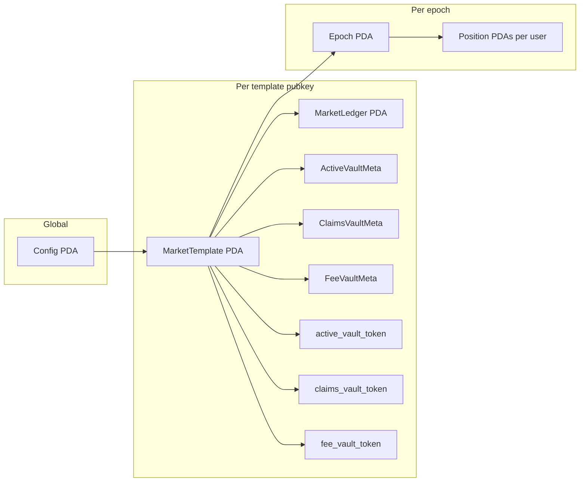
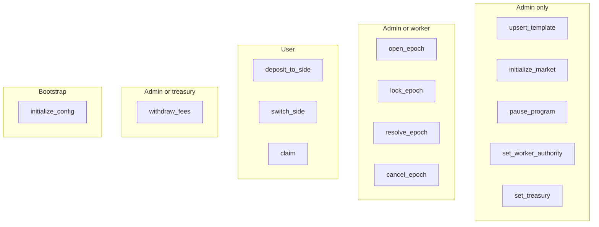

# Market Engine — On-chain program reference

**Index:** [docs/current/README.md](./README.md) lists all current docs and reading order.

This document describes the **market_engine** Anchor program: accounts, PDAs, instructions, roles, and events. For lifecycle timing, token movements, economics, and resolver semantics, see [flow.md](./flow.md).

---

## 1. Abstract

**Market Engine** is a Solana program that runs **pooled prediction-style markets** over a single **stake SPL token** (configurable mint). Each **market** is keyed by a **template** (oracle feed, market type, fees, outcome layout). Within a template, **epochs** advance sequentially: users **deposit** stake into outcome pools while the epoch is **Open**, may **switch** between outcomes subject to fees and single-side rules, then an operator **locks** and **resolves** the epoch using **Pyth** price updates. Winners **claim** a pro-rata share of the pool (after settlement fee); **void** or **cancel** paths refund stake via the claims vault.

Integrators must build client transactions against these instructions; this repository does not ship a dedicated client program.

---

## 2. Program identity

| Field | Value |
|--------|--------|
| **Program ID** | `DYx5zh2gM1QuSviJF4WvdcsiGNb4JSxyp2ZhbnqnUuwR` ([`programs/market_engine/src/lib.rs`](../../programs/market_engine/src/lib.rs)) |
| **Anchor** | 0.31.1 ([`Anchor.toml`](../../Anchor.toml)) |
| **Key dependencies** | `anchor-lang` 0.31.1, `anchor-spl` 0.31.1 (token interface), `pyth-solana-receiver-sdk` **=1.0.1** (pinned in [`Cargo.toml`](../../programs/market_engine/Cargo.toml); `PriceUpdateV2`) |

---

## 3. Roles and global config

The singleton **`Config`** account ([`state/config.rs`](../../programs/market_engine/src/state/config.rs)) defines:

| Field | Meaning |
|--------|---------|
| `admin` | Full admin signer; required for template upsert, market init, pause, treasury/worker updates. |
| `treasury` | Receives fee withdrawals; may also sign `withdraw_fees` with `admin`. |
| `worker_authority` | May open/lock/resolve/cancel epochs (with `admin`). |
| `paused` | When `true`, several instructions revert with `ProtocolPaused` (see authority matrix). |
| `stake_mint` | Allowed mint for all vaults and user token accounts in market flows. |
| `default_settlement_fee_bps` | Stored at **`initialize_config`** only. **Not read** by any other instruction—epoch fees come from the **template** at **`open_epoch`**, and template fees are set in **`upsert_template`**. Treat as **metadata** for off-chain defaults or future use. |
| `max_switch_fee_bps` | Caps template `switch_fee_bps` on upsert. |
| `max_outcomes` | Caps template `outcome_count` (on-chain max outcomes: 8). |
| `oracle_config` | `OracleKind` (only **Pyth** accepted in `Config::validate`), `max_delay_seconds`, `max_confidence_bps`. |

`Config::validate` requires non-default `admin`, `treasury`, `worker_authority`, fee bps ≤ 10_000, and `OracleKind::Pyth`.

### 3.1 Unused or reserved on-chain fields

The following exist in account layouts but are **not used** by current instruction logic (or are never transitioned to in code):

| Item | Location | Notes |
|------|-----------|--------|
| `default_settlement_fee_bps` | `Config` | Written only at init; never read when opening epochs or upserting templates. |
| `insurance_reserve_total` | `MarketLedger` | Never updated; reserved for future use. |
| `entry_fees_paid` | `Position` | Initialized to `0` on first deposit; **never incremented** (no entry fee path today). |
| `EpochStatus::Scheduled` | `Epoch.status` | Enum variant exists; **`open_epoch` always sets `Open`**—no instruction sets `Scheduled`. |

### 3.2 Trust model (high level)

- **`admin`** controls templates, global pause, treasury and worker keys, and per-template market initialization.
- **`worker_authority`** (with **admin**) can **`open_epoch`**, **`lock_epoch`**, **`resolve_epoch`**, and **`cancel_epoch`** when not paused (except **`cancel_epoch`** ignores pause—operators can still cancel during pause).
- **Users** trust the **oracle feed id** embedded in the template/epoch and **operator-chosen** `open_at` / `lock_at` / `resolve_at`.
- **`claim`** does **not** check **`config.paused`**—users can withdraw from the claims vault after settlement even if new deposits are frozen (intentional **exit** path).

---

## 4. Account model and PDA catalog

| Account | Seeds | Notes |
|---------|--------|--------|
| **Config** | `[b"config"]` | One per deployment. |
| **MarketTemplate** | `[b"template", slug.as_bytes()]` | Slug length ≤ 32; immutable after first init except fields updated by upsert (slug cannot change once `version != 0`). |
| **MarketLedger** | `[b"ledger", template_pubkey]` | Tracks active epoch, last resolved epoch, collateral accounting. |
| **Epoch** | `[b"epoch", template_pubkey, epoch_id.to_le_bytes()]` | One per `(template, epoch_id)`. |
| **Position** | `[b"position", epoch_pubkey, user_pubkey]` | User stake breakdown per outcome for that epoch. |
| **ActiveVaultMeta** | `[b"active_vault_meta", template_pubkey]` | Stores bump for vault authority. |
| **Active vault authority** (unchecked PDA) | `[b"active_vault", template_pubkey]` | Signs CPIs from active token account. |
| **Active token ATA** | `[b"active_vault_token", template_pubkey]` | Holds live epoch collateral. |
| **ClaimsVaultMeta** | `[b"claims_vault_meta", template_pubkey]` | |
| **Claims vault authority** | `[b"claims_vault", template_pubkey]` | |
| **Claims token ATA** | `[b"claims_vault_token", template_pubkey]` | Holds reserves owed to claimants. |
| **FeeVaultMeta** | `[b"fee_vault_meta", template_pubkey]` | |
| **Fee vault authority** | `[b"fee_vault", template_pubkey]` | |
| **Fee token ATA** | `[b"fee_vault_token", template_pubkey]` | Holds protocol fee balance. |
| **Pyth** | (external) | `PriceUpdateV2` account passed to `lock_epoch` / `resolve_epoch`. |

Vault token accounts are created in [`initialize_market`](../../programs/market_engine/src/instructions/admin/initialize_market.rs) with the stake mint and PDA authorities above.

### 4.1 Account sizes (rent planning)

Program-owned accounts use Anchor’s **8-byte discriminator** plus the account payload. Instructions allocate `space = 8 + T::INIT_SPACE` (or the explicit `Epoch` / `MarketTemplate` constants below).

| Account type | Payload `INIT_SPACE` (bytes) | Typical allocated `space` |
|--------------|------------------------------|----------------------------|
| **Epoch** | `446` (const in [`epoch.rs`](../../programs/market_engine/src/state/epoch.rs)) | `454` |
| **MarketTemplate** | `272` (const in [`template.rs`](../../programs/market_engine/src/state/template.rs)) | `280` |
| **Config** | `Config::INIT_SPACE` (`#[derive(InitSpace)]`) | `8 +` that value ([`initialize.rs`](../../programs/market_engine/src/instructions/admin/initialize.rs)) |
| **MarketLedger** | `MarketLedger::INIT_SPACE` | `8 +` that value ([`initialize_market.rs`](../../programs/market_engine/src/instructions/admin/initialize_market.rs)) |
| **Position** | `Position::INIT_SPACE` | `8 +` that value ([`deposit_to_side.rs`](../../programs/market_engine/src/instructions/market/deposit_to_side.rs)) |
| **Vault metas** | `ActiveVaultMeta`, `ClaimsVaultMeta`, `FeeVaultMeta` each `#[derive(InitSpace)]` | `8 +` each ([`initialize_market.rs`](../../programs/market_engine/src/instructions/admin/initialize_market.rs)) |

Unit tests bound legacy headroom (not the live size): ledger `< 122`, position `< 211`, each vault meta `< 76` bytes payload. **SPL token vault accounts** use standard ATA rent for the mint’s program (separate from these PDAs).

### 4.2 Client integration (SPL token program)

Market instructions take `token_program: Interface<'info, TokenInterface>` ([`deposit_to_side`](../../programs/market_engine/src/instructions/market/deposit_to_side.rs), [`switch_side`](../../programs/market_engine/src/instructions/market/switch_side.rs), etc.). Clients must pass the **mint’s** token program (**classic SPL Token** or **Token-2022**). Amounts use **`transfer_checked`** with the mint’s **decimals**.

---

## 5. Core structs and enums

### 5.1 Config

`version`, `bump`, `admin`, `treasury`, `worker_authority`, `paused`, `stake_mint`, `default_settlement_fee_bps`, `max_switch_fee_bps`, `max_outcomes`, `oracle_config`, `reserved`.

### 5.2 MarketTemplate

`slug`, `asset_symbol`, `oracle_feed_id` (32 bytes), `market_type`, `condition`, `threshold_rule`, `active`, `outcome_count`, `absolute_threshold_value_e8`, `range_bounds_e8`, per-outcome layout fields, `switch_fee_bps`, `settlement_fee_bps`, `equal_price_voids`, `fee_on_losing_pool`, `allow_multi_side_positions`, `reserved`.

**Upsert caveat:** [`upsert_template`](../../programs/market_engine/src/instructions/admin/upsert_template.rs) **always sets** `equal_price_voids = true` and `fee_on_losing_pool = true` after applying params. Templates cannot currently disable these on-chain.

### 5.3 MarketLedger

`active_epoch_id`, `last_resolved_epoch_id`, `active_collateral_total`, `claims_reserve_total`, `fee_reserve_total`, `insurance_reserve_total`, `reserved`.

- **Epoch sequencing:** [`require_can_open_next_epoch`](../../programs/market_engine/src/state/ledger.rs) requires `active_epoch_id == last_resolved_epoch_id` and `epoch_id == active_epoch_id + 1`. With initial zeros, the **first epoch ID must be `1`**. See [rollin-rounds.md](./rollin-rounds.md) for counter behavior across rolls.
- **`insurance_reserve_total`:** Not updated by any current instruction; treat as **reserved for future use** (also listed in §3.1).

### 5.4 Epoch

Identity and timing: `epoch_id`, `status`, `cancel_reason`, `timing` (`open_at`, `lock_at`, `resolve_at`).

Oracle and market definition (copied from template at open): `checkpoint_a` / `checkpoint_b`, `oracle_feed_id`, `market_type`, `condition`, `absolute_threshold_value_e8`, `range_bounds_e8`, `switch_fee_bps`, `settlement_fee_bps`, `equal_price_voids`, `fee_on_losing_pool`, `allow_multi_side_positions`, `outcome_count`.

Pools and settlement: `winning_outcome_mask`, `total_pool`, `outcome_pools`, `switch_fee_total`, `settlement_fee_total`, `claim_liability_total`, `total_refund_liability`, `claimed_total`, `remaining_winning_stake`, `refund_mode`, `claimable`, timestamps, `total_positions`.

**`winning_outcome_mask`:** Stored as `u64` (bit *i* = outcome *i* wins). Current resolvers ([`resolvers/`](../../programs/market_engine/src/resolvers/)) each return **exactly one** set bit (`1 << outcome_index`). The wider type allows future multi-outcome winners; today’s paths behave as **single-winner** masks.

**`EpochStatus::Scheduled`** exists in [`state/types.rs`](../../programs/market_engine/src/state/types.rs) but **`open_epoch` sets `Open` immediately**; `Scheduled` is unused in current code paths (§3.1).

### 5.5 Position

Per-outcome `stakes[MAX_OUTCOMES]`, `total_stake`, `switch_fees_paid`, `entry_fees_paid`, `claimed_amount`, `claimed`, `reserved`.

### 5.6 Enums (summary)

| Enum | Variants (relevant) |
|------|---------------------|
| `MarketType` | `Direction`, `Threshold`, `RangeClose` |
| `Condition` | `AtOrAbove`, `Below` (threshold) |
| `ThresholdRule` | `None`, `Absolute` (template validation) |
| `EpochStatus` | `Scheduled`, `Open`, `Locked`, `Resolved`, `Cancelled`, `Voided` |
| `OracleKind` | `Pyth` |
| `CancelReason` | `None`, `OracleUnavailable`, `OracleStale`, `InvalidTemplate`, `InvalidTiming`, `EmergencyPaused`, `ManualAdminCancel` |

---

## 6. Instruction reference

Authority and pause behavior are summarized in the matrix below; subsections list parameters, main effects, and events ([`events.rs`](../../programs/market_engine/src/events.rs)).

### 6.1 Authority matrix

| Instruction | Signers | `paused` enforced? |
|-------------|---------|---------------------|
| `initialize_config` | `payer`, `admin` | N/A (init) |
| `upsert_template` | `payer`, `admin` | No |
| `initialize_market` | `payer`, `admin` | No |
| `pause_program` | `admin` | No |
| `set_worker_authority` | `admin` | No |
| `set_treasury` | `admin` | No |
| `open_epoch` | `payer`, `authority` ∈ {worker, admin} | Yes |
| `deposit_to_side` | `user` | Yes |
| `switch_side` | `user` | Yes |
| `lock_epoch` | `authority` ∈ {worker, admin} | Yes |
| `resolve_epoch` | `authority` ∈ {worker, admin} | Yes |
| `cancel_epoch` | `authority` ∈ {worker, admin} | No |
| `claim` | `user` | No |
| `withdraw_fees` | `authority` ∈ {admin, treasury} | No |

### 6.2 `initialize_config`

**Params:** `InitializeConfigParams` — treasury, worker_authority, stake_mint, fee caps, max_outcomes, oracle_config.

**Effect:** Creates `Config` PDA; validates; emits `ConfigInitialized`.

### 6.3 `upsert_template`

**Params:** `UpsertTemplateParams` — slug, asset, oracle_feed_id, market_type, condition, threshold_rule, active, outcomes, thresholds/ranges, fees, `allow_multi_side_positions`.

**Effect:** Creates or updates template; clamps `equal_price_voids` and `fee_on_losing_pool` to true; validates template rules; emits `TemplateUpserted`.

### 6.4 `initialize_market`

**Effect:** For a given template, creates ledger, three vault metas, three token vaults (stake mint must match config). Emits `MarketInitialized`.

### 6.5 `pause_program`

**Args:** `paused: bool`. Toggles global pause.

### 6.6 `set_worker_authority` / `set_treasury`

**Effect:** Updates pubkey; rejects default pubkey.

### 6.7 `open_epoch`

**Args:** `epoch_id`, `OpenEpochParams { open_at, lock_at, resolve_at }` with `open_at < lock_at < resolve_at`.

**Effect:** Enforces ledger epoch sequencing; initializes `Epoch` from template; sets `ledger.active_epoch_id = epoch_id`; emits `EpochOpened`.

### 6.8 `deposit_to_side`

**Args:** `outcome_index`, `amount`.

**Effect:** User transfers to active vault; updates position and epoch pools; `ledger.active_collateral_total` increases; emits `PositionDeposited`. Requires epoch open by wall clock and active epoch id.

### 6.9 `switch_side`

**Args:** `from_outcome`, `to_outcome`, `gross_amount`.

**Effect:** Moves stake between outcome pools; switch fee (bps, rounded up) CPI to fee vault and `fee_reserve_total`; single-side mode requires full exit from source side. Emits `SideSwitched`.

### 6.10 `lock_epoch`

**Effect:** If `MarketType::Direction`, reads Pyth into `checkpoint_a` (publish time ≥ `lock_at`, confidence bound); sets status `Locked`. Emits `EpochLocked`. Non-direction markets skip checkpoint A at lock but still transition to `Locked`.

### 6.11 `resolve_epoch`

**Effect:** Reads Pyth into `checkpoint_b`; runs resolver; moves claim liability to claims vault and settlement fee to fee vault; sets winning mask, refund mode if void; updates ledger reserves and `last_resolved_epoch_id`; emits `EpochResolved`.

### 6.12 `cancel_epoch`

**Args:** `reason: CancelReason`, `voided: bool`.

**Effect:** From `Open` or `Locked`; moves full `total_pool` to claims vault as refunds; sets status `Cancelled` or `Voided`; emits `EpochCancelled`.

### 6.13 `claim`

**Effect:** If `claimable`, pays user from claims vault (payout or full refund); updates position and epoch aggregates; emits `Claimed`.

### 6.14 `withdraw_fees`

**Args:** `amount`.

**Effect:** CPI from fee vault to treasury token account; decreases `fee_reserve_total`; emits `FeesWithdrawn`.

---

## 7. Outcome indexing (direction markets)

On-chain resolution for **Direction** is in [`resolvers/direction.rs`](../../programs/market_engine/src/resolvers/direction.rs):

| Relation | `winning_outcome_mask` | Outcome index (bit position) |
|----------|-------------------------|-------------------------------|
| `checkpoint_b.value_e8 > checkpoint_a.value_e8` | `1 << 0` | 0 |
| `checkpoint_b < checkpoint_a` | `1 << 1` | 1 |
| Equal and `equal_price_voids` | Resolver returns void → refund mode | — |
| Equal and not voiding | `1 << 1` | 1 |

**UI mapping** (off-chain): the program does not store human labels; products should document whether index 0 means “up” or “yes” for their copy.

---

## 8. Errors

Full list: [`programs/market_engine/src/errors.rs`](../../programs/market_engine/src/errors.rs). Categories include authorization, pause, template/epoch state, oracle freshness and confidence, single-side violations, claim state, and math overflow.

---

## 9. Events

Source: [`programs/market_engine/src/events.rs`](../../programs/market_engine/src/events.rs). Indexers should decode the **event name** and fields below (`reason` on cancel is raw `CancelReason` discriminant as `u8`; `market_type` on template is raw `MarketType` as `u8`).

| Event | Fields |
|-------|--------|
| `ConfigInitialized` | `admin`, `treasury`, `worker_authority` (`Pubkey`) |
| `TemplateUpserted` | `template` (`Pubkey`), `slug` (`String`), `market_type` (`u8`), `outcome_count` (`u8`) |
| `MarketInitialized` | `template`, `ledger`, `active_vault`, `claims_vault`, `fee_vault` (`Pubkey`) |
| `EpochOpened` | `template`, `epoch` (`Pubkey`), `epoch_id` (`u64`), `open_at`, `lock_at`, `resolve_at` (`i64`) |
| `PositionDeposited` | `epoch`, `user` (`Pubkey`), `outcome` (`u8`), `amount` (`u64`) |
| `SideSwitched` | `epoch`, `user` (`Pubkey`), `from_outcome`, `to_outcome` (`u8`), `gross_amount`, `fee_amount`, `net_amount` (`u64`) |
| `EpochLocked` | `epoch` (`Pubkey`), `epoch_id` (`u64`), `checkpoint_a_value_e8` (`i128`), `publish_time` (`i64`) |
| `EpochResolved` | `epoch` (`Pubkey`), `epoch_id` (`u64`), `winning_mask` (`u64`), `claim_liability_total`, `settlement_fee_total` (`u64`), `refund_mode` (`bool`) |
| `EpochCancelled` | `epoch` (`Pubkey`), `epoch_id` (`u64`), `reason` (`u8`) |
| `Claimed` | `epoch`, `user` (`Pubkey`), `amount` (`u64`) |
| `FeesWithdrawn` | `template` (`Pubkey`), `amount` (`u64`) |

---

## 10. Related documents

- **[flow.md](./flow.md)** — Epoch state machine, oracle checkpoints, token flows, fee and payout formulas, resolver details, operational invariants.
- **[rollin-rounds.md](./rollin-rounds.md)** — `active_epoch_id` / `last_resolved_epoch_id`, when the next round may open, overlap with claims.
