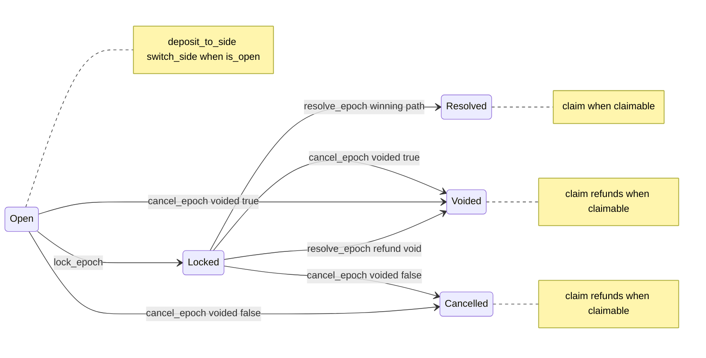
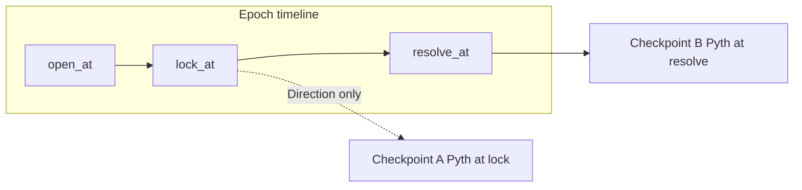
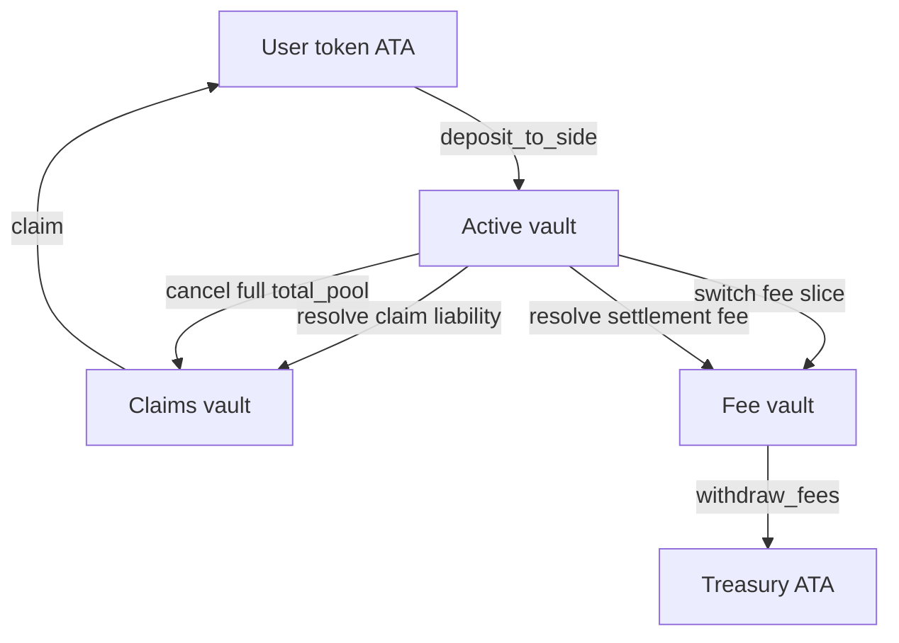

# Market Engine — Protocol flow and economics

**Index:** [docs/current/README.md](./README.md) lists all current docs and reading order.

This document describes **epoch lifecycle**, **oracle checkpoints**, **token movements**, **settlement math**, and **resolver behavior**. For PDAs, instruction parameters, and the full instruction list, see [currentPrograms.md](./currentPrograms.md).

---

## 1. Epoch lifecycle (state machine)

Wall-clock gates use Unix timestamps on the `Epoch` ([`state/epoch.rs`](../../programs/market_engine/src/state/epoch.rs)):

| Predicate | Condition |
|-----------|-----------|
| **Betting open** | `status == Open` and `open_at <= now < lock_at` (`is_open`) |
| **Lock allowed** | `status == Open` and `now >= lock_at` (`is_lockable`) |
| **Resolve allowed** | `status == Locked` and `now >= resolve_at` (`is_resolvable`) |

After **resolve** or **cancel**, `claimable` is set so users may **`claim`**, and **`last_resolved_epoch_id`** is set to the finished epoch’s id. The next **`open_epoch`** succeeds only when **`active_epoch_id == last_resolved_epoch_id`** and **`epoch_id == active_epoch_id + 1`** ([`ledger.rs`](../../programs/market_engine/src/state/ledger.rs))—usually immediately after close, both counters match the epoch that just ended, then `open_epoch` bumps **`active_epoch_id`** only. See [rollin-rounds.md](./rollin-rounds.md) for the full counter walkthrough.

---

## 2. Timeline and oracle checkpoints

### 2.1 Direction markets

- **Lock:** Program writes **checkpoint A** from Pyth (`lock_epoch`). Requires `publish_time >= lock_at` (`validate_checkpoint_a_publish_time`).
- **Resolve:** Writes **checkpoint B**; requires `publish_time >= resolve_at` and, if A was written, `publish_time >= checkpoint_a.publish_time` (`validate_checkpoint_b_publish_time`).
- Resolution compares **A vs B** ([`resolvers/direction.rs`](../../programs/market_engine/src/resolvers/direction.rs)).

### 2.2 Threshold and RangeClose markets

- **`requires_checkpoint_a_on_lock()`** is false; **no oracle read** at lock (epoch still becomes `Locked`).
- **Resolve** always records **checkpoint B** and runs the corresponding resolver.

---

## 3. Oracle validation (Pyth)

[`oracle/pyth.rs`](../../programs/market_engine/src/oracle/pyth.rs) loads a **`PriceUpdateV2`** and calls `get_price_no_older_than` with `max_delay_seconds` from the effective oracle policy (see below). The price is normalized to **`value_e8`** (fixed scale 1e8) using `price * 10^(exponent + 8)` integer arithmetic for any Pyth exponent (crypto, FX, metals, etc.).

**Effective oracle policy:** each [`Epoch`](../../programs/market_engine/src/state/epoch.rs) snapshots `oracle_max_delay_seconds` and `oracle_max_confidence_bps` from the template at [`open_epoch`](../../programs/market_engine/src/instructions/market/open_epoch.rs). When a field is **`0`**, the program uses the corresponding value from global [`Config::oracle_config`](../../programs/market_engine/src/state/config.rs); otherwise the epoch snapshot overrides.

**Confidence bound** (same check in [`lock_epoch`](../../programs/market_engine/src/instructions/market/lock_epoch.rs) and [`resolve_epoch`](../../programs/market_engine/src/instructions/market/resolve_epoch.rs)): let `conf_u128 = confidence_e8` as `u128`, `abs_u128 = |value_e8|` as `u128`, and use the effective `max_confidence_bps` from the epoch snapshot (see above). The program requires

\[
\text{conf\_u128} \leq \left\lfloor \frac{\text{abs\_u128} \cdot \text{max\_confidence\_bps}}{10\_000} \right\rfloor
\]

(using checked integer arithmetic). Wider oracle confidence than this ratio rejects with **`OracleConfidenceTooWide`**.

---

## 4. Token flows and ledger accounting

### 4.1 Diagram

### 4.2 Ledger fields ([`math/reserves.rs`](../../programs/market_engine/src/math/reserves.rs))

| Field | Role |
|-------|------|
| `active_collateral_total` | Tracks stake notionally backing the **active** vault relative to protocol bookkeeping (increased on deposit; decreased when moving to claims/fee reserves). |
| `claims_reserve_total` | Obligation covered by tokens moved to the **claims** vault. |
| `fee_reserve_total` | Obligation covered by tokens in the **fee** vault (switch fees + settlement fees). |

Switch fees move tokens **active → fee** and call `reserve_switch_fee_from_active` (same as `reserve_fees_from_active`). Resolve/cancel moves **active → claims** with `reserve_claims_from_active`. **`claim`** and **`withdraw_fees`** reduce the corresponding reserve when tokens leave the vaults.

**Off-chain consistency:** The program **does not** reconcile SPL token account **`amount`** fields against `active_collateral_total`, `claims_reserve_total`, or `fee_reserve_total`. Those ledger fields are **bookkeeping** updated alongside CPIs. Operators and risk systems should compare **actual vault balances** to reserves and protocol expectations; drift indicates bugs, failed CPIs, or external transfers (which should not occur if authorities are exclusive).

### 4.3 Phase × instruction × movement

| Phase | Instruction | Token movement | Ledger reserve updates |
|-------|-------------|----------------|-------------------------|
| Open | `deposit_to_side` | User → active | `active_collateral_total` ↑ |
| Open | `switch_side` | Active → fee (fee portion) | `active_collateral_total` ↓, `fee_reserve_total` ↑ |
| Resolve (win) | `resolve_epoch` | Active → claims (liability), active → fee (settlement) | claims/fee reserves from active |
| Resolve (void) | `resolve_epoch` | Active → claims (`total_pool`) | refund liability bookkeeping |
| Open/Locked | `cancel_epoch` | Active → claims (`total_pool`) | refund path |
| Post-settlement | `claim` | Claims → user | `claims_reserve_total` ↓ |
| Any | `withdraw_fees` | Fee → treasury ATA | `fee_reserve_total` ↓ |

### 4.4 Resolve path: void / refund bookkeeping

When the resolver returns **`None`** (e.g. direction market void on equal price with `equal_price_voids`), [`resolve_epoch`](../../programs/market_engine/src/instructions/market/resolve_epoch.rs) enters **refund mode**: it CPI-transfers the full **`total_pool`** from the active vault to the claims vault, sets **`total_refund_liability`** to that amount, **`claim_liability_total = 0`**, **`settlement_fee_total = 0`**, **`winning_outcome_mask = 0`**, **`refund_mode = true`**, **`claimable = true`**, and status **`Voided`**. Users **`claim`** via **`compute_refund_total`** (full **`position.total_stake`** per position). This mirrors **`cancel_epoch`**’s refund move, but **`cancel_epoch`** records a **`CancelReason`** and may set **`Cancelled`** vs **`Voided`** from the `voided` flag.

---

## 5. Economic specification

Constants use **basis points** with denominator **10_000** ([`constants.rs`](../../programs/market_engine/src/constants.rs)). All token math uses **checked** arithmetic ([`errors.rs`](../../programs/market_engine/src/errors.rs): `MathOverflow`).

### 5.1 Switch fee ([`math/switching.rs`](../../programs/market_engine/src/math/switching.rs))

For gross switch amount \(G\) and fee bps \(f\):

\[
\text{fee} = \left\lceil \frac{G \cdot f}{10_000} \right\rceil \quad (\text{implemented as integer ceil})
\]

\[
\text{net} = G - \text{fee}
\]

Rounding **up** ensures splitting a switch across many transactions does not evade fees. The **epoch** `total_pool` decreases by the fee amount; **outcome pools** reflect gross debit on the source side and net credit on the destination.

### 5.2 Settlement fee ([`math/payout.rs`](../../programs/market_engine/src/math/payout.rs))

Let \(T =\) `total_pool`, \(W =\) winning pool total, \(L = T - W\). With fee bps \(s\) and flag `fee_on_losing_pool` (currently **always true** on template upsert):

\[
\text{settlement\_fee} = \begin{cases}
\left\lfloor \dfrac{L \cdot s}{10\_000} \right\rfloor & \text{if fee\_on\_losing\_pool} \\[6pt]
\left\lfloor \dfrac{T \cdot s}{10\_000} \right\rfloor & \text{otherwise}
\end{cases}
\]

### 5.3 Claim liability (resolved, non-refund)

Let **distributable losing pool** \(D = L - \text{settlement\_fee}\) (checked non-negative on-chain).

\[
\text{claim\_liability\_total} = W + D
\]

Losers’ stake (minus settlement fee) is spread **pro-rata** across winners by winning stake share.

### 5.4 User payout ([`compute_claim_payout`](../../programs/market_engine/src/math/payout.rs))

For a user with winning stake \(w\) and total winning pool \(W\):

\[
\text{entitlement} = w + \left\lfloor \frac{w \cdot D}{W} \right\rfloor
\]

**Dust sweep:** if this user’s winning stake equals **`epoch.remaining_winning_stake`** (last claimant among winners), the paid amount is **`claims_reserve_total`** instead of `entitlement`, so rounding dust stays inside the claims vault until the final winner clears it.

### 5.5 Refunds ([`compute_refund_total`](../../programs/market_engine/src/math/payout.rs))

In **refund mode** (void resolve or cancel path), each position receives **`position.total_stake`** (full recorded stake for that epoch).

### 5.6 Worked examples (aligned with unit tests)

**Settlement fee on losing pool only** — \(T=1000\), \(L=400\), \(s=500\) bps:

\[
\text{fee} = \lfloor 400 \cdot 500 / 10\_000 \rfloor = 20
\]

**Claim liability** — \(W=600\), fee \(20\), \(D=380\): liability \(= 600 + 380 = 980\).

**Pro-rata** — user winning stake \(60\), \(W=600\), \(D=380\):

\[
60 + \lfloor 60 \cdot 380 / 600 \rfloor = 60 + 38 = 98
\]

**Switch fee ceil** — \(G=199\), \(f=1\) bps: fee \(= \lceil 199/10000 \rceil = 1\), net \(= 198\).

---

## 6. Resolver semantics

### 6.1 Direction

Requires both checkpoints written. See outcome mapping in [currentPrograms.md §7](./currentPrograms.md#7-outcome-indexing-direction-markets). Void (`None`) triggers **refund mode** at resolve ([`resolve_epoch`](../../programs/market_engine/src/instructions/market/resolve_epoch.rs)).

### 6.2 Threshold ([`resolvers/threshold.rs`](../../programs/market_engine/src/resolvers/threshold.rs))

Single **B** checkpoint vs `absolute_threshold_value_e8`:

| `Condition` | Winning outcome mask |
|-------------|----------------------|
| `AtOrAbove` | If `value >= threshold` → bit 0, else bit 1 |
| `Below` | If `value < threshold` → bit 0, else bit 1 |

### 6.3 RangeClose ([`resolvers/range_close.rs`](../../programs/market_engine/src/resolvers/range_close.rs))

With sorted bounds `range_bounds_e8[0..outcome_count-1]` (validated at template), price **B** falls into the first bucket where `value < bound`, else the top bucket. Implementation uses strict **`<`** on upper edges; the highest bucket is **else**.

Example: outcomes 3, bounds `[100, 200]`:

| `value` | Bucket index | Mask bit |
|---------|--------------|----------|
| 50 | 0 | `1 << 0` |
| 150 | 1 | `1 << 1` |
| 250 | 2 | `1 << 2` |

---

## 7. Position rules (single-side vs multi-side)

[`Position::can_deposit_to_outcome`](../../programs/market_engine/src/state/position.rs): if `allow_multi_side_positions` is false, the user may only hold stake on **one** outcome at a time (deposit adds to that side or first deposit).

[`switch_side`](../../programs/market_engine/src/instructions/market/switch_side.rs): in single-side mode, the user must switch from a **pure** single-outcome position and must move the **entire** source stake (`gross_amount == stakes[from]`), not a partial amount.

---

## 8. Operational invariants (checklist)

1. **Sequential epochs:** `epoch_id` increments by 1 per market ledger; no new open until previous epoch is resolved or cancelled (`last_resolved_epoch_id` aligned).
2. **One active epoch id** per ledger matches the `Epoch` account used for user actions.
3. **Stake mint:** All vaults and user ATAs must match `config.stake_mint`.
4. **Template active:** `open_epoch` requires `template.active`.
5. **Oracle feed:** Epoch stores `oracle_feed_id`; Pyth account must match that feed.
6. **Reserves:** `reserve_*` and `release_*` keep ledger totals consistent with CPI amounts (assuming correct client account wiring).
7. **Claim once:** `position.claimed` prevents double claim.

---

## 9. Related documents

- **[currentPrograms.md](./currentPrograms.md)** — Program ID, PDA seeds, struct fields, full instruction reference, events, and error index.
- **[rollin-rounds.md](./rollin-rounds.md)** — Sequential epochs, ledger counters, and when `open_epoch` is valid.
