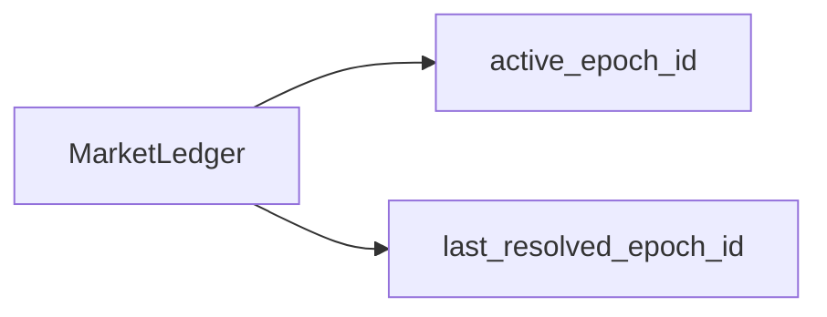
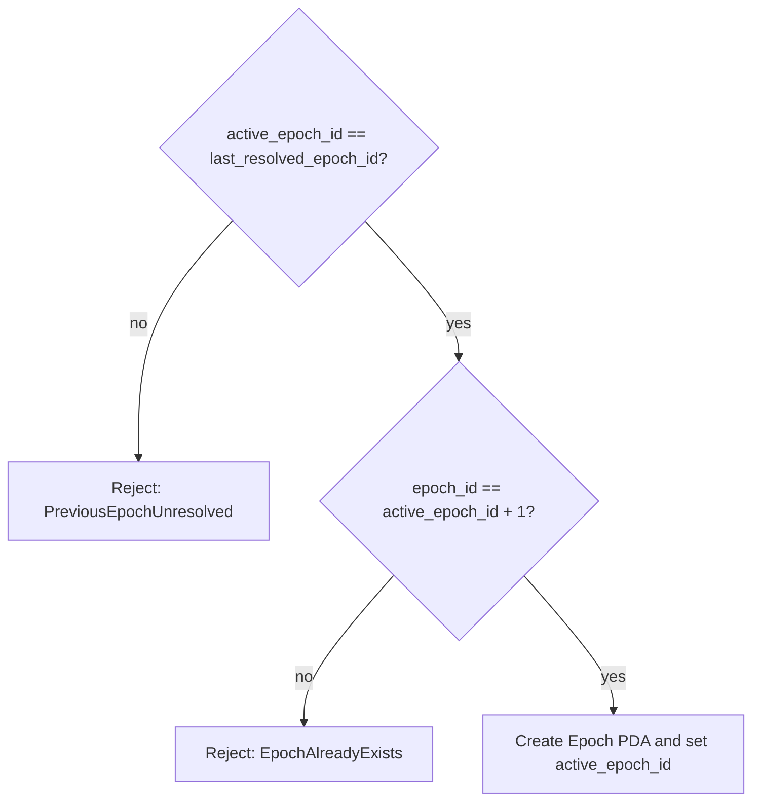
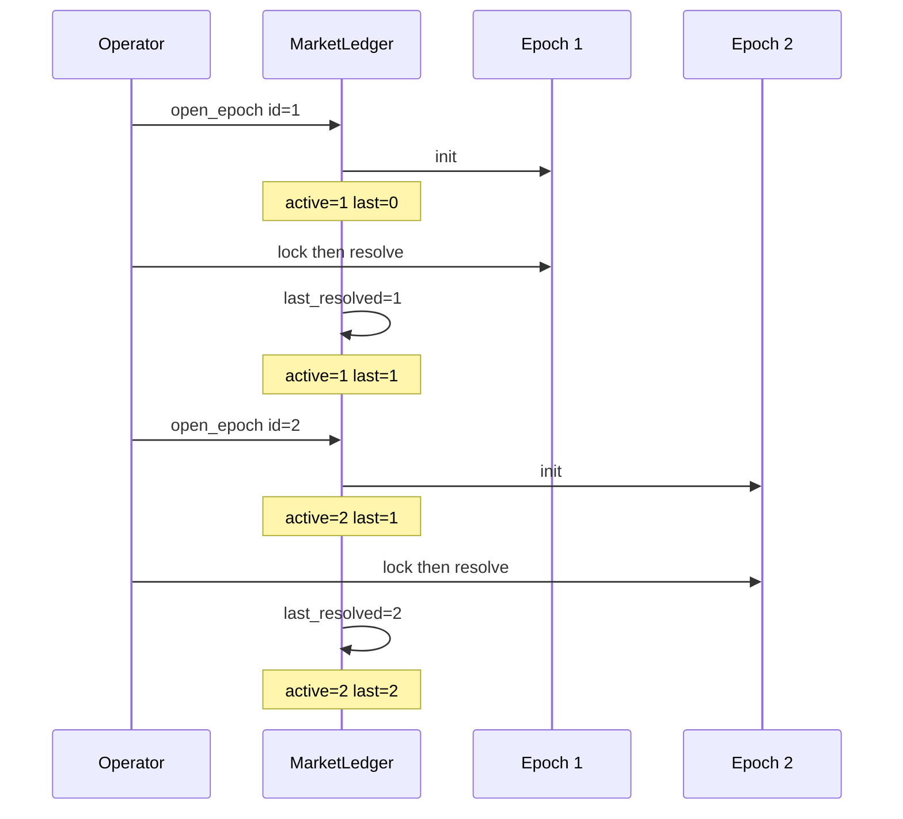
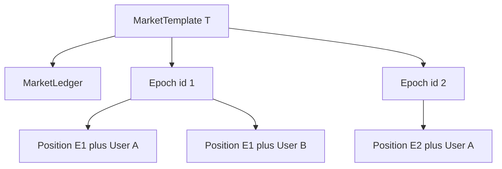
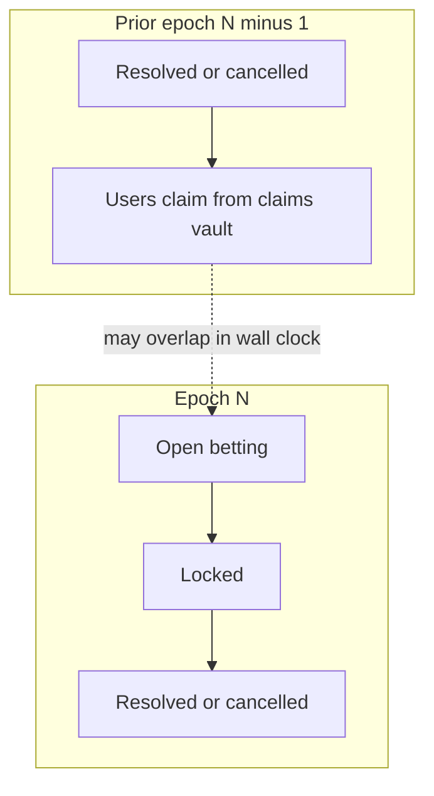

# Rolling rounds (sequential epochs)

**Index:** [docs/current/README.md](./README.md) lists all current docs and reading order.

This document explains how **one market template** advances through **discrete rounds** on-chain. In the program, each round is an **`Epoch`** account; the **`MarketLedger`** enforces a strict **roll-forward** policy so only one live betting round exists at a time, while **claims** from a finished round can still be open when the next round starts.

For PDAs, instructions, and economics, see [currentPrograms.md](./currentPrograms.md) and [flow.md](./flow.md).

---

## 1. What “rolling rounds” means

| Term | On-chain meaning |
|------|-------------------|
| **Round** | One **`Epoch`** PDA: `["epoch", template_pubkey, epoch_id.to_le_bytes()]`. |
| **Roll** | **Close** the current epoch (`resolve_epoch` or `cancel_epoch`), then **open** the next with `open_epoch`. |
| **Template** | Defines oracle feed, market type, fees, and outcome layout; **reused** for every round. |
| **Ledger** | Per-template singleton **`MarketLedger`** that stores `active_epoch_id` and `last_resolved_epoch_id` ([`state/ledger.rs`](../../programs/market_engine/src/state/ledger.rs)). |

There is **no** automatic scheduler on-chain: operators (admin or worker) must submit transactions for lock, resolve/cancel, and the next open.

---

## 2. The two ledger counters



| Field | Role |
|-------|------|
| **`active_epoch_id`** | The epoch id that is **currently designated** for user and operator actions guarded by `require_active_epoch`. Updated **only** in **`open_epoch`** to the new `epoch_id` ([`open_epoch.rs`](../../programs/market_engine/src/instructions/market/open_epoch.rs)). |
| **`last_resolved_epoch_id`** | The id of the last epoch that was **finished** by **`resolve_epoch`** or **`cancel_epoch`**. Updated there to that epoch’s `epoch_id`; **not** updated in `open_epoch`. |

**Intuition:** After you successfully open round *k+1*, `active_epoch_id` becomes *k+1* while `last_resolved_epoch_id` stays *k* until round *k+1* is resolved or cancelled. While round *k+1* is live, `active ≠ last` is normal and expected.

---

## 3. When the next round may open

`open_epoch` calls [`require_can_open_next_epoch`](../../programs/market_engine/src/state/ledger.rs):

```text
1) active_epoch_id == last_resolved_epoch_id
2) epoch_id == active_epoch_id + 1   (strictly the next integer)
```

If (1) fails → **`PreviousEpochUnresolved`**. If (2) fails → **`EpochAlreadyExists`**.



### 3.1 First round after `initialize_market`

After [`initialize_market`](../../programs/market_engine/src/instructions/admin/initialize_market.rs), the ledger is:

- `active_epoch_id = 0`
- `last_resolved_epoch_id = 0`

Then:

- `active == last` ✓  
- Next id must be `0 + 1` → **`epoch_id` must be `1`** for the first `open_epoch`.

Skipping `1` (e.g. trying to open `2` first) always fails check (2).

### 3.2 Sequencing-related errors

| Error ([`errors.rs`](../../programs/market_engine/src/errors.rs)) | Typical cause |
|----------------------------------|----------------|
| **`PreviousEpochUnresolved`** | `active_epoch_id != last_resolved_epoch_id`—the designated round has not been **resolved** or **cancelled** yet (e.g. still betting on epoch 2 while epoch 1 was never closed). |
| **`EpochAlreadyExists`** | `open_epoch` **`epoch_id`** is not exactly **`active_epoch_id + 1`** (e.g. skipping an id or reusing an id while gates expect another). Note: reusing an existing **`Epoch` PDA** also fails at account **`init`**. |
| **`EpochNotActive`** | Instruction targets an **`Epoch`** whose **`epoch_id`** does not equal **`ledger.active_epoch_id`** (stale client or wrong PDA). |

---

## 4. End-to-end example (three rounds)

Assume template `T`, worker signs lifecycle txs, users only deposit/claim on the active epoch.

| Step | Action | `active_epoch_id` | `last_resolved_epoch_id` | Notes |
|------|--------|-------------------|---------------------------|--------|
| 0 | `initialize_market` | 0 | 0 | Ledger + vaults created. |
| 1 | `open_epoch(epoch_id=1, …)` | **1** | 0 | First round; betting uses `Epoch(T,1)`. |
| 2 | Users `deposit_to_side` on epoch 1 | 1 | 0 | `require_active_epoch(1)` passes. |
| 3 | `lock_epoch` → `resolve_epoch` on epoch 1 | 1 | **1** | Resolve sets `last_resolved = 1`. |
| 4 | `open_epoch(epoch_id=2, …)` | **2** | 1 | Gates: `1==1`, `2==1+1`. |
| 5 | Users bet on epoch 2; some still `claim` epoch 1 | 2 | 1 | **Allowed:** opening round 2 does not require all epoch-1 claims to finish. |
| 6 | `resolve_epoch` on epoch 2 | 2 | **2** | |
| 7 | `open_epoch(epoch_id=3, …)` | **3** | 2 | Roll continues. |



---

## 5. What cannot happen (guardrails)

| Situation | Result |
|-----------|--------|
| Open round **3** while round **2** never resolved/cancelled | `active=2`, `last=1` → `2≠1` → **`PreviousEpochUnresolved`**. |
| Open round **2** twice | After first open, `active=2`, `last=1`; cannot satisfy `active==last` with id `3` until round 2 finishes; you also cannot pass `epoch_id=2` again because the **Epoch PDA already exists** (`init` would fail). |
| User deposits against **stale** epoch id | `deposit_to_side` uses `require_active_epoch(epoch.epoch_id)` → only **`active_epoch_id`** matches. |
| Skip epoch ids (e.g. `open` **4** after resolving **2**) | Requires `epoch_id == active + 1`. If `active==last==2`, only **`3`** is valid next. |

---

## 6. Positions and accounts per round

Each user’s stake for a round lives in a **`Position`** PDA:

```text
seeds = ["position", epoch_account_pubkey, user_pubkey]
```

A new **`Epoch`** account each round implies **new Position PDAs** per user—even if the same wallet plays every round. Clients must derive the correct **`epoch`** address for the round users are meant to trade.



---

## 7. Overlap: betting round *k+1* and claims from round *k*

The **open** gate only checks **`active_epoch_id == last_resolved_epoch_id`** immediately **before** incrementing `active_epoch_id`. It does **not** require:

- `claims_reserve_total == 0`, or  
- all users to have called `claim` on the old epoch.

So **liquidity and UX** can overlap: treasury/ops can open the next round while stragglers still claim from the **claims vault** for the prior settlement. Accounting is split in the ledger (`active_collateral_total` vs `claims_reserve_total` / `fee_reserve_total`); see [flow.md §4](./flow.md#4-token-flows-and-ledger-accounting).

**Caution:** Operators should still monitor **claims vault balance** and **reserve totals** off-chain so they do not misconfigure downstream processes; the program does not block the next `open_epoch` on outstanding claims.

### 7.1 Visual timeline (one round vs overlapping claims)



The dashed edge is **not** enforced on-chain: it illustrates that **`open_epoch(N)`** can succeed while **`claim`** txs for epoch *N−1* are still in flight.

---

## 8. Operator checklist for each roll

1. Ensure previous epoch reached **`Resolved`**, **`Voided`**, or **`Cancelled`** via **`resolve_epoch`** or **`cancel_epoch`** (so `last_resolved_epoch_id` equals that epoch’s id).  
2. Confirm **`active_epoch_id == last_resolved_epoch_id`** on the ledger.  
3. Call **`open_epoch`** with **`epoch_id = active_epoch_id + 1`** and valid **`open_at < lock_at < resolve_at`**.  
4. Pass **`template.active == true`** and protocol not paused (for `open_epoch`).  
5. Point clients at the **new `Epoch` PDA** and new **Position** derivations.

---

## 9. Related references

- [currentPrograms.md](./currentPrograms.md) — PDA seeds, `open_epoch` / `resolve_epoch` / `cancel_epoch` accounts and signers.  
- [flow.md](./flow.md) — Epoch state machine, token movements, settlement and refund modes.
