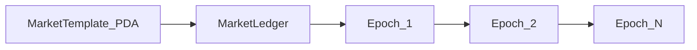

# RetroPick Market Engine — Deployment & Maintenance Cost Reference

> **Date:** 2026-03-30  
> **Program:** `market_engine` (Anchor / Solana)  
> **Rent quotes:** Solana CLI `solana rent` against **`https://api.mainnet-beta.solana.com`** (Agave 3.x). Lamports change if cluster rent parameters change; re-verify after `anchor build` (ELF size affects program data rent).  
> **USD columns:** Illustrative only, using **$100 / $150 / $200 / $250** per SOL — not a live FX feed.

## Executive summary

| Category | What drives cost |
|----------|------------------|
| **One-time (cold start)** | Upgradeable program account + **program data** (`45 + bytes(ELF)` from `target/deploy/market_engine.so`) + `initialize_config` + per-template **`upsert_template` + `initialize_market`** |
| **Recurring (operations)** | Each **`open_epoch`** mints a permanent **Epoch** PDA (~**0.004051 SOL** rent on mainnet at this snapshot). Frequency × epochs/month dominates opex. |
| **Users** | Each **`deposit_to_side`** may create a **Position** PDA (**~0.001747 SOL** rent); **paid by the user**, not the protocol. |

**Orders of magnitude (this snapshot, rent-only):**

- **Program + config (before any template):** **≈ 5.018 SOL** (see §3.1 Phase 0).
- **Each new market line (template + ledger + vaults):** **≈ 0.013711 SOL**.
- **Full deploy + five example BTC timeframes:** **≈ 5.086 SOL** one-time locked rent (see §3.3).
- **All five markets, 24/7 epoch cadence:** **≈ 49.90 SOL/month** in new Epoch rent (+ small tx fees) — **excludes** program deploy (see §5).

---

## Table of Contents

1. [Account Architecture Overview](#1-account-architecture-overview)
2. [Exact Account Sizes & Rent](#2-exact-account-sizes--rent)
3. [One-Time Deployment Costs](#3-one-time-deployment-costs)
4. [Monthly Maintenance Costs per Market](#4-monthly-maintenance-costs-per-market)
5. [Combined 5-Market Monthly Costs](#5-combined-5-market-monthly-costs)
6. [Breakeven / Zero-Cost Strategist Analysis](#6-breakeven--zero-cost-strategist-analysis)
7. [Strategist Epoch Control Guide](#7-strategist-epoch-control-guide)
8. [Lifecycle Flowcharts](#8-lifecycle-flowcharts)
9. [Quick-Reference Cheatsheet](#9-quick-reference-cheatsheet)
10. [Maximum Capacity (Protocol vs Economics)](#10-maximum-capacity-protocol-vs-economics)

---

## 1. Account Architecture Overview

```
┌───────────────────────────────────────────────────────────────────┐
│                      PROGRAM DEPLOYMENT                           │
│                                                                   │
│  [Config PDA]  ←── one global singleton per program deploy       │
│       │                                                           │
│       ├── seeds: ["config"]                                       │
│       └── holds: admin, treasury, worker, oracle policy          │
│                                                                   │
└──────────────────────┬────────────────────────────────────────────┘
                       │  per BTC market timeframe
                       ▼
┌───────────────────────────────────────────────────────────────────┐
│                   PER-MARKET INFRASTRUCTURE                       │
│                    (one set per timeframe)                        │
│                                                                   │
│  [MarketTemplate PDA]                                             │
│       seeds: ["template", slug_bytes]                             │
│       holds: oracle feed, fee config, market type                 │
│                                                                   │
│  [MarketLedger PDA]                                               │
│       seeds: ["ledger", template_pubkey]                          │
│       holds: epoch cursor, vault reserve mirrors                  │
│                                                                   │
│  3× Vault Infrastructure (active / claims / fee):                │
│    [XxxVaultMeta PDA]  → bump storage                            │
│    [xxx_vault_token]   → SPL token account (165 bytes each)      │
│    authority PDA       → UncheckedAccount (no account storage)   │
│                                                                   │
└──────────────────────┬────────────────────────────────────────────┘
                       │  per epoch (NEVER CLOSED — permanent)
                       ▼
┌───────────────────────────────────────────────────────────────────┐
│                    PER-EPOCH ACCOUNTS                             │
│                                                                   │
│  [Epoch PDA]                                                      │
│       seeds: ["epoch", template_pubkey, epoch_id_le_bytes]       │
│       holds: timing, oracle checkpoints, pools, status           │
│       ⚠ NEVER CLOSED → rent locked permanently per epoch        │
│                                                                   │
└──────────────────────┬────────────────────────────────────────────┘
                       │  per user per epoch (NEVER CLOSED)
                       ▼
┌───────────────────────────────────────────────────────────────────┐
│                   PER-USER-PER-EPOCH                              │
│                                                                   │
│  [Position PDA]                                                   │
│       seeds: ["position", epoch_pubkey, user_pubkey]             │
│       holds: stakes[8], claimed flag                             │
│       payer: the user themselves (init_if_needed)                │
│       ⚠ NEVER CLOSED → rent locked permanently per position     │
│                                                                   │
└───────────────────────────────────────────────────────────────────┘
```

> **Critical architecture note:** There is no `close =` constraint on `Epoch` or `Position` accounts in any instruction. Every epoch opened and every user position ever created consumes rent permanently. This is the primary driver of ongoing operational cost.

---

## 2. Exact Account Sizes & Rent

### Rent-exempt minimum (source of truth)

Do **not** hand-copy polynomial formulas: rent parameters are cluster-defined. For any `data_len` (bytes of account data):

```bash
solana rent <data_len> --lamports   # lamports
solana rent <data_len>              # SOL (human-readable)
```

**This document’s lamports/SOL** for each row were produced with the CLI against **mainnet-beta** at the snapshot date in the header. `Epoch`/`Position`/vault sizes follow `programs/market_engine/src/state/*.rs` and `8 + INIT_SPACE` (or fixed `MarketTemplate::INIT_SPACE` / `Epoch::INIT_SPACE`).

### 2.1 Account Field Breakdown

#### Config (global singleton)

| Field | Type | Bytes |
|-------|------|-------|
| discriminator | [u8;8] | 8 |
| version | u8 | 1 |
| bump | u8 | 1 |
| admin | Pubkey | 32 |
| treasury | Pubkey | 32 |
| worker_authority | Pubkey | 32 |
| paused | bool | 1 |
| stake_mint | Pubkey | 32 |
| default_settlement_fee_bps | u16 | 2 |
| max_switch_fee_bps | u16 | 2 |
| max_outcomes | u8 | 1 |
| oracle_config.oracle_kind | enum(1) | 1 |
| oracle_config.max_delay_seconds | i64 | 8 |
| oracle_config.max_confidence_bps | u16 | 2 |
| reserved | [u8;32] | 32 |
| **TOTAL** | | **187 bytes** |

#### MarketTemplate (per market)

| Field | Type | Bytes |
|-------|------|-------|
| discriminator | [u8;8] | 8 |
| version + bump | u8×2 | 2 |
| slug (max 32 chars) | String | 4+32=36 |
| asset_symbol (max 16) | String | 4+16=20 |
| oracle_feed_id | [u8;32] | 32 |
| market_type | enum | 1 |
| condition | enum | 1 |
| threshold_rule | enum | 1 |
| active | bool | 1 |
| outcome_count | u8 | 1 |
| absolute_threshold_value_e8 | i128 | 16 |
| range_bounds_e8 | [i128;7] | 112 |
| switch_fee_bps | u16 | 2 |
| settlement_fee_bps | u16 | 2 |
| equal_price_voids | bool | 1 |
| fee_on_losing_pool | bool | 1 |
| allow_multi_side_positions | bool | 1 |
| reserved | [u8;16] | 16 |
| **TOTAL (with INIT_SPACE=272)** | | **280 bytes** |

#### MarketLedger (per market)

| Field | Type | Bytes |
|-------|------|-------|
| discriminator | [u8;8] | 8 |
| version + bump | u8×2 | 2 |
| active_epoch_id | u64 | 8 |
| last_resolved_epoch_id | u64 | 8 |
| active_collateral_total | u64 | 8 |
| claims_reserve_total | u64 | 8 |
| fee_reserve_total | u64 | 8 |
| insurance_reserve_total | u64 | 8 |
| reserved | [u8;32] | 32 |
| **TOTAL (INIT_SPACE=82)** | | **90 bytes** |

#### Epoch (per epoch — PERMANENT)

| Field | Type | Bytes |
|-------|------|-------|
| discriminator | [u8;8] | 8 |
| version + bump | u8×2 | 2 |
| epoch_id | u64 | 8 |
| status | enum | 1 |
| cancel_reason | enum | 1 |
| timing (open/lock/resolve) | i64×3 | 24 |
| checkpoint_a (value_e8+time+conf+written) | i128+i64+u64+bool | 33 |
| checkpoint_b | same | 33 |
| oracle_feed_id | [u8;32] | 32 |
| market_type | enum | 1 |
| condition | enum | 1 |
| absolute_threshold_value_e8 | i128 | 16 |
| range_bounds_e8 | [i128;7] | 112 |
| switch_fee_bps + settlement_fee_bps | u16×2 | 4 |
| equal_price_voids + fee_on_losing_pool + allow_multi_side | bool×3 | 3 |
| outcome_count | u8 | 1 |
| winning_outcome_mask | u64 | 8 |
| total_pool | u64 | 8 |
| outcome_pools | [u64;8] | 64 |
| switch_fee_total + settlement_fee_total | u64×2 | 16 |
| claim_liability_total + total_refund_liability | u64×2 | 16 |
| claimed_total + remaining_winning_stake | u64×2 | 16 |
| refund_mode + claimable | bool×2 | 2 |
| created_at + locked_at + resolved_at | i64×3 | 24 |
| total_positions | u32 | 4 |
| reserved | [u8;16] | 16 |
| **TOTAL (INIT_SPACE=446)** | | **454 bytes** |

#### Position (per user per epoch — PERMANENT, paid by user)

| Field | Type | Bytes |
|-------|------|-------|
| discriminator | [u8;8] | 8 |
| version + bump | u8×2 | 2 |
| stakes | [u64;8] | 64 |
| total_stake | u64 | 8 |
| switch_fees_paid | u64 | 8 |
| entry_fees_paid | u64 | 8 |
| claimed_amount | u64 | 8 |
| claimed | bool | 1 |
| reserved | [u8;16] | 16 |
| **TOTAL (INIT_SPACE=115)** | | **123 bytes** |

#### Vault Accounts (×3 per market: active, claims, fee)

| Account | Data Bytes | Notes |
|---------|-----------|-------|
| XxxVaultMeta PDA | 27 bytes | 8 disc + 3×u8 + 16 reserved |
| xxx_vault_token (SPL) | 165 bytes | Standard Token Program account |
| xxx_vault_authority | 0 data bytes | UncheckedAccount — no storage cost |

### 2.2 Rent Summary Table

**Program binary (upgradeable loader):** `Program` account (executable metadata, **36** bytes data) + **`ProgramData`** account = **45 + len(ELF)** bytes, where `len(ELF)` is `wc -c target/deploy/market_engine.so` after `anchor build` (**720,272** bytes at this snapshot → **720,317** bytes program data).

| Account | Data (bytes) | Lamports | SOL |
|---------|-------------|----------|-----|
| BPF upgradeable Program | 36 | 1,141,440 | **0.001141** |
| ProgramData (45 + ELF) | 720,317 | 5,014,297,200 | **5.014297** |
| Config | 187 | 2,192,400 | **0.002192** |
| MarketTemplate | 280 | 2,839,680 | **0.002840** |
| MarketLedger | 90 | 1,517,280 | **0.001517** |
| Epoch ⚠ | 454 | 4,050,720 | **0.004051** |
| Position ⚠ | 123 | 1,746,960 | **0.001747** |
| VaultMeta (each) | 27 | 1,078,800 | **0.001079** |
| Token Vault (each) | 165 | 2,039,280 | **0.002039** |

> ⚠ = permanent cost for Epoch/Position in current program (no close instruction)

**Per-template market bootstrap (sum of template + ledger + 3× meta + 3× token):** **0.013711 SOL** (matches §3.2).

---

## 3. One-Time Deployment Costs

Rent figures below are **locked SOL** (rent-exempt minimums), excluding transaction fees unless noted.

### 3.1 Phase 0 — Program on-chain (once per codebase / upgrade)

```
Commands: anchor deploy (or solana program deploy)
Creates:  BPF Loader Upgradeable — Program account + ProgramData account
```

| Item | Data (bytes) | Rent (SOL) |
|------|-------------|------------|
| Program (upgradeable metadata) | 36 | 0.00114144 |
| ProgramData (`45 + ELF`) | 720,317 | 5.01429720 |
| **Subtotal Phase 0** | | **5.01543864** |

> **ELF size** comes from `target/deploy/market_engine.so` after `anchor build` (720,272 bytes at this snapshot). Re-run `solana rent $((45 + $(wc -c < target/deploy/market_engine.so)))` after rebuilds.

### 3.2 Phase 1 — Global config (`initialize_config`, once per deployment)

```
Instruction: initialize_config
Creates:     Config PDA
```

| Item | Cost (SOL) |
|------|-----------|
| Config account rent | 0.00219240 |
| Transaction fee (typical) | ~0.000005 |
| **Subtotal Phase 1** | **≈ 0.002197** |

### 3.3 Phase 2 — Per-market infrastructure (once per template / slug)

```
Instructions: upsert_template  →  initialize_market
              (1 tx)              (1 tx, creates 7 accounts)
```

| Account Created | Instruction | Cost (SOL) |
|----------------|-------------|-----------|
| MarketTemplate | upsert_template | 0.00283968 |
| MarketLedger | initialize_market | 0.00151728 |
| ActiveVaultMeta | initialize_market | 0.00107880 |
| ClaimsVaultMeta | initialize_market | 0.00107880 |
| FeeVaultMeta | initialize_market | 0.00107880 |
| active_vault_token | initialize_market | 0.00203928 |
| claims_vault_token | initialize_market | 0.00203928 |
| fee_vault_token | initialize_market | 0.00203928 |
| Tx fees (2 txs, typical) | — | ~0.000010 |
| **Subtotal per market** | | **≈ 0.013721** |

### 3.4 Combined totals — cold start vs markets only

| Milestone | Components | Rent-only SOL |
|-----------|------------|---------------|
| **A — Program + config** | Phase 0 + Phase 1 | **5.017631** |
| **B — Five BTC markets** | 5 × Phase 2 (templates + vaults), *assuming program already deployed* | **0.068556** |
| **C — Config + five markets** | Phase 1 + 5 × Phase 2 (no new program upload) | **0.070748** |
| **D — Full cold start + five markets** | A + B = Phase 0 + Phase 1 + 5 × Phase 2 | **5.086187** |

**B** uses `5 × 0.0137112 = 0.068556` (pure account rent; omit ~tx fees).

### 3.5 USD — full cold start (row D) vs config + markets only (row C)

| Scenario | SOL | @$100 | @$150 | @$200 | @$250 |
|----------|-----|-------|-------|-------|-------|
| **C** Config + 5 templates/vaults (program already on-chain) | 0.070748 | $7.07 | $10.61 | $14.15 | $17.69 |
| **D** Program + config + 5 templates/vaults | 5.086187 | $508.62 | $762.93 | $1,017.24 | $1,271.55 |

> **Buffer accounts** during `solana program deploy` and routine **transaction fees** are not included. **Not** included: stake liquidity in vaults — only account rent.

---

## 4. Monthly Maintenance Costs per Market

### 4.1 Epoch Frequency

| Market | Duration | Epochs/Hour | Epochs/Day | Epochs/Month |
|--------|----------|-------------|------------|--------------|
| BTC 5-min | 5 min | 12 | 288 | **8,640** |
| BTC 15-min | 15 min | 4 | 96 | **2,880** |
| BTC 1-hour | 1 hour | 1 | 24 | **720** |
| BTC 1-day | 24 hours | 0.042 | 1 | **30** |
| BTC 1-week | 168 hours | — | 0.143 | **4** |

> Month = 30 days. 1-week market runs 4 complete epochs in 28 days (week 5 starts on day 29).

### 4.2 Per-Epoch Cost

Each epoch lifecycle requires 3 transactions:

| Transaction | Accounts | Cost |
|------------|---------|------|
| open_epoch | Creates Epoch PDA (454 bytes) | **0.00405072** SOL rent + ~0.000005 tx |
| lock_epoch | Writes checkpoint A | ~0.000005 SOL tx only |
| resolve_epoch | Writes checkpoint B, moves vaults | ~0.000005 SOL tx only |
| **Total per epoch** | | **≈ 0.00406572 SOL** |

> Rent dominates: **0.00405072 / 0.00406572 ≈ 99.6%** of typical per-epoch spend.

### 4.3 Monthly Cost by Market (SOL)

Using **0.00405072** SOL epoch rent and **3 × 0.000005** SOL tx fees per epoch (order-of-magnitude; actual priority fees may differ):

| Market | Epochs/Month | Epoch Rent | Tx Fees | **Monthly SOL** |
|--------|-------------|-----------|---------|----------------|
| BTC 5-min | 8,640 | 34.978 | 0.130 | **35.128** |
| BTC 15-min | 2,880 | 11.666 | 0.043 | **11.709** |
| BTC 1-hour | 720 | 2.916 | 0.011 | **2.927** |
| BTC 1-day | 30 | 0.122 | 0.000 | **0.122** |
| BTC 1-week | 4 | 0.016 | 0.000 | **0.016** |

### 4.4 Monthly Cost in USD (epoch rent + tx fees, no Position accounts)

| Market | @$100/SOL | @$150/SOL | @$200/SOL | @$250/SOL |
|--------|----------|----------|----------|----------|
| BTC 5-min | $3,513 | $5,269 | $7,026 | $8,782 |
| BTC 15-min | $1,171 | $1,756 | $2,342 | $2,927 |
| BTC 1-hour | $293 | $439 | $585 | $732 |
| BTC 1-day | $12.20 | $18.30 | $24.40 | $30.50 |
| BTC 1-week | $1.63 | $2.44 | $3.25 | $4.07 |

> **Position accounts** are funded by users themselves (`init_if_needed` with `payer = user`). The protocol operator does NOT pay for them.

---

## 5. Combined 5-Market Monthly Costs

> **Scope:** Ongoing **Epoch** + transaction fees only. **Excludes** one-time program deploy, **Config**, template/vault bootstrap, and user **Position** rent (§3).

### 5.1 Total Monthly SOL (all 5 markets running 24/7)

| Component | SOL/Month |
|-----------|----------|
| BTC 5-min epochs | 35.128 |
| BTC 15-min epochs | 11.709 |
| BTC 1-hour epochs | 2.927 |
| BTC 1-day epochs | 0.122 |
| BTC 1-week epochs | 0.016 |
| **TOTAL** | **≈ 49.903 SOL/month** |

### 5.2 Monthly USD Across All 5 Markets

| SOL Price | Monthly Cost |
|-----------|-------------|
| $100/SOL | **≈ $4,990** |
| $150/SOL | **≈ $7,485** |
| $200/SOL | **≈ $9,981** |
| $250/SOL | **≈ $12,476** |

### 5.3 Cost Breakdown (24/7 operation, 30-day month)

```
BTC 5-min  ████████████████████████████████████████  70.4%
BTC 15-min █████████████                             23.5%
BTC 1-hour ███                                        5.9%
BTC 1-day  ▏                                          0.2%
BTC 1-week ▏                                          0.0%
```

> The 5-min market alone consumes ~70% of all epoch rent. Disabling it (or running it only during peak hours) dramatically reduces total cost.

---

## 6. Breakeven / Zero-Cost Strategist Analysis

### 6.1 How Fee Revenue Works

The protocol collects two types of fees (in stake tokens, e.g. USDC):

| Fee | Rate | Source | Collected at |
|-----|------|--------|-------------|
| Settlement fee | e.g. 250 bps (2.5%) | Losing pool | resolve_epoch |
| Switch fee | e.g. 100 bps (1.0%) | Switched amount | switch_side |

Fee revenue accumulates in `fee_vault_token`. The admin calls `withdraw_fees` to claim it.
The admin then swaps stake tokens → SOL to fund future epoch openings.

### 6.2 Breakeven Volume Per Epoch

For a 2.5% settlement fee applied to the **losing pool** at 50/50 market split:

```
Effective fee rate on total pool = 2.5% × 50% = 1.25%

Required pool to break even (fee accrues on losing side only, 50/50 pool assumption):
  pool_usd = per_epoch_total_sol × sol_price / 0.0125
  per_epoch_total_sol ≈ 0.00406572  (open + lock + resolve tx fees included)
```

| SOL Price | Min Pool/Epoch to Break Even |
|-----------|------------------------------|
| $100/SOL | **≈ $32.53 total pool** |
| $150/SOL | **≈ $48.79 total pool** |
| $200/SOL | **≈ $65.05 total pool** |
| $250/SOL | **≈ $81.31 total pool** |

> Same threshold for **every timeframe** at this fee model — only **epoch cadence** changes monthly burn.

### 6.3 Minimum Monthly Trading Volume for Zero-Cost Operation

At $150/SOL, 2.5% fee on losing pool (50/50 split), full 24/7:

| Market | Monthly SOL Cost | Monthly USD Cost | Min Monthly Volume |
|--------|-----------------|-----------------|-------------------|
| BTC 5-min | 35.128 SOL | ≈ $5,269 | **≈ $421,500** |
| BTC 15-min | 11.709 SOL | ≈ $1,756 | **≈ $140,500** |
| BTC 1-hour | 2.927 SOL | ≈ $439 | **≈ $35,120** |
| BTC 1-day | 0.122 SOL | ≈ $18.30 | **≈ $1,464** |
| BTC 1-week | 0.016 SOL | ≈ $2.44 | **≈ $195** |
| **All 5 combined** | **≈ 49.903 SOL** | **≈ $7,485** | **≈ $598,800** |

### 6.4 Self-Sustaining Thresholds

The table below shows **monthly trading volume needed per market** to achieve net-zero cost at various SOL prices:

| Market | @$100/SOL | @$150/SOL | @$200/SOL | @$250/SOL |
|--------|----------|----------|----------|----------|
| 5-min | ≈ $281K | ≈ $421K | ≈ $562K | ≈ $702K |
| 15-min | ≈ $94K | ≈ $141K | ≈ $187K | ≈ $234K |
| 1-hour | ≈ $23.4K | ≈ $35.1K | ≈ $46.8K | ≈ $58.6K |
| 1-day | ≈ $976 | ≈ $1,464 | ≈ $1,952 | ≈ $2,440 |
| 1-week | ≈ $130 | ≈ $195 | ≈ $260 | ≈ $325 |

---

## 7. Strategist Epoch Control Guide

### 7.1 Core Principle

> The strategist controls **when and how many epochs to open**. By reducing epoch frequency during low-volume periods, rent costs drop proportionally — while fee revenue per epoch stays constant or improves (concentrated activity).

### 7.2 Operating Modes

#### Mode A — Full 24/7 (Highest Cost, Maximum Coverage)

| Market | Epochs/Month | Monthly Cost @$150 |
|--------|-------------|-------------------|
| 5-min | 8,640 | ≈ $5,269 |
| 15-min | 2,880 | ≈ $1,756 |
| 1-hour | 720 | ≈ $439 |
| 1-day | 30 | ≈ $18.30 |
| 1-week | 4 | ≈ $2.44 |

#### Mode B — Peak Hours Only (12 hours/day, high-volume windows)

| Market | Epochs/Month | Monthly Cost @$150 | Savings vs A |
|--------|-------------|-------------------|-------------|
| 5-min | 4,320 | $2,635 | -50% |
| 15-min | 1,440 | $879 | -50% |
| 1-hour | 360 | $219 | -50% |
| 1-day | 30 | $18.30 | 0% |
| 1-week | 4 | $2.44 | 0% |

> Daily/weekly markets already run at minimum necessary frequency — no reduction possible.

#### Mode C — Minimal / Bootstrapping (6 hours/day, proving the market)

| Market | Epochs/Month | Monthly Cost @$150 | Min Pool/Epoch to Break Even |
|--------|-------------|-------------------|------------------------------|
| 5-min | 2,160 | $1,318 | $48.79 |
| 15-min | 720 | $439 | $48.79 |
| 1-hour | 180 | $110 | $48.79 |
| 1-day | 15 | $9.15 | $48.79 |
| 1-week | 2 | $1.22 | $48.79 |

### 7.3 Strategist Decision Flowchart

```
┌─────────────────────────────────────────────────────────────────┐
│               EPOCH OPENING DECISION (per timeframe)           │
└─────────────────────────────────────────────────────────────────┘
                              │
                              ▼
              ┌───────────────────────────────┐
              │  Check trailing 24h volume    │
              │  for this market              │
              └───────────────────────────────┘
                              │
           ┌──────────────────┼──────────────────┐
           ▼                  ▼                   ▼
   avg_pool < $25/epoch  $25–$100/epoch    avg_pool > $100/epoch
           │                  │                   │
           ▼                  ▼                   ▼
  ┌──────────────┐   ┌──────────────────┐  ┌───────────────────┐
  │ REDUCE FREQ  │   │ MAINTAIN CURRENT │  │  INCREASE FREQ    │
  │              │   │ SCHEDULE         │  │                   │
  │ 5-min → skip │   │ Continue Mode B  │  │ Mode B → Mode A   │
  │ or pause     │   │ (12h/day)        │  │ (full 24/7)       │
  └──────────────┘   └──────────────────┘  └───────────────────┘
           │
           ▼
  ┌──────────────────────────────┐
  │ Is avg_pool < $10 for 7 days?│
  └──────────────────────────────┘
           │
    YES ───┤───── NO
           │            │
           ▼            ▼
  ┌──────────────┐  ┌──────────────────────┐
  │ PAUSE MARKET │  │ Try Mode C (6h/day)  │
  │ withdraw fees│  │ for 2 more weeks     │
  │ monitor      │  └──────────────────────┘
  └──────────────┘
```

### 7.4 Epoch Count Targets for Zero-Cost at Different Volume Levels

Given a target **average total pool per epoch** (V), the maximum self-sustaining epochs per month is:

```
max_epochs_per_month = (fee_rate × V × epochs_per_month) / epoch_cost_sol / sol_price

Or reversed: max_epochs that break even =
  (fee_rate × V) / (epoch_cost_sol × sol_price)  × available_epochs_per_month
```

**At $150/SOL, 2.5% fee on 50% losing pool (1.25% effective), Epoch rent-only ≈ $0.608 (open+lock+resolve total ≈ $0.61):**

| Avg Pool/Epoch | Max 5-min Epochs/Month | Max 15-min | Max 1h |
|---------------|----------------------|-----------|--------|
| $10 | 205 (2.4h/day) | 68 | 16 |
| $25 | 512 (5.9h/day) | 171 | 43 |
| $50 | 1,025 (11.9h/day) | 341 | 85 |
| $100 | 2,049 (23.7h/day) | 683 | 171 |
| $200 | 4,098 (47.5h/day → full) | 1,366 | 341 |
| $500 | 8,640 (full 24/7) | 2,880 | 720 |

> When "max epochs" exceeds the 24/7 maximum, the market is fully self-sustaining at that volume level.

---

## 8. Lifecycle Flowcharts

### 8.1 Phase Flow: From Zero to Running Market

```
PHASE 0 — Program Deployment (one time)
═══════════════════════════════════════

  Developer
      │
      ▼
  anchor deploy ──────────────────► BPF Loader Upgradeable:
      │                              Program account (36 bytes) + ProgramData (45 + ELF)
      │                              Rent ≈ 5.015 SOL (mainnet snapshot; ELF from build)
      ▼
  initialize_config ──────────────► [Config PDA]
      │                              - admin key
      │                              - treasury key
      │                              - worker key
      │                              - stake_mint
      │                              - oracle policy
      │
      └── +Config rent ≈ 0.002192 SOL  →  Phase 0+1 program+config ≈ 5.018 SOL


PHASE 2 — Market Infrastructure (once per BTC timeframe)
═════════════════════════════════════════════════════════

  Admin
      │
      ├─► upsert_template ─────────► [MarketTemplate PDA]
      │       slug: "btc-5m"           oracle_feed_id
      │       settlement_fee: 250bps   market_type: Direction
      │       switch_fee: 100bps       outcome_count: 2
      │
      └─► initialize_market ───────► [MarketLedger PDA]
              │                       active_epoch_id = 0
              ├──────────────────────► [ActiveVaultMeta PDA]
              ├──────────────────────► [active_vault_token] (SPL)
              ├──────────────────────► [ClaimsVaultMeta PDA]
              ├──────────────────────► [claims_vault_token] (SPL)
              ├──────────────────────► [FeeVaultMeta PDA]
              └──────────────────────► [fee_vault_token] (SPL)

      Cost per market: ≈ 0.013711 SOL
      Cost for 5 markets: ≈ 0.068556 SOL (excludes program + config)


PHASE 3 — Epoch Lifecycle (repeating forever)
══════════════════════════════════════════════

  Worker / Admin (Strategist)
        │
        ▼
  ┌─────────────────────┐
  │   open_epoch        │ ──► Creates [Epoch PDA] (454 bytes, PERMANENT)
  │   epoch_id: N       │     payer funds 0.004051 SOL rent
  │   open_at: T        │     ledger.active_epoch_id = N
  │   lock_at: T+5min   │
  │   resolve_at: T+6min│
  └─────────────────────┘
        │
        │    ← Users deposit via deposit_to_side
        │      (creates [Position PDA] paid by user)
        │    ← Users switch via switch_side
        │
        ▼  [when now >= lock_at]
  ┌─────────────────────┐
  │   lock_epoch        │ ──► Writes checkpoint_a (Pyth price at lock)
  │   Pyth oracle read  │     epoch.status = Locked
  └─────────────────────┘
        │
        ▼  [when now >= resolve_at]
  ┌─────────────────────┐
  │   resolve_epoch     │ ──► Reads Pyth checkpoint_b
  │   or cancel_epoch   │     Resolves outcome (Direction/Threshold/Range)
  └─────────────────────┘     Moves tokens: active → claims + fee vaults
        │                     epoch.status = Resolved | Voided
        │                     ledger.last_resolved_epoch_id = N
        │
        │    ← Users claim via claim instruction
        │      (reads claims_vault, pays user from claims_vault_token)
        │
        ▼  [when last_resolved = active]
  ┌─────────────────────┐
  │  open_epoch N+1     │ ──► Cycle repeats
  └─────────────────────┘


PHASE 4 — Fee Collection (periodic, by treasury)
══════════════════════════════════════════════════

  Admin / Treasury
        │
        ▼
  withdraw_fees ──────────────────► Moves fee_vault_token → treasury ATA
        │
        └── Accumulated settlement + switch fees collected
            Swap stake tokens → SOL to fund future epoch rents
```

### 8.2 Cost Accumulation Over Time (single 5-min template, 24/7; excludes program deploy)

One **MarketTemplate** + ledger + vaults = **8** accounts (**≈ 0.013711 SOL**). Each **`open_epoch`** adds **one permanent Epoch** PDA (**≈ 0.00405072 SOL** rent). Cumulative rent ≈ **0.013711 + n × 0.00405072** for **n** epochs (plus small tx fees).

```
Month   Epoch Count   Cumulative Accounts   Cumulative SOL Locked (rent est.)
  0         0              8 (infra)              0.0137 SOL
  1       8,640          8,648                    35.13 SOL
  3      25,920         25,928                   105.3 SOL
  6      51,840         51,848                   210.6 SOL
 12     103,680        103,688                   421.0 SOL

Every Epoch account is PERMANENT in the current program — locked rent grows linearly with epochs opened.
Fee revenue must exceed this rate or the operator tops up SOL for `open_epoch` rent.
```

---

## 9. Quick-Reference Cheatsheet

### 9.1 Instant Cost Lookup (per epoch at various SOL prices)

| SOL Price | Epoch Rent | Epoch + 3 Txs | Daily @ 5-min | Monthly @ 5-min |
|-----------|-----------|--------------|--------------|-----------------|
| $100 | $0.41 | $0.41 | $118.48 | ≈ $3,513 |
| $150 | $0.61 | $0.61 | $177.71 | ≈ $5,269 |
| $200 | $0.81 | $0.81 | $236.95 | ≈ $7,026 |
| $250 | $1.01 | $1.02 | $296.18 | ≈ $8,782 |

### 9.2 Breakeven Pool Size Per Epoch

At 2.5% settlement fee, 50/50 market split:

| SOL Price | Min Pool to Break Even |
|-----------|----------------------|
| $100 | $32.53 |
| $150 | **$48.79** |
| $200 | $65.05 |
| $250 | $81.32 |

### 9.3 Strategist Rules of Thumb

| Scenario | Action |
|----------|--------|
| Avg epoch pool < breakeven threshold | Reduce epoch frequency or pause |
| Avg epoch pool > 2× breakeven | Safe to run 24/7; generating profit |
| Launching new market | Start with Mode C (6h/day); scale up with volume |
| High gas period (SOL spikes) | Shift to longer timeframes (1h vs 5min) |
| Low volume period | Disable 5-min, keep 1h/1d/1w running |
| Monthly fee withdrawals | Swap % of stake fees → SOL to cover next month's rent |

### 9.4 Monthly Cost Summary (All 5 Markets, 24/7, @$150/SOL)

| Market | Mode A (24/7) | Mode B (12h/day) | Mode C (6h/day) |
|--------|--------------|-----------------|----------------|
| BTC 5-min | $5,270 | $2,635 | $1,318 |
| BTC 15-min | $1,757 | $879 | $439 |
| BTC 1-hour | $439 | $219 | $110 |
| BTC 1-day | $18.30 | $18.30 | $9.15 |
| BTC 1-week | $2.44 | $2.44 | $1.22 |
| **Total** | **≈ $7,485** | **≈ $3,742** | **≈ $1,871** |

### 9.5 One-Line Cost Formulas

```
# Monthly SOL cost for a market running N hours/day (use measured per_epoch_sol from `solana rent`)
monthly_sol ≈ (N/24) × epochs_per_day × 0.00406572

# Min avg pool per epoch to break even (at SOL price P; settlement fee F bps on losing pool; 50/50 split)
min_pool_usd ≈ 0.00406572 × P / (F/10000 × 0.5)

# Monthly volume to break even (at SOL price P, fee bps F, N hours/day)
monthly_volume = min_pool_usd × (N/24) × epochs_per_day × 30
```

---

## 10. Maximum Capacity (Protocol vs Economics)

### 10.1 Protocol limits (on-chain, `market_engine`)

| Limit | Value | Source |
|-------|--------|--------|
| Outcomes per template / epoch | **≤ 8** | `MAX_OUTCOMES` in [`constants.rs`](../../programs/market_engine/src/constants.rs); `Config.max_outcomes` cannot exceed it. |
| Epoch index in PDA | **`u64`** | [`open_epoch`](../../programs/market_engine/src/instructions/market/open_epoch.rs) seeds `epoch_id.to_le_bytes()` — **2⁶⁴** distinct epoch PDAs per template (not reachable in practice). |
| Concurrent open epochs per template | **1** | [`MarketLedger::require_can_open_next_epoch`](../../programs/market_engine/src/state/ledger.rs): cannot open epoch **N+1** until epoch **N** is resolved/cancelled/voided (`active_epoch_id == last_resolved_epoch_id`). |
| Number of market templates | **No fixed cap** | One `MarketTemplate` PDA per distinct `slug` (seed). Bounded by **operator rent** for `upsert_template` + `initialize_market`, not by a protocol counter. |
| User positions | **Unbounded count** | [`deposit_to_side`](../../programs/market_engine/src/instructions/market/deposit_to_side.rs): `Position` PDA per `(epoch, user)`; **user pays** rent (`init_if_needed`). |

### 10.2 Economic “capacity” (rent and SOL)

| Question | Formula / intuition |
|----------|---------------------|
| How many **epochs** can we afford to **open**? | Each `open_epoch` locks **≈ 0.00405072 SOL** (mainnet snapshot) in a **permanent** Epoch account. Cumulative operator SOL needed grows **linearly** with epochs opened: **≈ n × rent_per_epoch** (plus infra already paid). |
| How many **templates** can we bootstrap? | **N_templates ≤ floor((SOL_available − program_rent − config_rent) / per_template_cost)** with **per_template_cost ≈ 0.013711 SOL** (this snapshot). |
| User **position** load | Each position locks **≈ 0.001747 SOL** paid by the **user** — not protocol capacity in the same sense as operator epoch rent. |

### 10.3 Flow: one template, sequential epochs



Each `open_epoch` appends a new **Epoch** PDA; none are closed in the current program, so rent stacks with **N**.

- **No parallel epochs** per template: the ledger enforces a **single** unresolved epoch chain.
- **Every** `open_epoch` adds **one** permanent Epoch account; rent is **not** reclaimed by the current program.

### 10.4 “Maximum” in plain language

- **There is no small integer “max epochs”** in the program — the **epoch_id** space is huge. The real ceiling is **economic**: SOL (or USDC→SOL) for rent, and operational appetite for permanent account growth.
- **There is no “max markets” constant** — add templates until **setup rent** or **operational complexity** stops you.

---

*Document snapshot: 2026-03-30. Rent-exempt minimums: `solana rent <bytes> --lamports` on **mainnet-beta** RPC; ELF size **720,272** bytes (`target/deploy/market_engine.so`). Account layouts: `programs/market_engine/src/state/*.rs`.*
