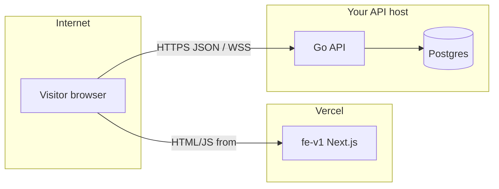

# Deploy the frontend (Vercel) and the API (separately)

This guide walks through **why** the stack is split and **what to do**, in order, so `apps/fe-v1` on Vercel can load markets and other data from your **public** Go API—without calling `http://127.0.0.1:8080` from your users’ browsers.

For a compact reference table and copy-paste env snippets, see [README.md § Production deployment](../README.md#production-deployment).

---

## 1. What is going wrong if you only deploy Vercel?

| What Vercel runs | What Vercel does **not** run |
|------------------|------------------------------|
| The **Next.js** app in `apps/fe-v1` | The **Go API** in `apps/backend` |
| Static pages + server runtime for that app | **Postgres**, **indexer**, or **migrations** as long-lived services |

The browser loads your site from `https://*.vercel.app` (or your custom domain). Any request to **`http://127.0.0.1:8080`** is interpreted as “the user’s own computer,” not your server—so the API appears **not reachable**.

The frontend reads **`NEXT_PUBLIC_API_URL`** at **build time** (inlined into the client bundle). If that value is missing or still points at localhost, production will not talk to a real API.



---

## 2. Prerequisites (mental model)

You will operate **two deployments**:

1. **Frontend:** Vercel project with root directory `apps/fe-v1` (see [`apps/fe-v1/vercel.json`](../apps/fe-v1/vercel.json): install from monorepo root, `pnpm --filter fe-v1 build`).
2. **Backend:** One **public HTTPS** URL for the HTTP API (e.g. `https://api.example.com`), running the image built from [`apps/backend/Dockerfile`](../apps/backend/Dockerfile) with **`SERVICE=api`**, plus managed **Postgres** and usually a separate **`SERVICE=indexer`** worker.

Optional but common:

- **Migrator:** Same Docker image with **`SERVICE=migrator`**—run as a **release / predeploy job** whenever the database schema changes, **before** starting new API containers.
- **Docs:** Separate Vercel project rooted at `apps/docs` if you ship docs in production.

**Optional — HTTP API on Vercel:** You can deploy **`apps/backend`** (`cmd/api`) with Vercel’s **Go** preset instead of a container host. Postgres and the **indexer** stay outside Vercel. Full walkthrough: **[vercel-backend.md](vercel-backend.md)**.

---

## Step A — Deploy the API (not on Vercel)

Do this **first** (or in parallel), but you need a working API URL before the production frontend is useful.

### A.1 Choose a host

Pick any platform that can run a **container** (or your binary) and attach **TLS**:

- Examples: Fly.io, Railway, Render, Google Cloud Run, AWS ECS, DigitalOcean App Platform, or a VPS with Docker + reverse proxy (Caddy, nginx, Traefik).

You must end up with:

- **`https://api.yourdomain.com`** (or similar)—**HTTPS**, valid certificate.
- Postgres reachable from that service (managed DB is typical).

### A.2 Environment variables (API process)

Align with [README.md § Production deployment](../README.md#production-deployment):

| Variable | Purpose |
|----------|---------|
| `PORT` | Listen port inside the container (often `8080`; your platform may map it to 443 externally). |
| `DATABASE_URL` | Postgres connection string. Managed providers usually need **`sslmode=require`**. |
| `RPC_URL` | JSON-RPC for your chain (e.g. Base Sepolia)—see README examples. |

See also the commented **production API** block in [`.env.example`](../.env.example).

### A.3 Build and run the API container

The Docker image is built from the **monorepo** context so it can copy `package/abi` as in the Dockerfile.

Conceptually:

```bash
# From monorepo root — example only; exact flags depend on your host.
docker build -f apps/backend/Dockerfile --build-arg SERVICE=api -t retropick-api .
```

Run the container with the env vars above. Your host’s docs explain how to map `PORT`, secrets, and HTTPS.

### A.4 Run migrations when the schema changes

Use the **same image** with **`SERVICE=migrator`** as a **one-off job** (or CI step) **before** rolling out a new API version after schema updates—see the README table (“Migrator | Release/predeploy job”).

If you skip migrations, the API may fail health checks or queries against an outdated database.

### A.5 Indexer (recommended for full behavior)

The **indexer** is a separate long-lived process: same `Dockerfile`, **`SERVICE=indexer`**, same `DATABASE_URL` / `RPC_URL` as the API. It typically does **not** need a public URL.

---

## Step B — Configure Vercel for `fe-v1`

### B.1 Open the correct project

In Vercel, select the project whose **root directory** is **`apps/fe-v1`** (monorepo subdirectory).

Confirm build settings match the repo (or rely on [`vercel.json`](../apps/fe-v1/vercel.json)):

- **Install:** `cd ../.. && pnpm install`
- **Build:** `cd ../.. && pnpm --filter fe-v1 build`

### B.2 Set environment variables

**Settings → Environment Variables**

| Name | Value | Notes |
|------|--------|------|
| `NEXT_PUBLIC_API_URL` | `https://api.yourdomain.com` | **No** `localhost` or `127.0.0.1`. HTTPS avoids mixed-content issues with your HTTPS Vercel app. |
| `NEXT_PUBLIC_DOCS_URL` | e.g. `https://docs.yourdomain.com/docs` | Only if you use the docs site in production. |

Apply to **Production** and, if you want preview deployments to work against a real API, also to **Preview**.

### B.3 Redeploy

After **adding or changing** any `NEXT_PUBLIC_*` variable, trigger a **new deployment** (redeploy). Next.js embeds these values at **build** time; changing the variable without rebuilding leaves old URLs in the bundle.

Template names for copy-paste live in [`apps/fe-v1/.env.production.example`](../apps/fe-v1/.env.production.example).

### B.4 Build guard (expected failures)

If [`apps/fe-v1/next.config.mjs`](../apps/fe-v1/next.config.mjs) includes a check for `process.env.VERCEL`, Vercel’s build will **fail** when:

- `NEXT_PUBLIC_API_URL` is missing, or  
- It points at **localhost** / **127.0.0.1**

That is intentional: it prevents shipping a site that cannot reach a real API. Fix **Step B.2** and redeploy.

---

## Step C — Lock down CORS on the API

Browsers send an **Origin** header (your Vercel URL). Your Go API must allow that origin when `CORS_STRICT=1`.

Set on the **deployed API** (see [README.md](../README.md#production-deployment)):

```bash
CORS_STRICT=1
CORS_ALLOWED_ORIGINS=https://app.example.com,https://your-app.vercel.app
# Optional: all Vercel preview URLs
CORS_ALLOWED_ORIGIN_PATTERNS=https://*.vercel.app
```

Implementation reference: [`apps/backend/internal/api/cors.go`](../apps/backend/internal/api/cors.go).

**Symptom if misconfigured:** Browser console shows CORS errors; network tab shows blocked responses even when `curl` from your laptop works.

---

## Step D — Smoke-test

From any machine (replace the host):

```bash
curl -sS https://api.yourdomain.com/api/v1/health
curl -sS https://api.yourdomain.com/api/v1/markets
```

- Expect **HTTP 200** and JSON bodies (empty markets list is still a success if the API is up).

Then open your **Vercel** URL in a browser and confirm the UI loads markets (or whatever screen previously showed “not reachable”).

---

## 3. Troubleshooting checklist

| Symptom | Likely cause | What to check |
|---------|----------------|---------------|
| `127.0.0.1:8080 is not reachable` in the UI | Client still using local API URL | `NEXT_PUBLIC_API_URL` on Vercel + **redeploy** after setting it. |
| Vercel build error about `NEXT_PUBLIC_API_URL` | Build guard | Set a public HTTPS API URL; remove localhost. |
| `curl` works; browser fails | CORS | `CORS_ALLOWED_ORIGINS` / patterns include your exact Vercel origin (`https://...`). |
| API errors over HTTP from HTTPS site | Mixed content | Use **HTTPS** for `NEXT_PUBLIC_API_URL`. |
| DB errors on API startup | Migrations / `DATABASE_URL` | Run migrator job; verify `sslmode` and credentials. |

---

## 4. “Ask mode” vs “Agent mode” (Cursor)

- **Ask mode:** The assistant can explain and point to files but will not edit the repo or run commands for you.
- **Agent mode:** The assistant can apply changes (e.g. config tweaks, docs, scripts) within your project.

Deploying to **Fly/Railway/Vercel** still requires **your** accounts and secrets; the assistant cannot replace that, but it can help you tune env vars and scripts once you switch modes.

---

## 5. Quick order recap

1. Deploy **Postgres** + **API** (`SERVICE=api`) at **`https://api...`**; run **`SERVICE=migrator`** when schema changes; run **indexer** if you rely on it.
2. Set **`NEXT_PUBLIC_API_URL`** (and docs URL if needed) on **Vercel** → **redeploy** `fe-v1`.
3. Set **CORS** on the API for your Vercel origins.
4. **curl** health/markets, then verify in the browser.
