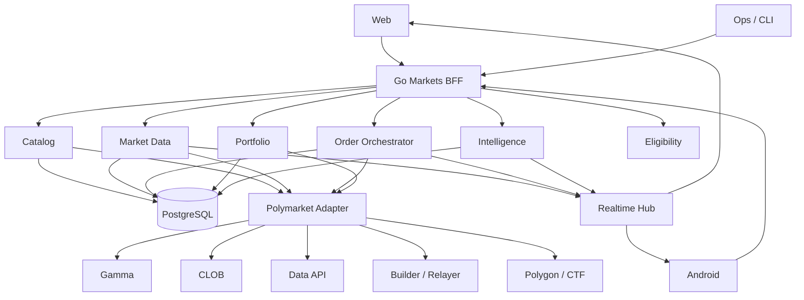

# RetroPick Polymarket Reference Architecture & Integration Manual
> Deep engineering reference for the local `retropick-polymarket/` source lab and `RetroPick/monorepo-base`.
>
> Goal: explain what every cloned repository does, how its architecture works, which patterns RetroPick should adapt, which patterns RetroPick should reject, and how to integrate the useful parts into a production-grade Polymarket-native Markets V1.
**Research baseline:** 2026-08-10
**RetroPick target repository:** `https://github.com/RetroPick/monorepo-base`
**Reference workspace:** `~/dev/set-up/references/retropick-polymarket/`
**Important:** This directory is a source-study lab. Do not merge these repositories wholesale into RetroPick and do not add them as nested Git repositories inside the RetroPick monorepo.
## 1. Executive architecture decision
RetroPick should not become a fork of any single Polymarket terminal.
The current RetroPick architecture already provides the correct product boundary:
- RetroPick Markets is Polymarket-native.
- Polymarket remains the venue, liquidity source, order book, conditional-token system, and settlement authority.
- RetroPick does not issue Markets outcome tokens.
- PRISM remains a separate structured-outcome product.
- The old MarketEngine epoch product is archived and must not be revived for Markets.
- The Go Markets BFF is the stable server-side product boundary.
- Web and Android consume canonical RetroPick APIs and schemas.
- Upstream Polymarket data must be normalized through an anti-corruption layer.
- PostgreSQL projections remain the durable read model.
- Realtime correctness must be snapshot-first and explicitly represent stale/resync states.
The reference corpus should therefore be used as a pattern library:
```text
OFFICIAL POLYMARKET AUTHORITY
├── polymarket-ts-sdk
├── polymarket-cli
└── polymarket-wagmi-builder
        │
        ▼
RETROPICK POLYMARKET ANTI-CORRUPTION LAYER
├── Gamma adapter
├── CLOB REST adapter
├── CLOB realtime adapter
├── Data API adapter
├── Builder signer
├── Relayer adapter
└── CTF / Polygon adapter
        │
        ▼
RETROPICK GO BFF + POSTGRES
├── catalog
├── market data
├── realtime
├── order preview
├── order state machine
├── reconciliation
├── portfolio
├── intelligence
└── eligibility
        │
        ▼
RETROPICK PRODUCTS
├── Web terminal
├── Android
├── Portfolio
├── Trader intelligence
└── Alerts / Research
```
## 2. Current RetroPick architecture to preserve
The current main branch of `RetroPick/monorepo-base` should remain the authority for new Markets work.
### 2.1 Product boundaries
- `Markets` — Polymarket-native discovery, execution, portfolio, analytics.
- `PRISM` — future RetroPick-issued structured outcomes.
- `Legacy epoch v1` — archived, claim/history only if required.
### 2.2 Active repository responsibilities
```text
apps/web
  Next.js Markets product
apps/android
  Kotlin/Jetpack Compose Markets client
apps/backend
  Go Markets API, workers, projection/reconciliation logic
packages/polymarket
  Shared client/realtime/generated API types
schemas/openapi
  Canonical Web + Android API contract
deploy
  Per-product deployment configuration
archive
  Frozen historical epoch code
```
### 2.3 Existing Markets BFF concepts
- Eligibility endpoint.
- Capabilities endpoint.
- Projected Gamma events.
- Projected market detail.
- CLOB orderbook snapshot.
- CLOB price history.
- Liquidity/market health.
- Deterministic intelligence signals.
- Liveness.
- Readiness/degraded state.
### 2.4 Existing realtime discipline
- `idle`
- `connecting`
- `snapshot_wait`
- `live`
- `degraded`
- `resyncing`
- `polling_fallback`
This is stronger than the typical third-party terminal pattern. New reference-derived code must preserve these correctness properties.
## 3. Reference corpus
| Local directory | Upstream | Primary use |
|---|---|---|
| `humanplane-terminal` | `humanplane/terminal` | Terminal UX + realtime |
| `polymarket-ts-sdk` | `Polymarket/ts-sdk` | Official TypeScript API |
| `polymarket-wagmi-builder` | `Polymarket/wagmi-safe-builder-example` | Builder + Safe + relayer |
| `polymarket-cli` | `Polymarket/polymarket-cli` | Official lifecycle behavior |
| `polyterm` | `NYTEMODEONLY/polyterm` | Intelligence and research |
| `polymarket-trade-engine` | `KaustubhPatange/polymarket-trade-engine` | Execution state machine |
| `txbaba-polyterminal` | `txbabaxyz/polyterminal` | Fast crypto terminal |
| `polyrec` | `txbabaxyz/polyrec` | Quantitative multi-feed telemetry |
| `polymarket-orderbook-tui` | `harish-garg/Command-Line-Trading-TUI-for-Polymarket` | Minimal book WebSocket |
| `direktur-polymarket-terminal` | `direkturcrypto/polymarket-terminal` | Execution failure modes / CTF |
## 4. Deep reviews of every repository
## 4.1 `humanplane-terminal`
**Role:** Best terminal UX and realtime reference.
### Architecture
- Rust/axum backend proxy.
- SolidJS single-page application.
- Gamma, CLOB, and Data API integration.
- Backend WebSocket to Polymarket with SSE fanout to browser.
- Client-side orderbook reducer.
- TanStack Query for server state.
- viem/browser wallet interaction.
- Self-custodial signing.
### Source-confirmed features to study
- 10,000+ market browsing.
- Debounced search.
- Collapsible events.
- Live price changes.
- Live orderbook.
- Price chart.
- Trade tape.
- Top holders.
- Trade ticket.
- Trader leaderboard.
- Trader open/closed positions.
- Trader trades/activity.
- Favorites.
- Keyboard navigation.
- EOA mode.
- Safe funder mode.
- Market and limit orders.
- Orderbook walk for estimated market fill.
- Open order list.
- Cancellation.
- Friendly CLOB errors.
### What RetroPick should adapt
- Use its information density as the main RetroPick terminal UX reference.
- Port the Book/Tape/Holders/Trade panel concept.
- Port keyboard navigation into an optional professional mode.
- Use requestAnimationFrame-throttled rendering for high-frequency book updates.
- Use an isolated pure orderbook reducer.
- Add trader/holder drill-down to RetroPick through BFF endpoints.
- Show market order estimated average price and worst acceptable price.
- Keep read-only product fully functional without wallet connection.
- Create refresh-safe deep links for event, market, trader, and portfolio pages.
### What RetroPick should not copy
- Do not replace the Go BFF with its Rust backend.
- Do not let browser clients become the canonical upstream integration.
- Do not store sensitive user credentials in localStorage.
- Do not assume its SDK package choices remain current.
- Do not use one independent upstream WebSocket per UI component.
### Recommended RetroPick destination
- `apps/web/src/products/markets/terminal/`
- `apps/web/src/products/markets/traders/`
- `apps/backend/internal/markets/realtime/`
- `apps/backend/internal/markets/marketdata/`
- `packages/polymarket/src/realtime.ts`
### Porting rules
- [ ] Record the upstream commit SHA.
- [ ] Confirm the upstream license.
- [ ] Identify exact source files used as references.
- [ ] Check for deprecated Polymarket packages.
- [ ] Check for private-key or secret assumptions.
- [ ] Re-implement behind a RetroPick-owned interface.
- [ ] Add deterministic unit tests.
- [ ] Add failure-path tests.
- [ ] Add compatibility fixtures.
- [ ] Add an ADR if a core architecture boundary changes.
## 4.2 `polymarket-ts-sdk`
**Role:** Official current TypeScript API compatibility reference.
### Architecture
- pnpm workspace.
- `packages/client` official public client.
- `packages/types` shared SDK types.
- `packages/bindings` generated/internal bindings.
- `examples/scripts` executable examples.
### Source-confirmed features to study
- Typed Polymarket client.
- Market listing.
- Shared upstream type definitions.
- Generated endpoint bindings.
- Runnable examples.
- Semantic-versioned SDK distribution.
### What RetroPick should adapt
- Use official SDK types as upstream compatibility evidence.
- Create RetroPick fixtures derived from official SDK responses.
- Compare Go adapter behavior with official TS client behavior.
- Track SDK versions explicitly.
- Use official scripts as black-box reference workflows.
- Build contract tests that prove RetroPick normalization does not leak upstream shape.
### What RetroPick should not copy
- Do not expose raw SDK types directly to RetroPick clients.
- Do not make Android depend on TypeScript models.
- Do not persist SDK object shapes one-to-one in PostgreSQL.
- Do not import internal generated bindings as application contracts.
### Recommended RetroPick destination
- `packages/polymarket/`
- `apps/backend/internal/markets/venue/polymarket/`
- `schemas/fixtures/polymarket/`
- `docs/compatibility/`
### Porting rules
- [ ] Record the upstream commit SHA.
- [ ] Confirm the upstream license.
- [ ] Identify exact source files used as references.
- [ ] Check for deprecated Polymarket packages.
- [ ] Check for private-key or secret assumptions.
- [ ] Re-implement behind a RetroPick-owned interface.
- [ ] Add deterministic unit tests.
- [ ] Add failure-path tests.
- [ ] Add compatibility fixtures.
- [ ] Add an ADR if a core architecture boundary changes.
## 4.3 `polymarket-wagmi-builder`
**Role:** Official Builder/Safe/onboarding integration reference.
### Architecture
- Next.js.
- wagmi.
- React Query.
- Wallet abstraction provider.
- Trading provider.
- ethers + viem interoperability.
- Remote Builder signing endpoint.
- Builder Relayer client.
- Safe derivation/deployment.
### Source-confirmed features to study
- Browser wallet connection.
- Safe derivation.
- Safe deployment.
- User API credentials.
- Token approval checks.
- Batch approvals.
- Authenticated CLOB client.
- Builder attribution.
- Gasless relayer operations.
### What RetroPick should adapt
- Use remote Builder signing as the only Builder-secret pattern.
- Separate wallet state from trading-session state.
- Implement a trading-readiness state machine.
- Check Safe deployment before trading.
- Check approvals before presenting the user as ready.
- Separate new-user and returning-user initialization.
- Expose capability state from backend.
- Keep frontend UX composable and provider-independent.
### What RetroPick should not copy
- Do not keep Builder credentials in browser-accessible environment variables.
- Do not store user CLOB credentials in localStorage in production.
- Do not make React hooks the authority for eligibility.
- Do not hard-code approval addresses without official version/config validation.
- Do not assume Builder demo code has production-grade session security.
### Recommended RetroPick destination
- `apps/web/src/products/markets/wallet/`
- `apps/web/src/products/markets/trading/`
- `apps/backend/internal/markets/builder/`
- `apps/backend/internal/markets/orders/`
- `apps/backend/internal/markets/eligibility/`
### Porting rules
- [ ] Record the upstream commit SHA.
- [ ] Confirm the upstream license.
- [ ] Identify exact source files used as references.
- [ ] Check for deprecated Polymarket packages.
- [ ] Check for private-key or secret assumptions.
- [ ] Re-implement behind a RetroPick-owned interface.
- [ ] Add deterministic unit tests.
- [ ] Add failure-path tests.
- [ ] Add compatibility fixtures.
- [ ] Add an ADR if a core architecture boundary changes.
## 4.4 `polymarket-cli`
**Role:** Official behavioral oracle covering the broadest venue lifecycle.
### Architecture
- Rust CLI.
- Wallet/auth module.
- Command modules.
- Output modules.
- Human-readable table mode.
- Machine-readable JSON mode.
### Source-confirmed features to study
- Markets.
- Events.
- Tags.
- Series.
- Comments.
- Profiles.
- Sports.
- Price.
- Midpoint.
- Spread.
- Orderbook.
- Price history.
- Tick size.
- Fee rate.
- Neg-risk metadata.
- Geoblock.
- Limit orders.
- Market orders.
- Batch posting.
- Cancellation.
- Orders.
- Trades.
- Balances.
- Rewards.
- API keys.
- Positions.
- Activity.
- Holders.
- Open interest.
- Leaderboards.
- Approvals.
- CTF split.
- CTF merge.
- CTF redeem.
- Negative-risk redeem.
- Bridge/deposit data.
### What RetroPick should adapt
- Use CLI command coverage as the execution and lifecycle acceptance checklist.
- Add black-box integration tests comparing read behavior.
- Create `retro markets` operator commands with JSON output.
- Use official fee/tick/neg-risk queries as order preview dependencies.
- Model signer and funder independently.
- Use geoblock information as one input to fail-closed eligibility.
### What RetroPick should not copy
- Do not copy its private-key configuration model for normal users.
- Do not make the CLI binary a backend runtime dependency.
- Do not assume experimental command behavior never changes.
### Recommended RetroPick destination
- `apps/backend/internal/markets/orders/`
- `apps/backend/internal/markets/portfolio/`
- `apps/backend/internal/markets/ctf/`
- `apps/backend/internal/markets/eligibility/`
- `bin/retro` or operator CLI
### Porting rules
- [ ] Record the upstream commit SHA.
- [ ] Confirm the upstream license.
- [ ] Identify exact source files used as references.
- [ ] Check for deprecated Polymarket packages.
- [ ] Check for private-key or secret assumptions.
- [ ] Re-implement behind a RetroPick-owned interface.
- [ ] Add deterministic unit tests.
- [ ] Add failure-path tests.
- [ ] Add compatibility fixtures.
- [ ] Add an ADR if a core architecture boundary changes.
## 4.5 `polyterm`
**Role:** Best intelligence, research, whale, risk, alert, and agent-tooling reference.
### Architecture
- Python CLI/TUI.
- Local SQLite state.
- API/core analytics modules.
- Alert subsystem.
- Agent schemas.
- MCP/JSONL tooling.
- Research archive.
### Source-confirmed features to study
- Market monitor.
- Whales.
- Wallet-level whale activity.
- Arbitrage scanner.
- Cross-venue monitor.
- NegRisk analysis.
- Signal-based predictions.
- Research briefs.
- Trade thesis.
- Orderbook analytics.
- Wallet analysis.
- Wallet clusters.
- Alerts.
- Risk grading.
- Rewards estimation.
- News.
- Charts.
- Compare.
- Calendar.
- Bookmarks.
- Agent manifest.
- Agent schemas.
- MCP tools.
- Research archive.
### What RetroPick should adapt
- Use its feature taxonomy for RetroPick Intelligence.
- Make all RetroPick signals evidence-based and deterministic first.
- Implement movers, whale observations, spread/depth signals, and rule-change signals.
- Add research briefs that show evidence, missing data, freshness, and caveats.
- Add alert rules as a first-class product subsystem.
- Use trader/wallet analytics as research context rather than trade authority.
- Consider read-only agent/MCP integration after APIs are stable.
### What RetroPick should not copy
- Do not present opaque score outputs as factual probability.
- Do not automatically copy trades based on smart-money labels.
- Do not use SQLite as RetroPick production storage.
- Do not allow LLM narration to invent prices, rules, or evidence.
- Do not add cross-venue execution without separate compliance and venue architecture review.
### Recommended RetroPick destination
- `apps/backend/internal/markets/intelligence/`
- `apps/backend/internal/markets/research/`
- `apps/backend/internal/markets/alerts/`
- `apps/web/src/products/markets/intelligence/`
- `apps/web/src/products/markets/traders/`
### Porting rules
- [ ] Record the upstream commit SHA.
- [ ] Confirm the upstream license.
- [ ] Identify exact source files used as references.
- [ ] Check for deprecated Polymarket packages.
- [ ] Check for private-key or secret assumptions.
- [ ] Re-implement behind a RetroPick-owned interface.
- [ ] Add deterministic unit tests.
- [ ] Add failure-path tests.
- [ ] Add compatibility fixtures.
- [ ] Add an ADR if a core architecture boundary changes.
## 4.6 `polymarket-trade-engine`
**Role:** Execution lifecycle, recovery, persistence, simulation reference.
### Architecture
- TypeScript/Bun.
- Top-level engine loop.
- Per-market lifecycle object.
- Event-driven strategy callbacks.
- Persistent engine state.
- Orderbook/user WebSocket integration.
### Source-confirmed features to study
- Market discovery.
- Orderbook subscription.
- Order placement.
- Fill tracking.
- PnL accounting.
- INIT/RUNNING/STOPPING/DONE state model.
- Order expiration.
- Fill/failure callbacks.
- Emergency exit mechanisms.
- Session loss limits.
- State recovery.
- Graceful shutdown.
- Simulation mode.
### What RetroPick should adapt
- Implement explicit RetroPick order and reconciliation state machines.
- Persist user intent before submission.
- Persist every upstream attempt.
- Recover unfinished orders after process restart.
- Build deterministic simulation adapters.
- Treat expirations and partial fills as first-class.
- Make shutdown reconciliation-aware.
- Add fault-injection tests based on lifecycle transitions.
### What RetroPick should not copy
- Do not expose automated strategies as V1 product scope.
- Do not persist production state to local JSON files.
- Do not use server-held user private keys.
- Do not couple RetroPick lifecycle to crypto 5m/15m market naming.
- Do not retry ambiguous submissions without idempotency and venue-state reconciliation.
### Recommended RetroPick destination
- `apps/backend/internal/markets/orders/state/`
- `apps/backend/internal/markets/orders/reconcile/`
- `apps/backend/internal/markets/sim/`
- PostgreSQL order intent/attempt tables
### Porting rules
- [ ] Record the upstream commit SHA.
- [ ] Confirm the upstream license.
- [ ] Identify exact source files used as references.
- [ ] Check for deprecated Polymarket packages.
- [ ] Check for private-key or secret assumptions.
- [ ] Re-implement behind a RetroPick-owned interface.
- [ ] Add deterministic unit tests.
- [ ] Add failure-path tests.
- [ ] Add compatibility fixtures.
- [ ] Add an ADR if a core architecture boundary changes.
## 4.7 `txbaba-polyterminal`
**Role:** Fast crypto-market terminal workflow reference.
### Architecture
- Python terminal application.
- CLOB/WebSocket trading.
- Utility scripts for balance, approvals, keys, redemption.
- Telegram integration.
- Rotating logs.
### Source-confirmed features to study
- BTC/ETH/SOL/XRP short-duration markets.
- Live trading.
- WebSocket prices.
- Session P/L.
- Automatic redemption.
- Keyboard controls.
- Market switching.
- Order mode switching.
- Balance/allowance tooling.
### What RetroPick should adapt
- Build a fast crypto market switcher.
- Keep a persistent order ticket for professional users.
- Add session P/L to portfolio/terminal.
- Make redemption state visible.
- Separate balance/approval readiness from order execution.
- Add structured operational logs.
### What RetroPick should not copy
- Do not implement geo-restriction bypass guidance.
- Do not hold user private keys in backend environment variables.
- Do not make Telegram a trusted trading authorization channel.
- Do not treat rotating files as canonical trade records.
- Do not trust third-party token/collateral naming over current official documentation.
### Recommended RetroPick destination
- `apps/web/src/products/markets/crypto/`
- `apps/backend/internal/markets/portfolio/`
- `apps/backend/internal/markets/ctf/`
### Porting rules
- [ ] Record the upstream commit SHA.
- [ ] Confirm the upstream license.
- [ ] Identify exact source files used as references.
- [ ] Check for deprecated Polymarket packages.
- [ ] Check for private-key or secret assumptions.
- [ ] Re-implement behind a RetroPick-owned interface.
- [ ] Add deterministic unit tests.
- [ ] Add failure-path tests.
- [ ] Add compatibility fixtures.
- [ ] Add an ADR if a core architecture boundary changes.
## 4.8 `polyrec`
**Role:** Multi-feed quantitative market telemetry and replay reference.
### Architecture
- Python realtime dashboard.
- Binance WebSocket.
- Polymarket WebSocket.
- Chainlink/RTDS feed.
- CSV event logging.
- Backtest scripts.
### Source-confirmed features to study
- Oracle price.
- External spot price.
- Polymarket book.
- Returns.
- ATR.
- VWAP.
- Volume spikes.
- Multi-level orderbook logging.
- Spread.
- Imbalance.
- Microprice.
- Slope.
- Replay/backtesting.
### What RetroPick should adapt
- Create a normalized source-observation model.
- Persist timestamps and source freshness.
- Add deterministic spread/depth/imbalance/microprice calculations.
- Add external spot/oracle divergence only where it is relevant to market meaning.
- Create replayable datasets for regression tests.
- Build backtests for analytics, not for settlement accounting.
### What RetroPick should not copy
- Do not put the monolithic dashboard into production.
- Do not make Binance authoritative for Polymarket settlement.
- Do not silently fall back from one feed to another.
- Do not use floating-point research calculations for monetary accounting.
- Do not claim causality from correlations.
### Recommended RetroPick destination
- `apps/backend/internal/markets/analytics/`
- `apps/backend/internal/markets/marketdata/`
- `apps/backend/internal/markets/replay/`
- `apps/web` advanced analytics panels
### Porting rules
- [ ] Record the upstream commit SHA.
- [ ] Confirm the upstream license.
- [ ] Identify exact source files used as references.
- [ ] Check for deprecated Polymarket packages.
- [ ] Check for private-key or secret assumptions.
- [ ] Re-implement behind a RetroPick-owned interface.
- [ ] Add deterministic unit tests.
- [ ] Add failure-path tests.
- [ ] Add compatibility fixtures.
- [ ] Add an ADR if a core architecture boundary changes.
## 4.9 `polymarket-orderbook-tui`
**Role:** Small isolated WebSocket/orderbook reference.
### Architecture
- TypeScript/Node.
- Compact API layer.
- Terminal UI.
- Realtime WebSocket book.
### Source-confirmed features to study
- Realtime Polymarket orderbook.
- Small codebase useful for transport study.
### What RetroPick should adapt
- Use it as a minimal parser/reducer reference.
- Extract validated fixture cases.
- Use it to create a RetroPick developer orderbook diagnostic command.
### What RetroPick should not copy
- Do not infer production reliability from a small demo.
- Do not bypass snapshot/freshness/resync controls.
- Do not let terminal presentation define domain models.
### Recommended RetroPick destination
- `tools/markets-orderbook-debug/`
- `packages/polymarket` fixture tests
- `retro markets book`
### Porting rules
- [ ] Record the upstream commit SHA.
- [ ] Confirm the upstream license.
- [ ] Identify exact source files used as references.
- [ ] Check for deprecated Polymarket packages.
- [ ] Check for private-key or secret assumptions.
- [ ] Re-implement behind a RetroPick-owned interface.
- [ ] Add deterministic unit tests.
- [ ] Add failure-path tests.
- [ ] Add compatibility fixtures.
- [ ] Add an ADR if a core architecture boundary changes.
## 4.10 `direktur-polymarket-terminal`
**Role:** Advanced failure-mode, fill reconciliation, and CTF lifecycle research reference.
### Architecture
- Node.js automated strategies.
- Separate CLOB client wrapper.
- Market detector.
- WebSocket fill watcher.
- CTF service.
- Execution service.
### Source-confirmed features to study
- Maker strategy.
- Copy trading.
- Orderbook sniper.
- YES+NO merge flow.
- On-chain balance reconciliation.
- Ghost-fill recovery concept.
- One-sided exposure protection.
- Simulation commands.
### What RetroPick should adapt
- Model disagreement between CLOB fill state and on-chain balance.
- Use chain/data evidence as an independent reconciliation source.
- Make CTF merge/redeem explicit transformations.
- Stop automated progression after inconsistent state.
- Create ghost-fill and one-sided-fill test cases.
- Separate market detection, execution, fill watching, and CTF logic.
### What RetroPick should not copy
- Do not ship market-making, copy-trading, or sniping as Markets V1 core scope.
- Do not describe paired execution as guaranteed profit without accounting for execution risk, fees, and partial fills.
- Do not infer fills from one source only.
- Do not use server-side user private keys.
### Recommended RetroPick destination
- `apps/backend/internal/markets/reconciliation/`
- `apps/backend/internal/markets/ctf/`
- `apps/backend/internal/markets/orders/`
- fault/chaos test suite
### Porting rules
- [ ] Record the upstream commit SHA.
- [ ] Confirm the upstream license.
- [ ] Identify exact source files used as references.
- [ ] Check for deprecated Polymarket packages.
- [ ] Check for private-key or secret assumptions.
- [ ] Re-implement behind a RetroPick-owned interface.
- [ ] Add deterministic unit tests.
- [ ] Add failure-path tests.
- [ ] Add compatibility fixtures.
- [ ] Add an ADR if a core architecture boundary changes.
## 5. Cross-reference feature matrix
| Capability | References | RetroPick use |
|---|---|---|
| Discovery | HumanPlane, CLI, PolyTerm | Expand current catalog UX. |
| Terminal shell | HumanPlane | Primary UI inspiration. |
| Orderbook | HumanPlane, PolyTerm, TUI, polyrec | One canonical RetroPick realtime stack. |
| Tape | HumanPlane, CLI | Normalize through BFF. |
| Holders | HumanPlane, CLI | Add read-only holders endpoint. |
| Trader leaderboard | HumanPlane, CLI, PolyTerm | Professional research. |
| Trader profile | HumanPlane, PolyTerm | Public-data-only drill-down. |
| Wallet connect | Builder example, HumanPlane | Official Builder patterns first. |
| Safe | Builder example, HumanPlane | Capability-driven. |
| Approvals | Builder example, CLI | Server-visible readiness. |
| Builder attribution | Builder example | Official source of truth. |
| Limit order | CLI, HumanPlane | V1. |
| Marketable order | CLI, HumanPlane | Bounded slippage only. |
| Cancel | CLI, HumanPlane | V1. |
| Partial fills | Trade engine | Explicit state. |
| Portfolio | CLI, HumanPlane | Orders + fills + balances. |
| CTF split/merge/redeem | CLI, direktur | Phase 2. |
| Neg Risk | CLI, Builder example, PolyTerm | Capability gate. |
| Whales | PolyTerm | Intelligence. |
| Signals | PolyTerm, polyrec | Evidence-based. |
| Quant health | polyrec | Advanced analytics. |
| Simulation | Trade engine, direktur | Mandatory testing. |
| Ghost fill | direktur | Failure test. |
| Session P/L | txbaba, trade engine | Portfolio UX. |
| Alerts | PolyTerm, txbaba | Product subsystem. |
## 6. Target runtime architecture

## 7. Ownership and authority
| Concern | Authority | RetroPick responsibility |
|---|---|---|
| Market/event metadata | Polymarket | RetroPick normalizes and caches. |
| Resolution rule/source | Polymarket | RetroPick preserves provenance. |
| Orderbook | Polymarket CLOB | RetroPick validates snapshot/deltas. |
| Market price | Polymarket market data | RetroPick may derive midpoint/analytics. |
| User order intent | RetroPick | Persist before submission. |
| User signature | User wallet | Never generated from a server-held user key. |
| Builder credential | RetroPick backend | Never browser-exposed. |
| Venue order state | Polymarket | Projected and reconciled. |
| Position token balance | Polygon/Data API | Reconciled. |
| Signal | RetroPick | Derived, versioned, evidence-based. |
## 8. Recommended source layout
- `apps/web/src/products/markets/discover/`
- `apps/web/src/products/markets/event/`
- `apps/web/src/products/markets/market/`
- `apps/web/src/products/markets/terminal/`
- `apps/web/src/products/markets/trading/`
- `apps/web/src/products/markets/wallet/`
- `apps/web/src/products/markets/portfolio/`
- `apps/web/src/products/markets/traders/`
- `apps/web/src/products/markets/intelligence/`
- `apps/web/src/products/markets/alerts/`
- `apps/backend/internal/markets/venue/polymarket/`
- `apps/backend/internal/markets/catalog/`
- `apps/backend/internal/markets/marketdata/`
- `apps/backend/internal/markets/realtime/`
- `apps/backend/internal/markets/orders/preview/`
- `apps/backend/internal/markets/orders/state/`
- `apps/backend/internal/markets/orders/submit/`
- `apps/backend/internal/markets/orders/cancel/`
- `apps/backend/internal/markets/orders/reconcile/`
- `apps/backend/internal/markets/portfolio/`
- `apps/backend/internal/markets/builder/`
- `apps/backend/internal/markets/wallet/`
- `apps/backend/internal/markets/eligibility/`
- `apps/backend/internal/markets/ctf/`
- `apps/backend/internal/markets/intelligence/`
- `apps/backend/internal/markets/analytics/`
- `apps/backend/internal/markets/research/`
- `apps/backend/internal/markets/alerts/`
- `apps/backend/internal/markets/sim/`
- `packages/polymarket/src/`
- `schemas/openapi/`
- `schemas/events/`
- `schemas/fixtures/polymarket/`
## 9. Canonical domain models
### VenueReference
- venue
- event upstream ID
- market upstream ID
- condition ID
- token ID
- chain ID
- negative-risk identifier
- upstream version
- observed timestamp
### Event
- internal ID
- venue reference
- title
- description
- category/tags
- markets
- status
- open/close metadata
- provenance
- freshness
### Market
- internal ID
- event ID
- question
- status
- outcomes
- condition ID
- resolution source
- rules
- close time
- tick size
- fee context
- negative-risk capability
- freshness
### Outcome
- outcome ID
- label
- token ID
- best bid
- best ask
- midpoint
- last trade
- price provenance
### OrderPreview
- preview ID
- market ID
- token ID
- side
- order type
- size/amount
- limit price
- worst acceptable price
- estimated fill
- estimated average price
- fee
- max loss
- max payout
- book identity
- book observed time
- expiry
- eligibility version
### OrderIntent
- intent ID
- user/session
- wallet signer
- funder
- preview hash
- signed payload hash
- idempotency key
- created time
- expiration
- state
### VenueOrder
- venue order ID
- intent ID
- market/token
- requested size
- filled size
- price
- order type
- venue state
- created/updated time
### Fill
- fill ID
- venue order ID
- price
- size
- fee
- observed time
- settlement reference
### Position
- funder
- market/outcome
- token balance
- cost basis
- realized PnL
- unrealized PnL
- claimable
- redeemable
- last reconciliation
### Signal
- signal ID
- market ID
- type
- severity
- score
- evidence
- source timestamps
- model version
- created time
- retracted time
## 10. Orderbook architecture
RetroPick should use HumanPlane for UX/performance inspiration but retain stricter correctness than the reference.
### 10.1 Required state machine
- `idle`
- `connecting`
- `snapshot_wait`
- `live`
- `degraded`
- `resyncing`
- `polling_fallback`
### 10.2 Invariants
- [ ] Never label data live before an authoritative snapshot.
- [ ] Never apply a delta to an unknown base state.
- [ ] Reject malformed price or size values.
- [ ] Reject backward observed timestamps.
- [ ] Reject stale stream epochs.
- [ ] Detect duplicate or missing delivery counters according to the stream contract.
- [ ] On integrity uncertainty, resync instead of guessing.
- [ ] Maintain token/market subscription identity.
- [ ] Carry observedAt and publishedAt separately.
- [ ] Keep reducer deterministic and independently testable.
- [ ] Throttle UI rendering independently from network ingestion.
- [ ] Background tabs may switch to polling fallback.
- [ ] Foreground recovery must reacquire or validate a snapshot.
- [ ] Book freshness must be visible to the trading ticket.
### 10.3 Derived book analytics
- best bid
- best ask
- spread
- midpoint
- depth by ticks
- notional depth
- book imbalance
- microprice
- slippage
- fillable quantity
- worst execution price
- liquidity health
## 11. Order preview
Order preview is the boundary where HumanPlane-style UX, CLI semantics, official Builder capabilities, and RetroPick policy converge.
### 11.1 Inputs
- user/session
- wallet signer
- funder
- market
- token
- side
- order type
- quantity/amount
- limit/worst price
- current tick size
- current fee rate
- fresh orderbook
- eligibility
- balance
- allowances
- market status
- capabilities
### 11.2 Outputs
- canonical normalized order
- estimated average fill
- estimated fillable amount
- worst acceptable fill
- builder fee
- venue fee
- maximum loss
- maximum payout
- partial-fill warning
- expiry
- book timestamp
- preview hash
- signing context
### 11.3 Rules
- [ ] Market orders must be represented as bounded marketable orders.
- [ ] Never translate market intent into unlimited slippage.
- [ ] Preview becomes invalid if market state materially changes.
- [ ] Preview becomes invalid after expiry.
- [ ] Preview becomes invalid if tick size changes.
- [ ] Preview becomes invalid when eligibility changes.
- [ ] Marketable preview must fail if book freshness exceeds policy.
## 12. Order execution state machine
- `draft`
- `previewed`
- `awaiting_signature`
- `signed`
- `submitting`
- `accepted`
- `open`
- `partially_filled`
- `filled`
- `cancel_pending`
- `cancelled`
- `expired`
- `rejected`
- `unknown_reconciling`
- `settlement_pending`
- `settled`
### 12.1 Submission invariants
- [ ] Persist intent before upstream submit.
- [ ] Persist an attempt record before network call.
- [ ] Require an idempotency key.
- [ ] Hash exact signed payload.
- [ ] Verify submitted fields match intended signed fields.
- [ ] Re-run eligibility before submit.
- [ ] Reject expired preview.
- [ ] Revalidate tick/fee/capability context.
- [ ] Do not alter user-signed order fields.
- [ ] Attach Builder attribution only according to official protocol.
- [ ] Do not blindly retry after ambiguous timeout.
- [ ] Ambiguous result becomes `unknown_reconciling`.
## 13. Builder and wallet architecture
### 13.1 Secret boundary
```text
Browser
├── wallet signer
├── public wallet address
├── user-visible order preview
└── NO Builder secret
RetroPick backend
├── Builder API key
├── Builder secret
├── Builder passphrase
├── remote signing endpoint
├── rate limits
└── audit logs
```
### 13.2 Trading readiness
- wallet disconnected
- wallet connected
- correct chain
- funder determined
- Safe derived
- Safe deployment checked
- user API/session established
- collateral balance checked
- conditional balance checked
- approvals checked
- eligibility checked
- Builder capability checked
- relayer capability checked
- ready
### 13.3 Credential controls
- [ ] No raw wallet private-key custody.
- [ ] No Builder secret in client bundle.
- [ ] No automatic wallet signature from background polling.
- [ ] Avoid long-lived user API secrets in localStorage.
- [ ] Bind session to wallet/funder/signature mode.
- [ ] Support revocation/logout.
- [ ] Rotate Builder credentials operationally.
- [ ] Audit remote signing requests.
## 14. Portfolio architecture
### 14.1 Sources
- RetroPick order intents.
- Venue orders.
- Venue fills.
- Data API positions.
- Conditional-token balances.
- Collateral balance.
- Market resolution status.
- Chain transaction evidence.
### 14.2 Portfolio outputs
- open orders
- order history
- fills
- open positions
- closed positions
- cost basis
- realized PnL
- unrealized PnL
- portfolio value
- claimable balances
- redeemable positions
- settlement status
- last reconciled time
## 15. CTF lifecycle
- split collateral into complementary conditional positions
- merge complementary conditional positions
- redeem resolved winning positions
- negative-risk conversion/redeem where officially supported
### 15.1 CTF transaction requirements
- [ ] Explicit before/after asset preview.
- [ ] Balance and approval preflight.
- [ ] Capability check.
- [ ] Simulation when possible.
- [ ] User confirmation.
- [ ] Transaction/relay tracking.
- [ ] Post-transaction reconciliation.
- [ ] Clear failure state.
## 16. Reconciliation architecture
No single source is sufficient for every state transition.
### 16.1 Evidence hierarchy
1. RetroPick persisted intent.
2. RetroPick submit attempt.
3. CLOB venue order state.
4. CLOB fills/trades.
5. Data API position.
6. Polygon conditional-token balance.
7. Polygon collateral balance.
8. Transaction receipt/event evidence.
### 16.2 Important mismatch cases
- [ ] CLOB order says open but user sees a fill.
- [ ] CLOB order disappears after submit timeout.
- [ ] CLOB fill appears but position balance is not visible yet.
- [ ] Cancel request races with a partial fill.
- [ ] Order is cancelled but a late fill arrives.
- [ ] Data API position differs from chain balance.
- [ ] Chain RPC is unavailable during reconciliation.
- [ ] Builder signer succeeded but CLOB submit response is lost.
### 16.3 Reconciliation result model
- `consistent`
- `pending`
- `upstream_lag`
- `chain_lag`
- `conflict`
- `unknown`
- `manual_review`
## 17. Intelligence architecture
PolyTerm should inspire the product surface, but RetroPick should implement deterministic calculations and evidence.
### 17.1 Candidate signals
- `new_market`
- `rule_changed`
- `market_closed`
- `market_resolved`
- `price_move`
- `volume_acceleration`
- `spread_widened`
- `spread_tightened`
- `liquidity_added`
- `liquidity_removed`
- `book_imbalance`
- `large_trade`
- `large_holder_change`
- `wallet_accumulation`
- `wallet_distribution`
- `concentration_risk`
- `external_spot_divergence`
- `oracle_divergence`
- `close_approaching`
- `stale_book`
- `resync_required`
### 17.2 Signal requirements
- [ ] Deterministic evidence.
- [ ] Source identity.
- [ ] Observed timestamp.
- [ ] Freshness.
- [ ] Versioned formula.
- [ ] Severity.
- [ ] Optional score.
- [ ] Retraction support.
- [ ] Human-readable explanation generated from evidence.
### 17.3 AI narration restrictions
- [ ] May summarize evidence.
- [ ] May explain terminology.
- [ ] May compare deterministic metrics.
- [ ] Must not invent a market price.
- [ ] Must not invent rules.
- [ ] Must not invent resolution sources.
- [ ] Must not silently create confidence scores.
- [ ] Must not describe market price as objective factual probability.
## 18. Quantitative market health
- `spread`
- `midpoint`
- `depth_1_tick`
- `depth_5_ticks`
- `depth_1pct`
- `book_imbalance`
- `microprice`
- `slippage_10_usd`
- `slippage_100_usd`
- `trade_velocity_1m`
- `price_change_1m`
- `price_change_5m`
- `external_return_1m`
- `market_external_divergence`
- `feed_lag_ms`
- `seconds_to_close`
### 18.1 Health states
- `healthy` — fresh and sufficiently liquid.
- `thin` — low depth / high impact.
- `volatile` — rapid price movement.
- `stale` — freshness policy exceeded.
- `resyncing` — book integrity not established.
- `unavailable` — authoritative data unavailable.
## 19. PostgreSQL ownership
| Table | Purpose |
|---|---|
| `markets_venues` | venue version/configuration |
| `markets_events` | event projection |
| `markets_markets` | market projection |
| `markets_outcomes` | outcome/token projection |
| `markets_rules` | rules and resolution provenance |
| `markets_raw_upstream` | bounded raw payload archive |
| `markets_sync_checkpoints` | ingestion checkpoints |
| `markets_orderbook_snapshots` | sampled snapshots |
| `markets_trades` | normalized public trades |
| `markets_price_points` | history/cache |
| `markets_order_intents` | user intents |
| `markets_order_attempts` | network attempts |
| `markets_venue_orders` | venue order projection |
| `markets_fills` | fills |
| `markets_positions` | position projection |
| `markets_reconciliation_runs` | reconciliation batches |
| `markets_reconciliation_findings` | mismatches |
| `markets_wallet_capabilities` | wallet/Safe/approval readiness |
| `markets_builder_fee_versions` | fee/disclosure versions |
| `markets_eligibility_decisions` | eligibility audit |
| `markets_signals` | signal envelope |
| `markets_signal_evidence` | signal evidence |
| `markets_alert_rules` | user alerts |
| `markets_alert_deliveries` | alert delivery |
| `markets_research_snapshots` | research snapshots |
## 20. API expansion plan
| Method | Path | Meaning |
|---|---|---|
| `GET` | `/api/v1/markets/events` | catalog |
| `GET` | `/api/v1/markets/events/{id}` | event detail |
| `GET` | `/api/v1/markets/markets/{id}` | market detail |
| `GET` | `/api/v1/markets/markets/{id}/orderbook` | book |
| `GET` | `/api/v1/markets/markets/{id}/history` | history |
| `GET` | `/api/v1/markets/markets/{id}/trades` | tape |
| `GET` | `/api/v1/markets/markets/{id}/holders` | holders |
| `GET` | `/api/v1/markets/markets/{id}/health` | health |
| `GET` | `/api/v1/markets/traders/leaderboard` | leaderboard |
| `GET` | `/api/v1/markets/traders/{address}` | trader |
| `GET` | `/api/v1/markets/traders/{address}/positions` | public positions |
| `GET` | `/api/v1/markets/traders/{address}/activity` | activity |
| `GET` | `/api/v1/markets/me/trading-readiness` | readiness |
| `POST` | `/api/v1/markets/orders/preview` | preview |
| `POST` | `/api/v1/markets/orders/submit` | submit |
| `POST` | `/api/v1/markets/orders/{id}/cancel/preview` | cancel preview |
| `POST` | `/api/v1/markets/orders/{id}/cancel` | cancel |
| `GET` | `/api/v1/markets/me/orders` | orders |
| `GET` | `/api/v1/markets/me/fills` | fills |
| `GET` | `/api/v1/markets/me/positions` | positions |
| `GET` | `/api/v1/markets/me/portfolio` | portfolio |
| `POST` | `/api/v1/markets/ctf/split/preview` | split preview |
| `POST` | `/api/v1/markets/ctf/merge/preview` | merge preview |
| `POST` | `/api/v1/markets/ctf/redeem/preview` | redeem preview |
| `GET` | `/api/v1/markets/intelligence/signals` | signals |
| `GET` | `/api/v1/markets/intelligence/movers` | movers |
| `GET` | `/api/v1/markets/intelligence/whales` | whales |
| `GET` | `/api/v1/markets/research/{marketId}` | research |
| `GET` | `/api/v1/markets/capabilities` | capabilities |
| `GET` | `/api/v1/markets/eligibility` | eligibility |
These are recommended additions; they are not claims that every endpoint is currently implemented.
## 21. Realtime contract expansion
- `hello`
- `subscribed`
- `unsubscribed`
- `orderbook.snapshot`
- `orderbook.delta`
- `trade.executed`
- `market.updated`
- `market.tick_size_changed`
- `market.closed`
- `market.resolved`
- `order.accepted`
- `order.updated`
- `order.fill`
- `order.cancelled`
- `position.updated`
- `portfolio.updated`
- `signal.created`
- `signal.retracted`
- `alert.created`
- `resync.required`
- `error`
### 21.1 Envelope fields
- `schemaVersion`
- `eventId`
- `eventType`
- `source`
- `marketId`
- `upstreamId`
- `tokenId`
- `streamEpoch`
- `deliveryCounter or canonical sequence`
- `observedAt`
- `publishedAt`
- `payload`
## 22. Web terminal blueprint
```text
┌──────────────────────────────────────────────────────────────────────────────┐
│ RetroPick   Search/Command       Intelligence       Portfolio      Wallet    │
├────────────────────┬─────────────────────────────────┬───────────────────────┤
│ EVENT/MARKET LIST  │ MARKET WORKSPACE                │ EXECUTION             │
│                    │                                 │                       │
│ Search             │ Title / status                  │ YES / NO              │
│ Trending           │ Rules / resolution source      │ Buy / Sell            │
│ Favorites          │                                 │ Limit / Marketable    │
│ Categories         │ Price/probability chart        │ Price                 │
│ Movers             │                                 │ Amount                │
│                    │ Book / Tape / Holders          │ Est. avg fill         │
│ j/k navigation     │                                 │ Worst fill            │
│                    │ Research / Related / Signals   │ Fee / max loss        │
├────────────────────┴─────────────────────────────────┴───────────────────────┤
│ Orders │ Positions │ Activity │ Alerts │ Freshness │ Connection             │
└──────────────────────────────────────────────────────────────────────────────┘
```
### 22.1 Terminal UX principles
- [ ] Dense but readable.
- [ ] Keyboard optional, never required.
- [ ] Mobile remains simplified.
- [ ] Read-only functionality never depends on wallet connection.
- [ ] Freshness is always visible.
- [ ] Best bid, best ask, midpoint, and last trade are never conflated.
- [ ] Resolution rules are available without leaving the market workspace.
- [ ] Trade ticket always shows maximum loss and payout.
- [ ] Professional analytics never hide venue provenance.
## 23. Android implications
- [ ] Android consumes the same OpenAPI surface.
- [ ] Android does not port TypeScript SDK internals.
- [ ] Android uses equivalent realtime states.
- [ ] Android order preview is the same server-side computation.
- [ ] Android wallet signing remains user-authorized.
- [ ] Builder secrets remain server-only.
- [ ] Portfolio state is identical across web and Android.
- [ ] Capabilities control availability of relayer/CTF/NegRisk UI.
## 24. Security model
| Risk | Control |
|---|---|
| Private-key theft | No server custody of user private keys. |
| Builder secret leak | Remote signing; server-only credentials. |
| XSS user credential theft | Avoid sensitive localStorage. |
| Order tampering | Canonical preview hash + signed field verification. |
| Replay | Nonce/expiry/idempotency. |
| Duplicate submit | Persist intent/attempt + reconcile ambiguity. |
| Stale book | Block stale marketable execution. |
| WS corruption | Snapshot/resync state machine. |
| Relayer drain | Contract/function allowlists, budgets, kill switch. |
| Schema drift | Strict validation + fixtures. |
| Fake rules | Preserve official IDs and provenance. |
| Geo bypass | Server-authoritative eligibility; no bypass features. |
| Data poisoning | Source labels and independent reconciliation. |
## 25. Reliability matrix
| Failure | Behavior |
|---|---|
| Gamma unavailable | serve bounded durable projection or unavailable |
| CLOB REST unavailable | block freshness-dependent execution |
| CLOB WebSocket lost | poll/resync |
| book anomaly | resync |
| submit timeout | unknown_reconciling |
| accept response lost | query venue before retry |
| partial fill | persist fill + remaining open quantity |
| cancel/fill race | reconcile final venue state |
| position lag | mark pending; reconcile |
| chain RPC unavailable | settlement reconciliation degraded |
| Builder signer unavailable | execution blocked; reads available |
| relayer unavailable | supported fallback only; otherwise block relay path |
## 26. Testing plan
### Unit tests
- [ ] Gamma mapping
- [ ] CLOB mapping
- [ ] decimal parsing
- [ ] tick-size rounding
- [ ] orderbook reducer
- [ ] gap detection
- [ ] slippage walking
- [ ] fee calculation
- [ ] order preview
- [ ] order state transitions
- [ ] eligibility policy
- [ ] signal formulas
- [ ] reconciliation comparison
### Fixture tests
- [ ] official SDK market fixture
- [ ] official CLI JSON fixture
- [ ] empty orderbook
- [ ] one-sided orderbook
- [ ] tick-size change
- [ ] NegRisk market
- [ ] closed market
- [ ] resolved market
- [ ] malformed numeric values
- [ ] very large token IDs
### Integration tests
- [ ] BFF + PostgreSQL
- [ ] catalog sync
- [ ] passive replica behavior
- [ ] WebSocket snapshot first
- [ ] reconnect/resync
- [ ] order preview
- [ ] submit timeout recovery
- [ ] cancel/fill race
- [ ] portfolio reconciliation
- [ ] Builder signer failure
### E2E tests
- [ ] discover → market
- [ ] market → live book
- [ ] connect wallet → readiness
- [ ] preview → sign
- [ ] sign → submit
- [ ] open → partial fill
- [ ] cancel remainder
- [ ] portfolio update
- [ ] resolution → redeemable
## 27. Observability
- `markets_catalog_sync_duration_seconds`
- `markets_catalog_sync_errors_total`
- `markets_catalog_projection_age_seconds`
- `markets_clob_rest_latency_seconds`
- `markets_ws_connections`
- `markets_ws_reconnects_total`
- `markets_ws_resyncs_total`
- `markets_orderbook_age_seconds`
- `markets_order_preview_latency_seconds`
- `markets_order_submit_attempts_total`
- `markets_order_submit_unknown_total`
- `markets_order_reconcile_latency_seconds`
- `markets_reconciliation_mismatches_total`
- `markets_builder_sign_latency_seconds`
- `markets_builder_sign_errors_total`
- `markets_signal_generated_total`
### 27.1 Trace fields
- request ID
- pseudonymous user/session ID
- wallet/funder where necessary
- intent ID
- payload hash
- venue order ID
- market/token IDs
- upstream request ID
- reconciliation run ID
## 28. Implementation roadmap
### Phase A — Reference hardening
- [ ] Pin every reference commit SHA.
- [ ] Record every license.
- [ ] Run dependency/security scans.
- [ ] Identify deprecated Polymarket SDK usage.
- [ ] Create compatibility manifest.
### Phase B — Terminal read experience
- [ ] Terminal shell.
- [ ] Book.
- [ ] Tape.
- [ ] Holders.
- [ ] Trader leaderboard.
- [ ] Trader detail.
- [ ] Keyboard navigation.
- [ ] Freshness indicator.
### Phase C — Execution foundation
- [ ] Trading readiness.
- [ ] Builder remote signer.
- [ ] Safe capability flow.
- [ ] Approvals.
- [ ] Order preview.
- [ ] Signed-payload verification.
- [ ] Submit.
- [ ] Cancel.
### Phase D — Reconciliation
- [ ] Order intents.
- [ ] Attempt persistence.
- [ ] Unknown-response recovery.
- [ ] Partial fill handling.
- [ ] Cancel/fill race handling.
- [ ] Periodic reconciliation.
### Phase E — Portfolio
- [ ] Orders.
- [ ] Fills.
- [ ] Positions.
- [ ] Cost basis.
- [ ] PnL.
- [ ] Redeemability.
### Phase F — CTF / NegRisk
- [ ] Split.
- [ ] Merge.
- [ ] Redeem.
- [ ] Negative Risk capability.
### Phase G — Intelligence
- [ ] Movers.
- [ ] Whales.
- [ ] Liquidity signals.
- [ ] Research.
- [ ] Alerts.
### Phase H — Quant analytics
- [ ] External source observations.
- [ ] Divergence.
- [ ] Replay datasets.
- [ ] Backtests.
### Phase I — Professional interfaces
- [ ] JSON operator CLI.
- [ ] Exports.
- [ ] Read-only API.
- [ ] Optional agent/MCP interface.
## 29. Suggested ticket families
### MKT-REF
- `MKT-REF-001` — reference pinning
- `MKT-REF-002` — license inventory
- `MKT-REF-003` — compatibility matrix
### MKT-TERM
- `MKT-TERM-001` — terminal shell
- `MKT-TERM-002` — book
- `MKT-TERM-003` — tape
- `MKT-TERM-004` — holders
- `MKT-TERM-005` — traders
- `MKT-TERM-006` — keyboard UX
### MKT-WALLET
- `MKT-WALLET-001` — wallet abstraction
- `MKT-WALLET-002` — Safe
- `MKT-WALLET-003` — approvals
- `MKT-WALLET-004` — readiness
### MKT-EXEC
- `MKT-EXEC-001` — preview
- `MKT-EXEC-002` — builder signer
- `MKT-EXEC-003` — submit
- `MKT-EXEC-004` — cancel
### MKT-REC
- `MKT-REC-001` — state machine
- `MKT-REC-002` — attempts
- `MKT-REC-003` — unknown recovery
- `MKT-REC-004` — reconciliation
### MKT-PORT
- `MKT-PORT-001` — orders
- `MKT-PORT-002` — fills
- `MKT-PORT-003` — positions
- `MKT-PORT-004` — PnL
- `MKT-PORT-005` — redeemability
### MKT-CTF
- `MKT-CTF-001` — split
- `MKT-CTF-002` — merge
- `MKT-CTF-003` — redeem
- `MKT-CTF-004` — NegRisk
### MKT-INT
- `MKT-INT-001` — movers
- `MKT-INT-002` — whales
- `MKT-INT-003` — signals
- `MKT-INT-004` — research
- `MKT-INT-005` — alerts
### MKT-QUANT
- `MKT-QUANT-001` — observations
- `MKT-QUANT-002` — spot feed
- `MKT-QUANT-003` — oracle feed
- `MKT-QUANT-004` — divergence
- `MKT-QUANT-005` — replay
## 30. File reading order
### humanplane-terminal
1. `README.md`
2. `backend/src/main.rs`
3. `frontend/src/App.tsx`
4. `frontend/src/lib/stream.ts`
5. `frontend/src/lib/wallet.ts`
6. `frontend/src/lib/polymarket.ts`
7. `frontend/src/lib/safeSetup.ts`
8. `frontend/src/components/`
### polymarket-ts-sdk
1. `README.md`
2. `packages/client/README.md`
3. `packages/client/src/`
4. `packages/types/`
5. `examples/scripts/`
### polymarket-wagmi-builder
1. `README.md`
2. `providers/`
3. `hooks/useRelayClient.ts`
4. `hooks/useSafeDeployment.ts`
5. `hooks/useUserApiCredentials.ts`
6. `hooks/useTokenApprovals.ts`
7. `app/api/polymarket/sign/route.ts`
8. `utils/approvals.ts`
### polymarket-cli
1. `README.md`
2. `src/main.rs`
3. `src/auth.rs`
4. `src/config.rs`
5. `src/commands/`
6. `src/output/`
### polyterm
1. `README.md`
2. `docs/README.md`
3. `docs/COMPETITIVE_GAP.md`
4. `docs/AGENTIC_USAGE.md`
5. `analytics/orderbook/wallet/risk modules`
### polymarket-trade-engine
1. `docs/GUIDE.md`
2. `engine/early-bird.ts`
3. `engine/market-lifecycle.ts`
4. `engine/strategy/`
5. `state/recovery code`
### txbaba-polyterminal
1. `README.md`
2. `trade.py`
3. `set_allowances.py`
4. `redeem.py`
5. `redeemall.py`
6. `logger.py`
### polyrec
1. `README.md`
2. `dash.py`
3. `replicate_balance.py`
4. `fade_impulse_backtest.py`
5. `visualize_fade_impulse.py`
### polymarket-orderbook-tui
1. `README.md`
2. `src/api.ts`
3. `src/index.ts`
4. `src/components/`
### direktur-polymarket-terminal
1. `README.md`
2. `src/services/client.js`
3. `src/services/mmDetector.js`
4. `src/services/mmWsFillWatcher.js`
5. `src/services/ctf.js`
6. `src/services/makerRebateExecutor.js`
## 31. Copy / Adapt / Avoid summary
| Reference | Copy concept | Adapt carefully | Avoid |
|---|---|---|---|
| HumanPlane | terminal UX, book reducer | realtime fanout | backend replacement / sensitive localStorage |
| TS SDK | official behavior/types | compatibility adapters | raw upstream public models |
| Builder example | remote signing, Safe, approvals | session security | browser Builder secrets |
| CLI | lifecycle coverage | black-box tests | user private-key pattern |
| PolyTerm | intelligence taxonomy | risk/signal formulas | opaque predictions |
| Trade engine | state machine/simulation | recovery logic | automated V1 strategies |
| txbaba | crypto UX/session PnL | redemption UX | geo bypass/private keys |
| polyrec | multi-feed analytics | replay/indicators | monolithic production script |
| Orderbook TUI | minimal WS study | debug tool | production assumptions |
| direktur | reconciliation failure cases | CTF tests | MM/copy/sniper core product |
## 32. Non-negotiable architecture rules
- [ ] Polymarket remains Markets venue and settlement authority.
- [ ] PRISM remains separate.
- [ ] Legacy MarketEngine is not reintroduced into Markets.
- [ ] Go BFF remains the server product boundary.
- [ ] OpenAPI remains the client contract.
- [ ] Android and Web use the same canonical semantics.
- [ ] Upstream schemas are normalized.
- [ ] No raw user private-key custody.
- [ ] No Builder secret in browser.
- [ ] No stale orderbook labeled live.
- [ ] No unlimited-slippage market order.
- [ ] No blind retry after ambiguous submission.
- [ ] Every order intent is persisted.
- [ ] Every execution ambiguity is reconcilable.
- [ ] No AI-invented market facts.
- [ ] No geo-restriction bypass features.
- [ ] No automated strategy engine in V1 core.
- [ ] Every borrowed code fragment is license-reviewed.
## 33. Definition of done for Markets Terminal V1
- [ ] Discover uses durable BFF projections.
- [ ] Event details preserve venue provenance.
- [ ] Market rules and resolution sources are visible.
- [ ] Orderbook is snapshot-first.
- [ ] Reconnect and resync are tested.
- [ ] Tape is normalized through BFF.
- [ ] Holders and trader data are normalized.
- [ ] Wallet connection does not introduce server key custody.
- [ ] Safe and approval readiness are explicit.
- [ ] Builder credentials are server-only.
- [ ] Preview shows fee, fill estimate, slippage, max loss, max payout, expiry, freshness.
- [ ] Signed fields are verified before submit.
- [ ] Submission uses idempotency.
- [ ] Unknown submits reconcile instead of blindly retrying.
- [ ] Partial fills are represented.
- [ ] Cancellation races reconcile.
- [ ] Portfolio reconciles against venue/data/chain.
- [ ] Eligibility fails closed.
- [ ] Read path stays useful during execution outage.
- [ ] All schemas are source-controlled.
- [ ] Observability covers read, realtime, execution, and reconciliation.
## 34. Anti-pattern catalogue
| Anti-pattern | Problem | Replacement |
|---|---|---|
| Direct Gamma in every component | Upstream churn leaks into product | BFF projection |
| Direct CLOB in every component | Many inconsistent parsers | Venue adapter |
| Frontend-only preview math | No authoritative policy | Server preview |
| Builder secrets in web env | Credential exposure | Remote signer |
| Sensitive localStorage | XSS exfiltration | Secure session design |
| Float monetary accounting | Rounding defects | Fixed point |
| Blind WebSocket deltas | Corrupt orderbook | Snapshot/resync |
| Blind submit retries | Duplicate orders | Idempotency/reconciliation |
| CLOB-only portfolio | Settlement mismatches | Multi-source reconciliation |
| Bot code as execution core | Product tied to strategy assumptions | Neutral order core |
| Raw SDK public API | Breaking changes propagate | Anti-corruption layer |
| Legacy MarketEngine reuse | Product/settlement boundary broken | Keep archived |
## 35. Upstream compatibility policy
- [ ] Pin official SDK version.
- [ ] Track Builder/relayer package versions.
- [ ] Track schema compatibility date.
- [ ] Track fixtures and source commit.
- [ ] Run smoke tests on every upgrade.
- [ ] Feature-flag new capabilities.
- [ ] Canary order-path changes.
- [ ] Maintain kill switch for new orders.
- [ ] Keep read-only operation independent.
- [ ] Document deprecation migrations.
## 36. Reference update procedure
```bash
cd ~/dev/set-up/references/retropick-polymarket
for d in */.git; do
  repo="${d%/.git}"
  echo "=== $repo ==="
  git -C "$repo" fetch --all --prune
  git -C "$repo" status --short --branch
  git -C "$repo" rev-parse HEAD
done
```
- [ ] Record old SHA.
- [ ] Record new SHA.
- [ ] Review upstream changelog/README.
- [ ] Diff relevant source files.
- [ ] Update compatibility fixtures.
- [ ] Update this manual if assumptions changed.
## 37. Per-reference verification commands
### humanplane-terminal
```bash
cd ~/dev/set-up/references/retropick-polymarket/humanplane-terminal
git rev-parse HEAD
cd backend && cargo test
cd ../frontend && npm run build
```
### polymarket-ts-sdk
```bash
cd ~/dev/set-up/references/retropick-polymarket/polymarket-ts-sdk
git rev-parse HEAD
pnpm install
pnpm build
```
### polymarket-wagmi-builder
```bash
cd ~/dev/set-up/references/retropick-polymarket/polymarket-wagmi-builder
git rev-parse HEAD
npm install
npm run build
```
### polymarket-cli
```bash
cd ~/dev/set-up/references/retropick-polymarket/polymarket-cli
git rev-parse HEAD
cargo test
cargo build --release
```
### polyterm
```bash
cd ~/dev/set-up/references/retropick-polymarket/polyterm
git rev-parse HEAD
python -m pytest || true
polyterm --help
```
### polymarket-trade-engine
```bash
cd ~/dev/set-up/references/retropick-polymarket/polymarket-trade-engine
git rev-parse HEAD
bun install
bun run index.ts --strategy simulation --rounds 1
```
### txbaba-polyterminal
```bash
cd ~/dev/set-up/references/retropick-polymarket/txbaba-polyterminal
git rev-parse HEAD
python -m compileall .
```
### polyrec
```bash
cd ~/dev/set-up/references/retropick-polymarket/polyrec
git rev-parse HEAD
python -m compileall .
```
### polymarket-orderbook-tui
```bash
cd ~/dev/set-up/references/retropick-polymarket/polymarket-orderbook-tui
git rev-parse HEAD
npm install
```
### direktur-polymarket-terminal
```bash
cd ~/dev/set-up/references/retropick-polymarket/direktur-polymarket-terminal
git rev-parse HEAD
npm install
npm run maker-mm-bot-sim
```
Do not run live trading commands as part of reference verification.
## 38. Detailed capability acceptance criteria
### Catalog
- [ ] cursor pagination deterministic
- [ ] canonical IDs stable
- [ ] rule change persisted
- [ ] closed/deleted state explicit
- [ ] stale projection policy tested
- [ ] ETag tested
- [ ] upstream object never leaks raw
### Market detail
- [ ] resolution provenance visible
- [ ] outcome/token mapping consistent
- [ ] NegRisk explicit
- [ ] tick size explicit
- [ ] fee context explicit
- [ ] freshness explicit
### Orderbook
- [ ] sorted levels
- [ ] empty book valid
- [ ] duplicate level handling deterministic
- [ ] malformed data rejected
- [ ] snapshot first
- [ ] gap forces resync
- [ ] stale status visible
### Tape
- [ ] trades normalized
- [ ] timestamps preserved
- [ ] duplicates removed
- [ ] pagination bounded
- [ ] source labeled
### Trader
- [ ] public data only
- [ ] address normalized
- [ ] positions paginated
- [ ] PnL source labeled
- [ ] no invented identity
### Wallet readiness
- [ ] signer/funder distinction
- [ ] Safe state explicit
- [ ] approval state explicit
- [ ] eligibility explicit
- [ ] no background signature prompts
### Preview
- [ ] tick valid
- [ ] bounded slippage
- [ ] fee shown
- [ ] max loss shown
- [ ] max payout shown
- [ ] book timestamp shown
- [ ] expiry shown
- [ ] stable hash
### Submit
- [ ] exact signed fields verified
- [ ] idempotency persisted
- [ ] attempt persisted
- [ ] ambiguous timeout reconciled
- [ ] venue ID persisted
### Cancel
- [ ] fill race handled
- [ ] partial fill preserved
- [ ] repeated cancel idempotent
- [ ] final state reconciled
### Portfolio
- [ ] orders+fills+balances reconciled
- [ ] PnL versioned
- [ ] estimated vs authoritative labeled
- [ ] redeemability explicit
- [ ] last refresh visible
### Signal
- [ ] deterministic inputs
- [ ] evidence attached
- [ ] freshness attached
- [ ] version attached
- [ ] retraction supported
## 39. Test case catalogue
### Catalog
- [ ] empty Gamma page
- [ ] duplicate event
- [ ] rule changed
- [ ] market closed
- [ ] optional field missing
- [ ] malformed numeric field
- [ ] within stale window
- [ ] beyond stale window
### Orderbook
- [ ] empty bids/asks
- [ ] one-sided book
- [ ] duplicate price
- [ ] delete absent level
- [ ] insert best bid
- [ ] insert best ask
- [ ] backward timestamp
- [ ] reconnect before snapshot
- [ ] stream epoch switch
- [ ] delivery gap
- [ ] tick-size change
### Preview
- [ ] price below tick domain
- [ ] price not tick aligned
- [ ] amount below minimum
- [ ] insufficient depth
- [ ] stale book
- [ ] closed market
- [ ] fee change
- [ ] eligibility denial
- [ ] approval missing
### Execution
- [ ] accepted
- [ ] rejected
- [ ] timeout before response
- [ ] response lost after venue acceptance
- [ ] partial fill
- [ ] partial fill + cancel
- [ ] cancel fails because fill
- [ ] expiry
- [ ] duplicate idempotency
- [ ] Builder signer unavailable
### Reconciliation
- [ ] open/no fills
- [ ] filled/position agrees
- [ ] filled/position missing
- [ ] chain unavailable
- [ ] order not found
- [ ] cancel then late fill
- [ ] external position change
### CTF
- [ ] split preview
- [ ] merge balanced pair
- [ ] merge insufficient pair
- [ ] redeem unresolved blocked
- [ ] redeem winner
- [ ] NegRisk unsupported
## 40. ADR backlog
### ADR-MKT-001 — Polymarket is Markets settlement authority
- Context.
- Decision.
- Alternatives.
- Consequences.
- Security implications.
- Testing requirements.
- Rollout/rollback.
### ADR-MKT-002 — Go BFF is canonical Markets API
- Context.
- Decision.
- Alternatives.
- Consequences.
- Security implications.
- Testing requirements.
- Rollout/rollback.
### ADR-MKT-003 — Upstream anti-corruption layer
- Context.
- Decision.
- Alternatives.
- Consequences.
- Security implications.
- Testing requirements.
- Rollout/rollback.
### ADR-MKT-004 — OpenAPI shared by Web and Android
- Context.
- Decision.
- Alternatives.
- Consequences.
- Security implications.
- Testing requirements.
- Rollout/rollback.
### ADR-MKT-005 — Snapshot-first realtime
- Context.
- Decision.
- Alternatives.
- Consequences.
- Security implications.
- Testing requirements.
- Rollout/rollback.
### ADR-MKT-006 — Builder remote signing
- Context.
- Decision.
- Alternatives.
- Consequences.
- Security implications.
- Testing requirements.
- Rollout/rollback.
### ADR-MKT-007 — Signer/funder/Safe model
- Context.
- Decision.
- Alternatives.
- Consequences.
- Security implications.
- Testing requirements.
- Rollout/rollback.
### ADR-MKT-008 — Order intent and reconciliation
- Context.
- Decision.
- Alternatives.
- Consequences.
- Security implications.
- Testing requirements.
- Rollout/rollback.
### ADR-MKT-009 — Fixed-point money
- Context.
- Decision.
- Alternatives.
- Consequences.
- Security implications.
- Testing requirements.
- Rollout/rollback.
### ADR-MKT-010 — Portfolio evidence hierarchy
- Context.
- Decision.
- Alternatives.
- Consequences.
- Security implications.
- Testing requirements.
- Rollout/rollback.
### ADR-MKT-011 — CTF lifecycle
- Context.
- Decision.
- Alternatives.
- Consequences.
- Security implications.
- Testing requirements.
- Rollout/rollback.
### ADR-MKT-012 — Negative Risk
- Context.
- Decision.
- Alternatives.
- Consequences.
- Security implications.
- Testing requirements.
- Rollout/rollback.
### ADR-MKT-013 — Deterministic signals
- Context.
- Decision.
- Alternatives.
- Consequences.
- Security implications.
- Testing requirements.
- Rollout/rollback.
### ADR-MKT-014 — External quantitative feeds
- Context.
- Decision.
- Alternatives.
- Consequences.
- Security implications.
- Testing requirements.
- Rollout/rollback.
### ADR-MKT-015 — Reference licensing policy
- Context.
- Decision.
- Alternatives.
- Consequences.
- Security implications.
- Testing requirements.
- Rollout/rollback.
## 41. Reference risk register
| Reference | Risk | Severity | Mitigation |
|---|---|---|---|
| HumanPlane | SDK assumptions can age | High | Use for UX/reducer, official repos for protocol truth |
| TS SDK | 0.x changes | Medium | Pin + compatibility tests |
| Builder example | Demo shortcuts | High | Production session/secret architecture |
| CLI | Experimental | Medium | Behavior oracle only |
| PolyTerm | Analytics claims may exceed evidence | Medium | Rebuild deterministic formulas |
| Trade engine | Private-key automation | High | Lifecycle patterns only |
| txbaba | Geo bypass/private key | Critical | Never port |
| polyrec | Research monolith/floats | Medium | Separate research from accounting |
| Orderbook TUI | Small demo | Medium | Debug/fixture use only |
| direktur | Automation/profit framing | High | Failure-mode research only |
## 42. Source-to-target mapping catalogue
### Mapping 001
- Reference: `humanplane-terminal`
- Concept: Use its information density as the main RetroPick terminal UX reference.
- Target: `apps/web/src/products/markets/terminal/`
- Re-implement behind a RetroPick-owned interface.
- Do not import secret/private-key handling from upstream.
- Add unit tests.
- Add failure tests.
- Record source SHA and license.
### Mapping 002
- Reference: `humanplane-terminal`
- Concept: Use its information density as the main RetroPick terminal UX reference.
- Target: `apps/web/src/products/markets/traders/`
- Re-implement behind a RetroPick-owned interface.
- Do not import secret/private-key handling from upstream.
- Add unit tests.
- Add failure tests.
- Record source SHA and license.
### Mapping 003
- Reference: `humanplane-terminal`
- Concept: Port the Book/Tape/Holders/Trade panel concept.
- Target: `apps/web/src/products/markets/terminal/`
- Re-implement behind a RetroPick-owned interface.
- Do not import secret/private-key handling from upstream.
- Add unit tests.
- Add failure tests.
- Record source SHA and license.
### Mapping 004
- Reference: `humanplane-terminal`
- Concept: Port the Book/Tape/Holders/Trade panel concept.
- Target: `apps/web/src/products/markets/traders/`
- Re-implement behind a RetroPick-owned interface.
- Do not import secret/private-key handling from upstream.
- Add unit tests.
- Add failure tests.
- Record source SHA and license.
### Mapping 005
- Reference: `humanplane-terminal`
- Concept: Port keyboard navigation into an optional professional mode.
- Target: `apps/web/src/products/markets/terminal/`
- Re-implement behind a RetroPick-owned interface.
- Do not import secret/private-key handling from upstream.
- Add unit tests.
- Add failure tests.
- Record source SHA and license.
### Mapping 006
- Reference: `humanplane-terminal`
- Concept: Port keyboard navigation into an optional professional mode.
- Target: `apps/web/src/products/markets/traders/`
- Re-implement behind a RetroPick-owned interface.
- Do not import secret/private-key handling from upstream.
- Add unit tests.
- Add failure tests.
- Record source SHA and license.
### Mapping 007
- Reference: `humanplane-terminal`
- Concept: Use requestAnimationFrame-throttled rendering for high-frequency book updates.
- Target: `apps/web/src/products/markets/terminal/`
- Re-implement behind a RetroPick-owned interface.
- Do not import secret/private-key handling from upstream.
- Add unit tests.
- Add failure tests.
- Record source SHA and license.
### Mapping 008
- Reference: `humanplane-terminal`
- Concept: Use requestAnimationFrame-throttled rendering for high-frequency book updates.
- Target: `apps/web/src/products/markets/traders/`
- Re-implement behind a RetroPick-owned interface.
- Do not import secret/private-key handling from upstream.
- Add unit tests.
- Add failure tests.
- Record source SHA and license.
### Mapping 009
- Reference: `humanplane-terminal`
- Concept: Use an isolated pure orderbook reducer.
- Target: `apps/web/src/products/markets/terminal/`
- Re-implement behind a RetroPick-owned interface.
- Do not import secret/private-key handling from upstream.
- Add unit tests.
- Add failure tests.
- Record source SHA and license.
### Mapping 010
- Reference: `humanplane-terminal`
- Concept: Use an isolated pure orderbook reducer.
- Target: `apps/web/src/products/markets/traders/`
- Re-implement behind a RetroPick-owned interface.
- Do not import secret/private-key handling from upstream.
- Add unit tests.
- Add failure tests.
- Record source SHA and license.
### Mapping 011
- Reference: `humanplane-terminal`
- Concept: Add trader/holder drill-down to RetroPick through BFF endpoints.
- Target: `apps/web/src/products/markets/terminal/`
- Re-implement behind a RetroPick-owned interface.
- Do not import secret/private-key handling from upstream.
- Add unit tests.
- Add failure tests.
- Record source SHA and license.
### Mapping 012
- Reference: `humanplane-terminal`
- Concept: Add trader/holder drill-down to RetroPick through BFF endpoints.
- Target: `apps/web/src/products/markets/traders/`
- Re-implement behind a RetroPick-owned interface.
- Do not import secret/private-key handling from upstream.
- Add unit tests.
- Add failure tests.
- Record source SHA and license.
### Mapping 013
- Reference: `humanplane-terminal`
- Concept: Show market order estimated average price and worst acceptable price.
- Target: `apps/web/src/products/markets/terminal/`
- Re-implement behind a RetroPick-owned interface.
- Do not import secret/private-key handling from upstream.
- Add unit tests.
- Add failure tests.
- Record source SHA and license.
### Mapping 014
- Reference: `humanplane-terminal`
- Concept: Show market order estimated average price and worst acceptable price.
- Target: `apps/web/src/products/markets/traders/`
- Re-implement behind a RetroPick-owned interface.
- Do not import secret/private-key handling from upstream.
- Add unit tests.
- Add failure tests.
- Record source SHA and license.
### Mapping 015
- Reference: `humanplane-terminal`
- Concept: Keep read-only product fully functional without wallet connection.
- Target: `apps/web/src/products/markets/terminal/`
- Re-implement behind a RetroPick-owned interface.
- Do not import secret/private-key handling from upstream.
- Add unit tests.
- Add failure tests.
- Record source SHA and license.
### Mapping 016
- Reference: `humanplane-terminal`
- Concept: Keep read-only product fully functional without wallet connection.
- Target: `apps/web/src/products/markets/traders/`
- Re-implement behind a RetroPick-owned interface.
- Do not import secret/private-key handling from upstream.
- Add unit tests.
- Add failure tests.
- Record source SHA and license.
### Mapping 017
- Reference: `humanplane-terminal`
- Concept: Create refresh-safe deep links for event, market, trader, and portfolio pages.
- Target: `apps/web/src/products/markets/terminal/`
- Re-implement behind a RetroPick-owned interface.
- Do not import secret/private-key handling from upstream.
- Add unit tests.
- Add failure tests.
- Record source SHA and license.
### Mapping 018
- Reference: `humanplane-terminal`
- Concept: Create refresh-safe deep links for event, market, trader, and portfolio pages.
- Target: `apps/web/src/products/markets/traders/`
- Re-implement behind a RetroPick-owned interface.
- Do not import secret/private-key handling from upstream.
- Add unit tests.
- Add failure tests.
- Record source SHA and license.
### Mapping 019
- Reference: `polymarket-ts-sdk`
- Concept: Use official SDK types as upstream compatibility evidence.
- Target: `packages/polymarket/`
- Re-implement behind a RetroPick-owned interface.
- Do not import secret/private-key handling from upstream.
- Add unit tests.
- Add failure tests.
- Record source SHA and license.
### Mapping 020
- Reference: `polymarket-ts-sdk`
- Concept: Use official SDK types as upstream compatibility evidence.
- Target: `apps/backend/internal/markets/venue/polymarket/`
- Re-implement behind a RetroPick-owned interface.
- Do not import secret/private-key handling from upstream.
- Add unit tests.
- Add failure tests.
- Record source SHA and license.
### Mapping 021
- Reference: `polymarket-ts-sdk`
- Concept: Create RetroPick fixtures derived from official SDK responses.
- Target: `packages/polymarket/`
- Re-implement behind a RetroPick-owned interface.
- Do not import secret/private-key handling from upstream.
- Add unit tests.
- Add failure tests.
- Record source SHA and license.
### Mapping 022
- Reference: `polymarket-ts-sdk`
- Concept: Create RetroPick fixtures derived from official SDK responses.
- Target: `apps/backend/internal/markets/venue/polymarket/`
- Re-implement behind a RetroPick-owned interface.
- Do not import secret/private-key handling from upstream.
- Add unit tests.
- Add failure tests.
- Record source SHA and license.
### Mapping 023
- Reference: `polymarket-ts-sdk`
- Concept: Compare Go adapter behavior with official TS client behavior.
- Target: `packages/polymarket/`
- Re-implement behind a RetroPick-owned interface.
- Do not import secret/private-key handling from upstream.
- Add unit tests.
- Add failure tests.
- Record source SHA and license.
### Mapping 024
- Reference: `polymarket-ts-sdk`
- Concept: Compare Go adapter behavior with official TS client behavior.
- Target: `apps/backend/internal/markets/venue/polymarket/`
- Re-implement behind a RetroPick-owned interface.
- Do not import secret/private-key handling from upstream.
- Add unit tests.
- Add failure tests.
- Record source SHA and license.
### Mapping 025
- Reference: `polymarket-ts-sdk`
- Concept: Track SDK versions explicitly.
- Target: `packages/polymarket/`
- Re-implement behind a RetroPick-owned interface.
- Do not import secret/private-key handling from upstream.
- Add unit tests.
- Add failure tests.
- Record source SHA and license.
### Mapping 026
- Reference: `polymarket-ts-sdk`
- Concept: Track SDK versions explicitly.
- Target: `apps/backend/internal/markets/venue/polymarket/`
- Re-implement behind a RetroPick-owned interface.
- Do not import secret/private-key handling from upstream.
- Add unit tests.
- Add failure tests.
- Record source SHA and license.
### Mapping 027
- Reference: `polymarket-ts-sdk`
- Concept: Use official scripts as black-box reference workflows.
- Target: `packages/polymarket/`
- Re-implement behind a RetroPick-owned interface.
- Do not import secret/private-key handling from upstream.
- Add unit tests.
- Add failure tests.
- Record source SHA and license.
### Mapping 028
- Reference: `polymarket-ts-sdk`
- Concept: Use official scripts as black-box reference workflows.
- Target: `apps/backend/internal/markets/venue/polymarket/`
- Re-implement behind a RetroPick-owned interface.
- Do not import secret/private-key handling from upstream.
- Add unit tests.
- Add failure tests.
- Record source SHA and license.
### Mapping 029
- Reference: `polymarket-ts-sdk`
- Concept: Build contract tests that prove RetroPick normalization does not leak upstream shape.
- Target: `packages/polymarket/`
- Re-implement behind a RetroPick-owned interface.
- Do not import secret/private-key handling from upstream.
- Add unit tests.
- Add failure tests.
- Record source SHA and license.
### Mapping 030
- Reference: `polymarket-ts-sdk`
- Concept: Build contract tests that prove RetroPick normalization does not leak upstream shape.
- Target: `apps/backend/internal/markets/venue/polymarket/`
- Re-implement behind a RetroPick-owned interface.
- Do not import secret/private-key handling from upstream.
- Add unit tests.
- Add failure tests.
- Record source SHA and license.
### Mapping 031
- Reference: `polymarket-wagmi-builder`
- Concept: Use remote Builder signing as the only Builder-secret pattern.
- Target: `apps/web/src/products/markets/wallet/`
- Re-implement behind a RetroPick-owned interface.
- Do not import secret/private-key handling from upstream.
- Add unit tests.
- Add failure tests.
- Record source SHA and license.
### Mapping 032
- Reference: `polymarket-wagmi-builder`
- Concept: Use remote Builder signing as the only Builder-secret pattern.
- Target: `apps/web/src/products/markets/trading/`
- Re-implement behind a RetroPick-owned interface.
- Do not import secret/private-key handling from upstream.
- Add unit tests.
- Add failure tests.
- Record source SHA and license.
### Mapping 033
- Reference: `polymarket-wagmi-builder`
- Concept: Separate wallet state from trading-session state.
- Target: `apps/web/src/products/markets/wallet/`
- Re-implement behind a RetroPick-owned interface.
- Do not import secret/private-key handling from upstream.
- Add unit tests.
- Add failure tests.
- Record source SHA and license.
### Mapping 034
- Reference: `polymarket-wagmi-builder`
- Concept: Separate wallet state from trading-session state.
- Target: `apps/web/src/products/markets/trading/`
- Re-implement behind a RetroPick-owned interface.
- Do not import secret/private-key handling from upstream.
- Add unit tests.
- Add failure tests.
- Record source SHA and license.
### Mapping 035
- Reference: `polymarket-wagmi-builder`
- Concept: Implement a trading-readiness state machine.
- Target: `apps/web/src/products/markets/wallet/`
- Re-implement behind a RetroPick-owned interface.
- Do not import secret/private-key handling from upstream.
- Add unit tests.
- Add failure tests.
- Record source SHA and license.
### Mapping 036
- Reference: `polymarket-wagmi-builder`
- Concept: Implement a trading-readiness state machine.
- Target: `apps/web/src/products/markets/trading/`
- Re-implement behind a RetroPick-owned interface.
- Do not import secret/private-key handling from upstream.
- Add unit tests.
- Add failure tests.
- Record source SHA and license.
### Mapping 037
- Reference: `polymarket-wagmi-builder`
- Concept: Check Safe deployment before trading.
- Target: `apps/web/src/products/markets/wallet/`
- Re-implement behind a RetroPick-owned interface.
- Do not import secret/private-key handling from upstream.
- Add unit tests.
- Add failure tests.
- Record source SHA and license.
### Mapping 038
- Reference: `polymarket-wagmi-builder`
- Concept: Check Safe deployment before trading.
- Target: `apps/web/src/products/markets/trading/`
- Re-implement behind a RetroPick-owned interface.
- Do not import secret/private-key handling from upstream.
- Add unit tests.
- Add failure tests.
- Record source SHA and license.
### Mapping 039
- Reference: `polymarket-wagmi-builder`
- Concept: Check approvals before presenting the user as ready.
- Target: `apps/web/src/products/markets/wallet/`
- Re-implement behind a RetroPick-owned interface.
- Do not import secret/private-key handling from upstream.
- Add unit tests.
- Add failure tests.
- Record source SHA and license.
### Mapping 040
- Reference: `polymarket-wagmi-builder`
- Concept: Check approvals before presenting the user as ready.
- Target: `apps/web/src/products/markets/trading/`
- Re-implement behind a RetroPick-owned interface.
- Do not import secret/private-key handling from upstream.
- Add unit tests.
- Add failure tests.
- Record source SHA and license.
### Mapping 041
- Reference: `polymarket-wagmi-builder`
- Concept: Separate new-user and returning-user initialization.
- Target: `apps/web/src/products/markets/wallet/`
- Re-implement behind a RetroPick-owned interface.
- Do not import secret/private-key handling from upstream.
- Add unit tests.
- Add failure tests.
- Record source SHA and license.
### Mapping 042
- Reference: `polymarket-wagmi-builder`
- Concept: Separate new-user and returning-user initialization.
- Target: `apps/web/src/products/markets/trading/`
- Re-implement behind a RetroPick-owned interface.
- Do not import secret/private-key handling from upstream.
- Add unit tests.
- Add failure tests.
- Record source SHA and license.
### Mapping 043
- Reference: `polymarket-wagmi-builder`
- Concept: Expose capability state from backend.
- Target: `apps/web/src/products/markets/wallet/`
- Re-implement behind a RetroPick-owned interface.
- Do not import secret/private-key handling from upstream.
- Add unit tests.
- Add failure tests.
- Record source SHA and license.
### Mapping 044
- Reference: `polymarket-wagmi-builder`
- Concept: Expose capability state from backend.
- Target: `apps/web/src/products/markets/trading/`
- Re-implement behind a RetroPick-owned interface.
- Do not import secret/private-key handling from upstream.
- Add unit tests.
- Add failure tests.
- Record source SHA and license.
### Mapping 045
- Reference: `polymarket-wagmi-builder`
- Concept: Keep frontend UX composable and provider-independent.
- Target: `apps/web/src/products/markets/wallet/`
- Re-implement behind a RetroPick-owned interface.
- Do not import secret/private-key handling from upstream.
- Add unit tests.
- Add failure tests.
- Record source SHA and license.
### Mapping 046
- Reference: `polymarket-wagmi-builder`
- Concept: Keep frontend UX composable and provider-independent.
- Target: `apps/web/src/products/markets/trading/`
- Re-implement behind a RetroPick-owned interface.
- Do not import secret/private-key handling from upstream.
- Add unit tests.
- Add failure tests.
- Record source SHA and license.
### Mapping 047
- Reference: `polymarket-cli`
- Concept: Use CLI command coverage as the execution and lifecycle acceptance checklist.
- Target: `apps/backend/internal/markets/orders/`
- Re-implement behind a RetroPick-owned interface.
- Do not import secret/private-key handling from upstream.
- Add unit tests.
- Add failure tests.
- Record source SHA and license.
### Mapping 048
- Reference: `polymarket-cli`
- Concept: Use CLI command coverage as the execution and lifecycle acceptance checklist.
- Target: `apps/backend/internal/markets/portfolio/`
- Re-implement behind a RetroPick-owned interface.
- Do not import secret/private-key handling from upstream.
- Add unit tests.
- Add failure tests.
- Record source SHA and license.
### Mapping 049
- Reference: `polymarket-cli`
- Concept: Add black-box integration tests comparing read behavior.
- Target: `apps/backend/internal/markets/orders/`
- Re-implement behind a RetroPick-owned interface.
- Do not import secret/private-key handling from upstream.
- Add unit tests.
- Add failure tests.
- Record source SHA and license.
### Mapping 050
- Reference: `polymarket-cli`
- Concept: Add black-box integration tests comparing read behavior.
- Target: `apps/backend/internal/markets/portfolio/`
- Re-implement behind a RetroPick-owned interface.
- Do not import secret/private-key handling from upstream.
- Add unit tests.
- Add failure tests.
- Record source SHA and license.
### Mapping 051
- Reference: `polymarket-cli`
- Concept: Create `retro markets` operator commands with JSON output.
- Target: `apps/backend/internal/markets/orders/`
- Re-implement behind a RetroPick-owned interface.
- Do not import secret/private-key handling from upstream.
- Add unit tests.
- Add failure tests.
- Record source SHA and license.
### Mapping 052
- Reference: `polymarket-cli`
- Concept: Create `retro markets` operator commands with JSON output.
- Target: `apps/backend/internal/markets/portfolio/`
- Re-implement behind a RetroPick-owned interface.
- Do not import secret/private-key handling from upstream.
- Add unit tests.
- Add failure tests.
- Record source SHA and license.
### Mapping 053
- Reference: `polymarket-cli`
- Concept: Use official fee/tick/neg-risk queries as order preview dependencies.
- Target: `apps/backend/internal/markets/orders/`
- Re-implement behind a RetroPick-owned interface.
- Do not import secret/private-key handling from upstream.
- Add unit tests.
- Add failure tests.
- Record source SHA and license.
### Mapping 054
- Reference: `polymarket-cli`
- Concept: Use official fee/tick/neg-risk queries as order preview dependencies.
- Target: `apps/backend/internal/markets/portfolio/`
- Re-implement behind a RetroPick-owned interface.
- Do not import secret/private-key handling from upstream.
- Add unit tests.
- Add failure tests.
- Record source SHA and license.
### Mapping 055
- Reference: `polymarket-cli`
- Concept: Model signer and funder independently.
- Target: `apps/backend/internal/markets/orders/`
- Re-implement behind a RetroPick-owned interface.
- Do not import secret/private-key handling from upstream.
- Add unit tests.
- Add failure tests.
- Record source SHA and license.
### Mapping 056
- Reference: `polymarket-cli`
- Concept: Model signer and funder independently.
- Target: `apps/backend/internal/markets/portfolio/`
- Re-implement behind a RetroPick-owned interface.
- Do not import secret/private-key handling from upstream.
- Add unit tests.
- Add failure tests.
- Record source SHA and license.
### Mapping 057
- Reference: `polymarket-cli`
- Concept: Use geoblock information as one input to fail-closed eligibility.
- Target: `apps/backend/internal/markets/orders/`
- Re-implement behind a RetroPick-owned interface.
- Do not import secret/private-key handling from upstream.
- Add unit tests.
- Add failure tests.
- Record source SHA and license.
### Mapping 058
- Reference: `polymarket-cli`
- Concept: Use geoblock information as one input to fail-closed eligibility.
- Target: `apps/backend/internal/markets/portfolio/`
- Re-implement behind a RetroPick-owned interface.
- Do not import secret/private-key handling from upstream.
- Add unit tests.
- Add failure tests.
- Record source SHA and license.
### Mapping 059
- Reference: `polyterm`
- Concept: Use its feature taxonomy for RetroPick Intelligence.
- Target: `apps/backend/internal/markets/intelligence/`
- Re-implement behind a RetroPick-owned interface.
- Do not import secret/private-key handling from upstream.
- Add unit tests.
- Add failure tests.
- Record source SHA and license.
### Mapping 060
- Reference: `polyterm`
- Concept: Use its feature taxonomy for RetroPick Intelligence.
- Target: `apps/backend/internal/markets/research/`
- Re-implement behind a RetroPick-owned interface.
- Do not import secret/private-key handling from upstream.
- Add unit tests.
- Add failure tests.
- Record source SHA and license.
### Mapping 061
- Reference: `polyterm`
- Concept: Make all RetroPick signals evidence-based and deterministic first.
- Target: `apps/backend/internal/markets/intelligence/`
- Re-implement behind a RetroPick-owned interface.
- Do not import secret/private-key handling from upstream.
- Add unit tests.
- Add failure tests.
- Record source SHA and license.
### Mapping 062
- Reference: `polyterm`
- Concept: Make all RetroPick signals evidence-based and deterministic first.
- Target: `apps/backend/internal/markets/research/`
- Re-implement behind a RetroPick-owned interface.
- Do not import secret/private-key handling from upstream.
- Add unit tests.
- Add failure tests.
- Record source SHA and license.
### Mapping 063
- Reference: `polyterm`
- Concept: Implement movers, whale observations, spread/depth signals, and rule-change signals.
- Target: `apps/backend/internal/markets/intelligence/`
- Re-implement behind a RetroPick-owned interface.
- Do not import secret/private-key handling from upstream.
- Add unit tests.
- Add failure tests.
- Record source SHA and license.
### Mapping 064
- Reference: `polyterm`
- Concept: Implement movers, whale observations, spread/depth signals, and rule-change signals.
- Target: `apps/backend/internal/markets/research/`
- Re-implement behind a RetroPick-owned interface.
- Do not import secret/private-key handling from upstream.
- Add unit tests.
- Add failure tests.
- Record source SHA and license.
### Mapping 065
- Reference: `polyterm`
- Concept: Add research briefs that show evidence, missing data, freshness, and caveats.
- Target: `apps/backend/internal/markets/intelligence/`
- Re-implement behind a RetroPick-owned interface.
- Do not import secret/private-key handling from upstream.
- Add unit tests.
- Add failure tests.
- Record source SHA and license.
### Mapping 066
- Reference: `polyterm`
- Concept: Add research briefs that show evidence, missing data, freshness, and caveats.
- Target: `apps/backend/internal/markets/research/`
- Re-implement behind a RetroPick-owned interface.
- Do not import secret/private-key handling from upstream.
- Add unit tests.
- Add failure tests.
- Record source SHA and license.
### Mapping 067
- Reference: `polyterm`
- Concept: Add alert rules as a first-class product subsystem.
- Target: `apps/backend/internal/markets/intelligence/`
- Re-implement behind a RetroPick-owned interface.
- Do not import secret/private-key handling from upstream.
- Add unit tests.
- Add failure tests.
- Record source SHA and license.
### Mapping 068
- Reference: `polyterm`
- Concept: Add alert rules as a first-class product subsystem.
- Target: `apps/backend/internal/markets/research/`
- Re-implement behind a RetroPick-owned interface.
- Do not import secret/private-key handling from upstream.
- Add unit tests.
- Add failure tests.
- Record source SHA and license.
### Mapping 069
- Reference: `polyterm`
- Concept: Use trader/wallet analytics as research context rather than trade authority.
- Target: `apps/backend/internal/markets/intelligence/`
- Re-implement behind a RetroPick-owned interface.
- Do not import secret/private-key handling from upstream.
- Add unit tests.
- Add failure tests.
- Record source SHA and license.
### Mapping 070
- Reference: `polyterm`
- Concept: Use trader/wallet analytics as research context rather than trade authority.
- Target: `apps/backend/internal/markets/research/`
- Re-implement behind a RetroPick-owned interface.
- Do not import secret/private-key handling from upstream.
- Add unit tests.
- Add failure tests.
- Record source SHA and license.
### Mapping 071
- Reference: `polyterm`
- Concept: Consider read-only agent/MCP integration after APIs are stable.
- Target: `apps/backend/internal/markets/intelligence/`
- Re-implement behind a RetroPick-owned interface.
- Do not import secret/private-key handling from upstream.
- Add unit tests.
- Add failure tests.
- Record source SHA and license.
### Mapping 072
- Reference: `polyterm`
- Concept: Consider read-only agent/MCP integration after APIs are stable.
- Target: `apps/backend/internal/markets/research/`
- Re-implement behind a RetroPick-owned interface.
- Do not import secret/private-key handling from upstream.
- Add unit tests.
- Add failure tests.
- Record source SHA and license.
### Mapping 073
- Reference: `polymarket-trade-engine`
- Concept: Implement explicit RetroPick order and reconciliation state machines.
- Target: `apps/backend/internal/markets/orders/state/`
- Re-implement behind a RetroPick-owned interface.
- Do not import secret/private-key handling from upstream.
- Add unit tests.
- Add failure tests.
- Record source SHA and license.
### Mapping 074
- Reference: `polymarket-trade-engine`
- Concept: Implement explicit RetroPick order and reconciliation state machines.
- Target: `apps/backend/internal/markets/orders/reconcile/`
- Re-implement behind a RetroPick-owned interface.
- Do not import secret/private-key handling from upstream.
- Add unit tests.
- Add failure tests.
- Record source SHA and license.
### Mapping 075
- Reference: `polymarket-trade-engine`
- Concept: Persist user intent before submission.
- Target: `apps/backend/internal/markets/orders/state/`
- Re-implement behind a RetroPick-owned interface.
- Do not import secret/private-key handling from upstream.
- Add unit tests.
- Add failure tests.
- Record source SHA and license.
### Mapping 076
- Reference: `polymarket-trade-engine`
- Concept: Persist user intent before submission.
- Target: `apps/backend/internal/markets/orders/reconcile/`
- Re-implement behind a RetroPick-owned interface.
- Do not import secret/private-key handling from upstream.
- Add unit tests.
- Add failure tests.
- Record source SHA and license.
### Mapping 077
- Reference: `polymarket-trade-engine`
- Concept: Persist every upstream attempt.
- Target: `apps/backend/internal/markets/orders/state/`
- Re-implement behind a RetroPick-owned interface.
- Do not import secret/private-key handling from upstream.
- Add unit tests.
- Add failure tests.
- Record source SHA and license.
### Mapping 078
- Reference: `polymarket-trade-engine`
- Concept: Persist every upstream attempt.
- Target: `apps/backend/internal/markets/orders/reconcile/`
- Re-implement behind a RetroPick-owned interface.
- Do not import secret/private-key handling from upstream.
- Add unit tests.
- Add failure tests.
- Record source SHA and license.
### Mapping 079
- Reference: `polymarket-trade-engine`
- Concept: Recover unfinished orders after process restart.
- Target: `apps/backend/internal/markets/orders/state/`
- Re-implement behind a RetroPick-owned interface.
- Do not import secret/private-key handling from upstream.
- Add unit tests.
- Add failure tests.
- Record source SHA and license.
### Mapping 080
- Reference: `polymarket-trade-engine`
- Concept: Recover unfinished orders after process restart.
- Target: `apps/backend/internal/markets/orders/reconcile/`
- Re-implement behind a RetroPick-owned interface.
- Do not import secret/private-key handling from upstream.
- Add unit tests.
- Add failure tests.
- Record source SHA and license.
### Mapping 081
- Reference: `polymarket-trade-engine`
- Concept: Build deterministic simulation adapters.
- Target: `apps/backend/internal/markets/orders/state/`
- Re-implement behind a RetroPick-owned interface.
- Do not import secret/private-key handling from upstream.
- Add unit tests.
- Add failure tests.
- Record source SHA and license.
### Mapping 082
- Reference: `polymarket-trade-engine`
- Concept: Build deterministic simulation adapters.
- Target: `apps/backend/internal/markets/orders/reconcile/`
- Re-implement behind a RetroPick-owned interface.
- Do not import secret/private-key handling from upstream.
- Add unit tests.
- Add failure tests.
- Record source SHA and license.
### Mapping 083
- Reference: `polymarket-trade-engine`
- Concept: Treat expirations and partial fills as first-class.
- Target: `apps/backend/internal/markets/orders/state/`
- Re-implement behind a RetroPick-owned interface.
- Do not import secret/private-key handling from upstream.
- Add unit tests.
- Add failure tests.
- Record source SHA and license.
### Mapping 084
- Reference: `polymarket-trade-engine`
- Concept: Treat expirations and partial fills as first-class.
- Target: `apps/backend/internal/markets/orders/reconcile/`
- Re-implement behind a RetroPick-owned interface.
- Do not import secret/private-key handling from upstream.
- Add unit tests.
- Add failure tests.
- Record source SHA and license.
### Mapping 085
- Reference: `polymarket-trade-engine`
- Concept: Make shutdown reconciliation-aware.
- Target: `apps/backend/internal/markets/orders/state/`
- Re-implement behind a RetroPick-owned interface.
- Do not import secret/private-key handling from upstream.
- Add unit tests.
- Add failure tests.
- Record source SHA and license.
### Mapping 086
- Reference: `polymarket-trade-engine`
- Concept: Make shutdown reconciliation-aware.
- Target: `apps/backend/internal/markets/orders/reconcile/`
- Re-implement behind a RetroPick-owned interface.
- Do not import secret/private-key handling from upstream.
- Add unit tests.
- Add failure tests.
- Record source SHA and license.
### Mapping 087
- Reference: `polymarket-trade-engine`
- Concept: Add fault-injection tests based on lifecycle transitions.
- Target: `apps/backend/internal/markets/orders/state/`
- Re-implement behind a RetroPick-owned interface.
- Do not import secret/private-key handling from upstream.
- Add unit tests.
- Add failure tests.
- Record source SHA and license.
### Mapping 088
- Reference: `polymarket-trade-engine`
- Concept: Add fault-injection tests based on lifecycle transitions.
- Target: `apps/backend/internal/markets/orders/reconcile/`
- Re-implement behind a RetroPick-owned interface.
- Do not import secret/private-key handling from upstream.
- Add unit tests.
- Add failure tests.
- Record source SHA and license.
### Mapping 089
- Reference: `txbaba-polyterminal`
- Concept: Build a fast crypto market switcher.
- Target: `apps/web/src/products/markets/crypto/`
- Re-implement behind a RetroPick-owned interface.
- Do not import secret/private-key handling from upstream.
- Add unit tests.
- Add failure tests.
- Record source SHA and license.
### Mapping 090
- Reference: `txbaba-polyterminal`
- Concept: Build a fast crypto market switcher.
- Target: `apps/backend/internal/markets/portfolio/`
- Re-implement behind a RetroPick-owned interface.
- Do not import secret/private-key handling from upstream.
- Add unit tests.
- Add failure tests.
- Record source SHA and license.
### Mapping 091
- Reference: `txbaba-polyterminal`
- Concept: Keep a persistent order ticket for professional users.
- Target: `apps/web/src/products/markets/crypto/`
- Re-implement behind a RetroPick-owned interface.
- Do not import secret/private-key handling from upstream.
- Add unit tests.
- Add failure tests.
- Record source SHA and license.
### Mapping 092
- Reference: `txbaba-polyterminal`
- Concept: Keep a persistent order ticket for professional users.
- Target: `apps/backend/internal/markets/portfolio/`
- Re-implement behind a RetroPick-owned interface.
- Do not import secret/private-key handling from upstream.
- Add unit tests.
- Add failure tests.
- Record source SHA and license.
### Mapping 093
- Reference: `txbaba-polyterminal`
- Concept: Add session P/L to portfolio/terminal.
- Target: `apps/web/src/products/markets/crypto/`
- Re-implement behind a RetroPick-owned interface.
- Do not import secret/private-key handling from upstream.
- Add unit tests.
- Add failure tests.
- Record source SHA and license.
### Mapping 094
- Reference: `txbaba-polyterminal`
- Concept: Add session P/L to portfolio/terminal.
- Target: `apps/backend/internal/markets/portfolio/`
- Re-implement behind a RetroPick-owned interface.
- Do not import secret/private-key handling from upstream.
- Add unit tests.
- Add failure tests.
- Record source SHA and license.
### Mapping 095
- Reference: `txbaba-polyterminal`
- Concept: Make redemption state visible.
- Target: `apps/web/src/products/markets/crypto/`
- Re-implement behind a RetroPick-owned interface.
- Do not import secret/private-key handling from upstream.
- Add unit tests.
- Add failure tests.
- Record source SHA and license.
### Mapping 096
- Reference: `txbaba-polyterminal`
- Concept: Make redemption state visible.
- Target: `apps/backend/internal/markets/portfolio/`
- Re-implement behind a RetroPick-owned interface.
- Do not import secret/private-key handling from upstream.
- Add unit tests.
- Add failure tests.
- Record source SHA and license.
### Mapping 097
- Reference: `txbaba-polyterminal`
- Concept: Separate balance/approval readiness from order execution.
- Target: `apps/web/src/products/markets/crypto/`
- Re-implement behind a RetroPick-owned interface.
- Do not import secret/private-key handling from upstream.
- Add unit tests.
- Add failure tests.
- Record source SHA and license.
### Mapping 098
- Reference: `txbaba-polyterminal`
- Concept: Separate balance/approval readiness from order execution.
- Target: `apps/backend/internal/markets/portfolio/`
- Re-implement behind a RetroPick-owned interface.
- Do not import secret/private-key handling from upstream.
- Add unit tests.
- Add failure tests.
- Record source SHA and license.
### Mapping 099
- Reference: `txbaba-polyterminal`
- Concept: Add structured operational logs.
- Target: `apps/web/src/products/markets/crypto/`
- Re-implement behind a RetroPick-owned interface.
- Do not import secret/private-key handling from upstream.
- Add unit tests.
- Add failure tests.
- Record source SHA and license.
### Mapping 100
- Reference: `txbaba-polyterminal`
- Concept: Add structured operational logs.
- Target: `apps/backend/internal/markets/portfolio/`
- Re-implement behind a RetroPick-owned interface.
- Do not import secret/private-key handling from upstream.
- Add unit tests.
- Add failure tests.
- Record source SHA and license.
### Mapping 101
- Reference: `polyrec`
- Concept: Create a normalized source-observation model.
- Target: `apps/backend/internal/markets/analytics/`
- Re-implement behind a RetroPick-owned interface.
- Do not import secret/private-key handling from upstream.
- Add unit tests.
- Add failure tests.
- Record source SHA and license.
### Mapping 102
- Reference: `polyrec`
- Concept: Create a normalized source-observation model.
- Target: `apps/backend/internal/markets/marketdata/`
- Re-implement behind a RetroPick-owned interface.
- Do not import secret/private-key handling from upstream.
- Add unit tests.
- Add failure tests.
- Record source SHA and license.
### Mapping 103
- Reference: `polyrec`
- Concept: Persist timestamps and source freshness.
- Target: `apps/backend/internal/markets/analytics/`
- Re-implement behind a RetroPick-owned interface.
- Do not import secret/private-key handling from upstream.
- Add unit tests.
- Add failure tests.
- Record source SHA and license.
### Mapping 104
- Reference: `polyrec`
- Concept: Persist timestamps and source freshness.
- Target: `apps/backend/internal/markets/marketdata/`
- Re-implement behind a RetroPick-owned interface.
- Do not import secret/private-key handling from upstream.
- Add unit tests.
- Add failure tests.
- Record source SHA and license.
### Mapping 105
- Reference: `polyrec`
- Concept: Add deterministic spread/depth/imbalance/microprice calculations.
- Target: `apps/backend/internal/markets/analytics/`
- Re-implement behind a RetroPick-owned interface.
- Do not import secret/private-key handling from upstream.
- Add unit tests.
- Add failure tests.
- Record source SHA and license.
### Mapping 106
- Reference: `polyrec`
- Concept: Add deterministic spread/depth/imbalance/microprice calculations.
- Target: `apps/backend/internal/markets/marketdata/`
- Re-implement behind a RetroPick-owned interface.
- Do not import secret/private-key handling from upstream.
- Add unit tests.
- Add failure tests.
- Record source SHA and license.
### Mapping 107
- Reference: `polyrec`
- Concept: Add external spot/oracle divergence only where it is relevant to market meaning.
- Target: `apps/backend/internal/markets/analytics/`
- Re-implement behind a RetroPick-owned interface.
- Do not import secret/private-key handling from upstream.
- Add unit tests.
- Add failure tests.
- Record source SHA and license.
### Mapping 108
- Reference: `polyrec`
- Concept: Add external spot/oracle divergence only where it is relevant to market meaning.
- Target: `apps/backend/internal/markets/marketdata/`
- Re-implement behind a RetroPick-owned interface.
- Do not import secret/private-key handling from upstream.
- Add unit tests.
- Add failure tests.
- Record source SHA and license.
### Mapping 109
- Reference: `polyrec`
- Concept: Create replayable datasets for regression tests.
- Target: `apps/backend/internal/markets/analytics/`
- Re-implement behind a RetroPick-owned interface.
- Do not import secret/private-key handling from upstream.
- Add unit tests.
- Add failure tests.
- Record source SHA and license.
### Mapping 110
- Reference: `polyrec`
- Concept: Create replayable datasets for regression tests.
- Target: `apps/backend/internal/markets/marketdata/`
- Re-implement behind a RetroPick-owned interface.
- Do not import secret/private-key handling from upstream.
- Add unit tests.
- Add failure tests.
- Record source SHA and license.
### Mapping 111
- Reference: `polyrec`
- Concept: Build backtests for analytics, not for settlement accounting.
- Target: `apps/backend/internal/markets/analytics/`
- Re-implement behind a RetroPick-owned interface.
- Do not import secret/private-key handling from upstream.
- Add unit tests.
- Add failure tests.
- Record source SHA and license.
### Mapping 112
- Reference: `polyrec`
- Concept: Build backtests for analytics, not for settlement accounting.
- Target: `apps/backend/internal/markets/marketdata/`
- Re-implement behind a RetroPick-owned interface.
- Do not import secret/private-key handling from upstream.
- Add unit tests.
- Add failure tests.
- Record source SHA and license.
### Mapping 113
- Reference: `polymarket-orderbook-tui`
- Concept: Use it as a minimal parser/reducer reference.
- Target: `tools/markets-orderbook-debug/`
- Re-implement behind a RetroPick-owned interface.
- Do not import secret/private-key handling from upstream.
- Add unit tests.
- Add failure tests.
- Record source SHA and license.
### Mapping 114
- Reference: `polymarket-orderbook-tui`
- Concept: Use it as a minimal parser/reducer reference.
- Target: `packages/polymarket` fixture tests
- Re-implement behind a RetroPick-owned interface.
- Do not import secret/private-key handling from upstream.
- Add unit tests.
- Add failure tests.
- Record source SHA and license.
### Mapping 115
- Reference: `polymarket-orderbook-tui`
- Concept: Extract validated fixture cases.
- Target: `tools/markets-orderbook-debug/`
- Re-implement behind a RetroPick-owned interface.
- Do not import secret/private-key handling from upstream.
- Add unit tests.
- Add failure tests.
- Record source SHA and license.
### Mapping 116
- Reference: `polymarket-orderbook-tui`
- Concept: Extract validated fixture cases.
- Target: `packages/polymarket` fixture tests
- Re-implement behind a RetroPick-owned interface.
- Do not import secret/private-key handling from upstream.
- Add unit tests.
- Add failure tests.
- Record source SHA and license.
### Mapping 117
- Reference: `polymarket-orderbook-tui`
- Concept: Use it to create a RetroPick developer orderbook diagnostic command.
- Target: `tools/markets-orderbook-debug/`
- Re-implement behind a RetroPick-owned interface.
- Do not import secret/private-key handling from upstream.
- Add unit tests.
- Add failure tests.
- Record source SHA and license.
### Mapping 118
- Reference: `polymarket-orderbook-tui`
- Concept: Use it to create a RetroPick developer orderbook diagnostic command.
- Target: `packages/polymarket` fixture tests
- Re-implement behind a RetroPick-owned interface.
- Do not import secret/private-key handling from upstream.
- Add unit tests.
- Add failure tests.
- Record source SHA and license.
### Mapping 119
- Reference: `direktur-polymarket-terminal`
- Concept: Model disagreement between CLOB fill state and on-chain balance.
- Target: `apps/backend/internal/markets/reconciliation/`
- Re-implement behind a RetroPick-owned interface.
- Do not import secret/private-key handling from upstream.
- Add unit tests.
- Add failure tests.
- Record source SHA and license.
### Mapping 120
- Reference: `direktur-polymarket-terminal`
- Concept: Model disagreement between CLOB fill state and on-chain balance.
- Target: `apps/backend/internal/markets/ctf/`
- Re-implement behind a RetroPick-owned interface.
- Do not import secret/private-key handling from upstream.
- Add unit tests.
- Add failure tests.
- Record source SHA and license.
### Mapping 121
- Reference: `direktur-polymarket-terminal`
- Concept: Use chain/data evidence as an independent reconciliation source.
- Target: `apps/backend/internal/markets/reconciliation/`
- Re-implement behind a RetroPick-owned interface.
- Do not import secret/private-key handling from upstream.
- Add unit tests.
- Add failure tests.
- Record source SHA and license.
### Mapping 122
- Reference: `direktur-polymarket-terminal`
- Concept: Use chain/data evidence as an independent reconciliation source.
- Target: `apps/backend/internal/markets/ctf/`
- Re-implement behind a RetroPick-owned interface.
- Do not import secret/private-key handling from upstream.
- Add unit tests.
- Add failure tests.
- Record source SHA and license.
### Mapping 123
- Reference: `direktur-polymarket-terminal`
- Concept: Make CTF merge/redeem explicit transformations.
- Target: `apps/backend/internal/markets/reconciliation/`
- Re-implement behind a RetroPick-owned interface.
- Do not import secret/private-key handling from upstream.
- Add unit tests.
- Add failure tests.
- Record source SHA and license.
### Mapping 124
- Reference: `direktur-polymarket-terminal`
- Concept: Make CTF merge/redeem explicit transformations.
- Target: `apps/backend/internal/markets/ctf/`
- Re-implement behind a RetroPick-owned interface.
- Do not import secret/private-key handling from upstream.
- Add unit tests.
- Add failure tests.
- Record source SHA and license.
### Mapping 125
- Reference: `direktur-polymarket-terminal`
- Concept: Stop automated progression after inconsistent state.
- Target: `apps/backend/internal/markets/reconciliation/`
- Re-implement behind a RetroPick-owned interface.
- Do not import secret/private-key handling from upstream.
- Add unit tests.
- Add failure tests.
- Record source SHA and license.
### Mapping 126
- Reference: `direktur-polymarket-terminal`
- Concept: Stop automated progression after inconsistent state.
- Target: `apps/backend/internal/markets/ctf/`
- Re-implement behind a RetroPick-owned interface.
- Do not import secret/private-key handling from upstream.
- Add unit tests.
- Add failure tests.
- Record source SHA and license.
### Mapping 127
- Reference: `direktur-polymarket-terminal`
- Concept: Create ghost-fill and one-sided-fill test cases.
- Target: `apps/backend/internal/markets/reconciliation/`
- Re-implement behind a RetroPick-owned interface.
- Do not import secret/private-key handling from upstream.
- Add unit tests.
- Add failure tests.
- Record source SHA and license.
### Mapping 128
- Reference: `direktur-polymarket-terminal`
- Concept: Create ghost-fill and one-sided-fill test cases.
- Target: `apps/backend/internal/markets/ctf/`
- Re-implement behind a RetroPick-owned interface.
- Do not import secret/private-key handling from upstream.
- Add unit tests.
- Add failure tests.
- Record source SHA and license.
### Mapping 129
- Reference: `direktur-polymarket-terminal`
- Concept: Separate market detection, execution, fill watching, and CTF logic.
- Target: `apps/backend/internal/markets/reconciliation/`
- Re-implement behind a RetroPick-owned interface.
- Do not import secret/private-key handling from upstream.
- Add unit tests.
- Add failure tests.
- Record source SHA and license.
### Mapping 130
- Reference: `direktur-polymarket-terminal`
- Concept: Separate market detection, execution, fill watching, and CTF logic.
- Target: `apps/backend/internal/markets/ctf/`
- Re-implement behind a RetroPick-owned interface.
- Do not import secret/private-key handling from upstream.
- Add unit tests.
- Add failure tests.
- Record source SHA and license.
## 43. Target-path work breakdown
### `apps/backend/internal/markets/venue/polymarket/`
- [ ] Gamma interface
- [ ] CLOB public interface
- [ ] CLOB authenticated interface
- [ ] Data API interface
- [ ] Builder signer
- [ ] Relayer
- [ ] CTF/chain
- [ ] mapping
- [ ] error taxonomy
- [ ] rate limits
- [ ] capabilities
### `apps/backend/internal/markets/orders/`
- [ ] preview
- [ ] slippage
- [ ] tick normalization
- [ ] fee resolver
- [ ] intent repository
- [ ] attempt repository
- [ ] submit
- [ ] cancel
- [ ] state reducer
- [ ] reconciliation worker
### `apps/backend/internal/markets/portfolio/`
- [ ] orders query
- [ ] fills query
- [ ] positions
- [ ] cost basis
- [ ] PnL
- [ ] claimability
- [ ] multi-source reconciliation
### `apps/backend/internal/markets/intelligence/`
- [ ] signal interface
- [ ] evidence
- [ ] movers
- [ ] whales
- [ ] liquidity
- [ ] rule change
- [ ] retraction
### `packages/polymarket/`
- [ ] generated models
- [ ] REST client
- [ ] realtime client
- [ ] trading client
- [ ] portfolio client
- [ ] typed errors
- [ ] ETag
- [ ] timeouts
- [ ] fixtures
### `apps/web/src/products/markets/`
- [ ] terminal shell
- [ ] discover
- [ ] event detail
- [ ] market workspace
- [ ] orderbook
- [ ] tape
- [ ] holders
- [ ] trader
- [ ] trade ticket
- [ ] orders
- [ ] portfolio
- [ ] intelligence
- [ ] alerts
- [ ] wallet readiness
## 44. Detailed engineering review questions
### Catalog
- [ ] How are upstream deletions represented?
- [ ] How are rule changes diffed?
- [ ] How are immutable venue identifiers stored?
- [ ] How long may stale catalog data be served?
- [ ] How is search ranked?
- [ ] How is trending defined?
### Realtime
- [ ] What constitutes the authoritative snapshot identity?
- [ ] What happens when a delta arrives first?
- [ ] What happens after browser sleep?
- [ ] What happens on duplicate deltas?
- [ ] What happens on missed deltas?
- [ ] What happens when tick size changes?
- [ ] What triggers resync?
### Execution
- [ ] Exactly which fields are signed?
- [ ] Which fields are Builder-authenticated?
- [ ] Which fields may change after preview?
- [ ] How is preview invalidation detected?
- [ ] How is submit idempotent?
- [ ] How does timeout recovery work?
- [ ] How are partial fills represented?
### Portfolio
- [ ] What is the cost-basis formula?
- [ ] How are fees incorporated?
- [ ] How are unresolved positions valued?
- [ ] How are signer and funder displayed?
- [ ] What wins when Data API and chain disagree?
- [ ] How is redeemability proven?
### Intelligence
- [ ] Can every signal be recomputed?
- [ ] Does every signal show evidence?
- [ ] What is the validity duration?
- [ ] Can it retract?
- [ ] Is score formula versioned?
- [ ] Can AI narration be removed without losing facts?
## 45. Glossary
| Term | Meaning |
|---|---|
| **BFF** | Backend-for-Frontend. Stable RetroPick product API. |
| **Gamma** | Polymarket market/event metadata APIs. |
| **CLOB** | Central limit order book. |
| **CTF** | Conditional-token framework/positions. |
| **Builder** | Polymarket builder integration and attribution context. |
| **Relayer** | Supported gasless transaction relay. |
| **EOA** | Externally owned account. |
| **Safe** | Smart-contract wallet/funder pattern. |
| **Funder** | Address holding assets that back orders. |
| **Signer** | Wallet/account authorizing a signed action. |
| **Tick size** | Minimum price increment. |
| **Marketable limit** | Limit order priced to execute immediately with a bounded worst price. |
| **FAK** | Fill and kill. |
| **FOK** | Fill or kill. |
| **GTC** | Good till cancelled. |
| **GTD** | Good till date. |
| **Negative Risk** | Special mutually-exclusive market conversion semantics. |
| **Snapshot** | Authoritative full mutable state. |
| **Delta** | Incremental update. |
| **Resync** | Discard uncertain state and reacquire authority. |
| **Projection** | Persisted normalized read model. |
| **Intent** | RetroPick record of requested action. |
| **Reconciliation** | Convergence of multiple state sources. |
| **Ghost fill** | Mismatch where fill-like evidence exists but expected settlement evidence is absent. |
| **Provenance** | Metadata describing source and authority. |
## 46. Source links
- **RetroPick:** `https://github.com/RetroPick/monorepo-base`
- **HumanPlane:** `https://github.com/humanplane/terminal`
- **Polymarket TS SDK:** `https://github.com/Polymarket/ts-sdk`
- **Builder example:** `https://github.com/Polymarket/wagmi-safe-builder-example`
- **Polymarket CLI:** `https://github.com/Polymarket/polymarket-cli`
- **PolyTerm:** `https://github.com/NYTEMODEONLY/polyterm`
- **Trade Engine:** `https://github.com/KaustubhPatange/polymarket-trade-engine`
- **txbaba polyterminal:** `https://github.com/txbabaxyz/polyterminal`
- **polyrec:** `https://github.com/txbabaxyz/polyrec`
- **Orderbook TUI:** `https://github.com/harish-garg/Command-Line-Trading-TUI-for-Polymarket`
- **direktur terminal:** `https://github.com/direkturcrypto/polymarket-terminal`
## 47. Final implementation recommendation
The correct RetroPick strategy is a synthesis, not a fork:
- HumanPlane for terminal information architecture.
- Official TS SDK for current TypeScript protocol compatibility.
- Official Builder example for Safe, Builder signing, approvals, and relayer concepts.
- Official CLI for complete venue lifecycle coverage.
- PolyTerm for intelligence and research product ideas.
- Trade engine for explicit order lifecycle, persistence, simulation, and recovery.
- polyrec for deterministic multi-source quantitative telemetry.
- direktur for reconciliation failure-mode thinking.
- Orderbook TUI for minimal transport/debugging study.
- txbaba for fast crypto-market interaction patterns.
RetroPick should preserve its own strengths:
- Go BFF.
- PostgreSQL projections.
- OpenAPI.
- Explicit freshness/degraded states.
- Fail-closed transaction eligibility.
- No user key custody.
- Server-side Builder secrets.
- Snapshot-first realtime.
- Intent-based execution.
- Multi-source reconciliation.
- Web and Android parity.
- PRISM isolation.
## 48. Exhaustive integration checklist
### Reference governance
- [ ] SHA pinned
- [ ] license recorded
- [ ] security scan complete
- [ ] deprecated dependencies identified
- [ ] upstream authority classified
- [ ] source files documented
- [ ] porting ADR linked
### Catalog
- [ ] events
- [ ] markets
- [ ] tags
- [ ] series
- [ ] search
- [ ] pagination
- [ ] trending
- [ ] favorites
- [ ] rules
- [ ] resolution source
- [ ] closed state
- [ ] freshness
- [ ] ETag
- [ ] raw payload retention
### Market data
- [ ] price
- [ ] midpoint
- [ ] spread
- [ ] last trade
- [ ] book snapshot
- [ ] book delta
- [ ] history
- [ ] trades
- [ ] holders
- [ ] open interest
- [ ] tick size
- [ ] fee rate
- [ ] NegRisk
- [ ] time
- [ ] freshness
### Realtime
- [ ] connection state
- [ ] subscription
- [ ] snapshot
- [ ] delta
- [ ] gap
- [ ] hash/integrity
- [ ] stream epoch
- [ ] delivery counter
- [ ] reconnect
- [ ] resync
- [ ] poll fallback
- [ ] backgrounding
- [ ] foreground recovery
- [ ] metrics
### Wallet
- [ ] connect
- [ ] disconnect
- [ ] chain
- [ ] signer
- [ ] funder
- [ ] Safe derive
- [ ] Safe deploy
- [ ] API session
- [ ] balance
- [ ] approval
- [ ] Builder capability
- [ ] relayer capability
- [ ] eligibility
- [ ] logout
### Execution
- [ ] preview
- [ ] tick normalization
- [ ] depth walk
- [ ] fee
- [ ] max loss
- [ ] max payout
- [ ] expiry
- [ ] preview hash
- [ ] signature
- [ ] idempotency
- [ ] attempt
- [ ] submit
- [ ] accept
- [ ] partial fill
- [ ] cancel
- [ ] reject
- [ ] unknown state
- [ ] reconciliation
### Portfolio
- [ ] orders
- [ ] fills
- [ ] positions
- [ ] cost basis
- [ ] realized PnL
- [ ] unrealized PnL
- [ ] value
- [ ] claimable
- [ ] redeemable
- [ ] collateral
- [ ] refresh time
- [ ] source labels
- [ ] reconciliation
### CTF
- [ ] split
- [ ] merge
- [ ] redeem
- [ ] NegRisk conversion
- [ ] preflight
- [ ] preview
- [ ] signature
- [ ] relay
- [ ] transaction state
- [ ] post-balance reconciliation
### Intelligence
- [ ] new market
- [ ] rule change
- [ ] movers
- [ ] volume
- [ ] spread
- [ ] liquidity
- [ ] imbalance
- [ ] large trade
- [ ] holder concentration
- [ ] wallet flow
- [ ] external divergence
- [ ] oracle divergence
- [ ] risk
- [ ] research
- [ ] alerts
- [ ] retraction
### Quant
- [ ] source observation
- [ ] timestamp
- [ ] spot feed
- [ ] oracle feed
- [ ] book features
- [ ] microprice
- [ ] depth
- [ ] slippage
- [ ] lag
- [ ] replay
- [ ] backtest
- [ ] versioning
### Security
- [ ] no key custody
- [ ] Builder secret server-only
- [ ] no sensitive localStorage
- [ ] payload verification
- [ ] anti-replay
- [ ] idempotency
- [ ] relayer allowlist
- [ ] budget
- [ ] kill switch
- [ ] schema validation
- [ ] eligibility
- [ ] audit logs
### Reliability
- [ ] Gamma outage
- [ ] CLOB REST outage
- [ ] WS outage
- [ ] book corruption
- [ ] submit timeout
- [ ] response loss
- [ ] partial fill
- [ ] cancel race
- [ ] Data API lag
- [ ] chain outage
- [ ] Builder outage
- [ ] relayer outage
- [ ] read-only degradation
### Observability
- [ ] request IDs
- [ ] trace IDs
- [ ] intent ID
- [ ] venue order ID
- [ ] book age
- [ ] reconnect metrics
- [ ] resync metrics
- [ ] preview latency
- [ ] submit latency
- [ ] unknown submits
- [ ] reconciliation mismatches
- [ ] Builder signer errors
### Web UX
- [ ] terminal shell
- [ ] command palette
- [ ] keyboard nav
- [ ] market list
- [ ] chart
- [ ] book
- [ ] tape
- [ ] holders
- [ ] trade ticket
- [ ] orders
- [ ] positions
- [ ] signals
- [ ] research
- [ ] freshness
- [ ] mobile adaptation
### Android
- [ ] OpenAPI generation
- [ ] realtime parity
- [ ] wallet signing
- [ ] readiness parity
- [ ] preview parity
- [ ] order state parity
- [ ] portfolio parity
- [ ] capabilities
- [ ] offline/degraded state
## 49. Reference extraction packets
### Packet 001 — humanplane-terminal
- Behavior to study: Use its information density as the main RetroPick terminal UX reference.
- [ ] Record upstream SHA.
- [ ] Record license.
- [ ] Locate exact implementation file.
- [ ] Identify API/SDK dependencies.
- [ ] Identify secret/private-key assumptions.
- [ ] Identify monetary representation.
- [ ] Identify retry/recovery behavior.
- [ ] Define RetroPick canonical interface.
- [ ] Define target package.
- [ ] Write unit tests before port.
- [ ] Write malformed-input test.
- [ ] Write outage/failure test.
- [ ] Write observability requirement.
- [ ] Define rollout flag if behavior is risky.
- [ ] Document explicitly rejected upstream behaviors.
### Packet 002 — humanplane-terminal
- Behavior to study: Port the Book/Tape/Holders/Trade panel concept.
- [ ] Record upstream SHA.
- [ ] Record license.
- [ ] Locate exact implementation file.
- [ ] Identify API/SDK dependencies.
- [ ] Identify secret/private-key assumptions.
- [ ] Identify monetary representation.
- [ ] Identify retry/recovery behavior.
- [ ] Define RetroPick canonical interface.
- [ ] Define target package.
- [ ] Write unit tests before port.
- [ ] Write malformed-input test.
- [ ] Write outage/failure test.
- [ ] Write observability requirement.
- [ ] Define rollout flag if behavior is risky.
- [ ] Document explicitly rejected upstream behaviors.
### Packet 003 — humanplane-terminal
- Behavior to study: Port keyboard navigation into an optional professional mode.
- [ ] Record upstream SHA.
- [ ] Record license.
- [ ] Locate exact implementation file.
- [ ] Identify API/SDK dependencies.
- [ ] Identify secret/private-key assumptions.
- [ ] Identify monetary representation.
- [ ] Identify retry/recovery behavior.
- [ ] Define RetroPick canonical interface.
- [ ] Define target package.
- [ ] Write unit tests before port.
- [ ] Write malformed-input test.
- [ ] Write outage/failure test.
- [ ] Write observability requirement.
- [ ] Define rollout flag if behavior is risky.
- [ ] Document explicitly rejected upstream behaviors.
### Packet 004 — humanplane-terminal
- Behavior to study: Use requestAnimationFrame-throttled rendering for high-frequency book updates.
- [ ] Record upstream SHA.
- [ ] Record license.
- [ ] Locate exact implementation file.
- [ ] Identify API/SDK dependencies.
- [ ] Identify secret/private-key assumptions.
- [ ] Identify monetary representation.
- [ ] Identify retry/recovery behavior.
- [ ] Define RetroPick canonical interface.
- [ ] Define target package.
- [ ] Write unit tests before port.
- [ ] Write malformed-input test.
- [ ] Write outage/failure test.
- [ ] Write observability requirement.
- [ ] Define rollout flag if behavior is risky.
- [ ] Document explicitly rejected upstream behaviors.
### Packet 005 — humanplane-terminal
- Behavior to study: Use an isolated pure orderbook reducer.
- [ ] Record upstream SHA.
- [ ] Record license.
- [ ] Locate exact implementation file.
- [ ] Identify API/SDK dependencies.
- [ ] Identify secret/private-key assumptions.
- [ ] Identify monetary representation.
- [ ] Identify retry/recovery behavior.
- [ ] Define RetroPick canonical interface.
- [ ] Define target package.
- [ ] Write unit tests before port.
- [ ] Write malformed-input test.
- [ ] Write outage/failure test.
- [ ] Write observability requirement.
- [ ] Define rollout flag if behavior is risky.
- [ ] Document explicitly rejected upstream behaviors.
### Packet 006 — humanplane-terminal
- Behavior to study: Add trader/holder drill-down to RetroPick through BFF endpoints.
- [ ] Record upstream SHA.
- [ ] Record license.
- [ ] Locate exact implementation file.
- [ ] Identify API/SDK dependencies.
- [ ] Identify secret/private-key assumptions.
- [ ] Identify monetary representation.
- [ ] Identify retry/recovery behavior.
- [ ] Define RetroPick canonical interface.
- [ ] Define target package.
- [ ] Write unit tests before port.
- [ ] Write malformed-input test.
- [ ] Write outage/failure test.
- [ ] Write observability requirement.
- [ ] Define rollout flag if behavior is risky.
- [ ] Document explicitly rejected upstream behaviors.
### Packet 007 — humanplane-terminal
- Behavior to study: Show market order estimated average price and worst acceptable price.
- [ ] Record upstream SHA.
- [ ] Record license.
- [ ] Locate exact implementation file.
- [ ] Identify API/SDK dependencies.
- [ ] Identify secret/private-key assumptions.
- [ ] Identify monetary representation.
- [ ] Identify retry/recovery behavior.
- [ ] Define RetroPick canonical interface.
- [ ] Define target package.
- [ ] Write unit tests before port.
- [ ] Write malformed-input test.
- [ ] Write outage/failure test.
- [ ] Write observability requirement.
- [ ] Define rollout flag if behavior is risky.
- [ ] Document explicitly rejected upstream behaviors.
### Packet 008 — humanplane-terminal
- Behavior to study: Keep read-only product fully functional without wallet connection.
- [ ] Record upstream SHA.
- [ ] Record license.
- [ ] Locate exact implementation file.
- [ ] Identify API/SDK dependencies.
- [ ] Identify secret/private-key assumptions.
- [ ] Identify monetary representation.
- [ ] Identify retry/recovery behavior.
- [ ] Define RetroPick canonical interface.
- [ ] Define target package.
- [ ] Write unit tests before port.
- [ ] Write malformed-input test.
- [ ] Write outage/failure test.
- [ ] Write observability requirement.
- [ ] Define rollout flag if behavior is risky.
- [ ] Document explicitly rejected upstream behaviors.
### Packet 009 — humanplane-terminal
- Behavior to study: Create refresh-safe deep links for event, market, trader, and portfolio pages.
- [ ] Record upstream SHA.
- [ ] Record license.
- [ ] Locate exact implementation file.
- [ ] Identify API/SDK dependencies.
- [ ] Identify secret/private-key assumptions.
- [ ] Identify monetary representation.
- [ ] Identify retry/recovery behavior.
- [ ] Define RetroPick canonical interface.
- [ ] Define target package.
- [ ] Write unit tests before port.
- [ ] Write malformed-input test.
- [ ] Write outage/failure test.
- [ ] Write observability requirement.
- [ ] Define rollout flag if behavior is risky.
- [ ] Document explicitly rejected upstream behaviors.
### Packet 010 — polymarket-ts-sdk
- Behavior to study: Use official SDK types as upstream compatibility evidence.
- [ ] Record upstream SHA.
- [ ] Record license.
- [ ] Locate exact implementation file.
- [ ] Identify API/SDK dependencies.
- [ ] Identify secret/private-key assumptions.
- [ ] Identify monetary representation.
- [ ] Identify retry/recovery behavior.
- [ ] Define RetroPick canonical interface.
- [ ] Define target package.
- [ ] Write unit tests before port.
- [ ] Write malformed-input test.
- [ ] Write outage/failure test.
- [ ] Write observability requirement.
- [ ] Define rollout flag if behavior is risky.
- [ ] Document explicitly rejected upstream behaviors.
### Packet 011 — polymarket-ts-sdk
- Behavior to study: Create RetroPick fixtures derived from official SDK responses.
- [ ] Record upstream SHA.
- [ ] Record license.
- [ ] Locate exact implementation file.
- [ ] Identify API/SDK dependencies.
- [ ] Identify secret/private-key assumptions.
- [ ] Identify monetary representation.
- [ ] Identify retry/recovery behavior.
- [ ] Define RetroPick canonical interface.
- [ ] Define target package.
- [ ] Write unit tests before port.
- [ ] Write malformed-input test.
- [ ] Write outage/failure test.
- [ ] Write observability requirement.
- [ ] Define rollout flag if behavior is risky.
- [ ] Document explicitly rejected upstream behaviors.
### Packet 012 — polymarket-ts-sdk
- Behavior to study: Compare Go adapter behavior with official TS client behavior.
- [ ] Record upstream SHA.
- [ ] Record license.
- [ ] Locate exact implementation file.
- [ ] Identify API/SDK dependencies.
- [ ] Identify secret/private-key assumptions.
- [ ] Identify monetary representation.
- [ ] Identify retry/recovery behavior.
- [ ] Define RetroPick canonical interface.
- [ ] Define target package.
- [ ] Write unit tests before port.
- [ ] Write malformed-input test.
- [ ] Write outage/failure test.
- [ ] Write observability requirement.
- [ ] Define rollout flag if behavior is risky.
- [ ] Document explicitly rejected upstream behaviors.
### Packet 013 — polymarket-ts-sdk
- Behavior to study: Track SDK versions explicitly.
- [ ] Record upstream SHA.
- [ ] Record license.
- [ ] Locate exact implementation file.
- [ ] Identify API/SDK dependencies.
- [ ] Identify secret/private-key assumptions.
- [ ] Identify monetary representation.
- [ ] Identify retry/recovery behavior.
- [ ] Define RetroPick canonical interface.
- [ ] Define target package.
- [ ] Write unit tests before port.
- [ ] Write malformed-input test.
- [ ] Write outage/failure test.
- [ ] Write observability requirement.
- [ ] Define rollout flag if behavior is risky.
- [ ] Document explicitly rejected upstream behaviors.
### Packet 014 — polymarket-ts-sdk
- Behavior to study: Use official scripts as black-box reference workflows.
- [ ] Record upstream SHA.
- [ ] Record license.
- [ ] Locate exact implementation file.
- [ ] Identify API/SDK dependencies.
- [ ] Identify secret/private-key assumptions.
- [ ] Identify monetary representation.
- [ ] Identify retry/recovery behavior.
- [ ] Define RetroPick canonical interface.
- [ ] Define target package.
- [ ] Write unit tests before port.
- [ ] Write malformed-input test.
- [ ] Write outage/failure test.
- [ ] Write observability requirement.
- [ ] Define rollout flag if behavior is risky.
- [ ] Document explicitly rejected upstream behaviors.
### Packet 015 — polymarket-ts-sdk
- Behavior to study: Build contract tests that prove RetroPick normalization does not leak upstream shape.
- [ ] Record upstream SHA.
- [ ] Record license.
- [ ] Locate exact implementation file.
- [ ] Identify API/SDK dependencies.
- [ ] Identify secret/private-key assumptions.
- [ ] Identify monetary representation.
- [ ] Identify retry/recovery behavior.
- [ ] Define RetroPick canonical interface.
- [ ] Define target package.
- [ ] Write unit tests before port.
- [ ] Write malformed-input test.
- [ ] Write outage/failure test.
- [ ] Write observability requirement.
- [ ] Define rollout flag if behavior is risky.
- [ ] Document explicitly rejected upstream behaviors.
### Packet 016 — polymarket-wagmi-builder
- Behavior to study: Use remote Builder signing as the only Builder-secret pattern.
- [ ] Record upstream SHA.
- [ ] Record license.
- [ ] Locate exact implementation file.
- [ ] Identify API/SDK dependencies.
- [ ] Identify secret/private-key assumptions.
- [ ] Identify monetary representation.
- [ ] Identify retry/recovery behavior.
- [ ] Define RetroPick canonical interface.
- [ ] Define target package.
- [ ] Write unit tests before port.
- [ ] Write malformed-input test.
- [ ] Write outage/failure test.
- [ ] Write observability requirement.
- [ ] Define rollout flag if behavior is risky.
- [ ] Document explicitly rejected upstream behaviors.
### Packet 017 — polymarket-wagmi-builder
- Behavior to study: Separate wallet state from trading-session state.
- [ ] Record upstream SHA.
- [ ] Record license.
- [ ] Locate exact implementation file.
- [ ] Identify API/SDK dependencies.
- [ ] Identify secret/private-key assumptions.
- [ ] Identify monetary representation.
- [ ] Identify retry/recovery behavior.
- [ ] Define RetroPick canonical interface.
- [ ] Define target package.
- [ ] Write unit tests before port.
- [ ] Write malformed-input test.
- [ ] Write outage/failure test.
- [ ] Write observability requirement.
- [ ] Define rollout flag if behavior is risky.
- [ ] Document explicitly rejected upstream behaviors.
### Packet 018 — polymarket-wagmi-builder
- Behavior to study: Implement a trading-readiness state machine.
- [ ] Record upstream SHA.
- [ ] Record license.
- [ ] Locate exact implementation file.
- [ ] Identify API/SDK dependencies.
- [ ] Identify secret/private-key assumptions.
- [ ] Identify monetary representation.
- [ ] Identify retry/recovery behavior.
- [ ] Define RetroPick canonical interface.
- [ ] Define target package.
- [ ] Write unit tests before port.
- [ ] Write malformed-input test.
- [ ] Write outage/failure test.
- [ ] Write observability requirement.
- [ ] Define rollout flag if behavior is risky.
- [ ] Document explicitly rejected upstream behaviors.
### Packet 019 — polymarket-wagmi-builder
- Behavior to study: Check Safe deployment before trading.
- [ ] Record upstream SHA.
- [ ] Record license.
- [ ] Locate exact implementation file.
- [ ] Identify API/SDK dependencies.
- [ ] Identify secret/private-key assumptions.
- [ ] Identify monetary representation.
- [ ] Identify retry/recovery behavior.
- [ ] Define RetroPick canonical interface.
- [ ] Define target package.
- [ ] Write unit tests before port.
- [ ] Write malformed-input test.
- [ ] Write outage/failure test.
- [ ] Write observability requirement.
- [ ] Define rollout flag if behavior is risky.
- [ ] Document explicitly rejected upstream behaviors.
### Packet 020 — polymarket-wagmi-builder
- Behavior to study: Check approvals before presenting the user as ready.
- [ ] Record upstream SHA.
- [ ] Record license.
- [ ] Locate exact implementation file.
- [ ] Identify API/SDK dependencies.
- [ ] Identify secret/private-key assumptions.
- [ ] Identify monetary representation.
- [ ] Identify retry/recovery behavior.
- [ ] Define RetroPick canonical interface.
- [ ] Define target package.
- [ ] Write unit tests before port.
- [ ] Write malformed-input test.
- [ ] Write outage/failure test.
- [ ] Write observability requirement.
- [ ] Define rollout flag if behavior is risky.
- [ ] Document explicitly rejected upstream behaviors.
### Packet 021 — polymarket-wagmi-builder
- Behavior to study: Separate new-user and returning-user initialization.
- [ ] Record upstream SHA.
- [ ] Record license.
- [ ] Locate exact implementation file.
- [ ] Identify API/SDK dependencies.
- [ ] Identify secret/private-key assumptions.
- [ ] Identify monetary representation.
- [ ] Identify retry/recovery behavior.
- [ ] Define RetroPick canonical interface.
- [ ] Define target package.
- [ ] Write unit tests before port.
- [ ] Write malformed-input test.
- [ ] Write outage/failure test.
- [ ] Write observability requirement.
- [ ] Define rollout flag if behavior is risky.
- [ ] Document explicitly rejected upstream behaviors.
### Packet 022 — polymarket-wagmi-builder
- Behavior to study: Expose capability state from backend.
- [ ] Record upstream SHA.
- [ ] Record license.
- [ ] Locate exact implementation file.
- [ ] Identify API/SDK dependencies.
- [ ] Identify secret/private-key assumptions.
- [ ] Identify monetary representation.
- [ ] Identify retry/recovery behavior.
- [ ] Define RetroPick canonical interface.
- [ ] Define target package.
- [ ] Write unit tests before port.
- [ ] Write malformed-input test.
- [ ] Write outage/failure test.
- [ ] Write observability requirement.
- [ ] Define rollout flag if behavior is risky.
- [ ] Document explicitly rejected upstream behaviors.
### Packet 023 — polymarket-wagmi-builder
- Behavior to study: Keep frontend UX composable and provider-independent.
- [ ] Record upstream SHA.
- [ ] Record license.
- [ ] Locate exact implementation file.
- [ ] Identify API/SDK dependencies.
- [ ] Identify secret/private-key assumptions.
- [ ] Identify monetary representation.
- [ ] Identify retry/recovery behavior.
- [ ] Define RetroPick canonical interface.
- [ ] Define target package.
- [ ] Write unit tests before port.
- [ ] Write malformed-input test.
- [ ] Write outage/failure test.
- [ ] Write observability requirement.
- [ ] Define rollout flag if behavior is risky.
- [ ] Document explicitly rejected upstream behaviors.
### Packet 024 — polymarket-cli
- Behavior to study: Use CLI command coverage as the execution and lifecycle acceptance checklist.
- [ ] Record upstream SHA.
- [ ] Record license.
- [ ] Locate exact implementation file.
- [ ] Identify API/SDK dependencies.
- [ ] Identify secret/private-key assumptions.
- [ ] Identify monetary representation.
- [ ] Identify retry/recovery behavior.
- [ ] Define RetroPick canonical interface.
- [ ] Define target package.
- [ ] Write unit tests before port.
- [ ] Write malformed-input test.
- [ ] Write outage/failure test.
- [ ] Write observability requirement.
- [ ] Define rollout flag if behavior is risky.
- [ ] Document explicitly rejected upstream behaviors.
### Packet 025 — polymarket-cli
- Behavior to study: Add black-box integration tests comparing read behavior.
- [ ] Record upstream SHA.
- [ ] Record license.
- [ ] Locate exact implementation file.
- [ ] Identify API/SDK dependencies.
- [ ] Identify secret/private-key assumptions.
- [ ] Identify monetary representation.
- [ ] Identify retry/recovery behavior.
- [ ] Define RetroPick canonical interface.
- [ ] Define target package.
- [ ] Write unit tests before port.
- [ ] Write malformed-input test.
- [ ] Write outage/failure test.
- [ ] Write observability requirement.
- [ ] Define rollout flag if behavior is risky.
- [ ] Document explicitly rejected upstream behaviors.
### Packet 026 — polymarket-cli
- Behavior to study: Create `retro markets` operator commands with JSON output.
- [ ] Record upstream SHA.
- [ ] Record license.
- [ ] Locate exact implementation file.
- [ ] Identify API/SDK dependencies.
- [ ] Identify secret/private-key assumptions.
- [ ] Identify monetary representation.
- [ ] Identify retry/recovery behavior.
- [ ] Define RetroPick canonical interface.
- [ ] Define target package.
- [ ] Write unit tests before port.
- [ ] Write malformed-input test.
- [ ] Write outage/failure test.
- [ ] Write observability requirement.
- [ ] Define rollout flag if behavior is risky.
- [ ] Document explicitly rejected upstream behaviors.
### Packet 027 — polymarket-cli
- Behavior to study: Use official fee/tick/neg-risk queries as order preview dependencies.
- [ ] Record upstream SHA.
- [ ] Record license.
- [ ] Locate exact implementation file.
- [ ] Identify API/SDK dependencies.
- [ ] Identify secret/private-key assumptions.
- [ ] Identify monetary representation.
- [ ] Identify retry/recovery behavior.
- [ ] Define RetroPick canonical interface.
- [ ] Define target package.
- [ ] Write unit tests before port.
- [ ] Write malformed-input test.
- [ ] Write outage/failure test.
- [ ] Write observability requirement.
- [ ] Define rollout flag if behavior is risky.
- [ ] Document explicitly rejected upstream behaviors.
### Packet 028 — polymarket-cli
- Behavior to study: Model signer and funder independently.
- [ ] Record upstream SHA.
- [ ] Record license.
- [ ] Locate exact implementation file.
- [ ] Identify API/SDK dependencies.
- [ ] Identify secret/private-key assumptions.
- [ ] Identify monetary representation.
- [ ] Identify retry/recovery behavior.
- [ ] Define RetroPick canonical interface.
- [ ] Define target package.
- [ ] Write unit tests before port.
- [ ] Write malformed-input test.
- [ ] Write outage/failure test.
- [ ] Write observability requirement.
- [ ] Define rollout flag if behavior is risky.
- [ ] Document explicitly rejected upstream behaviors.
### Packet 029 — polymarket-cli
- Behavior to study: Use geoblock information as one input to fail-closed eligibility.
- [ ] Record upstream SHA.
- [ ] Record license.
- [ ] Locate exact implementation file.
- [ ] Identify API/SDK dependencies.
- [ ] Identify secret/private-key assumptions.
- [ ] Identify monetary representation.
- [ ] Identify retry/recovery behavior.
- [ ] Define RetroPick canonical interface.
- [ ] Define target package.
- [ ] Write unit tests before port.
- [ ] Write malformed-input test.
- [ ] Write outage/failure test.
- [ ] Write observability requirement.
- [ ] Define rollout flag if behavior is risky.
- [ ] Document explicitly rejected upstream behaviors.
### Packet 030 — polyterm
- Behavior to study: Use its feature taxonomy for RetroPick Intelligence.
- [ ] Record upstream SHA.
- [ ] Record license.
- [ ] Locate exact implementation file.
- [ ] Identify API/SDK dependencies.
- [ ] Identify secret/private-key assumptions.
- [ ] Identify monetary representation.
- [ ] Identify retry/recovery behavior.
- [ ] Define RetroPick canonical interface.
- [ ] Define target package.
- [ ] Write unit tests before port.
- [ ] Write malformed-input test.
- [ ] Write outage/failure test.
- [ ] Write observability requirement.
- [ ] Define rollout flag if behavior is risky.
- [ ] Document explicitly rejected upstream behaviors.
### Packet 031 — polyterm
- Behavior to study: Make all RetroPick signals evidence-based and deterministic first.
- [ ] Record upstream SHA.
- [ ] Record license.
- [ ] Locate exact implementation file.
- [ ] Identify API/SDK dependencies.
- [ ] Identify secret/private-key assumptions.
- [ ] Identify monetary representation.
- [ ] Identify retry/recovery behavior.
- [ ] Define RetroPick canonical interface.
- [ ] Define target package.
- [ ] Write unit tests before port.
- [ ] Write malformed-input test.
- [ ] Write outage/failure test.
- [ ] Write observability requirement.
- [ ] Define rollout flag if behavior is risky.
- [ ] Document explicitly rejected upstream behaviors.
### Packet 032 — polyterm
- Behavior to study: Implement movers, whale observations, spread/depth signals, and rule-change signals.
- [ ] Record upstream SHA.
- [ ] Record license.
- [ ] Locate exact implementation file.
- [ ] Identify API/SDK dependencies.
- [ ] Identify secret/private-key assumptions.
- [ ] Identify monetary representation.
- [ ] Identify retry/recovery behavior.
- [ ] Define RetroPick canonical interface.
- [ ] Define target package.
- [ ] Write unit tests before port.
- [ ] Write malformed-input test.
- [ ] Write outage/failure test.
- [ ] Write observability requirement.
- [ ] Define rollout flag if behavior is risky.
- [ ] Document explicitly rejected upstream behaviors.
### Packet 033 — polyterm
- Behavior to study: Add research briefs that show evidence, missing data, freshness, and caveats.
- [ ] Record upstream SHA.
- [ ] Record license.
- [ ] Locate exact implementation file.
- [ ] Identify API/SDK dependencies.
- [ ] Identify secret/private-key assumptions.
- [ ] Identify monetary representation.
- [ ] Identify retry/recovery behavior.
- [ ] Define RetroPick canonical interface.
- [ ] Define target package.
- [ ] Write unit tests before port.
- [ ] Write malformed-input test.
- [ ] Write outage/failure test.
- [ ] Write observability requirement.
- [ ] Define rollout flag if behavior is risky.
- [ ] Document explicitly rejected upstream behaviors.
### Packet 034 — polyterm
- Behavior to study: Add alert rules as a first-class product subsystem.
- [ ] Record upstream SHA.
- [ ] Record license.
- [ ] Locate exact implementation file.
- [ ] Identify API/SDK dependencies.
- [ ] Identify secret/private-key assumptions.
- [ ] Identify monetary representation.
- [ ] Identify retry/recovery behavior.
- [ ] Define RetroPick canonical interface.
- [ ] Define target package.
- [ ] Write unit tests before port.
- [ ] Write malformed-input test.
- [ ] Write outage/failure test.
- [ ] Write observability requirement.
- [ ] Define rollout flag if behavior is risky.
- [ ] Document explicitly rejected upstream behaviors.
### Packet 035 — polyterm
- Behavior to study: Use trader/wallet analytics as research context rather than trade authority.
- [ ] Record upstream SHA.
- [ ] Record license.
- [ ] Locate exact implementation file.
- [ ] Identify API/SDK dependencies.
- [ ] Identify secret/private-key assumptions.
- [ ] Identify monetary representation.
- [ ] Identify retry/recovery behavior.
- [ ] Define RetroPick canonical interface.
- [ ] Define target package.
- [ ] Write unit tests before port.
- [ ] Write malformed-input test.
- [ ] Write outage/failure test.
- [ ] Write observability requirement.
- [ ] Define rollout flag if behavior is risky.
- [ ] Document explicitly rejected upstream behaviors.
### Packet 036 — polyterm
- Behavior to study: Consider read-only agent/MCP integration after APIs are stable.
- [ ] Record upstream SHA.
- [ ] Record license.
- [ ] Locate exact implementation file.
- [ ] Identify API/SDK dependencies.
- [ ] Identify secret/private-key assumptions.
- [ ] Identify monetary representation.
- [ ] Identify retry/recovery behavior.
- [ ] Define RetroPick canonical interface.
- [ ] Define target package.
- [ ] Write unit tests before port.
- [ ] Write malformed-input test.
- [ ] Write outage/failure test.
- [ ] Write observability requirement.
- [ ] Define rollout flag if behavior is risky.
- [ ] Document explicitly rejected upstream behaviors.
### Packet 037 — polymarket-trade-engine
- Behavior to study: Implement explicit RetroPick order and reconciliation state machines.
- [ ] Record upstream SHA.
- [ ] Record license.
- [ ] Locate exact implementation file.
- [ ] Identify API/SDK dependencies.
- [ ] Identify secret/private-key assumptions.
- [ ] Identify monetary representation.
- [ ] Identify retry/recovery behavior.
- [ ] Define RetroPick canonical interface.
- [ ] Define target package.
- [ ] Write unit tests before port.
- [ ] Write malformed-input test.
- [ ] Write outage/failure test.
- [ ] Write observability requirement.
- [ ] Define rollout flag if behavior is risky.
- [ ] Document explicitly rejected upstream behaviors.
### Packet 038 — polymarket-trade-engine
- Behavior to study: Persist user intent before submission.
- [ ] Record upstream SHA.
- [ ] Record license.
- [ ] Locate exact implementation file.
- [ ] Identify API/SDK dependencies.
- [ ] Identify secret/private-key assumptions.
- [ ] Identify monetary representation.
- [ ] Identify retry/recovery behavior.
- [ ] Define RetroPick canonical interface.
- [ ] Define target package.
- [ ] Write unit tests before port.
- [ ] Write malformed-input test.
- [ ] Write outage/failure test.
- [ ] Write observability requirement.
- [ ] Define rollout flag if behavior is risky.
- [ ] Document explicitly rejected upstream behaviors.
### Packet 039 — polymarket-trade-engine
- Behavior to study: Persist every upstream attempt.
- [ ] Record upstream SHA.
- [ ] Record license.
- [ ] Locate exact implementation file.
- [ ] Identify API/SDK dependencies.
- [ ] Identify secret/private-key assumptions.
- [ ] Identify monetary representation.
- [ ] Identify retry/recovery behavior.
- [ ] Define RetroPick canonical interface.
- [ ] Define target package.
- [ ] Write unit tests before port.
- [ ] Write malformed-input test.
- [ ] Write outage/failure test.
- [ ] Write observability requirement.
- [ ] Define rollout flag if behavior is risky.
- [ ] Document explicitly rejected upstream behaviors.
### Packet 040 — polymarket-trade-engine
- Behavior to study: Recover unfinished orders after process restart.
- [ ] Record upstream SHA.
- [ ] Record license.
- [ ] Locate exact implementation file.
- [ ] Identify API/SDK dependencies.
- [ ] Identify secret/private-key assumptions.
- [ ] Identify monetary representation.
- [ ] Identify retry/recovery behavior.
- [ ] Define RetroPick canonical interface.
- [ ] Define target package.
- [ ] Write unit tests before port.
- [ ] Write malformed-input test.
- [ ] Write outage/failure test.
- [ ] Write observability requirement.
- [ ] Define rollout flag if behavior is risky.
- [ ] Document explicitly rejected upstream behaviors.
### Packet 041 — polymarket-trade-engine
- Behavior to study: Build deterministic simulation adapters.
- [ ] Record upstream SHA.
- [ ] Record license.
- [ ] Locate exact implementation file.
- [ ] Identify API/SDK dependencies.
- [ ] Identify secret/private-key assumptions.
- [ ] Identify monetary representation.
- [ ] Identify retry/recovery behavior.
- [ ] Define RetroPick canonical interface.
- [ ] Define target package.
- [ ] Write unit tests before port.
- [ ] Write malformed-input test.
- [ ] Write outage/failure test.
- [ ] Write observability requirement.
- [ ] Define rollout flag if behavior is risky.
- [ ] Document explicitly rejected upstream behaviors.
### Packet 042 — polymarket-trade-engine
- Behavior to study: Treat expirations and partial fills as first-class.
- [ ] Record upstream SHA.
- [ ] Record license.
- [ ] Locate exact implementation file.
- [ ] Identify API/SDK dependencies.
- [ ] Identify secret/private-key assumptions.
- [ ] Identify monetary representation.
- [ ] Identify retry/recovery behavior.
- [ ] Define RetroPick canonical interface.
- [ ] Define target package.
- [ ] Write unit tests before port.
- [ ] Write malformed-input test.
- [ ] Write outage/failure test.
- [ ] Write observability requirement.
- [ ] Define rollout flag if behavior is risky.
- [ ] Document explicitly rejected upstream behaviors.
### Packet 043 — polymarket-trade-engine
- Behavior to study: Make shutdown reconciliation-aware.
- [ ] Record upstream SHA.
- [ ] Record license.
- [ ] Locate exact implementation file.
- [ ] Identify API/SDK dependencies.
- [ ] Identify secret/private-key assumptions.
- [ ] Identify monetary representation.
- [ ] Identify retry/recovery behavior.
- [ ] Define RetroPick canonical interface.
- [ ] Define target package.
- [ ] Write unit tests before port.
- [ ] Write malformed-input test.
- [ ] Write outage/failure test.
- [ ] Write observability requirement.
- [ ] Define rollout flag if behavior is risky.
- [ ] Document explicitly rejected upstream behaviors.
### Packet 044 — polymarket-trade-engine
- Behavior to study: Add fault-injection tests based on lifecycle transitions.
- [ ] Record upstream SHA.
- [ ] Record license.
- [ ] Locate exact implementation file.
- [ ] Identify API/SDK dependencies.
- [ ] Identify secret/private-key assumptions.
- [ ] Identify monetary representation.
- [ ] Identify retry/recovery behavior.
- [ ] Define RetroPick canonical interface.
- [ ] Define target package.
- [ ] Write unit tests before port.
- [ ] Write malformed-input test.
- [ ] Write outage/failure test.
- [ ] Write observability requirement.
- [ ] Define rollout flag if behavior is risky.
- [ ] Document explicitly rejected upstream behaviors.
### Packet 045 — txbaba-polyterminal
- Behavior to study: Build a fast crypto market switcher.
- [ ] Record upstream SHA.
- [ ] Record license.
- [ ] Locate exact implementation file.
- [ ] Identify API/SDK dependencies.
- [ ] Identify secret/private-key assumptions.
- [ ] Identify monetary representation.
- [ ] Identify retry/recovery behavior.
- [ ] Define RetroPick canonical interface.
- [ ] Define target package.
- [ ] Write unit tests before port.
- [ ] Write malformed-input test.
- [ ] Write outage/failure test.
- [ ] Write observability requirement.
- [ ] Define rollout flag if behavior is risky.
- [ ] Document explicitly rejected upstream behaviors.
### Packet 046 — txbaba-polyterminal
- Behavior to study: Keep a persistent order ticket for professional users.
- [ ] Record upstream SHA.
- [ ] Record license.
- [ ] Locate exact implementation file.
- [ ] Identify API/SDK dependencies.
- [ ] Identify secret/private-key assumptions.
- [ ] Identify monetary representation.
- [ ] Identify retry/recovery behavior.
- [ ] Define RetroPick canonical interface.
- [ ] Define target package.
- [ ] Write unit tests before port.
- [ ] Write malformed-input test.
- [ ] Write outage/failure test.
- [ ] Write observability requirement.
- [ ] Define rollout flag if behavior is risky.
- [ ] Document explicitly rejected upstream behaviors.
### Packet 047 — txbaba-polyterminal
- Behavior to study: Add session P/L to portfolio/terminal.
- [ ] Record upstream SHA.
- [ ] Record license.
- [ ] Locate exact implementation file.
- [ ] Identify API/SDK dependencies.
- [ ] Identify secret/private-key assumptions.
- [ ] Identify monetary representation.
- [ ] Identify retry/recovery behavior.
- [ ] Define RetroPick canonical interface.
- [ ] Define target package.
- [ ] Write unit tests before port.
- [ ] Write malformed-input test.
- [ ] Write outage/failure test.
- [ ] Write observability requirement.
- [ ] Define rollout flag if behavior is risky.
- [ ] Document explicitly rejected upstream behaviors.
### Packet 048 — txbaba-polyterminal
- Behavior to study: Make redemption state visible.
- [ ] Record upstream SHA.
- [ ] Record license.
- [ ] Locate exact implementation file.
- [ ] Identify API/SDK dependencies.
- [ ] Identify secret/private-key assumptions.
- [ ] Identify monetary representation.
- [ ] Identify retry/recovery behavior.
- [ ] Define RetroPick canonical interface.
- [ ] Define target package.
- [ ] Write unit tests before port.
- [ ] Write malformed-input test.
- [ ] Write outage/failure test.
- [ ] Write observability requirement.
- [ ] Define rollout flag if behavior is risky.
- [ ] Document explicitly rejected upstream behaviors.
### Packet 049 — txbaba-polyterminal
- Behavior to study: Separate balance/approval readiness from order execution.
- [ ] Record upstream SHA.
- [ ] Record license.
- [ ] Locate exact implementation file.
- [ ] Identify API/SDK dependencies.
- [ ] Identify secret/private-key assumptions.
- [ ] Identify monetary representation.
- [ ] Identify retry/recovery behavior.
- [ ] Define RetroPick canonical interface.
- [ ] Define target package.
- [ ] Write unit tests before port.
- [ ] Write malformed-input test.
- [ ] Write outage/failure test.
- [ ] Write observability requirement.
- [ ] Define rollout flag if behavior is risky.
- [ ] Document explicitly rejected upstream behaviors.
### Packet 050 — txbaba-polyterminal
- Behavior to study: Add structured operational logs.
- [ ] Record upstream SHA.
- [ ] Record license.
- [ ] Locate exact implementation file.
- [ ] Identify API/SDK dependencies.
- [ ] Identify secret/private-key assumptions.
- [ ] Identify monetary representation.
- [ ] Identify retry/recovery behavior.
- [ ] Define RetroPick canonical interface.
- [ ] Define target package.
- [ ] Write unit tests before port.
- [ ] Write malformed-input test.
- [ ] Write outage/failure test.
- [ ] Write observability requirement.
- [ ] Define rollout flag if behavior is risky.
- [ ] Document explicitly rejected upstream behaviors.
### Packet 051 — polyrec
- Behavior to study: Create a normalized source-observation model.
- [ ] Record upstream SHA.
- [ ] Record license.
- [ ] Locate exact implementation file.
- [ ] Identify API/SDK dependencies.
- [ ] Identify secret/private-key assumptions.
- [ ] Identify monetary representation.
- [ ] Identify retry/recovery behavior.
- [ ] Define RetroPick canonical interface.
- [ ] Define target package.
- [ ] Write unit tests before port.
- [ ] Write malformed-input test.
- [ ] Write outage/failure test.
- [ ] Write observability requirement.
- [ ] Define rollout flag if behavior is risky.
- [ ] Document explicitly rejected upstream behaviors.
### Packet 052 — polyrec
- Behavior to study: Persist timestamps and source freshness.
- [ ] Record upstream SHA.
- [ ] Record license.
- [ ] Locate exact implementation file.
- [ ] Identify API/SDK dependencies.
- [ ] Identify secret/private-key assumptions.
- [ ] Identify monetary representation.
- [ ] Identify retry/recovery behavior.
- [ ] Define RetroPick canonical interface.
- [ ] Define target package.
- [ ] Write unit tests before port.
- [ ] Write malformed-input test.
- [ ] Write outage/failure test.
- [ ] Write observability requirement.
- [ ] Define rollout flag if behavior is risky.
- [ ] Document explicitly rejected upstream behaviors.
### Packet 053 — polyrec
- Behavior to study: Add deterministic spread/depth/imbalance/microprice calculations.
- [ ] Record upstream SHA.
- [ ] Record license.
- [ ] Locate exact implementation file.
- [ ] Identify API/SDK dependencies.
- [ ] Identify secret/private-key assumptions.
- [ ] Identify monetary representation.
- [ ] Identify retry/recovery behavior.
- [ ] Define RetroPick canonical interface.
- [ ] Define target package.
- [ ] Write unit tests before port.
- [ ] Write malformed-input test.
- [ ] Write outage/failure test.
- [ ] Write observability requirement.
- [ ] Define rollout flag if behavior is risky.
- [ ] Document explicitly rejected upstream behaviors.
### Packet 054 — polyrec
- Behavior to study: Add external spot/oracle divergence only where it is relevant to market meaning.
- [ ] Record upstream SHA.
- [ ] Record license.
- [ ] Locate exact implementation file.
- [ ] Identify API/SDK dependencies.
- [ ] Identify secret/private-key assumptions.
- [ ] Identify monetary representation.
- [ ] Identify retry/recovery behavior.
- [ ] Define RetroPick canonical interface.
- [ ] Define target package.
- [ ] Write unit tests before port.
- [ ] Write malformed-input test.
- [ ] Write outage/failure test.
- [ ] Write observability requirement.
- [ ] Define rollout flag if behavior is risky.
- [ ] Document explicitly rejected upstream behaviors.
### Packet 055 — polyrec
- Behavior to study: Create replayable datasets for regression tests.
- [ ] Record upstream SHA.
- [ ] Record license.
- [ ] Locate exact implementation file.
- [ ] Identify API/SDK dependencies.
- [ ] Identify secret/private-key assumptions.
- [ ] Identify monetary representation.
- [ ] Identify retry/recovery behavior.
- [ ] Define RetroPick canonical interface.
- [ ] Define target package.
- [ ] Write unit tests before port.
- [ ] Write malformed-input test.
- [ ] Write outage/failure test.
- [ ] Write observability requirement.
- [ ] Define rollout flag if behavior is risky.
- [ ] Document explicitly rejected upstream behaviors.
### Packet 056 — polyrec
- Behavior to study: Build backtests for analytics, not for settlement accounting.
- [ ] Record upstream SHA.
- [ ] Record license.
- [ ] Locate exact implementation file.
- [ ] Identify API/SDK dependencies.
- [ ] Identify secret/private-key assumptions.
- [ ] Identify monetary representation.
- [ ] Identify retry/recovery behavior.
- [ ] Define RetroPick canonical interface.
- [ ] Define target package.
- [ ] Write unit tests before port.
- [ ] Write malformed-input test.
- [ ] Write outage/failure test.
- [ ] Write observability requirement.
- [ ] Define rollout flag if behavior is risky.
- [ ] Document explicitly rejected upstream behaviors.
### Packet 057 — polymarket-orderbook-tui
- Behavior to study: Use it as a minimal parser/reducer reference.
- [ ] Record upstream SHA.
- [ ] Record license.
- [ ] Locate exact implementation file.
- [ ] Identify API/SDK dependencies.
- [ ] Identify secret/private-key assumptions.
- [ ] Identify monetary representation.
- [ ] Identify retry/recovery behavior.
- [ ] Define RetroPick canonical interface.
- [ ] Define target package.
- [ ] Write unit tests before port.
- [ ] Write malformed-input test.
- [ ] Write outage/failure test.
- [ ] Write observability requirement.
- [ ] Define rollout flag if behavior is risky.
- [ ] Document explicitly rejected upstream behaviors.
### Packet 058 — polymarket-orderbook-tui
- Behavior to study: Extract validated fixture cases.
- [ ] Record upstream SHA.
- [ ] Record license.
- [ ] Locate exact implementation file.
- [ ] Identify API/SDK dependencies.
- [ ] Identify secret/private-key assumptions.
- [ ] Identify monetary representation.
- [ ] Identify retry/recovery behavior.
- [ ] Define RetroPick canonical interface.
- [ ] Define target package.
- [ ] Write unit tests before port.
- [ ] Write malformed-input test.
- [ ] Write outage/failure test.
- [ ] Write observability requirement.
- [ ] Define rollout flag if behavior is risky.
- [ ] Document explicitly rejected upstream behaviors.
### Packet 059 — polymarket-orderbook-tui
- Behavior to study: Use it to create a RetroPick developer orderbook diagnostic command.
- [ ] Record upstream SHA.
- [ ] Record license.
- [ ] Locate exact implementation file.
- [ ] Identify API/SDK dependencies.
- [ ] Identify secret/private-key assumptions.
- [ ] Identify monetary representation.
- [ ] Identify retry/recovery behavior.
- [ ] Define RetroPick canonical interface.
- [ ] Define target package.
- [ ] Write unit tests before port.
- [ ] Write malformed-input test.
- [ ] Write outage/failure test.
- [ ] Write observability requirement.
- [ ] Define rollout flag if behavior is risky.
- [ ] Document explicitly rejected upstream behaviors.
### Packet 060 — direktur-polymarket-terminal
- Behavior to study: Model disagreement between CLOB fill state and on-chain balance.
- [ ] Record upstream SHA.
- [ ] Record license.
- [ ] Locate exact implementation file.
- [ ] Identify API/SDK dependencies.
- [ ] Identify secret/private-key assumptions.
- [ ] Identify monetary representation.
- [ ] Identify retry/recovery behavior.
- [ ] Define RetroPick canonical interface.
- [ ] Define target package.
- [ ] Write unit tests before port.
- [ ] Write malformed-input test.
- [ ] Write outage/failure test.
- [ ] Write observability requirement.
- [ ] Define rollout flag if behavior is risky.
- [ ] Document explicitly rejected upstream behaviors.
### Packet 061 — direktur-polymarket-terminal
- Behavior to study: Use chain/data evidence as an independent reconciliation source.
- [ ] Record upstream SHA.
- [ ] Record license.
- [ ] Locate exact implementation file.
- [ ] Identify API/SDK dependencies.
- [ ] Identify secret/private-key assumptions.
- [ ] Identify monetary representation.
- [ ] Identify retry/recovery behavior.
- [ ] Define RetroPick canonical interface.
- [ ] Define target package.
- [ ] Write unit tests before port.
- [ ] Write malformed-input test.
- [ ] Write outage/failure test.
- [ ] Write observability requirement.
- [ ] Define rollout flag if behavior is risky.
- [ ] Document explicitly rejected upstream behaviors.
### Packet 062 — direktur-polymarket-terminal
- Behavior to study: Make CTF merge/redeem explicit transformations.
- [ ] Record upstream SHA.
- [ ] Record license.
- [ ] Locate exact implementation file.
- [ ] Identify API/SDK dependencies.
- [ ] Identify secret/private-key assumptions.
- [ ] Identify monetary representation.
- [ ] Identify retry/recovery behavior.
- [ ] Define RetroPick canonical interface.
- [ ] Define target package.
- [ ] Write unit tests before port.
- [ ] Write malformed-input test.
- [ ] Write outage/failure test.
- [ ] Write observability requirement.
- [ ] Define rollout flag if behavior is risky.
- [ ] Document explicitly rejected upstream behaviors.
### Packet 063 — direktur-polymarket-terminal
- Behavior to study: Stop automated progression after inconsistent state.
- [ ] Record upstream SHA.
- [ ] Record license.
- [ ] Locate exact implementation file.
- [ ] Identify API/SDK dependencies.
- [ ] Identify secret/private-key assumptions.
- [ ] Identify monetary representation.
- [ ] Identify retry/recovery behavior.
- [ ] Define RetroPick canonical interface.
- [ ] Define target package.
- [ ] Write unit tests before port.
- [ ] Write malformed-input test.
- [ ] Write outage/failure test.
- [ ] Write observability requirement.
- [ ] Define rollout flag if behavior is risky.
- [ ] Document explicitly rejected upstream behaviors.
### Packet 064 — direktur-polymarket-terminal
- Behavior to study: Create ghost-fill and one-sided-fill test cases.
- [ ] Record upstream SHA.
- [ ] Record license.
- [ ] Locate exact implementation file.
- [ ] Identify API/SDK dependencies.
- [ ] Identify secret/private-key assumptions.
- [ ] Identify monetary representation.
- [ ] Identify retry/recovery behavior.
- [ ] Define RetroPick canonical interface.
- [ ] Define target package.
- [ ] Write unit tests before port.
- [ ] Write malformed-input test.
- [ ] Write outage/failure test.
- [ ] Write observability requirement.
- [ ] Define rollout flag if behavior is risky.
- [ ] Document explicitly rejected upstream behaviors.
### Packet 065 — direktur-polymarket-terminal
- Behavior to study: Separate market detection, execution, fill watching, and CTF logic.
- [ ] Record upstream SHA.
- [ ] Record license.
- [ ] Locate exact implementation file.
- [ ] Identify API/SDK dependencies.
- [ ] Identify secret/private-key assumptions.
- [ ] Identify monetary representation.
- [ ] Identify retry/recovery behavior.
- [ ] Define RetroPick canonical interface.
- [ ] Define target package.
- [ ] Write unit tests before port.
- [ ] Write malformed-input test.
- [ ] Write outage/failure test.
- [ ] Write observability requirement.
- [ ] Define rollout flag if behavior is risky.
- [ ] Document explicitly rejected upstream behaviors.
## 50. Closing architecture statement
RetroPick should use Polymarket for venue liquidity and settlement while owning the user experience, normalization, reliability, portfolio reconciliation, intelligence, and professional tooling layers.
The ten references are therefore not ten dependencies. They are ten specialized engineering textbooks:
- `humanplane-terminal` — Best terminal UX and realtime reference.
- `polymarket-ts-sdk` — Official current TypeScript API compatibility reference.
- `polymarket-wagmi-builder` — Official Builder/Safe/onboarding integration reference.
- `polymarket-cli` — Official behavioral oracle covering the broadest venue lifecycle.
- `polyterm` — Best intelligence, research, whale, risk, alert, and agent-tooling reference.
- `polymarket-trade-engine` — Execution lifecycle, recovery, persistence, simulation reference.
- `txbaba-polyterminal` — Fast crypto-market terminal workflow reference.
- `polyrec` — Multi-feed quantitative market telemetry and replay reference.
- `polymarket-orderbook-tui` — Small isolated WebSocket/orderbook reference.
- `direktur-polymarket-terminal` — Advanced failure-mode, fill reconciliation, and CTF lifecycle research reference.
The production implementation remains RetroPick-owned, contract-driven, testable, auditable, and independent of any one third-party terminal.
